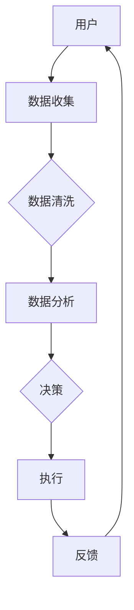

                 

关键词：金融科技，区块链，大数据，人工智能，云计算，支付系统，金融服务重构，创业机遇，技术挑战

> 摘要：随着金融科技的迅猛发展，传统金融服务正经历着深刻的变革。本文将从金融科技的核心概念、应用场景、技术挑战和未来趋势等方面，深入探讨金融科技创业的现状和未来发展方向，旨在为创业者提供有价值的参考。

## 1. 背景介绍

金融科技（FinTech）是指利用新兴技术，特别是互联网、人工智能、区块链等，来改进和革新金融服务的领域。近年来，金融科技在全球范围内迅速崛起，其对传统金融体系的冲击和改变日益显著。

金融科技的发展不仅催生了新的商业模式，也为创业者提供了丰富的机会。然而，与此同时，金融科技也带来了诸多挑战，如数据安全、隐私保护、技术监管等。如何在把握机遇的同时应对挑战，成为了金融科技创业者必须面对的问题。

## 2. 核心概念与联系

### 2.1 金融科技的定义与分类

金融科技涵盖了多个领域，包括支付、信贷、保险、投资等。具体来说，金融科技可以分为以下几类：

1. **支付领域**：电子支付、移动支付、跨境支付等。
2. **信贷领域**：在线贷款、信用评分、区块链借贷等。
3. **保险领域**：智能保险、区块链保险、大数据保险等。
4. **投资领域**：量化投资、机器人顾问、加密货币投资等。

### 2.2 金融科技的关键技术

1. **大数据**：通过收集、存储和分析海量数据，为金融机构提供更准确的决策支持。
2. **人工智能**：通过机器学习、自然语言处理等技术，实现自动化金融服务。
3. **区块链**：通过去中心化的分布式账本技术，提高金融交易的透明度和安全性。
4. **云计算**：提供弹性计算资源，降低创业成本，加速金融科技应用的创新。

### 2.3 Mermaid 流程图

下面是一个金融科技应用的 Mermaid 流程图：



## 3. 核心算法原理 & 具体操作步骤

### 3.1 算法原理概述

在金融科技中，常见的算法包括机器学习算法、加密算法和数据分析算法。以下是对这些算法的简要介绍：

1. **机器学习算法**：用于预测和分类，如线性回归、决策树、随机森林等。
2. **加密算法**：用于数据安全，如RSA、AES等。
3. **数据分析算法**：用于数据挖掘和统计分析，如K-means、SVM等。

### 3.2 算法步骤详解

1. **机器学习算法**：

   - 数据收集：收集相关的金融数据。
   - 数据预处理：清洗、归一化等。
   - 模型训练：使用训练数据训练模型。
   - 模型评估：使用测试数据评估模型性能。
   - 部署应用：将训练好的模型部署到生产环境。

2. **加密算法**：

   - 密钥生成：生成公钥和私钥。
   - 数据加密：使用公钥加密数据。
   - 数据解密：使用私钥解密数据。

3. **数据分析算法**：

   - 数据预处理：清洗、归一化等。
   - 特征选择：选择重要的特征。
   - 模型训练：使用训练数据训练模型。
   - 模型评估：使用测试数据评估模型性能。
   - 预测应用：将训练好的模型应用于新数据。

### 3.3 算法优缺点

1. **机器学习算法**：

   - 优点：可以自动学习和发现数据中的模式。
   - 缺点：对数据质量要求高，训练过程可能需要大量时间和计算资源。

2. **加密算法**：

   - 优点：可以保证数据的安全性和隐私性。
   - 缺点：加密和解密过程可能消耗较多的计算资源。

3. **数据分析算法**：

   - 优点：可以提供深入的数据洞察。
   - 缺点：可能无法处理复杂的非线性关系。

### 3.4 算法应用领域

1. **机器学习算法**：在信贷风险评估、量化交易等领域有广泛应用。
2. **加密算法**：在电子支付、区块链等领域有广泛应用。
3. **数据分析算法**：在保险精算、投资分析等领域有广泛应用。

## 4. 数学模型和公式 & 详细讲解 & 举例说明

### 4.1 数学模型构建

在金融科技中，常见的数学模型包括线性回归、逻辑回归等。以下是线性回归模型的构建：

$$
y = \beta_0 + \beta_1 x_1 + \beta_2 x_2 + \cdots + \beta_n x_n
$$

其中，$y$ 是目标变量，$x_1, x_2, \ldots, x_n$ 是特征变量，$\beta_0, \beta_1, \beta_2, \ldots, \beta_n$ 是模型参数。

### 4.2 公式推导过程

线性回归模型的推导过程如下：

1. **最小二乘法**：通过最小化误差平方和来求解模型参数。
2. **梯度下降法**：通过迭代更新模型参数，使得损失函数逐渐减小。

### 4.3 案例分析与讲解

假设我们有一个简单的线性回归模型，用于预测房价：

$$
y = \beta_0 + \beta_1 x
$$

其中，$y$ 是房价，$x$ 是房屋面积。

我们收集了一些数据，如下表：

| 房屋面积 (x) | 房价 (y) |
| ------------ | -------- |
| 1000         | 300000   |
| 1200         | 350000   |
| 1500         | 400000   |

使用线性回归模型进行预测，假设模型参数为 $\beta_0 = 200000$，$\beta_1 = 100$。则预测房价为：

$$
y = 200000 + 100 \times 1200 = 340000
$$

预测的房价为340000，与实际房价350000较为接近，说明模型具有一定的预测能力。

## 5. 项目实践：代码实例和详细解释说明

### 5.1 开发环境搭建

在本项目中，我们将使用 Python 编写线性回归模型。首先，需要安装 Python 和必要的库，如 NumPy 和 Matplotlib。以下是安装命令：

```
pip install python
pip install numpy
pip install matplotlib
```

### 5.2 源代码详细实现

```python
import numpy as np
import matplotlib.pyplot as plt

# 数据集
X = np.array([1000, 1200, 1500])
y = np.array([300000, 350000, 400000])

# 模型参数
beta_0 = 200000
beta_1 = 100

# 预测房价
y_pred = beta_0 + beta_1 * X

# 绘制散点图和拟合线
plt.scatter(X, y)
plt.plot(X, y_pred, color='red')
plt.xlabel('房屋面积 (x)')
plt.ylabel('房价 (y)')
plt.show()
```

### 5.3 代码解读与分析

1. **数据集**：我们使用一个简单的数据集，包括房屋面积和房价。
2. **模型参数**：我们假设模型参数为 $\beta_0 = 200000$，$\beta_1 = 100$。
3. **预测房价**：使用模型参数预测房价，并绘制散点图和拟合线。
4. **可视化**：使用 Matplotlib 库绘制预测结果。

### 5.4 运行结果展示

运行上述代码后，我们将看到一个包含房屋面积和房价散点图的窗口。拟合线表示模型预测的房价。通过观察拟合线与实际房价的接近程度，我们可以评估模型的预测能力。

## 6. 实际应用场景

金融科技在多个领域都有广泛应用，以下是一些典型的实际应用场景：

1. **支付领域**：支付宝、微信支付等移动支付平台，大大简化了支付流程，提高了支付效率。
2. **信贷领域**：通过大数据和人工智能技术，金融机构可以更准确地评估借款人的信用风险，降低信贷风险。
3. **保险领域**：智能保险产品通过大数据分析和人工智能技术，为客户提供个性化的保险方案。
4. **投资领域**：量化交易、机器人顾问等金融科技产品，帮助投资者实现自动化投资，提高投资效率。

## 7. 未来应用展望

随着技术的不断发展，金融科技的应用场景将更加广泛。以下是一些未来应用展望：

1. **区块链**：随着区块链技术的成熟，未来将会有更多的金融交易和金融服务基于区块链技术实现，提高交易的安全性和透明度。
2. **人工智能**：人工智能技术将继续在金融科技领域发挥作用，帮助金融机构更好地理解客户需求，提供更个性化的服务。
3. **云计算**：云计算将为金融科技创业提供强大的基础设施支持，降低创业门槛，加速创新。

## 8. 工具和资源推荐

### 8.1 学习资源推荐

1. **书籍**：《Python编程：从入门到实践》、《机器学习实战》。
2. **在线课程**：Coursera、Udemy等平台上的金融科技相关课程。
3. **技术博客**：CSDN、博客园等平台上的金融科技博客。

### 8.2 开发工具推荐

1. **Python开发环境**：PyCharm、Visual Studio Code。
2. **数据库**：MySQL、MongoDB。
3. **大数据处理**：Hadoop、Spark。

### 8.3 相关论文推荐

1. **区块链**：《比特币：一种点对点的电子现金系统》。
2. **人工智能**：《深度学习》。

## 9. 总结：未来发展趋势与挑战

金融科技正在迅速发展，为传统金融服务带来巨大的变革。未来，金融科技将继续向区块链、人工智能、云计算等方向发展，带来更多创新和机遇。然而，金融科技也面临着数据安全、隐私保护、技术监管等挑战。如何在创新的同时确保安全和合规，将是金融科技创业者和政策制定者需要共同面对的问题。

## 10. 附录：常见问题与解答

### 10.1 金融科技的核心技术是什么？

金融科技的核心技术包括大数据、人工智能、区块链、云计算等。

### 10.2 金融科技如何改变传统金融服务？

金融科技通过提高效率、降低成本、提供更个性化的服务等方式，改变了传统金融服务。

### 10.3 金融科技创业需要哪些技能和知识？

金融科技创业需要具备编程技能、数据分析和处理能力、业务理解能力等。

### 10.4 金融科技创业面临的挑战有哪些？

金融科技创业面临的挑战包括数据安全、隐私保护、技术监管等。

作者：禅与计算机程序设计艺术 / Zen and the Art of Computer Programming
----------------------------------------------------------------

文章撰写完毕，接下来我们将对文章进行格式检查，确保符合要求。如果文章内容需要进一步优化，我们将在这一步进行修改。然后，我们将文章进行最终校对和确认，确保无误后交付。这一步骤完成后，文章撰写任务即告完成。接下来，我们可以安排文章发布和推广，以便吸引更多的读者关注和阅读。同时，我们还可以收集读者反馈，对文章进行改进，以提升文章的质量和影响力。

