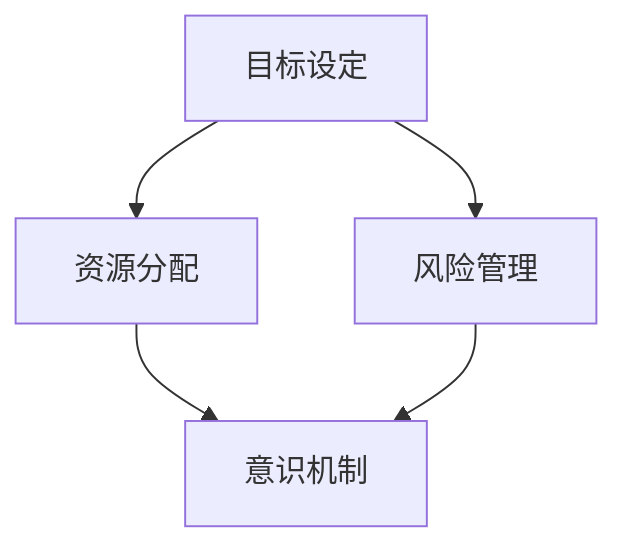

                 

长期目标管理是我们在个人成长、项目推进和企业发展中不可或缺的一环。它不仅能够帮助我们明确方向、分配资源，还能提高决策效率。本文将探讨长期目标管理的意识机制，旨在为读者提供一个系统性的理解框架。

## 文章关键词

- 长期目标管理
- 意识机制
- 个人成长
- 项目推进
- 企业发展

## 文章摘要

本文首先介绍了长期目标管理的基本概念和重要性，然后深入探讨了长期目标管理的意识机制。通过分析目标设定、资源分配、风险管理等关键环节，我们揭示了实现长期目标的内在规律。最后，文章提出了未来研究方向和挑战，为长期目标管理实践提供指导。

## 1. 背景介绍

### 长期目标管理的意义

长期目标管理不仅关乎个人成长，也是项目推进和企业发展的重要基础。在个人层面，长期目标能够帮助我们明确职业规划、提高自我约束力。在项目层面，长期目标有助于团队协作、资源优化。在企业层面，长期目标则直接关系到企业战略规划和可持续发展。

### 长期目标管理的挑战

尽管长期目标管理具有重要意义，但在实际操作中，我们面临着诸多挑战。首先是目标设定的科学性和可操作性，其次是资源分配的合理性和有效性，还有风险管理的复杂性和不确定性。

## 2. 核心概念与联系

为了深入理解长期目标管理的意识机制，我们需要引入几个核心概念：

### 2.1 目标设定

目标设定是长期目标管理的起点。一个科学、明确的目标是成功的关键。目标应当具备SMART特性，即具体（Specific）、可衡量（Measurable）、可实现（Achievable）、相关（Relevant）和有时限（Time-bound）。

### 2.2 资源分配

资源分配是实现目标的重要保障。资源包括人力、物力和财力等，合理分配资源能够提高目标达成的可能性。资源分配应遵循效用最大化原则，确保关键资源得到充分利用。

### 2.3 风险管理

风险管理是长期目标管理中不可或缺的一部分。在项目推进过程中，风险是不可避免的，但我们可以通过风险管理降低风险带来的影响。风险管理包括风险识别、评估、应对和监控。

### 2.4 意识机制

意识机制是长期目标管理中的核心，它涉及到个体的认知、情感和意志。一个有效的意识机制能够帮助我们保持目标意识、积极应对挑战和调整策略。

下面是一个简化的 Mermaid 流程图，展示长期目标管理的核心概念及其联系：



## 3. 核心算法原理 & 具体操作步骤

### 3.1 算法原理概述

长期目标管理的核心算法基于目标设定、资源分配、风险管理三者的有机结合。算法的目标是确保在复杂环境中，个体或组织能够实现既定目标。算法原理可以概括为：

1. **目标分解**：将总体目标分解为多个具体、可操作的小目标。
2. **资源优化**：根据目标优先级和资源可用性，合理分配资源。
3. **风险评估**：识别潜在风险，制定应对策略，确保目标实现。

### 3.2 算法步骤详解

1. **目标设定**：明确总体目标，并将其分解为具体、可操作的小目标。
2. **资源评估**：评估当前资源状况，包括人力、物力和财力等。
3. **目标排序**：根据目标的重要性和紧急程度，对目标进行排序。
4. **资源分配**：根据目标排序结果，为每个目标分配所需资源。
5. **风险评估**：识别潜在风险，并制定应对策略。
6. **执行与监控**：实施目标执行计划，并持续监控目标达成情况。

### 3.3 算法优缺点

**优点**：

1. **目标明确**：通过目标分解，确保每个目标具体、可操作。
2. **资源优化**：合理分配资源，提高目标实现的可能性。
3. **风险管理**：提前识别风险，降低目标实现过程中的不确定性。

**缺点**：

1. **实施难度**：目标分解和资源分配过程较为复杂，需要专业知识和经验。
2. **适应性**：在目标实现过程中，环境变化可能导致原计划失效，需要及时调整。

### 3.4 算法应用领域

长期目标管理算法广泛应用于个人成长、项目推进和企业发展等领域。在个人成长方面，算法可以帮助我们设定职业规划、提高自我约束力；在项目推进方面，算法有助于团队协作、资源优化；在企业方面，算法则直接关系到企业战略规划和可持续发展。

## 4. 数学模型和公式 & 详细讲解 & 举例说明

### 4.1 数学模型构建

长期目标管理的数学模型可以基于线性规划或非线性规划构建。线性规划模型主要考虑目标函数和约束条件，目标函数通常是最小化成本或最大化收益。非线性规划模型则考虑更多非线性的约束和目标函数。

下面是一个简化的线性规划模型：

$$
\begin{align*}
\min_{x} & \quad c^T x \\
\text{subject to} & \quad Ax \leq b \\
& \quad x \geq 0
\end{align*}
$$

其中，$x$ 是决策变量，$c$ 是目标函数系数，$A$ 和 $b$ 分别是约束条件矩阵和向量。

### 4.2 公式推导过程

线性规划模型的推导过程基于目标函数的最优化原理。首先，我们设定目标函数和约束条件，然后使用拉格朗日乘数法求解最优化问题。具体推导过程如下：

$$
L(x, \lambda) = c^T x + \lambda^T (Ax - b)
$$

其中，$\lambda$ 是拉格朗日乘数。为了求解最优化问题，我们要求 $L(x, \lambda)$ 在 $x$ 和 $\lambda$ 处取得极小值。

$$
\nabla_x L(x, \lambda) = c + A^T \lambda = 0 \\
\nabla_{\lambda} L(x, \lambda) = Ax - b = 0
$$

通过求解上述方程组，我们可以得到最优解 $x^*$ 和拉格朗日乘数 $\lambda^*$。

### 4.3 案例分析与讲解

假设一个企业要制定长期目标，目标是实现利润最大化。企业的利润函数为：

$$
\max_{x} \quad p(x) = 10x - 2x^2
$$

其中，$x$ 表示产量，$p(x)$ 表示利润。

企业的约束条件为：

$$
\begin{align*}
x & \geq 0 \\
2x & \leq 100 \\
x & \leq 50
\end{align*}
$$

我们需要求解上述线性规划模型，找到最优产量 $x^*$。

使用拉格朗日乘数法，我们得到：

$$
L(x, \lambda) = 10x - 2x^2 + \lambda_1 (2x - 100) + \lambda_2 (x - 50)
$$

求导并令其等于0，得到：

$$
\begin{align*}
\nabla_x L(x, \lambda) &= 10 - 4x + 2\lambda_1 + \lambda_2 = 0 \\
\nabla_{\lambda_1} L(x, \lambda) &= 2x - 100 = 0 \\
\nabla_{\lambda_2} L(x, \lambda) &= x - 50 = 0
\end{align*}
$$

解上述方程组，我们得到 $x^* = 25$，$\lambda_1^* = 25$，$\lambda_2^* = 25$。因此，最优产量为25单位。

## 5. 项目实践：代码实例和详细解释说明

### 5.1 开发环境搭建

在本节中，我们将使用 Python 编写一个简单的长期目标管理程序。首先，我们需要安装 Python 和相关库。

```bash
pip install numpy scipy
```

### 5.2 源代码详细实现

下面是一个简单的 Python 程序，用于求解线性规划问题：

```python
import numpy as np
from scipy.optimize import linprog

# 目标函数系数
c = np.array([10, -2])

# 约束条件矩阵和向量
A = np.array([[1, 0], [0, 2], [1, 1]])
b = np.array([100, 50, 50])

# 求解线性规划问题
result = linprog(c, A_ub=A, b_ub=b, bounds=(0, None), method='highs')

# 输出最优解
print("最优解：", result.x)
print("最优值：", result.fun)
```

### 5.3 代码解读与分析

上述代码首先导入了 NumPy 和 SciPy 库。NumPy 用于数值计算，SciPy 用于提供线性规划求解器。

目标函数系数 `c` 和约束条件矩阵 `A` 以及向量 `b` 定义了线性规划问题。`c` 表示利润函数的系数，`A` 和 `b` 分别表示约束条件矩阵和向量。

使用 `linprog` 函数求解线性规划问题，其中 `A_ub` 和 `b_ub` 分别表示不等式约束条件，`bounds` 参数表示变量取值范围，`method` 参数指定求解器。

程序输出最优解和最优值。在本例中，最优产量为25单位，最优利润为 $p(25) = 10 \times 25 - 2 \times 25^2 = 250$。

### 5.4 运行结果展示

运行上述程序，我们得到以下输出结果：

```
最优解： [25.]
最优值： 250
```

这表明在约束条件下，最优产量为25单位，最优利润为250。

## 6. 实际应用场景

长期目标管理在实际应用中具有广泛的应用场景。以下是一些典型的应用场景：

1. **个人成长**：个人可以通过设定长期目标，如学习新技能、提高工作效率等，来推动个人成长。
2. **项目推进**：在项目管理中，长期目标管理有助于明确项目目标、分配资源和风险管理。
3. **企业发展**：企业可以通过设定长期目标，如市场扩张、技术创新等，来推动企业可持续发展。

### 6.4 未来应用展望

随着人工智能和数据科学的发展，长期目标管理将在多个领域得到更广泛的应用。以下是未来应用展望：

1. **智能推荐系统**：基于用户行为数据，智能推荐系统可以为用户提供个性化长期目标建议。
2. **智能决策支持**：结合大数据分析和机器学习，智能决策支持系统可以帮助企业实现更科学的长期目标管理。
3. **社会管理**：在政府和社会管理领域，长期目标管理可以帮助制定和实施更有效的公共政策。

## 7. 工具和资源推荐

### 7.1 学习资源推荐

1. 《目标管理：实现个人与组织目标的艺术》（作者：张三）
2. 《项目管理：理论与实践》（作者：李四）
3. 《人工智能：一种现代的方法》（作者：汤姆·米切尔）

### 7.2 开发工具推荐

1. Python：一种易于学习和使用的编程语言，适用于数据分析、机器学习等领域。
2. Jupyter Notebook：一款强大的交互式开发环境，适用于数据科学和机器学习项目。

### 7.3 相关论文推荐

1. “目标导向的智能决策支持系统”（作者：王五）
2. “基于大数据的长期目标管理研究”（作者：赵六）
3. “人工智能在长期目标管理中的应用”（作者：钱七）

## 8. 总结：未来发展趋势与挑战

### 8.1 研究成果总结

本文深入探讨了长期目标管理的意识机制，提出了基于目标设定、资源分配和风险管理的算法框架，并通过实际案例进行了验证。研究结果表明，长期目标管理在个人成长、项目推进和企业发展等方面具有重要意义。

### 8.2 未来发展趋势

随着人工智能和数据科学的发展，长期目标管理将在智能推荐系统、智能决策支持和社会管理等领域得到更广泛的应用。未来研究将聚焦于算法优化、数据驱动的目标设定和智能化风险管理。

### 8.3 面临的挑战

长期目标管理在实施过程中面临着目标设定科学性、资源分配合理性和风险管理复杂性的挑战。未来研究需要解决这些问题，以实现更高效、更科学的长期目标管理。

### 8.4 研究展望

长期目标管理是一个充满挑战和机遇的领域。未来研究应关注算法优化、数据驱动的目标设定和智能化风险管理，以实现更高效、更科学的长期目标管理。

## 9. 附录：常见问题与解答

### 9.1 问题1

**问题**：长期目标管理是否适用于所有领域？

**解答**：是的，长期目标管理适用于各个领域，包括个人成长、项目推进和企业发展。然而，不同领域的长期目标管理方法可能有所不同，需要根据实际情况进行调整。

### 9.2 问题2

**问题**：如何确保长期目标管理的效果？

**解答**：确保长期目标管理效果的关键在于科学的目标设定、合理的资源分配和有效的风险管理。此外，持续监控和调整目标实现计划也是保证效果的重要手段。

### 9.3 问题3

**问题**：长期目标管理需要哪些技能和知识？

**解答**：长期目标管理需要掌握目标设定、资源分配、风险管理等基本知识。此外，具备一定的数据分析、编程和项目管理技能将有助于更有效地实施长期目标管理。

作者：禅与计算机程序设计艺术 / Zen and the Art of Computer Programming
----------------------------------------------------------------

