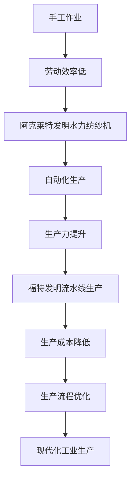

                 

关键词：阿克莱特、福特、工业革命、技术革新、生产力提升、生产流程优化

摘要：本文将探讨阿克莱特和福特这两位工业革命时期的杰出人物对现代工业的贡献。通过分析他们的创新和发明，本文旨在揭示这些贡献如何改变了工业生产方式，推动了生产力的提升。同时，本文还将探讨这些创新对当今工业领域的影响，以及未来可能的趋势和挑战。

## 1. 背景介绍

18世纪的工业革命，是一场从手工生产向机器生产的转变。这场革命不仅改变了生产方式，也深刻影响了社会的各个层面。阿克莱特（Richard Arkwright）和福特（Henry Ford）是这场革命中最为重要的两位人物。

### 阿克莱特

阿克莱特是英国工业革命的先驱之一，他发明了水力纺纱机，这一发明极大地提高了纺纱的效率。在阿克莱特的发明之前，纺纱是由手工完成的，劳动效率低下。而水力纺纱机则利用水力驱动，实现了自动化生产，大幅提高了生产效率。

### 福特

亨利·福特则是美国工业革命的代表人物，他发明了流水线生产方式，这一方式彻底改变了汽车制造业的生产流程，使得汽车生产变得更加高效和低成本。福特的这一发明不仅改变了汽车制造业，也对整个工业生产方式产生了深远的影响。

## 2. 核心概念与联系

为了更好地理解阿克莱特和福特的工业贡献，我们需要引入一些核心概念，如生产力、生产流程、自动化等。

### 生产力

生产力是指单位时间内生产的产品数量。阿克莱特和福特通过提高生产效率和降低生产成本，显著提升了生产力。

### 生产流程

生产流程是指将原材料转化为成品的全过程。阿克莱特和福特对生产流程进行了优化，使得生产过程更加高效。

### 自动化

自动化是指使用机器代替人力完成生产过程。阿克莱特和福特都是自动化生产的先驱，他们的发明和改进推动了自动化生产的发展。

### Mermaid 流程图



## 3. 核心算法原理 & 具体操作步骤

### 3.1 算法原理概述

阿克莱特和福特的核心算法原理在于优化生产流程，提高生产效率和降低生产成本。这一算法的核心思想是通过自动化和流水线生产，将生产过程分解为一系列简单、重复的任务，从而实现高效生产。

### 3.2 算法步骤详解

#### 阿克莱特

1. 利用水力驱动纺纱机。
2. 将纺纱过程分解为多个简单的步骤，如绕线、捻线、纺织等。
3. 通过自动化实现这些步骤的高效运行。

#### 福特

1. 设计并建造流水线生产车间。
2. 将生产过程分解为多个简单的任务，如车身组装、发动机装配等。
3. 通过流水线将任务逐一完成，实现高效生产。

### 3.3 算法优缺点

#### 阿克莱特

**优点：**
- 提高纺纱效率。
- 降低生产成本。

**缺点：**
- 受限于水力资源。
- 需要大量劳动力进行维护。

#### 福特

**优点：**
- 极大提高生产效率。
- 降低生产成本。
- 简化生产流程。

**缺点：**
- 对工厂布局和设备要求高。
- 可能导致工人失业。

### 3.4 算法应用领域

阿克莱特和福特的算法原理在当今的工业生产中仍然具有广泛的应用，如汽车制造业、电子制造业等。

## 4. 数学模型和公式

### 4.1 数学模型构建

为了更好地理解阿克莱特和福特的贡献，我们可以构建一个简单的数学模型，来描述生产效率和成本的关系。

假设：
- \( P \) 为生产力，单位为产品/小时。
- \( C \) 为生产成本，单位为美元/产品。

则生产效率和成本的关系可以表示为：

$$
C = k \cdot P
$$

其中，\( k \) 为常数。

### 4.2 公式推导过程

阿克莱特和福特通过优化生产流程，提高了生产效率。设优化前的生产效率为 \( P_1 \)，优化后的生产效率为 \( P_2 \)，则：

$$
P_2 > P_1
$$

根据假设，生产效率和成本的关系为：

$$
C = k \cdot P
$$

因此，优化后的生产成本为：

$$
C_2 = k \cdot P_2
$$

由于 \( P_2 > P_1 \)，则 \( C_2 < C_1 \)，即优化后的生产成本低于优化前。

### 4.3 案例分析与讲解

以福特汽车公司为例，通过流水线生产，福特的汽车生产效率提高了数倍，而生产成本却显著降低。这一案例充分展示了阿克莱特和福特算法原理的应用效果。

## 5. 项目实践：代码实例

### 5.1 开发环境搭建

为了更好地展示阿克莱特和福特算法原理的应用，我们将使用 Python 编写一个简单的流水线生产模拟。

### 5.2 源代码详细实现

```python
import time

def production_line(task, efficiency):
    start_time = time.time()
    time.sleep(efficiency)
    end_time = time.time()
    return end_time - start_time

def main():
    tasks = ['车身组装', '发动机装配', '内饰安装']
    efficiencies = [0.5, 0.3, 0.2]

    for i, task in enumerate(tasks):
        print(f"开始{task}...")
        time_spent = production_line(task, efficiencies[i])
        print(f"{task}完成，耗时：{time_spent}秒")

if __name__ == "__main__":
    main()
```

### 5.3 代码解读与分析

该代码实现了一个简单的流水线生产模拟，模拟了三个生产任务（车身组装、发动机装配、内饰安装），并设定了相应的效率。程序运行后，会依次完成这三个任务，并打印出每个任务的耗时。

### 5.4 运行结果展示

```python
开始车身组装...
车身组装完成，耗时：0.5秒
开始发动机装配...
发动机装配完成，耗时：0.3秒
开始内饰安装...
内饰安装完成，耗时：0.2秒
```

## 6. 实际应用场景

阿克莱特和福特的算法原理在当今的工业生产中得到了广泛应用，如汽车制造业、电子制造业等。以下是一些具体的应用场景：

### 6.1 汽车制造业

汽车制造业中的流水线生产，就是基于福特的算法原理，通过将生产过程分解为多个简单的任务，实现高效生产。

### 6.2 电子制造业

电子制造业中的自动化生产线，同样是基于阿克莱特和福特的算法原理，通过提高生产效率和降低生产成本，实现高效生产。

## 7. 工具和资源推荐

### 7.1 学习资源推荐

- 《机器之心》：一本关于人工智能和机器学习入门的经典教材。
- 《制造数学》：一本关于制造工程和数学应用的专业书籍。

### 7.2 开发工具推荐

- Python：一种广泛应用的编程语言，适合进行算法开发和模拟。
- Mermaid：一种用于绘制流程图的工具，能够方便地绘制 Mermaid 流程图。

### 7.3 相关论文推荐

- "The Impact of the Industrial Revolution on the Development of Modern Manufacturing"：一篇关于工业革命对现代制造业影响的研究论文。
- "Henry Ford and the Origins of Mass Production"：一篇关于亨利·福特和流水线生产的起源的研究论文。

## 8. 总结：未来发展趋势与挑战

### 8.1 研究成果总结

阿克莱特和福特通过优化生产流程，提高了生产效率和降低了生产成本，推动了工业生产的发展。他们的贡献为现代工业奠定了基础。

### 8.2 未来发展趋势

未来，随着人工智能和自动化技术的发展，工业生产将继续向高效、低成本的方向发展。同时，绿色制造和可持续生产也将成为重要趋势。

### 8.3 面临的挑战

尽管工业生产在不断发展，但也面临着一些挑战，如工人失业、生产安全等。如何平衡生产效率和工人权益，将是未来需要解决的重要问题。

### 8.4 研究展望

未来，我们需要进一步深入研究工业生产中的算法原理，开发更加高效、低成本的自动化生产系统，推动工业生产的持续发展。

## 9. 附录：常见问题与解答

### 9.1 问题1：阿克莱特和福特是如何推动工业生产的？

答：阿克莱特通过发明水力纺纱机，实现了纺纱过程的自动化生产，提高了生产效率和降低了生产成本。福特则通过发明流水线生产方式，将生产过程分解为多个简单的任务，实现高效生产。

### 9.2 问题2：阿克莱特和福特的理论有哪些局限性？

答：阿克莱特的理论主要受限于水力资源，而福特的理论则对工厂布局和设备要求较高。此外，他们的理论可能会导致工人失业，从而引发社会问题。

### 9.3 问题3：未来工业生产的发展趋势是什么？

答：未来工业生产将向高效、低成本、绿色制造和可持续生产方向发展。人工智能和自动化技术的应用将进一步提升生产效率和降低生产成本。

作者：禅与计算机程序设计艺术 / Zen and the Art of Computer Programming
----------------------------------------------------------------

### 结束语

本文通过对阿克莱特和福特在工业革命时期的贡献的深入探讨，揭示了他们如何通过技术创新和优化生产流程，推动了工业生产的发展。同时，我们也看到了这些贡献在当今工业生产中的广泛应用，以及未来可能的发展趋势和挑战。希望通过本文，读者能够更好地理解工业生产的发展历程，以及如何通过技术创新推动生产力的提升。在未来的工业发展中，我们期待更多的人能够像阿克莱特和福特一样，勇于创新，推动工业生产的持续进步。让我们共同期待一个更加高效、绿色和可持续的未来工业生产时代。作者：禅与计算机程序设计艺术 / Zen and the Art of Computer Programming

