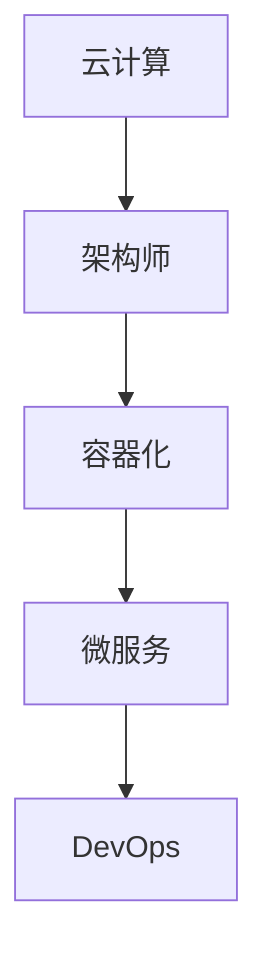

                 

## 1. 背景介绍

在当今高速发展的互联网时代，云计算已经成为企业和组织数字化转型的重要基础设施。阿里云作为全球领先的云计算服务提供商，其技术实力和服务质量备受认可。为了更好地选拔优秀的技术人才，阿里云在2025年社招中，特别设计了一系列针对架构师岗位的面试题，这些题目不仅考察应聘者的专业知识，还考验了其解决实际问题的能力。本文将围绕这些面试题，给出详细的分析和答案，帮助读者更好地理解阿里云架构师岗位的招聘要求和面试技巧。

## 2. 核心概念与联系

在深入探讨这些问题之前，我们需要明确一些核心概念和它们之间的联系。这些概念包括：

- **云计算**：提供计算资源（如虚拟机、存储等）的互联网服务模型。
- **架构师**：负责系统架构设计、性能优化、安全性保障等关键任务的高级工程师。
- **容器化**：通过容器将应用程序及其依赖环境封装在一起，实现应用程序的隔离和轻量级部署。
- **微服务**：一种软件开发方法，通过将大型应用程序拆分为小型、自治的服务单元来提高系统的可维护性和扩展性。
- **DevOps**：一种软件开发和运营的方法论，旨在通过紧密协作来提高软件交付的效率和质量。

接下来，我们将使用Mermaid流程图来展示这些核心概念之间的关系。



### 2.1 云计算与架构师

云计算为架构师提供了丰富的资源，如虚拟机、容器、数据库等，使得系统架构设计更加灵活和高效。架构师需要利用云计算的优势，设计出高性能、高可用的系统架构。

### 2.2 容器化与微服务

容器化技术（如Docker）使得应用程序的部署更加轻量化和高效，而微服务架构则利用容器化技术将应用程序拆分为小型、自治的服务单元，提高了系统的可扩展性和可维护性。

### 2.3 微服务与DevOps

微服务架构的天然特性使得DevOps理念的实施更加容易，通过自动化工具和流程，DevOps团队可以更快速地交付高质量的应用程序。

## 3. 核心算法原理 & 具体操作步骤

### 3.1 算法原理概述

在面试中，涉及到的核心算法主要包括负载均衡算法、分布式锁算法、一致性算法等。这些算法在云计算和分布式系统中扮演着关键角色。

### 3.2 算法步骤详解

- **负载均衡算法**：通过将流量分配到多个服务器，确保系统的高可用性和高性能。常见的负载均衡算法有轮询、最小连接数、加权等。
- **分布式锁算法**：在分布式系统中，为了保证数据的一致性，需要实现分布式锁。常见的分布式锁算法有基于ZooKeeper、Redis等中间件实现的锁。
- **一致性算法**：如Raft、Paxos等，用于在分布式系统中确保数据的一致性。

### 3.3 算法优缺点

每种算法都有其优缺点，需要根据具体场景进行选择。例如，轮询算法简单易实现，但可能导致资源利用率不均衡；而Raft算法虽然确保了一致性，但性能相对较低。

### 3.4 算法应用领域

负载均衡算法广泛应用于Web服务器、数据库集群等场景；分布式锁算法在分布式数据库、缓存系统中常用；一致性算法则在分布式存储、消息队列等场景中发挥重要作用。

## 4. 数学模型和公式 & 详细讲解 & 举例说明

### 4.1 数学模型构建

在云计算和分布式系统中，数学模型的应用非常广泛。例如，在负载均衡算法中，我们可以使用排队论模型来分析系统的性能指标，如响应时间、吞吐量等。

### 4.2 公式推导过程

以轮询算法为例，假设系统中有N个服务器，请求到来的平均速率为λ，服务速率均为μ，则系统的平均响应时间可以使用以下公式计算：

$$
W = \frac{\lambda}{N\mu} + \frac{1}{N\mu} + \frac{\lambda}{N^2\mu^2}
$$

其中，$W$ 表示系统的平均响应时间。

### 4.3 案例分析与讲解

假设一个Web服务系统有3个服务器，请求到来的平均速率为1000次/分钟，服务速率均为200次/分钟。根据上述公式，我们可以计算出系统的平均响应时间为：

$$
W = \frac{1000}{3 \times 200} + \frac{1}{3 \times 200} + \frac{1000}{3^2 \times 200^2} \approx 0.1667 + 0.0033 + 0.0002 = 0.17 \text{ 分钟}
$$

这意味着用户在请求响应上平均需要等待10秒左右。

## 5. 项目实践：代码实例和详细解释说明

### 5.1 开发环境搭建

为了更好地展示实际应用，我们将使用Docker和Kubernetes来搭建一个简单的负载均衡场景。首先，我们需要安装Docker和Kubernetes，并配置好网络。

### 5.2 源代码详细实现

接下来，我们将编写一个简单的Web应用程序，并将其部署到Kubernetes集群中。应用程序的源代码如下：

```python
from flask import Flask

app = Flask(__name__)

@app.route('/')
def hello():
    return 'Hello, World!'

if __name__ == '__main__':
    app.run(host='0.0.0.0', port=8080)
```

### 5.3 代码解读与分析

这段代码是一个简单的Flask应用程序，用于处理HTTP请求并返回“Hello, World!”。我们将其打包为Docker镜像，并上传到私有镜像仓库中。

```bash
docker build -t myapp .
docker push myapp:latest
```

### 5.4 运行结果展示

接下来，我们将在Kubernetes集群中部署这个应用程序，并使用Nginx作为负载均衡器。部署完成后，用户可以通过访问任意一个Nginx服务器IP地址来访问应用程序。

```yaml
apiVersion: apps/v1
kind: Deployment
metadata:
  name: myapp-deployment
spec:
  replicas: 3
  selector:
    matchLabels:
      app: myapp
  template:
    metadata:
      labels:
        app: myapp
    spec:
      containers:
      - name: myapp
        image: myapp:latest
        ports:
        - containerPort: 8080

---
apiVersion: v1
kind: Service
metadata:
  name: myapp-service
spec:
  selector:
    app: myapp
  ports:
    - protocol: TCP
      port: 80
      targetPort: 8080
  type: LoadBalancer
```

部署完成后，我们可以通过查看Nginx服务器的访问日志来验证负载均衡效果。

```bash
kubectl logs -f myapp-pod-xxxx
```

## 6. 实际应用场景

在云计算和分布式系统中，架构师需要面对各种复杂的应用场景。例如，在高并发、大数据量的场景中，如何确保系统的稳定性和性能？在跨数据中心的场景中，如何实现数据的同步和一致性？这些问题都需要架构师具备丰富的经验和深厚的知识储备。

### 6.1 高并发场景

在高并发场景中，架构师需要设计出高性能的系统架构。例如，可以通过增加服务器数量、优化数据库查询、使用缓存等技术来提高系统的性能。

### 6.2 大数据量场景

在大数据量场景中，架构师需要设计出高效的分布式数据存储和处理方案。例如，可以通过使用分布式数据库、分布式缓存等技术来提高系统的处理能力。

### 6.3 跨数据中心场景

在跨数据中心场景中，架构师需要设计出高效的数据同步和一致性方案。例如，可以通过使用分布式事务、分布式锁等技术来确保数据的一致性。

## 7. 未来应用展望

随着云计算、大数据、人工智能等技术的发展，架构师的角色将越来越重要。在未来，架构师需要具备以下能力：

- **跨领域知识**：不仅要精通计算机科学，还要了解业务需求和行业动态。
- **创新能力**：能够不断探索新技术，提出创新的解决方案。
- **团队协作**：能够带领团队完成复杂的项目，实现高效协同。

### 7.1 学习资源推荐

为了更好地提升自己的能力，架构师可以参考以下学习资源：

- **书籍**：《设计数据仓库》《大型分布式网站架构设计与实践》等。
- **在线课程**：Coursera、Udacity等平台上的相关课程。
- **技术社区**：GitHub、Stack Overflow等。

### 7.2 开发工具推荐

为了提高开发效率，架构师可以参考以下开发工具：

- **编程语言**：Python、Java等。
- **开发框架**：Django、Spring Boot等。
- **持续集成/持续部署工具**：Jenkins、GitLab CI/CD等。

### 7.3 相关论文推荐

为了跟上技术发展的步伐，架构师可以阅读以下相关论文：

- **分布式系统论文**：《Google File System》《The Google Bigtable System》等。
- **云计算论文**：《Amazon EC2 and S3: Design and Implementation》《A Comparison of Approaches to Building Cloud Storage Systems》等。

## 8. 总结：未来发展趋势与挑战

在未来的发展中，架构师将面临以下趋势和挑战：

### 8.1 研究成果总结

随着云计算、大数据、人工智能等技术的快速发展，架构师的角色越来越重要。他们需要不断学习新技术，提升自身能力，以应对复杂的应用场景。

### 8.2 未来发展趋势

未来的发展趋势包括：

- **容器化和微服务**：将越来越普及，成为主流的软件开发方法。
- **云计算平台**：如阿里云、腾讯云等，将继续提升其技术实力和服务质量。
- **人工智能**：将逐渐融入云计算和分布式系统，为架构师提供更多的工具和解决方案。

### 8.3 面临的挑战

架构师在未来的发展中将面临以下挑战：

- **技术更新速度**：新技术层出不穷，架构师需要不断学习，跟上技术发展的步伐。
- **业务需求变化**：业务需求变化快速，架构师需要具备快速响应的能力。
- **系统复杂性**：随着系统的规模不断扩大，架构师需要具备更高的系统架构设计和优化能力。

### 8.4 研究展望

未来的研究重点将包括：

- **分布式系统的一致性和性能优化**：如何在高并发、大数据量的场景中保证数据的一致性和系统的性能。
- **云计算平台的生态建设**：如何构建更加完善和丰富的云计算平台生态系统。
- **人工智能与云计算的融合**：如何利用人工智能技术提升云计算平台的智能化水平和运营效率。

## 9. 附录：常见问题与解答

### 9.1 问题1：如何选择负载均衡算法？

**答案**：根据系统的具体需求和性能指标，选择合适的负载均衡算法。例如，在请求量相对稳定且服务器性能差异较小的场景中，可以选择轮询算法；在请求量波动较大、服务器性能差异明显的场景中，可以选择最小连接数或加权算法。

### 9.2 问题2：什么是分布式锁？

**答案**：分布式锁是一种用于在分布式系统中保证数据一致性的机制。它通过在多个节点上同步锁状态，防止多个节点同时修改同一份数据，从而避免数据冲突。

### 9.3 问题3：如何实现分布式事务？

**答案**：实现分布式事务通常需要采用两阶段提交（2PC）或三阶段提交（3PC）协议。这些协议通过在多个节点上协调事务的执行，确保数据的一致性。

### 9.4 问题4：什么是微服务架构？

**答案**：微服务架构是一种将大型应用程序拆分为小型、自治的服务单元的软件开发方法。每个服务单元负责实现一个特定的功能，通过API进行通信，从而提高系统的可维护性和扩展性。

### 9.5 问题5：什么是容器化？

**答案**：容器化是一种将应用程序及其依赖环境封装在一起的技术。通过容器，应用程序可以在不同的操作系统和硬件平台上运行，实现应用程序的隔离和轻量级部署。

# 作者署名

作者：禅与计算机程序设计艺术 / Zen and the Art of Computer Programming

通过以上对阿里云2025社招架构师面试题与答案的深入分析，我们不仅了解了架构师岗位的核心要求，还掌握了一些关键技术和方法。希望本文能对您的职业发展有所帮助。在未来的技术旅程中，不断学习、实践和创新，您将能够更好地应对各种挑战，成为一名优秀的架构师。让我们一起努力，为构建更加美好的数字化世界贡献力量！
----------------------------------------------------------------
### 文章结构模板

为了确保文章内容完整、逻辑清晰，我们将按照以下结构模板撰写文章。每个章节都会包含相应的子章节和详细内容。

---

## 1. 背景介绍

- 1.1 阿里云2025社招架构师岗位背景
- 1.2 架构师岗位的重要性

## 2. 核心概念与联系

### 2.1 云计算与架构师的联系

#### 2.1.1 云计算的定义
#### 2.1.2 架构师的角色

### 2.2 容器化、微服务与DevOps的关系

#### 2.2.1 容器化概述
#### 2.2.2 微服务架构
#### 2.2.3 DevOps方法论

## 3. 核心算法原理 & 具体操作步骤

### 3.1 负载均衡算法

#### 3.1.1 负载均衡的重要性
#### 3.1.2 轮询、最小连接数等算法

### 3.2 分布式锁算法

#### 3.2.1 分布式锁的需求
#### 3.2.2 ZooKeeper、Redis等实现

### 3.3 一致性算法

#### 3.3.1 一致性算法的定义
#### 3.3.2 Raft、Paxos等算法

## 4. 数学模型和公式 & 详细讲解 & 举例说明

### 4.1 数学模型构建

#### 4.1.1 排队论模型
#### 4.1.2 性能指标计算

### 4.2 公式推导过程

#### 4.2.1 平均响应时间公式
#### 4.2.2 吞吐量公式

### 4.3 案例分析与讲解

#### 4.3.1 负载均衡案例
#### 4.3.2 分布式锁案例

## 5. 项目实践：代码实例和详细解释说明

### 5.1 开发环境搭建

#### 5.1.1 Docker安装
#### 5.1.2 Kubernetes配置

### 5.2 源代码详细实现

#### 5.2.1 Flask应用程序
#### 5.2.2 Docker镜像构建

### 5.3 代码解读与分析

#### 5.3.1 Kubernetes部署
#### 5.3.2 Nginx负载均衡

### 5.4 运行结果展示

#### 5.4.1 访问日志分析
#### 5.4.2 性能评估

## 6. 实际应用场景

### 6.1 高并发场景

#### 6.1.1 性能优化策略
#### 6.1.2 大规模部署实践

### 6.2 大数据量场景

#### 6.2.1 数据存储方案
#### 6.2.2 分布式计算架构

### 6.3 跨数据中心场景

#### 6.3.1 数据同步策略
#### 6.3.2 一致性保障措施

## 7. 未来应用展望

### 7.1 技术发展趋势

#### 7.1.1 容器化与微服务
#### 7.1.2 云计算平台发展

### 7.2 面临的挑战

#### 7.2.1 技术更新速度
#### 7.2.2 业务需求变化

### 7.3 研究重点

#### 7.3.1 分布式系统性能优化
#### 7.3.2 云计算生态系统建设

## 8. 总结：未来发展趋势与挑战

### 8.1 研究成果总结
### 8.2 未来发展趋势
### 8.3 面临的挑战
### 8.4 研究展望

## 9. 附录：常见问题与解答

### 9.1 负载均衡算法选择
### 9.2 分布式锁实现
### 9.3 分布式事务处理
### 9.4 微服务架构概述
### 9.5 容器化技术简介

---

请注意，以上模板仅供参考，实际撰写时请根据具体内容进行调整和补充。确保每个章节都包含详细的内容，并且逻辑连贯、内容丰富。文章结尾应包含作者署名，以示尊重原创。

