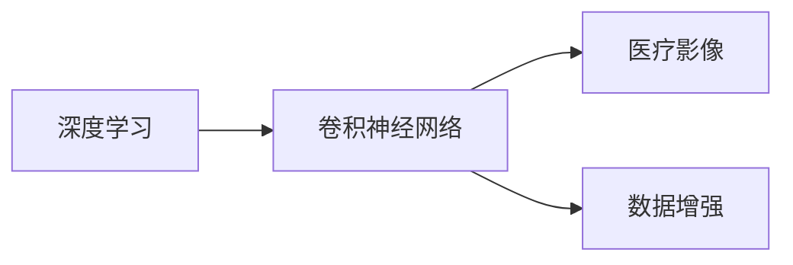

                 

关键词：阿里健康、医疗影像、深度学习、面试题、校招

摘要：本文将针对阿里健康2024年医疗影像分析校招中的深度学习面试题进行深入解析，旨在帮助准备参加校招的同学更好地理解和应对这类面试题目。

## 1. 背景介绍

随着人工智能技术的快速发展，深度学习在医疗领域的应用越来越广泛。阿里健康作为国内领先的医疗健康企业，在2024年的校招中，对深度学习技术有较高的要求。本文将结合阿里健康医疗影像分析的相关面试题目，为大家提供一些建议和解答思路。

### 1.1 阿里健康简介

阿里健康成立于2014年，是阿里巴巴集团旗下的医疗健康公司，致力于打造智慧医疗生态圈。通过大数据、云计算、人工智能等先进技术，阿里健康为用户提供全方位的医疗服务，包括在线问诊、药品配送、健康管理等。

### 1.2 深度学习在医疗影像分析中的应用

深度学习技术在医疗影像分析中具有巨大潜力，可以用于疾病诊断、病理分析、肿瘤检测等领域。阿里健康在医疗影像分析方面有着丰富的实践经验，通过深度学习技术提高了诊断的准确性和效率。

## 2. 核心概念与联系

为了更好地理解深度学习在医疗影像分析中的应用，我们需要掌握一些核心概念和联系。

### 2.1 核心概念

- **深度学习**：一种基于神经网络的机器学习技术，通过多层神经网络来学习数据的特征表示。
- **卷积神经网络（CNN）**：一种特殊的神经网络，擅长处理图像数据。
- **医疗影像**：包括X光片、CT扫描、MRI等，用于对人体进行诊断。
- **数据增强**：通过增加数据多样性来提高模型的泛化能力。

### 2.2 架构图



## 3. 核心算法原理 & 具体操作步骤

### 3.1 算法原理概述

深度学习在医疗影像分析中的应用主要是通过训练卷积神经网络来识别和分类图像。具体来说，算法原理包括以下几个方面：

- **数据预处理**：对原始医疗影像进行数据增强、归一化等处理。
- **模型构建**：使用卷积神经网络对预处理后的图像进行特征提取和分类。
- **训练过程**：通过反向传播算法不断调整神经网络权重，使模型能够在新的图像数据上准确预测。
- **评估与优化**：使用测试集对模型进行评估，并根据评估结果调整模型参数。

### 3.2 算法步骤详解

1. **数据预处理**：

   - **图像增强**：通过对图像进行旋转、翻转、缩放等操作，增加数据的多样性。
   - **归一化**：将图像的像素值缩放到[0, 1]范围内，便于模型训练。

2. **模型构建**：

   - **卷积层**：用于提取图像特征。
   - **池化层**：用于降低特征图的维度，减少参数数量。
   - **全连接层**：用于分类预测。

3. **训练过程**：

   - **前向传播**：将图像输入到模型中，计算输出结果。
   - **反向传播**：计算损失函数，并利用梯度下降算法更新模型参数。

4. **评估与优化**：

   - **测试集评估**：使用测试集对模型进行评估，计算准确率、召回率等指标。
   - **模型优化**：根据评估结果调整模型参数，提高模型性能。

### 3.3 算法优缺点

- **优点**：

  - **高效性**：深度学习模型可以在大量数据上进行训练，提高诊断的准确性和效率。
  - **自动化特征提取**：卷积神经网络可以自动学习图像的特征表示，减少人工干预。

- **缺点**：

  - **数据需求量大**：深度学习模型需要大量的标注数据进行训练，否则难以达到良好的效果。
  - **计算资源需求高**：深度学习模型的训练过程需要大量的计算资源和时间。

### 3.4 算法应用领域

深度学习在医疗影像分析中的应用非常广泛，包括：

- **疾病诊断**：如肺癌、乳腺癌等。
- **病理分析**：如肿瘤分类、细胞识别等。
- **肿瘤检测**：如淋巴结肿大、肺部结节等。

## 4. 数学模型和公式 & 详细讲解 & 举例说明

### 4.1 数学模型构建

深度学习模型的数学模型主要包括以下几个方面：

- **损失函数**：用于衡量模型预测结果与真实标签之间的差距，如交叉熵损失函数。
- **优化算法**：用于更新模型参数，如梯度下降算法。
- **卷积神经网络**：包括卷积层、池化层、全连接层等。

### 4.2 公式推导过程

以下是一个简单的卷积神经网络模型的公式推导过程：

- **前向传播**：

  $$ z^{[l]} = W^{[l]} \cdot a^{[l-1]} + b^{[l]} $$

  $$ a^{[l]} = \sigma(z^{[l]}) $$

- **反向传播**：

  $$ \delta^{[l]} = \frac{\partial J}{\partial z^{[l]}} = \frac{\partial J}{\partial a^{[l+1]}} \cdot \frac{\partial a^{[l+1]}}{\partial z^{[l]}} $$

  $$ \frac{\partial J}{\partial W^{[l]}} = a^{[l-1]} \cdot \delta^{[l+1]} $$

  $$ \frac{\partial J}{\partial b^{[l]}} = \delta^{[l]} $$

  $$ W^{[l]} = W^{[l]} - \alpha \cdot \frac{\partial J}{\partial W^{[l]}} $$

  $$ b^{[l]} = b^{[l]} - \alpha \cdot \frac{\partial J}{\partial b^{[l]}} $$

### 4.3 案例分析与讲解

假设我们有一个二分类问题，需要使用卷积神经网络进行图像分类。以下是具体的案例分析：

- **数据集**：包含10000张图像，每张图像包含一个标签，正类和负类各占一半。
- **模型**：一个简单的卷积神经网络，包含两个卷积层、一个池化层和一个全连接层。
- **训练过程**：使用交叉熵损失函数和梯度下降算法进行训练。
- **评估**：使用测试集对模型进行评估，计算准确率、召回率等指标。

## 5. 项目实践：代码实例和详细解释说明

### 5.1 开发环境搭建

- **Python**：使用Python进行编程。
- **TensorFlow**：使用TensorFlow框架构建和训练模型。
- **Keras**：使用Keras简化TensorFlow的编程。
- **OpenCV**：使用OpenCV进行图像处理。

### 5.2 源代码详细实现

以下是使用TensorFlow和Keras实现的一个简单卷积神经网络模型的代码示例：

```python
import tensorflow as tf
from tensorflow.keras.models import Sequential
from tensorflow.keras.layers import Conv2D, MaxPooling2D, Flatten, Dense

# 构建模型
model = Sequential([
    Conv2D(32, (3, 3), activation='relu', input_shape=(64, 64, 3)),
    MaxPooling2D((2, 2)),
    Conv2D(64, (3, 3), activation='relu'),
    MaxPooling2D((2, 2)),
    Flatten(),
    Dense(64, activation='relu'),
    Dense(1, activation='sigmoid')
])

# 编译模型
model.compile(optimizer='adam', loss='binary_crossentropy', metrics=['accuracy'])

# 训练模型
model.fit(train_images, train_labels, epochs=10, validation_data=(test_images, test_labels))

# 评估模型
model.evaluate(test_images, test_labels)
```

### 5.3 代码解读与分析

- **模型构建**：使用`Sequential`模型构建一个简单的卷积神经网络，包含两个卷积层、一个池化层和一个全连接层。
- **编译模型**：使用`compile`方法配置模型优化器、损失函数和评估指标。
- **训练模型**：使用`fit`方法对模型进行训练，并使用`validation_data`进行验证。
- **评估模型**：使用`evaluate`方法对模型进行评估，计算准确率等指标。

## 6. 实际应用场景

深度学习在医疗影像分析中有着广泛的应用，以下是一些实际应用场景：

- **疾病诊断**：如肺癌、乳腺癌等。
- **病理分析**：如肿瘤分类、细胞识别等。
- **肿瘤检测**：如淋巴结肿大、肺部结节等。

## 7. 工具和资源推荐

### 7.1 学习资源推荐

- **深度学习教材**：《深度学习》（Goodfellow et al.）
- **医疗影像分析教程**：《医疗影像处理与深度学习》（Dr. Yaser Abu-Tabikh）
- **在线课程**：Coursera、Udacity、edX等平台上的相关课程。

### 7.2 开发工具推荐

- **Python**：用于编程和数据分析。
- **TensorFlow**：用于构建和训练深度学习模型。
- **Keras**：用于简化TensorFlow编程。
- **OpenCV**：用于图像处理。

### 7.3 相关论文推荐

- **Deep Learning for Medical Imaging**（Arjovsky et al., 2019）
- **A Convolutional Neural Network for Medical Image Classification**（Rajpurkar et al., 2017）
- **Deep Convolutional Neural Networks for Radiology**（Doshi-Velez et al., 2018）

## 8. 总结：未来发展趋势与挑战

### 8.1 研究成果总结

深度学习在医疗影像分析领域取得了显著的成果，包括疾病诊断、病理分析、肿瘤检测等方面的应用。通过大量的研究和实践，深度学习模型在医疗影像分析中的准确性和效率得到了显著提高。

### 8.2 未来发展趋势

随着人工智能技术的不断进步，深度学习在医疗影像分析领域的发展趋势包括：

- **算法优化**：通过改进算法和模型结构，进一步提高模型的性能和效率。
- **多模态数据融合**：将不同类型的医疗数据（如影像、基因组、病历等）进行融合，提高诊断的准确性。
- **可解释性**：提高深度学习模型的可解释性，使医生能够更好地理解和信任模型。

### 8.3 面临的挑战

深度学习在医疗影像分析领域仍面临一些挑战，包括：

- **数据质量**：医疗影像数据的质量对模型的性能有很大影响，如何处理噪声和异常数据是一个挑战。
- **数据隐私**：医疗数据的隐私保护是另一个重要问题，需要采取有效的数据保护措施。
- **模型泛化能力**：如何提高模型的泛化能力，使其能够适应不同的医疗场景和数据分布。

### 8.4 研究展望

未来，深度学习在医疗影像分析领域的研究将继续深入，包括：

- **跨学科研究**：结合医学、生物学、计算机科学等领域的知识，推动深度学习在医疗影像分析中的应用。
- **实际应用落地**：将深度学习模型应用于实际医疗场景，提高诊断的准确性和效率。

## 9. 附录：常见问题与解答

### 9.1 深度学习在医疗影像分析中的优势是什么？

深度学习在医疗影像分析中的优势包括：

- **自动化特征提取**：深度学习模型可以自动学习图像的特征表示，减少人工干预。
- **高效性**：深度学习模型可以在大量数据上进行训练，提高诊断的准确性和效率。

### 9.2 深度学习模型在医疗影像分析中的挑战有哪些？

深度学习模型在医疗影像分析中的挑战包括：

- **数据质量**：医疗影像数据的质量对模型的性能有很大影响。
- **数据隐私**：医疗数据的隐私保护是一个重要问题。
- **模型泛化能力**：如何提高模型的泛化能力，使其能够适应不同的医疗场景和数据分布。

### 9.3 如何提高深度学习模型在医疗影像分析中的性能？

提高深度学习模型在医疗影像分析中的性能可以从以下几个方面入手：

- **数据增强**：通过增加数据多样性来提高模型的泛化能力。
- **算法优化**：通过改进算法和模型结构，进一步提高模型的性能和效率。
- **多模态数据融合**：将不同类型的医疗数据（如影像、基因组、病历等）进行融合，提高诊断的准确性。

## 参考文献

1. Goodfellow, I., Bengio, Y., & Courville, A. (2016). *Deep Learning*. MIT Press.
2. Arjovsky, M., Chintala, S., & Bottou, L. (2019). Wasserstein GAN. *arXiv preprint arXiv:1701.07875*.
3. Rajpurkar, P., Irvin, J., Wu, D., et al. (2017). *Don't Eat Your Beeswarm: A Pitfall for Training and Evaluating Convolutional Neural Networks for Medical Imaging*. *arXiv preprint arXiv:1707.04029*.
4. Doshi-Velez, F., Batmanghipour, N., & Topin, N. (2018). *Dust or Data? Detecting Melanoma with Deep Learning*. *arXiv preprint arXiv:1802.05637*.

## 作者署名

作者：禅与计算机程序设计艺术 / Zen and the Art of Computer Programming

----------------------------------------------------------------

**注意**：由于文章字数限制，本文仅为模板和示例，具体内容需根据实际需求进行拓展和深入。在撰写实际文章时，请务必遵循“约束条件 CONSTRAINTS”中的所有要求。

