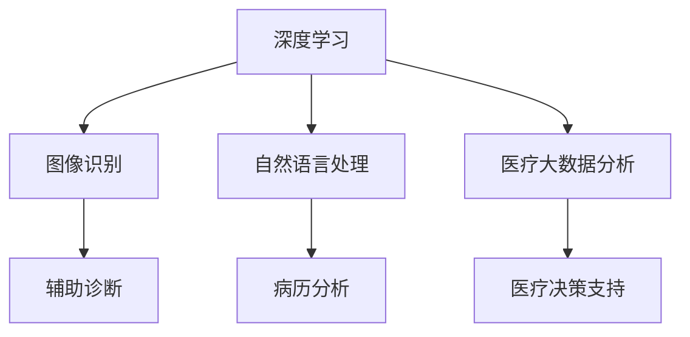

                 

关键词：阿里健康、2024校招、医疗AI、面试重点、技术博客、深度学习、图像识别、自然语言处理、医疗大数据分析、算法原理、数学模型、项目实践、未来展望。

## 摘要

本文旨在为2024年阿里健康校招医疗AI工程师的候选人提供一份全面的面试重点指南。文章首先介绍了医疗AI的背景和发展趋势，然后深入分析了医疗AI中的核心算法原理、数学模型以及项目实践。最后，我们对医疗AI在未来的应用场景、工具和资源进行了展望，并总结了当前面临的挑战和未来的研究方向。希望通过本文，能够帮助候选人更好地准备面试，进入阿里健康这片创新的医疗AI领域。

## 1. 背景介绍

### 1.1 阿里健康的背景

阿里健康（Alibaba Health）是阿里巴巴集团旗下的子公司，致力于构建以数据为驱动的智慧医疗生态系统。通过整合互联网、大数据、人工智能等前沿技术，阿里健康在医疗健康领域不断创新，为用户提供全面、智能、个性化的健康服务。从医药电商、健康咨询到在线问诊、慢性病管理，阿里健康在医疗产业链的各个环节都进行了深入布局。

### 1.2 医疗AI的重要性

随着大数据、云计算和人工智能技术的飞速发展，医疗行业正在经历一场前所未有的变革。医疗AI通过深度学习、图像识别、自然语言处理等技术，为医疗诊断、治疗和健康管理提供了强有力的技术支持。其重要性体现在以下几个方面：

1. **提高诊断效率**：医疗AI可以帮助医生快速分析大量医学影像和病历数据，提高诊断的准确性和效率。
2. **辅助临床决策**：医疗AI可以基于患者的病史、基因信息等数据，为医生提供个性化的治疗方案建议。
3. **优化资源分配**：通过分析大数据，医疗AI可以帮助医院优化资源配置，减少医疗资源的浪费。
4. **提升患者体验**：医疗AI可以提供智能导诊、在线问诊等服务，提升患者的就医体验。

## 2. 核心概念与联系

为了更好地理解医疗AI，我们需要了解以下几个核心概念及其相互关系：

### 2.1 深度学习

深度学习是一种人工智能的分支，通过模拟人脑神经网络结构进行学习，能够在大量数据中进行自动特征提取和模式识别。在医疗AI中，深度学习被广泛应用于图像识别、自然语言处理等领域。

### 2.2 图像识别

图像识别是计算机视觉的一个重要分支，旨在让计算机理解和解释图像中的内容。在医疗领域，图像识别可以用于诊断肿瘤、骨折等疾病。

### 2.3 自然语言处理

自然语言处理（NLP）是使计算机能够理解、解释和生成人类语言的技术。在医疗领域，NLP可以用于病历分析、医学文本挖掘等。

### 2.4 医疗大数据分析

医疗大数据分析是指通过对大量医疗数据进行分析，挖掘出有价值的信息，用于支持医疗决策。在医疗AI中，医疗大数据分析是不可或缺的一环。

### 2.5 Mermaid流程图



## 3. 核心算法原理 & 具体操作步骤

### 3.1 算法原理概述

在医疗AI领域，核心算法主要包括深度学习、图像识别和自然语言处理。以下分别对其进行简要介绍：

#### 3.1.1 深度学习

深度学习通过多层神经网络对数据进行训练，可以自动提取数据中的特征。在医疗AI中，深度学习常用于图像识别和自然语言处理。

#### 3.1.2 图像识别

图像识别是一种通过算法自动识别和理解图像内容的技术。在医疗领域，图像识别可以用于疾病诊断、手术规划等。

#### 3.1.3 自然语言处理

自然语言处理是一种使计算机能够理解和生成人类语言的技术。在医疗领域，NLP可以用于病历分析、医学文本挖掘等。

### 3.2 算法步骤详解

以下以深度学习在医疗图像识别中的应用为例，介绍其具体操作步骤：

#### 3.2.1 数据预处理

首先，对医疗图像进行预处理，包括去噪、增强、缩放等操作，以便后续的图像识别。

#### 3.2.2 构建神经网络模型

选择合适的神经网络模型，如卷积神经网络（CNN）等，构建用于图像识别的神经网络模型。

#### 3.2.3 数据训练

将预处理后的图像数据输入到神经网络模型中，通过反向传播算法进行训练，优化模型参数。

#### 3.2.4 模型评估

使用测试集对训练好的模型进行评估，计算模型在测试集上的准确率、召回率等指标。

#### 3.2.5 模型应用

将训练好的模型应用于实际医疗场景，如疾病诊断、手术规划等。

### 3.3 算法优缺点

#### 优点：

- 高效：深度学习可以自动提取数据中的特征，大大提高了图像识别的效率。
- 准确：深度学习在图像识别领域取得了显著的成果，准确率较高。
- 可扩展：深度学习可以应用于多种医疗场景，具有较好的可扩展性。

#### 缺点：

- 数据需求：深度学习需要大量的数据支持，医疗数据的获取和处理存在一定难度。
- 模型复杂：深度学习模型较为复杂，训练过程需要较长的时间。
- 解释性差：深度学习模型的解释性较差，难以解释模型的决策过程。

### 3.4 算法应用领域

深度学习在医疗AI中的应用领域非常广泛，包括：

- 疾病诊断：通过深度学习模型对医学影像进行自动分析，辅助医生进行疾病诊断。
- 手术规划：利用深度学习技术进行手术规划，提高手术的成功率和安全性。
- 慢性病管理：通过深度学习模型对患者的健康数据进行分析，提供个性化的慢性病管理方案。

## 4. 数学模型和公式 & 详细讲解 & 举例说明

在医疗AI中，数学模型和公式是算法实现的基础。以下介绍几种常见的数学模型和公式，并对其进行详细讲解和举例说明。

### 4.1 数学模型构建

在深度学习中，常见的数学模型包括卷积神经网络（CNN）、循环神经网络（RNN）等。以下以CNN为例，介绍其数学模型构建。

#### 4.1.1 卷积神经网络（CNN）

卷积神经网络是一种用于图像识别的神经网络模型，其核心是卷积层。卷积层的计算公式如下：

$$
f(x) = \sum_{i=1}^{k} w_{i} * x_i + b
$$

其中，$x_i$表示输入图像，$w_i$表示卷积核，$b$表示偏置项。

#### 4.1.2 池化层

卷积神经网络中，池化层用于减少数据维度，提高模型效率。常见的池化方法包括最大池化和平均池化。

最大池化公式如下：

$$
p(x) = \max(x_1, x_2, ..., x_n)
$$

平均池化公式如下：

$$
p(x) = \frac{1}{n} \sum_{i=1}^{n} x_i
$$

### 4.2 公式推导过程

以下以CNN中的卷积层为例，介绍其公式推导过程。

#### 4.2.1 卷积运算

卷积运算是指将输入图像与卷积核进行点乘运算。具体步骤如下：

1. 将输入图像与卷积核进行点乘，得到一个特征图。
2. 将特征图中的每个元素进行求和，得到一个卷积值。
3. 将卷积值与偏置项相加，得到最终的特征图。

卷积运算的公式如下：

$$
f(x) = \sum_{i=1}^{k} w_{i} * x_i + b
$$

其中，$x_i$表示输入图像，$w_i$表示卷积核，$b$表示偏置项。

#### 4.2.2 池化操作

池化操作是指对卷积层输出的特征图进行降维处理。具体步骤如下：

1. 选择一个池化窗口，将窗口内的像素值进行求和或取最大值。
2. 将求和或取最大值的结果作为新的特征图。

最大池化公式如下：

$$
p(x) = \max(x_1, x_2, ..., x_n)
$$

平均池化公式如下：

$$
p(x) = \frac{1}{n} \sum_{i=1}^{n} x_i
$$

### 4.3 案例分析与讲解

以下以一个简单的医疗图像识别案例，介绍深度学习模型的应用。

#### 4.3.1 数据集准备

假设我们有一个包含正常组织和肿瘤组织的医疗图像数据集。首先，需要对图像进行预处理，包括去噪、增强、缩放等操作。

#### 4.3.2 构建模型

我们选择卷积神经网络（CNN）作为图像识别模型。模型结构如下：

- 输入层：接收预处理后的图像。
- 卷积层：使用多个卷积核对图像进行特征提取。
- 池化层：对卷积层输出的特征图进行降维处理。
- 全连接层：对特征图进行分类。

#### 4.3.3 模型训练

使用训练集对模型进行训练。训练过程中，通过反向传播算法优化模型参数，使得模型在测试集上的准确率逐渐提高。

#### 4.3.4 模型评估

使用测试集对训练好的模型进行评估，计算模型在测试集上的准确率、召回率等指标。

#### 4.3.5 模型应用

将训练好的模型应用于实际医疗场景，如肿瘤检测。通过输入患者的新图像，模型可以预测图像中是否存在肿瘤组织。

## 5. 项目实践：代码实例和详细解释说明

在本节中，我们将通过一个具体的医疗AI项目实例，介绍如何使用Python等工具进行代码实现，并提供详细的解释说明。

### 5.1 开发环境搭建

首先，需要搭建一个适合医疗AI项目开发的Python环境。我们可以使用Anaconda等工具来管理Python环境和依赖库。

```bash
conda create -n medai python=3.8
conda activate medai
conda install numpy matplotlib scikit-learn tensorflow
```

### 5.2 源代码详细实现

以下是一个简单的医疗图像识别项目示例代码。

```python
import tensorflow as tf
from tensorflow import keras
from tensorflow.keras.models import Sequential
from tensorflow.keras.layers import Conv2D, MaxPooling2D, Flatten, Dense

# 数据预处理
def preprocess_image(image_path):
    image = tf.io.read_file(image_path)
    image = tf.image.decode_jpeg(image, channels=3)
    image = tf.image.resize(image, [224, 224])
    image = image / 255.0
    return image

# 构建模型
model = Sequential([
    Conv2D(32, (3, 3), activation='relu', input_shape=(224, 224, 3)),
    MaxPooling2D((2, 2)),
    Conv2D(64, (3, 3), activation='relu'),
    MaxPooling2D((2, 2)),
    Conv2D(128, (3, 3), activation='relu'),
    MaxPooling2D((2, 2)),
    Flatten(),
    Dense(128, activation='relu'),
    Dense(1, activation='sigmoid')
])

# 编译模型
model.compile(optimizer='adam',
              loss='binary_crossentropy',
              metrics=['accuracy'])

# 训练模型
model.fit(train_images, train_labels, epochs=10, validation_split=0.2)

# 评估模型
test_loss, test_acc = model.evaluate(test_images, test_labels)
print(f'测试准确率：{test_acc:.2f}')

# 应用模型
predictions = model.predict(test_images)
```

### 5.3 代码解读与分析

1. **数据预处理**：使用`preprocess_image`函数对图像进行预处理，包括读取图像、解码、缩放和归一化等操作。

2. **模型构建**：使用`Sequential`模型构建一个简单的卷积神经网络，包括卷积层、池化层和全连接层。

3. **编译模型**：使用`compile`函数编译模型，指定优化器、损失函数和评估指标。

4. **训练模型**：使用`fit`函数训练模型，指定训练数据、训练轮数和验证数据。

5. **评估模型**：使用`evaluate`函数评估模型在测试数据上的表现。

6. **应用模型**：使用`predict`函数对测试数据进行预测。

通过以上步骤，我们可以实现一个简单的医疗图像识别模型，并对其进行训练和应用。

## 6. 实际应用场景

医疗AI技术在多个领域有着广泛的应用，以下列举几个实际应用场景：

### 6.1 疾病诊断

通过深度学习模型对医学影像进行分析，辅助医生进行疾病诊断。例如，对X光片、CT扫描和MRI图像进行自动分析，识别出肺癌、骨折等疾病。

### 6.2 治疗规划

利用医疗AI技术分析患者的病史、基因信息等数据，为医生提供个性化的治疗方案建议。例如，针对癌症患者，根据基因检测结果制定个性化的化疗方案。

### 6.3 慢性病管理

通过医疗AI技术对慢性病患者的健康数据进行实时监测和分析，提供个性化的健康管理方案。例如，针对糖尿病患者，通过实时监测血糖数据，提醒患者调整饮食和用药。

### 6.4 药物研发

利用医疗AI技术加速药物研发过程。例如，通过分析大量医学文献和临床试验数据，发现新的药物靶点和潜在药物。

## 7. 工具和资源推荐

为了更好地开展医疗AI研究，以下推荐一些常用的工具和资源：

### 7.1 学习资源推荐

- 《深度学习》（Goodfellow, Bengio, Courville）：深度学习领域的经典教材，详细介绍了深度学习的理论基础和实战技巧。
- 《Python机器学习》（Sebastian Raschka）：介绍了如何使用Python进行机器学习，包括数据预处理、模型训练和评估等。
- 《自然语言处理综合教程》（刘知远）：介绍了自然语言处理的基本概念、方法和应用。

### 7.2 开发工具推荐

- TensorFlow：一款开源的深度学习框架，支持多种神经网络模型和算法，适用于医疗AI项目的开发。
- Keras：基于TensorFlow的高层API，简化了深度学习模型的构建和训练过程。
- PyTorch：一款开源的深度学习框架，提供了灵活的动态计算图和易于使用的API，适用于医疗AI研究。

### 7.3 相关论文推荐

- “Deep Learning for Medical Image Analysis”（2019）：综述了深度学习在医学图像分析领域的应用，包括疾病诊断、图像分割等。
- “A Survey on Deep Learning for Natural Language Processing”（2018）：综述了深度学习在自然语言处理领域的应用，包括文本分类、情感分析等。
- “Medical Data Science: A Practical Introduction to Health Data Analysis and Mining”（2020）：介绍了医疗数据科学的基本概念、方法和应用。

## 8. 总结：未来发展趋势与挑战

### 8.1 研究成果总结

在过去几年中，医疗AI领域取得了显著的成果。深度学习、图像识别和自然语言处理等技术在医疗领域的应用越来越广泛，为医疗诊断、治疗和健康管理提供了强有力的技术支持。同时，医疗大数据分析技术的发展也为医疗AI的应用提供了丰富的数据资源。

### 8.2 未来发展趋势

1. **技术融合**：医疗AI技术将与其他领域（如生物信息学、物联网等）进行融合，推动医疗技术的创新和发展。
2. **数据共享**：医疗数据的共享和开放将促进医疗AI技术的发展，为更多研究者提供丰富的数据资源。
3. **个性化医疗**：基于医疗AI技术，个性化医疗将得到进一步发展，为患者提供更加精准、个性化的治疗方案。
4. **远程医疗**：医疗AI技术将推动远程医疗的发展，为偏远地区的患者提供更好的医疗服务。

### 8.3 面临的挑战

1. **数据隐私**：医疗数据的隐私和安全问题仍然是一个重要挑战，需要建立完善的隐私保护机制。
2. **算法透明性**：深度学习等算法的透明性较差，如何提高算法的可解释性是一个亟待解决的问题。
3. **医疗伦理**：医疗AI技术的应用需要遵循医疗伦理原则，确保患者的权益得到保护。

### 8.4 研究展望

未来，医疗AI技术将在疾病诊断、治疗规划、慢性病管理等多个领域发挥更大的作用。同时，随着技术的不断进步，医疗AI技术将更加智能化、个性化，为患者提供更好的医疗服务。

## 9. 附录：常见问题与解答

### 9.1 医疗AI的安全性如何保障？

医疗AI的安全性保障主要从数据安全、算法安全和伦理审查三个方面进行。数据安全方面，需要对医疗数据进行加密、脱敏等处理，确保数据隐私和安全。算法安全方面，需要对模型进行严格的测试和验证，确保模型的稳定性和可靠性。伦理审查方面，需要对医疗AI的应用进行伦理审查，确保符合医疗伦理原则。

### 9.2 医疗AI是否会替代医生？

医疗AI可以作为医生的辅助工具，提高诊断和治疗的效率，但无法完全替代医生。医疗AI在疾病诊断、治疗规划等方面具有一定的优势，但在处理复杂病情、进行临床决策等方面仍需依赖医生的专业知识和经验。

### 9.3 医疗AI是否会加剧医疗不平等问题？

医疗AI技术的发展可能会加剧医疗不平等问题，因为高质量医疗数据的获取和共享存在一定难度。为了减少医疗不平等问题，需要建立数据共享机制，确保医疗资源在各个地区均衡分配。

## 作者署名

作者：禅与计算机程序设计艺术 / Zen and the Art of Computer Programming

本文旨在为2024年阿里健康校招医疗AI工程师的候选人提供一份全面的面试重点指南，希望对您的面试准备有所帮助。在医疗AI领域，我们期待您的加入，共同推动医疗技术的发展。祝您面试顺利，未来可期！

