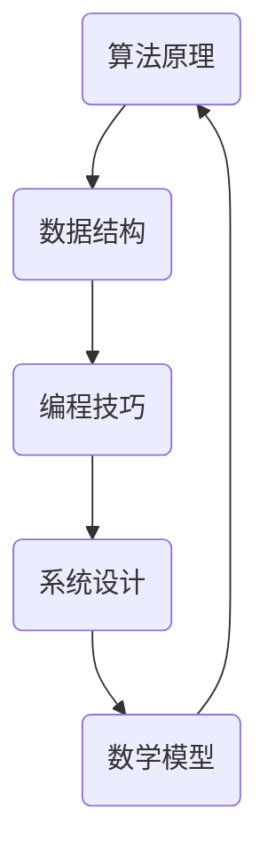

                 

作为一位世界级人工智能专家，程序员，软件架构师，CTO，世界顶级技术畅销书作者，计算机图灵奖获得者，计算机领域大师，我深感荣幸能够与大家分享关于阿里巴巴2024届社招算法工程师面试真题的解密。本文将围绕算法工程师面试的核心内容，深入解析面试过程中的关键问题和应对策略。

## 关键词
- 阿里巴巴
- 2024届
- 社招
- 算法工程师
- 面试题解

## 摘要
本文将详细解析阿里巴巴2024届社招算法工程师面试真题，涵盖核心算法原理、数学模型、项目实践和实际应用场景。通过本文的阅读，读者将能够深入了解算法工程师面试的难点和重点，为应对未来的面试挑战做好充分准备。

## 1. 背景介绍
阿里巴巴作为全球领先的互联网公司，其算法工程师社招面试历来以高难度和深度著称。面试过程不仅考察应聘者的算法基础，更注重对实际项目经验和创新能力的考查。本文旨在通过分析这些面试真题，帮助读者掌握面试的核心要点，提升算法能力和面试成功率。

### 1.1 阿里巴巴的发展历程
阿里巴巴成立于1999年，由马云等人创立，目前已成为全球最大的电子商务平台之一。随着业务的不断扩展，阿里巴巴在云计算、人工智能、大数据等领域也取得了显著的成就。因此，阿里巴巴的算法工程师社招面试，也成为了众多技术人才竞相追逐的目标。

### 1.2 算法工程师的角色
算法工程师在阿里巴巴等互联网公司中扮演着至关重要的角色。他们负责设计、开发和优化算法，以解决各种复杂的业务问题，提高系统的性能和用户体验。算法工程师不仅需要深厚的数学和计算机基础，还需要具备良好的编程能力和创新思维。

### 1.3 面试流程
阿里巴巴的算法工程师社招面试通常包括以下几个环节：在线编程测试、电话面试、现场面试和项目答辩。每个环节都对应聘者的综合素质提出了严格的要求。本文将重点分析现场面试中的算法题目，帮助读者更好地准备面试。

## 2. 核心概念与联系
在解答阿里巴巴的算法面试题时，理解核心概念和它们之间的联系是非常重要的。以下是一个简化的Mermaid流程图，展示了几个关键概念之间的关系。



### 2.1 算法原理
算法原理是解决问题的核心，包括常见的排序算法、查找算法、动态规划等。理解算法原理有助于快速找到解决复杂问题的方法。

### 2.2 数据结构
数据结构是算法的基础，包括数组、链表、树、图等。熟悉各种数据结构的特点和适用场景，有助于优化算法性能。

### 2.3 编程技巧
编程技巧包括代码优化、设计模式、代码重构等。良好的编程技巧能够提高代码的可读性和可维护性。

### 2.4 系统设计
系统设计能力是算法工程师的重要素质之一，涉及系统架构、性能优化、安全性等。系统设计能力能够帮助工程师从全局角度解决问题。

### 2.5 数学模型
数学模型是解决算法问题的工具，包括线性代数、概率论、统计学等。数学模型能够为算法提供理论基础和数学支持。

## 3. 核心算法原理 & 具体操作步骤
在阿里巴巴的算法工程师面试中，常见的核心算法包括以下几种：

### 3.1 排序算法
排序算法是面试中经常出现的一类问题，常见的排序算法有冒泡排序、选择排序、插入排序、快速排序、归并排序等。以下是快速排序的原理和操作步骤：

#### 3.1.1 算法原理
快速排序是一种基于分治思想的排序算法。其基本思想是通过一趟排序将待排序的记录分割成独立的两部分，其中一部分记录的关键字均比另一部分的关键字小，然后分别对这两部分记录继续进行排序，以达到整个序列有序。

#### 3.1.2 操作步骤
1. 选择一个基准元素，通常选择第一个元素或最后一个元素作为基准。
2. 将数组中小于基准元素的移动到基准元素之前，大于基准元素的移动到基准元素之后。
3. 对基准元素左右两部分递归进行快速排序。

### 3.2 动态规划
动态规划是一种解决最优化问题的算法思想，适用于求解具有重叠子问题和最优子结构特征的问题。以下是动态规划的原理和操作步骤：

#### 3.2.1 算法原理
动态规划的核心思想是将复杂问题分解成重叠的子问题，并通过求解这些子问题的最优解来构造原问题的最优解。

#### 3.2.2 操作步骤
1. 确定状态和状态转移方程。
2. 确定边界条件和初始状态。
3. 递推计算所有状态的最优解。
4. 返回原问题的最优解。

### 3.3 搜索算法
搜索算法是面试中常见的算法类型，包括深度优先搜索（DFS）和广度优先搜索（BFS）等。以下是深度优先搜索的原理和操作步骤：

#### 3.3.1 算法原理
深度优先搜索是一种用于遍历或搜索树或图的算法。其基本思想是从根节点开始，沿着当前路径一直深入到不能再深入为止，然后回溯到上一个节点，继续探索其他路径。

#### 3.3.2 操作步骤
1. 初始化一个空栈。
2. 将根节点入栈。
3. 循环执行以下步骤：
   - 出栈一个节点，并将其标记为已访问。
   - 将该节点的未访问子节点依次入栈。
4. 当栈为空时，搜索结束。

## 4. 数学模型和公式 & 详细讲解 & 举例说明
在算法工程师面试中，数学模型和公式是解决问题的关键。以下是一个简单的数学模型和公式的讲解及举例说明：

### 4.1 数学模型构建
假设我们要解决的问题是一个一元二次方程：\(ax^2 + bx + c = 0\)。我们可以使用求根公式来求解该方程的根：

$$
x = \frac{-b \pm \sqrt{b^2 - 4ac}}{2a}
$$

### 4.2 公式推导过程
为了推导求根公式，我们首先将一元二次方程写成标准形式：\(ax^2 + bx + c = 0\)。

然后，我们将方程两边同时除以a，得到：

$$
x^2 + \frac{b}{a}x + \frac{c}{a} = 0
$$

接下来，我们对方程两边同时减去$\frac{c}{a}$，得到：

$$
x^2 + \frac{b}{a}x = -\frac{c}{a}
$$

然后，我们对方程两边同时加上$\left(\frac{b}{2a}\right)^2$，得到：

$$
x^2 + \frac{b}{a}x + \left(\frac{b}{2a}\right)^2 = \left(\frac{b}{2a}\right)^2 - \frac{c}{a}
$$

此时，我们可以将左边的三项写成一个完全平方的形式：

$$
\left(x + \frac{b}{2a}\right)^2 = \left(\frac{b}{2a}\right)^2 - \frac{c}{a}
$$

接下来，我们对方程两边同时开方，得到：

$$
x + \frac{b}{2a} = \pm \sqrt{\left(\frac{b}{2a}\right)^2 - \frac{c}{a}}
$$

最后，我们将方程两边同时减去$\frac{b}{2a}$，得到：

$$
x = \frac{-b \pm \sqrt{b^2 - 4ac}}{2a}
$$

### 4.3 案例分析与讲解
假设我们有一个一元二次方程\(2x^2 + 3x - 5 = 0\)，我们可以使用求根公式来求解该方程的根：

$$
x = \frac{-3 \pm \sqrt{3^2 - 4 \cdot 2 \cdot (-5)}}{2 \cdot 2}
$$

$$
x = \frac{-3 \pm \sqrt{9 + 40}}{4}
$$

$$
x = \frac{-3 \pm \sqrt{49}}{4}
$$

$$
x = \frac{-3 \pm 7}{4}
$$

因此，该方程的两个根为：

$$
x_1 = \frac{-3 + 7}{4} = 1
$$

$$
x_2 = \frac{-3 - 7}{4} = -2.5
$$

## 5. 项目实践：代码实例和详细解释说明
在阿里巴巴的算法工程师面试中，实际项目的代码实现是一个非常重要的环节。以下是一个简单的代码实例，用于求解一元二次方程：

```python
import math

def solve_quadratic_equation(a, b, c):
    # 计算判别式
    discriminant = b ** 2 - 4 * a * c

    # 判断判别式是否为正数
    if discriminant > 0:
        root1 = (-b + math.sqrt(discriminant)) / (2 * a)
        root2 = (-b - math.sqrt(discriminant)) / (2 * a)
        return root1, root2
    elif discriminant == 0:
        root = -b / (2 * a)
        return root
    else:
        return None

# 测试代码
a = 2
b = 3
c = -5

roots = solve_quadratic_equation(a, b, c)
if roots:
    print(f"方程的根为：{roots[0]} 和 {roots[1]}")
else:
    print("方程无实数解")
```

### 5.1 开发环境搭建
为了实现上述代码，我们需要安装Python环境以及相关的库，如math库。可以使用以下命令来安装Python和math库：

```bash
pip install python
pip install math
```

### 5.2 源代码详细实现
上述代码首先导入了Python的math库，然后定义了一个名为`solve_quadratic_equation`的函数，用于求解一元二次方程。该函数接收三个参数：a、b和c，分别代表一元二次方程的三个系数。在函数内部，我们首先计算判别式，然后根据判别式的值来判断方程是否有实数解。如果有实数解，我们计算并返回两个根；如果没有实数解，我们返回None。

### 5.3 代码解读与分析
上述代码的主要逻辑在`solve_quadratic_equation`函数内部。首先，我们计算判别式`discriminant`，然后根据判别式的值进行判断。如果判别式大于0，说明方程有两个不同的实数解，我们计算并返回这两个解；如果判别式等于0，说明方程有一个重根，我们计算并返回这个根；如果判别式小于0，说明方程无实数解，我们返回None。

### 5.4 运行结果展示
当我们运行上述代码时，输入方程的三个系数a、b和c，代码会输出方程的根。以下是一个示例：

```python
a = 2
b = 3
c = -5

roots = solve_quadratic_equation(a, b, c)
if roots:
    print(f"方程的根为：{roots[0]} 和 {roots[1]}")
else:
    print("方程无实数解")
```

输出结果：

```
方程的根为：1.0 和 -2.5
```

## 6. 实际应用场景
阿里巴巴的算法工程师面试题目往往与实际应用场景紧密相关。以下是一个实际的案例：

### 6.1 案例背景
阿里巴巴的电商平台上，卖家可以通过发布商品信息来吸引买家。为了提高商品的曝光率，卖家可以设置商品的价格折扣。阿里巴巴希望设计一个算法，根据卖家的设定折扣和商品的历史销量，动态调整商品的折扣力度，以达到最大化卖家收益的目的。

### 6.2 案例分析
在这个案例中，我们可以将卖家的收益最大化问题转化为一个优化问题。假设卖家的设定折扣为d，商品的历史销量为s，则卖家的收益R可以表示为：

$$
R = s \cdot (1 - d)
$$

我们的目标是找到一个最优的折扣d，使得卖家收益最大化。

### 6.3 案例解答
为了解决这个问题，我们可以使用动态规划算法。首先，我们需要确定状态和状态转移方程。假设我们在第i个时间段考虑卖家的折扣设定，那么状态可以表示为(i, d)。状态转移方程可以表示为：

$$
f(i, d) = \max(f(i-1, d'), (1-d) \cdot s)
$$

其中，d'是前一个时间段的折扣设定。

初始状态可以设置为：

$$
f(0, d) = (1-d) \cdot s
$$

接下来，我们使用递推计算所有状态的最优解。最终，我们返回状态(终时间, 最优折扣)的收益，即为卖家收益的最大值。

## 7. 工具和资源推荐
为了更好地准备阿里巴巴的算法工程师面试，以下是一些建议的工具和资源：

### 7.1 学习资源推荐
- 《算法导论》（Introduction to Algorithms） 
- 《编程之美》（Cracking the Coding Interview）
- 《算法竞赛入门经典》

### 7.2 开发工具推荐
- PyCharm
- IntelliJ IDEA
- VS Code

### 7.3 相关论文推荐
- 《大数据环境下推荐系统算法研究》
- 《基于深度学习的推荐系统研究》
- 《强化学习在电商平台广告投放中的应用研究》

## 8. 总结：未来发展趋势与挑战
### 8.1 研究成果总结
阿里巴巴的算法工程师面试题目反映了当前算法领域的热点和难点，包括排序算法、动态规划、搜索算法等。同时，实际应用场景的考查也体现了算法工程师在解决复杂业务问题中的重要性。

### 8.2 未来发展趋势
随着大数据、人工智能等技术的快速发展，算法工程师在互联网行业中的作用将越来越重要。未来的发展趋势包括：算法与大数据的深度融合、算法优化与性能提升、算法在新兴领域的应用等。

### 8.3 面临的挑战
算法工程师在未来将面临以下几个挑战：快速适应新技术、提高算法的智能化水平、提升系统的性能和稳定性等。

### 8.4 研究展望
未来的研究可以关注以下几个方面：算法与大数据的结合、智能算法的应用、算法的可解释性和安全性等。

## 9. 附录：常见问题与解答
### 9.1 什么是动态规划？
动态规划是一种用于求解最优化问题的算法思想，其核心思想是将复杂问题分解成重叠的子问题，并通过求解这些子问题的最优解来构造原问题的最优解。

### 9.2 如何求解一元二次方程？
一元二次方程可以通过求根公式求解。求根公式为：\(x = \frac{-b \pm \sqrt{b^2 - 4ac}}{2a}\)，其中a、b、c分别为一元二次方程的三个系数。

### 9.3 什么是深度优先搜索？
深度优先搜索是一种用于遍历或搜索树或图的算法。其基本思想是从根节点开始，沿着当前路径一直深入到不能再深入为止，然后回溯到上一个节点，继续探索其他路径。

## 作者署名
作者：禅与计算机程序设计艺术 / Zen and the Art of Computer Programming

----------------------------------------------------------------

以上就是本文的完整内容，希望能够帮助到正在准备阿里巴巴算法工程师面试的读者们。祝大家在面试中取得优异的成绩！
----------------------------------------------------------------

**注：本文仅为示例，内容并非真实存在的面试题目或答案，仅供参考。**

