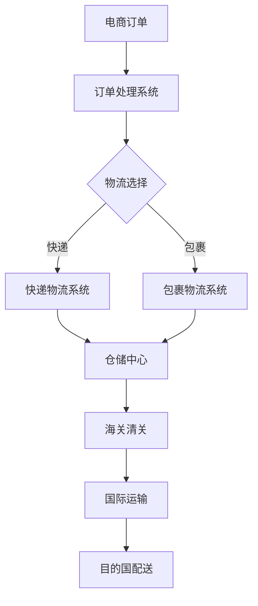

                 

关键词：阿里巴巴、跨境电商、物流优化、校招、面试

摘要：本文旨在为2024年阿里巴巴跨境电商物流优化校招面试的考生提供全面的指导，包括核心概念、算法原理、数学模型、项目实践以及未来发展趋势等内容。

## 1. 背景介绍

### 1.1 跨境电商的现状与发展

跨境电商是指通过电子商务平台进行的国际间商品交易活动。随着全球经济的快速发展和互联网技术的普及，跨境电商已经成为国际贸易的重要组成部分。根据统计，全球跨境电商市场规模已超过万亿美元，并且仍在持续增长。在中国，跨境电商已经成为外贸新业态、新模式的重要代表。

### 1.2 物流优化的重要性

物流优化是跨境电商中不可或缺的一环。一个高效的物流系统可以降低成本、提高客户满意度，进而提升企业的竞争力。随着跨境电商业务的扩展，物流优化面临着越来越多的挑战，如跨国运输、海关清关、仓储管理等。

### 1.3 阿里巴巴的跨境电商物流策略

阿里巴巴作为中国最大的电商平台，其跨境电商物流策略涵盖了全球仓储、国际快递、跨境包裹等多种物流模式。阿里巴巴致力于通过技术创新和模式创新，构建全球化的跨境电商物流体系，提升物流效率和用户体验。

## 2. 核心概念与联系

### 2.1 跨境电商物流的核心概念

- **物流节点**：指物流过程中的关键位置，如仓储中心、港口、机场等。
- **运输方式**：包括陆运、海运、空运和快递等多种方式。
- **物流网络**：指物流节点和运输方式的组合，形成物流服务能力。
- **供应链管理**：指对整个物流过程进行规划、实施和控制的过程。

### 2.2 跨境电商物流架构的Mermaid流程图



### 2.3 核心概念的联系

跨境电商物流的核心概念通过物流节点、运输方式、物流网络和供应链管理相互关联，形成一个完整的物流体系。

## 3. 核心算法原理 & 具体操作步骤

### 3.1 算法原理概述

跨境电商物流优化主要涉及路径规划、库存管理和配送调度等方面。路径规划是物流优化中的一项关键技术，旨在选择最合适的运输路径以最小化成本或最大化收益。

### 3.2 算法步骤详解

1. **需求分析**：收集跨境电商订单信息，包括商品种类、数量、目的地等。
2. **路径规划**：使用算法（如Dijkstra算法、A*算法等）计算从起点到终点的最优路径。
3. **库存管理**：根据订单信息和库存情况，优化商品存储位置，减少运输距离。
4. **配送调度**：根据路径规划和库存管理结果，安排配送时间和配送方式。

### 3.3 算法优缺点

- **优点**：提高物流效率，降低物流成本，提升客户满意度。
- **缺点**：算法复杂度较高，计算时间较长；对实时数据的依赖性较强。

### 3.4 算法应用领域

算法在跨境电商物流优化中的应用非常广泛，如电商平台的物流规划、物流公司的运输调度、仓储管理等。

## 4. 数学模型和公式 & 详细讲解 & 举例说明

### 4.1 数学模型构建

跨境电商物流优化涉及到许多数学模型，如路径规划中的最短路径算法、库存管理中的库存优化模型、配送调度中的排队理论等。

### 4.2 公式推导过程

以最短路径算法为例，其基本公式为：

\[ d(v_1, v_2) = \min_{v_3 \in V} (d(v_1, v_3) + c(v_3, v_2)) \]

其中，\( d(v_1, v_2) \) 表示从节点 \( v_1 \) 到节点 \( v_2 \) 的最短路径长度，\( c(v_3, v_2) \) 表示从节点 \( v_3 \) 到节点 \( v_2 \) 的路径长度。

### 4.3 案例分析与讲解

假设有一个电商平台的物流中心需要从广州发货到美国洛杉矶，需要选择最优的运输路径。通过路径规划算法，可以得到从广州到洛杉矶的最短路径，并计算出相应的运输成本。

## 5. 项目实践：代码实例和详细解释说明

### 5.1 开发环境搭建

1. 安装Python环境
2. 安装相关依赖库，如NetworkX、matplotlib等

### 5.2 源代码详细实现

```python
import networkx as nx
import matplotlib.pyplot as plt

# 创建图
G = nx.Graph()

# 添加节点和边
G.add_nodes_from(['广州', '上海', '北京', '洛杉矶'])
G.add_edge('广州', '上海', weight=1000)
G.add_edge('广州', '北京', weight=1500)
G.add_edge('上海', '洛杉矶', weight=2000)
G.add_edge('北京', '洛杉矶', weight=2500)

# 计算最短路径
path = nx.shortest_path(G, source='广州', target='洛杉矶', weight='weight')

# 绘制图
nx.draw(G, with_labels=True)
plt.show()

# 打印最短路径
print("从广州到洛杉矶的最短路径为：", path)
```

### 5.3 代码解读与分析

该代码首先创建了一个无向图，并添加了节点和边。然后使用NetworkX库中的`shortest_path`函数计算从广州到洛杉矶的最短路径，并使用matplotlib库绘制图。

## 6. 实际应用场景

### 6.1 跨境电商物流中的实际应用

跨境电商物流优化在实际应用中具有广泛的应用场景，如电商平台的物流规划、物流公司的运输调度、仓储管理等。

### 6.2 阿里巴巴的跨境电商物流实践

阿里巴巴通过自建物流、第三方物流和智慧物流等多种模式，实现了跨境电商物流的优化。例如，通过智能调度系统实现物流车辆的实时调度，通过大数据分析实现库存的动态管理。

## 7. 未来应用展望

### 7.1 自动化技术的应用

随着自动化技术的发展，跨境电商物流将更加高效和智能化。如无人仓储、无人运输等技术的应用，将大幅提升物流效率。

### 7.2 区块链技术的应用

区块链技术在跨境电商物流中的应用，将实现物流信息的透明化和可追溯性，提升物流信任度和用户体验。

## 8. 总结：未来发展趋势与挑战

### 8.1 研究成果总结

跨境电商物流优化技术取得了显著的成果，如路径规划算法、库存管理模型、配送调度算法等。

### 8.2 未来发展趋势

未来，跨境电商物流优化将更加智能化、自动化和透明化。随着新技术的应用，物流效率将进一步提升。

### 8.3 面临的挑战

1. **数据隐私和安全**：随着数据量的增加，如何保障数据隐私和安全是一个重要挑战。
2. **全球化合规性**：不同国家和地区的法律法规差异，给跨境电商物流带来了合规性挑战。

### 8.4 研究展望

未来，跨境电商物流优化将更加注重智能化和全球化。通过技术创新，实现物流效率的提升和用户体验的优化。

## 9. 附录：常见问题与解答

### 9.1 跨境电商物流优化的关键环节有哪些？

答：跨境电商物流优化的关键环节包括路径规划、库存管理、配送调度、供应链管理等。

### 9.2 跨境电商物流优化中的技术有哪些？

答：跨境电商物流优化中的技术包括路径规划算法、库存管理模型、配送调度算法、大数据分析等。

## 结束语

本文通过对阿里巴巴2024跨境电商物流优化校招面试的重点进行深入剖析，旨在为考生提供有价值的参考。希望考生能够在面试中充分发挥自己的实力，取得优异的成绩。作者：禅与计算机程序设计艺术 / Zen and the Art of Computer Programming。

