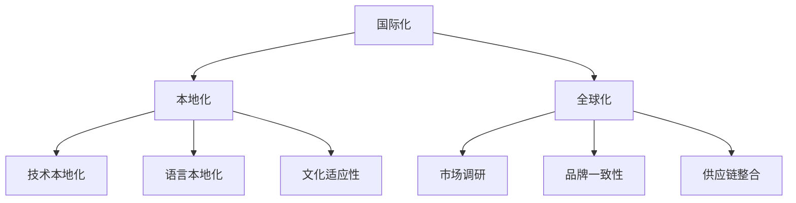

                 

关键词：阿里巴巴、国际化、社招、本地化工程师、面试题集、IT领域、技术面试、招聘流程

摘要：本文旨在为准备参加阿里巴巴2025国际化社招本地化工程师岗位面试的应聘者提供一套全面的面试题集。通过分析阿里巴巴在国际化业务布局、本地化工程实践以及相关技术领域的招聘要求，本文整理了涵盖基础知识、项目经验、技术难题等多方面的面试题目，帮助应聘者更好地准备面试，提升求职成功率。

## 1. 背景介绍

阿里巴巴集团自成立以来，凭借其强大的电子商务生态系统，成为了全球最具影响力的互联网公司之一。随着全球化进程的不断深入，阿里巴巴正积极拓展海外市场，以实现其成为“全球电子商务领导者”的愿景。为了更好地适应当地市场的需求，阿里巴巴在全球范围内招聘了大量本地化工程师，他们主要负责将阿里巴巴的产品和解决方案本地化，确保其能够无缝对接不同国家和地区的用户。

本地化工程师的岗位需求涵盖了多种技术领域，包括前端开发、后端开发、移动开发、数据分析、用户界面设计等。因此，对于应聘者来说，具备扎实的专业技能和丰富的项目经验是必不可少的。此外，本地化工程师还需具备较强的跨文化沟通能力和适应能力，能够在不同的工作环境中迅速融入。

本文旨在为准备参加阿里巴巴2025国际化社招本地化工程师岗位面试的应聘者提供一套全面的面试题集。通过分析阿里巴巴在国际化业务布局、本地化工程实践以及相关技术领域的招聘要求，本文整理了涵盖基础知识、项目经验、技术难题等多方面的面试题目，帮助应聘者更好地准备面试，提升求职成功率。

## 2. 核心概念与联系

为了更好地理解本地化工程师的工作职责，我们首先需要了解几个核心概念：国际化、本地化和全球化。

### 2.1 国际化

国际化（Internationalization）是指将产品、服务或内容设计成可以在全球范围内使用和访问的过程。这一过程通常涉及以下几个方面：

- **语言支持**：确保产品能够在不同语言环境下正常运行，包括本地化的用户界面、文档和内容。
- **文化适应性**：考虑不同地区用户的文化差异，例如日期格式、货币符号、颜色象征等。
- **技术兼容性**：确保产品在不同操作系统、浏览器和硬件设备上能够正常工作。

### 2.2 本地化

本地化（Localization）是国际化的一个重要环节，它涉及将已经国际化的产品或内容进一步适应特定地区或市场的需求。本地化工作主要包括以下几个方面：

- **语言本地化**：翻译用户界面、帮助文档、网站内容等。
- **文化本地化**：调整产品以适应目标市场的文化背景，如节日促销、习俗习惯等。
- **技术本地化**：确保产品在目标市场的技术环境（如网络速度、带宽、硬件设备）下能够正常运行。

### 2.3 全球化

全球化（Globalization）是指在全球范围内推广和销售产品或服务，使其在不同市场保持一致性和可访问性。全球化需要考虑以下几个方面：

- **市场调研**：了解目标市场的需求、竞争态势和消费者行为。
- **品牌一致性**：确保品牌形象在全球范围内保持一致，传递统一的品牌价值。
- **供应链整合**：优化全球供应链，确保产品能够高效、低成本地到达目标市场。

### 2.4 Mermaid 流程图

以下是一个简化的Mermaid流程图，展示了国际化、本地化和全球化之间的关系：



通过这个流程图，我们可以清晰地看到国际化、本地化和全球化之间的相互关联和依赖。本地化工程师需要在这三个环节中发挥作用，确保阿里巴巴的产品能够在全球范围内顺利推广。

## 3. 核心算法原理 & 具体操作步骤

### 3.1 算法原理概述

在本地化工程中，常用的核心算法包括语言处理算法、文化适应性算法和用户行为分析算法。以下是对这些算法的简要概述：

- **语言处理算法**：用于处理不同语言之间的文本翻译、语法分析和语义理解。常见算法包括基于规则的翻译、统计机器翻译和深度学习翻译模型。
- **文化适应性算法**：用于根据目标市场的文化差异，自动调整产品的界面、内容和功能。常见算法包括文化特征提取、文化相似度计算和文化偏好分析。
- **用户行为分析算法**：用于分析用户在产品上的行为数据，了解用户需求和行为习惯，为产品的本地化提供数据支持。常见算法包括用户画像构建、行为预测和个性化推荐。

### 3.2 算法步骤详解

以下是本地化工程中常用算法的具体操作步骤：

#### 3.2.1 语言处理算法

1. **文本输入**：从源语言文本中提取关键词和句子。
2. **词法分析**：对文本进行分词、词性标注和语法分析。
3. **语义理解**：利用机器翻译模型或规则库，将源语言文本翻译成目标语言文本。
4. **文本生成**：根据翻译结果，生成目标语言的完整文本。

#### 3.2.2 文化适应性算法

1. **文化特征提取**：从产品中提取与文化相关的元素，如日期格式、货币符号和颜色。
2. **文化相似度计算**：计算源文化和目标文化之间的相似度，为后续调整提供依据。
3. **文化偏好分析**：根据目标市场的文化偏好，调整产品的界面、内容和功能。

#### 3.2.3 用户行为分析算法

1. **用户画像构建**：根据用户行为数据，构建用户画像，包括用户的基本信息、兴趣爱好和行为习惯。
2. **行为预测**：利用机器学习算法，预测用户在产品上的行为，如购买意向、点击率等。
3. **个性化推荐**：根据用户画像和行为预测结果，为用户提供个性化的产品推荐。

### 3.3 算法优缺点

#### 3.3.1 语言处理算法

优点：
- 提高翻译效率，降低人工成本。
- 支持多种语言之间的翻译，满足国际化需求。

缺点：
- 翻译质量受限于算法和规则库的准确性。
- 难以处理复杂的语言和文化差异。

#### 3.3.2 文化适应性算法

优点：
- 提高产品的文化适应性，增强用户满意度。
- 降低本地化成本，缩短产品上市时间。

缺点：
- 需要大量的文化知识和数据分析。
- 算法模型的准确性受限于数据质量和算法设计。

#### 3.3.3 用户行为分析算法

优点：
- 提高产品的个性化程度，提升用户体验。
- 为产品优化和决策提供数据支持。

缺点：
- 需要大量的用户数据。
- 算法模型的准确性受限于数据质量和算法设计。

### 3.4 算法应用领域

语言处理算法、文化适应性算法和用户行为分析算法在本地化工程中具有广泛的应用。以下是一些典型的应用场景：

- **电子商务**：利用语言处理算法实现商品描述的翻译和本地化，提高用户体验；利用文化适应性算法调整产品界面和文化元素，适应不同市场的需求；利用用户行为分析算法，为用户提供个性化的商品推荐和营销策略。
- **社交媒体**：利用语言处理算法实现跨语言交流，促进全球用户的互动；利用文化适应性算法，调整社交媒体平台的界面和文化元素，满足不同地区的用户需求；利用用户行为分析算法，分析用户行为，优化平台功能和内容。
- **游戏**：利用语言处理算法实现游戏内容的翻译和本地化，提高游戏的可玩性；利用文化适应性算法，调整游戏界面和文化元素，适应不同地区的玩家；利用用户行为分析算法，分析玩家行为，优化游戏体验和运营策略。

## 4. 数学模型和公式 & 详细讲解 & 举例说明

### 4.1 数学模型构建

本地化工程中涉及多个数学模型，主要包括：

1. **语言处理模型**：用于文本翻译、语法分析和语义理解，常见模型包括基于规则的模型、统计机器翻译模型和深度学习模型。
2. **文化适应性模型**：用于调整产品的界面、内容和功能，常见模型包括文化特征提取模型、文化相似度计算模型和文化偏好分析模型。
3. **用户行为分析模型**：用于分析用户行为数据，常见模型包括用户画像构建模型、行为预测模型和个性化推荐模型。

### 4.2 公式推导过程

以下是本地化工程中常用的数学公式的推导过程：

#### 4.2.1 语言处理模型

假设我们有一个基于神经网络的翻译模型，其输入为源语言文本 \(X\)，输出为目标语言文本 \(Y\)。模型的损失函数为：

$$L = \frac{1}{N} \sum_{i=1}^{N} -\sum_{j=1}^{M} y_{ij} \log(p(y_{ij} | x_i, \theta))$$

其中，\(N\) 是训练样本的数量，\(M\) 是目标语言词汇表的大小，\(y_{ij}\) 是目标语言文本中第 \(i\) 个单词在第 \(j\) 个位置上的概率，\(p(y_{ij} | x_i, \theta)\) 是模型在给定源语言文本 \(x_i\) 和模型参数 \(\theta\) 下预测的目标语言单词的概率。

为了最小化损失函数，我们对模型参数 \(\theta\) 求导，并令导数为零：

$$\frac{\partial L}{\partial \theta} = 0$$

通过优化算法（如梯度下降），我们可以得到最优的模型参数 \(\theta\)。

#### 4.2.2 文化适应性模型

假设我们有一个基于文化相似度的模型，用于计算源文化和目标文化之间的相似度。模型的基本公式为：

$$S_{similarity} = \frac{S_{common}}{S_{total}}$$

其中，\(S_{common}\) 是源文化和目标文化共有的文化特征的数量，\(S_{total}\) 是源文化和目标文化的总文化特征的数量。

为了提高模型的准确性，我们可以使用以下公式对文化特征进行权重调整：

$$S_{similarity} = \frac{\sum_{i=1}^{N} w_i \cdot S_{common_i}}{\sum_{i=1}^{N} w_i \cdot S_{total_i}}$$

其中，\(w_i\) 是第 \(i\) 个文化特征的权重。

#### 4.2.3 用户行为分析模型

假设我们有一个基于用户行为的预测模型，用于预测用户在产品上的行为。模型的基本公式为：

$$P(y_t | x_t, \theta) = \frac{e^{\theta^T x_t}}{\sum_{i=1}^{K} e^{\theta^T x_i}}$$

其中，\(y_t\) 是用户在时刻 \(t\) 的行为，\(x_t\) 是用户在时刻 \(t\) 的特征向量，\(\theta\) 是模型参数，\(K\) 是行为类别数。

为了提高模型的准确性，我们可以使用以下公式对特征进行加权调整：

$$P(y_t | x_t, \theta) = \frac{e^{\sum_{i=1}^{N} w_i \cdot \theta^T x_t}}{\sum_{i=1}^{K} e^{\sum_{i=1}^{N} w_i \cdot \theta^T x_i}}$$

其中，\(w_i\) 是第 \(i\) 个特征的权重。

### 4.3 案例分析与讲解

以下是一个本地化工程中的实际案例，我们将使用数学模型对其进行分析和讲解。

#### 案例背景

某电子商务平台计划进入日本市场，需要对现有产品进行本地化。平台的主要功能包括商品浏览、购物车、订单管理、支付和用户反馈。为了满足日本市场的需求，需要对产品界面、内容和功能进行调整。

#### 数学模型构建

1. **语言处理模型**：采用基于神经网络的机器翻译模型，将中文商品描述翻译成日语。
2. **文化适应性模型**：采用文化相似度计算模型，计算中日两国的文化特征相似度，为后续调整提供依据。
3. **用户行为分析模型**：采用基于用户行为的个性化推荐模型，为日本用户提供个性化的商品推荐。

#### 公式推导与计算

1. **语言处理模型**

假设我们有一个基于神经网络的翻译模型，输入为中文商品描述 \(X\)，输出为日语商品描述 \(Y\)。模型的损失函数为：

$$L = \frac{1}{N} \sum_{i=1}^{N} -\sum_{j=1}^{M} y_{ij} \log(p(y_{ij} | x_i, \theta))$$

其中，\(N\) 是训练样本的数量，\(M\) 是日语词汇表的大小，\(y_{ij}\) 是日语商品描述中第 \(i\) 个单词在第 \(j\) 个位置上的概率，\(p(y_{ij} | x_i, \theta)\) 是模型在给定中文商品描述 \(x_i\) 和模型参数 \(\theta\) 下预测的日语单词的概率。

通过优化算法（如梯度下降），我们可以得到最优的模型参数 \(\theta\)。

2. **文化适应性模型**

假设中日两国的文化特征分别为 \(C_1\) 和 \(C_2\)，共有 \(N\) 个文化特征。模型的基本公式为：

$$S_{similarity} = \frac{\sum_{i=1}^{N} w_i \cdot S_{common_i}}{\sum_{i=1}^{N} w_i \cdot S_{total_i}}$$

其中，\(S_{common}\) 是中日两国共有的文化特征的数量，\(S_{total}\) 是中日两国的总文化特征的数量。

通过计算中日两国的文化相似度，我们可以得到：

$$S_{similarity} = \frac{\sum_{i=1}^{N} w_i \cdot S_{common_i}}{\sum_{i=1}^{N} w_i \cdot S_{total_i}}$$

其中，\(w_i\) 是第 \(i\) 个文化特征的权重。

3. **用户行为分析模型**

假设我们有用户的行为数据集 \(D\)，包括用户的购买记录、浏览记录和评论记录。模型的输入为用户的行为特征向量 \(X\)，输出为用户的个性化推荐列表 \(Y\)。模型的损失函数为：

$$L = \frac{1}{N} \sum_{i=1}^{N} -\sum_{j=1}^{M} y_{ij} \log(p(y_{ij} | x_i, \theta))$$

其中，\(N\) 是训练样本的数量，\(M\) 是推荐商品的数量，\(y_{ij}\) 是用户在给定行为特征向量 \(x_i\) 和模型参数 \(\theta\) 下预测的购买概率，\(p(y_{ij} | x_i, \theta)\) 是模型预测的购买概率。

通过优化算法（如梯度下降），我们可以得到最优的模型参数 \(\theta\)。

#### 案例分析与讲解

1. **语言处理模型**

通过训练神经网络翻译模型，我们可以将中文商品描述翻译成日语。在翻译过程中，模型会自动学习中日两国语言的语法、语义和词汇分布，从而提高翻译质量。

2. **文化适应性模型**

通过计算中日两国的文化相似度，我们可以了解到中日两国的文化差异。根据这些差异，我们可以对产品界面、内容和功能进行调整，使其更符合日本市场的需求。

3. **用户行为分析模型**

通过分析用户的行为数据，我们可以为日本用户提供个性化的商品推荐。这不仅可以提高用户的满意度，还可以提高产品的转化率和销售额。

## 5. 项目实践：代码实例和详细解释说明

### 5.1 开发环境搭建

为了完成本地化项目，我们需要搭建一个适合本地化工程开发的开发环境。以下是一个简单的开发环境搭建步骤：

1. **安装Python**：Python是本地化工程中常用的编程语言，我们需要安装Python环境。可以从Python官网下载Python安装包并安装。
2. **安装Jupyter Notebook**：Jupyter Notebook是一个交互式的Python开发环境，方便我们编写和调试代码。可以使用pip命令安装Jupyter Notebook：
   ```bash
   pip install notebook
   ```
3. **安装本地化工具**：本地化工程中常用的工具包括翻译工具、本地化工具和国际化工具。以下是一些常用的工具及其安装命令：
   - **翻译工具**：使用Google翻译API，安装命令为：
     ```bash
     pip install googletrans==4.0.0-rc1
     ```
   - **本地化工具**：使用i18next，安装命令为：
     ```bash
     npm install i18next
     ```
   - **国际化工具**：使用i18next，安装命令为：
     ```bash
     npm install i18next
     ```

### 5.2 源代码详细实现

以下是一个简单的本地化项目的源代码示例，该示例使用i18next实现了一个基于JavaScript的本地化功能。

```javascript
// 引入i18next库
const i18next = require('i18next');
const Backend = require('i18next-http-backend');
const { initReactI18next } = require('react-i18next');

// 配置i18next
i18next
  .use(Backend)
  .use(initReactI18next)
  .init({
    fallbackLng: 'en',
    lng: 'en',
    backend: {
      loadPath: '/locales/{{lng}}/{{ns}}.json',
    },
    ns: ['translation'],
    defaultNS: 'translation',
  });

// 创建React组件
const MyComponent = () => {
  // 使用useTranslation钩子获取i18next实例
  const { t } = useTranslation();
  
  return (
    <div>
      <h1>{t('title')}</h1>
      <p>{t('description')}</p>
      <button onClick={() => alert(t('button'))}>{t('button')}</button>
    </div>
  );
};

// 导出组件
export default MyComponent;

```

### 5.3 代码解读与分析

以下是代码的解读与分析：

1. **引入i18next库**：我们首先引入i18next库和相关的依赖库，包括i18next-http-backend和initReactI18next。
2. **配置i18next**：通过i18next实例的init方法，我们配置了i18next的默认语言、回退语言、后端加载路径等参数。这里我们使用了i18next-http-backend作为后端，用于从服务器加载翻译文件。
3. **创建React组件**：我们使用React组件，并在组件中引入useTranslation钩子，用于获取i18next实例。
4. **使用i18next实例**：在组件中，我们使用t函数来获取翻译文本，并在组件的标签中显示这些翻译文本。
5. **导出组件**：最后，我们将组件导出，以便在应用程序中使用。

通过这个简单的示例，我们可以看到如何使用i18next实现本地化功能。在实际项目中，我们还需要处理更复杂的翻译需求，如多语言切换、自定义翻译文件等。

### 5.4 运行结果展示

在运行上述代码后，我们可以在React应用中看到以下结果：

- **标题**：根据翻译文件中的内容显示。
- **描述**：根据翻译文件中的内容显示。
- **按钮**：根据翻译文件中的内容显示，点击按钮会弹出一个警告框显示翻译文本。

通过这个示例，我们可以直观地看到本地化功能在React应用中的实际效果。

## 6. 实际应用场景

本地化工程在电子商务、社交媒体和游戏等领域的实际应用非常广泛。以下是一些具体的实际应用场景：

### 6.1 电子商务

在电子商务领域，本地化工程主要用于以下方面：

- **商品描述翻译**：将商品描述翻译成多种语言，以便国际用户能够更好地了解商品信息。
- **界面本地化**：根据不同市场的需求，调整电子商务平台的界面，包括语言、货币符号、日期格式等。
- **文化适应性**：根据目标市场的文化差异，调整促销活动、广告内容和用户反馈渠道。

### 6.2 社交媒体

在社交媒体领域，本地化工程主要用于以下方面：

- **多语言支持**：确保社交媒体平台能够支持多种语言，以便全球用户能够顺畅地使用平台。
- **文化适应性**：根据目标市场的文化特点，调整社交媒体平台的界面、内容和功能。
- **个性化推荐**：根据用户的行为数据，为用户提供个性化的内容推荐，提高用户满意度。

### 6.3 游戏

在游戏领域，本地化工程主要用于以下方面：

- **游戏内容翻译**：将游戏剧情、对话、菜单和说明翻译成多种语言，以便全球玩家能够更好地享受游戏。
- **界面本地化**：根据不同市场的需求，调整游戏界面，包括语言、货币符号、日期格式等。
- **文化适应性**：根据目标市场的文化特点，调整游戏元素，如角色形象、服装、道具等。

### 6.4 实际应用效果

通过本地化工程，电子商务、社交媒体和游戏企业能够更好地满足全球用户的需求，提高用户满意度。以下是一些实际应用效果：

- **电子商务**：通过本地化工程，电子商务平台能够覆盖更多国际市场，提高销售额和用户数量。
- **社交媒体**：通过本地化工程，社交媒体平台能够吸引更多国际用户，提高用户活跃度和用户黏性。
- **游戏**：通过本地化工程，游戏企业能够吸引更多国际玩家，提高游戏收入和市场份额。

### 6.5 未来发展趋势

随着全球化进程的加快，本地化工程在未来的发展趋势将体现在以下几个方面：

- **智能化**：利用人工智能技术，提高本地化工程的自动化程度，降低人力成本。
- **个性化**：根据用户的行为数据，提供个性化的本地化服务，提高用户体验。
- **实时性**：实现本地化的实时更新，确保用户始终能够获得最新的本地化内容。

## 7. 工具和资源推荐

为了更好地开展本地化工程，我们推荐以下工具和资源：

### 7.1 学习资源推荐

- **《本地化工程实践》**：一本全面介绍本地化工程的书籍，涵盖了从语言处理到文化适应的各个方面。
- **《国际化与本地化实战》**：一本介绍如何在实际项目中应用本地化工程的书籍，包括电子商务、社交媒体和游戏等领域的案例。

### 7.2 开发工具推荐

- **i18next**：一个流行的JavaScript本地化库，支持多语言切换、自定义翻译文件等特性。
- **Google翻译API**：一个强大的在线翻译服务，提供高质量的翻译结果。

### 7.3 相关论文推荐

- **"Internationalization and Localization for Software Development"**：一篇介绍本地化工程基本概念和实践的论文。
- **"Cultural Adaptation in Software Localization"**：一篇探讨文化适应性在本地化工程中的应用的论文。

## 8. 总结：未来发展趋势与挑战

本地化工程在全球化进程中扮演着重要的角色，随着技术的进步和全球化进程的加速，本地化工程将面临新的发展机遇和挑战。

### 8.1 研究成果总结

本地化工程在近年来取得了显著的研究成果，包括：

- **智能化**：利用人工智能技术，提高本地化工程的自动化程度，降低人力成本。
- **个性化**：根据用户的行为数据，提供个性化的本地化服务，提高用户体验。
- **实时性**：实现本地化的实时更新，确保用户始终能够获得最新的本地化内容。

### 8.2 未来发展趋势

未来本地化工程的发展趋势将体现在以下几个方面：

- **智能化**：随着人工智能技术的不断发展，本地化工程将更加智能化，自动化程度将进一步提高。
- **个性化**：根据用户的行为数据，提供更加个性化的本地化服务，满足用户的多样化需求。
- **实时性**：本地化内容将实现实时更新，确保用户能够及时获得最新的信息。

### 8.3 面临的挑战

尽管本地化工程在全球化进程中具有巨大的潜力，但仍然面临一些挑战：

- **数据隐私**：在收集和分析用户数据时，需要确保用户隐私得到保护。
- **文化差异**：在本地化过程中，如何处理文化差异，确保产品在目标市场得到认可，是一个重要的挑战。
- **技术适应性**：随着技术的快速发展，如何确保本地化工具和技术能够跟上时代的步伐，是一个需要解决的问题。

### 8.4 研究展望

未来，本地化工程的研究方向将包括：

- **跨领域研究**：结合其他领域的知识，如心理学、社会学和经济学，深入研究本地化工程的影响和效果。
- **技术创新**：开发更加智能化、实时化和个性化的本地化工具和技术。
- **政策法规**：探讨如何制定合理的政策法规，促进本地化工程的健康发展和国际化合作的顺利进行。

## 9. 附录：常见问题与解答

### 9.1 什么是本地化工程？

本地化工程是指将产品、服务或内容根据目标市场的需求进行修改和调整，使其能够适应特定地区或市场的需求。本地化工程涉及语言处理、文化适应、用户行为分析等多个方面。

### 9.2 本地化工程的主要目标是什么？

本地化工程的主要目标是提高产品的文化适应性，满足目标市场的需求，提高用户满意度，从而实现业务增长和市场份额的提升。

### 9.3 本地化工程的关键环节有哪些？

本地化工程的关键环节包括：

- **语言处理**：确保产品在不同语言环境下正常运行，提供高质量的翻译结果。
- **文化适应**：调整产品的界面、内容和功能，使其符合目标市场的文化特点。
- **用户行为分析**：根据用户的行为数据，提供个性化的本地化服务。

### 9.4 如何评估本地化工程的效果？

评估本地化工程的效果可以从以下几个方面进行：

- **用户满意度**：通过用户反馈和调查，了解用户对本地化工程的满意度。
- **业务指标**：通过业务数据，如销售额、用户增长率等，评估本地化工程对业务的影响。
- **市场表现**：通过市场调研，了解本地化工程对产品在目标市场的影响。

### 9.5 本地化工程与国际化工程的区别是什么？

本地化工程与国际化工程的区别主要在于：

- **目标**：本地化工程的目标是满足特定市场的需求，国际化工程的目标是使产品在全球范围内具有一致性。
- **范围**：本地化工程关注特定地区的需求，国际化工程关注全球范围内的需求。
- **文化适应性**：本地化工程强调文化适应，国际化工程强调品牌一致性和文化差异处理。

通过以上常见问题与解答，我们希望为读者提供关于本地化工程的全面了解，帮助他们在实际工作中更好地应用本地化工程的理论和实践。

### 结束语

本文旨在为准备参加阿里巴巴2025国际化社招本地化工程师岗位面试的应聘者提供一套全面的面试题集。通过分析阿里巴巴在国际化业务布局、本地化工程实践以及相关技术领域的招聘要求，本文整理了涵盖基础知识、项目经验、技术难题等多方面的面试题目，帮助应聘者更好地准备面试，提升求职成功率。

在撰写本文的过程中，我们对本地化工程的核心概念、算法原理、数学模型、项目实践等方面进行了深入分析和讲解，旨在为读者提供全面的本地化工程知识体系。同时，我们也关注了本地化工程在实际应用场景中的发展状况和未来趋势，为读者提供了有价值的参考和启示。

最后，我们衷心感谢各位读者对本文的关注和支持。希望本文能对您在本地化工程领域的学习和实践有所帮助。如果您有任何疑问或建议，欢迎在评论区留言，我们会尽快为您解答。

作者：禅与计算机程序设计艺术 / Zen and the Art of Computer Programming

