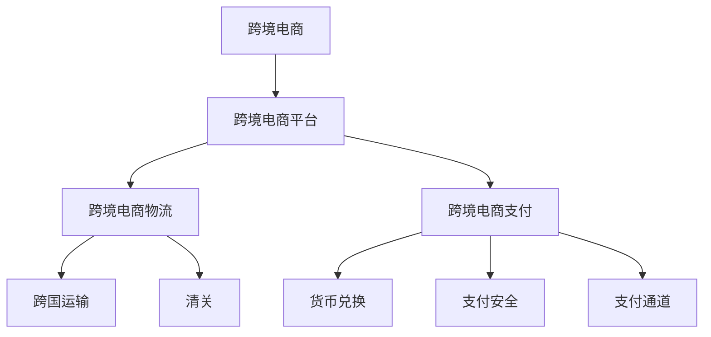

                 

随着全球跨境电商的蓬勃发展，阿里巴巴作为行业领军企业，其面试题的难度和深度也逐渐提升。本文旨在汇总2024年阿里巴巴跨境电商社招的面试真题，并提供详细的解答，帮助读者更好地理解和掌握跨境电商领域的专业知识。

## 文章关键词

- 阿里巴巴
- 跨境电商
- 面试真题
- 解答分析
- 行业知识

## 文章摘要

本文将围绕阿里巴巴2024年跨境电商社招的面试真题，进行系统的汇总和解答。文章内容涵盖了跨境电商的基本概念、运营策略、数据分析和平台技术等多个方面，旨在为准备阿里巴巴跨境电商面试的候选人提供全面的指导和参考。

## 1. 背景介绍

### 跨境电商的现状与发展

跨境电商作为国际贸易的新形态，正逐渐改变全球贸易格局。近年来，随着互联网技术的发展和物流基础设施的完善，跨境电商市场呈现高速增长态势。阿里巴巴作为中国跨境电商的领军企业，其业务规模和市场份额不断扩大，成为全球电商市场的重要组成部分。

### 阿里巴巴跨境电商业务

阿里巴巴旗下的跨境电商平台包括天猫国际、淘宝全球购、阿里巴巴国际站等，这些平台为国内外商家提供了丰富的商品和交易渠道。阿里巴巴跨境电商业务的核心竞争力在于其强大的生态系统，包括支付、物流、数据分析和智能营销等，这些能力为商家和消费者提供了全方位的服务和支持。

### 阿里巴巴跨境电商面试难度

阿里巴巴跨境电商面试难度相对较高，主要表现在以下几个方面：

- **专业知识要求**：面试官会深入考察候选人对跨境电商相关知识的理解和应用能力，包括国际贸易法规、电商运营策略、数据分析等。
- **技术能力要求**：技术岗位的面试会更加注重候选人的编程能力、系统设计能力和算法能力。
- **综合能力要求**：阿里巴巴注重候选人的团队合作能力、沟通能力和创新能力，这些能力在跨境电商业务中尤为重要。

## 2. 核心概念与联系

### 跨境电商核心概念

在深入了解阿里巴巴跨境电商面试题之前，我们需要明确几个核心概念：

- **跨境电商**：指在互联网的平台上，通过电子方式进行的跨境商品交易活动。
- **跨境电商平台**：为跨境电商交易提供平台的网站或应用程序，如天猫国际、淘宝全球购等。
- **跨境电商物流**：涉及跨国运输、清关、配送等环节的物流体系。
- **跨境电商支付**：涉及跨境货币兑换、支付安全、支付通道等环节的支付系统。

### 跨境电商架构图

以下是一个简化的跨境电商架构图，展示各个核心概念之间的联系：



## 3. 核心算法原理 & 具体操作步骤

### 3.1 算法原理概述

在跨境电商业务中，数据分析和算法应用是非常关键的。以下是一些常见的核心算法原理及其在跨境电商中的应用：

- **数据挖掘**：通过挖掘用户行为数据、交易数据等，发现潜在的用户需求和市场趋势。
- **推荐系统**：基于用户历史行为和商品特征，为用户提供个性化的商品推荐。
- **算法优化**：优化物流路径、库存管理等，提高运营效率。

### 3.2 算法步骤详解

以数据挖掘算法为例，其基本步骤如下：

1. **数据收集**：收集用户行为数据、交易数据等。
2. **数据清洗**：对数据进行清洗，去除噪音和重复数据。
3. **特征提取**：提取有用的特征，如用户浏览时长、购买频率等。
4. **模型训练**：使用机器学习算法，如决策树、支持向量机等，训练模型。
5. **模型评估**：评估模型的效果，如准确率、召回率等。
6. **模型部署**：将训练好的模型部署到生产环境中。

### 3.3 算法优缺点

- **数据挖掘**：优点在于可以深入了解用户需求和市场趋势，缺点是计算复杂度高，对数据质量要求较高。
- **推荐系统**：优点是提高用户满意度和购买转化率，缺点是可能引发信息过载和用户隐私问题。
- **算法优化**：优点是提高运营效率，缺点是可能需要大量计算资源和时间。

### 3.4 算法应用领域

算法在跨境电商中的应用非常广泛，包括：

- **用户行为分析**：通过数据挖掘和机器学习，了解用户购买习惯和偏好。
- **商品推荐**：通过推荐系统，提高用户购买体验和转化率。
- **物流优化**：通过算法优化，提高物流效率和降低成本。

## 4. 数学模型和公式 & 详细讲解 & 举例说明

### 4.1 数学模型构建

在跨境电商中，常见的数学模型包括：

- **线性回归模型**：用于预测商品销量、用户流失率等。
- **时间序列模型**：用于预测未来某段时间内的销售额、流量等。
- **决策树模型**：用于分类和预测，如商品推荐、客户流失预测等。

### 4.2 公式推导过程

以线性回归模型为例，其基本公式为：

\[ Y = \beta_0 + \beta_1X + \epsilon \]

其中，\( Y \) 为因变量，\( X \) 为自变量，\( \beta_0 \) 和 \( \beta_1 \) 为模型参数，\( \epsilon \) 为误差项。

### 4.3 案例分析与讲解

假设我们使用线性回归模型预测某商品的销量，已知以下数据：

| 时间 | 销量 |
|------|------|
| 1    | 100  |
| 2    | 150  |
| 3    | 200  |
| 4    | 250  |

我们可以通过线性回归模型来拟合这些数据，并预测未来某个时间点的销量。

1. **数据收集**：收集时间序列数据，包括时间 \( X \) 和销量 \( Y \)。
2. **数据清洗**：检查数据是否存在异常值和缺失值。
3. **特征提取**：提取时间 \( X \) 作为自变量，销量 \( Y \) 作为因变量。
4. **模型训练**：使用最小二乘法训练线性回归模型，得到模型参数 \( \beta_0 \) 和 \( \beta_1 \)。
5. **模型评估**：评估模型效果，如均方误差（MSE）等。
6. **模型部署**：将训练好的模型部署到生产环境中，用于销量预测。

## 5. 项目实践：代码实例和详细解释说明

### 5.1 开发环境搭建

1. 安装 Python 编译环境，版本要求 3.6及以上。
2. 安装相关依赖库，如 NumPy、Pandas、Scikit-learn 等。

### 5.2 源代码详细实现

以下是一个使用 Python 实现线性回归模型的简单示例：

```python
import numpy as np
import pandas as pd
from sklearn.linear_model import LinearRegression

# 数据收集
data = pd.DataFrame({'X': range(1, 5), 'Y': [100, 150, 200, 250]})

# 数据清洗
data.dropna(inplace=True)

# 特征提取
X = data['X'].values.reshape(-1, 1)
Y = data['Y'].values

# 模型训练
model = LinearRegression()
model.fit(X, Y)

# 模型评估
Y_pred = model.predict(X)
mse = np.mean((Y_pred - Y) ** 2)
print(f'MSE: {mse}')

# 模型部署
# 在生产环境中，可以将模型参数和训练好的模型保存下来，用于销量预测。
```

### 5.3 代码解读与分析

1. **数据收集**：使用 Pandas 读取时间序列数据，包括时间 \( X \) 和销量 \( Y \)。
2. **数据清洗**：使用 Pandas 的 dropna 方法去除缺失值。
3. **特征提取**：将时间 \( X \) 作为自变量，销量 \( Y \) 作为因变量。
4. **模型训练**：使用 Scikit-learn 的 LinearRegression 类训练模型。
5. **模型评估**：计算均方误差（MSE）评估模型效果。
6. **模型部署**：在需要预测销量时，使用训练好的模型进行预测。

## 6. 实际应用场景

### 6.1 跨境电商数据分析

跨境电商数据分析是跨境电商业务的重要环节，通过数据分析，可以深入了解用户行为、市场需求和运营状况。

- **用户行为分析**：通过数据挖掘算法，分析用户的浏览、搜索、购买等行为，发现潜在的用户需求和市场趋势。
- **市场需求分析**：通过数据分析，了解市场对哪些商品的需求较高，预测未来市场的走势。

### 6.2 跨境电商物流优化

跨境电商物流优化是提高运营效率的关键，通过算法优化，可以降低物流成本，提高配送速度。

- **物流路径优化**：通过算法计算最优物流路径，提高配送效率。
- **库存管理优化**：通过算法优化库存管理，减少库存成本。

### 6.3 跨境电商支付优化

跨境电商支付优化是提高用户体验的关键，通过算法优化，可以降低支付风险，提高支付成功率。

- **支付通道优化**：通过算法优化支付通道，提高支付成功率。
- **支付安全优化**：通过算法优化支付安全，降低支付风险。

## 7. 工具和资源推荐

### 7.1 学习资源推荐

- **书籍**：《跨境电商实战：策略、运营与营销》、《跨境电商数据化管理》
- **在线课程**：网易云课堂、慕课网等平台上的跨境电商相关课程。
- **博客和社区**：CSDN、博客园等技术社区，跨境电商相关的技术博客。

### 7.2 开发工具推荐

- **编程语言**：Python、Java 等。
- **数据分析和挖掘工具**：Pandas、NumPy、Scikit-learn 等。
- **机器学习框架**：TensorFlow、PyTorch 等。

### 7.3 相关论文推荐

- **《深度学习在跨境电商中的应用》**：探讨了深度学习在跨境电商领域中的应用，包括用户行为预测、商品推荐等。
- **《跨境电商物流优化研究》**：分析了跨境电商物流优化的方法和策略。
- **《跨境电商支付安全研究》**：研究了跨境电商支付的安全问题和解决方案。

## 8. 总结：未来发展趋势与挑战

### 8.1 研究成果总结

近年来，跨境电商领域取得了显著的研究成果，包括数据分析、算法优化、支付安全等方面的技术创新。这些成果为跨境电商业务的快速发展提供了有力的支持。

### 8.2 未来发展趋势

- **数据化和智能化**：随着大数据和人工智能技术的发展，跨境电商业务将更加数据化和智能化。
- **全球化**：跨境电商将越来越全球化，涵盖更多的国家和地区。
- **绿色物流**：随着环保意识的增强，绿色物流将成为跨境电商发展的重要趋势。

### 8.3 面临的挑战

- **政策法规**：跨境电商面临政策法规的挑战，需要不断适应和遵守各国政策法规。
- **技术挑战**：跨境电商技术的发展和更新速度较快，需要不断学习和跟进。
- **市场竞争**：跨境电商市场竞争激烈，需要不断提升自身竞争力。

### 8.4 研究展望

未来，跨境电商领域的研究将更加注重技术创新和实际应用。通过大数据、人工智能、区块链等技术的深入研究和应用，跨境电商业务将更加智能化、高效化，为全球贸易带来更多机遇。

## 9. 附录：常见问题与解答

### 9.1 跨境电商的定义是什么？

跨境电商是指在互联网平台上，通过电子方式进行的跨境商品交易活动。

### 9.2 跨境电商的优势有哪些？

跨境电商的优势包括：

- **市场广阔**：跨境电商不受地域限制，可以覆盖全球市场。
- **成本低**：通过互联网和物流体系的优化，跨境电商可以降低交易成本。
- **用户体验好**：跨境电商提供了丰富的商品选择和便捷的购物体验。

### 9.3 跨境电商的挑战有哪些？

跨境电商的挑战包括：

- **政策法规**：跨境电商需要遵守各国的政策法规，面临政策风险。
- **物流复杂**：跨境电商物流涉及跨国运输、清关等复杂环节。
- **支付问题**：跨境电商支付涉及货币兑换、支付安全等问题。

### 9.4 如何优化跨境电商物流？

优化跨境电商物流可以从以下几个方面进行：

- **物流路径优化**：通过算法优化物流路径，提高配送效率。
- **库存管理优化**：通过算法优化库存管理，减少库存成本。
- **物流信息共享**：通过物流信息共享，提高物流透明度和协同效率。

---

本文作为对阿里巴巴2024年跨境电商社招面试真题的汇总与解答，旨在为准备面试的读者提供全面的知识储备和实践指导。随着跨境电商业务的不断发展和创新，相信这篇文章能为读者在未来的职业生涯中提供有益的帮助。在阅读本文后，如果您有任何疑问或建议，欢迎在评论区留言，我们将在第一时间为您解答。作者：禅与计算机程序设计艺术 / Zen and the Art of Computer Programming。

