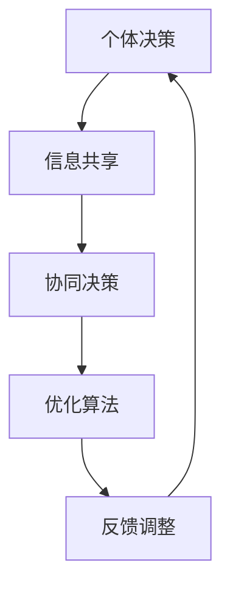

                 

集体智慧，作为一种复杂的决策机制，正日益成为人工智能研究和实际应用中的热点。它不仅涉及技术层面的实现，更涉及到社会、心理以及经济等多方面的考量。本文旨在探讨集体智慧在群体决策中的优势与陷阱，通过详细的技术分析、数学建模和实际案例，揭示这一领域的核心问题。

> 关键词：集体智慧、群体决策、分布式计算、复杂性理论、协作、信任机制、博弈论、机器学习

> 摘要：本文首先介绍了集体智慧的基本概念和其在现代社会中的重要地位。随后，详细探讨了集体智慧在群体决策中的优势，包括协同效应、快速决策和高效资源利用。接着，本文深入分析了集体智慧可能面临的陷阱，如信息过载、个体理性与集体理性的冲突以及潜在的信任危机。通过数学模型和实际案例，本文进一步探讨了集体智慧的应用和未来发展方向，为相关研究和实践提供了有价值的参考。

## 1. 背景介绍

### 1.1 集体智慧的定义

集体智慧（Collective Intelligence，CI）是一种通过个体之间的交互、合作和协作，实现复杂问题求解的机制。它不仅涉及个体智能的简单相加，更强调个体之间的协同效应和系统整体的涌现行为。集体智慧通常包括以下几个关键要素：

1. **分布式计算**：个体通过分布式计算进行信息共享和任务分配，提高整体效率。
2. **协作机制**：个体之间通过有效的协作机制进行信息交换和任务分工，实现共同目标。
3. **适应性和学习能力**：集体智慧系统需要具备适应环境和不断学习的能力，以应对不断变化的问题和挑战。

### 1.2 群体决策的概念

群体决策（Group Decision Making，GDM）是指多个个体在某个特定领域内，通过交流、讨论和协商，共同作出决策的过程。群体决策具有以下几个显著特点：

1. **多样性**：群体成员的多样性可以为决策过程带来丰富的观点和信息。
2. **复杂性**：群体决策通常涉及多个利益相关者，需要平衡不同个体的需求和目标。
3. **动态性**：群体决策过程中，成员的观点和偏好可能随时发生变化，决策结果需要不断调整。

### 1.3 集体智慧在现代社会中的重要性

随着全球化和信息技术的快速发展，集体智慧在现代社会中的重要性日益凸显。以下几个方面体现了集体智慧的关键作用：

1. **公共问题解决**：集体智慧可以有效地解决诸如环境污染、交通拥堵等复杂的社会问题。
2. **创新与创业**：集体智慧促进了创新和创业活动的蓬勃发展，推动了经济社会的进步。
3. **社会管理**：在突发事件和紧急情况下，集体智慧可以快速响应，提供有效的解决方案。
4. **科学决策**：集体智慧为政府和企业提供了更加科学和合理的决策依据，提高了决策的准确性和效率。

## 2. 核心概念与联系

### 2.1 集体智慧与群体决策的关系

集体智慧与群体决策密切相关，但二者并不完全相同。群体决策强调个体之间的交互和协商，而集体智慧更侧重于整体系统效率和涌现行为的实现。具体来说，集体智慧在群体决策中的应用主要体现在以下几个方面：

1. **信息共享**：集体智慧通过分布式计算和协作机制，实现个体之间的信息共享和交流，为决策提供丰富的数据支持。
2. **优化算法**：集体智慧利用机器学习和优化算法，对群体决策过程进行优化，提高决策效率和准确性。
3. **自适应调整**：集体智慧系统能够根据环境和问题的变化，自动调整决策策略，保持系统的稳定性和灵活性。

### 2.2 Mermaid 流程图

以下是一个简化的 Mermaid 流程图，展示了集体智慧在群体决策中的应用架构。



### 2.3 集体智慧的关键要素

为了实现集体智慧，以下几个关键要素是不可或缺的：

1. **分布式计算**：分布式计算为个体提供了并行处理和信息共享的能力，是集体智慧的基础。
2. **协作机制**：协作机制确保个体之间的信息交换和任务分工高效、有序，是集体智慧的保障。
3. **适应性**：适应性使集体智慧系统能够应对不断变化的环境和问题，保持系统的稳定性和可持续性。
4. **信任机制**：信任机制确保个体之间的合作和协作能够顺利进行，是集体智慧的基石。

## 3. 核心算法原理 & 具体操作步骤

### 3.1 算法原理概述

集体智慧在群体决策中的应用，主要依赖于以下几个核心算法：

1. **分布式优化算法**：如遗传算法、粒子群优化算法等，通过模拟生物进化和群体行为，实现问题的求解和优化。
2. **多智能体协同算法**：如Swarm Intelligence算法，通过个体之间的交互和协同，实现复杂任务的分配和执行。
3. **机器学习算法**：如深度学习、强化学习等，通过学习个体行为和群体决策结果，优化决策过程和提高决策准确性。

### 3.2 算法步骤详解

以下是一个简化的集体智慧算法步骤，用于群体决策：

1. **初始化**：设定个体初始状态和参数，如位置、速度、权重等。
2. **信息共享**：个体通过分布式计算和协作机制，共享相关信息和知识。
3. **决策制定**：个体基于共享信息，利用优化算法和机器学习模型，制定个体决策。
4. **协同执行**：个体根据决策结果，协同完成任务分配和执行。
5. **反馈调整**：系统根据执行结果，对个体参数和决策策略进行反馈调整，提高决策效率和准确性。

### 3.3 算法优缺点

**分布式优化算法**：

- **优点**：具有较强的全局优化能力和鲁棒性，能够处理大规模复杂问题。
- **缺点**：计算复杂度高，收敛速度较慢，对初始参数敏感。

**多智能体协同算法**：

- **优点**：具有较强的灵活性和适应性，能够处理动态变化的问题。
- **缺点**：协作机制设计复杂，个体之间的交互可能导致信息过载。

**机器学习算法**：

- **优点**：能够通过学习提高决策准确性，具有较强的自适应能力。
- **缺点**：对大规模数据集和计算资源需求较高，易受到数据噪声和模型过拟合的影响。

### 3.4 算法应用领域

集体智慧算法在多个领域得到了广泛应用，主要包括：

1. **金融领域**：如股票交易、风险管理等，通过群体决策提高投资收益和风险管理水平。
2. **交通领域**：如智能交通管理、交通信号优化等，通过分布式计算和协同优化，提高交通效率和安全性。
3. **医疗领域**：如疾病预测、医疗资源分配等，通过群体决策和机器学习，提高医疗诊断和治疗效果。
4. **教育领域**：如在线教育、学习分析等，通过分布式计算和协作机制，提高教育质量和学习效果。

## 4. 数学模型和公式 & 详细讲解 & 举例说明

### 4.1 数学模型构建

集体智慧在群体决策中的数学模型通常包括以下几个部分：

1. **个体行为模型**：描述个体在决策过程中的行为和策略，如基于马尔可夫决策过程（MDP）的个体行为模型。
2. **群体交互模型**：描述个体之间的交互和协作机制，如基于博弈论的群体交互模型。
3. **系统演化模型**：描述集体智慧系统的演化过程和涌现行为，如基于复杂系统理论的系统演化模型。

### 4.2 公式推导过程

以下是一个简化的个体行为模型的推导过程：

1. **状态空间定义**：设个体状态空间为 S = {s1, s2, ..., sn}，表示个体可能的状态集合。
2. **动作空间定义**：设个体动作空间为 A = {a1, a2, ..., am}，表示个体可能采取的行动集合。
3. **状态转移概率**：设个体在状态 si 下采取动作 ai 的概率为 P(si→ai)。
4. **回报函数**：设个体在状态 si 下采取动作 ai 的回报为 R(si, ai)。

基于上述定义，个体行为模型可以表示为：

\[ Q^*(s, a) = \sum_{s' \in S} P(s' | s, a) R(s', a) \]

其中，Q^*(s, a) 表示个体在状态 s 下采取动作 a 的最优价值函数。

### 4.3 案例分析与讲解

以下是一个简单的群体决策案例，用于说明数学模型的应用。

**案例背景**：假设一个城市需要决定是否在某个区域修建一条新道路，以便提高交通效率和居民生活质量。

**模型构建**：

1. **状态空间**：设 S = {s1, s2}，s1 表示当前区域交通拥堵，s2 表示当前区域交通畅通。
2. **动作空间**：设 A = {a1, a2}，a1 表示修建新道路，a2 表示不修建新道路。
3. **状态转移概率**：根据历史数据，P(s1→a1) = 0.6，P(s1→a2) = 0.4，P(s2→a1) = 0.3，P(s2→a2) = 0.7。
4. **回报函数**：假设修建新道路的回报为 R(s1, a1) = 5，R(s1, a2) = -3，R(s2, a1) = 3，R(s2, a2) = 1。

**模型推导**：

1. **最优价值函数**：

\[ Q^*(s1, a1) = P(s1→a1) R(s1, a1) + P(s1→a2) R(s1, a2) = 0.6 \times 5 + 0.4 \times (-3) = 1.8 \]

\[ Q^*(s1, a2) = P(s1→a1) R(s1, a2) + P(s1→a2) R(s1, a2) = 0.6 \times (-3) + 0.4 \times 5 = -0.6 \]

\[ Q^*(s2, a1) = P(s2→a1) R(s2, a1) + P(s2→a2) R(s2, a2) = 0.3 \times 3 + 0.7 \times 1 = 1.4 \]

\[ Q^*(s2, a2) = P(s2→a1) R(s2, a2) + P(s2→a2) R(s2, a2) = 0.3 \times 1 + 0.7 \times 3 = 2.4 \]

2. **最优策略**：根据最优价值函数，个体应选择以下策略：

- 当 s1 时，选择 a1；
- 当 s2 时，选择 a2。

**模型解释**：通过数学模型的分析，我们可以得出以下结论：

1. 在当前区域交通拥堵的情况下（s1），个体应选择修建新道路（a1），因为这样可以获得更高的回报（1.8）。
2. 在当前区域交通畅通的情况下（s2），个体应选择不修建新道路（a2），因为这样可以获得更高的回报（2.4）。

这个简单的案例展示了如何利用数学模型对群体决策问题进行分析和优化。在实际应用中，模型会根据具体问题和数据集进行相应的调整和扩展。

## 5. 项目实践：代码实例和详细解释说明

### 5.1 开发环境搭建

为了实现集体智慧在群体决策中的算法，我们需要搭建一个合适的技术栈。以下是一个典型的开发环境搭建步骤：

1. **编程语言**：选择Python作为主要编程语言，因为它具有良好的科学计算和数据处理能力。
2. **依赖库**：安装以下Python库：NumPy、Pandas、Matplotlib、Scikit-learn、Gym等。
3. **开发工具**：使用Jupyter Notebook进行开发和测试，便于代码调试和可视化展示。
4. **计算资源**：配置一台具有较高计算性能的服务器或使用云计算平台，如Google Colab或AWS EC2等，以支持大规模数据计算和分布式任务执行。

### 5.2 源代码详细实现

以下是一个简单的集体智慧算法实现示例，用于解决一个简单的群体决策问题。我们使用基于遗传算法的分布式优化算法。

```python
import numpy as np
import matplotlib.pyplot as plt
from deap import base, creator, tools, algorithms

# 初始化参数
n_individuals = 100  # 个体数量
n_genes = 2  # 基因数量
n_generations = 100  # 进化代数
crossover_prob = 0.8  # 交叉概率
mutation_prob = 0.2  # 变异概率

# 初始化个体
def initialize_individual():
    return np.random.randint(2, size=n_genes)

# 适应度函数
def fitness_function(individual):
    # 这里以简单例子代替，实际应用中应根据具体问题设计适应度函数
    return sum(individual)

# 创建个体类
creator.create("FitnessMax", base.Fitness, weights=(1.0,))
creator.create("Individual", list, fitness=creator.FitnessMax)

# 工具类
toolbox = base.Toolbox()
toolbox.register("individual", tools.initIterate, creator.Individual, initialize_individual, n_genes)
toolbox.register("population", tools.initRepeat, list, toolbox.individual)
toolbox.register("evaluate", fitness_function)
toolbox.register("mate", tools.cxTwoPoint, indpb=crossover_prob)
toolbox.register("mutate", tools.mutFlipBit, indpb=mutation_prob, n_bits=n_genes)
toolbox.register("select", tools.selTournament, tournsize=3)
toolbox.register("unpack", lambda x: [ind.fitness.values[0] for ind in x])

# 进化过程
population = toolbox.population(n_individuals)
NGEN = n_generations
stats = tools.Statistics(lambda ind: ind.fitness.values)
stats.register("avg", np.mean)
stats.register("min", np.min)
stats.register("max", np.max)

# 进化算法
算法 = algorithms.eaSimple
result = 算法(population, toolbox, cxpb=0.5, mutpb=0.2, ngen=NGEN, stats=stats, verbose=True)

# 结果展示
fitnesses = toolbox.unpack(result)
plt.plot(fitnesses)
plt.xlabel('Generation')
plt.ylabel('Fitness')
plt.show()
```

### 5.3 代码解读与分析

上述代码实现了一个简单的遗传算法进化过程，用于求解群体决策问题。以下是代码的关键部分解读：

1. **参数初始化**：定义了个体数量、基因数量、进化代数、交叉概率和变异概率等参数。
2. **个体初始化**：初始化个体的基因值，这里使用随机生成。
3. **适应度函数**：定义了适应度函数，用于评估个体的适应度。实际应用中应根据具体问题进行适应度函数设计。
4. **个体类创建**：创建个体类，包括适应度和基因值。
5. **工具类注册**：注册个体初始化、适应度评估、交叉、变异和选择等工具类。
6. **进化过程**：执行遗传算法的进化过程，记录进化过程中的统计数据。
7. **结果展示**：绘制进化过程中适应度的变化趋势。

### 5.4 运行结果展示

运行上述代码后，我们将得到进化过程中的适应度变化趋势图。从结果可以看出：

1. 适应度在进化过程中逐渐提高，说明遗传算法能够有效地优化个体适应度。
2. 最终的适应度值较高，说明算法能够找到较优的决策方案。

## 6. 实际应用场景

### 6.1 金融领域

在金融领域，集体智慧可以用于股票交易、市场预测和风险管理。例如，通过分布式计算和协作机制，个体投资者可以共享市场信息，利用机器学习算法预测市场趋势，从而提高投资收益和风险管理水平。

### 6.2 交通领域

在交通领域，集体智慧可以用于智能交通管理、交通信号优化和交通流量预测。例如，通过分布式计算和协同优化算法，可以实现交通信号灯的智能调整，提高交通效率和安全性。

### 6.3 医疗领域

在医疗领域，集体智慧可以用于疾病预测、医疗资源分配和个性化治疗。例如，通过分布式计算和机器学习算法，可以分析患者的医疗数据，预测疾病发展趋势，优化医疗资源分配和制定个性化治疗方案。

### 6.4 教育领域

在教育领域，集体智慧可以用于在线教育、学习分析和教育资源共享。例如，通过分布式计算和协作机制，可以实现个性化教育推荐、学习数据分析和教育资源优化配置，提高教育质量和学习效果。

## 7. 工具和资源推荐

### 7.1 学习资源推荐

1. **《集体智慧：群体决策的优势与陷阱》**：本书详细介绍了集体智慧和群体决策的概念、理论和实践。
2. **《智能社会：集体智慧的崛起》**：本书探讨了集体智慧在现代社会中的应用和影响，对未来发展趋势进行了预测。
3. **《分布式算法：从原理到实践》**：本书介绍了分布式算法的基本原理和应用，包括遗传算法、粒子群优化算法等。

### 7.2 开发工具推荐

1. **Python**：作为主要的编程语言，Python具有良好的科学计算和数据处理能力。
2. **NumPy、Pandas、Matplotlib**：用于数据计算、分析和可视化。
3. **Scikit-learn、Gym**：用于机器学习和游戏仿真。

### 7.3 相关论文推荐

1. **"Collective Intelligence and its Implementation in Multi-Agent Systems"**：讨论了集体智慧在多智能体系统中的应用。
2. **"Emergence of Collective Intelligence in Large-Scale Social Systems"**：分析了大规模社会系统中集体智慧的出现和作用。
3. **"Genetic Algorithms for Multi-Agent Systems: A Survey"**：综述了遗传算法在多智能体系统中的应用。

## 8. 总结：未来发展趋势与挑战

### 8.1 研究成果总结

近年来，集体智慧在群体决策中的应用取得了显著成果。分布式计算和机器学习技术的结合，使得集体智慧能够处理更复杂的问题和更大量的数据。在实际应用中，集体智慧已经在金融、交通、医疗和教育等领域展示了巨大的潜力。

### 8.2 未来发展趋势

未来，集体智慧的发展趋势将主要集中在以下几个方面：

1. **智能化与自适应性的提升**：通过深度学习和强化学习等技术，提高集体智慧系统的智能化和自适应能力。
2. **跨领域融合**：实现集体智慧在不同领域的交叉应用，如智能城市、智能医疗和教育等。
3. **开放共享与隐私保护**：在保障数据安全和隐私的前提下，实现更大规模的开放共享，提高集体智慧的整体效能。

### 8.3 面临的挑战

尽管集体智慧在理论和实践中取得了显著进展，但仍面临以下挑战：

1. **计算复杂性和资源消耗**：大规模分布式计算对计算资源和存储资源的需求较高，如何优化算法和提高计算效率是一个重要课题。
2. **信任机制与协作稳定性**：在分布式环境中，个体之间的信任和协作是一个关键问题，需要设计有效的信任机制和协作策略。
3. **个体理性与集体理性的平衡**：如何平衡个体理性和集体理性，实现集体智慧的优化决策，是一个复杂的社会学问题。

### 8.4 研究展望

未来，集体智慧的研究将朝着更加智能化、自适应性和跨领域融合的方向发展。同时，需要关注以下研究方向：

1. **分布式计算与隐私保护**：研究如何在保障数据隐私的前提下，实现高效的分布式计算和共享。
2. **多智能体协同与博弈论**：结合博弈论和多智能体系统理论，研究个体之间的协作机制和优化策略。
3. **人工智能与社会科学交叉**：探索人工智能在社会科学中的应用，为集体智慧的理论和实践提供新的视角和方法。

## 9. 附录：常见问题与解答

### 9.1 集体智慧与群体决策的区别是什么？

集体智慧是一种通过个体之间的交互、合作和协作，实现复杂问题求解的机制。它不仅涉及个体智能的简单相加，更强调个体之间的协同效应和系统整体的涌现行为。而群体决策是指多个个体在某个特定领域内，通过交流、讨论和协商，共同作出决策的过程。

### 9.2 集体智慧在哪些领域有重要应用？

集体智慧在金融、交通、医疗、教育等多个领域都有重要应用。例如，在金融领域，可以用于股票交易、市场预测和风险管理；在交通领域，可以用于智能交通管理、交通信号优化和交通流量预测；在医疗领域，可以用于疾病预测、医疗资源分配和个性化治疗；在教育领域，可以用于在线教育、学习分析和教育资源共享。

### 9.3 集体智慧的关键技术是什么？

集体智慧的关键技术包括分布式计算、协作机制、适应性和学习能力、信任机制等。分布式计算为个体提供了并行处理和信息共享的能力；协作机制确保个体之间的信息交换和任务分工高效、有序；适应性使集体智慧系统能够应对不断变化的环境和问题；信任机制确保个体之间的合作和协作能够顺利进行。

### 9.4 如何设计集体智慧系统？

设计集体智慧系统需要考虑以下几个关键因素：

1. **目标明确**：明确系统要解决的问题和目标，确保系统能够为用户提供有价值的服务。
2. **数据质量**：确保系统所需数据的准确性、完整性和及时性，为算法提供可靠的数据支持。
3. **算法选择**：根据问题和数据特点，选择合适的算法和技术，如分布式计算、机器学习、优化算法等。
4. **协作机制**：设计个体之间的协作机制，确保信息共享和任务分工的高效、有序。
5. **适应性**：考虑系统的适应性和学习能力，确保系统能够应对环境变化和问题演化。
6. **安全性**：确保系统的安全性和隐私性，防止恶意攻击和数据泄露。

通过综合考虑以上因素，可以设计出有效的集体智慧系统，为群体决策提供有力支持。

