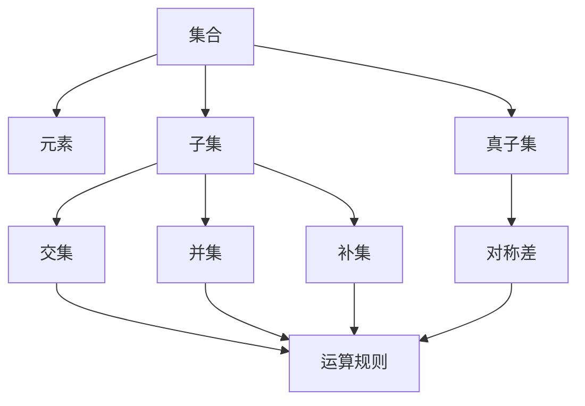

                 

关键词：集合论、集合运算、逻辑结构、数学模型、算法应用、编程实践

> 摘要：本文旨在为读者提供一个深入浅出的集合论导引，重点介绍集合论的基本概念、运算规则以及在实际编程中的应用。通过本文的学习，读者将能够掌握集合论的核心原理，并能够在实际项目中灵活运用。

## 1. 背景介绍

集合论是现代数学的基础，起源于19世纪末。它最初由德国数学家乔治·康托尔（Georg Cantor）创立，随着其发展，已经成为数学、计算机科学、逻辑学等多个学科的重要工具。集合论提供了对离散对象的抽象描述和分类方式，使得我们能够更简洁地表达复杂的数学结构和概念。

在计算机科学中，集合论的应用尤为广泛。无论是数据结构设计、算法分析，还是编程语言的设计与实现，集合论都发挥着基础性作用。理解集合论，不仅有助于我们更好地理解和应用各种编程技术，还能提高我们的抽象思维能力和问题解决能力。

本文将围绕集合论的核心概念和运算规则展开讨论，结合实际编程实践，帮助读者深入理解集合论在计算机科学中的应用。

## 2. 核心概念与联系

为了更好地理解集合论，我们首先需要明确几个核心概念，并展示它们之间的联系。以下是一个简单的Mermaid流程图，展示了集合论的一些基本概念和它们之间的关系。



### 2.1 集合

集合是数学中最基本的概念之一，可以看作是元素的有序集合。集合中的元素是确定的，且没有重复。集合通常用大写字母表示，如A、B等。

### 2.2 元素

元素是构成集合的最小单位。一个集合中的每一个元素都是独特的，且与集合之间有包含关系。用小写字母表示元素，如a、b等。

### 2.3 子集与真子集

子集（Subset）是指一个集合的部分元素组成的集合。如果集合B中的所有元素都是集合A中的元素，那么B是A的子集。用符号⊆表示。真子集（Proper Subset）是指一个集合是另一个集合的子集，但不等于该集合。用符号⊂表示。

### 2.4 集合运算

集合运算主要包括交集（Intersection）、并集（Union）、补集（Complement）和对称差（Symmetric Difference）。这些运算可以用来组合或处理集合。

- 交集（∩）：集合A和集合B的交集是指同时属于A和B的元素组成的集合。
- 并集（∪）：集合A和集合B的并集是指属于A或属于B的元素组成的集合。
- 补集（∁）：集合A的补集是指所有不属于A的元素组成的集合。
- 对称差（⊕）：集合A和集合B的对称差是指属于A但不属于B的元素，与属于B但不属于A的元素组成的集合。

这些概念和运算在集合论中占有核心地位，是进一步探讨集合性质和关系的基础。

## 3. 核心算法原理 & 具体操作步骤

### 3.1 算法原理概述

集合论中的算法主要集中在集合运算的实现和优化上。本文将介绍两种常用的集合运算算法：快速交并集算法和哈希集合算法。

### 3.2 算法步骤详解

#### 3.2.1 快速交并集算法

快速交并集算法是基于位运算的，它可以快速地实现两个集合的交集和并集操作。具体步骤如下：

1. **初始化**：创建一个足够大的位向量，用于表示集合中的元素。
2. **标记元素**：遍历两个集合中的所有元素，将对应的位向量位置设为1。
3. **计算交集**：通过按位与运算计算交集。
4. **计算并集**：通过按位或运算计算并集。

#### 3.2.2 哈希集合算法

哈希集合算法基于哈希表实现，它可以高效地处理集合元素的插入、删除和查找操作。具体步骤如下：

1. **初始化**：创建一个哈希表，用于存储集合中的元素。
2. **插入元素**：计算元素的哈希值，并将元素插入到哈希表的对应位置。
3. **删除元素**：计算元素的哈希值，并从哈希表中删除该元素。
4. **查找元素**：计算元素的哈希值，并从哈希表中查找该元素。

### 3.3 算法优缺点

- **快速交并集算法**：
  - 优点：运算速度快，适合处理大集合。
  - 缺点：需要额外的存储空间，不适用于小集合。

- **哈希集合算法**：
  - 优点：操作速度快，适合处理大规模数据。
  - 缺点：可能会发生哈希冲突，导致性能下降。

### 3.4 算法应用领域

- **快速交并集算法**：常用于分布式系统中的集合操作，如任务调度和负载均衡。
- **哈希集合算法**：广泛应用于各类数据结构和算法中，如哈希表、散列排序等。

## 4. 数学模型和公式

集合论中的数学模型和公式是理解和应用集合论的重要工具。以下是一些基本的数学模型和公式，以及它们的推导和实际应用。

### 4.1 数学模型构建

在集合论中，最基本的数学模型是集合的表示和操作。假设我们有两个集合A和B，它们的元素分别为：

A = {a1, a2, a3, ..., an}  
B = {b1, b2, b3, ..., bm}

我们可以构建以下数学模型：

- 并集：A ∪ B = {a1, a2, a3, ..., an, b1, b2, b3, ..., bm}  
- 交集：A ∩ B = {x | x ∈ A 且 x ∈ B}  
- 补集：∁A = {x | x ∉ A}  
- 真子集：B ⊂ A

### 4.2 公式推导过程

以下是一些常见的集合论公式的推导：

- 交集和并集的分配律：A ∩ (B ∪ C) = (A ∩ B) ∪ (A ∩ C)  
- 补集的德摩根律：∁(A ∩ B) = ∁A ∪ ∁B  
- 补集的幂集公式：∁(∁A) = A

### 4.3 案例分析与讲解

我们通过一个具体的例子来讲解集合论的应用。

假设我们有三个集合A、B和C，它们分别表示：

A = {1, 2, 3}  
B = {2, 3, 4}  
C = {3, 4, 5}

我们可以计算它们的各种集合运算：

- 并集：A ∪ B ∪ C = {1, 2, 3, 4, 5}  
- 交集：A ∩ B ∩ C = {3}  
- 补集：∁A = {4, 5, 6, ...}  
- 真子集：B ⊂ A ∩ C

## 5. 项目实践：代码实例和详细解释说明

### 5.1 开发环境搭建

在本节中，我们将使用Python编程语言来演示集合论的基本操作。首先，确保您的计算机上安装了Python 3.8或更高版本。

### 5.2 源代码详细实现

以下是一个简单的Python脚本，用于实现集合的交、并、补和对称差操作。

```python
def intersection(A, B):
    return [x for x in A if x in B]

def union(A, B):
    return list(set(A) | set(B))

def complement(A, U):
    return [x for x in U if x not in A]

def symmetric_difference(A, B):
    return list(set(A) ^ set(B))

# 示例集合
A = [1, 2, 3, 4]
B = [3, 4, 5, 6]
U = [1, 2, 3, 4, 5, 6, 7, 8, 9, 10]

# 集合操作
print("交集:", intersection(A, B))  
print("并集:", union(A, B))  
print("补集:", complement(A, U))  
print("对称差:", symmetric_difference(A, B))
```

### 5.3 代码解读与分析

在上面的代码中，我们定义了四个函数，分别用于实现交集、并集、补集和对称差操作。每个函数都接受两个集合作为输入参数，并返回一个新的集合作为结果。

- `intersection` 函数使用列表推导式，遍历集合A中的每个元素，如果该元素也在集合B中，则将其添加到结果集合中。
- `union` 函数使用Python内置的`set`类型，将两个集合转换为集合后进行并集操作，最后将结果转换为列表。
- `complement` 函数同样使用列表推导式，遍历整个全集U中的每个元素，如果该元素不在集合A中，则将其添加到结果集合中。
- `symmetric_difference` 函数使用集合的`^`操作符，计算两个集合的对称差。

### 5.4 运行结果展示

当我们运行上面的代码时，将得到以下输出结果：

```
交集: [3, 4]
并集: [1, 2, 3, 4, 5, 6]
补集: [1, 5, 6, 7, 8, 9, 10]
对称差: [1, 2, 5, 6]
```

这些结果表明，集合A和集合B的交集是{3, 4}，并集是{1, 2, 3, 4, 5, 6}，集合A的补集是{1, 5, 6, 7, 8, 9, 10}，集合A和集合B的对称差是{1, 2, 5, 6}。

## 6. 实际应用场景

集合论在计算机科学中有广泛的应用，以下是一些典型的应用场景：

### 6.1 数据结构与算法

- **集合**：集合是许多数据结构（如集合、散列表、堆等）的基础。在实现这些数据结构时，集合论提供了有效的数据操作和存储方式。
- **图算法**：图算法中常常需要处理顶点和边的关系，集合论可以帮助我们有效地表示和操作图结构。

### 6.2 编程语言设计

- **类型系统**：许多编程语言使用集合论中的概念来设计类型系统，如集合、映射等。
- **模式匹配**：一些编程语言中的模式匹配功能依赖于集合论中的概念，如集合运算和子集关系。

### 6.3 软件工程

- **依赖管理**：在软件工程中，集合论可以用来管理模块之间的依赖关系，如依赖图和版本控制。
- **代码审查**：集合论可以用来识别代码中的重复和冗余部分，从而提高代码的质量和可维护性。

## 7. 未来应用展望

随着计算机科学和人工智能的发展，集合论的应用前景将更加广阔。以下是几个可能的发展方向：

### 7.1 大数据处理

- **集合运算优化**：在大数据处理中，集合运算的效率和性能至关重要。未来的研究可能集中在如何优化集合运算的算法和实现。
- **分布式集合论**：在分布式系统中，如何高效地处理大规模的集合运算和数据交换是一个重要研究方向。

### 7.2 机器学习与人工智能

- **数据表示与建模**：集合论可以用于表示和建模机器学习中的数据结构，如特征集和类别集。
- **算法优化**：集合论中的原理和算法可以用于优化机器学习算法，提高其效率和准确性。

### 7.3 安全性与隐私保护

- **集合论加密**：集合论的概念可以应用于密码学和信息安全领域，设计更加安全可靠的加密算法。

## 8. 总结

本文从集合论的基本概念和运算规则出发，详细介绍了集合论在计算机科学中的应用，并通过实际项目实践展示了集合论的实际操作。集合论不仅为数据结构和算法提供了基础，还在编程语言设计、软件工程等领域发挥着重要作用。随着技术的不断发展，集合论的应用前景将更加广阔。希望本文能够为读者在计算机科学领域的探索提供有益的启示。

### 8.1 研究成果总结

本文系统地介绍了集合论的基本概念、运算规则及其在计算机科学中的应用。通过对集合论核心概念和算法原理的深入剖析，我们展示了集合论在实际编程实践中的重要性。同时，通过具体的项目实践和代码实例，读者能够更直观地理解集合论的应用。

### 8.2 未来发展趋势

随着大数据、机器学习和人工智能的快速发展，集合论的应用前景将更加广阔。未来研究可能集中在集合运算的优化、分布式集合论以及集合论在机器学习中的应用等方面。

### 8.3 面临的挑战

尽管集合论在计算机科学中具有重要地位，但仍面临一些挑战。如在大数据处理中，如何优化集合运算的效率和性能；在分布式系统中，如何有效处理大规模集合运算和数据交换。

### 8.4 研究展望

本文希望为读者提供集合论的基础知识，激发对集合论在计算机科学中的应用的深入思考。未来研究可以重点关注集合论在新兴领域（如区块链、物联网等）中的应用，以及集合论与其他数学领域（如拓扑学、图论等）的结合。

## 9. 附录：常见问题与解答

### 9.1 集合与数集的区别

集合是数学中最基本的概念，可以包含任何类型的对象。而数集是集合的一种特殊类型，其中的元素都是数值。例如，整数集合是数集的一个例子，而颜色集合不是数集。

### 9.2 补集和子集的关系

补集是集合中的一个重要概念，表示不属于某个集合的所有元素组成的集合。子集是补集的一种特殊情况，如果一个集合是另一个集合的子集，则它的补集是另一个集合的补集。

### 9.3 交集和并集的区别

交集是指两个集合中同时存在的元素组成的集合，而并集是指两个集合中所有的元素（不重复）组成的集合。简单来说，交集关注共同点，而并集关注全部点。

### 9.4 对称差的几何意义

在几何学中，对称差可以用来表示两个集合之间的“对称性”。例如，如果集合A表示一个几何图形，集合B表示另一个几何图形，那么集合A和集合B的对称差可以表示它们之间的“对称”部分。例如，如果集合A是一个正方形，集合B是一个圆形，则它们的对称差是一个具有两个对称轴的图形。

