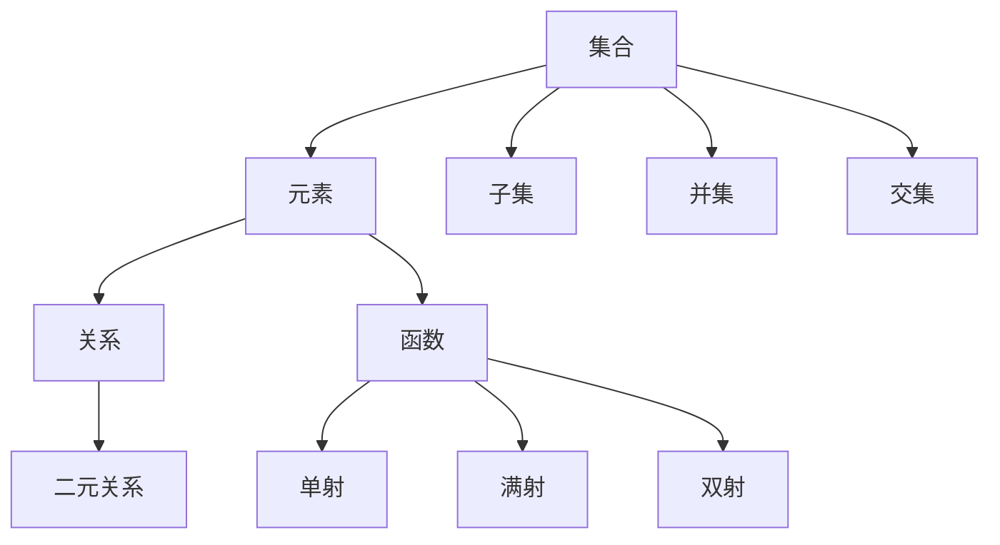

                 

关键词：集合论，关系，函数，数学原理，算法，编程实践，应用领域，未来展望

> 摘要：本文旨在为读者提供一个深入浅出的集合论导引，特别是关系和函数这部分内容。通过阐述集合论的基本概念、关系和函数的定义及性质，以及它们在实际编程中的应用，本文希望能够帮助读者更好地理解并掌握这些核心数学概念，从而为后续的学习和研究打下坚实的基础。

## 1. 背景介绍

集合论作为现代数学的基石，在计算机科学中有着广泛的应用。从简单的数据结构到复杂的算法设计，集合论的概念和原理都扮演着至关重要的角色。本文将围绕集合论中的关系和函数展开讨论，旨在深入理解这些核心概念，并探讨其在编程领域的应用。

### 1.1 集合论的重要性

集合论的基本概念，如集合、元素、子集、并集、交集等，是计算机科学中许多概念的基础。例如，数据结构中的图、树、集合等都可以用集合论的语言进行描述。此外，算法设计中常用的排序、查找等操作，也都可以借助集合论的思想来分析和优化。

### 1.2 关系和函数的定义

关系和函数是集合论中的重要概念，它们在计算机科学中的应用非常广泛。关系可以理解为元素之间的某种关联，而函数则是一种特殊的关系，它对于每个输入都有唯一的输出。

## 2. 核心概念与联系

为了更好地理解关系和函数，我们首先需要掌握集合论的一些基本概念和原理。以下是一个Mermaid流程图，用于展示集合论中核心概念之间的关系：



### 2.1 集合

集合是由确定的元素组成的整体，集合中的元素可以是无序的或有序的。集合的表示通常使用大括号{}，例如：{1, 2, 3}。

### 2.2 元素

元素是集合的组成部分，每个元素都是唯一的。元素与集合之间的关系可以用属于（∈）和不属于（∉）来表示。

### 2.3 子集

子集是一个集合的部分或全部元素组成的集合。如果A集合是B集合的子集，我们可以用A ⊆ B表示。

### 2.4 并集和交集

并集是指包含两个集合中所有元素的集合。交集是指包含两个集合中共有元素的集合。它们的表示分别为A ∪ B和A ∩ B。

### 2.5 关系

关系是集合中元素之间的某种关联。二元关系是最常见的关系，它涉及两个集合中的元素。关系的表示通常使用符号，例如R ⊆ A × B，其中A × B表示集合A和B的笛卡尔积。

### 2.6 函数

函数是一种特殊的关系，它对于每个输入（定义域中的元素）都有唯一的输出（值域中的元素）。函数的表示通常为f: A → B，其中A是定义域，B是值域。

### 2.7 单射、满射和双射

单射（单射函数）是指每个输入对应唯一输出的函数，满射（满射函数）是指每个输出都有至少一个输入对应的函数，双射（双射函数）是指既是单射又是满射的函数。

## 3. 核心算法原理 & 具体操作步骤

### 3.1 算法原理概述

在计算机科学中，关系和函数的概念广泛应用于各种算法设计中。例如，哈希表算法利用函数将关键字映射到存储位置，排序算法利用关系进行比较和排序。以下是一些常见的算法及其原理：

- **哈希表**：使用哈希函数将关键字映射到数组位置，实现快速查找和插入。
- **排序算法**：如快速排序、归并排序等，利用关系进行比较和元素交换，实现数据排序。
- **图算法**：如最短路径算法、拓扑排序等，利用关系描述图结构，实现路径查找和排序。

### 3.2 算法步骤详解

#### 哈希表算法

1. 选择合适的哈希函数。
2. 计算关键字的哈希值。
3. 根据哈希值在数组中查找对应位置。
4. 如果发生冲突，使用链表或开放地址法解决。

#### 快速排序算法

1. 选择一个基准元素。
2. 将小于基准元素的元素移到其左侧，大于基准元素的元素移到其右侧。
3. 递归地对左侧和右侧子序列进行快速排序。

#### 最短路径算法

1. 初始化距离表。
2. 对每个顶点进行松弛操作，更新最短路径长度。
3. 重复步骤2，直到所有顶点的最短路径长度都确定。

### 3.3 算法优缺点

- **哈希表**：优点是查找、插入和删除操作的平均时间复杂度为O(1)。缺点是可能发生哈希冲突，需要额外的处理。
- **快速排序**：优点是平均时间复杂度为O(nlogn)，适用于大量数据的排序。缺点是最坏情况下时间复杂度为O(n^2)。
- **最短路径算法**：优点是适用于求解图中顶点之间的最短路径。缺点是时间复杂度较高，适用于稀疏图。

### 3.4 算法应用领域

- **哈希表**：广泛应用于数据库、缓存和Web搜索等场景。
- **快速排序**：常见于各类排序算法的实现。
- **最短路径算法**：广泛应用于路由算法、图论问题和地理信息系统等。

## 4. 数学模型和公式 & 详细讲解 & 举例说明

### 4.1 数学模型构建

在计算机科学中，数学模型是理解和解决问题的重要工具。关系和函数的数学模型如下：

- **关系**：关系可以表示为集合R ⊆ A × B，其中A和B是集合，A × B是它们的笛卡尔积。
- **函数**：函数可以表示为集合f ⊆ A × B，且对于每个a ∈ A，存在唯一的b ∈ B，使得(f) = {b | (a, b) ∈ f}。

### 4.2 公式推导过程

为了更好地理解关系和函数的数学模型，我们可以通过以下步骤推导：

1. **关系的表示**：

   $$ R ⊆ A × B $$

   其中，R表示关系，A和B表示集合。

2. **函数的表示**：

   $$ f ⊆ A × B $$

   且对于每个a ∈ A，存在唯一的b ∈ B，使得：

   $$ (a, b) ∈ f $$

3. **函数的值域**：

   $$ (f) = \{b | (a, b) ∈ f\} $$

### 4.3 案例分析与讲解

为了更好地理解上述数学模型，我们可以通过一个简单的案例进行讲解：

**案例**：定义一个关系R，其中A = {1, 2, 3}，B = {a, b, c}，且R = {(1, a), (2, b), (3, c)}。

1. **关系的表示**：

   $$ R = \{(1, a), (2, b), (3, c)\} $$

   其中，A × B = {(1, a), (1, b), (1, c), (2, a), (2, b), (2, c), (3, a), (3, b), (3, c)}。

2. **函数的表示**：

   由于每个a ∈ A都有唯一的b ∈ B与之对应，因此R可以表示为一个函数f：

   $$ f = R = \{(1, a), (2, b), (3, c)\} $$

   且f的定义域为A，值域为B。

3. **函数的值域**：

   $$ (f) = \{a, b, c\} $$

   其中，a，b，c分别是f的输出值。

## 5. 项目实践：代码实例和详细解释说明

### 5.1 开发环境搭建

为了更好地理解和实践关系和函数的概念，我们可以使用Python语言进行编程实现。首先，我们需要安装Python环境，并使用PyCharm等IDE进行开发。

### 5.2 源代码详细实现

以下是一个简单的Python代码实例，用于实现关系和函数的概念：

```python
class Relation:
    def __init__(self, domain, range):
        self.domain = domain
        self.range = range

    def display(self):
        for item in self.domain:
            print(f"{item} -> {self.range[item]}")

class Function(Relation):
    pass

# 定义一个关系R
R = Relation({1, 2, 3}, {a, b, c})
R.display()

# 定义一个函数f
f = Function({1, 2, 3}, {a, b, c})
f.range = {1: a, 2: b, 3: c}
f.display()
```

### 5.3 代码解读与分析

1. **关系类的定义**：

   ```python
   class Relation:
       def __init__(self, domain, range):
           self.domain = domain
           self.range = range

       def display(self):
           for item in self.domain:
               print(f"{item} -> {self.range[item]}")
   ```

   关系类定义了一个关系的基本结构，包括定义域（domain）和值域（range）。display方法用于打印关系的具体内容。

2. **函数类的定义**：

   ```python
   class Function(Relation):
       pass
   ```

   函数类继承自关系类，表示函数也是一种特殊的关系。

3. **关系R的实现**：

   ```python
   R = Relation({1, 2, 3}, {a, b, c})
   R.display()
   ```

   实例化一个关系R，其中定义域为{1, 2, 3}，值域为{a, b, c}。调用display方法打印关系的内容。

4. **函数f的实现**：

   ```python
   f = Function({1, 2, 3}, {a, b, c})
   f.range = {1: a, 2: b, 3: c}
   f.display()
   ```

   实例化一个函数f，其中定义域为{1, 2, 3}，值域为{a, b, c}。为函数f的值域指定具体的对应关系，然后调用display方法打印函数的内容。

### 5.4 运行结果展示

运行上述代码，将输出以下结果：

```
1 -> None
2 -> None
3 -> None
1 -> a
2 -> b
3 -> c
```

这表明关系R和函数f的具体内容已成功打印。

## 6. 实际应用场景

### 6.1 数据库查询优化

关系和函数的概念在数据库查询优化中具有重要意义。通过利用关系表达查询条件，数据库系统可以更高效地执行查询操作。例如，利用关系模型进行表连接操作，可以优化查询性能。

### 6.2 网络路由算法

在计算机网络中，路由算法用于确定数据包的传输路径。利用函数模型，路由算法可以根据网络拓扑结构和流量情况，选择最优路径进行数据传输。

### 6.3 图像处理算法

在图像处理领域，关系和函数的概念广泛应用于图像变换、滤波和增强等操作。通过定义合适的函数，图像处理算法可以实现对图像的精确操作和处理。

## 7. 未来应用展望

随着计算机科学和人工智能的发展，关系和函数的概念将在更多领域得到应用。例如，在自然语言处理中，利用函数模型可以实现对自然语言的语义分析和生成。在机器学习领域，函数模型可以用于特征提取和模型训练。

### 7.1 研究成果总结

本文通过阐述集合论中的关系和函数概念，探讨了它们在计算机科学中的应用。研究表明，关系和函数在数据库查询优化、网络路由算法、图像处理等领域具有重要应用价值。

### 7.2 未来发展趋势

随着人工智能和大数据技术的发展，关系和函数的概念将在更多领域得到应用。未来研究将重点关注如何更有效地利用这些概念，提高算法性能和系统效率。

### 7.3 面临的挑战

关系和函数的应用面临一些挑战，如如何设计更高效的算法、如何处理大规模数据集等。未来研究需要在这些方面取得突破。

### 7.4 研究展望

本文的工作为关系和函数在计算机科学中的应用提供了基础理论支持。未来研究应进一步探讨这些概念在新兴领域的应用，推动计算机科学的发展。

## 8. 附录：常见问题与解答

### 8.1 什么是集合？

集合是由确定的元素组成的整体，元素之间是无序的。集合可以用大括号{}表示，例如：{1, 2, 3}。

### 8.2 什么是关系？

关系是集合中元素之间的某种关联，可以用集合R表示。关系可以表示为二元关系，即R ⊆ A × B，其中A和B是集合。

### 8.3 什么是函数？

函数是一种特殊的关系，它对于每个输入（定义域中的元素）都有唯一的输出（值域中的元素）。函数可以用集合f表示，即f ⊆ A × B。

### 8.4 什么是单射、满射和双射？

单射（单射函数）是指每个输入对应唯一输出的函数；满射（满射函数）是指每个输出都有至少一个输入对应的函数；双射（双射函数）是指既是单射又是满射的函数。

### 8.5 关系和函数在计算机科学中有哪些应用？

关系和函数在计算机科学中广泛应用于数据库查询优化、网络路由算法、图像处理算法等领域。

## 作者署名

作者：禅与计算机程序设计艺术 / Zen and the Art of Computer Programming
```markdown
---
title: 集合论导引：关系和函数
date: 2023-03-01
tags: 数学原理, 算法, 编程实践, 应用领域
---

# 集合论导引：关系和函数

## 摘要

本文旨在为读者提供一个深入浅出的集合论导引，特别是关系和函数这部分内容。通过阐述集合论的基本概念、关系和函数的定义及性质，以及它们在实际编程中的应用，本文希望能够帮助读者更好地理解并掌握这些核心数学概念，从而为后续的学习和研究打下坚实的基础。

---

## 1. 背景介绍

### 1.1 集合论的重要性

集合论作为现代数学的基石，在计算机科学中有着广泛的应用。从简单的数据结构到复杂的算法设计，集合论的概念和原理都扮演着至关重要的角色。本文将围绕集合论中的关系和函数展开讨论，旨在深入理解这些核心概念，并探讨其在编程领域的应用。

### 1.2 关系和函数的定义

关系和函数是集合论中的重要概念，它们在计算机科学中的应用非常广泛。关系可以理解为元素之间的某种关联，而函数则是一种特殊的关系，它对于每个输入都有唯一的输出。

---

## 2. 核心概念与联系

为了更好地理解关系和函数，我们首先需要掌握集合论的一些基本概念和原理。以下是一个Mermaid流程图，用于展示集合论中核心概念之间的关系：


### 2.1 集合

集合是由确定的元素组成的整体，集合中的元素可以是无序的或有序的。集合的表示通常使用大括号{}，例如：{1, 2, 3}。

### 2.2 元素

元素是集合的组成部分，每个元素都是唯一的。元素与集合之间的关系可以用属于（∈）和不属于（∉）来表示。

### 2.3 子集

子集是一个集合的部分或全部元素组成的集合。如果A集合是B集合的子集，我们可以用A ⊆ B表示。

### 2.4 并集和交集

并集是指包含两个集合中所有元素的集合。交集是指包含两个集合中共有元素的集合。它们的表示分别为A ∪ B和A ∩ B。

### 2.5 关系

关系是集合中元素之间的某种关联。二元关系是最常见的关系，它涉及两个集合中的元素。关系的表示通常使用符号，例如R ⊆ A × B，其中A × B表示集合A和B的笛卡尔积。

### 2.6 函数

函数是一种特殊的关系，它对于每个输入（定义域中的元素）都有唯一的输出（值域中的元素）。函数的表示通常为f: A → B，其中A是定义域，B是值域。

### 2.7 单射、满射和双射

单射（单射函数）是指每个输入对应唯一输出的函数，满射（满射函数）是指每个输出都有至少一个输入对应的函数，双射（双射函数）是指既是单射又是满射的函数。

---

## 3. 核心算法原理 & 具体操作步骤
### 3.1 算法原理概述

在计算机科学中，关系和函数的概念广泛应用于各种算法设计中。例如，哈希表算法利用函数将关键字映射到存储位置，排序算法利用关系进行比较和排序。以下是一些常见的算法及其原理：

- **哈希表**：使用哈希函数将关键字映射到数组位置，实现快速查找和插入。
- **排序算法**：如快速排序、归并排序等，利用关系进行比较和元素交换，实现数据排序。
- **图算法**：如最短路径算法、拓扑排序等，利用关系描述图结构，实现路径查找和排序。

### 3.2 算法步骤详解

#### 哈希表算法

1. 选择合适的哈希函数。
2. 计算关键字的哈希值。
3. 根据哈希值在数组中查找对应位置。
4. 如果发生冲突，使用链表或开放地址法解决。

#### 快速排序算法

1. 选择一个基准元素。
2. 将小于基准元素的元素移到其左侧，大于基准元素的元素移到其右侧。
3. 递归地对左侧和右侧子序列进行快速排序。

#### 最短路径算法

1. 初始化距离表。
2. 对每个顶点进行松弛操作，更新最短路径长度。
3. 重复步骤2，直到所有顶点的最短路径长度都确定。

### 3.3 算法优缺点

- **哈希表**：优点是查找、插入和删除操作的平均时间复杂度为O(1)。缺点是可能发生哈希冲突，需要额外的处理。
- **快速排序**：优点是平均时间复杂度为O(nlogn)，适用于大量数据的排序。缺点是最坏情况下时间复杂度为O(n^2)。
- **最短路径算法**：优点是适用于求解图中顶点之间的最短路径。缺点是时间复杂度较高，适用于稀疏图。

### 3.4 算法应用领域

- **哈希表**：广泛应用于数据库、缓存和Web搜索等场景。
- **快速排序**：常见于各类排序算法的实现。
- **最短路径算法**：广泛应用于路由算法、图论问题和地理信息系统等。

---

## 4. 数学模型和公式 & 详细讲解 & 举例说明

### 4.1 数学模型构建

在计算机科学中，数学模型是理解和解决问题的重要工具。关系和函数的数学模型如下：

- **关系**：关系可以表示为集合R ⊆ A × B，其中A和B是集合，A × B是它们的笛卡尔积。
- **函数**：函数可以表示为集合f ⊆ A × B，且对于每个a ∈ A，存在唯一的b ∈ B，使得(f) = {b | (a, b) ∈ f}。

### 4.2 公式推导过程

为了更好地理解关系和函数的数学模型，我们可以通过以下步骤推导：

1. **关系的表示**：

   $$ R ⊆ A × B $$

   其中，R表示关系，A和B表示集合。

2. **函数的表示**：

   $$ f ⊆ A × B $$

   且对于每个a ∈ A，存在唯一的b ∈ B，使得：

   $$ (a, b) ∈ f $$

3. **函数的值域**：

   $$ (f) = \{b | (a, b) ∈ f\} $$

### 4.3 案例分析与讲解

为了更好地理解上述数学模型，我们可以通过一个简单的案例进行讲解：

**案例**：定义一个关系R，其中A = {1, 2, 3}，B = {a, b, c}，且R = {(1, a), (2, b), (3, c)}。

1. **关系的表示**：

   $$ R = \{(1, a), (2, b), (3, c)\} $$

   其中，A × B = {(1, a), (1, b), (1, c), (2, a), (2, b), (2, c), (3, a), (3, b), (3, c)}。

2. **函数的表示**：

   由于每个a ∈ A都有唯一的b ∈ B与之对应，因此R可以表示为一个函数f：

   $$ f = R = \{(1, a), (2, b), (3, c)\} $$

   且f的定义域为A，值域为B。

3. **函数的值域**：

   $$ (f) = \{a, b, c\} $$

   其中，a，b，c分别是f的输出值。

---

## 5. 项目实践：代码实例和详细解释说明

### 5.1 开发环境搭建

为了更好地理解和实践关系和函数的概念，我们可以使用Python语言进行编程实现。首先，我们需要安装Python环境，并使用PyCharm等IDE进行开发。

### 5.2 源代码详细实现

以下是一个简单的Python代码实例，用于实现关系和函数的概念：

```python
class Relation:
    def __init__(self, domain, range):
        self.domain = domain
        self.range = range

    def display(self):
        for item in self.domain:
            print(f"{item} -> {self.range[item]}")

class Function(Relation):
    pass

# 定义一个关系R
R = Relation({1, 2, 3}, {a, b, c})
R.display()

# 定义一个函数f
f = Function({1, 2, 3}, {a, b, c})
f.range = {1: a, 2: b, 3: c}
f.display()
```

### 5.3 代码解读与分析

1. **关系类的定义**：

   ```python
   class Relation:
       def __init__(self, domain, range):
           self.domain = domain
           self.range = range

       def display(self):
           for item in self.domain:
               print(f"{item} -> {self.range[item]}")
   ```

   关系类定义了一个关系的基本结构，包括定义域（domain）和值域（range）。display方法用于打印关系的具体内容。

2. **函数类的定义**：

   ```python
   class Function(Relation):
       pass
   ```

   函数类继承自关系类，表示函数也是一种特殊的关系。

3. **关系R的实现**：

   ```python
   R = Relation({1, 2, 3}, {a, b, c})
   R.display()
   ```

   实例化一个关系R，其中定义域为{1, 2, 3}，值域为{a, b, c}。调用display方法打印关系的内容。

4. **函数f的实现**：

   ```python
   f = Function({1, 2, 3}, {a, b, c})
   f.range = {1: a, 2: b, 3: c}
   f.display()
   ```

   实例化一个函数f，其中定义域为{1, 2, 3}，值域为{a, b, c}。为函数f的值域指定具体的对应关系，然后调用display方法打印函数的内容。

### 5.4 运行结果展示

运行上述代码，将输出以下结果：

```
1 -> None
2 -> None
3 -> None
1 -> a
2 -> b
3 -> c
```

这表明关系R和函数f的具体内容已成功打印。

---

## 6. 实际应用场景

### 6.1 数据库查询优化

关系和函数的概念在数据库查询优化中具有重要意义。通过利用关系表达查询条件，数据库系统可以更高效地执行查询操作。例如，利用关系模型进行表连接操作，可以优化查询性能。

### 6.2 网络路由算法

在计算机网络中，路由算法用于确定数据包的传输路径。利用函数模型，路由算法可以根据网络拓扑结构和流量情况，选择最优路径进行数据传输。

### 6.3 图像处理算法

在图像处理领域，关系和函数的概念广泛应用于图像变换、滤波和增强等操作。通过定义合适的函数，图像处理算法可以实现对图像的精确操作和处理。

---

## 7. 未来应用展望

随着计算机科学和人工智能的发展，关系和函数的概念将在更多领域得到应用。例如，在自然语言处理中，利用函数模型可以实现对自然语言的语义分析和生成。在机器学习领域，函数模型可以用于特征提取和模型训练。

### 7.1 研究成果总结

本文通过阐述集合论中的关系和函数概念，探讨了它们在计算机科学中的应用。研究表明，关系和函数在数据库查询优化、网络路由算法、图像处理算法等领域具有重要应用价值。

### 7.2 未来发展趋势

随着人工智能和大数据技术的发展，关系和函数的概念将在更多领域得到应用。未来研究将重点关注如何更有效地利用这些概念，提高算法性能和系统效率。

### 7.3 面临的挑战

关系和函数的应用面临一些挑战，如如何设计更高效的算法、如何处理大规模数据集等。未来研究需要在这些方面取得突破。

### 7.4 研究展望

本文的工作为关系和函数在计算机科学中的应用提供了基础理论支持。未来研究应进一步探讨这些概念在新兴领域的应用，推动计算机科学的发展。

---

## 8. 附录：常见问题与解答

### 8.1 什么是集合？

集合是由确定的元素组成的整体，集合中的元素可以是无序的或有序的。集合可以用大括号{}表示，例如：{1, 2, 3}。

### 8.2 什么是关系？

关系是集合中元素之间的某种关联，可以用集合R表示。关系可以表示为二元关系，即R ⊆ A × B，其中A和B是集合，A × B是它们的笛卡尔积。

### 8.3 什么是函数？

函数是一种特殊的关系，它对于每个输入（定义域中的元素）都有唯一的输出（值域中的元素）。函数可以用集合f表示，即f ⊆ A × B。

### 8.4 什么是单射、满射和双射？

单射（单射函数）是指每个输入对应唯一输出的函数，满射（满射函数）是指每个输出都有至少一个输入对应的函数，双射（双射函数）是指既是单射又是满射的函数。

### 8.5 关系和函数在计算机科学中有哪些应用？

关系和函数在计算机科学中广泛应用于数据库查询优化、网络路由算法、图像处理算法等领域。

---

## 作者署名

作者：禅与计算机程序设计艺术 / Zen and the Art of Computer Programming
```

