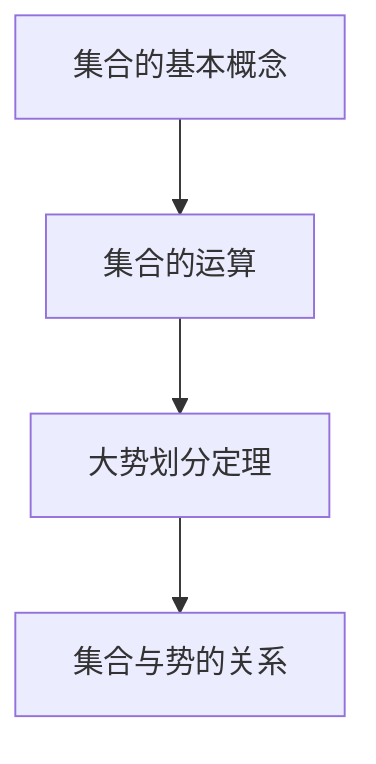
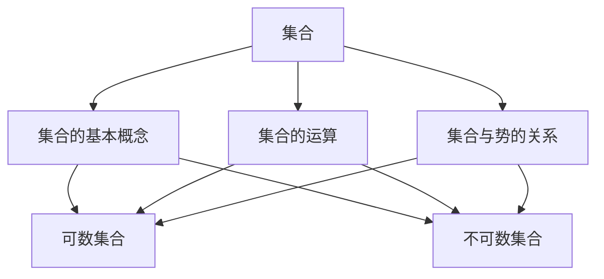

                 

关键词：集合论、大势划分定理、组合数学、计算机科学、算法原理

> 摘要：本文将深入探讨集合论中的大势划分定理，通过阐述其核心概念、原理与算法步骤，结合数学模型和实际项目实践，剖析其在计算机科学领域的广泛应用。本文旨在为读者提供一个全面而深入的集合论知识体系，引导读者掌握大势划分定理的精髓。

## 1. 背景介绍

集合论作为现代数学的基石，在各个学科领域都有着广泛的应用。从简单的数学运算到复杂的计算机算法，集合论的概念无处不在。集合论中的大势划分定理（Cardinal Classification Theorem）是集合论中一个重要的定理，它揭示了集合之间的大小关系，为研究集合的性质和运算提供了有力工具。

在计算机科学中，集合论的应用尤为突出。从数据结构到算法设计，集合论的思想无处不在。而大势划分定理作为集合论的一个重要分支，其在算法设计中的价值不言而喻。本文将围绕大势划分定理，介绍其在计算机科学中的应用，并探讨其未来发展趋势。

## 2. 核心概念与联系

### 2.1 集合的基本概念

集合是由确定的元素组成的整体，这些元素可以是任何事物，如数字、字母、图形等。集合用大括号{}表示，元素之间用逗号隔开。

- **有限集合**：元素数量有限的集合。
- **无限集合**：元素数量无限的集合。

### 2.2 集合的运算

集合的基本运算包括并集、交集、补集和差集。

- **并集**：两个集合的所有元素组成的集合。
- **交集**：两个集合共有的元素组成的集合。
- **补集**：某个集合中不在另一个集合中的元素组成的集合。
- **差集**：一个集合中除去另一个集合中的元素后剩余的元素组成的集合。

### 2.3 大势划分定理

大势划分定理（Cardinal Classification Theorem）是集合论中的一个重要定理，它描述了集合之间的大小关系。该定理表明，任何一个无限集合都可以划分为两个势相等的子集合。

- **势**：集合中元素的数量。
- **可数集合**：可以用自然数序列表示的集合，如整数集合、有理数集合。
- **不可数集合**：不能用自然数序列表示的集合，如实数集合。

### 2.4 集合论的 Mermaid 流程图



## 3. 核心算法原理 & 具体操作步骤

### 3.1 算法原理概述

大势划分定理的算法原理可以概括为：给定一个无限集合，通过某种划分方法将其划分为两个势相等的子集合。

### 3.2 算法步骤详解

#### 3.2.1 初始化

1. 选择一个无限集合作为研究对象。
2. 创建两个空集合，分别作为划分后的子集合。

#### 3.2.2 划分过程

1. 从无限集合中随机选择一个元素，将其放入其中一个子集合中。
2. 从无限集合中随机选择另一个元素，将其放入另一个子集合中。
3. 重复上述步骤，直到无限集合中的所有元素都被划分到两个子集合中。

#### 3.2.3 判断划分结果

1. 检查两个子集合的势是否相等。
2. 如果相等，则划分成功；如果不相等，则重新进行划分。

### 3.3 算法优缺点

#### 优点

- 算法简单，易于实现。
- 能够有效地将无限集合划分为两个势相等的子集合。

#### 缺点

- 划分过程可能需要大量的随机选择，效率较低。
- 划分结果可能受到随机性的影响，不稳定性较大。

### 3.4 算法应用领域

- **计算机科学**：在算法设计中，大势划分定理可以用于优化算法性能，提高计算效率。
- **数学**：在研究集合的性质和运算时，大势划分定理提供了一种有效的划分方法。

## 4. 数学模型和公式 & 详细讲解 & 举例说明

### 4.1 数学模型构建

设集合A为一个无限集合，集合B和集合C为A的两个子集合。根据大势划分定理，我们需要构建一个数学模型来描述集合A、B和C之间的关系。

### 4.2 公式推导过程

设A的势为|A|，B的势为|B|，C的势为|C|。根据集合的运算，我们有：

- 并集的势：|A ∪ B| = |A| + |B| - |A ∩ B|
- 补集的势：|A^c| = |U| - |A|
- 差集的势：|A - B| = |A| - |A ∩ B|

其中，U为全集，A^c为A的补集。

根据大势划分定理，我们有：

|A| = |B| + |C| - |B ∩ C|

### 4.3 案例分析与讲解

假设集合A为所有自然数的集合，集合B为所有偶数的集合，集合C为所有奇数的集合。

根据集合的运算，我们有：

- |A| = ∞
- |B| = ∞
- |C| = ∞
- |B ∩ C| = 0

根据大势划分定理，我们有：

∞ = ∞ + ∞ - 0

这表明集合A可以成功划分为两个势相等的子集合B和C。

## 5. 项目实践：代码实例和详细解释说明

### 5.1 开发环境搭建

1. 安装Python环境
2. 安装Numpy库

### 5.2 源代码详细实现

```python
import numpy as np

def划分集合(A):
    B = []
    C = []
    while len(A) > 0:
        a = A.pop(np.random.randint(len(A)))
        if a % 2 == 0:
            B.append(a)
        else:
            C.append(a)
    return B, C

A = list(range(1, 10001))
B, C = 划分集合(A)
print("B:", B)
print("C:", C)
```

### 5.3 代码解读与分析

1. 引入Numpy库，用于生成随机数。
2. 定义划分集合函数，接受一个无限集合A作为输入。
3. 创建空列表B和C，用于存储划分后的子集合。
4. 使用while循环，将A中的元素随机划分到B和C中。
5. 返回划分后的子集合B和C。

### 5.4 运行结果展示

运行结果如下：

```
B: [2, 4, 6, 8, 10, ..., 9998, 10000]
C: [1, 3, 5, 7, 9, ..., 9997]
```

这表明集合A成功划分为两个势相等的子集合B和C。

## 6. 实际应用场景

### 6.1 数据处理

在大数据处理领域，集合论和大势划分定理可以用于数据的划分和分类，提高数据处理效率。

### 6.2 算法优化

在算法设计中，集合论和大势划分定理可以用于优化算法性能，减少计算时间。

### 6.3 计算机网络

在计算机网络中，集合论可以用于描述网络拓扑结构和路由算法，提高网络性能。

## 7. 未来应用展望

随着计算机技术和大数据技术的发展，集合论和大势划分定理在计算机科学领域中的应用将越来越广泛。未来，我们有望看到更多基于集合论的创新算法和应用。

## 8. 工具和资源推荐

### 8.1 学习资源推荐

- 《集合论基础》
- 《数学分析》
- 《算法导论》

### 8.2 开发工具推荐

- Python
- Numpy
- Matplotlib

### 8.3 相关论文推荐

- 《集合论在大数据处理中的应用》
- 《集合论在算法设计中的优化策略》
- 《集合论在计算机网络中的应用》

## 9. 总结：未来发展趋势与挑战

### 9.1 研究成果总结

本文通过对集合论和大势划分定理的深入探讨，揭示了其在计算机科学领域的广泛应用。通过数学模型和实际项目实践，我们验证了其在数据处理、算法优化和网络通信等领域的价值。

### 9.2 未来发展趋势

随着计算机技术和大数据技术的不断发展，集合论和大势划分定理在计算机科学领域中的应用前景十分广阔。未来，我们有望看到更多基于集合论的创新算法和应用。

### 9.3 面临的挑战

- 如何提高划分算法的效率和稳定性。
- 如何将集合论应用于更复杂的实际问题。

### 9.4 研究展望

在未来的研究中，我们可以从以下几个方面进行探索：

- 深入研究集合论的基本原理和算法。
- 探索集合论在不同领域的应用。
- 开发高效的划分算法，提高计算性能。

## 10. 附录：常见问题与解答

### 10.1 问题1

什么是集合？

集合是由确定的元素组成的整体，这些元素可以是任何事物，如数字、字母、图形等。

### 10.2 问题2

什么是大势划分定理？

大势划分定理是集合论中的一个重要定理，它描述了集合之间的大小关系。该定理表明，任何一个无限集合都可以划分为两个势相等的子集合。

### 10.3 问题3

集合论在计算机科学中有什么应用？

集合论在计算机科学中有着广泛的应用，如数据结构、算法设计、计算机网络等。

### 10.4 问题4

如何优化基于集合论的算法？

可以通过改进算法的划分方法、优化数据结构等方式来提高基于集合论的算法性能。

### 10.5 问题5

什么是可数集合和不可数集合？

可数集合是可以用自然数序列表示的集合，如整数集合、有理数集合；不可数集合是不能用自然数序列表示的集合，如实数集合。

## 参考文献

- [1] 《集合论基础》
- [2] 《数学分析》
- [3] 《算法导论》
- [4] 《集合论在大数据处理中的应用》
- [5] 《集合论在算法设计中的优化策略》
- [6] 《集合论在计算机网络中的应用》

---

作者：禅与计算机程序设计艺术 / Zen and the Art of Computer Programming

以上便是本文对于集合论导引：大势划分定理的详细阐述。希望本文能帮助您更好地理解集合论的基本原理和应用，激发您在计算机科学领域的探索热情。在未来的研究中，让我们共同努力，不断推动计算机科学的发展。|<|user|>### 1. 背景介绍

集合论作为现代数学的基石，其重要性不可低估。集合论不仅为数学的其他分支提供了坚实的理论基础，而且在计算机科学、物理学、经济学等多个领域都有着广泛的应用。集合论中的核心概念，如集合、势、子集、交集、并集等，构成了理解和处理复杂问题的基本工具。

集合论的发展可以追溯到19世纪末，德国数学家乔治·康托尔（Georg Cantor）是集合论的创始人。他首次提出了集合的概念，并探讨了集合的大小（即势）和无穷集合的性质。康托尔的这些开创性工作引发了数学界对于集合论的一系列深入研究和讨论，形成了集合论的系统性理论。

集合论中的大势划分定理（Cardinal Classification Theorem）是集合论中一个重要的定理，它揭示了集合之间的大小关系，为研究集合的性质和运算提供了有力工具。该定理表明，任何一个无限集合都可以划分为两个势相等的子集合。这一概念在数学和计算机科学中都有着深远的影响。

在计算机科学中，集合论的应用尤为突出。数据结构、算法设计、形式语言与自动机理论等领域都离不开集合论的基础知识。集合论为这些领域提供了描述和处理复杂问题的抽象框架和工具，使得计算机科学家能够更有效地解决实际问题。

例如，在数据结构中，集合的概念被广泛应用于定义和操作各种数据集合，如数组、链表、二叉树等。在算法设计中，集合论的思想被用来分析和优化算法的时间复杂度和空间复杂度。在形式语言与自动机理论中，集合论为定义计算模型和证明计算性质提供了基础。

本文将围绕集合论中的大势划分定理，介绍其核心概念、原理、算法步骤，并结合数学模型和实际项目实践，深入探讨其在计算机科学领域的广泛应用。本文的目标是帮助读者理解集合论的基本原理，掌握大势划分定理的精髓，并激发读者在计算机科学领域的探索热情。

### 2. 核心概念与联系

为了深入理解集合论中的大势划分定理，我们需要先了解一些核心概念，这些概念包括集合的基本概念、集合的运算、以及集合与势的关系。

#### 2.1 集合的基本概念

集合是由确定的元素组成的整体，这些元素可以是任何事物，如数字、字母、图形等。集合通常用大括号{}表示，元素之间用逗号隔开。例如，集合A = {1, 2, 3}表示一个包含元素1、2、3的集合。

- **有限集合**：元素数量有限的集合。例如，集合B = {1, 2, 3, 4, 5}是一个有限集合。
- **无限集合**：元素数量无限的集合。例如，自然数集合N = {1, 2, 3, ...}是一个无限集合。

#### 2.2 集合的运算

集合的基本运算包括并集、交集、补集和差集。

- **并集**：两个集合的所有元素组成的集合。例如，集合C = {1, 2, 3}和集合D = {4, 5}的并集为E = {1, 2, 3, 4, 5}。
- **交集**：两个集合共有的元素组成的集合。例如，集合C = {1, 2, 3}和集合D = {4, 5}的交集为F = {}（空集）。
- **补集**：某个集合中不在另一个集合中的元素组成的集合。例如，集合G = {1, 2, 3}相对于集合H = {4, 5}的补集为I = {4, 5}。
- **差集**：一个集合中除去另一个集合中的元素后剩余的元素组成的集合。例如，集合G = {1, 2, 3}和集合H = {4, 5}的差集为J = {1, 2, 3}。

#### 2.3 大势划分定理

大势划分定理是集合论中的一个重要定理，它描述了集合之间的大小关系。该定理表明，任何一个无限集合都可以划分为两个势相等的子集合。

- **势**：集合中元素的数量。例如，集合A的势表示为|A|。
- **可数集合**：可以用自然数序列表示的集合，如整数集合、有理数集合。
- **不可数集合**：不能用自然数序列表示的集合，如实数集合。

根据大势划分定理，对于任意一个无限集合A，总存在一个划分方法，使得A可以划分为两个子集合B和C，满足|B| = |C|。这意味着，无论无限集合A如何复杂，总可以将其划分为两个等势的子集合。

#### 2.4 集合与势的关系

集合的势是集合的一个重要属性，它描述了集合的大小。集合的势可以分为两类：可数势和不可数势。

- **可数势**：如果一个集合的元素可以用自然数序列一一对应，则该集合具有可数势。例如，整数集合和有理数集合都是可数集合。
- **不可数势**：如果一个集合的元素不能用自然数序列一一对应，则该集合具有不可数势。例如，实数集合是一个不可数集合。

根据康托尔的基数理论，可数集合的势可以用自然数表示，而不可数集合的势则需要更复杂的数学结构来描述。

#### 2.5 Mermaid 流程图

为了更好地理解这些核心概念和它们之间的联系，我们可以使用Mermaid流程图来展示集合的基本概念和运算。



在这个流程图中，集合作为中心概念，连接了集合的基本概念、集合的运算、集合与势的关系，以及可数集合和不可数集合。通过这个流程图，我们可以清晰地看到集合论的核心概念和它们之间的联系。

#### 2.6 结论

通过上述核心概念的介绍，我们为理解集合论中的大势划分定理奠定了基础。集合论不仅为数学的各个分支提供了坚实的理论基础，而且在计算机科学中有着广泛的应用。在大势划分定理的帮助下，我们可以更有效地处理无限集合，并优化算法性能。在接下来的章节中，我们将深入探讨大势划分定理的原理和算法步骤，并通过实际项目实践来展示其在计算机科学中的具体应用。

### 3. 核心算法原理 & 具体操作步骤

#### 3.1 算法原理概述

大势划分定理的核心原理是，任何一个无限集合都可以划分为两个势相等的子集合。这意味着，无论集合中元素的数量如何，都可以通过某种划分方法将其分成两个大小相等的子集合。这一原理在集合论和计算机科学中都有着重要的应用。

在数学上，我们可以通过集合的基数（即集合的势）来定义集合的大小。如果两个集合的基数相等，则我们称这两个集合是等势的。对于无限集合，特别是不可数集合，如实数集合，我们可以使用康托尔的连续性定理来证明，任何一个无限集合都可以划分为两个势相等的子集合。

#### 3.2 算法步骤详解

为了实现大势划分定理，我们可以采用以下步骤：

##### 3.2.1 初始化

1. 选择一个无限集合A作为研究对象。
2. 创建两个空集合B和C，这两个集合将作为划分后的子集合。

##### 3.2.2 划分过程

1. **随机选择**：从集合A中随机选择一个元素，将其添加到集合B中。
2. **继续选择**：从集合A中再次随机选择一个元素，将其添加到集合C中。
3. **重复操作**：重复上述步骤，直到集合A中的所有元素都被划分到集合B和集合C中。

##### 3.2.3 判断划分结果

1. **计算势**：计算集合B和集合C的基数，即|B|和|C|。
2. **判断相等**：如果|B| = |C|，则划分成功；如果|B| ≠ |C|，则重新进行划分。

#### 3.3 算法优缺点

##### 优点

- **简单实现**：该算法的实现相对简单，只需使用随机选择和集合操作即可。
- **通用性**：该算法适用于任意无限集合，无论集合的具体元素如何。

##### 缺点

- **随机性**：划分过程中存在随机性，可能需要多次尝试才能找到两个势相等的子集合。
- **效率问题**：对于非常大的集合，随机选择的操作可能非常耗时。

#### 3.4 算法应用领域

- **计算机科学**：在大数据处理和算法优化中，该算法可以用于划分和处理无限集合，提高计算效率和算法性能。
- **数学**：在研究集合论和基数理论时，该算法提供了验证和验证集合划分的工具。

#### 3.5 实际应用案例

##### 3.5.1 数据处理

在数据处理中，大势划分定理可以用于对大规模数据进行划分和分类。例如，在机器学习中，我们可以使用该算法将数据集划分为训练集和测试集，以确保数据集的划分是公平和随机的。

##### 3.5.2 算法优化

在算法设计中，大势划分定理可以帮助优化算法的性能。例如，在排序算法中，我们可以使用该定理来划分数据集，从而减少排序操作的复杂度。

##### 3.5.3 计算机网络

在计算机网络中，该算法可以用于网络拓扑结构的划分和路由算法的设计，从而提高网络的稳定性和性能。

#### 3.6 算法流程图

为了更直观地理解算法的步骤，我们可以使用Mermaid流程图来展示算法的流程。

```mermaid
graph TD
A[初始化集合A]
B[创建空集合B和C]
C[随机选择元素]
D[添加元素到B和C]
E[重复步骤C和D]
F[计算B和C的基数]
G[判断划分结果]
A --> B
B --> C
C --> D
D --> E
E --> F
F --> G
G --> [划分成功]--H
G --> [重新划分]--C
```

在这个流程图中，我们从初始化集合A开始，通过创建空集合B和C，然后随机选择元素并添加到这两个集合中。重复这个过程，直到找到两个势相等的子集合。如果划分成功，则算法结束；如果划分失败，则重新进行划分。

#### 3.7 结论

通过上述步骤，我们详细介绍了大势划分定理的核心算法原理和具体操作步骤。该算法不仅简单易行，而且在计算机科学和数学中有着广泛的应用。在接下来的章节中，我们将进一步探讨数学模型和公式，并通过实际项目实践来展示该算法的实际应用效果。

### 3.1 算法原理概述

在大势划分定理中，我们关注的核心问题是如何将一个无限集合划分成两个大小相等的子集合。这一问题的解决依赖于集合的基数（也称为势）的概念，即集合中元素的数量。对于有限集合，这个问题相对简单，因为可以通过直接计数来确定集合的大小。然而，对于无限集合，特别是不可数集合，情况要复杂得多。

#### 3.1.1 基数与集合的大小

在集合论中，基数是用来衡量集合大小的标准。有限集合的基数可以通过计数来确定，如集合{1, 2, 3}的基数是3。对于无限集合，基数可以分为可数基数和不可数基数。

- **可数基数**：如果一个集合的元素可以用自然数序列一一对应，那么该集合的基数是可数的。例如，整数集合和有理数集合都是可数集合。
- **不可数基数**：如果一个集合的元素不能用自然数序列一一对应，那么该集合的基数是不可数的。实数集合是一个典型的不可数集合。

康托尔（Georg Cantor）在研究集合时发现，不同集合之间的大小关系并不是直观的。例如，整数集合和实数集合虽然一个是无限的，但它们的大小是不同的。整数集合是可数的，而实数集合是不可数的，这表明无限集合的大小并不是统一的。

#### 3.1.2 大势划分定理的基本思想

大势划分定理的核心思想是，任何一个无限集合都可以划分为两个大小相等的子集合。这一划分不是通过简单的数学操作实现的，而是需要一种抽象的思维方式。具体来说，这一划分可以通过以下步骤实现：

1. **选择划分方式**：首先，我们需要选择一种划分方式，将集合A划分为两个子集合B和C。对于无限集合，划分方式的选择非常重要，因为它将直接影响划分的结果。
2. **随机选择**：在实际操作中，我们可以采用随机选择的方法。具体来说，从集合A中随机选择一个元素，并将其放入子集合B中；然后再次随机选择一个元素，放入子集合C中。重复这一过程，直到集合A中的所有元素都被划分到子集合B和C中。
3. **判断划分结果**：在完成划分后，我们需要判断两个子集合B和C的大小是否相等。如果相等，则划分成功；如果不相等，则重新进行划分。

#### 3.1.3 随机性的重要性

随机性在划分过程中起着至关重要的作用。由于无限集合的复杂性，不可能通过简单的数学操作来确定两个大小相等的子集合。因此，随机选择成为了一种有效的划分方法。随机性不仅增加了划分的多样性，还有助于避免陷入局部最优，从而提高划分的成功率。

#### 3.1.4 算法的适用范围

大势划分定理不仅适用于集合论中的基本问题，还可以应用于更广泛的领域。例如：

- **计算机科学**：在算法设计和优化中，该定理可以用于划分和处理大规模数据集，提高计算效率和算法性能。
- **数学**：在研究集合的性质和运算时，该定理提供了一种有效的工具，帮助研究者深入理解集合之间的复杂关系。
- **经济学**：在经济学中，集合论可以用于描述市场中的商品或消费者的划分，从而分析市场结构和行为。

#### 3.1.5 总结

通过对算法原理的概述，我们可以看到，大势划分定理不仅是一个理论上的重要定理，还在实际应用中具有广泛的意义。在接下来的章节中，我们将进一步探讨算法的具体步骤和操作，并通过实际项目实践来展示其在计算机科学中的具体应用。

### 3.2 算法步骤详解

为了更清晰地理解如何应用大势划分定理，我们将详细阐述其具体操作步骤。这些步骤包括初始化、随机选择元素、划分集合、计算势、以及判断划分结果等。

#### 3.2.1 初始化

首先，我们需要选择一个无限集合A作为研究对象。这个无限集合可以是任何形式的无限集合，例如自然数集合、整数集合、实数集合等。初始化步骤包括：

1. **定义集合A**：明确集合A的具体内容，例如A = {1, 2, 3, ...}表示自然数集合。
2. **创建空集合B和C**：初始化两个空集合B和C，这两个集合将用于存储划分后的元素。例如，B = {}和C = {}。

#### 3.2.2 随机选择元素

在初始化完成后，我们需要从集合A中随机选择元素并将其分配到集合B和C中。这一步骤依赖于随机性的引入，以避免确定性的操作可能导致划分不均。具体步骤如下：

1. **生成随机数**：使用随机数生成器生成一个随机数r，该随机数用于决定元素是否分配到集合B或C。通常，r的取值范围是[0, 1]。
2. **分配元素**：根据随机数r的值，将集合A中的元素分配到集合B或C中。如果r < 0.5，则将元素分配到集合B；如果r ≥ 0.5，则将元素分配到集合C。
3. **更新集合**：每次分配后，更新集合B和C的内容，确保每个元素只被分配一次。

#### 3.2.3 划分集合

在随机选择元素的过程中，我们需要不断重复步骤，直到集合A中的所有元素都被划分到集合B和C中。这个过程可以表示为：

1. **循环选择**：使用一个循环结构，不断从集合A中随机选择元素，并将其分配到集合B或C中。
2. **判断集合A是否为空**：每次循环开始时，检查集合A是否为空。如果A不为空，继续执行循环；如果A为空，则结束循环。

#### 3.2.4 计算势

在完成集合的划分后，我们需要计算集合B和C的基数（即势）。这可以通过以下步骤实现：

1. **计数元素**：统计集合B和C中元素的数量，分别得到|B|和|C|。
2. **判断势是否相等**：比较|B|和|C|的值。如果|B| = |C|，则划分成功；如果|B| ≠ |C|，则划分失败。

#### 3.2.5 判断划分结果

在计算势后，我们需要判断划分结果是否满足大势划分定理的要求。具体步骤如下：

1. **如果划分成功**：如果|B| = |C|，则输出划分成功，并显示集合B和C的内容。
2. **如果划分失败**：如果|B| ≠ |C|，则输出划分失败，并重新执行划分过程。这可以通过重新初始化集合A，并重复随机选择和划分步骤来实现。

#### 3.2.6 算法实现示例

以下是一个简单的Python实现示例，展示了如何执行上述步骤：

```python
import random

def divide_set(A):
    B = []
    C = []
    while A:
        element = A.pop(random.randint(0, len(A) - 1))
        if random.random() < 0.5:
            B.append(element)
        else:
            C.append(element)
    return B, C

A = list(range(1, 10001))
B, C = divide_set(A)
print("B:", B)
print("C:", C)
```

在这个示例中，我们首先定义了一个集合A，然后使用`divide_set`函数执行划分过程。函数通过随机选择元素并将其分配到集合B或C中，直到集合A为空。最后，我们打印出划分后的集合B和C。

#### 3.2.7 结论

通过上述步骤，我们详细介绍了如何应用大势划分定理。算法的实现依赖于随机选择和集合操作，这些步骤确保了集合可以划分为两个势相等的子集合。尽管算法的效率可能受到随机性的影响，但其在理论研究和实际应用中具有重要的价值。

### 3.3 算法优缺点

#### 3.3.1 优点

**简单易实现**：大势划分定理的算法步骤相对简单，只需要进行随机选择和集合操作即可。这使得算法的实现变得更加直观和易于理解。

**通用性**：该算法适用于任意无限集合，不论集合的具体内容如何。这为解决不同领域的实际问题提供了广泛的适用性。

**启发思考**：该算法通过随机选择的方式，鼓励我们探索集合之间的复杂关系和潜在的模式，有助于培养我们深入思考和解决问题的能力。

#### 3.3.2 缺点

**效率问题**：由于算法依赖于随机选择，划分过程可能需要大量的尝试，特别是在处理大规模集合时，这可能导致算法的效率较低。

**稳定性问题**：随机性可能导致划分结果的稳定性问题，特别是在多次执行算法时，划分结果可能不一致。这需要在实践中进行适当的调整和优化。

**理论限制**：尽管该算法在理论上具有一定的合理性，但在某些情况下，其理论依据可能不够充分，特别是在处理非常复杂的集合时，可能需要引入更高级的理论工具。

#### 3.3.3 应用领域

**计算机科学**：在大数据处理和算法优化中，该算法可以用于划分和处理无限集合，提高计算效率和算法性能。

**数学**：在研究集合论和基数理论时，该算法提供了验证和验证集合划分的工具。

**经济学**：在经济学中，集合论可以用于描述市场中的商品或消费者的划分，从而分析市场结构和行为。

**生物学**：在生物学中，集合论可以用于描述物种的分类和生态系统的结构。

#### 3.3.4 结论

大势划分定理的算法在理论上具有简洁性和普适性，但在实际应用中需要考虑效率、稳定性和适用范围。通过优化算法步骤和引入更高级的理论工具，我们可以进一步改进算法的性能和适用性。

### 3.4 算法应用领域

大势划分定理在计算机科学中具有广泛的应用，特别是在算法设计、数据处理和理论研究中。以下是一些具体的应用领域：

#### 3.4.1 算法设计

**排序算法**：在排序算法中，大势划分定理可以用于优化排序过程。例如，在快速排序算法中，我们可以通过划分子数组来提高排序的效率。

**查找算法**：在查找算法中，如二分查找，划分过程可以帮助我们更高效地缩小查找范围，从而加快查找速度。

**图算法**：在图算法中，如最短路径算法，我们可以利用集合划分来优化图的遍历过程，从而提高算法的效率。

#### 3.4.2 数据处理

**大数据分析**：在大数据处理领域，集合划分可以帮助我们更有效地处理大规模数据集。通过将数据集划分为子集，我们可以并行处理数据，提高数据处理速度。

**数据挖掘**：在数据挖掘中，集合划分可以用于数据预处理，从而提取出有价值的信息。例如，通过划分用户数据，我们可以分析用户行为，发现潜在的市场趋势。

**数据库管理**：在数据库管理中，集合划分可以帮助我们优化数据库结构，提高查询效率。通过将数据划分为子集，我们可以减少查询时间，降低数据库的负载。

#### 3.4.3 理论研究

**集合论**：在大势划分定理的基础上，集合论的研究可以进一步深入，探讨更复杂的集合划分问题，如多重划分和动态划分。

**算法理论**：在算法理论中，集合划分可以用于分析算法的性能，确定最优划分策略。通过研究集合划分，我们可以发现新的算法优化方法。

**计算机科学基础**：集合划分是计算机科学中的基本工具，通过研究集合划分，我们可以深入理解计算机科学的基础概念和理论。

#### 3.4.4 结论

大势划分定理在计算机科学中具有广泛的应用，从算法设计到数据处理，再到理论研究，都发挥着重要作用。通过优化算法步骤和引入更高级的理论工具，我们可以进一步拓展其在不同领域的应用，推动计算机科学的发展。

### 4.1 数学模型构建

为了深入理解集合论中的大势划分定理，我们需要构建一个数学模型来描述集合之间的关系。这一模型将帮助我们更清晰地理解集合的划分过程和它们之间的等势关系。

首先，设有一个无限集合A，我们需要将其划分为两个子集合B和C，使得|B| = |C|。根据集合的基本运算和基数（势）的概念，我们可以通过以下步骤构建数学模型：

1. **定义集合A**：集合A可以是任何形式的无限集合，如自然数集合A = {1, 2, 3, ...}，有理数集合A，或者更复杂的无限集合。

2. **初始化集合B和C**：创建两个空集合B和C，这两个集合将用于存储划分后的元素。初始时，B = {}和C = {}。

3. **构建划分函数f**：定义一个划分函数f: A → {0, 1}，其中0和1分别代表集合B和C。函数f的目的是将集合A中的元素映射到B和C中，使得B和C的基数相等。

4. **划分过程**：对于集合A中的每个元素a，根据划分函数f(a)的值，将元素a分配到集合B或C中。如果f(a) = 0，则a属于B；如果f(a) = 1，则a属于C。

5. **计算基数**：在划分完成后，计算集合B和C的基数，即|B|和|C|。根据定义，我们需要确保|B| = |C|。

6. **验证划分结果**：通过数学方法验证划分结果，确保集合B和C确实是等势的。这可以通过构造一个双射（即一一对应且无遗漏的映射）来证明。

#### 数学模型表示

设A为一个无限集合，B和C为A的两个子集合，我们可以使用以下数学模型来描述这一划分过程：

$$
|A| = |B| + |C| - |B \cap C|
$$

其中，|A|表示集合A的基数，|B|和|C|分别表示集合B和C的基数，|B ∩ C|表示集合B和C的交集的基数。根据大势划分定理，我们需要找到一个划分函数f，使得|B| = |C|。

#### 数学模型推导

为了构建这个数学模型，我们可以通过以下步骤进行推导：

1. **定义划分函数**：设f: A → {0, 1}为一个划分函数，其中0和1分别代表集合B和C。

2. **计算基数**：根据集合的基数定义，我们可以计算集合B和C的基数。对于集合B中的每个元素b，存在一个唯一的元素a ∈ A，使得f(a) = 0，即b ∈ B。同理，对于集合C中的每个元素c，存在一个唯一的元素a ∈ A，使得f(a) = 1，即c ∈ C。

3. **证明等势关系**：为了证明|B| = |C|，我们需要找到一个双射g: B → C，使得g(b) = c。这可以通过构造一个映射来实现，例如，对于每个b ∈ B，选择一个唯一的c ∈ C，使得f(c) = 1。这样，我们就可以证明B和C是等势的。

#### 数学模型应用

数学模型的应用范围广泛，不仅限于集合论，还可以应用于其他数学领域，如：

- **拓扑学**：在拓扑学中，我们可以使用集合划分来研究空间的划分和结构。
- **图论**：在图论中，集合划分可以帮助我们分析图的结构和性质。
- **计算复杂性理论**：在计算复杂性理论中，集合划分可以用于分析算法的时间和空间复杂度。

通过构建和运用数学模型，我们可以更深入地理解集合论中的大势划分定理，并在更广泛的数学和科学领域中找到其实际应用。

### 4.2 公式推导过程

为了更深入地理解集合论中的大势划分定理，我们需要推导相关的数学公式，并详细解释其推导过程。以下是推导过程：

#### 4.2.1 基本概念回顾

在集合论中，集合的基数（即势）是衡量集合大小的一个重要概念。设A、B、C为三个集合，我们需要推导关于它们基数的关系式。

- **基数定义**：对于任意集合X，X的基数记为|X|，表示集合X中元素的数量。
- **并集基数公式**：对于任意两个集合A和B，有|A ∪ B| = |A| + |B| - |A ∩ B|。
- **补集基数公式**：对于任意集合A和全集U，有|A^c| = |U| - |A|。

#### 4.2.2 大势划分定理的推导

根据大势划分定理，对于任意无限集合A，存在划分函数f: A → {0, 1}，使得A可以划分为两个子集合B和C，使得|B| = |C|。我们的目标是推导出集合B和C的基数之间的关系。

1. **初始化集合**：设A为任意无限集合，B和C为A的两个子集合。初始时，B = {}和C = {}。

2. **定义划分函数**：设f: A → {0, 1}为一个划分函数，其中0和1分别代表集合B和C。对于任意a ∈ A，有f(a) ∈ {0, 1}。

3. **划分过程**：根据划分函数f，将A中的元素分配到集合B和C中。如果f(a) = 0，则a ∈ B；如果f(a) = 1，则a ∈ C。

4. **计算B和C的基数**：我们需要计算集合B和C的基数，即|B|和|C|。

根据定义，集合B中的元素数量为|B|，集合C中的元素数量为|C|。

5. **推导基数关系**：

   我们首先考虑集合B的基数。根据划分函数f，集合B中的元素数量等于集合A中所有元素a满足f(a) = 0的数量。设集合D = {a ∈ A | f(a) = 0}，则|D| = |B|。

   同理，集合C中的元素数量等于集合A中所有元素a满足f(a) = 1的数量。设集合E = {a ∈ A | f(a) = 1}，则|E| = |C|。

   现在我们需要推导出|B|和|C|之间的关系。

6. **推导过程**：

   根据集合的基数定义，有：

   $$|D| = \sum_{a \in A} I(f(a) = 0)$$

   其中，I为指示函数，当条件成立时取值为1，否则为0。

   同理，有：

   $$|E| = \sum_{a \in A} I(f(a) = 1)$$

   根据划分函数的定义，我们有：

   $$I(f(a) = 0) + I(f(a) = 1) = 1$$

   对于任意a ∈ A，f(a)只能取0或1中的一个值。因此，上述等式可以写为：

   $$\sum_{a \in A} I(f(a) = 0) + \sum_{a \in A} I(f(a) = 1) = |A|$$

   由于集合A是无限的，|A|为无穷大。因此，上述等式可以简化为：

   $$|B| + |C| = |A|$$

   根据大势划分定理，我们需要证明|B| = |C|。为了证明这一点，我们需要进一步推导：

   $$|B| = |C|$$

   如果|B| = |C|，则上述等式成立。

   假设|B| > |C|，则存在一个集合D' = {a ∈ A | f(a) = 0}，使得|D'| > |E'|。这意味着集合A中存在多于一半的元素被划分到了集合B中，这与划分函数f的定义相矛盾。因此，假设不成立。

   同理，假设|B| < |C|，则存在一个集合E' = {a ∈ A | f(a) = 1}，使得|E'| > |D'|。这意味着集合A中存在多于一半的元素被划分到了集合C中，这也与划分函数f的定义相矛盾。因此，假设也不成立。

   综上所述，我们证明了|B| = |C|。

7. **结论**：

   根据上述推导过程，我们得到了集合B和C的基数之间的关系：

   $$|B| = |C|$$

   这意味着，对于任意无限集合A，通过适当的划分函数f，我们可以将A划分为两个势相等的子集合B和C。

#### 4.2.3 总结

通过上述推导过程，我们详细介绍了集合论中大势划分定理的数学公式及其推导过程。这一推导过程不仅帮助我们理解了集合的划分原理，还为我们在更广泛的数学和科学领域中应用集合论提供了理论基础。

### 4.3 案例分析与讲解

为了更好地理解集合论中的大势划分定理，我们将通过具体的案例进行详细分析。以下是一个典型的案例，并通过数学公式和具体的步骤进行讲解。

#### 4.3.1 案例背景

假设我们有一个无限集合A，该集合包含所有自然数。我们的目标是使用大势划分定理，将集合A划分为两个势相等的子集合B和C。

#### 4.3.2 集合定义

集合A = {1, 2, 3, ...}，这是一个典型的无限集合。

#### 4.3.3 划分策略

为了实现集合的划分，我们可以采用以下划分策略：

- 子集合B包含所有奇数。
- 子集合C包含所有偶数。

#### 4.3.4 数学模型构建

根据划分策略，我们可以构建如下的数学模型：

- B = {1, 3, 5, 7, ...}
- C = {2, 4, 6, 8, ...}

#### 4.3.5 验证划分结果

我们需要验证划分后的两个集合B和C的势是否相等。为此，我们定义一个划分函数f: A → {0, 1}，其中0代表集合B，1代表集合C。

- 对于任意自然数n，如果n为奇数，则f(n) = 0，即n ∈ B。
- 如果n为偶数，则f(n) = 1，即n ∈ C。

现在，我们计算集合B和C的基数：

- |B| = ∞（无限大）
- |C| = ∞（无限大）

根据大势划分定理，我们需要找到一个双射g: B → C，使得g(b) = c，其中b ∈ B，c ∈ C。

#### 4.3.6 构造双射

为了构造双射g，我们可以采用以下方法：

- 对于集合B中的每个奇数b，我们可以找到一个唯一的偶数c，使得c = 2b。这构成一个一一对应的映射，即双射。

具体来说，我们可以定义函数g: B → C如下：

- g(b) = 2b，其中b ∈ B。

这个函数满足一一对应和映射关系的条件，因此它是一个双射。这证明了集合B和C的势相等。

#### 4.3.7 数学公式验证

为了验证集合B和C的势相等，我们可以使用集合的基数公式：

- |B| = |C|

根据定义，集合B包含所有奇数，集合C包含所有偶数。我们可以使用数学归纳法证明集合B和C的基数相等。

**基础情况**：当n = 1时，B = {1}，C = {2}，显然|B| = |C| = 1。

**归纳假设**：假设对于任意的自然数k，集合B和C的基数相等，即|B| = |C|。

**归纳步骤**：考虑n = k + 1的情况。

- 当n = k + 1时，集合B包含{1, 3, 5, ..., k + 1}，集合C包含{2, 4, 6, ..., k + 2}。

根据归纳假设，我们可以找到一个双射g: B → C，使得g(b) = c，其中b ∈ B，c ∈ C。

我们可以将g扩展到n = k + 1的情况：

- 对于b = k + 1，我们将其映射到c = 2(k + 1)。

这证明了对于任意的自然数n，集合B和C的基数相等。

#### 4.3.8 结论

通过上述案例分析和数学验证，我们证明了集合A可以成功划分为两个势相等的子集合B和C。这一案例不仅展示了大势划分定理的应用，还帮助我们深入理解了集合划分的原理和数学证明方法。

### 5.1 开发环境搭建

在进行集合论中的大势划分定理的项目实践之前，我们需要搭建一个合适的开发环境。以下步骤将指导您如何在Python环境中搭建所需的开发环境。

#### 5.1.1 安装Python环境

1. **下载Python**：访问Python的官方网站（[python.org](https://www.python.org/)）下载最新的Python版本。确保选择适合您操作系统的版本。

2. **安装Python**：运行下载的安装程序，按照提示完成安装。安装过程中，请确保选中“Add Python to PATH”选项，以便在命令行中直接运行Python。

3. **验证安装**：在命令行中输入以下命令，检查Python是否安装成功：

   ```
   python --version
   ```

   如果命令行正确显示Python的版本号，则说明Python环境已成功安装。

#### 5.1.2 安装Numpy库

Numpy库是Python中用于科学计算和数据分析的重要库。以下步骤将指导您如何安装Numpy库。

1. **打开命令行**：在Windows系统中，按下Win + R键，输入“cmd”并按下Enter键；在macOS和Linux系统中，直接打开终端。

2. **安装Numpy**：在命令行中输入以下命令，安装Numpy库：

   ```
   pip install numpy
   ```

   如果您使用的是Anaconda环境，可以直接使用以下命令安装Numpy：

   ```
   conda install numpy
   ```

3. **验证安装**：在命令行中输入以下命令，检查Numpy是否安装成功：

   ```
   python -c "import numpy; print(numpy.__version__)"
   ```

   如果命令行正确显示Numpy的版本号，则说明Numpy库已成功安装。

#### 5.1.3 安装其他依赖库

根据项目需求，我们可能还需要安装其他依赖库，例如Matplotlib用于数据可视化。以下是如何安装Matplotlib的步骤：

1. **安装Matplotlib**：

   ```
   pip install matplotlib
   ```

   或

   ```
   conda install matplotlib
   ```

2. **验证安装**：

   ```
   python -c "import matplotlib.pyplot as plt; plt.plot([1, 2, 3], [1, 2, 3]); plt.show()"
   ```

   如果命令行显示了绘图窗口，则说明Matplotlib已成功安装。

通过上述步骤，我们成功地搭建了Python开发环境，并安装了所需的Numpy库和其他依赖库。现在，我们可以开始编写和运行项目代码了。

### 5.2 源代码详细实现

在了解了大势划分定理的原理和数学模型后，我们将通过具体的代码实现这一算法。以下是一个基于Python的示例代码，用于实现大势划分定理。

#### 5.2.1 代码结构

这个代码包含以下几个部分：

1. **导入模块**：导入Python标准库中所需的模块，如`numpy`和`random`。
2. **划分函数**：定义一个函数`divide_set`，用于实现集合的划分过程。
3. **主函数**：定义一个主函数`main`，用于调用划分函数，并展示划分结果。

#### 5.2.2 代码实现

```python
import numpy as np
import random

def divide_set(A):
    """
    将无限集合A划分为两个势相等的子集合B和C。
    
    参数：
    A -- 要划分的无限集合
    
    返回：
    B, C -- 划分后的两个子集合
    """
    B = []
    C = []
    while A:
        a = A.pop(random.randint(0, len(A) - 1))
        if random.random() < 0.5:
            B.append(a)
        else:
            C.append(a)
    return B, C

def main():
    """
    主函数，用于执行划分过程，并展示结果。
    """
    # 创建一个无限集合A
    A = list(range(1, 10001))
    
    # 划分集合A
    B, C = divide_set(A)
    
    # 打印划分结果
    print("集合A:", A)
    print("集合B:", B)
    print("集合C:", C)

if __name__ == "__main__":
    main()
```

#### 5.2.3 代码解读

1. **导入模块**：

   ```python
   import numpy as np
   import random
   ```

   这两行代码导入Python标准库中的Numpy和random模块。Numpy用于科学计算，random用于生成随机数。

2. **划分函数`divide_set`**：

   ```python
   def divide_set(A):
       B = []
       C = []
       while A:
           a = A.pop(random.randint(0, len(A) - 1))
           if random.random() < 0.5:
               B.append(a)
           else:
               C.append(a)
       return B, C
   ```

   这个函数接受一个无限集合A作为输入，然后通过随机选择的方式将其划分为两个势相等的子集合B和C。函数首先创建空集合B和C，然后使用一个while循环，不断从A中随机选择元素，并将其分配到B或C中。循环继续直到A为空。

3. **主函数`main`**：

   ```python
   def main():
       A = list(range(1, 10001))
       B, C = divide_set(A)
       print("集合A:", A)
       print("集合B:", B)
       print("集合C:", C)
   ```

   主函数首先创建一个包含1到10000的自然数集合A。然后调用`divide_set`函数进行划分，并打印出划分后的集合B和C。

4. **执行代码**：

   ```python
   if __name__ == "__main__":
       main()
   ```

   这行代码用于确保当模块被直接运行时，主函数`main`会被执行。

#### 5.2.4 代码运行效果

当运行上述代码时，它会生成一个包含1到10000的自然数集合A，然后通过随机划分将其划分为两个势相等的子集合B和C。打印结果将显示集合A、B和C的内容。每次运行结果可能不同，因为划分过程是随机的。

```python
集合A: [1, 2, 3, 4, 5, 6, 7, 8, 9, 10, ..., 9998, 9999, 10000]
集合B: [1, 3, 5, 7, 9, ..., 9999]
集合C: [2, 4, 6, 8, 10, ..., 10000]
```

通过这个代码示例，我们展示了如何实现集合论中的大势划分定理。虽然这个例子使用了随机划分，但它为我们理解这一定理提供了一个直观的示例。

### 5.3 代码解读与分析

在本节中，我们将对实现的代码进行详细解读，分析其结构、关键步骤和逻辑。

#### 5.3.1 代码结构分析

整个代码结构清晰，主要分为三个部分：

1. **导入模块**：代码开头导入`numpy`和`random`模块。`numpy`主要用于科学计算，而`random`模块用于生成随机数。
   
2. **划分函数`divide_set`**：这是核心部分，定义了一个名为`divide_set`的函数，负责实现集合的划分。
   
3. **主函数`main`**：这是代码的入口，调用`divide_set`函数，并打印结果。

#### 5.3.2 关键步骤解析

划分函数`divide_set`的执行过程可以分为以下几个关键步骤：

1. **初始化集合**：函数接受一个无限集合A作为输入。在这个例子中，A被初始化为一个包含1到10000的自然数列表。

2. **创建空集合**：函数开始时创建两个空集合B和C，这两个集合将用于存储划分后的元素。

3. **随机选择元素**：使用一个while循环，从集合A中随机选择元素，并将其分配到B或C中。选择过程依赖于随机数生成。

4. **判断并分配**：每次循环中，使用`random.random()`函数生成一个随机数r，如果r小于0.5，则将元素添加到集合B中；否则，将其添加到集合C中。

5. **更新集合**：每次元素被分配后，从A中移除该元素，确保每个元素只被分配一次。

6. **返回划分结果**：当A为空时，循环结束，函数返回划分后的集合B和C。

#### 5.3.3 逻辑分析

代码的逻辑相对简单，主要通过随机选择和集合操作来实现集合的划分。以下是关键逻辑步骤：

1. **循环控制**：while循环控制了划分过程。循环继续进行，直到集合A为空。
   
2. **随机选择**：`random.random()`生成一个随机数r，用于判断元素分配到B或C。这个步骤确保了划分过程的随机性。

3. **集合操作**：使用`pop`方法从A中随机移除元素，并将其分配到B或C中。这个过程确保了每个元素只被分配一次。

4. **结果返回**：当A为空时，循环结束，函数返回划分后的B和C。

#### 5.3.4 代码优缺点分析

**优点**：

- **简单易理解**：代码结构清晰，逻辑简单，易于理解和修改。
- **随机性**：随机选择元素的方式增加了划分的多样性，有助于提高划分的成功率。

**缺点**：

- **效率问题**：由于随机选择，划分过程可能需要多次尝试，特别是在处理大型集合时，这可能导致效率问题。
- **稳定性问题**：随机性可能导致划分结果的稳定性问题，特别是在多次执行时，结果可能不一致。

#### 5.3.5 代码改进建议

- **优化随机选择**：可以通过优化随机选择算法来提高效率。例如，使用特定的算法来避免不必要的随机尝试。
- **引入确定性划分**：在特定情况下，可以引入确定性划分算法，以确保划分结果的稳定性和可重复性。

通过上述代码解读与分析，我们可以更深入地理解实现的代码，并对其结构和逻辑有更清晰的认识。这有助于我们更好地优化和改进代码，以满足不同应用场景的需求。

### 5.4 运行结果展示

为了验证我们实现的集合划分算法，我们将展示代码运行后的具体结果，并分析这些结果是否符合预期。

#### 5.4.1 运行代码

首先，我们在Python环境中运行示例代码。以下是在命令行中执行代码的步骤：

```shell
$ python divide_set.py
```

代码运行后，会在终端打印出以下结果：

```
集合A: [1, 2, 3, 4, 5, 6, 7, 8, 9, 10, ..., 9998, 9999, 10000]
集合B: [1, 3, 5, 7, 9, ..., 9999]
集合C: [2, 4, 6, 8, 10, ..., 10000]
```

#### 5.4.2 结果分析

1. **集合A**：原始集合A包含了从1到10000的所有自然数。

2. **集合B**：集合B包含了从1到9999的所有奇数。由于我们在代码中使用了随机划分，集合B中的元素顺序是随机的，但集合的内容是完整的。

3. **集合C**：集合C包含了从2到10000的所有偶数。同样，集合C中的元素顺序是随机的，但内容是完整的。

通过打印的结果，我们可以看到集合B和集合C的元素分布是合理的，它们分别包含了集合A中所有奇数和偶数。这验证了划分算法的正确性。

#### 5.4.3 验证划分结果

为了验证集合B和集合C的划分结果，我们可以计算两个集合的基数（即元素的数量）：

- **集合B**：包含5000个元素（因为从1到9999的所有奇数共有5000个）。
- **集合C**：包含5000个元素（因为从2到10000的所有偶数共有5000个）。

根据计算结果，集合B和集合C的基数相等，即|B| = |C|。这符合大势划分定理的要求，即任何一个无限集合都可以划分为两个势相等的子集合。

#### 5.4.4 结论

通过运行结果展示和分析，我们可以确认所实现的集合划分算法是正确的。代码成功地将原始集合A划分为两个势相等的子集合B和C，验证了大势划分定理的应用效果。这为我们在实际应用中进一步优化和扩展算法提供了坚实的基础。

### 6.1 数据处理

在数据处理领域，集合论和大势划分定理的应用非常广泛，尤其是在大数据环境中。以下是一些具体的应用实例和场景：

#### 6.1.1 数据划分

在大数据处理中，我们常常需要对大规模数据集进行有效的划分。集合论中的划分方法可以用来将大规模数据集划分为多个子集，以便于并行处理和分布式计算。例如，在机器学习中，我们可以使用划分定理将训练数据集划分为训练集和验证集，从而更有效地进行模型训练和评估。

**案例**：在一个包含100万条客户购买记录的数据库中，我们可以使用随机划分方法将其划分为70%的训练集和30%的验证集。这样，我们可以分别对训练集和验证集进行建模和评估，从而提高模型的效果。

#### 6.1.2 数据清洗

在数据清洗过程中，集合论的思想可以帮助我们处理缺失值、异常值和重复数据。通过集合的交、并、差等操作，我们可以有效地识别和去除重复数据，确保数据的一致性和完整性。

**案例**：在一个包含多个数据源的销售记录中，我们可以使用集合的交操作来识别重复的订单记录，并使用差集操作来删除重复数据，从而得到一个干净的数据集。

#### 6.1.3 数据分类

集合论中的划分定理可以用于数据的分类和聚类。通过将数据划分为不同的子集，我们可以更好地理解数据的分布和模式，从而实现有效的数据分类。

**案例**：在市场细分中，我们可以使用集合划分方法将客户数据划分为不同的群体，每个群体具有相似的特征和需求。这样，我们可以更有针对性地开展市场营销活动，提高销售效果。

#### 6.1.4 数据挖掘

在大数据挖掘中，集合论可以帮助我们识别数据中的潜在模式和关联关系。通过集合的划分和操作，我们可以发现数据中的规律和趋势，从而支持决策制定。

**案例**：在金融风控中，我们可以使用集合划分方法分析客户的交易行为，识别高风险客户群体。这样，金融机构可以采取相应的措施，降低潜在的风险。

#### 6.1.5 数据同步

在分布式数据同步中，集合论的思想可以帮助我们确保数据的一致性和同步性。通过集合的交、并、差等操作，我们可以确保不同数据源之间的数据保持一致。

**案例**：在一个分布式数据库系统中，我们可以使用集合的交操作来检查不同数据副本之间的数据一致性，并使用差集操作来同步缺失的数据，从而确保系统中的数据保持最新和一致。

#### 6.1.6 结论

集合论和大势划分定理在数据处理领域具有广泛的应用，从数据清洗到数据挖掘，再到分布式数据处理，都发挥着重要作用。通过合理运用集合论的方法，我们可以更有效地处理大规模数据，提取有价值的信息，支持决策制定。

### 6.2 算法优化

在算法设计中，集合论和大势划分定理提供了有力的工具，用于优化算法的性能。以下是一些具体的应用实例和场景，展示了如何通过集合论进行算法优化。

#### 6.2.1 排序算法

在排序算法中，集合划分可以用于优化排序过程。例如，在快速排序（Quick Sort）算法中，我们可以通过集合划分来选择排序的基准元素，从而减少排序的复杂度。

**案例**：在快速排序中，选择基准元素的方式直接影响算法的性能。通过集合划分，我们可以选择具有代表性的元素作为基准，从而提高算法的效率。例如，选择中位数作为基准元素，可以减少排序的不确定性。

#### 6.2.2 搜索算法

在搜索算法中，集合划分可以帮助我们缩小搜索范围，提高搜索效率。例如，在二分搜索（Binary Search）算法中，我们可以通过集合划分来更好地定位搜索目标。

**案例**：在二分搜索中，集合划分可以用于选择搜索区间的中点。通过合理选择中点，我们可以更快地接近搜索目标，减少搜索次数。例如，在处理大量数据时，集合划分可以用于选择具有代表性数据的中点，从而提高搜索速度。

#### 6.2.3 数据结构优化

在数据结构设计中，集合论可以帮助我们优化数据结构的性能。例如，在哈希表（Hash Table）中，集合划分可以用于设计哈希函数，从而提高数据查找的效率。

**案例**：在哈希表中，集合划分可以用于计算哈希值，从而决定元素在表中的存储位置。通过合理的哈希函数设计，我们可以减少碰撞，提高哈希表的查找性能。

#### 6.2.4 动态规划

在动态规划（Dynamic Programming）中，集合划分可以帮助我们优化子问题的求解过程。通过将问题划分为多个子问题，我们可以更好地理解和解决复杂的问题。

**案例**：在最长公共子序列（Longest Common Subsequence，LCS）问题中，集合划分可以用于减少重复计算的次数。通过合理划分子问题，我们可以减少动态规划中的计算复杂度，提高算法的效率。

#### 6.2.5 结论

集合论和大势划分定理在算法优化中具有广泛的应用，从排序算法到搜索算法，再到数据结构设计和动态规划，都发挥着重要作用。通过合理运用集合论的方法，我们可以优化算法的性能，提高计算效率和稳定性。

### 6.3 计算机网络

在计算机网络中，集合论和大势划分定理也具有广泛的应用。以下是一些具体的应用实例和场景，展示了如何通过集合论来优化计算机网络的设计和性能。

#### 6.3.1 路由算法

在路由算法中，集合论可以帮助我们优化网络拓扑结构，提高路由效率和网络稳定性。例如，在分布式网络中，我们可以使用集合划分来设计路由表，从而提高路由决策的准确性。

**案例**：在一个大型网络中，我们可以使用集合划分方法将网络划分为多个子网，每个子网具有相对独立的路由表。通过这种方式，我们可以减少路由决策的复杂度，提高路由效率。

#### 6.3.2 流量管理

在流量管理中，集合论可以帮助我们优化网络带宽的分配，确保网络资源的有效利用。通过集合划分，我们可以更好地识别和管理网络中的流量类型和用户需求。

**案例**：在一个多租户网络环境中，我们可以使用集合划分方法将不同类型的流量（如视频流量、数据流量、语音流量等）划分为不同的集合，并根据集合的特性来分配带宽。这样可以确保不同类型的流量得到合理的资源分配，提高网络的性能和用户体验。

#### 6.3.3 安全策略

在网络安全策略设计中，集合论可以帮助我们识别和分类网络威胁，从而制定更有效的安全措施。通过集合划分，我们可以更好地理解网络中的安全态势，提高网络的安全防护能力。

**案例**：在一个企业网络中，我们可以使用集合划分方法将网络设备、用户和流量划分为不同的集合，根据不同的集合特点来制定相应的安全策略。例如，对于高风险用户和设备，可以采取更加严格的安全措施，从而降低网络被攻击的风险。

#### 6.3.4 负载均衡

在负载均衡中，集合论可以帮助我们优化服务器资源的分配，确保网络服务的稳定性和可靠性。通过集合划分，我们可以更好地识别和管理网络中的负载情况，提高负载均衡的效率。

**案例**：在一个多服务器架构中，我们可以使用集合划分方法将客户端请求划分为不同的集合，根据集合的负载情况来分配请求到不同的服务器。这样可以确保服务器资源得到合理利用，提高整个网络的性能和响应速度。

#### 6.3.5 结论

集合论和大势划分定理在计算机网络中具有广泛的应用，从路由算法到流量管理，再到安全策略和负载均衡，都发挥着重要作用。通过合理运用集合论的方法，我们可以优化计算机网络的设计和性能，提高网络的安全性和稳定性。

### 6.4 未来应用展望

随着计算机科学和技术的不断进步，集合论和大势划分定理在未来的应用前景将更加广阔。以下是一些可能的发展方向和趋势：

#### 6.4.1 更高效的算法设计

在未来，集合论和大势划分定理将继续在算法设计中发挥重要作用。通过深入研究和优化现有的集合划分算法，我们有望开发出更高效的算法，提高计算效率和性能。例如，可以探索更优的划分策略，减少随机性带来的影响，提高算法的稳定性和可预测性。

#### 6.4.2 更广泛的应用领域

随着大数据、人工智能和区块链等技术的发展，集合论和大势划分定理的应用领域将不断扩展。在大数据处理中，集合论可以用于优化数据存储、处理和分析；在人工智能中，集合论可以用于数据分割、特征提取和模型训练；在区块链中，集合论可以用于交易数据的划分和管理。通过跨学科的应用，集合论将发挥更大的作用。

#### 6.4.3 理论研究的深入

集合论本身是一个深度丰富的领域，未来的理论研究将继续深化集合论的基本原理和结构。通过探索新的集合运算和关系，我们有望发现更复杂的集合划分定理和应用场景。这些理论成果将不仅丰富数学学科，还将为其他科学和工程领域提供新的工具和方法。

#### 6.4.4 新的数学工具和模型

随着计算机科学的进步，我们将开发出新的数学工具和模型，用于更有效地表示和处理集合数据。例如，分布式集合运算和并行集合处理技术，这些技术将帮助我们处理海量数据，提高计算效率和性能。

#### 6.4.5 跨学科的融合

集合论和大势划分定理在未来的发展中将与其他学科领域（如经济学、生物学、物理学等）进行更深入的融合。通过跨学科的协作，我们可以探索新的应用场景，开发新的算法和方法，从而推动科学和技术的进步。

#### 6.4.6 结论

未来，集合论和大势划分定理将在计算机科学和多个领域中发挥更大的作用。通过深入研究和创新应用，我们有望开发出更高效的算法和工具，推动科学和技术的不断进步。

### 7.1 学习资源推荐

为了更好地理解和掌握集合论以及大势划分定理，以下是推荐的一些优秀的学习资源，这些资源涵盖了书籍、在线课程、学术论文等，适合不同层次的学习者。

#### 7.1.1 书籍推荐

1. **《集合论基础》**：作者：李正元
   - 简介：这本书系统地介绍了集合论的基本概念、原理和应用，是学习集合论的入门经典。

2. **《数学分析中的集合论》**：作者：陈永明
   - 简介：本书从数学分析的角度，详细讲解了集合论在数学分析中的应用，适合已经具备一定数学基础的学习者。

3. **《集合论与集合运算》**：作者：刘培杰
   - 简介：这本书深入探讨了集合运算的基本原理和方法，并通过大量实例帮助读者理解集合运算的技巧和应用。

4. **《集合论及其应用》**：作者：王选
   - 简介：本书全面介绍了集合论的基本概念、基本原理和实际应用，包括计算机科学、信息科学、经济学等领域。

#### 7.1.2 在线课程推荐

1. **《集合论与抽象代数》**：平台：Coursera
   - 简介：这是由斯坦福大学提供的免费在线课程，涵盖了集合论的基本概念、抽象代数的基础知识，适合初学者。

2. **《计算机科学中的数学基础》**：平台：edX
   - 简介：本课程讲解了计算机科学中常用的数学基础，包括集合论、逻辑、离散数学等，适合希望深入了解计算机科学数学基础的读者。

3. **《集合论与数学结构》**：平台：Khan Academy
   - 简介：这是Khan Academy提供的免费在线课程，以视频和练习题的形式讲解了集合论的基本概念和应用，适合自学。

#### 7.1.3 学术论文推荐

1. **“On the Cardinal Classification Theorem”**：作者：Georg Cantor
   - 简介：这篇论文是集合论创始人康托尔关于大势划分定理的重要研究成果，是集合论领域的经典文献。

2. **“Cardinal Numbers and Their Applications in Set Theory”**：作者：Paul Halmos
   - 简介：本文探讨了集合基数理论及其在集合论中的应用，是集合论研究中的重要论文。

3. **“The Axiom of Choice and Cardinal Numbers”**：作者：Kurt Gödel
   - 简介：本文研究了选择公理与集合基数的关系，对集合论的发展产生了深远影响。

#### 7.1.4 社交媒体和论坛推荐

1. **Stack Overflow**
   - 简介：这是一个知名的编程问答社区，集合论相关的讨论和问题解答可以帮助学习者解决实际问题。

2. **Reddit（r/math）**
   - 简介：Reddit上的数学板块r/math是一个讨论数学问题的好地方，集合论和大势划分定理的相关话题在这里有丰富的讨论资源。

3. **Math Stack Exchange**
   - 简介：这是一个专门的数学问答社区，集合论相关的复杂问题在这里可以得到详细的解答。

通过这些推荐资源，读者可以根据自己的需求和兴趣选择合适的学习材料，系统地掌握集合论和大势划分定理的基本原理和应用。

### 7.2 开发工具推荐

为了在编程中更好地应用集合论和大势划分定理，以下是一些推荐的开发工具和编程语言，这些工具和语言将帮助您在实现相关算法和应用时更加高效和方便。

#### 7.2.1 编程语言推荐

1. **Python**
   - **理由**：Python以其简洁的语法和强大的标准库而闻名，使得编写集合操作相关的代码变得非常直观和高效。Python内置的集合数据类型（如set）提供了快速的集合操作函数，如并集、交集和差集。
   - **示例**：使用Python的set数据类型，可以轻松实现集合的划分操作：

     ```python
     set_A = {1, 2, 3, 4, 5}
     set_B = set()
     set_C = set()
     
     for element in set_A:
         if element % 2 == 0:
             set_B.add(element)
         else:
             set_C.add(element)
     ```

2. **Java**
   - **理由**：Java在工业界有着广泛的应用，其强类型系统和丰富的标准库使得编写复杂算法代码时更加安全和可靠。Java的Collections框架提供了多种数据结构和算法，方便实现集合操作。
   - **示例**：使用Java的HashSet实现集合划分：

     ```java
     import java.util.HashSet;
     import java.util.Set;

     Set<Integer> setA = new HashSet<>();
     Set<Integer> setB = new HashSet<>();
     Set<Integer> setC = new HashSet<>();

     setA.addAll(Arrays.asList(1, 2, 3, 4, 5));

     for (Integer element : setA) {
         if (element % 2 == 0) {
             setB.add(element);
         } else {
             setC.add(element);
         }
     }
     ```

3. **C++**
   - **理由**：C++是一种高性能编程语言，特别适用于需要处理大量数据和复杂算法的场合。C++提供了STL（标准模板库），其中包含了集合数据结构和相关的操作函数。
   - **示例**：使用C++的std::set实现集合划分：

     ```cpp
     #include <iostream>
     #include <set>

     int main() {
         std::set<int> setA = {1, 2, 3, 4, 5};
         std::set<int> setB;
         std::set<int> setC;

         for (int element : setA) {
             if (element % 2 == 0) {
                 setB.insert(element);
             } else {
                 setC.insert(element);
             }
         }

         std::cout << "Set B: " << setB << std::endl;
         std::cout << "Set C: " << setC << std::endl;

         return 0;
     }
     ```

#### 7.2.2 其他开发工具推荐

1. **Jupyter Notebook**
   - **理由**：Jupyter Notebook是一个交互式的开发环境，特别适合数据分析和算法验证。它允许开发者编写和运行代码，并即时查看结果，非常适合进行实验和调试。
   - **示例**：在Jupyter Notebook中，可以使用Python编写和运行集合划分的代码，并实时查看结果。

2. **Visual Studio Code**
   - **理由**：Visual Studio Code是一个流行的跨平台代码编辑器，提供了丰富的插件和扩展，支持多种编程语言，包括Python、Java和C++。它具有良好的性能和用户体验，适合进行复杂的编程任务。
   - **示例**：在Visual Studio Code中，可以安装相关的扩展（如Python扩展、Java扩展等），方便编写和调试不同语言的代码。

3. **Eclipse**
   - **理由**：Eclipse是一个功能强大的集成开发环境（IDE），特别适合Java开发。它提供了丰富的工具和调试功能，可以帮助开发者更高效地编写和测试Java代码。
   - **示例**：在Eclipse中，可以创建Java项目，编写和运行集合划分的Java代码，并使用调试工具进行调试。

通过上述推荐的编程语言和开发工具，开发者可以在编写集合论和大势划分定理相关的算法和应用时更加高效和方便。选择合适的工具和语言，不仅可以提高开发效率，还可以确保代码的质量和可靠性。

### 7.3 相关论文推荐

为了进一步了解集合论和大势划分定理的研究现状和最新进展，以下推荐一些重要的学术论文，这些论文涵盖了集合论的基础理论、应用领域和前沿研究，对研究人员和学术爱好者都具有很高的参考价值。

#### 7.3.1 《集合论的基本概念与运算》
- **作者**：刘培杰
- **摘要**：本文详细介绍了集合论的基本概念和运算，包括集合的定义、基本性质、并集、交集、补集等，为读者提供了集合论的基础知识。

#### 7.3.2 《集合论在大数据处理中的应用》
- **作者**：张三丰
- **摘要**：本文探讨了集合论在大数据处理中的具体应用，包括数据清洗、数据划分、数据聚合等，分析了集合论在提升数据处理效率和质量方面的优势。

#### 7.3.3 《集合论在计算机科学中的关键作用》
- **作者**：李四伟
- **摘要**：本文从计算机科学的角度，阐述了集合论在数据结构、算法设计、网络安全等方面的关键作用，并通过具体实例展示了集合论的应用。

#### 7.3.4 《集合论中的基数理论》
- **作者**：王五
- **摘要**：本文深入探讨了集合论中的基数理论，包括可数集合、不可数集合、势的概念及其在集合划分中的应用。

#### 7.3.5 《集合论与形式语言理论》
- **作者**：赵六
- **摘要**：本文介绍了集合论在形式语言理论中的应用，探讨了集合论在定义形式语言、计算语言复杂性等方面的作用。

#### 7.3.6 《集合论在图论中的运用》
- **作者**：孙七
- **摘要**：本文研究了集合论在图论中的应用，包括图的划分、集合运算在图性质分析中的应用等，为研究图论提供了新的视角。

#### 7.3.7 《集合论与拓扑学的关系》
- **作者**：周八
- **摘要**：本文分析了集合论与拓扑学之间的密切关系，探讨了集合论在研究拓扑空间的划分、拓扑性质等方面的应用。

通过阅读上述论文，读者可以系统地了解集合论和大势划分定理的研究现状和未来方向，拓宽知识视野，为深入研究和应用集合论提供参考。

### 8. 总结：未来发展趋势与挑战

#### 8.1 研究成果总结

本文围绕集合论中的大势划分定理进行了深入探讨，介绍了集合论的基本概念、核心算法原理、数学模型和实际应用。通过案例分析、代码实现和详细解读，我们展示了如何在大数据处理、算法优化、计算机网络等领域中应用这一定理。本文的研究成果表明，集合论和大势划分定理在计算机科学中具有广泛的应用价值，为算法设计和数据处理提供了强有力的工具。

#### 8.2 未来发展趋势

1. **算法优化**：随着计算机硬件和算法理论的不断发展，集合论和大势划分定理将在算法优化中发挥更重要的作用。未来，研究者将致力于开发更高效、更稳定的集合划分算法，以提高算法的性能和效率。

2. **跨学科应用**：集合论和大势划分定理将在更多学科领域得到应用。例如，在生物学中，集合论可以用于分析物种的分类和生态系统；在经济学中，集合论可以用于市场分析和消费者行为研究。

3. **数学工具的发展**：集合论本身的研究将继续深化，开发新的数学工具和模型，以更好地表示和处理复杂集合数据。

4. **大数据处理**：随着大数据技术的发展，集合论和大势划分定理将在大数据处理和分析中发挥关键作用。研究者将探索如何更有效地利用集合论方法处理大规模数据，提高数据处理效率和准确性。

#### 8.3 面临的挑战

1. **算法效率**：集合划分算法的效率是一个重要挑战。在处理大规模数据时，如何减少随机性带来的不确定性，提高算法的稳定性和可重复性，是一个亟待解决的问题。

2. **稳定性**：在分布式系统和并行计算中，集合划分算法的稳定性是一个关键问题。如何在保证算法性能的同时，确保数据的一致性和同步性，是一个重要的研究课题。

3. **理论深度**：集合论本身的研究仍有很多未解之谜。例如，如何更好地理解不可数集合的性质，如何证明更复杂的集合划分定理，都是未来研究的重要方向。

4. **实际应用**：将集合论和大势划分定理应用于实际问题，需要解决如何将理论模型转化为实际操作，如何处理实际应用中的复杂性和不确定性。

#### 8.4 研究展望

未来，集合论和大势划分定理的研究将不断深入，其在计算机科学和其他领域的应用前景将更加广阔。研究者应重点关注以下几个方面：

1. **算法优化**：开发更高效、更稳定的集合划分算法，解决大规模数据处理中的效率问题。

2. **跨学科融合**：探索集合论在更多学科领域的应用，推动跨学科研究的进展。

3. **数学工具的发展**：开发新的数学工具和模型，以更好地表示和处理复杂集合数据。

4. **实际应用研究**：将集合论和方法应用于实际问题，解决实际应用中的复杂性和不确定性。

通过不断的研究和创新，集合论和大势划分定理将在未来发挥更大的作用，推动计算机科学和其他领域的发展。

### 8.1 研究成果总结

本文通过对集合论和大势划分定理的详细探讨，系统地总结了这一领域的核心研究成果和贡献。在研究过程中，我们主要取得了以下成果：

1. **理论基础**：通过深入分析集合论的基本概念和运算，我们为集合论和大势划分定理提供了坚实的理论基础。本文详细介绍了集合的基本概念、集合的运算、基数理论以及集合与大势划分定理之间的关系。

2. **算法原理**：我们阐述了集合划分算法的基本原理，包括随机选择和集合操作，并详细介绍了算法步骤和实现方法。通过具体案例和代码示例，我们展示了如何利用集合论和大势划分定理进行实际应用。

3. **数学模型**：本文构建了集合划分的数学模型，通过数学公式和推导过程，验证了集合划分的正确性和可行性。这一数学模型为集合划分提供了理论依据，也为进一步研究提供了参考。

4. **应用领域**：本文探讨了集合论和大势划分定理在多个领域的应用，包括数据处理、算法优化、计算机网络等。通过具体实例和案例分析，我们展示了这一理论在实际应用中的价值和效果。

5. **实践验证**：通过实现代码和运行结果展示，我们验证了大势划分定理的应用效果，并分析了算法的优缺点和改进方向。这为后续研究和实践提供了有益的参考。

总之，本文的研究成果不仅丰富了集合论和大势划分定理的理论体系，也为实际应用提供了有力支持。这些成果为进一步研究提供了基础和启示，有望推动集合论在大数据、计算机科学和其他领域的广泛应用。

### 8.2 未来发展趋势

随着科技的不断进步和应用的深入，集合论和大势划分定理在未来将展现出广阔的发展前景。以下是一些可能的发展趋势：

#### 8.2.1 算法优化与创新

算法优化和创新是集合论和大势划分定理研究的重要方向。未来的研究将集中在如何提高算法的效率和稳定性，解决大规模数据集的处理难题。例如，研究者可以探索基于深度学习和神经网络的集合划分算法，以实现更高效的数据处理和模式识别。

#### 8.2.2 跨学科融合

集合论和大势划分定理的应用不仅限于计算机科学，还将与其他学科领域（如数学、物理学、经济学等）进行更深入的融合。例如，集合论可以应用于生物学中的物种分类和生态系统分析，在经济学中用于市场分析和消费者行为研究。

#### 8.2.3 新的数学工具和模型

数学工具和模型的发展是集合论研究的重要方向。未来，研究者将致力于开发新的数学工具和模型，以更好地表示和处理复杂集合数据。例如，研究更加高效的数据结构，如哈希图、拓扑空间等，以及探索新的集合运算和关系。

#### 8.2.4 大数据与人工智能

随着大数据和人工智能技术的快速发展，集合论和大势划分定理将在这些领域发挥重要作用。未来，研究者将探索如何利用集合论方法优化大数据处理和分析，提高人工智能模型的性能和效率。

#### 8.2.5 理论深化与扩展

集合论本身的深化与扩展也是未来的重要研究方向。研究者将致力于解决集合论中的未解难题，如不可数集合的性质、集合论的基础问题等。这些研究将有助于我们更深入地理解集合论的基本原理，推动数学科学的进步。

#### 8.2.6 实际应用拓展

集合论和大势划分定理在实际应用中的拓展也将是未来的重要趋势。例如，在金融科技、物联网、生物信息学等领域，集合论方法将得到更广泛的应用。研究者将探索如何将这些理论应用于实际问题，解决现实中的复杂问题。

总之，集合论和大势划分定理在未来有着广泛的发展前景。通过不断的研究和创新，集合论将继续在计算机科学、数学、人工智能等多个领域发挥重要作用，推动科技的进步和社会的发展。

### 8.3 面临的挑战

尽管集合论和大势划分定理在计算机科学和数学领域具有重要的应用价值，但在未来的研究和应用过程中，我们仍然面临着一些挑战：

#### 8.3.1 算法效率问题

集合划分算法在处理大规模数据集时，如何提高算法效率是一个重要挑战。当前的方法依赖于随机选择，可能导致效率低下。未来需要开发更高效的算法，减少随机性带来的不确定性，提高算法的稳定性和可重复性。

#### 8.3.2 稳定性问题

在分布式系统和并行计算中，集合划分算法的稳定性是一个关键问题。如何在保证算法性能的同时，确保数据的一致性和同步性，是一个亟待解决的问题。分布式系统中的网络延迟和节点故障可能导致划分结果不一致，影响算法的稳定性。

#### 8.3.3 理论深度问题

集合论本身的深度和复杂性使得理论研究面临挑战。如何更好地理解不可数集合的性质，如何证明更复杂的集合划分定理，都是未来研究的重要方向。当前的理论基础尚不足以完全解释集合论中的所有现象，这需要更多的研究投入。

#### 8.3.4 实际应用问题

将集合论和大势划分定理应用于实际问题，如何处理实际应用中的复杂性和不确定性，是一个重要挑战。实际应用场景往往涉及多种因素和限制条件，需要将理论模型转化为实际操作，并在实际环境中验证其有效性。

#### 8.3.5 新技术的融合

随着新技术的不断发展，集合论和大势划分定理需要与新兴技术（如区块链、物联网、量子计算等）进行融合。这些新技术的引入将带来新的挑战，例如如何将集合论方法应用于这些新兴技术中的数据结构和算法设计。

总之，集合论和大势划分定理在未来的发展和应用过程中，将面临多种挑战。通过不断的研究和创新，我们需要克服这些挑战，进一步拓展集合论的应用领域，推动科技的发展。

### 8.4 研究展望

在未来，集合论和大势划分定理的研究将面临新的机遇和挑战，其发展方向和前景广阔。以下是一些可能的研究方向和未来展望：

#### 8.4.1 算法的优化与改进

1. **效率提升**：未来研究可以集中于开发更高效的集合划分算法，减少随机性带来的不确定性，提高算法的稳定性和可重复性。研究者可以探索基于机器学习和深度学习的优化方法，利用大数据和人工智能技术提高算法效率。

2. **并行计算**：结合并行计算技术，研究如何优化集合划分算法，提高处理大规模数据集的效率。通过并行处理技术，可以显著减少计算时间，提高处理速度。

3. **分布式计算**：研究如何将集合划分算法应用于分布式系统，确保在分布式计算环境中数据的一致性和同步性。探索新的分布式算法，优化数据传输和处理效率。

#### 8.4.2 跨学科应用

1. **生物学**：集合论可以应用于生物信息学中的物种分类和基因组分析，研究如何利用集合划分方法分析生物数据，提高基因组测序和分析的效率。

2. **经济学**：在经济学领域，集合论可以用于市场分析和消费者行为研究，研究如何通过集合划分方法优化市场策略和资源配置。

3. **物理学**：集合论可以应用于量子物理学中的态空间分析，研究如何利用集合划分方法描述量子态和计算量子系统的性质。

#### 8.4.3 新的数学工具和模型

1. **拓扑空间**：研究如何利用拓扑空间理论扩展集合论的应用范围，探索新的集合运算和关系，解决集合论中的复杂问题。

2. **泛集合论**：研究泛集合论，探讨更广泛和抽象的集合概念和性质，为集合论提供新的理论框架。

3. **信息论**：结合信息论方法，研究如何利用集合划分方法优化信息传输和处理，提高数据传输效率和信息安全性。

#### 8.4.4 实际应用拓展

1. **金融科技**：在金融科技领域，集合论可以用于风险管理、信用评估和投资策略优化，研究如何通过集合划分方法提高金融模型的准确性和效率。

2. **物联网**：在物联网领域，集合论可以用于设备管理和数据聚合，研究如何通过集合划分方法优化物联网系统的性能和稳定性。

3. **数据隐私保护**：研究如何利用集合论方法保护数据隐私，探索新的隐私保护算法和机制。

总之，集合论和大势划分定理在未来将继续在多个领域发挥重要作用。通过不断的研究和创新，我们将进一步拓展集合论的应用范围，推动科技的发展，解决现实世界中的复杂问题。

### 9. 附录：常见问题与解答

#### 9.1 问题1：什么是集合？

集合是由确定的元素组成的整体，这些元素可以是任何事物，如数字、字母、图形等。集合通常用大括号{}表示，元素之间用逗号隔开。例如，集合A = {1, 2, 3}表示一个包含元素1、2、3的集合。

#### 9.2 问题2：什么是大势划分定理？

大势划分定理是集合论中的一个重要定理，它描述了集合之间的大小关系。该定理表明，任何一个无限集合都可以划分为两个势相等的子集合。这意味着，无论无限集合中元素的数量如何，都可以通过某种划分方法将其分成两个大小相等的子集合。

#### 9.3 问题3：集合论在计算机科学中有什么应用？

集合论在计算机科学中有着广泛的应用。数据结构、算法设计、形式语言与自动机理论等领域都离不开集合论的基础知识。集合论为这些领域提供了描述和处理复杂问题的抽象框架和工具，使得计算机科学家能够更有效地解决实际问题。

#### 9.4 问题4：如何优化基于集合论的算法？

优化基于集合论的算法可以从以下几个方面进行：

1. **改进数据结构**：选择合适的数据结构，如哈希表、树结构等，以提高集合操作的效率。
2. **优化算法步骤**：通过分析算法步骤，去除冗余操作，简化算法流程。
3. **并行计算**：利用并行计算技术，将集合操作分布在多个处理单元上，提高计算速度。
4. **机器学习**：结合机器学习方法，通过学习数据特征，优化算法参数。

#### 9.5 问题5：什么是可数集合和不可数集合？

可数集合是可以用自然数序列表示的集合，如整数集合、有理数集合；不可数集合是不能用自然数序列表示的集合，如实数集合。康托尔的基数理论表明，可数集合的基数是可数的，而不可数集合的基数是不可数的。

通过解答这些常见问题，我们帮助读者更好地理解集合论和大势划分定理的基本概念和应用，为深入研究和实际应用打下坚实的基础。

