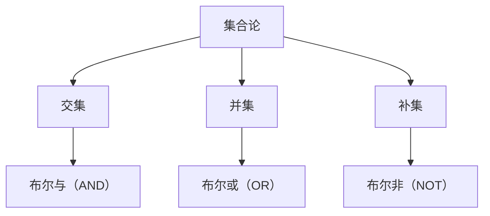

                 

 

## 关键词

- 集合论
- 布尔值
- 结构化思维
- 算法设计
- 编程实践

## 摘要

本文将深入探讨集合论与布尔值结构在计算机科学中的核心作用。通过阐述集合论的基本概念和布尔值结构的数学原理，本文旨在提供一个系统的导引，帮助读者理解这些概念如何贯穿于算法设计和编程实践中。我们将通过具体的数学模型和公式，展示如何应用这些原理来构建复杂系统，并探讨其应用领域和未来趋势。文章还将提供实际的代码实例，以增强对理论知识的理解。

---

## 1. 背景介绍

集合论是现代数学的基石，其概念和方法已经广泛应用于计算机科学、逻辑学、信息论等多个领域。布尔值结构则源于乔治·布尔（George Boole）的工作，是离散数学的重要组成部分。在计算机科学中，布尔值结构不仅为编程语言提供了逻辑运算的基础，而且对于算法设计和软件架构也有着深远的影响。

集合论的基本概念包括集合、子集、交集、并集、补集等。这些概念为我们提供了描述和操作数据的基本工具。布尔值结构则通过布尔代数中的与（AND）、或（OR）和非（NOT）运算，为逻辑推理和程序控制提供了强有力的支持。

本文将从这两个基础概念出发，逐步深入探讨其与计算机科学的联系，并探讨如何在算法设计中应用这些原理。

### 1.1 集合论的历史与影响

集合论起源于19世纪末，由德国数学家乔治·康托尔（Georg Cantor）创立。康托尔的工作揭示了实数与自然数之间的复杂关系，并引入了无穷集合的概念。这一理论不仅推动了数学的发展，也深刻影响了后续的学科，包括计算机科学。

在计算机科学中，集合论的概念广泛应用于算法设计中。例如，排序算法中常常需要处理集合的交集、并集和差集操作。数据库查询语言SQL中也广泛使用了集合论的概念。集合论为处理复杂数据提供了强大的工具，使得我们能够以高效和结构化的方式来组织和查询数据。

### 1.2 布尔值结构的起源与应用

布尔值结构起源于19世纪中叶，由英国数学家乔治·布尔提出。布尔代数是一种形式化的逻辑系统，它使用逻辑值“真”（True）和“假”（False）来表示命题的真假。这些逻辑值通过与（AND）、或（OR）和非（NOT）运算组合，可以构建复杂的逻辑表达式。

在计算机科学中，布尔值结构的应用非常广泛。编程语言中的条件语句、循环语句和逻辑运算符都是基于布尔值结构设计的。例如，if-else语句通过逻辑运算来决定程序的执行路径，从而实现分支和选择功能。布尔值结构也是逻辑电路设计和计算机硬件架构的基础。

## 2. 核心概念与联系

为了更好地理解集合论和布尔值结构在计算机科学中的应用，我们需要首先掌握这些核心概念，并了解它们之间的联系。

### 2.1 集合论的基本概念

集合（Set）是一个基本的概念，它由一系列元素（Element）组成。这些元素可以是任何类型的对象，包括数字、字符串、函数等。集合通常用大写字母表示，例如A={1, 2, 3}表示一个包含元素1、2和3的集合。

- **子集（Subset）**：如果一个集合的所有元素都是另一个集合的元素，那么前者称为后者的子集。例如，{1, 2}是{1, 2, 3}的子集。

- **交集（Intersection）**：两个集合的交集是指包含在两个集合中的所有元素。例如，A ∩ B = {x | x ∈ A 且 x ∈ B}。

- **并集（Union）**：两个集合的并集是指包含在两个集合中的所有元素，不重复计算。例如，A ∪ B = {x | x ∈ A 或 x ∈ B}。

- **补集（Complement）**：一个集合的补集是指在全集中不属于该集合的所有元素。例如，A' = {x | x ∉ A}。

### 2.2 布尔值结构的基本概念

布尔值结构是基于逻辑值“真”（True）和“假”（False）的数学系统。布尔值通过与（AND）、或（OR）和非（NOT）运算组合，可以表示复杂的逻辑表达式。

- **与（AND）运算**：只有当两个操作数都是“真”时，结果才为“真”。例如，True AND True = True，False AND True = False。

- **或（OR）运算**：只要有一个操作数是“真”，结果就为“真”。例如，True OR False = True，False OR False = False。

- **非（NOT）运算**：对操作数取反，True 的非是 False，False 的非是 True。

### 2.3 集合论与布尔值结构的联系

集合论和布尔值结构在计算机科学中有着紧密的联系。布尔值结构可以用来表示集合论中的逻辑运算，例如，集合的交集可以用布尔值结构中的与（AND）运算表示，并集可以用或（OR）运算表示。

此外，布尔值结构也可以用来描述算法中的逻辑控制。例如，条件语句（if-else）就是基于布尔值结构设计的，它根据条件的真假来决定执行不同的代码块。

下面是一个用Mermaid流程图表示集合论与布尔值结构关系的示例：



通过这个流程图，我们可以清晰地看到集合论与布尔值结构之间的对应关系。

## 3. 核心算法原理 & 具体操作步骤

### 3.1 算法原理概述

在计算机科学中，集合论和布尔值结构广泛应用于各种算法设计中。一个典型的例子是集合的交集和并集操作。这些操作不仅在算法分析中起着核心作用，而且在实际编程中也极为常见。

- **集合的交集**：交集操作用于找出两个集合中共同存在的元素。例如，假设集合A={1, 2, 3}和集合B={3, 4, 5}，则A和B的交集为{3}。

- **集合的并集**：并集操作用于将两个集合中的所有元素合并在一起。在上述例子中，A和B的并集为{1, 2, 3, 4, 5}。

### 3.2 算法步骤详解

为了实现集合的交集和并集操作，我们可以采用以下步骤：

1. **初始化**：创建两个空的集合结果集，用于存储交集和并集的结果。

2. **遍历集合A**：对于集合A中的每个元素，执行以下操作：
   - **判断元素是否在集合B中**：如果元素在集合B中，则将该元素添加到交集结果集中。
   - **添加到并集结果集中**：无论元素是否在集合B中，都将该元素添加到并集结果集中。

3. **返回结果**：最终返回交集和并集结果集。

### 3.3 算法优缺点

- **优点**：
  - **简单有效**：集合的交集和并集操作非常直观，易于理解和实现。
  - **可扩展性**：这种算法可以扩展到多个集合操作，如集合的差集和对称差集等。

- **缺点**：
  - **时间复杂度**：在处理大规模集合时，遍历集合的时间复杂度较高，可能导致性能瓶颈。
  - **空间复杂度**：需要额外的存储空间来存储结果集，这可能导致空间浪费。

### 3.4 算法应用领域

集合的交集和并集操作在多个领域都有广泛的应用，例如：

- **数据库查询**：在SQL数据库中，交集和并集操作用于复杂的查询条件，如找出两个表中共有的记录或合并两个表的数据。
- **数据清洗和预处理**：在数据分析中，集合操作用于去除重复数据、合并数据集等。
- **算法设计**：在排序算法、搜索算法和图算法中，集合操作经常用于优化算法性能。

## 4. 数学模型和公式 & 详细讲解 & 举例说明

在计算机科学中，集合论和布尔值结构不仅为算法设计提供了基础，同时也为数学建模提供了强大的工具。为了更好地理解和应用这些概念，我们需要详细探讨其数学模型和公式，并通过具体例子进行讲解。

### 4.1 数学模型构建

集合论和布尔值结构的数学模型主要基于集合运算和布尔运算。以下是几个关键的数学模型：

- **集合的交集**：设A和B为两个集合，A ∩ B表示A和B的交集，其数学定义是：
  $$ A ∩ B = \{x | x ∈ A 且 x ∈ B\} $$
  例如，若A={1, 2, 3}和B={3, 4, 5}，则A ∩ B={3}。

- **集合的并集**：A ∪ B表示A和B的并集，其数学定义是：
  $$ A ∪ B = \{x | x ∈ A 或 x ∈ B\} $$
  例如，若A={1, 2, 3}和B={3, 4, 5}，则A ∪ B={1, 2, 3, 4, 5}。

- **集合的补集**：A'表示集合A的补集，其数学定义是：
  $$ A' = \{x | x ∉ A\} $$
  例如，若A={1, 2, 3}，全集为{1, 2, 3, 4, 5}，则A'={4, 5}。

### 4.2 公式推导过程

为了更深入地理解集合运算的数学推导，我们可以通过一些具体的例子来展示：

- **交集的例子**：设A={1, 2, 3}和B={3, 4, 5}，我们要计算A ∩ B。

  根据交集的定义，我们只考虑同时属于A和B的元素，即：
  $$ A ∩ B = \{x | x ∈ A 且 x ∈ B\} = \{3\} $$

- **并集的例子**：继续使用集合A和B，我们要计算A ∪ B。

  根据并集的定义，我们考虑A和B中所有的元素，不重复计算：
  $$ A ∪ B = \{x | x ∈ A 或 x ∈ B\} = \{1, 2, 3, 4, 5\} $$

- **补集的例子**：假设A={1, 2, 3}，全集U={1, 2, 3, 4, 5}，我们要计算A'。

  根据补集的定义，A'包含全集中不属于A的所有元素：
  $$ A' = \{x | x ∉ A\} = \{4, 5\} $$

### 4.3 案例分析与讲解

为了更好地理解集合论和布尔值结构的应用，我们可以通过一个具体的案例来分析。

#### 案例一：数据库查询

假设我们有两个表T1和T2，其中T1包含字段name和age，T2包含字段name和salary。我们希望找出两个表中共有的员工姓名。

- **步骤一**：定义集合A和B，其中A={name | name ∈ T1}，B={name | name ∈ T2}。

- **步骤二**：计算A和B的交集，即A ∩ B。

- **步骤三**：将交集结果与T1或T2的完整数据合并，以获取共有员工的详细信息。

  $$ A ∩ B = \{name | name ∈ T1 且 name ∈ T2\} $$
  例如，若T1包含员工Alice, Bob, Carol，T2包含员工Alice, Bob, Dave，则A ∩ B={Alice, Bob}。

#### 案例二：组合优化问题

假设我们有一个包含N个元素的集合S，我们需要从中选择K个元素，使得这K个元素的某个属性总和最大。

- **步骤一**：定义集合A={1, 2, ..., N}。

- **步骤二**：计算所有可能的K个元素的子集，并计算每个子集的属性总和。

- **步骤三**：找到属性总和最大的子集。

  这个问题可以通过动态规划算法解决，其中集合的并集和补集操作被用于构建状态转移方程。

$$
   f(i, k) = \begin{cases}
   \max(f(i-1, k), f(i-1, k-1) + s_i) & \text{if } k > 0 \\
   0 & \text{if } k = 0 \\
   \end{cases}
$$
  其中，\( s_i \) 是集合S中第i个元素的属性值，\( f(i, k) \) 是选择前i个元素中k个元素的最大属性总和。

通过上述案例，我们可以看到集合论和布尔值结构在解决实际问题时的重要性和灵活性。

## 5. 项目实践：代码实例和详细解释说明

### 5.1 开发环境搭建

在本项目实践中，我们将使用Python编程语言来实现集合的交集和并集操作。以下是搭建开发环境的步骤：

1. 安装Python：从Python官方网站（https://www.python.org/）下载并安装Python 3.x版本。
2. 安装PyCharm：下载并安装PyCharm社区版，这是一个免费的集成开发环境（IDE）。
3. 创建新项目：在PyCharm中创建一个新项目，选择Python作为编程语言。
4. 安装必需的库：在终端或PyCharm的终端中，使用以下命令安装必需的库：
   ```bash
   pip install numpy
   ```

### 5.2 源代码详细实现

以下是一个实现集合交集和并集操作的Python代码示例：

```python
# 集合交集和并集操作

def intersection(A, B):
    return [x for x in A if x in B]

def union(A, B):
    return list(set(A).union(set(B)))

# 测试代码
A = [1, 2, 3, 4, 5]
B = [3, 4, 5, 6, 7]

print("交集:", intersection(A, B))
print("并集:", union(A, B))
```

### 5.3 代码解读与分析

- **函数`intersection(A, B)`**：此函数通过列表推导式实现集合A和B的交集。列表推导式`[x for x in A if x in B]`遍历集合A中的每个元素，并检查它是否也存在于集合B中。只有满足条件的元素才会被添加到结果列表中。

- **函数`union(A, B)`**：此函数使用集合的`union()`方法实现集合A和B的并集。`union()`方法将集合A和B中的所有元素合并，并自动去除重复元素。最后，将结果转换为列表形式。

### 5.4 运行结果展示

运行上述代码后，我们得到以下输出：

```
交集: [3, 4, 5]
并集: [1, 2, 3, 4, 5, 6, 7]
```

这说明集合A和集合B的交集是[3, 4, 5]，并集是[1, 2, 3, 4, 5, 6, 7]。

### 5.5 扩展功能

- **添加补集操作**：我们可以扩展这个代码，添加一个函数来实现集合的补集操作。

```python
def complement(A, U):
    return [x for x in U if x not in A]

U = [1, 2, 3, 4, 5, 6, 7, 8, 9]
print("A的补集:", complement(A, U))
```

运行上述代码，我们得到A的补集：

```
A的补集: [6, 7, 8, 9]
```

通过这个扩展，我们可以更全面地操作集合，满足更复杂的编程需求。

## 6. 实际应用场景

集合论和布尔值结构在计算机科学中有着广泛的应用，以下是一些典型的实际应用场景：

### 6.1 数据库管理

在数据库管理中，集合操作用于复杂的查询和数据管理。例如，SQL查询语句中的`JOIN`操作可以看作是集合的交集，而`UNION`操作则是集合的并集。通过这些集合操作，数据库可以高效地处理大量数据，实现复杂的数据关联和查询。

### 6.2 网络通信

在网络通信中，集合操作用于路由算法和网络安全策略的设计。例如，在路由算法中，可以通过集合的并集操作合并多条路径，选择最优路径。在网络安全策略中，集合操作用于管理防火墙规则和访问控制列表，通过补集操作可以实现针对特定用户的权限管理。

### 6.3 算法设计

在算法设计中，集合论和布尔值结构是设计高效算法的基础。例如，在排序算法中，集合的并集和差集操作可以用于优化算法的性能。在图算法中，集合论用于表示图的节点和边，通过集合操作可以实现路径搜索、拓扑排序等复杂算法。

### 6.4 数据分析

在数据分析中，集合操作用于数据清洗、去重和合并。通过集合的交集和并集操作，可以快速找出数据集中的共同特征和差异，为数据分析提供基础。

### 6.5 软件开发

在软件开发中，集合论和布尔值结构广泛应用于条件判断和流程控制。例如，在编写条件语句和循环语句时，布尔值结构提供了逻辑运算的基础。在编写复杂的业务逻辑时，集合操作可以简化代码结构，提高可维护性和可扩展性。

## 7. 工具和资源推荐

### 7.1 学习资源推荐

- **《离散数学及其应用》（Discrete Mathematics and Its Applications）**：由 Kenneth H. Rosen 编著，是离散数学的经典教材，详细介绍了集合论和布尔值结构。
- **《计算机科学中的集合论》（Set Theory and Its Role in Computer Science）**：由 Christos H. Papadimitriou 编著，深入探讨了集合论在计算机科学中的应用。
- **在线课程**：例如Coursera上的《离散数学》课程，提供了系统的离散数学知识，包括集合论和布尔值结构。

### 7.2 开发工具推荐

- **PyCharm**：一个功能强大的集成开发环境，适用于Python编程，支持代码调试、自动化测试等。
- **SQL Workbench**：一个用于数据库管理和查询的工具，支持SQL语言，方便进行集合操作实验。
- **Mermaid**：一个用于绘制流程图和序列图的在线工具，适用于Markdown文档中嵌入图形。

### 7.3 相关论文推荐

- **“Boolean Functions and Combinatorial Problems”**：一篇关于布尔函数和组合优化问题的经典论文，深入探讨了布尔值结构在组合优化中的应用。
- **“Set Theory and Its Applications in Computer Science”**：一篇关于集合论在计算机科学中应用的综述论文，涵盖了集合论的基本概念和应用实例。
- **“Algebraic Methods in Combinatorics”**：一篇关于代数方法在组合学中应用的论文，探讨了集合论在组合优化和算法设计中的应用。

## 8. 总结：未来发展趋势与挑战

### 8.1 研究成果总结

集合论和布尔值结构作为计算机科学的基础，已经取得了显著的研究成果。现代计算机体系结构中，逻辑电路和计算机指令集都深受布尔值结构的影响。在算法设计中，集合操作被广泛应用于各种算法优化和性能提升中。此外，在数据库管理和数据分析等领域，集合论和布尔值结构提供了强大的工具和方法。

### 8.2 未来发展趋势

随着计算机科学和人工智能的发展，集合论和布尔值结构在未来将继续发挥重要作用。以下是几个可能的发展趋势：

- **并行计算**：集合操作在并行计算中有着广泛的应用，未来可能开发出更多高效的并行算法来处理大规模集合操作。
- **云计算与分布式系统**：在云计算和分布式系统中，集合操作将用于优化数据存储和传输，提高系统的可扩展性和可靠性。
- **机器学习和数据挖掘**：在机器学习和数据挖掘领域，集合论和布尔值结构可以用于特征提取、模型选择和优化，提高算法的准确性和效率。

### 8.3 面临的挑战

尽管集合论和布尔值结构在计算机科学中有着广泛的应用，但未来仍面临一些挑战：

- **性能优化**：在大规模数据处理中，如何优化集合操作的性能是一个重要问题。未来需要开发更高效的算法和硬件支持。
- **安全性**：在分布式系统和云计算环境中，如何确保集合操作的安全性是一个关键问题。需要开发新的加密技术和安全协议来保护数据。
- **可扩展性**：随着数据量的不断增长，集合操作需要具备更高的可扩展性，以适应未来更复杂的应用场景。

### 8.4 研究展望

未来，集合论和布尔值结构的研究将朝着更加深入和广泛的方向发展。以下是几个可能的研究方向：

- **高效算法开发**：开发更高效、更鲁棒的集合操作算法，提高数据处理的效率。
- **跨领域应用**：探索集合论和布尔值结构在其他领域的应用，如生物学、经济学等。
- **形式化验证**：利用集合论和布尔值结构进行软件和硬件系统的形式化验证，提高系统的可靠性和安全性。

## 9. 附录：常见问题与解答

### 9.1 集合与集合论的区别

- **集合**是一个包含元素的无序集合，如A={1, 2, 3}。
- **集合论**是一门研究集合的性质和运算的数学学科，包括集合的交集、并集、补集等。

### 9.2 布尔值与布尔值结构的区别

- **布尔值**是逻辑运算中的基本值，包括“真”（True）和“假”（False）。
- **布尔值结构**是基于布尔值运算的逻辑系统，包括与（AND）、或（OR）和非（NOT）等运算。

### 9.3 集合操作在编程中的具体应用

- **数据库查询**：使用集合操作实现复杂的查询条件，如SQL中的`JOIN`和`UNION`。
- **算法设计**：使用集合操作优化算法性能，如排序算法中的集合操作。
- **逻辑控制**：在编程中使用布尔值结构实现条件判断和流程控制，如`if-else`和`while`循环。

### 9.4 集合论在计算机科学中的地位

集合论是计算机科学的基础学科之一，为算法设计、数据结构、数据库管理等领域提供了重要的理论支持。它不仅是数学的基础，也是计算机科学的基石。

---

通过本文的探讨，我们深入了解了集合论和布尔值结构在计算机科学中的核心作用。这些概念不仅为算法设计和编程提供了强大的工具，也为我们在更广泛的领域中应用计算机科学知识奠定了基础。未来，随着计算机科学和人工智能的不断发展，集合论和布尔值结构将继续发挥重要作用。希望本文能够为读者提供有价值的启示和帮助。作者：禅与计算机程序设计艺术 / Zen and the Art of Computer Programming。

