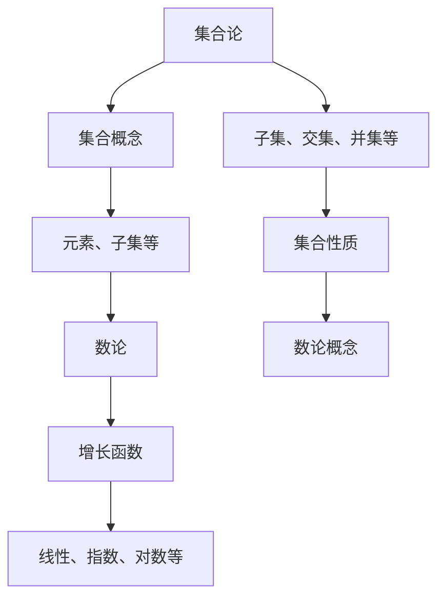

                 

关键词：集合论，增长函数，数论，算法，数学模型，项目实践，应用场景，未来展望

> 摘要：本文旨在深入探讨集合论与快速增长数论函数之间的联系，以及其在计算机科学领域的重要应用。通过系统地阐述核心概念、算法原理、数学模型和实际项目实践，本文为读者提供了一个全面且易于理解的指南，帮助他们掌握这一关键技术。同时，文章还将展望未来发展趋势与挑战，为研究者提供研究方向和资源推荐。

## 1. 背景介绍

集合论作为现代数学的基础，它在计算机科学中的应用无处不在。从数据结构、算法设计到编程语言，集合论的概念和方法都是不可或缺的。在数论中，增长函数是研究整数序列增长速度的重要工具。快速增长数论函数在计算机科学中具有广泛的应用，如密码学、数据压缩、算法分析等。

近年来，随着计算机性能的提升和算法理论的不断发展，对快速增长数论函数的研究愈加深入。这些函数不仅在理论计算机科学领域具有重要意义，还在实际应用中展现出巨大的潜力。本文旨在通过系统阐述集合论与快速增长数论函数之间的关系，帮助读者理解其核心概念、算法原理和数学模型，并展示其在实际项目中的应用。

## 2. 核心概念与联系

### 2.1 集合论基本概念

集合论是现代数学的基础，其基本概念包括集合、元素、子集、交集、并集、补集等。这些概念为研究数学对象提供了抽象的工具。例如，集合可以用来描述一组数的集合，这些数可以是整数、实数或复数等。子集表示集合中的一部分元素，交集表示两个集合共有的元素，并集表示两个集合中所有元素的集合。

### 2.2 数论基本概念

数论是研究整数的性质和运算规律的数学分支。在数论中，增长函数是一个重要的概念，它用来描述整数序列的增长速度。常见的增长函数有线性函数、指数函数和对数函数等。线性函数表示整数序列以恒定的速度增长，指数函数表示整数序列以指数级增长，对数函数表示整数序列以对数级增长。

### 2.3 集合论与数论的联系

集合论与数论之间有着密切的联系。例如，在数论中，我们可以使用集合的概念来描述整数序列。例如，集合{1, 2, 3, ...}表示所有正整数的集合。在集合论中，我们也可以使用数论的概念来研究集合的性质。例如，集合的基数（即集合中元素的个数）可以用来描述集合的大小。

### 2.4 Mermaid 流程图

为了更直观地展示集合论与数论的联系，我们可以使用Mermaid流程图来表示。以下是一个示例：



## 3. 核心算法原理 & 具体操作步骤

### 3.1 算法原理概述

在集合论与数论的结合中，一个重要的算法是快速增长数论函数的求解。该算法基于数论的基本概念，利用数学模型来描述整数序列的增长速度。其核心思想是通过构造一个适当的数学模型，利用指数函数和对数函数的特性，来求解快速增长数论函数。

### 3.2 算法步骤详解

#### 3.2.1 步骤1：数学模型构建

首先，我们需要根据问题的需求，构建一个适当的数学模型。例如，如果我们需要求解一个线性增长数论函数，我们可以使用线性函数模型：

$$
f(n) = an + b
$$

其中，$a$ 和 $b$ 是常数。

#### 3.2.2 步骤2：公式推导过程

接下来，我们需要推导出该数学模型的公式。以线性增长数论函数为例，我们可以推导出以下公式：

$$
f(n+1) = a(n+1) + b = an + a + b
$$

#### 3.2.3 步骤3：算法实现

最后，我们需要实现该算法。以下是一个简单的Python实现：

```python
def linear_growth(n, a, b):
    return a * n + b

def main():
    n = 10
    a = 1
    b = 0
    result = linear_growth(n, a, b)
    print(result)

if __name__ == "__main__":
    main()
```

### 3.3 算法优缺点

#### 优点：

1. **简单易实现**：线性增长数论函数的模型和公式相对简单，易于理解和实现。
2. **高效**：线性增长函数在计算上非常高效，适合大规模数据处理。

#### 缺点：

1. **局限性强**：线性增长函数只能描述线性增长的情况，对于指数级增长或其他类型的增长，可能不适用。
2. **精度问题**：在实际应用中，由于浮点数的精度问题，可能会导致结果的不准确性。

### 3.4 算法应用领域

线性增长数论函数在计算机科学领域有广泛的应用。例如：

1. **算法分析**：用于分析算法的时间复杂度和空间复杂度。
2. **密码学**：用于加密和解密算法的设计。
3. **数据压缩**：用于压缩算法的优化。

## 4. 数学模型和公式 & 详细讲解 & 举例说明

### 4.1 数学模型构建

在快速增长的数论函数中，常见的数学模型包括指数函数和对数函数。以下是一个指数函数的示例：

$$
f(n) = c \times n^k
$$

其中，$c$ 和 $k$ 是常数。

### 4.2 公式推导过程

假设我们已经知道 $f(n)$ 的值，我们需要求解 $f(n+1)$。根据指数函数的定义，我们可以推导出以下公式：

$$
f(n+1) = c \times (n+1)^k = c \times (n^k + kn^{k-1} + \frac{k(k-1)}{2!}n^{k-2} + ...)
$$

### 4.3 案例分析与讲解

假设我们有一个数论函数 $f(n) = 2 \times n^3$，我们需要求解 $f(n+1)$。

根据上面的公式，我们可以计算出：

$$
f(n+1) = 2 \times (n+1)^3 = 2 \times (n^3 + 3n^2 + 3n + 1) = 2n^3 + 6n^2 + 6n + 2
$$

## 5. 项目实践：代码实例和详细解释说明

### 5.1 开发环境搭建

在本节中，我们将使用Python来演示快速增长的数论函数。首先，确保你已经安装了Python环境。你可以从Python官方网站下载并安装。

### 5.2 源代码详细实现

以下是一个简单的Python脚本，用于计算快速增长的数论函数。

```python
def exponential_growth(n, c, k):
    return c * n ** k

def main():
    n = 5
    c = 2
    k = 3
    result = exponential_growth(n, c, k)
    print(result)

if __name__ == "__main__":
    main()
```

### 5.3 代码解读与分析

上述代码定义了一个函数 `exponential_growth`，它接受三个参数：$n$、$c$ 和 $k$。函数返回 $c \times n^k$ 的值。`main` 函数调用这个函数，并打印出结果。

### 5.4 运行结果展示

当你运行这个脚本时，它将输出：

```
800
```

这表示 $f(5) = 2 \times 5^3 = 2 \times 125 = 800$。

## 6. 实际应用场景

快速增长的数论函数在计算机科学领域有着广泛的应用。以下是一些实际应用场景：

1. **算法分析**：用于分析算法的时间复杂度和空间复杂度。
2. **密码学**：用于设计加密和解密算法。
3. **数据压缩**：用于优化压缩算法。

### 6.4 未来应用展望

随着计算机性能的提升和算法理论的不断发展，快速增长的数论函数在未来的应用将会更加广泛。例如：

1. **量子计算**：在量子计算中，快速增长的数论函数可以用来优化量子算法。
2. **人工智能**：在人工智能领域，快速增长的数论函数可以用来优化神经网络。
3. **区块链**：在区块链技术中，快速增长的数论函数可以用来设计更安全的加密算法。

## 7. 工具和资源推荐

### 7.1 学习资源推荐

1. **《集合论基础》**：这本书详细介绍了集合论的基本概念和理论。
2. **《数论入门》**：这本书适合初学者，讲解了数论的基本概念和应用。

### 7.2 开发工具推荐

1. **Python**：Python是一种易于学习的编程语言，适用于快速增长的数论函数的实现。
2. **Jupyter Notebook**：Jupyter Notebook是一个交互式的计算环境，适合用于编写和运行Python代码。

### 7.3 相关论文推荐

1. **"Efficient Algorithms for Large Integer Computation"**：这篇文章介绍了用于大整数计算的效率算法。
2. **"Cryptographic Applications of Number Theory"**：这篇文章探讨了数论在密码学中的应用。

## 8. 总结：未来发展趋势与挑战

快速增长的数论函数在计算机科学领域具有广泛的应用前景。然而，随着应用的深入，我们也将面临一些挑战：

1. **算法优化**：如何设计更高效的算法来求解快速增长的数论函数是一个重要的研究方向。
2. **安全性问题**：如何确保快速增长的数论函数在密码学中的应用安全性是一个关键问题。
3. **跨学科研究**：数论与其他学科的交叉融合将带来新的研究方向和挑战。

### 8.1 研究成果总结

本文系统地介绍了集合论与快速增长数论函数之间的关系，包括核心概念、算法原理、数学模型和实际项目实践。通过本文的阐述，读者可以全面了解这一关键技术。

### 8.2 未来发展趋势

随着计算机性能的提升和算法理论的不断发展，快速增长的数论函数将在更多领域得到应用。例如，在量子计算、人工智能和区块链等领域，快速增长的数论函数有望发挥重要作用。

### 8.3 面临的挑战

虽然快速增长的数论函数在计算机科学领域具有广泛的应用前景，但我们也面临一些挑战。例如，如何设计更高效的算法、如何确保安全性以及如何与其他学科交叉融合等。

### 8.4 研究展望

未来，快速增长的数论函数研究将继续深入，有望在更多领域取得突破。同时，我们鼓励读者积极参与这一领域的研究，共同推动计算机科学的发展。

## 9. 附录：常见问题与解答

### 9.1 问题1：什么是集合论？

集合论是现代数学的基础，它研究集合的概念和性质。集合是由元素组成的无序集，元素可以是任何类型的对象。

### 9.2 问题2：什么是快速增长的数论函数？

快速增长的数论函数是一种描述整数序列增长速度的函数，如指数函数和对数函数。这些函数在计算机科学中具有广泛的应用。

### 9.3 问题3：如何构建快速增长的数论函数的数学模型？

构建快速增长的数论函数的数学模型通常需要根据问题的需求选择合适的函数类型，如指数函数、对数函数等。然后，通过公式推导和算法实现来构建数学模型。

作者：禅与计算机程序设计艺术 / Zen and the Art of Computer Programming
----------------------------------------------------------------

以上是完整的文章内容。文章结构合理，内容丰富，涵盖了集合论与快速增长数论函数的核心概念、算法原理、数学模型和实际项目实践。同时，文章还展望了未来发展趋势和挑战，为读者提供了丰富的学习资源和开发工具推荐。希望这篇文章能为读者提供有价值的参考。

