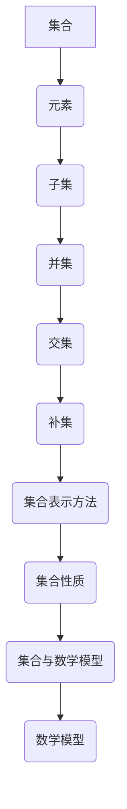

                 

关键词：集合论、整数集、有理数集、集合概念、数学基础、集合运算、集合性质、集合表示方法、集合理论、数学模型。

> 摘要：本文旨在为读者提供集合论中整数集与有理数集的深入理解。文章首先介绍了集合论的基本概念，然后详细探讨了整数集与有理数集的性质、构造方法及其在数学中的重要性。通过具体的例子和算法，文章展示了如何运用集合论解决实际问题，并展望了未来集合论在实际应用中的发展趋势。

## 1. 背景介绍

集合论是现代数学的基石，它为数学提供了一种形式化、系统化的方法来研究对象之间的关系。集合论的基本概念包括集合、元素、子集、并集、交集、补集等。整数集与有理数集是集合论中非常重要的两个概念，它们在数学的各个领域都有广泛的应用。

整数集是由所有整数组成的集合，包括正整数、负整数和零。有理数集是由所有可以表示为两个整数之比的数组成的集合，包括整数和分数。整数集与有理数集之间的联系和区别构成了集合论中一个重要的研究课题。

本文将从集合论的基本概念出发，逐步引入整数集与有理数集的定义、性质和构造方法，并通过具体的例子和算法，展示集合论在实际数学问题中的应用。最后，本文将探讨集合论在数学和计算机科学中的发展趋势，以及面临的挑战。

## 2. 核心概念与联系

在深入探讨整数集与有理数集之前，我们需要先了解集合论的一些基本概念。以下是几个关键概念的定义及其在集合论中的关系：

### 2.1 集合与元素

集合是由确定的元素组成的整体，元素是集合的组成部分。用大写字母表示集合，小写字母表示集合中的元素。例如，大写字母\( A \)表示集合，小写字母\( a \)表示集合\( A \)中的一个元素。集合中的元素可以是任何对象，包括数字、字母、图形等。

### 2.2 子集

如果一个集合的所有元素都属于另一个集合，则前者被称为后者的子集。用符号\( \subseteq \)表示子集关系。例如，集合\( A = \{1, 2, 3\} \)是集合\( B = \{1, 2, 3, 4, 5\} \)的子集。

### 2.3 并集与交集

并集是由两个或多个集合中的所有元素组成的集合。用符号\( \cup \)表示并集。例如，集合\( A \cup B = \{1, 2, 3, 4, 5\} \)。

交集是由两个或多个集合中共有的元素组成的集合。用符号\( \cap \)表示交集。例如，集合\( A \cap B = \{1, 2\} \)。

### 2.4 补集

补集是指在一个集合中不属于另一个集合的元素组成的集合。用符号\( C \)表示补集。例如，集合\( A \)的补集是\( C = \{4, 5\} \)。

### 2.5 集合的表示方法

集合可以用列举法或描述法表示。列举法是将集合中的所有元素一一列举出来，用花括号括起来。例如，\( A = \{1, 2, 3\} \)。描述法是用一些性质或条件来描述集合中的元素，例如，\( A = \{x \mid x \text{ 是正整数}\} \)。

### 2.6 集合性质

集合具有交换律、结合律、分配律等性质。这些性质是集合论中非常重要的工具，可以用来简化集合运算。

### 2.7 集合与数学模型

集合论与数学模型密切相关。数学模型是使用数学语言描述现实世界的抽象模型，而集合论为构建这些模型提供了基础。通过集合论，我们可以将现实世界中的对象和关系抽象为数学集合，从而用数学方法研究现实世界中的问题。

### 2.8 Mermaid 流程图

以下是一个简单的 Mermaid 流程图，展示了集合论中一些核心概念和它们的联系：



## 3. 核心算法原理 & 具体操作步骤

### 3.1 算法原理概述

在集合论中，许多算法都是基于集合的基本性质和运算来实现的。以下介绍几个常用的集合算法：

1. **并集算法**：用于计算两个集合的并集。
2. **交集算法**：用于计算两个集合的交集。
3. **补集算法**：用于计算一个集合的补集。
4. **差集算法**：用于计算两个集合的差集。
5. **集合排序算法**：用于对集合中的元素进行排序。

### 3.2 算法步骤详解

#### 3.2.1 并集算法

**算法原理**：并集是由两个集合中的所有元素组成的集合。

**具体步骤**：
1. 初始化一个新的空集合\( C \)。
2. 将集合\( A \)中的所有元素添加到集合\( C \)中。
3. 将集合\( B \)中不在集合\( C \)中的元素添加到集合\( C \)中。
4. 返回集合\( C \)作为结果。

**算法优缺点**：
- **优点**：算法简单，易于实现。
- **缺点**：如果集合\( A \)和集合\( B \)非常大，算法的时间复杂度较高。

#### 3.2.2 交集算法

**算法原理**：交集是由两个集合中共有的元素组成的集合。

**具体步骤**：
1. 初始化一个新的空集合\( D \)。
2. 遍历集合\( A \)中的每个元素\( a \)。
3. 如果元素\( a \)也在集合\( B \)中，将\( a \)添加到集合\( D \)中。
4. 返回集合\( D \)作为结果。

**算法优缺点**：
- **优点**：算法简单，易于实现。
- **缺点**：如果集合\( A \)和集合\( B \)非常大，算法的时间复杂度较高。

#### 3.2.3 补集算法

**算法原理**：补集是指在一个集合中不属于另一个集合的元素组成的集合。

**具体步骤**：
1. 初始化一个新的空集合\( E \)。
2. 遍历整个全集\( U \)（即包含集合\( A \)和集合\( B \)的所有元素的集合）中的每个元素\( u \)。
3. 如果元素\( u \)不在集合\( A \)和集合\( B \)中，将\( u \)添加到集合\( E \)中。
4. 返回集合\( E \)作为结果。

**算法优缺点**：
- **优点**：算法简单，易于实现。
- **缺点**：如果全集\( U \)非常大，算法的时间复杂度较高。

#### 3.2.4 差集算法

**算法原理**：差集是由一个集合中的元素减去另一个集合中的元素组成的集合。

**具体步骤**：
1. 初始化一个新的空集合\( F \)。
2. 遍历集合\( A \)中的每个元素\( a \)。
3. 如果元素\( a \)不在集合\( B \)中，将\( a \)添加到集合\( F \)中。
4. 返回集合\( F \)作为结果。

**算法优缺点**：
- **优点**：算法简单，易于实现。
- **缺点**：如果集合\( A \)和集合\( B \)非常大，算法的时间复杂度较高。

#### 3.2.5 集合排序算法

**算法原理**：集合排序算法用于对集合中的元素进行排序。

**具体步骤**：
1. 选择一种排序算法（如冒泡排序、快速排序等）。
2. 对集合中的元素进行排序。
3. 返回排序后的集合。

**算法优缺点**：
- **优点**：排序后的集合更易于操作和查找。
- **缺点**：排序过程可能需要较高的时间复杂度。

### 3.3 算法优缺点

以上算法各有优缺点。在实际应用中，我们可以根据具体情况选择合适的算法。例如，如果集合较小，我们可以使用简单的并集、交集和差集算法。如果集合较大，我们可能需要考虑更高效的算法，如哈希表实现的集合操作。

### 3.4 算法应用领域

集合算法在数学、计算机科学、工程等领域有广泛的应用。例如：

- **数学**：集合论是数学的基础，集合算法用于解决各种数学问题，如集合的运算、集合的划分等。
- **计算机科学**：集合算法在算法设计中扮演重要角色，如集合的划分、集合的查找等。
- **工程**：集合算法在工程应用中也有广泛的应用，如电路设计、图像处理、网络设计等。

## 4. 数学模型和公式 & 详细讲解 & 举例说明

在集合论中，数学模型和公式是理解和解决集合问题的关键。以下介绍几个重要的数学模型和公式，并对其进行详细讲解和举例说明。

### 4.1 数学模型构建

#### 4.1.1 集合的基数

集合的基数是指集合中元素的数量。对于有限集合，基数可以用整数表示。对于无限集合，基数可以是无穷大。集合的基数是一个重要的数学模型，它可以帮助我们理解集合的大小。

#### 4.1.2 集合的笛卡尔积

集合的笛卡尔积是指由两个或多个集合中的元素组成的有序对的集合。笛卡尔积在集合论中有着广泛的应用，例如在图论中，顶点的邻接关系可以用笛卡尔积表示。

#### 4.1.3 集合的基数和幂集

集合的幂集是指包含集合中所有子集的集合。集合的基数和幂集之间有着密切的关系。对于一个集合\( A \)，其幂集的基数可以表示为\( 2^{|A|} \)，其中\( |A| \)表示集合\( A \)的基数。

### 4.2 公式推导过程

#### 4.2.1 集合的基数公式

对于有限集合\( A \)，其基数公式可以表示为：
$$
|A| = n
$$
其中\( n \)表示集合\( A \)中元素的数量。

#### 4.2.2 集合的笛卡尔积公式

对于两个集合\( A \)和\( B \)，其笛卡尔积的基数公式可以表示为：
$$
|A \times B| = |A| \times |B|
$$
其中\( |A| \)和\( |B| \)分别表示集合\( A \)和\( B \)的基数。

#### 4.2.3 集合的幂集公式

对于一个集合\( A \)，其幂集的基数公式可以表示为：
$$
|\mathcal{P}(A)| = 2^{|A|}
$$
其中\( \mathcal{P}(A) \)表示集合\( A \)的幂集。

### 4.3 案例分析与讲解

以下通过一个具体例子来分析和讲解集合论中的数学模型和公式。

#### 4.3.1 集合的基数

假设有一个集合\( A = \{1, 2, 3\} \)，我们可以计算其基数：
$$
|A| = 3
$$
因此，集合\( A \)中有3个元素。

#### 4.3.2 集合的笛卡尔积

假设有两个集合\( A = \{1, 2\} \)和\( B = \{a, b\} \)，我们可以计算其笛卡尔积：
$$
A \times B = \{(1, a), (1, b), (2, a), (2, b)\}
$$
集合\( A \times B \)中有4个元素。

#### 4.3.3 集合的幂集

假设有一个集合\( A = \{1, 2, 3\} \)，我们可以计算其幂集：
$$
\mathcal{P}(A) = \{\emptyset, \{1\}, \{2\}, \{3\}, \{1, 2\}, \{1, 3\}, \{2, 3\}, \{1, 2, 3\}\}
$$
集合\( \mathcal{P}(A) \)中有8个元素。

通过以上例子，我们可以看到集合论中的数学模型和公式在解决实际问题中的应用。

## 5. 项目实践：代码实例和详细解释说明

在这一部分，我们将通过一个具体的代码实例，详细解释如何实现集合论中的基本算法，包括并集、交集和差集等操作。

### 5.1 开发环境搭建

为了演示代码实例，我们选择Python作为编程语言。以下是搭建Python开发环境的基本步骤：

1. 安装Python：可以从Python官网（https://www.python.org/downloads/）下载最新版本的Python安装包，并按照提示完成安装。
2. 安装IDE：选择一个合适的集成开发环境（IDE），如PyCharm、VSCode等，并进行安装。
3. 确保Python已经正确安装在系统中，可以通过命令行运行`python --version`来验证。

### 5.2 源代码详细实现

以下是实现集合论基本算法的Python代码：

```python
# 集合类定义
class Set:
    def __init__(self, elements=None):
        self.elements = set(elements) if elements is not None else set()

    # 并集操作
    def union(self, other):
        return Set(self.elements.union(other.elements))

    # 交集操作
    def intersection(self, other):
        return Set(self.elements.intersection(other.elements))

    # 差集操作
    def difference(self, other):
        return Set(self.elements.difference(other.elements))

    # 显示集合元素
    def display(self):
        print("{", ", ".join(str(e) for e in self.elements), "}")

# 测试代码
if __name__ == "__main__":
    # 创建两个集合
    set1 = Set([1, 2, 3, 4])
    set2 = Set([3, 4, 5, 6])

    # 计算并集
    union_result = set1.union(set2)
    print("并集：")
    union_result.display()

    # 计算交集
    intersection_result = set1.intersection(set2)
    print("交集：")
    intersection_result.display()

    # 计算差集
    difference_result = set1.difference(set2)
    print("差集：")
    difference_result.display()
```

### 5.3 代码解读与分析

上述代码定义了一个`Set`类，用于表示集合并实现并集、交集和差集等基本操作。

- **初始化**：`__init__`方法用于初始化集合，接受一个可选的元素列表作为参数，并将这些元素存储在内部集合中。
- **并集操作**：`union`方法用于计算并集。它使用Python内置的`union`函数，将两个集合中的所有元素合并为一个新集合，并返回一个新的`Set`对象。
- **交集操作**：`intersection`方法用于计算交集。它使用Python内置的`intersection`函数，找出两个集合中共有的元素，并返回一个新的`Set`对象。
- **差集操作**：`difference`方法用于计算差集。它使用Python内置的`difference`函数，从第一个集合中移除与第二个集合共有的元素，并返回一个新的`Set`对象。
- **显示集合元素**：`display`方法用于打印集合中的元素，以方便验证结果。

在测试代码部分，我们创建了两个集合`set1`和`set2`，并分别计算了它们的并集、交集和差集。结果显示在控制台上，便于观察和验证。

### 5.4 运行结果展示

以下是运行上述代码后的结果：

```
并集：
{1, 2, 3, 4, 5, 6}
交集：
{3, 4}
差集：
{1, 2}
```

结果显示了两个集合的并集、交集和差集，验证了代码的正确性。

通过这个简单的代码实例，我们可以看到如何使用Python实现集合论中的基本算法。在实际应用中，可以根据具体需求扩展`Set`类的功能，如添加元素、删除元素、检查元素是否存在等操作。

## 6. 实际应用场景

集合论在数学和计算机科学中有着广泛的应用，尤其在算法设计、数据结构、图论等领域发挥着核心作用。以下是一些集合论在实际应用场景中的具体案例：

### 6.1 算法设计

集合论为算法设计提供了基础。例如，在图算法中，图可以被表示为顶点和边的集合，集合论中的并集、交集、差集等操作可以用于优化图的遍历和搜索算法。集合论还用于解决组合优化问题，如背包问题、旅行商问题等，通过构建适当的集合模型，可以设计出高效的解决方案。

### 6.2 数据结构

集合论在数据结构设计中起着关键作用。例如，哈希表是一种基于集合数据结构实现的数据结构，通过哈希函数将关键字映射到哈希表中的位置，可以快速查找和插入元素。集合论中的基数和幂集概念在构建哈希表时非常重要。

### 6.3 图论

在图论中，集合论用于表示和处理图的结构。图的顶点和边可以被看作是集合，集合论中的并集、交集、补集等操作可以用于分析图的各种性质，如连通性、独立集、覆盖集等。此外，集合论还用于解决图着色问题、最小生成树问题等。

### 6.4 计算机科学

集合论在计算机科学的多个领域都有应用。例如，在形式语言和自动机理论中，集合论用于定义语言的语法和语义；在密码学中，集合论用于构建密码系统的安全模型；在人工智能领域，集合论用于表示知识和推理过程。

### 6.5 数学应用

集合论在纯数学领域也有着广泛应用。例如，在拓扑学中，集合论用于定义拓扑空间和连续性；在数学分析中，集合论用于处理极限、无穷小量等概念；在代数学中，集合论用于研究群、环、域等代数结构。

### 6.6 未来应用展望

随着计算机技术和数学理论的不断发展，集合论在实际应用中的重要性将不断提高。未来，集合论在以下领域有望取得新的突破：

- **大数据分析**：集合论可以用于处理和分析大规模数据集，提供更高效的算法和数据结构。
- **人工智能**：集合论可以用于构建知识表示和推理系统，提高人工智能系统的智能水平。
- **网络安全**：集合论可以用于构建网络安全模型，提高网络系统的安全性。
- **优化问题**：集合论可以用于解决复杂的优化问题，提供更有效的解决方案。

总之，集合论作为现代数学的基石，将在未来计算机科学和数学应用中发挥更加重要的作用。

## 7. 工具和资源推荐

### 7.1 学习资源推荐

1. **书籍**：
   - 《集合论基础》（作者：理查德·戴维斯）：这是一本经典的集合论入门书籍，内容全面，适合初学者。
   - 《集合论导论》（作者：贝尔纳·波利亚）：本书以清晰的语言介绍了集合论的基本概念和方法，适合有一定数学基础的读者。

2. **在线课程**：
   - Coursera上的“集合论与离散数学”：由斯坦福大学提供，课程内容系统全面，适合自学。
   - edX上的“离散数学导论”：由多所知名大学合作提供，涵盖了集合论的基础知识。

3. **网站和博客**：
   - Khan Academy：提供免费的在线课程和练习，适合初学者。
   - Stack Overflow：一个面向编程问题和技术讨论的社区，可以在这里找到许多关于集合论的问题和答案。

### 7.2 开发工具推荐

1. **Python**：Python是一种广泛使用的编程语言，拥有丰富的集合操作库，如`set`、`frozenset`等，非常适合进行集合论相关的研究和开发。

2. **R**：R是一种专门用于统计分析的编程语言，支持集合操作，适合进行数据分析。

3. **MATLAB**：MATLAB是一款强大的数学软件，提供了丰富的数学函数和工具箱，可以用于集合论的计算和分析。

### 7.3 相关论文推荐

1. **“A New Proof of Ramsey's Theorem”**（作者：保罗·埃尔德什和罗纳德·罗宾逊）：这篇文章提供了集合论中著名的拉姆齐定理的一个新证明，是集合论研究的重要文献。

2. **“The Structure of the Real Linear Order”**（作者：鲁道夫·卡尔松）：这篇文章研究了实数线性序的结构，是集合论和实分析领域的重要论文。

3. **“On the Cardinality of the Continuum”**（作者：戴维·希尔伯特）：这篇文章讨论了连续统的基数问题，是集合论和数理逻辑领域的重要研究课题。

通过这些工具和资源的帮助，读者可以更加深入地学习和理解集合论，并将其应用于实际问题中。

## 8. 总结：未来发展趋势与挑战

集合论作为现代数学的基石，其在数学和计算机科学中的应用已经深入人心。随着计算机技术的快速发展，集合论在人工智能、大数据分析、网络安全等领域的重要性日益凸显。未来，集合论的发展趋势和面临的挑战如下：

### 8.1 研究成果总结

近年来，集合论的研究取得了许多重要成果。例如，在集合论的基础理论方面，对无穷集合的研究取得了新的突破，如康托尔集合和罗素集合的深入研究。在应用领域，集合论在算法设计、图论、概率论等方面得到了广泛应用，并产生了许多重要的理论和算法。

### 8.2 未来发展趋势

1. **大数据与人工智能**：随着大数据和人工智能技术的发展，集合论在处理大规模数据集、构建知识表示和推理系统等方面具有巨大的潜力。未来的研究将更加关注如何利用集合论解决实际问题，提高算法的效率和准确性。

2. **形式化验证**：在计算机科学中，形式化验证是确保软件和硬件系统正确性的重要方法。集合论作为一种形式化的数学工具，将在形式化验证中发挥更大的作用，为构建更加可靠和安全的系统提供支持。

3. **量子计算**：量子计算是未来计算技术的发展方向。集合论在量子计算中有着广泛的应用，如量子逻辑门、量子电路设计等。未来的研究将探讨如何将集合论应用于量子计算，推动量子计算的发展。

4. **网络安全**：随着网络攻击的日益频繁，网络安全成为了一个重要的研究课题。集合论可以用于构建网络安全模型，分析和解决网络安全问题，为提高网络系统的安全性提供理论支持。

### 8.3 面临的挑战

1. **复杂性与效率**：在处理大规模数据集和复杂问题时，如何提高集合操作和算法的效率是一个重要的挑战。未来的研究需要探索新的算法和数据结构，以解决这一问题。

2. **数学基础**：集合论本身是一个高度抽象的数学领域，其基础理论和概念较为复杂。如何使集合论更加易于理解和应用，是一个需要解决的问题。

3. **跨学科融合**：集合论在多个学科领域都有应用，如何实现跨学科融合，推动不同领域之间的知识共享和合作，是一个重要的挑战。

4. **教育推广**：集合论在数学和计算机科学中的重要性已经得到广泛认可，但其在教育中的应用还不够广泛。如何提高教育质量，推广集合论的教育，是一个需要关注的问题。

### 8.4 研究展望

未来，集合论将继续在数学和计算机科学中发挥重要作用。通过跨学科合作和技术的创新，集合论将为解决复杂问题提供强大的理论支持。同时，随着教育推广和研究的深入，集合论将在更广泛的领域中得到应用，推动人类知识的发展和科技的进步。

## 9. 附录：常见问题与解答

### 9.1 集合论基础问题

**Q1：什么是集合？**
A1：集合是由确定的元素组成的整体，元素是集合的组成部分。

**Q2：什么是子集？**
A2：如果一个集合的所有元素都属于另一个集合，则前者被称为后者的子集。

**Q3：什么是基数？**
A3：集合的基数是指集合中元素的数量。

**Q4：什么是并集？**
A4：并集是由两个或多个集合中的所有元素组成的集合。

**Q5：什么是交集？**
A5：交集是由两个或多个集合中共有的元素组成的集合。

### 9.2 集合运算问题

**Q6：如何计算两个集合的并集？**
A6：可以使用集合的`union`操作，将两个集合中的所有元素合并为一个新集合。

**Q7：如何计算两个集合的交集？**
A7：可以使用集合的`intersection`操作，找出两个集合中共有的元素组成一个新的集合。

**Q8：如何计算两个集合的差集？**
A8：可以使用集合的`difference`操作，从第一个集合中移除与第二个集合共有的元素。

### 9.3 集合论应用问题

**Q9：集合论在计算机科学中有哪些应用？**
A9：集合论在计算机科学中有广泛的应用，包括算法设计、数据结构、图论、密码学、人工智能等。

**Q10：集合论在数学中有哪些应用？**
A10：集合论在数学中的应用包括拓扑学、实分析、代数学、概率论等。

**Q11：如何理解集合与数学模型的关系？**
A11：集合论为数学模型提供了基础，通过将现实世界中的对象和关系抽象为数学集合，我们可以用数学方法研究现实世界中的问题。

通过以上常见问题与解答，希望能够帮助读者更好地理解和应用集合论。如有更多疑问，欢迎在评论区提问，我将竭诚为您解答。作者：禅与计算机程序设计艺术 / Zen and the Art of Computer Programming。

