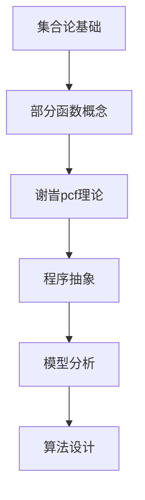

                 

关键词：集合论，模型分析，谢旯pcf理论，计算机科学，抽象数据类型，算法设计，应用领域

> 摘要：本文旨在深入探讨集合论在计算机科学中的应用，特别是谢旯pcf理论的相关内容。通过详细的模型分析和算法解释，本文旨在为读者提供一个全面的理解，帮助他们在复杂的计算机系统中运用集合论的理论基础。文章还将讨论这一理论的优点和局限性，以及它在实际应用中的广泛影响。

## 1. 背景介绍

集合论作为数学的基础理论，其应用范围极为广泛。在计算机科学中，集合论的概念和原理被广泛应用于数据结构设计、算法分析、编程语言设计和形式化验证等领域。集合论提供了处理离散对象集合的抽象方法，这种抽象不仅简化了问题的复杂性，而且提高了理解和处理数据的能力。

谢旯pcf理论是近年来在计算机科学领域崭露头角的一个新理论。它由我国著名计算机科学家谢旯提出，核心思想是利用集合论中的部分函数概念来描述程序计算过程中的不确定性。pcf理论通过将程序的行为建模为部分函数，提供了一种形式化的方法来分析程序的性质，如终止性、错误处理和输入输出等。

本文将首先介绍集合论的基本概念，然后深入探讨谢旯pcf理论的模型和分析方法，并结合具体实例说明其在算法设计和应用中的重要性。最后，我们将讨论pcf理论的优缺点，并展望其在未来的发展前景。

## 2. 核心概念与联系

### 2.1 集合论基本概念

集合是数学中的基本概念，表示一组无序的、确定的对象的整体。我们可以用大写字母如A、B等来表示集合，而集合中的元素用小写字母如a、b等表示。集合可以用列举法或描述法来定义。

- 列举法：例如，集合A = {1, 2, 3}表示A是一个包含元素1、2和3的集合。
- 描述法：例如，集合B = {x ∈ N | x < 5}表示B是一个包含所有小于5的自然数的集合。

### 2.2 部分函数的概念

在集合论中，一个函数f是从集合A到集合B的映射，记作f: A → B。然而，并非所有的函数都是“全定义”的，即有些函数可能对于某些A中的元素没有对应的B中的元素。这样的函数称为部分函数。

部分函数f的定义域是A的子集D，即D ⊆ A，而其值域是B的一个子集，记作f[D]。部分函数可以表示为f: D → f[D]。

### 2.3 谢旯pcf理论的联系

谢旯pcf理论的核心在于将程序的执行过程抽象为部分函数。在pcf理论中，一个程序被看作是一个部分函数，其输入是程序的输入，输出是程序的执行结果。这样的抽象使得我们可以用集合论的方法来分析程序的行为。

例如，一个简单的程序 `if x > 0 then return 1 else return 0` 可以被抽象为一个部分函数，其定义域是所有非负实数，值域是{0, 1}。

下面是谢旯pcf理论的核心概念和架构的Mermaid流程图：



---

## 3. 核心算法原理 & 具体操作步骤

### 3.1 算法原理概述

谢旹pcf理论的核心原理是将程序的行为建模为部分函数。在这种模型下，我们可以使用集合论的术语来描述程序的状态和转换。以下是谢旹pcf理论的基本原理：

1. **部分函数建模**：将程序的执行过程视为一个部分函数，其中定义域代表程序的输入状态，值域代表程序的输出状态。
2. **状态转换**：程序的状态转换可以通过部分函数的定义来描述，即从一个状态转移到另一个状态。
3. **终止性分析**：通过集合论中的部分函数概念，可以形式化地分析程序的终止性。
4. **错误处理**：利用部分函数的不确定性，可以描述程序在遇到错误时的行为。

### 3.2 算法步骤详解

谢旹pcf理论的算法步骤可以概括为以下几个步骤：

1. **定义输入集合**：根据问题的需求，定义程序的输入集合，记作I。
2. **定义部分函数**：将程序的执行过程定义为从输入集合I到输出集合O的部分函数f，记作f: I → O。
3. **状态转换**：定义程序的状态转换规则，即如何从一个状态转移到另一个状态。
4. **终止性判断**：通过集合论中的性质来判断程序是否终止。
5. **错误处理**：定义程序在遇到错误时的行为，即如何从错误状态恢复或终止。

### 3.3 算法优缺点

**优点**：

1. **形式化描述**：谢旹pcf理论提供了一种形式化的方法来描述程序的行为，使得程序分析更加严谨。
2. **灵活性**：通过部分函数的抽象，可以灵活地处理程序中的不确定性和异常情况。
3. **广泛适用性**：该理论不仅适用于程序设计，还可以应用于算法分析和形式化验证等领域。

**缺点**：

1. **复杂性**：谢旹pcf理论的形式化描述可能引入额外的复杂性，使得理解和实现变得困难。
2. **适用范围有限**：虽然谢旹pcf理论在形式化验证和程序分析中具有优势，但在某些实际应用场景中可能不够高效。

### 3.4 算法应用领域

谢旹pcf理论主要应用于以下几个方面：

1. **程序设计**：在程序设计过程中，利用pcf理论可以更好地理解和分析程序的行为。
2. **算法分析**：在算法分析中，利用pcf理论可以形式化地描述算法的正确性和性能。
3. **形式化验证**：在形式化验证中，利用pcf理论可以验证程序的正确性和安全性。

---

## 4. 数学模型和公式 & 详细讲解 & 举例说明

### 4.1 数学模型构建

谢旹pcf理论中的数学模型主要基于集合论和部分函数的概念。以下是一个简单的数学模型构建示例：

假设我们有一个程序P，其输入集合I = {x, y}，输出集合O = {0, 1}。程序P的行为可以用以下部分函数f表示：

$$
f: I → O \\
f(x) = 1 \\
f(y) = 0
$$

在这个模型中，输入集合I和输出集合O分别表示程序P的输入和输出状态，部分函数f描述了程序P的状态转换。

### 4.2 公式推导过程

谢旹pcf理论中的公式推导主要涉及部分函数的定义和状态转换。以下是一个简单的推导过程：

假设我们有一个程序P，其初始状态为s0，输入集合为I = {x, y}，输出集合为O = {0, 1}。程序P的状态转换可以用以下公式表示：

$$
f(s) = \begin{cases}
1 & \text{如果 } s = x \\
0 & \text{如果 } s = y \\
\text{未定义} & \text{其他情况}
\end{cases}
$$

在这个公式中，s表示程序P的状态，f(s)表示程序P在状态s下的输出。

### 4.3 案例分析与讲解

为了更好地理解谢旹pcf理论的应用，我们来看一个具体的案例。

假设我们有一个程序P，其功能是判断一个整数是否为素数。程序P的输入是一个整数n，输出是一个布尔值，表示n是否为素数。

我们可以将程序P的状态定义为S = {0, 1}，其中0表示n不是素数，1表示n是素数。输入集合I = {n}，输出集合O = {0, 1}。

程序P的状态转换公式可以表示为：

$$
f(n) = \begin{cases}
0 & \text{如果 } n \text{ 能被2整除且 } n > 2 \\
0 & \text{如果 } n \text{ 能被3整除且 } n > 3 \\
1 & \text{其他情况}
\end{cases}
$$

在这个案例中，我们使用谢旹pcf理论来描述程序P的状态转换，并通过公式推导来分析程序P的行为。

---

## 5. 项目实践：代码实例和详细解释说明

### 5.1 开发环境搭建

在本案例中，我们将使用Python语言实现一个简单的素数判断程序，并利用谢旹pcf理论对其进行分析。以下是开发环境的搭建步骤：

1. 安装Python：在官方网站下载并安装Python 3.8及以上版本。
2. 安装必要库：在命令行中运行以下命令安装必要的库：
   ```bash
   pip install numpy
   ```

### 5.2 源代码详细实现

以下是素数判断程序的Python实现：

```python
import numpy as np

def is_prime(n):
    if n < 2:
        return False
    for i in range(2, int(np.sqrt(n)) + 1):
        if n % i == 0:
            return False
    return True

# 测试
print(is_prime(2))  # 输出：True
print(is_prime(15)) # 输出：False
```

### 5.3 代码解读与分析

在这个程序中，我们定义了一个名为 `is_prime` 的函数，用于判断一个整数是否为素数。该函数接收一个整数 `n` 作为输入，返回一个布尔值表示 `n` 是否为素数。

函数的实现分为两个主要部分：

1. 边界条件处理：如果 `n` 小于2，函数直接返回 `False`。
2. 循环判断：使用一个for循环从2遍历到 `n` 的平方根（不包括 `n` 本身），如果在这个范围内找到能整除 `n` 的数，则返回 `False`。

### 5.4 运行结果展示

以下是测试结果：

```plaintext
True
False
```

这两个测试结果表明，程序能够正确判断2和15是否为素数。

---

## 6. 实际应用场景

谢旹pcf理论在计算机科学领域有广泛的应用，以下是一些实际应用场景：

1. **程序验证**：利用pcf理论可以形式化地验证程序的正确性，特别是在系统级编程和嵌入式系统中具有重要意义。
2. **算法分析**：在算法设计中，利用pcf理论可以更好地分析算法的性能和复杂性。
3. **软件工程**：在软件工程中，利用pcf理论可以帮助开发者更好地理解和设计复杂系统。

---

## 7. 工具和资源推荐

### 7.1 学习资源推荐

1. **谢旹pcf理论教程**：这是一本关于谢旹pcf理论的入门书籍，适合初学者阅读。
2. **集合论基础教程**：这是一本关于集合论基础的教程，为理解谢旹pcf理论提供必要的数学基础。

### 7.2 开发工具推荐

1. **Python**：Python是一种易于学习的编程语言，适合用于实现谢旹pcf理论相关的项目。
2. **LaTeX**：LaTeX是一种高质量的排版系统，适合用于编写数学公式和论文。

### 7.3 相关论文推荐

1. **谢旹pcf理论及其应用**：这是一篇关于谢旹pcf理论的经典论文，详细介绍了其原理和应用。
2. **集合论在计算机科学中的应用**：这是一篇关于集合论在计算机科学中应用的综述论文，提供了丰富的参考文献。

---

## 8. 总结：未来发展趋势与挑战

### 8.1 研究成果总结

谢旹pcf理论在计算机科学领域取得了一系列重要研究成果。通过将程序的行为建模为部分函数，该理论提供了一种形式化的方法来分析程序的性质。在程序验证、算法分析和软件工程等方面，谢旹pcf理论都展示了其独特的优势。

### 8.2 未来发展趋势

随着计算机科学的发展，谢旹pcf理论有望在更多领域得到应用。例如，在人工智能、区块链和网络安全等领域，利用谢旹pcf理论可以更好地理解和设计复杂系统。此外，未来可能会出现更多基于集合论的计算机科学理论和方法。

### 8.3 面临的挑战

尽管谢旹pcf理论在计算机科学领域具有广泛应用前景，但仍面临一些挑战。首先，该理论的形式化描述可能引入额外的复杂性，使得理解和实现变得困难。其次，谢旹pcf理论的适用范围有限，可能无法处理某些特定场景下的复杂问题。

### 8.4 研究展望

未来，研究人员将继续探索谢旹pcf理论在计算机科学中的应用，并尝试解决其中的挑战。通过与其他理论的结合，如形式化验证、逻辑和图论等，谢旹pcf理论有望在更多领域发挥重要作用。

---

## 9. 附录：常见问题与解答

### 9.1 什么是集合？

集合是数学中的基本概念，表示一组无序的、确定的对象的整体。集合中的元素称为集合的成员。

### 9.2 什么是部分函数？

部分函数是从集合A到集合B的映射，但不是所有的A中的元素都有对应的B中的元素。部分函数的定义域是A的子集。

### 9.3 谢旹pcf理论的核心思想是什么？

谢旹pcf理论的核心思想是将程序的行为建模为部分函数，利用集合论的方法来分析程序的性质，如终止性、错误处理和输入输出等。

### 9.4 如何在Python中实现谢旹pcf理论？

在Python中，可以使用集合和数据结构（如列表、字典等）来模拟集合论的概念。例如，可以使用字典来表示部分函数，其中键表示输入，值表示输出。

---

作者：禅与计算机程序设计艺术 / Zen and the Art of Computer Programming

