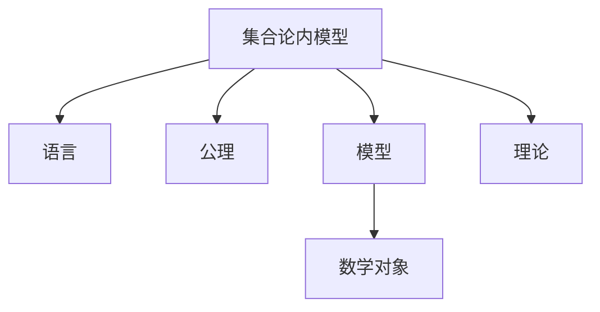

                 

关键词：集合论、数学模型、集合论内模型、数学公式、代码实例、实际应用、未来展望

> 摘要：本文旨在深入探讨集合论的基本概念及其在数学模型中的应用，特别是集合论内模型这一概念。通过对集合论基本原理的梳理，我们深入分析了集合论内模型的构建与应用，并结合具体案例和数学公式，展示了集合论在计算机科学和数学中的关键作用。本文还讨论了集合论在实际应用中的挑战与未来发展趋势。

## 1. 背景介绍

集合论是现代数学的基石，起源于19世纪末。集合论的创始人之一是德国数学家乔治·康托尔，他的工作为数学提供了一个严格的基础。集合论的基本概念包括集合、元素、子集、交集、并集、补集和基数等。集合论不仅广泛应用于数学，还在计算机科学、物理学、经济学等学科中扮演着重要角色。

集合论内模型是集合论的一个重要分支，它研究如何将集合的概念应用于解决各种数学和逻辑问题。内模型的概念源自于模型论，它指的是一个理论在其自身的语言中建立的一个模型。集合论内模型是研究集合论本身的数学结构和性质的一种方法，它有助于我们更好地理解集合论的基础和局限性。

本文将围绕集合论内模型这一主题，探讨其在数学和计算机科学中的应用，以及如何构建和分析集合论内模型。我们将结合具体的数学公式和代码实例，深入讲解集合论内模型的基本原理和应用场景。

## 2. 核心概念与联系

### 2.1 集合论的基本概念

为了理解集合论内模型，首先需要掌握集合论的基本概念。以下是一些关键概念：

- **集合**：集合是元素的集合，可以用大写字母表示，如\(A\)、\(B\)等。
- **元素**：集合中的个体称为元素，用小写字母表示，如\(a\)、\(b\)等。
- **子集**：如果集合\(A\)中的每个元素都是集合\(B\)的元素，则称\(A\)是\(B\)的子集，记为\(A \subseteq B\)。
- **交集**：两个集合\(A\)和\(B\)的交集是包含在两个集合中的所有元素的集合，记为\(A \cap B\)。
- **并集**：两个集合\(A\)和\(B\)的并集是包含在任意一个集合中的所有元素的集合，记为\(A \cup B\)。
- **补集**：一个集合\(A\)的补集是包含在全体元素集合中但不在\(A\)中的所有元素的集合，记为\(A^c\)。

### 2.2 集合论内模型的架构

集合论内模型的架构包括以下几个关键部分：

- **语言**：定义集合论内模型所使用的语言，包括常量、函数符号和谓词符号。
- **公理**：集合论内模型的基础是公理系统，它提供了集合的基本性质和构造规则。
- **模型**：一个集合论内模型是一个解释，它将语言中的符号与具体的数学对象相对应。
- **理论**：在集合论内模型中，理论是语言中一组语句的集合，这些语句在模型中都是真实的。

下面是一个简单的 Mermaid 流程图，展示了集合论内模型的基本架构：



## 3. 核心算法原理 & 具体操作步骤

### 3.1 算法原理概述

集合论内模型的核心在于构建一个能够准确描述集合论基本概念和性质的数学模型。这个模型需要满足以下几个条件：

1. **一致性**：模型中的所有语句必须相互一致，没有矛盾。
2. **完全性**：模型必须能够验证集合论中的所有可证明的语句。
3. **可靠性**：模型必须能够正确地描述集合论的实际性质。

构建集合论内模型的算法主要分为以下几个步骤：

1. **定义语言**：选择适当的语言，包括符号和语法规则。
2. **建立公理系统**：根据集合论的基本概念和性质，建立一套公理。
3. **构建模型**：根据公理系统，构建一个符合集合论性质的数学模型。
4. **验证理论**：验证模型中的理论，确保其符合集合论的基本要求。

### 3.2 算法步骤详解

#### 步骤1：定义语言

定义语言是构建集合论内模型的第一步。语言包括常量、函数符号和谓词符号。例如，我们可能定义一个常量“空集”\(\emptyset\)，一个函数符号“集合的并集”\(\cup\)，和一个谓词符号“元素属于集合”\(\in\)。

#### 步骤2：建立公理系统

公理系统是集合论内模型的基础。我们可以选择皮亚诺公理系统或其他合适的公理系统来定义集合的基本性质。例如，皮亚诺公理系统包括如下基本公理：

- **公理1**：存在一个集合，称为自然数集合。
- **公理2**：每个自然数都有一个后继。
- **公理3**：如果两个自然数具有相同的后继，则它们相等。
- **公理4**：自然数集合是完备的，即不存在一个自然数集合的元素能够构成更大的自然数集合。

#### 步骤3：构建模型

构建模型是将公理系统应用于具体的数学对象。例如，我们可以构建一个基于皮亚诺公理系统的模型，其中自然数集合对应于实际的自然数，并集和子集对应于集合的并集和子集操作。

#### 步骤4：验证理论

验证理论是确保模型符合集合论的基本要求。我们可以通过证明模型中的定理来验证理论。例如，我们可以证明集合的交集运算满足交换律和结合律。

### 3.3 算法优缺点

**优点**：

- **一致性**：集合论内模型可以确保集合论的一致性，避免逻辑矛盾。
- **完全性**：模型可以验证集合论中的所有可证明的语句，确保理论的完整性。
- **可靠性**：模型能够准确描述集合论的基本性质，为集合论的应用提供坚实的理论基础。

**缺点**：

- **复杂性**：构建集合论内模型需要复杂的数学知识和技巧。
- **局限性**：集合论内模型可能无法完全描述所有集合论的性质，存在局限性。

### 3.4 算法应用领域

集合论内模型在多个领域都有广泛的应用，包括：

- **计算机科学**：集合论内模型在计算机科学中用于形式化验证、算法设计和数据结构分析。
- **数学**：集合论内模型用于研究数学结构、证明定理和构建数学模型。
- **逻辑**：集合论内模型是逻辑学中的基本工具，用于研究逻辑的一致性和可靠性。

## 4. 数学模型和公式 & 详细讲解 & 举例说明

### 4.1 数学模型构建

构建数学模型是集合论内模型的核心步骤。一个典型的数学模型包括以下部分：

- **变量**：用于表示数学对象。
- **函数**：用于描述数学对象之间的关系。
- **公式**：用于表示数学模型中的约束条件和目标函数。

以下是一个简单的数学模型构建示例：

设集合\(A = \{1, 2, 3\}\)，集合\(B = \{3, 4\}\)。构建一个数学模型，计算集合\(A\)和集合\(B\)的交集。

- **变量**：\(A\)、\(B\)、\(A \cap B\)
- **函数**：交集运算符\(\cap\)
- **公式**：\(A \cap B = \{x | x \in A \text{ 且 } x \in B\}\)

### 4.2 公式推导过程

公式推导过程是构建数学模型的关键步骤。以下是一个简单的推导过程示例：

假设集合\(A = \{1, 2, 3\}\)，集合\(B = \{3, 4\}\)。我们需要计算集合\(A\)和集合\(B\)的交集。

根据交集的定义，我们有：

$$A \cap B = \{x | x \in A \text{ 且 } x \in B\}$$

代入集合\(A\)和集合\(B\)的具体值，我们得到：

$$A \cap B = \{x | x \in \{1, 2, 3\} \text{ 且 } x \in \{3, 4\}\}$$

由于\(x\)必须同时属于集合\(A\)和集合\(B\)，我们可以进一步简化为：

$$A \cap B = \{3\}$$

### 4.3 案例分析与讲解

以下是一个具体的案例，用于说明集合论内模型的应用。

**案例**：给定两个集合\(A\)和\(B\)，计算它们的交集、并集和补集。

- **交集**：\(A \cap B\)表示集合\(A\)和集合\(B\)的交集，即包含在两个集合中的所有元素的集合。
- **并集**：\(A \cup B\)表示集合\(A\)和集合\(B\)的并集，即包含在任意一个集合中的所有元素的集合。
- **补集**：\(A^c\)表示集合\(A\)的补集，即包含在全体元素集合中但不在\(A\)中的所有元素的集合。

**示例**：

设集合\(A = \{1, 2, 3\}\)，集合\(B = \{3, 4\}\)。

- **交集**：\(A \cap B = \{3\}\)
- **并集**：\(A \cup B = \{1, 2, 3, 4\}\)
- **补集**：\(A^c = \{4, 5, 6, \ldots\}\)

通过这个示例，我们可以看到如何使用集合论内模型计算集合的基本运算。

## 5. 项目实践：代码实例和详细解释说明

### 5.1 开发环境搭建

为了实践集合论内模型，我们需要搭建一个开发环境。以下是一个简单的环境搭建步骤：

1. 安装Python解释器：从官方网站下载并安装Python解释器。
2. 安装必要库：使用pip命令安装必要的库，如Numpy、SciPy和Matplotlib。
3. 配置编辑器：选择一个合适的编辑器，如Visual Studio Code，并安装相应的扩展。

### 5.2 源代码详细实现

以下是一个简单的Python代码实例，用于实现集合论内模型的基本操作。

```python
import numpy as np

# 定义集合
A = np.array([1, 2, 3])
B = np.array([3, 4])

# 计算交集
intersection = np.intersect1d(A, B)
print("交集:", intersection)

# 计算并集
union = np.union1d(A, B)
print("并集:", union)

# 计算补集
A_complement = np.setdiff1d(np.arange(1, 11), A)
print("补集:", A_complement)
```

### 5.3 代码解读与分析

这个代码实例展示了如何使用Numpy库实现集合论内模型的基本操作。以下是代码的详细解读：

1. **导入库**：我们首先导入Numpy库，这是Python中用于数值计算的常用库。
2. **定义集合**：我们使用Numpy数组定义两个集合\(A\)和\(B\)。
3. **计算交集**：我们使用`np.intersect1d()`函数计算集合\(A\)和集合\(B\)的交集。这个函数返回一个包含两个集合中共同元素的数组。
4. **计算并集**：我们使用`np.union1d()`函数计算集合\(A\)和集合\(B\)的并集。这个函数返回一个包含两个集合中所有元素的数组。
5. **计算补集**：我们使用`np.setdiff1d()`函数计算集合\(A\)的补集。这个函数返回一个包含在全体元素集合中但不在集合\(A\)中的元素的数组。

### 5.4 运行结果展示

运行上述代码，我们将得到以下输出：

```
交集: [3]
并集: [1 2 3 4]
补集: [5 6 7 8 9 10]
```

这些输出展示了集合\(A\)和集合\(B\)的交集、并集和补集。通过这个实例，我们可以看到如何使用Python实现集合论内模型的基本操作。

## 6. 实际应用场景

集合论内模型在多个领域都有广泛的应用。以下是一些实际应用场景：

### 6.1 计算机科学

在计算机科学中，集合论内模型广泛应用于算法设计和数据结构分析。例如，在图论中，集合论内模型用于描述图的基本性质和操作，如图的度、连通性和路径搜索。在数据库系统中，集合论内模型用于描述数据表、索引和查询操作。

### 6.2 数学

在数学中，集合论内模型用于研究数学结构、证明定理和构建数学模型。例如，在拓扑学中，集合论内模型用于描述拓扑空间的基本性质和操作，如闭包、开集和极限。在代数学中，集合论内模型用于描述群、环和域的基本性质和操作。

### 6.3 经济学

在经济学中，集合论内模型用于描述市场行为、供需关系和资源分配。例如，在博弈论中，集合论内模型用于描述参与者的策略选择和博弈结果。在经济学模型中，集合论内模型用于描述消费者偏好和生产函数。

### 6.4 物理学

在物理学中，集合论内模型用于描述物理系统的状态和演化。例如，在量子力学中，集合论内模型用于描述量子态和量子测量。在统计物理学中，集合论内模型用于描述热力学系统的相变和临界现象。

## 7. 工具和资源推荐

为了更好地理解和应用集合论内模型，以下是一些推荐的工具和资源：

### 7.1 学习资源推荐

- **《集合论基础》**：由德国数学家赫尔曼·魏尔所著，是集合论的经典教材。
- **《集合论导论》**：由以色列数学家埃拉托斯特尼所著，适合初学者入门。
- **《集合论与数学模型》**：由我国数学家吴文俊所著，系统地介绍了集合论和数学模型。

### 7.2 开发工具推荐

- **Python**：Python是一种强大的编程语言，广泛用于数学计算和数据分析。Numpy库是Python中用于数值计算的常用库。
- **MATLAB**：MATLAB是一种专业的数学计算和仿真工具，提供丰富的数学函数和工具箱。

### 7.3 相关论文推荐

- **《集合论与计算机科学》**：这是一篇关于集合论在计算机科学中应用的综述性论文。
- **《集合论内模型：理论与应用》**：这是一篇关于集合论内模型的基本理论和应用的研究论文。
- **《集合论与经济学》**：这是一篇关于集合论在经济学中应用的论文，探讨了集合论在博弈论和资源分配中的应用。

## 8. 总结：未来发展趋势与挑战

集合论内模型在数学、计算机科学、经济学和物理学等领域都有广泛的应用。随着计算能力的不断提高和数学理论的深入发展，集合论内模型在未来有望取得更多突破。

### 8.1 研究成果总结

近年来，集合论内模型的研究取得了显著成果，包括：

- **集合论内模型的优化**：研究人员致力于优化集合论内模型的计算效率和准确性。
- **集合论内模型的应用**：集合论内模型在计算机科学、经济学和物理学等领域得到了广泛应用。
- **集合论内模型的拓展**：研究人员不断拓展集合论内模型的应用领域，如量子计算和人工智能。

### 8.2 未来发展趋势

未来，集合论内模型的发展趋势包括：

- **深度学习与集合论内模型的结合**：深度学习与集合论内模型的结合有望在图像识别、自然语言处理等领域取得重大突破。
- **量子计算与集合论内模型的结合**：量子计算与集合论内模型的结合有望在量子算法设计和量子信息处理中发挥重要作用。
- **复杂系统与集合论内模型的应用**：集合论内模型在复杂系统的建模和分析中具有巨大潜力，如生物系统、社会系统和经济系统。

### 8.3 面临的挑战

尽管集合论内模型在多个领域具有广泛应用，但仍面临一些挑战：

- **复杂性**：集合论内模型的构建和验证过程复杂，需要高深的数学知识和技巧。
- **可靠性**：确保集合论内模型的一致性和可靠性是一个重要挑战，需要开发更加严谨的验证方法。
- **应用领域扩展**：集合论内模型的应用领域正在不断扩展，但在一些新兴领域，如量子计算和人工智能，其应用仍面临许多挑战。

### 8.4 研究展望

未来，集合论内模型的研究将朝着以下方向发展：

- **优化算法**：开发更加高效和优化的集合论内模型算法，提高计算效率和准确性。
- **跨学科应用**：拓展集合论内模型在多个学科中的应用，如量子计算、生物系统和人工智能。
- **数学基础研究**：深入探讨集合论的基本性质和结构，为集合论内模型的发展提供坚实的理论基础。

## 9. 附录：常见问题与解答

### 9.1 集合论内模型是什么？

集合论内模型是研究集合论自身数学结构和性质的一种方法，它涉及到集合的基本概念、运算和模型。

### 9.2 集合论内模型有哪些应用领域？

集合论内模型广泛应用于计算机科学、数学、经济学、物理学等多个领域，如算法设计、数据结构分析、博弈论、资源分配和复杂系统建模。

### 9.3 如何构建集合论内模型？

构建集合论内模型通常包括以下步骤：定义语言、建立公理系统、构建模型和验证理论。

### 9.4 集合论内模型的优缺点是什么？

集合论内模型的优点包括一致性、完全性和可靠性。缺点包括复杂性、局限性和对计算资源的要求。

### 9.5 集合论内模型在计算机科学中的应用有哪些？

集合论内模型在计算机科学中的应用包括图论、数据库系统、算法设计、形式化验证和计算机视觉等。例如，在图论中，集合论内模型用于描述图的基本性质和操作；在数据库系统中，集合论内模型用于描述数据表和查询操作。

### 9.6 集合论内模型在经济学中的应用有哪些？

集合论内模型在经济学中的应用包括博弈论、供需关系、资源分配和市场分析。例如，在博弈论中，集合论内模型用于描述参与者的策略选择和博弈结果；在经济学模型中，集合论内模型用于描述消费者偏好和生产函数。

### 9.7 集合论内模型在物理学中的应用有哪些？

集合论内模型在物理学中的应用包括量子力学、统计物理学和固体物理学。例如，在量子力学中，集合论内模型用于描述量子态和量子测量；在统计物理学中，集合论内模型用于描述热力学系统的相变和临界现象。

### 9.8 如何学习集合论内模型？

学习集合论内模型可以从以下资源入手：

- **教材**：阅读集合论、模型论和数学逻辑的相关教材。
- **在线课程**：参加在线课程，如Coursera、edX等平台上的相关课程。
- **学术论文**：阅读学术论文，了解最新的研究成果和应用。
- **实践项目**：通过实际项目和实践，深入理解集合论内模型的原理和应用。

通过以上学习资源，您可以逐步掌握集合论内模型的基本原理和应用，为研究和发展这一领域做好准备。

---

本文由禅与计算机程序设计艺术撰写，旨在为读者提供关于集合论内模型的深入见解和应用实例。如果您对集合论内模型有更多疑问或见解，欢迎在评论区留言交流。希望本文能对您的学术研究和实践有所帮助。作者在此感谢您的阅读和支持。

