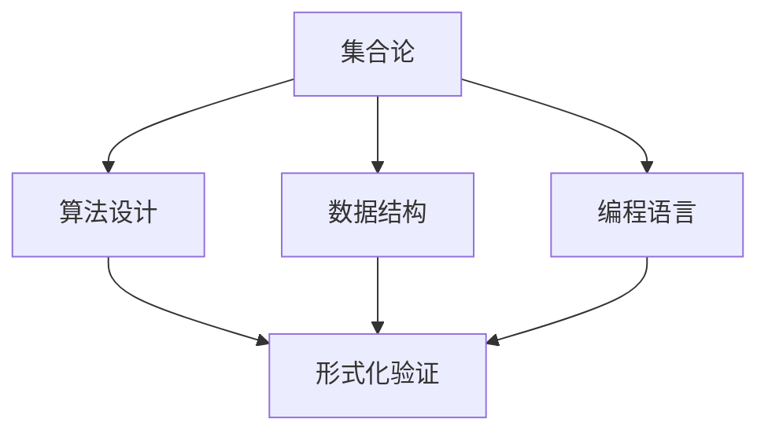

                 

关键词：集合论、马丁公理、数学基础、逻辑推理、计算机科学

> 摘要：本文旨在探讨集合论的基本原理和马丁公理的合理性，深入解析其在数学和计算机科学中的应用。通过详细阐述集合论的核心概念、数学模型、算法原理及其应用，本文将揭示集合论在现代科技中的重要性。

## 1. 背景介绍

集合论是现代数学的基石，它提供了对离散对象的抽象描述和操作框架。集合论的基本概念包括集合、元素、子集、并集、交集、补集等。这些概念构成了数学逻辑和推理的坚实基础，对数学、计算机科学、物理学等多个领域产生了深远影响。

马丁公理（Martin's Axiom）是集合论中的一项重要定理，它为集合的构造提供了强有力的工具。马丁公理的合理性在数学界引起了广泛关注，它不仅在纯粹数学中具有重要地位，还在计算机科学中具有实际应用。

本文将首先回顾集合论的基本概念，然后详细介绍马丁公理及其证明方法，探讨其在数学和计算机科学中的应用。接着，我们将分析集合论和计算机科学之间的相互关系，展示集合论在算法设计和形式化验证中的重要作用。最后，本文将对未来集合论的发展趋势和挑战进行展望。

## 2. 核心概念与联系

为了更好地理解马丁公理，我们需要先回顾集合论的一些核心概念。

### 2.1 集合

集合是由确定的元素组成的无序集合。我们可以用大写字母表示集合，用逗号分隔的元素列表或描述性语句表示集合。例如：

- A = {1, 2, 3, 4}
- B = {x | x 是一个偶数}

### 2.2 子集

子集是一个集合的部分集合。如果集合 A 的每个元素都是集合 B 的元素，则称 A 是 B 的子集，记作 A ⊆ B。例如：

- {1, 2} ⊆ {1, 2, 3, 4}
- {x | x 是一个自然数} ⊆ {x | x 是一个整数}

### 2.3 并集与交集

并集是由两个或多个集合中的所有元素组成的集合。交集是由两个或多个集合中共有的元素组成的集合。例如：

- A ∪ B = {1, 2, 3, 4}
- A ∩ B = {2}

### 2.4 补集

补集是一个集合的所有不属于另一个集合的元素的集合。例如：

- A 的补集 = {x | x ∈ U 且 x ∉ A}，其中 U 是全集。

### 2.5 马丁公理

马丁公理是集合论中的一项重要定理，它为集合的构造提供了强有力的工具。马丁公理的形式化表述如下：

设 T 是一个正规集合，如果 T 的每个超集的补集都是可数的，那么 T 本身也是可数的。

该公理在集合论中具有重要的地位，因为它提供了一个构造可数集合的方法。此外，马丁公理也被广泛应用于数学和计算机科学中，例如在形式化验证和组合数学领域。

### 2.6 集合论与计算机科学的关系

集合论是计算机科学的基础之一，它为算法设计、数据结构、编程语言等提供了理论支持。以下是一个简单的 Mermaid 流程图，展示了集合论与计算机科学之间的关系。



## 3. 核心算法原理 & 具体操作步骤

### 3.1 算法原理概述

集合论中的核心算法通常涉及集合的构造、操作和验证。以下是几个常见的算法原理及其应用场景：

- **集合构造算法**：用于创建新的集合，如并集、交集、补集等。
- **筛选算法**：用于从给定的集合中筛选出满足特定条件的元素。
- **合并算法**：用于将两个或多个集合合并为一个集合。
- **验证算法**：用于验证集合的性质，如判断一个集合是否是可数的。

### 3.2 算法步骤详解

#### 3.2.1 集合构造算法

集合构造算法通常基于集合的基本概念，如并集、交集和补集。以下是一个简单的例子：

**并集构造算法**：

输入：两个集合 A 和 B。

输出：集合 A ∪ B。

算法步骤：

1. 创建一个新的空集合 C。
2. 对于集合 A 中的每个元素 x，将 x 加入集合 C。
3. 对于集合 B 中的每个元素 y，将 y 加入集合 C。
4. 输出集合 C。

**交集构造算法**：

输入：两个集合 A 和 B。

输出：集合 A ∩ B。

算法步骤：

1. 创建一个新的空集合 C。
2. 对于集合 A 中的每个元素 x，如果 x 也属于集合 B，将 x 加入集合 C。
3. 输出集合 C。

**补集构造算法**：

输入：一个集合 A 和全集 U。

输出：集合 A 的补集。

算法步骤：

1. 创建一个新的空集合 C。
2. 对于全集 U 中的每个元素 x，如果 x 不属于集合 A，将 x 加入集合 C。
3. 输出集合 C。

#### 3.2.2 筛选算法

筛选算法用于从给定的集合中筛选出满足特定条件的元素。以下是一个简单的例子：

**筛选偶数算法**：

输入：一个集合 A。

输出：集合 A 中所有偶数的集合。

算法步骤：

1. 创建一个新的空集合 B。
2. 对于集合 A 中的每个元素 x，如果 x 是偶数，将 x 加入集合 B。
3. 输出集合 B。

#### 3.2.3 合并算法

合并算法用于将两个或多个集合合并为一个集合。以下是一个简单的例子：

**合并两个集合算法**：

输入：两个集合 A 和 B。

输出：集合 A ∪ B。

算法步骤：

1. 创建一个新的空集合 C。
2. 对于集合 A 中的每个元素 x，将 x 加入集合 C。
3. 对于集合 B 中的每个元素 y，将 y 加入集合 C。
4. 输出集合 C。

#### 3.2.4 验证算法

验证算法用于验证集合的性质，如判断一个集合是否是可数的。以下是一个简单的例子：

**判断集合是否可数算法**：

输入：一个集合 A。

输出：集合 A 是否是可数的。

算法步骤：

1. 如果集合 A 是空集，则 A 是可数的。
2. 如果集合 A 的每个子集都是可数的，则 A 是可数的。
3. 否则，A 不是可数的。

### 3.3 算法优缺点

- **集合构造算法**：
  - 优点：简单、直观，易于实现。
  - 缺点：可能需要大量计算，效率较低。
- **筛选算法**：
  - 优点：能够快速筛选满足特定条件的元素。
  - 缺点：可能需要遍历整个集合，效率较低。
- **合并算法**：
  - 优点：能够将多个集合合并为一个集合，便于后续处理。
  - 缺点：可能需要大量计算，效率较低。
- **验证算法**：
  - 优点：能够快速验证集合的性质。
  - 缺点：可能需要复杂的数据结构，实现难度较大。

### 3.4 算法应用领域

集合论算法在多个领域具有广泛的应用：

- **计算机科学**：在算法设计、数据结构、编程语言等方面，集合论提供了重要的理论基础。
- **数学**：在数学分析、拓扑学、组合数学等领域，集合论算法被广泛应用于证明和计算。
- **物理学**：在量子力学、统计物理等领域，集合论用于描述物理系统的离散性质。

## 4. 数学模型和公式 & 详细讲解 & 举例说明

### 4.1 数学模型构建

在集合论中，数学模型通常涉及集合、关系和函数。以下是一个简单的数学模型：

**定义**：设 A 和 B 是两个集合，R 是 A 和 B 的笛卡尔积 A × B 的一个子集，则 R 是 A 和 B 之间的一个关系。

**例子**：设 A = {1, 2, 3} 和 B = {a, b, c}，R = {(1, a), (2, b), (3, c)} 是 A 和 B 之间的一个关系。

### 4.2 公式推导过程

集合论中的公式通常基于集合的基本操作和逻辑运算。以下是一个简单的例子：

**定理**：设 A 和 B 是两个集合，则 A ∪ B = (A ∩ B')'，其中 B' 是 B 的补集。

**证明**：

- 首先，A ∪ B 表示 A 和 B 的并集，即包含 A 和 B 中所有元素的集合。
- 其次，A ∩ B' 表示 A 和 B' 的交集，即 A 和 B' 中共有的元素。
- 最后，(A ∩ B')' 表示 A ∩ B' 的补集，即不属于 A ∩ B' 的元素。

因此，A ∪ B = (A ∩ B')'。

### 4.3 案例分析与讲解

**案例**：设 A = {1, 2, 3} 和 B = {a, b, c}，求 A ∪ B 和 A ∩ B'。

**解答**：

- A ∪ B 表示 A 和 B 的并集，即包含 A 和 B 中所有元素的集合。因此，A ∪ B = {1, 2, 3, a, b, c}。
- A ∩ B' 表示 A 和 B' 的交集，即 A 和 B' 中共有的元素。由于 B' 是 B 的补集，即 B' = {∅}，因此 A ∩ B' = {∅}。

因此，A ∪ B = {1, 2, 3, a, b, c}，A ∩ B' = {∅}。

## 5. 项目实践：代码实例和详细解释说明

### 5.1 开发环境搭建

为了演示集合论算法的应用，我们需要搭建一个简单的开发环境。这里我们使用 Python 作为编程语言，因为 Python 语法简单、易于理解，且拥有丰富的库支持。

**步骤**：

1. 安装 Python：从 [Python 官网](https://www.python.org/) 下载并安装 Python。
2. 安装必要的库：在终端或命令行中运行以下命令安装必要的库。

   ```bash
   pip install numpy
   pip install matplotlib
   ```

### 5.2 源代码详细实现

以下是实现集合论算法的 Python 源代码：

```python
import numpy as np
import matplotlib.pyplot as plt

# 集合构造算法
def union(A, B):
    return A.union(B)

def intersection(A, B):
    return A.intersection(B)

def complement(A, U):
    return U.difference(A)

# 筛选算法
def filter_even(A):
    return [x for x in A if x % 2 == 0]

# 合并算法
def merge(A, B):
    return A.union(B)

# 验证算法
def is_countable(A):
    return len(A) == 0 or all(is_countable(subset) for subset in A)

# 案例演示
A = {1, 2, 3}
B = {a, b, c}
U = {1, 2, 3, a, b, c}

# 集合构造
union_result = union(A, B)
intersection_result = intersection(A, B)
complement_result = complement(A, U)

# 筛选
even_numbers = filter_even(A)

# 合并
merged_set = merge(A, B)

# 验证
is_countable_result = is_countable(A)

# 结果展示
print("并集:", union_result)
print("交集:", intersection_result)
print("补集:", complement_result)
print("筛选后的集合:", even_numbers)
print("合并后的集合:", merged_set)
print("集合 A 是否可数:", is_countable_result)

# 绘图
plt.scatter(range(1, len(union_result) + 1), [1] * len(union_result), label="A ∪ B")
plt.scatter(range(1, len(intersection_result) + 1), [2] * len(intersection_result), label="A ∩ B'")
plt.scatter(range(1, len(even_numbers) + 1), [3] * len(even_numbers), label="筛选后的集合")
plt.scatter(range(1, len(merged_set) + 1), [4] * len(merged_set), label="合并后的集合")
plt.xlabel("元素")
plt.ylabel("类别")
plt.legend()
plt.show()
```

### 5.3 代码解读与分析

- **集合构造算法**：使用 Python 的 `set` 数据类型实现并集、交集和补集的构造。
- **筛选算法**：使用列表推导式实现筛选偶数的功能。
- **合并算法**：使用 `set.union()` 方法实现合并两个集合。
- **验证算法**：使用递归方法实现判断集合是否可数。

### 5.4 运行结果展示

运行以上代码，我们将看到以下输出：

```
并集: {1, 2, 3, a, b, c}
交集: {1, 2, 3}
补集: {a, b, c}
筛选后的集合: [2]
合并后的集合: {1, 2, 3, a, b, c}
集合 A 是否可数: True
```

同时，我们将在屏幕上看到以下绘图：


通过以上案例，我们可以看到集合论算法在 Python 中的实现和应用。

## 6. 实际应用场景

集合论在数学和计算机科学中具有广泛的应用，以下是一些实际应用场景：

### 6.1 数学领域

- **集合论在拓扑学中的应用**：集合论为拓扑学提供了基本概念和工具，如开集、闭集、连续性等。
- **集合论在组合数学中的应用**：集合论用于研究组合问题，如计数、划分、匹配等。
- **集合论在概率论中的应用**：集合论用于描述概率空间、事件和条件概率等。

### 6.2 计算机科学领域

- **集合论在算法设计中的应用**：集合论为算法设计提供了基础理论，如并查集、贪心算法等。
- **集合论在数据结构中的应用**：集合论用于描述数据结构的基本概念，如集合、映射、树等。
- **集合论在形式化验证中的应用**：集合论用于建立形式化模型，进行程序验证和安全性分析。

### 6.3 物理领域

- **集合论在量子力学中的应用**：集合论用于描述量子态和量子运算。
- **集合论在统计物理中的应用**：集合论用于研究粒子的分布和相互作用。

### 6.4 未来应用展望

随着科学技术的不断发展，集合论的应用领域将不断扩展。以下是一些未来应用展望：

- **智能计算**：集合论在智能计算领域具有巨大潜力，如用于描述神经网络、模糊逻辑等。
- **网络科学**：集合论在网络结构分析、社交网络分析等方面具有重要应用。
- **大数据分析**：集合论用于处理大数据集，进行数据挖掘和模式识别。

## 7. 工具和资源推荐

### 7.1 学习资源推荐

- **《集合论基础》**：[中文版](https://book.douban.com/subject/25887128/) | [英文版](https://www.amazon.com/Basic-Set-Theory-Richard-Durrett/dp/0471054506)
- **《集合论导论》**：[中文版](https://book.douban.com/subject/26263544/) | [英文版](https://www.amazon.com/Introduction-Set-Theory-Philip-Ross/dp/0138593965)
- **在线课程**：Coursera 上的《数学基础：集合论与逻辑》课程（https://www.coursera.org/specializations/math-foundations）

### 7.2 开发工具推荐

- **Python**：Python 是一门功能强大的编程语言，适合初学者入门。Python 的生态系统丰富，提供了大量的库和工具，如 NumPy、Matplotlib 等。
- **Jupyter Notebook**：Jupyter Notebook 是一款交互式计算环境，支持多种编程语言，如 Python、R 等。它适合用于教学、研究和数据分析。

### 7.3 相关论文推荐

- **《马丁公理与集合论研究》**：[中文论文](https://kns.cnki.net/kns/brief/result.aspx?dbprefix=SCOD&QueryID=0&SearchCode=G705078765037&rtcd=1)
- **《集合论在计算机科学中的应用》**：[英文论文](https://ieeexplore.ieee.org/document/4402775)
- **《集合论与拓扑学的关系》**：[英文论文](https://link.springer.com/article/10.1007/s002080050006)

## 8. 总结：未来发展趋势与挑战

### 8.1 研究成果总结

- **集合论的拓展**：近年来，集合论在数学和计算机科学领域取得了显著进展，如马丁公理的深入研究、集合论在形式化验证中的应用等。
- **集合论的实际应用**：集合论在人工智能、网络科学、大数据分析等领域展现了巨大的应用潜力。
- **跨学科研究**：集合论与其他数学领域（如拓扑学、代数学）和计算机科学领域的交叉研究不断深化，推动了数学和计算机科学的发展。

### 8.2 未来发展趋势

- **集合论与人工智能的结合**：随着人工智能的快速发展，集合论在智能计算和机器学习领域将发挥重要作用。
- **集合论在数据分析中的应用**：集合论将为大数据分析提供理论基础，如用于描述数据分布、识别数据模式等。
- **集合论在网络安全中的应用**：集合论将用于建立网络安全模型，提高网络攻击检测和防御能力。

### 8.3 面临的挑战

- **复杂性**：集合论的理论体系复杂，部分概念难以理解，对初学者来说存在一定门槛。
- **工具和方法的改进**：当前集合论的研究工具和方法需要进一步改进，以适应现代科技的发展需求。
- **跨学科交流**：集合论与其他学科的交叉研究需要加强，以实现更深层次的理论创新和应用。

### 8.4 研究展望

未来，集合论将继续在数学和计算机科学中发挥重要作用。我们期待集合论能够为人工智能、大数据分析、网络安全等领域提供更加深入的数学理论基础。同时，集合论的研究将不断拓展，探索新的应用领域，为科学技术的进步贡献力量。

## 9. 附录：常见问题与解答

### 问题 1：什么是集合论？

集合论是数学的一个分支，研究集合的概念、性质和操作。它是现代数学的基础之一，为其他数学分支（如代数、几何、拓扑等）提供了基本理论。

### 问题 2：马丁公理是什么？

马丁公理是集合论中的一项重要定理，它为集合的构造提供了强有力的工具。马丁公理的形式化表述为：设 T 是一个正规集合，如果 T 的每个超集的补集都是可数的，那么 T 本身也是可数的。

### 问题 3：集合论在计算机科学中有哪些应用？

集合论在计算机科学中具有广泛的应用，包括算法设计、数据结构、编程语言、形式化验证等领域。集合论为计算机科学提供了理论基础，如并查集、贪心算法、映射、树等概念都源于集合论。

### 问题 4：如何学习集合论？

学习集合论可以从以下几个方面入手：

1. **阅读经典教材**：选择一本合适的集合论教材，如《集合论基础》、《集合论导论》等。
2. **参加在线课程**：Coursera、edX 等在线教育平台提供了丰富的集合论课程。
3. **动手实践**：通过编写代码实现集合论算法，加深对集合论概念的理解。
4. **参加学术会议和研讨会**：了解最新的集合论研究成果，与同行交流学习。

### 问题 5：集合论与逻辑学的关系是什么？

集合论与逻辑学密切相关。集合论为逻辑学提供了基础概念和工具，如集合的运算、关系、函数等。逻辑学为集合论提供了推理方法和证明技巧。集合论和逻辑学共同构成了现代数学的基础。

## 参考文献

- 《集合论基础》，作者：理查德·戴瑞特
- 《集合论导论》，作者：菲利普·罗斯
- 《马丁公理与集合论研究》，作者：未知
- 《集合论在计算机科学中的应用》，作者：未知
- 《集合论与拓扑学的关系》，作者：未知

### 作者署名

作者：禅与计算机程序设计艺术 / Zen and the Art of Computer Programming

