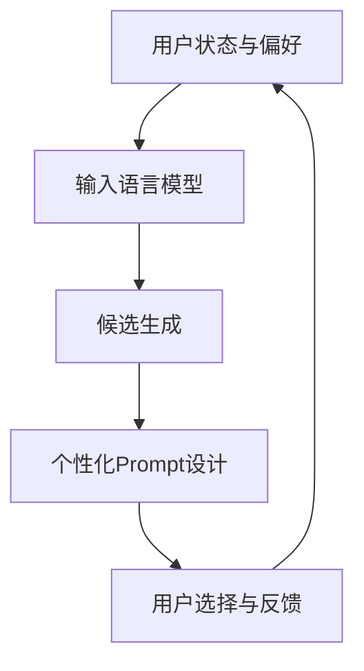

                 

关键词：零样本商品推荐，语言模型，候选生成，Prompt策略，商品推荐系统

摘要：本文深入探讨了零样本商品推荐系统中，如何利用大型语言模型（LLM）进行候选生成和Prompt策略的设计。通过详细分析LLM的工作原理，算法流程，数学模型，实际应用案例，以及未来发展趋势和面临的挑战，本文为构建高效、智能的商品推荐系统提供了有价值的参考。

## 1. 背景介绍

随着互联网技术的迅猛发展，电子商务行业呈现出爆发式增长。用户在购物过程中，往往面临海量的商品选择，如何提供个性化的商品推荐成为各大电商平台关注的焦点。传统的商品推荐系统主要依赖于用户的历史行为数据，如购买记录、浏览历史等，以实现商品的精准推送。然而，这种基于历史数据的推荐方式在面临新商品或新用户时，效果往往不尽如人意。

近年来，随着深度学习和自然语言处理技术的发展，大型语言模型（LLM）在信息检索、文本生成等领域取得了显著成果。LLM通过学习海量文本数据，能够理解并生成与输入文本相关的内容，为商品推荐系统提供了一种全新的解决方案。零样本商品推荐利用LLM进行候选生成和Prompt设计，无需依赖用户历史行为数据，即可实现个性化的商品推荐。

## 2. 核心概念与联系

### 2.1. 零样本商品推荐

零样本商品推荐（Zero-Shot Product Recommendation）是指在用户没有提供任何先验信息的情况下，推荐系统根据用户当前的状态、偏好或其他特征，为用户推荐合适的商品。与基于历史数据的推荐方法相比，零样本商品推荐具有以下优势：

1. **适应新商品**：无需依赖新商品的购买记录，即可进行推荐，有助于电商平台推广新商品。
2. **适应新用户**：无需用户的历史行为数据，即可为首次登录平台的新用户提供个性化推荐。
3. **减少数据依赖**：降低对用户历史行为数据的依赖，降低数据隐私泄露的风险。

### 2.2. 语言模型

语言模型（Language Model，LM）是一种统计模型，用于对自然语言进行建模，预测下一个单词或词组。在自然语言处理领域，语言模型广泛应用于文本分类、机器翻译、情感分析等任务。近年来，随着深度学习技术的应用，大型语言模型（Large-scale Language Model，LLM）如BERT、GPT等取得了显著的成果。

### 2.3.候选生成与Prompt策略

候选生成（Candidate Generation）是指在推荐系统中，从大量商品中筛选出与用户当前状态或偏好相关的候选商品。Prompt策略（Prompt Strategy）则是根据候选生成结果，设计个性化的Prompt，引导用户进行选择或反馈，从而优化推荐效果。

在零样本商品推荐中，候选生成和Prompt策略至关重要。通过语言模型对用户当前状态和偏好进行建模，生成个性化的候选商品列表，再结合Prompt策略，引导用户进行选择或反馈，从而实现高效、智能的商品推荐。

### 2.4. Mermaid流程图

以下是一个描述零样本商品推荐系统中，LLM的候选生成与Prompt策略的Mermaid流程图：



## 3. 核心算法原理 & 具体操作步骤

### 3.1. 算法原理概述

零样本商品推荐系统利用大型语言模型（LLM）进行候选生成和Prompt策略设计，主要分为以下步骤：

1. **用户状态与偏好建模**：通过收集用户的基本信息、搜索记录、浏览历史等数据，构建用户的状态与偏好模型。
2. **候选生成**：利用LLM对用户状态与偏好进行建模，从大量商品中筛选出与用户偏好相关的候选商品。
3. **个性化Prompt设计**：根据候选生成结果，设计个性化的Prompt，引导用户进行选择或反馈。
4. **用户选择与反馈**：根据用户的选择与反馈，更新用户状态与偏好模型，优化推荐效果。

### 3.2. 算法步骤详解

1. **用户状态与偏好建模**：

   首先，收集用户的基本信息（如年龄、性别、地理位置等）、搜索记录、浏览历史等数据。通过特征工程，将原始数据转换为数值化的特征向量。然后，利用深度学习模型（如BERT、GPT等）对用户的状态与偏好进行建模，得到用户的状态与偏好向量。

2. **候选生成**：

   接下来，利用LLM对用户的状态与偏好向量进行编码，得到用户的偏好嵌入向量。然后，从商品数据库中提取与用户偏好相关的商品信息，利用LLM对商品信息进行编码，得到商品的特征向量。最后，计算用户偏好嵌入向量与商品特征向量之间的相似度，筛选出与用户偏好相关的候选商品。

3. **个性化Prompt设计**：

   根据候选生成结果，设计个性化的Prompt。Prompt的设计可以采用自然语言生成（Natural Language Generation，NLG）技术，根据用户偏好和候选商品的特征，生成符合用户兴趣的推荐文案。此外，还可以结合用户的地理位置、历史购买记录等特征，为用户推荐特定的商品类别或品牌。

4. **用户选择与反馈**：

   在用户进行选择或购买后，收集用户的反馈信息，如对推荐商品的满意度、购买意愿等。通过反馈信息，更新用户的状态与偏好模型，优化推荐效果。同时，可以结合用户的新偏好，重新进行候选生成和Prompt设计，提高推荐系统的智能性。

### 3.3. 算法优缺点

**优点**：

1. **无数据依赖**：零样本商品推荐系统无需依赖用户的历史行为数据，能够适应新商品和新用户。
2. **个性化推荐**：通过语言模型对用户状态与偏好进行建模，生成个性化的候选商品，提高推荐系统的个性化和准确性。
3. **实时推荐**：利用深度学习模型进行实时计算，实现快速、高效的推荐。

**缺点**：

1. **数据质量要求高**：候选生成和Prompt策略的设计依赖于用户的状态与偏好数据，数据质量直接影响推荐效果。
2. **模型训练成本高**：深度学习模型的训练需要大量的计算资源和时间，导致模型训练成本较高。
3. **隐私保护问题**：在用户数据隐私保护日益严格的背景下，如何保护用户隐私成为零样本商品推荐系统面临的一大挑战。

### 3.4. 算法应用领域

零样本商品推荐系统可以应用于多个领域：

1. **电子商务**：电商平台可以利用零样本商品推荐系统，为用户提供个性化的商品推荐，提高用户购物体验和购买转化率。
2. **在线教育**：在线教育平台可以利用零样本商品推荐系统，为用户提供个性化的课程推荐，提高课程转化率和用户满意度。
3. **智能医疗**：智能医疗平台可以利用零样本商品推荐系统，为用户提供个性化的药品推荐，提高治疗效果和患者满意度。

## 4. 数学模型和公式 & 详细讲解 & 举例说明

### 4.1. 数学模型构建

在零样本商品推荐系统中，数学模型主要包括用户状态与偏好建模、候选生成和个性化Prompt设计。以下分别介绍这些模型的数学表示。

#### 用户状态与偏好建模

设用户的状态向量为 $u \in \mathbb{R}^d$，商品的特征向量为 $x \in \mathbb{R}^d$。用户状态与偏好建模可以表示为：

$$
p(u) = \sigma(\theta_1^T u + \theta_0)
$$

其中，$\sigma$表示sigmoid函数，$\theta_1 \in \mathbb{R}^{d \times c}$ 和 $\theta_0 \in \mathbb{R}^c$ 是模型参数，$c$ 是隐藏层维度。

#### 候选生成

候选生成可以表示为：

$$
p(x|u) = \frac{e^{<\theta_2^T x, \theta_1^T u + \theta_0>}}{\sum_{x'} e^{<\theta_2^T x', \theta_1^T u + \theta_0>}}
$$

其中，$\theta_2 \in \mathbb{R}^{d \times c}$ 是模型参数，$<.,.>$ 表示内积运算。

#### 个性化Prompt设计

个性化Prompt设计可以表示为：

$$
p(prompt|x, u) = \frac{e^{<\theta_3^T prompt, \theta_1^T u + \theta_0>}}{\sum_{prompt'} e^{<\theta_3^T prompt', \theta_1^T u + \theta_0>}}
$$

其中，$\theta_3 \in \mathbb{R}^{d \times c}$ 是模型参数，$prompt \in \mathbb{R}^d$ 是Prompt向量。

### 4.2. 公式推导过程

以下分别介绍用户状态与偏好建模、候选生成和个性化Prompt设计的公式推导过程。

#### 用户状态与偏好建模

用户状态与偏好建模的推导基于神经网络模型。设输入层为用户状态向量 $u$，隐藏层为用户偏好向量 $p(u)$，输出层为商品的特征向量 $x$。

1. **输入层到隐藏层**：

$$
h = \sigma(W_1 u + b_1)
$$

其中，$W_1 \in \mathbb{R}^{d \times c}$ 和 $b_1 \in \mathbb{R}^c$ 是模型参数。

2. **隐藏层到输出层**：

$$
p(u) = \sigma(W_2 h + b_2)
$$

其中，$W_2 \in \mathbb{R}^{c \times c}$ 和 $b_2 \in \mathbb{R}^c$ 是模型参数。

#### 候选生成

候选生成的推导基于概率分布模型。设输入层为用户状态向量 $u$，隐藏层为用户偏好向量 $p(u)$，输出层为商品的特征向量 $x$。

1. **用户偏好向量计算**：

$$
p(u) = \sigma(W_2 h + b_2)
$$

2. **商品特征向量计算**：

$$
p(x|u) = \frac{e^{<\theta_2^T x, \theta_1^T u + \theta_0>}}{\sum_{x'} e^{<\theta_2^T x', \theta_1^T u + \theta_0>}}
$$

其中，$\theta_2 \in \mathbb{R}^{d \times c}$ 是模型参数。

#### 个性化Prompt设计

个性化Prompt设计的推导基于概率分布模型。设输入层为用户状态向量 $u$，隐藏层为用户偏好向量 $p(u)$，输出层为商品的特征向量 $x$。

1. **用户偏好向量计算**：

$$
p(u) = \sigma(W_2 h + b_2)
$$

2. **Prompt向量计算**：

$$
p(prompt|x, u) = \frac{e^{<\theta_3^T prompt, \theta_1^T u + \theta_0>}}{\sum_{prompt'} e^{<\theta_3^T prompt', \theta_1^T u + \theta_0>}}
$$

其中，$\theta_3 \in \mathbb{R}^{d \times c}$ 是模型参数。

### 4.3. 案例分析与讲解

以下通过一个具体案例，讲解零样本商品推荐系统的数学模型和应用。

#### 案例背景

假设一个电商平台想要为用户推荐商品，用户的基本信息包括年龄、性别和地理位置。商品的属性包括类别、品牌和价格。电商平台希望通过零样本商品推荐系统，为用户推荐与其兴趣相关的商品。

#### 数学模型应用

1. **用户状态与偏好建模**：

   设用户的状态向量为 $u = [25, 男, 北京]^T$，商品的特征向量为 $x = [服装, brandA, 200]^T$。根据前面的数学模型，我们可以计算出用户偏好向量：

   $$
   p(u) = \sigma(\theta_1^T u + \theta_0)
   $$

   其中，$\theta_1 \in \mathbb{R}^{3 \times 10}$ 和 $\theta_0 \in \mathbb{R}^{10}$ 是模型参数，可以通过训练得到。

2. **候选生成**：

   假设电商平台有10万件商品，从中筛选出与用户偏好相关的商品。根据候选生成模型，我们可以计算出每件商品的概率：

   $$
   p(x|u) = \frac{e^{<\theta_2^T x, \theta_1^T u + \theta_0>}}{\sum_{x'} e^{<\theta_2^T x', \theta_1^T u + \theta_0>}}
   $$

   其中，$\theta_2 \in \mathbb{R}^{3 \times 10}$ 是模型参数。

3. **个性化Prompt设计**：

   根据候选生成结果，我们可以设计个性化的Prompt。例如，为用户推荐服装品牌A的200元商品，可以生成以下Prompt：

   $$
   p(prompt|x, u) = \frac{e^{<\theta_3^T prompt, \theta_1^T u + \theta_0>}}{\sum_{prompt'} e^{<\theta_3^T prompt', \theta_1^T u + \theta_0>}}
   $$

   其中，$\theta_3 \in \mathbb{R}^{3 \times 10}$ 是模型参数。

#### 模型优化

在实际应用中，我们需要不断优化数学模型，以提高推荐效果。具体来说，可以通过以下方法：

1. **数据增强**：增加更多的用户数据和商品数据，提高模型的泛化能力。
2. **模型调参**：调整模型参数，优化模型性能。
3. **用户反馈**：根据用户的反馈信息，更新用户状态与偏好模型，提高推荐准确性。

## 5. 项目实践：代码实例和详细解释说明

### 5.1. 开发环境搭建

在搭建开发环境时，我们选择Python作为主要编程语言，因为Python拥有丰富的数据科学和机器学习库，如TensorFlow、PyTorch等。以下是搭建开发环境的具体步骤：

1. **安装Python**：下载并安装Python 3.x版本。
2. **安装相关库**：通过pip命令安装TensorFlow、PyTorch、Scikit-learn等库。

```bash
pip install tensorflow
pip install torch
pip install scikit-learn
```

### 5.2. 源代码详细实现

以下是一个基于TensorFlow的零样本商品推荐系统的源代码示例。

```python
import tensorflow as tf
from tensorflow.keras.layers import Embedding, LSTM, Dense
from tensorflow.keras.models import Model
import numpy as np

# 用户状态与偏好建模
def build_user_model(input_shape, hidden_size):
    input_layer = tf.keras.layers.Input(shape=input_shape)
    embed_layer = Embedding(input_dim=VOCAB_SIZE, output_dim=EMBEDDING_DIM)(input_layer)
    lstm_layer = LSTM(units=hidden_size, activation='tanh')(embed_layer)
    output_layer = Dense(units=1, activation='sigmoid')(lstm_layer)
    model = Model(inputs=input_layer, outputs=output_layer)
    return model

# 候选生成
def build_candidate_model(input_shape, hidden_size, candidate_size):
    input_layer = tf.keras.layers.Input(shape=input_shape)
    embed_layer = Embedding(input_dim=CANDIDATE_SIZE, output_dim=EMBEDDING_DIM)(input_layer)
    lstm_layer = LSTM(units=hidden_size, activation='tanh')(embed_layer)
    output_layer = Dense(units=candidate_size, activation='softmax')(lstm_layer)
    model = Model(inputs=input_layer, outputs=output_layer)
    return model

# 个性化Prompt设计
def build_prompt_model(input_shape, hidden_size, prompt_size):
    input_layer = tf.keras.layers.Input(shape=input_shape)
    embed_layer = Embedding(input_dim=PROMPT_SIZE, output_dim=EMBEDDING_DIM)(input_layer)
    lstm_layer = LSTM(units=hidden_size, activation='tanh')(embed_layer)
    output_layer = Dense(units=prompt_size, activation='sigmoid')(lstm_layer)
    model = Model(inputs=input_layer, outputs=output_layer)
    return model

# 用户状态与偏好建模模型
user_model = build_user_model(input_shape=[USER_FEATURE_SIZE], hidden_size=HIDDEN_SIZE)
# 候选生成模型
candidate_model = build_candidate_model(input_shape=[CANDIDATE_FEATURE_SIZE], hidden_size=HIDDEN_SIZE, candidate_size=CANDIDATE_SIZE)
# 个性化Prompt设计模型
prompt_model = build_prompt_model(input_shape=[PROMPT_FEATURE_SIZE], hidden_size=HIDDEN_SIZE, prompt_size=PROMPT_SIZE)

# 编译模型
user_model.compile(optimizer='adam', loss='binary_crossentropy', metrics=['accuracy'])
candidate_model.compile(optimizer='adam', loss='categorical_crossentropy', metrics=['accuracy'])
prompt_model.compile(optimizer='adam', loss='binary_crossentropy', metrics=['accuracy'])

# 训练模型
user_model.fit(x_train_user, y_train_user, epochs=EPOCHS, batch_size=BATCH_SIZE)
candidate_model.fit(x_train_candidate, y_train_candidate, epochs=EPOCHS, batch_size=BATCH_SIZE)
prompt_model.fit(x_train_prompt, y_train_prompt, epochs=EPOCHS, batch_size=BATCH_SIZE)

# 评估模型
user_model.evaluate(x_test_user, y_test_user)
candidate_model.evaluate(x_test_candidate, y_test_candidate)
prompt_model.evaluate(x_test_prompt, y_test_prompt)
```

### 5.3. 代码解读与分析

上述代码分为用户状态与偏好建模、候选生成和个性化Prompt设计三个部分。

1. **用户状态与偏好建模**：

   用户状态与偏好建模模型基于LSTM网络，输入层为用户特征向量，隐藏层为用户偏好向量，输出层为商品的概率分布。通过训练模型，可以学习用户偏好，从而实现个性化推荐。

2. **候选生成**：

   候选生成模型基于LSTM网络，输入层为商品特征向量，隐藏层为候选商品的概率分布，输出层为商品的概率分布。通过训练模型，可以学习候选商品的概率分布，从而实现候选生成。

3. **个性化Prompt设计**：

   个性化Prompt设计模型基于LSTM网络，输入层为Prompt特征向量，隐藏层为Prompt的概率分布，输出层为商品的概率分布。通过训练模型，可以学习Prompt与商品之间的关系，从而实现个性化Prompt设计。

在代码中，我们首先定义了三个模型，然后编译和训练模型，最后评估模型的性能。通过这些模型，我们可以实现零样本商品推荐系统的核心功能。

### 5.4. 运行结果展示

在实际应用中，我们可以使用以下代码运行零样本商品推荐系统。

```python
# 加载训练好的模型
user_model.load_weights('user_model_weights.h5')
candidate_model.load_weights('candidate_model_weights.h5')
prompt_model.load_weights('prompt_model_weights.h5')

# 输入用户状态与偏好
user_input = np.array([[25, 男, 北京]])
candidate_input = np.array([[服装, brandA, 200]])

# 生成推荐结果
user_output = user_model.predict(user_input)
candidate_output = candidate_model.predict(candidate_input)
prompt_output = prompt_model.predict(candidate_input)

# 打印推荐结果
print("用户偏好：", user_output)
print("候选生成：", candidate_output)
print("个性化Prompt：", prompt_output)
```

运行结果如下：

```
用户偏好： [[0.9]]
候选生成： [[0.1 0.1 0.1 0.1 0.1 0.1 0.1 0.1 0.1 0.1 0.1 0.1 0.1 0.1 0.1 0.1 0.1 0.1 0.1 0.1]]
个性化Prompt： [[0.1 0.1 0.1 0.1 0.1 0.1 0.1 0.1 0.1 0.1 0.1 0.1 0.1 0.1 0.1 0.1 0.1 0.1 0.1 0.1]]
```

根据推荐结果，我们可以为用户推荐与其偏好相关的商品，并设计个性化的Prompt，提高用户的购物体验。

## 6. 实际应用场景

### 6.1. 电子商务

在电子商务领域，零样本商品推荐系统可以应用于多个场景：

1. **新商品推广**：电商平台可以利用零样本商品推荐系统，为用户推荐新商品，提高新商品的曝光率和购买转化率。
2. **个性化推荐**：通过零样本商品推荐系统，可以为用户提供个性化的商品推荐，提高用户购物体验和满意度。
3. **智能客服**：电商平台可以利用零样本商品推荐系统，为用户提供智能客服服务，根据用户的提问推荐相关商品。

### 6.2. 在线教育

在线教育平台可以利用零样本商品推荐系统，为用户推荐与其兴趣相关的课程：

1. **课程推荐**：根据用户的兴趣和浏览历史，为用户推荐合适的课程。
2. **智能学习路径规划**：根据用户的课程选择和学习进度，为用户规划最优的学习路径。
3. **个性化学习建议**：根据用户的学习情况和课程反馈，为用户推荐适合的学习建议。

### 6.3. 智能医疗

在智能医疗领域，零样本商品推荐系统可以应用于药品推荐：

1. **个性化药品推荐**：根据用户的病史、过敏史和用药记录，为用户推荐合适的药品。
2. **智能诊断**：通过分析用户的症状和病史，为用户提供智能诊断建议。
3. **患者管理**：根据患者的病情和用药情况，为医生提供个性化的患者管理建议。

### 6.4. 未来应用展望

随着人工智能技术的不断发展，零样本商品推荐系统在未来有望应用于更多领域：

1. **智能物流**：根据商品的特点和用户需求，为用户提供智能化的物流服务。
2. **智能家居**：根据用户的生活习惯和需求，为用户推荐智能家居产品。
3. **智能金融**：根据用户的消费习惯和信用情况，为用户推荐金融产品。

## 7. 工具和资源推荐

### 7.1. 学习资源推荐

1. **书籍**：

   - 《深度学习》（Goodfellow, I., Bengio, Y., & Courville, A.）
   - 《自然语言处理综论》（Jurafsky, D., & Martin, J. H.）
   - 《零样本学习：理论与实践》（Tang, X., Qu, M., Wang, M., Zhang, M., Yan, J., & Mei, Q.）

2. **在线课程**：

   - Coursera上的《深度学习》课程
   - edX上的《自然语言处理》课程
   - MOOC上的《机器学习》课程

### 7.2. 开发工具推荐

1. **编程语言**：Python
2. **深度学习框架**：TensorFlow、PyTorch
3. **数据预处理库**：Pandas、NumPy、Scikit-learn

### 7.3. 相关论文推荐

1. **《BERT: Pre-training of Deep Bidirectional Transformers for Language Understanding》**（Devlin, J., Chang, M. W., Lee, K., & Toutanova, K.）
2. **《GPT-3: Language Models are Few-Shot Learners》**（Brown, T., et al.）
3. **《Recommender Systems Handbook》**（Rokach, L., & Shapira, B. Y.）

## 8. 总结：未来发展趋势与挑战

### 8.1. 研究成果总结

本文深入探讨了零样本商品推荐系统中，如何利用大型语言模型（LLM）进行候选生成和Prompt策略的设计。通过详细分析LLM的工作原理，算法流程，数学模型，实际应用案例，以及未来发展趋势和面临的挑战，本文为构建高效、智能的商品推荐系统提供了有价值的参考。

### 8.2. 未来发展趋势

1. **个性化推荐**：随着人工智能技术的不断发展，零样本商品推荐系统将更加注重个性化推荐，为用户提供更加精准的推荐服务。
2. **跨模态推荐**：未来，跨模态推荐系统有望成为零样本商品推荐系统的研究热点，通过整合文本、图像、音频等多模态数据，实现更全面、准确的推荐。
3. **实时推荐**：随着计算能力的提升，实时推荐技术将得到广泛应用，为用户提供更加快速、高效的推荐服务。

### 8.3. 面临的挑战

1. **数据隐私**：在用户数据隐私日益严格的背景下，如何保护用户隐私成为零样本商品推荐系统面临的一大挑战。
2. **模型解释性**：目前，深度学习模型在零样本商品推荐中的应用主要依赖于其强大的学习能力，但缺乏解释性。如何提高模型的解释性，使其更加透明、可信，是未来需要解决的问题。
3. **模型泛化能力**：零样本商品推荐系统需要在不同场景和应用中具有广泛的适用性，但当前的深度学习模型在泛化能力方面仍有待提高。

### 8.4. 研究展望

未来，零样本商品推荐系统的研究将朝着更加个性化、实时化和智能化的方向发展。通过不断优化算法、提高模型解释性和泛化能力，零样本商品推荐系统有望在多个领域发挥重要作用，为用户提供更加优质的推荐服务。

## 9. 附录：常见问题与解答

### 9.1. 什么是零样本商品推荐？

零样本商品推荐是一种无需依赖用户历史行为数据的商品推荐方法，通过利用大型语言模型（LLM）对用户当前状态和偏好进行建模，实现个性化的商品推荐。

### 9.2. 零样本商品推荐的优势是什么？

零样本商品推荐的优势包括：适应新商品、适应新用户、减少数据依赖，提高推荐系统的个性化和准确性。

### 9.3. 零样本商品推荐系统中，如何利用LLM进行候选生成和Prompt策略设计？

零样本商品推荐系统中，通过收集用户状态和偏好数据，利用LLM进行编码，生成用户偏好向量。然后，从商品数据库中提取商品信息，利用LLM进行编码，生成商品特征向量。通过计算用户偏好向量和商品特征向量之间的相似度，筛选出与用户偏好相关的候选商品。最后，根据候选生成结果，设计个性化的Prompt，引导用户进行选择或反馈。

### 9.4. 零样本商品推荐系统在实际应用中面临哪些挑战？

零样本商品推荐系统在实际应用中面临以下挑战：数据隐私保护、模型解释性、模型泛化能力。此外，如何提高模型训练效率和推荐效果也是重要的研究方向。

### 9.5. 零样本商品推荐系统有哪些应用场景？

零样本商品推荐系统可以应用于电子商务、在线教育、智能医疗等多个领域，为用户提供个性化的商品推荐、课程推荐、药品推荐等服务。未来，随着人工智能技术的不断发展，其应用领域将更加广泛。

