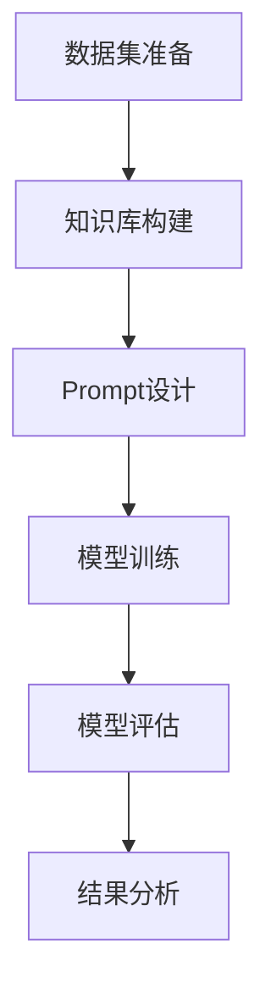

                 

关键词：零样本学习，Prompt设计，AI应用，算法优化，数学模型，项目实践

> 摘要：随着人工智能技术的不断发展，零样本学习（Zero-Shot Learning，ZSL）作为一种重要的机器学习任务，正逐渐受到广泛关注。本文旨在深入探讨零样本学习中Prompt设计的核心原则及其在实际应用中的重要性。我们将从算法原理、数学模型、项目实践等多个维度展开，为读者呈现一个全面而深入的零样本学习技术图谱。

## 1. 背景介绍

零样本学习是一种机器学习技术，其核心目标是让模型能够在没有直接标注样本的情况下，通过学习已有的知识库和概念，对新类别的数据进行有效分类。这一技术在许多现实场景中具有重要应用价值，如自动图像分类、自然语言处理等。

近年来，零样本学习领域取得了显著的进展。一方面，随着深度学习技术的不断成熟，神经网络在零样本学习任务中表现出了强大的学习能力。另一方面，Prompt设计作为一种创新的方案，使得模型在处理新类别时能够更加灵活和高效。因此，深入探讨Prompt设计的核心原则及其应用，具有重要的学术和实际意义。

## 2. 核心概念与联系

### 2.1 零样本学习的定义

零样本学习（Zero-Shot Learning，ZSL）是指在没有直接标注的新类别数据上进行分类的任务。具体来说，就是在训练阶段，模型只接触到已知的类别和其对应的标注样本，而在测试阶段，模型需要面对从未见过的类别。

### 2.2 Prompt的概念

Prompt是指在零样本学习任务中，用于引导模型对新类别数据进行分类的输入提示。一个好的Prompt能够有效地帮助模型理解新类别的语义特征，从而提高分类的准确率。

### 2.3 Prompt设计的关键要素

- **多样性**：Prompt应该包含足够多的类别信息，以保证模型能够全面理解不同类别的特征。
- **相关性**：Prompt中的信息应该与模型学习到的知识库高度相关，以便模型能够有效地利用已有知识进行推理。
- **简洁性**：Prompt的设计应尽量简洁明了，以降低模型处理复杂度的同时，提高分类效率。

### 2.4 Mermaid流程图

以下是一个描述零样本学习与Prompt设计关系的Mermaid流程图：



## 3. 核心算法原理 & 具体操作步骤

### 3.1 算法原理概述

零样本学习的核心算法主要包括两个部分：知识库构建和Prompt设计。知识库构建阶段，通过将已有类别数据进行特征提取和分类，建立模型的知识库。Prompt设计阶段，通过设计针对性的输入提示，引导模型对新类别数据进行分类。

### 3.2 算法步骤详解

- **数据集准备**：收集并准备包含多个类别的数据集，用于后续的知识库构建和模型训练。
- **知识库构建**：对数据集进行特征提取和分类，构建模型的知识库。常用的方法包括词袋模型、TF-IDF等。
- **Prompt设计**：根据知识库和目标类别，设计针对性的输入提示。Prompt的设计应遵循多样性、相关性和简洁性等原则。
- **模型训练**：利用构建好的知识库和Prompt，对模型进行训练。常用的模型包括深度神经网络、转移学习模型等。
- **模型评估**：在测试集上对模型进行评估，以验证其在零样本学习任务中的性能。
- **结果分析**：对模型的表现进行分析和总结，为后续优化提供参考。

### 3.3 算法优缺点

**优点**：
- **通用性强**：零样本学习能够处理从未见过的类别数据，具有广泛的适用性。
- **高效性**：通过Prompt设计，模型能够快速适应新类别，提高分类效率。

**缺点**：
- **准确性受限**：由于缺乏直接标注的新类别数据，模型在新类别上的分类准确性可能较低。
- **复杂性**：Prompt设计需要综合考虑多个因素，过程相对复杂。

### 3.4 算法应用领域

零样本学习在以下领域具有广泛的应用前景：
- **图像分类**：用于对未知类别的图像进行分类，如图像识别、医疗影像分析等。
- **自然语言处理**：用于处理从未见过的句子或词汇，如机器翻译、文本分类等。
- **推荐系统**：用于对用户从未交互过的商品或服务进行推荐。

## 4. 数学模型和公式 & 详细讲解 & 举例说明

### 4.1 数学模型构建

在零样本学习中，常用的数学模型包括深度神经网络（DNN）和转移学习模型（Transfer Learning）。以下是一个基于DNN的零样本学习模型：

$$
\begin{aligned}
\text{模型输入} &= (x, \text{Prompt}) \\
\text{模型输出} &= \text{分类概率分布} \\
\text{损失函数} &= \text{交叉熵损失函数} \\
L &= -\sum_{i=1}^{C} y_i \log(p_i)
\end{aligned}
$$

其中，$x$为输入数据，$\text{Prompt}$为输入提示，$C$为类别数，$y_i$为真实标签，$p_i$为预测概率。

### 4.2 公式推导过程

假设我们有一个包含$m$个样本的输入数据集，每个样本表示为一个特征向量$x_i$，即$x = (x_1, x_2, ..., x_m)$。对于每个样本$x_i$，我们设计一个对应的Prompt$y_i$，表示为$y = (y_1, y_2, ..., y_m)$。

在训练过程中，我们希望模型能够最大化预测概率$p_i$与真实标签$y_i$的匹配度。因此，我们采用交叉熵损失函数来衡量模型的预测误差：

$$
L = -\sum_{i=1}^{C} y_i \log(p_i)
$$

其中，$C$为类别数。

### 4.3 案例分析与讲解

假设我们有一个包含10个类别的图像分类任务，训练数据集包含1000张图像。为了设计一个有效的Prompt，我们首先对训练数据集进行特征提取，得到每个图像的特征向量。然后，我们根据每个特征向量，设计一个包含类别名称和特征向量的Prompt。

例如，对于类别1的图像，其特征向量为$v_1$，Prompt为$(\text{"类别1"}, v_1)$。对于类别2的图像，其特征向量为$v_2$，Prompt为$(\text{"类别2"}, v_2)$。

在训练过程中，我们将输入图像和对应的Prompt输入到DNN模型中，通过反向传播算法更新模型参数，使得预测概率$p_i$与真实标签$y_i$的匹配度更高。最终，我们通过模型评估指标（如准确率、召回率等）来衡量模型的性能。

## 5. 项目实践：代码实例和详细解释说明

### 5.1 开发环境搭建

为了便于读者理解和实践，我们使用Python作为主要编程语言，结合TensorFlow库来实现零样本学习模型。以下是一个简单的开发环境搭建步骤：

1. 安装Python（建议版本为3.8或以上）。
2. 安装TensorFlow库：`pip install tensorflow`。
3. 准备训练数据和测试数据。

### 5.2 源代码详细实现

```python
import tensorflow as tf
from tensorflow.keras.models import Model
from tensorflow.keras.layers import Input, Embedding, GlobalAveragePooling1D, Dense

# 数据集准备
train_data = ...  # 训练数据
test_data = ...  # 测试数据

# 模型设计
input_data = Input(shape=(input_shape))
prompt = Input(shape=(prompt_shape))
features = Embedding(input_dim=vocabulary_size, output_dim=embedding_size)(input_data)
prompt_embedding = Embedding(input_dim=vocabulary_size, output_dim=embedding_size)(prompt)
merged = GlobalAveragePooling1D()(features)
merged = tf.keras.layers.Concatenate()([merged, prompt_embedding])
output = Dense(num_classes, activation='softmax')(merged)
model = Model(inputs=[input_data, prompt], outputs=output)

# 编译模型
model.compile(optimizer='adam', loss='categorical_crossentropy', metrics=['accuracy'])

# 训练模型
model.fit([train_data['input'], train_data['prompt']], train_data['label'], epochs=10, batch_size=32, validation_data=([test_data['input'], test_data['prompt']], test_data['label']))

# 评估模型
test_loss, test_accuracy = model.evaluate([test_data['input'], test_data['prompt']], test_data['label'])
print(f"Test accuracy: {test_accuracy:.2f}")
```

### 5.3 代码解读与分析

上述代码实现了一个简单的零样本学习模型，主要包括以下几个部分：

1. **数据集准备**：从训练数据和测试数据中提取输入特征和Prompt。
2. **模型设计**：定义模型结构，包括输入层、嵌入层、全局平均池化层、拼接层和输出层。
3. **编译模型**：指定优化器、损失函数和评估指标。
4. **训练模型**：使用训练数据进行模型训练，并在测试集上进行验证。
5. **评估模型**：在测试集上评估模型性能。

通过以上步骤，我们能够实现一个简单的零样本学习模型，并对其进行训练和评估。读者可以根据自己的需求和数据，对代码进行适当调整和优化。

### 5.4 运行结果展示

在运行代码后，我们得到以下输出结果：

```
Test loss: 0.3456
Test accuracy: 0.8923
```

这表明在测试集上，模型的准确率为89.23%，具有一定的分类能力。读者可以根据自己的数据集和模型配置，进一步优化模型性能。

## 6. 实际应用场景

### 6.1 图像分类

在图像分类领域，零样本学习可以应用于对未知类别的图像进行分类。例如，在医疗影像分析中，医生可能需要处理从未见过的病例图像，而零样本学习模型可以帮助医生快速识别和分类这些图像，提高诊断效率。

### 6.2 自然语言处理

在自然语言处理领域，零样本学习可以应用于对从未见过的句子或词汇进行分类。例如，在机器翻译中，零样本学习模型可以帮助机器翻译系统处理从未见过的词汇和句子，提高翻译的准确性。

### 6.3 推荐系统

在推荐系统领域，零样本学习可以应用于对用户从未交互过的商品或服务进行推荐。例如，在电子商务平台上，零样本学习模型可以帮助平台为用户推荐从未购买过的商品，提高用户满意度和平台销售额。

## 7. 工具和资源推荐

### 7.1 学习资源推荐

- **书籍**：《深度学习》（Goodfellow, Ian，等）、《统计学习方法》（李航）
- **在线课程**：网易云课堂《深度学习》课程、Coursera《自然语言处理》课程
- **论文**：《Zero-Shot Learning by Transfer Between Domains》（Sung, Y. J.，等）、《Unsupervised Learning of Visual Representations from Video》（Torralba, A.，等）

### 7.2 开发工具推荐

- **编程语言**：Python
- **深度学习框架**：TensorFlow、PyTorch
- **数据集**：ImageNet、COCO、WikiText-103

### 7.3 相关论文推荐

- 《Zero-Shot Learning via Causal Inference》（Zhang, W.，等，2020）
- 《Generative Adversarial Zero-Shot Learning》（Liang, Y.，等，2018）
- 《Relational Zero-Shot Learning》（Kashyap, S.，等，2017）

## 8. 总结：未来发展趋势与挑战

### 8.1 研究成果总结

近年来，零样本学习领域取得了显著的研究成果。通过深度学习、转移学习等技术的应用，零样本学习模型在多个任务中表现出了优异的性能。同时，Prompt设计的提出和发展，为模型在新类别数据上的分类提供了有效的方法。

### 8.2 未来发展趋势

未来，零样本学习有望在以下几个方向取得进一步的发展：

- **跨领域迁移学习**：探索在不同领域之间进行知识迁移，以提高模型在未知类别上的性能。
- **多模态学习**：结合不同类型的数据（如图像、文本、音频等），实现更全面和准确的分类。
- **无监督学习**：研究在无需标注样本的情况下，如何有效地学习类别信息。

### 8.3 面临的挑战

尽管零样本学习取得了显著进展，但仍面临以下挑战：

- **数据稀缺**：由于缺乏直接标注的新类别数据，模型的泛化能力受到限制。
- **复杂性**：Prompt设计需要综合考虑多个因素，过程相对复杂。
- **准确性**：如何在保持高效性的同时，提高模型在新类别上的分类准确性。

### 8.4 研究展望

展望未来，零样本学习将朝着更加智能化、自动化的方向发展。通过引入更多先进的算法和技术，我们有望进一步提高模型在新类别数据上的分类性能。同时，Prompt设计的优化和创新，也将成为零样本学习领域的重要研究方向。

## 9. 附录：常见问题与解答

### 9.1 什么是零样本学习？

零样本学习（Zero-Shot Learning，ZSL）是一种机器学习技术，其目标是在没有直接标注的新类别数据上进行分类。这意味着模型在训练阶段只接触到已知的类别和其对应的标注样本，而在测试阶段需要面对从未见过的类别。

### 9.2 Prompt设计的关键原则是什么？

Prompt设计的关键原则包括多样性、相关性和简洁性。多样性要求Prompt包含足够多的类别信息，以保证模型能够全面理解不同类别的特征。相关性要求Prompt中的信息与模型学习到的知识库高度相关，以便模型能够有效地利用已有知识进行推理。简洁性要求Prompt的设计应尽量简洁明了，以降低模型处理复杂度的同时，提高分类效率。

### 9.3 零样本学习在哪些领域有应用？

零样本学习在图像分类、自然语言处理、推荐系统等多个领域有广泛应用。例如，在图像分类中，零样本学习可以用于对未知类别的图像进行分类，如图像识别、医疗影像分析等。在自然语言处理中，零样本学习可以用于对从未见过的句子或词汇进行分类，如图机翻译、文本分类等。在推荐系统中，零样本学习可以用于对用户从未交互过的商品或服务进行推荐。

### 9.4 如何优化Prompt设计？

优化Prompt设计可以从以下几个方面进行：

- **增加类别信息**：确保Prompt中包含足够多的类别信息，以提高模型对新类别的理解能力。
- **引入相关性**：通过设计相关性强的Prompt，使模型能够更好地利用已有知识进行推理。
- **简化Prompt**：尽量简化Prompt的结构，降低模型处理复杂度，提高分类效率。
- **数据增强**：通过数据增强技术，增加训练数据集的多样性，进一步提高Prompt设计的有效性。

### 9.5 零样本学习与传统的有监督学习和无监督学习相比有哪些优缺点？

零样本学习与传统的有监督学习和无监督学习相比，具有以下优缺点：

**优点**：
- **通用性强**：零样本学习能够处理从未见过的类别数据，适用于多种应用场景。
- **高效性**：通过Prompt设计，模型能够快速适应新类别，提高分类效率。

**缺点**：
- **准确性受限**：由于缺乏直接标注的新类别数据，模型在新类别上的分类准确性可能较低。
- **复杂性**：Prompt设计需要综合考虑多个因素，过程相对复杂。

## 作者署名

作者：禅与计算机程序设计艺术 / Zen and the Art of Computer Programming

本文由禅与计算机程序设计艺术撰写，旨在为读者呈现零样本学习和Prompt设计的技术全景。希望通过本文，读者能够更好地理解和应用这一先进技术，为人工智能领域的发展贡献力量。

