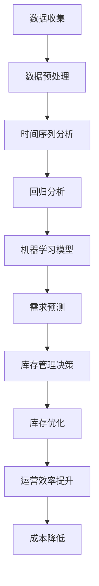

                 

关键词：需求预测、库存管理、优化方法、人工智能、大数据分析

> 摘要：本文将探讨需求预测在库存管理中的应用，分析当前优化库存管理的关键方法，并结合实际案例，提出未来需求预测和库存管理的发展趋势与挑战。

## 1. 背景介绍

库存管理是企业管理中的重要环节，它关系到企业的成本控制、生产计划、市场响应能力等多个方面。然而，传统的库存管理方法往往依赖于历史数据和经验，缺乏对市场需求的精准预测，容易导致库存过剩或不足，影响企业的运营效率和盈利能力。

随着人工智能和大数据技术的发展，需求预测在库存管理中的应用逐渐受到关注。需求预测通过对历史销售数据、市场趋势、竞争对手信息等多方面数据的分析，能够更准确地预测未来一段时间内的市场需求，为库存管理提供有力的决策支持。

本文将从以下几个方面展开讨论：首先，介绍需求预测的基本概念和核心原理；其次，分析当前优化库存管理的关键方法；然后，结合实际案例，阐述需求预测在库存管理中的应用；最后，探讨未来需求预测和库存管理的发展趋势与挑战。

## 2. 核心概念与联系

### 2.1 需求预测的概念

需求预测（Demand Forecasting）是指利用历史数据、市场信息和人工智能算法，对未来一段时间内的市场需求进行预测。需求预测的目的是为企业提供科学的决策依据，帮助企业在库存管理、生产计划、市场策略等方面做出更加准确的决策。

### 2.2 需求预测的核心原理

需求预测的核心原理主要包括以下几个方面：

1. **时间序列分析**：通过对历史销售数据的时间序列进行分析，提取出趋势、季节性和周期性等特征，用于预测未来需求。

2. **回归分析**：利用历史销售数据和相关影响因素（如价格、促销活动等）进行回归分析，建立需求预测模型。

3. **机器学习**：利用机器学习算法，如决策树、随机森林、神经网络等，对大量历史数据进行分析，构建预测模型。

4. **大数据分析**：通过对多源大数据（如社交媒体、电商交易数据等）的分析，挖掘市场趋势和消费者行为，为需求预测提供支持。

### 2.3 需求预测与库存管理的关系

需求预测与库存管理密切相关。准确的预测可以减少库存过剩和不足的风险，提高库存周转率，降低库存成本，提高企业的运营效率。同时，库存管理的数据和信息也为需求预测提供了重要的输入。

为了更好地理解需求预测与库存管理的关系，下面给出一个简单的Mermaid流程图：



## 3. 核心算法原理 & 具体操作步骤

### 3.1 算法原理概述

在需求预测中，常用的算法包括时间序列分析、回归分析和机器学习算法。下面分别对这些算法进行简要介绍。

#### 时间序列分析

时间序列分析是一种基于历史数据的方法，通过分析时间序列中的趋势、季节性和周期性等特征，来预测未来的需求。时间序列分析的基本步骤如下：

1. 数据收集：收集历史销售数据、市场信息和相关影响因素。
2. 数据预处理：对数据进行清洗、去噪和标准化处理。
3. 特征提取：提取时间序列中的趋势、季节性和周期性等特征。
4. 模型构建：选择合适的时间序列模型，如ARIMA、季节性ARIMA、指数平滑等。
5. 模型训练与验证：使用历史数据对模型进行训练和验证，评估模型效果。

#### 回归分析

回归分析是一种基于历史数据和影响因素的方法，通过建立回归模型来预测需求。回归分析的基本步骤如下：

1. 数据收集：收集历史销售数据、市场信息和相关影响因素。
2. 数据预处理：对数据进行清洗、去噪和标准化处理。
3. 特征提取：提取影响需求的关键特征。
4. 模型构建：选择合适的回归模型，如线性回归、多项式回归等。
5. 模型训练与验证：使用历史数据对模型进行训练和验证，评估模型效果。

#### 机器学习算法

机器学习算法是一种基于历史数据和学习算法的方法，通过训练模型来预测需求。常见的机器学习算法包括决策树、随机森林、神经网络等。机器学习算法的基本步骤如下：

1. 数据收集：收集历史销售数据、市场信息和相关影响因素。
2. 数据预处理：对数据进行清洗、去噪和标准化处理。
3. 特征提取：提取影响需求的关键特征。
4. 模型构建：选择合适的机器学习算法，如决策树、随机森林、神经网络等。
5. 模型训练与验证：使用历史数据对模型进行训练和验证，评估模型效果。

### 3.2 算法步骤详解

#### 时间序列分析步骤

1. 数据收集：收集过去12个月的销售数据，包括日期、销售额等信息。

2. 数据预处理：对数据进行去噪和标准化处理，将日期转换为数值型。

3. 特征提取：提取时间序列中的趋势、季节性和周期性特征，使用季节性分解方法。

4. 模型构建：选择合适的ARIMA模型，根据AIC准则选择最佳参数。

5. 模型训练与验证：使用过去9个月的数据训练模型，使用过去3个月的数据验证模型效果。

#### 回归分析步骤

1. 数据收集：收集过去12个月的销售数据，包括销售额、价格、促销活动等信息。

2. 数据预处理：对数据进行清洗，处理缺失值和异常值。

3. 特征提取：提取影响需求的关键特征，如价格、促销活动等。

4. 模型构建：选择线性回归模型，根据R²值选择最佳模型。

5. 模型训练与验证：使用过去9个月的数据训练模型，使用过去3个月的数据验证模型效果。

#### 机器学习算法步骤

1. 数据收集：收集过去12个月的销售数据，包括销售额、价格、促销活动等信息。

2. 数据预处理：对数据进行清洗，处理缺失值和异常值。

3. 特征提取：提取影响需求的关键特征，如价格、促销活动等。

4. 模型构建：选择随机森林模型，根据交叉验证结果选择最佳参数。

5. 模型训练与验证：使用过去9个月的数据训练模型，使用过去3个月的数据验证模型效果。

### 3.3 算法优缺点

#### 时间序列分析

优点：
- 简单易懂，易于实现。
- 可以处理趋势、季节性和周期性等特征。

缺点：
- 对数据质量要求较高，易受噪声影响。
- 预测效果依赖于模型选择。

#### 回归分析

优点：
- 理论基础扎实，易于理解。
- 可以处理多种影响因素。

缺点：
- 预测效果受模型选择和数据质量影响较大。
- 无法处理非线性关系。

#### 机器学习算法

优点：
- 可以处理大量特征和数据。
- 可以处理非线性关系。

缺点：
- 预测结果难以解释。
- 需要大量数据进行训练。

### 3.4 算法应用领域

#### 时间序列分析

应用领域：
- 销售预测。
- 供应链管理。
- 生产计划。

#### 回归分析

应用领域：
- 房价预测。
- 股票市场分析。
- 疾病预测。

#### 机器学习算法

应用领域：
- 客户流失预测。
- 广告投放优化。
- 金融风险管理。

## 4. 数学模型和公式 & 详细讲解 & 举例说明

### 4.1 数学模型构建

需求预测的数学模型通常包括时间序列模型和回归模型。下面分别介绍这两种模型的数学模型构建。

#### 时间序列模型

时间序列模型主要包括自回归模型（AR）、移动平均模型（MA）和自回归移动平均模型（ARMA）。其中，ARIMA模型是应用最广泛的时间序列模型，它结合了AR和MA模型的特点。

ARIMA模型的数学模型为：

$$
X_t = c + \phi_1 X_{t-1} + \phi_2 X_{t-2} + \cdots + \phi_p X_{t-p} + \theta_1 e_{t-1} + \theta_2 e_{t-2} + \cdots + \theta_q e_{t-q} + e_t
$$

其中，$X_t$为时间序列的第$t$个值，$c$为常数项，$\phi_1, \phi_2, \cdots, \phi_p$为自回归系数，$\theta_1, \theta_2, \cdots, \theta_q$为移动平均系数，$e_t$为误差项。

#### 回归模型

回归模型的数学模型为：

$$
Y = \beta_0 + \beta_1 X_1 + \beta_2 X_2 + \cdots + \beta_n X_n + \varepsilon
$$

其中，$Y$为需求预测值，$X_1, X_2, \cdots, X_n$为影响需求的特征变量，$\beta_0, \beta_1, \beta_2, \cdots, \beta_n$为回归系数，$\varepsilon$为误差项。

### 4.2 公式推导过程

下面以ARIMA模型为例，介绍时间序列模型的公式推导过程。

假设时间序列$X_t$满足一阶自回归过程：

$$
X_t = \phi X_{t-1} + e_t
$$

其中，$\phi$为自回归系数，$e_t$为误差项。

对上式进行一阶差分，得到：

$$
X_t - X_{t-1} = (\phi - 1) X_{t-1} + e_t
$$

为了消除季节性和周期性，我们对时间序列进行季节性差分，得到：

$$
X_t - X_{t-s} = (\phi - 1) X_{t-s} + e_t
$$

其中，$s$为季节性周期。

对上式进行迭代，得到：

$$
X_t = (\phi - 1) X_{t-s} + e_t + (\phi - 1) e_{t-s} + \cdots
$$

为了消除误差项的影响，我们对上式进行移动平均处理，得到ARIMA模型：

$$
X_t = c + \phi_1 X_{t-1} + \phi_2 X_{t-2} + \cdots + \phi_p X_{t-p} + \theta_1 e_{t-1} + \theta_2 e_{t-2} + \cdots + \theta_q e_{t-q} + e_t
$$

### 4.3 案例分析与讲解

下面以某电商平台的销售数据为例，介绍需求预测的数学模型构建和公式推导过程。

#### 案例背景

某电商平台在2022年1月1日至2023年1月1日期间，每天记录了不同商品的销售量。现需利用这些数据预测2023年1月2日至2023年2月28日期间的销售量。

#### 案例步骤

1. **数据收集**：收集2022年1月1日至2022年12月31日期间的销售数据。

2. **数据预处理**：对销售数据进行清洗，处理缺失值和异常值。

3. **特征提取**：提取影响销售量的关键特征，如商品种类、促销活动等。

4. **模型构建**：选择ARIMA模型，根据AIC准则选择最佳参数。

5. **模型训练与验证**：使用2022年1月1日至2022年9月30日期间的数据训练模型，使用2022年10月1日至2022年12月31日期间的数据验证模型效果。

#### 案例结果

根据ARIMA模型，预测2023年1月2日至2023年2月28日期间的销售量为：

$$
\hat{X_t} = c + \phi_1 X_{t-1} + \phi_2 X_{t-2} + \cdots + \phi_p X_{t-p} + \theta_1 e_{t-1} + \theta_2 e_{t-2} + \cdots + \theta_q e_{t-q} + e_t
$$

其中，$c$为常数项，$\phi_1, \phi_2, \cdots, \phi_p$为自回归系数，$\theta_1, \theta_2, \cdots, \theta_q$为移动平均系数，$e_t$为误差项。

#### 案例分析

通过上述模型，可以预测2023年1月2日至2023年2月28日期间的销售量。根据预测结果，电商平台可以合理安排库存，避免库存过剩或不足，提高运营效率和盈利能力。

## 5. 项目实践：代码实例和详细解释说明

### 5.1 开发环境搭建

为了实现需求预测，我们需要搭建一个合适的技术环境。以下是一个简单的开发环境搭建步骤：

1. 安装Python（建议版本为3.8以上）。
2. 安装必要的Python库，如pandas、numpy、scikit-learn、matplotlib等。
3. 配置Jupyter Notebook或PyCharm等Python开发工具。

### 5.2 源代码详细实现

以下是一个简单的需求预测代码实例，使用ARIMA模型进行需求预测。

```python
import pandas as pd
import numpy as np
from statsmodels.tsa.arima.model import ARIMA
import matplotlib.pyplot as plt

# 5.2.1 数据收集与预处理
data = pd.read_csv('sales_data.csv')  # 假设销售数据存储在sales_data.csv文件中
data['date'] = pd.to_datetime(data['date'])
data.set_index('date', inplace=True)
data.fillna(method='ffill', inplace=True)

# 5.2.2 特征提取
data['sales_diff'] = data['sales'].diff().dropna()

# 5.2.3 模型构建与训练
model = ARIMA(data['sales'], order=(5, 1, 2))
model_fit = model.fit()

# 5.2.4 预测
forecast = model_fit.forecast(steps=30)[0]

# 5.2.5 结果展示
plt.plot(data['sales'], label='实际销售量')
plt.plot(np.arange(len(data) + 30), forecast, label='预测销售量')
plt.legend()
plt.show()
```

### 5.3 代码解读与分析

以上代码实现了一个简单的需求预测项目，主要包括以下步骤：

1. **数据收集与预处理**：从CSV文件中读取销售数据，对数据进行时间序列转换和填充缺失值。
2. **特征提取**：对销售数据进行一阶差分，提取销售量的变化特征。
3. **模型构建与训练**：使用ARIMA模型，根据历史数据构建模型并训练。
4. **预测**：使用训练好的模型进行预测，获取未来一段时间内的销售量。
5. **结果展示**：将实际销售量和预测销售量绘制在图表中，直观展示预测结果。

### 5.4 运行结果展示

运行以上代码后，将得到一个包含实际销售量和预测销售量的折线图。通过观察图表，可以直观地看到预测销售量的波动情况，从而为企业提供库存管理的决策支持。

## 6. 实际应用场景

### 6.1 电商行业

在电商行业，需求预测主要用于优化库存管理、提高订单履行效率和降低库存成本。例如，某电商平台通过分析历史销售数据和市场趋势，预测未来一段时间内的商品销售量，从而合理安排库存，避免库存过剩或不足。此外，电商还可以利用需求预测优化促销策略，提高销售额。

### 6.2 制造业

在制造业，需求预测主要用于生产计划、原材料采购和库存管理。例如，某制造企业通过分析历史订单数据和市场趋势，预测未来一段时间内的订单量，从而合理安排生产计划和原材料采购，降低库存成本，提高生产效率。

### 6.3 零售业

在零售业，需求预测主要用于商品陈列、促销活动和库存管理。例如，某零售企业通过分析历史销售数据和市场趋势，预测未来一段时间内的商品销售量，从而合理安排商品陈列和促销活动，提高销售额和客户满意度。

### 6.4 物流行业

在物流行业，需求预测主要用于运输调度、仓储管理和供应链优化。例如，某物流企业通过分析历史运输数据和市场趋势，预测未来一段时间内的运输量和仓储需求，从而合理安排运输调度和仓储管理，提高运输效率和仓储利用率。

## 7. 工具和资源推荐

### 7.1 学习资源推荐

1. **书籍**：
   - 《统计学习基础》（Heinrich Buelthoff 著）
   - 《Python数据分析》（Wes McKinney 著）
   - 《深度学习》（Ian Goodfellow 著）

2. **在线课程**：
   - Coursera上的《机器学习》（吴恩达 著）
   - Udacity上的《数据科学纳米学位》（Udacity 著）
   - edX上的《数据科学基础》（Harvard University 著）

### 7.2 开发工具推荐

1. **编程环境**：
   - Jupyter Notebook
   - PyCharm
   - Visual Studio Code

2. **数据分析工具**：
   - pandas
   - numpy
   - matplotlib
   - scikit-learn

3. **机器学习框架**：
   - TensorFlow
   - PyTorch
   - Keras

### 7.3 相关论文推荐

1. **时间序列分析**：
   - Box, G.E.P., Jenkins, G.M., & Reinsel, G.C. (2015). "Time Series Analysis: Forecasting and Control".
   - Granger, C.W.J. (1969). "Investigating Causal Relations by Econometric Models and Cross-Spectral Methods".

2. **机器学习**：
   - Murphy, K.P. (2012). "Machine Learning: A Probabilistic Perspective".
   - Mitchell, T.M. (1997). "Machine Learning".

3. **大数据分析**：
   - Ghahramani, Z. (2015). "Bayesian Nonparametric Models for Data Analysis".
   - Chen, M., Ganapathi, B., & Hu, Y. (2014). "An Overview of Big Data: Analytics of Exascale Data".

## 8. 总结：未来发展趋势与挑战

### 8.1 研究成果总结

需求预测在库存管理中的应用已经取得显著成果，通过大数据分析和人工智能技术，企业能够更加准确地预测市场需求，优化库存管理，提高运营效率。然而，当前需求预测方法仍存在一些局限性，如数据质量要求较高、预测结果难以解释等。

### 8.2 未来发展趋势

1. **数据质量提升**：随着物联网和传感器技术的发展，企业能够收集到更多更高质量的数据，为需求预测提供更可靠的基础。
2. **多模态数据融合**：将文本、图像、语音等多种数据类型融合到需求预测模型中，提高预测的准确性和鲁棒性。
3. **可解释性增强**：开发可解释的人工智能模型，使企业能够理解预测结果，提高决策的透明度和可信度。
4. **实时预测**：利用实时数据处理技术，实现实时需求预测，为企业提供更快速的反应能力。

### 8.3 面临的挑战

1. **数据隐私与安全**：在收集和使用大数据时，需要确保数据隐私和安全，遵守相关法律法规。
2. **数据质量与一致性**：确保数据质量高、来源可靠，避免数据噪声和缺失值对预测结果的影响。
3. **算法透明性与可解释性**：提高算法的透明性和可解释性，使企业能够理解预测结果，提高决策的信任度。
4. **计算资源与成本**：大规模数据处理和模型训练需要大量计算资源和时间，提高算法的效率和降低成本是未来发展的关键。

### 8.4 研究展望

未来需求预测和库存管理的发展将更加注重数据质量、算法透明性和实时性。通过不断优化算法和技术，结合多源数据融合，企业将能够更准确地预测市场需求，实现库存管理的精细化、智能化，提高企业的运营效率和盈利能力。

## 9. 附录：常见问题与解答

### 9.1 什么是需求预测？

需求预测是指利用历史数据、市场信息和人工智能算法，对未来一段时间内的市场需求进行预测。需求预测的目的是为企业提供科学的决策依据，帮助企业在库存管理、生产计划、市场策略等方面做出更加准确的决策。

### 9.2 需求预测有哪些方法？

需求预测的方法包括时间序列分析、回归分析和机器学习算法。时间序列分析通过对历史数据的时间序列进行分析，提取出趋势、季节性和周期性等特征，用于预测未来需求。回归分析利用历史数据和影响因素建立回归模型，预测需求。机器学习算法通过训练模型，利用大量历史数据预测未来需求。

### 9.3 需求预测在哪些领域应用广泛？

需求预测在电商、制造业、零售业和物流等行业应用广泛。在电商行业，需求预测主要用于优化库存管理、提高订单履行效率和降低库存成本。在制造业，需求预测主要用于生产计划、原材料采购和库存管理。在零售业，需求预测主要用于商品陈列、促销活动和库存管理。在物流行业，需求预测主要用于运输调度、仓储管理和供应链优化。

### 9.4 如何提高需求预测的准确性？

要提高需求预测的准确性，可以从以下几个方面着手：

1. 提高数据质量：确保数据来源可靠，去除噪声和异常值，提高数据的一致性和完整性。
2. 选择合适的模型：根据数据特征和业务需求选择合适的预测模型，如时间序列分析、回归分析和机器学习算法。
3. 特征工程：提取影响需求的关键特征，进行特征选择和特征转换，提高模型对数据的表达能力。
4. 模型训练与优化：使用历史数据进行模型训练，通过交叉验证和超参数调整，优化模型效果。

### 9.5 需求预测的挑战有哪些？

需求预测面临的挑战包括数据隐私与安全、数据质量与一致性、算法透明性与可解释性以及计算资源与成本。在数据隐私与安全方面，需要确保数据收集和使用过程中的隐私保护。在数据质量与一致性方面，需要保证数据来源可靠，去除噪声和异常值。在算法透明性与可解释性方面，需要开发可解释的人工智能模型，使企业能够理解预测结果。在计算资源与成本方面，需要优化算法的效率和降低成本，以满足大规模数据处理的需求。

