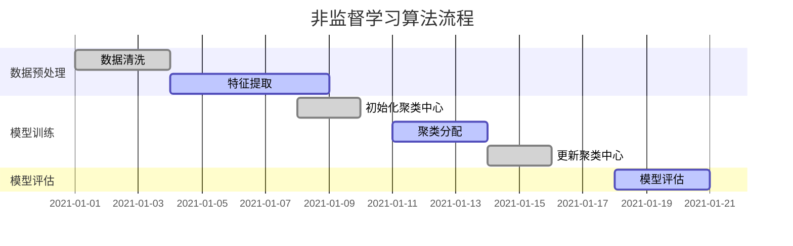

                 

关键词：非监督学习，大模型训练，数据隐私，自动化，神经网络，算法优化

> 摘要：随着深度学习的快速发展，大模型训练在各个领域得到了广泛应用。然而，数据隐私和计算资源的限制成为了大模型训练的瓶颈。本文将探讨非监督学习在大模型训练中的作用，通过介绍其核心概念、算法原理和应用领域，旨在为研究人员和工程师提供有价值的参考。

## 1. 背景介绍

近年来，深度学习（Deep Learning）在计算机视觉、自然语言处理、语音识别等领域取得了显著的成果。这些成果背后是大量数据和强大计算能力的支持。特别是大模型（Large Models），如BERT、GPT、ViT等，凭借其卓越的性能，成为了各领域研究的热点。然而，大模型训练面临着数据隐私和计算资源等方面的挑战。

### 1.1 大模型训练的数据隐私问题

大模型训练需要大量的数据作为输入，这些数据往往包含敏感信息，如个人隐私、公司机密等。在数据隐私保护法规日益严格的背景下，如何在大模型训练过程中保护数据隐私成为一个亟待解决的问题。

### 1.2 大模型训练的计算资源问题

大模型训练需要大量的计算资源和时间。特别是在训练初期，模型参数众多，计算量巨大。此外，深度学习模型在训练过程中容易过拟合，导致训练效果不佳。如何优化算法，提高训练效率，也是一个重要问题。

### 1.3 非监督学习的作用

非监督学习（Unsupervised Learning）是一种无需标签数据的机器学习方法。它通过自动从数据中学习特征，为解决大模型训练中的数据隐私和计算资源问题提供了一种新的思路。

## 2. 核心概念与联系

### 2.1 非监督学习的核心概念

非监督学习主要包括以下几种方法：

- **聚类（Clustering）**：将数据分为多个类别，使同一类别内的数据相似度较高，不同类别之间的数据相似度较低。
- **降维（Dimensionality Reduction）**：将高维数据映射到低维空间，减少数据维度，提高计算效率。
- **生成模型（Generative Models）**：通过学习数据的分布，生成新的数据样本。

### 2.2 非监督学习的架构

非监督学习的架构通常包括以下几个部分：

- **数据预处理**：清洗数据，去除噪声，使数据符合训练要求。
- **特征提取**：从原始数据中提取有用的特征，为后续训练提供输入。
- **模型训练**：通过优化算法，调整模型参数，使模型能够更好地拟合数据。
- **模型评估**：评估模型性能，判断模型是否达到预期效果。

### 2.3 非监督学习与监督学习的联系

非监督学习与监督学习（Supervised Learning）有着紧密的联系。在监督学习中，模型通过学习标注数据，预测未知数据的标签。而在非监督学习中，模型需要从无标签数据中学习特征，为后续的监督学习提供支持。换句话说，非监督学习可以看作是监督学习的一种特殊形式。

## 3. 核心算法原理 & 具体操作步骤

### 3.1 算法原理概述

非监督学习算法的核心原理是自动从数据中学习特征，从而实现数据的分类、降维或生成。具体来说，非监督学习算法可以分为以下几种类型：

- **基于聚类的方法**：如K-means、DBSCAN等，通过计算数据点之间的相似度，将数据分为多个类别。
- **基于降维的方法**：如PCA（Principal Component Analysis）、t-SNE（t-Distributed Stochastic Neighbor Embedding）等，通过将高维数据映射到低维空间，减少数据维度。
- **基于生成模型的方法**：如GAN（Generative Adversarial Networks）、VAE（Variational Autoencoder）等，通过学习数据的分布，生成新的数据样本。

### 3.2 算法步骤详解

非监督学习算法的具体操作步骤如下：

1. **数据预处理**：清洗数据，去除噪声，使数据符合训练要求。
2. **特征提取**：从原始数据中提取有用的特征，为后续训练提供输入。
3. **模型训练**：
   - **基于聚类的方法**：初始化聚类中心，计算数据点与聚类中心的相似度，将数据点归为相应的类别。
   - **基于降维的方法**：计算数据的协方差矩阵，将其分解为特征值和特征向量，选择主成分进行降维。
   - **基于生成模型的方法**：训练生成器和判别器，使生成器能够生成与真实数据相似的数据，判别器能够区分真实数据和生成数据。
4. **模型评估**：评估模型性能，判断模型是否达到预期效果。

### 3.3 算法优缺点

非监督学习算法具有以下优缺点：

- **优点**：
  - 无需标签数据，适用于无标签数据的场景。
  - 可以自动发现数据中的隐含结构和规律。
  - 可以提高数据隐私性，减少对敏感数据的依赖。
- **缺点**：
  - 模型性能受到初始参数选择的影响，需要多次尝试。
  - 可能会陷入局部最优，导致训练效果不佳。

### 3.4 算法应用领域

非监督学习算法在以下领域有广泛应用：

- **数据挖掘**：用于发现数据中的隐含结构和规律，如聚类分析、降维分析等。
- **计算机视觉**：用于图像识别、图像分类等，如GAN、VAE等生成模型。
- **自然语言处理**：用于文本分类、情感分析等，如Word2Vec、GloVe等词向量模型。

## 4. 数学模型和公式 & 详细讲解 & 举例说明

### 4.1 数学模型构建

非监督学习算法的数学模型主要包括聚类、降维和生成模型三种类型。

1. **聚类模型**：

假设有n个数据点，每个数据点由d个特征组成。聚类模型的目标是找到k个聚类中心，将数据点分配到不同的类别。

   - 聚类中心选择：选择初始聚类中心，如K-means中的随机初始化。
   - 聚类分配：计算每个数据点与聚类中心的相似度，将数据点分配到最相似的聚类中心。

2. **降维模型**：

降维模型的目标是将高维数据映射到低维空间，同时保留数据的主要特征。

   - 主成分分析（PCA）：计算数据的协方差矩阵，将其分解为特征值和特征向量，选择主成分进行降维。
   - t-SNE：计算数据之间的相似度，将高维数据映射到二维或三维空间。

3. **生成模型**：

生成模型的目标是学习数据的分布，生成新的数据样本。

   - GAN：训练生成器和判别器，使生成器能够生成与真实数据相似的数据，判别器能够区分真实数据和生成数据。
   - VAE：通过编码器和解码器学习数据的分布，生成新的数据样本。

### 4.2 公式推导过程

以下是几种常见的非监督学习算法的数学公式推导。

1. **K-means算法**：

   - 初始化聚类中心：选择初始聚类中心，如随机初始化。
   - 聚类分配：计算每个数据点与聚类中心的相似度，将数据点分配到最相似的聚类中心。
   - 更新聚类中心：计算每个聚类中心的新位置，即每个聚类中心所包含的数据点的平均值。

2. **PCA算法**：

   - 计算协方差矩阵：计算数据点的协方差矩阵。
   - 协方差矩阵分解：将协方差矩阵分解为特征值和特征向量。
   - 选择主成分：选择特征值最大的特征向量作为主成分。

3. **t-SNE算法**：

   - 计算相似度：计算数据点之间的相似度。
   - 构建相似度矩阵：将相似度矩阵转化为对角矩阵。
   - 映射到低维空间：将高维数据映射到低维空间，使相似度较大的数据点在低维空间中仍然保持相似。

### 4.3 案例分析与讲解

以下是几个非监督学习算法的案例分析。

1. **K-means算法在图像分类中的应用**：

   - 数据集：MNIST手写数字数据集。
   - 目标：将手写数字图像分为10个类别。
   - 实现步骤：
     1. 初始化聚类中心，如随机初始化。
     2. 计算每个图像与聚类中心的相似度，将图像分配到最相似的聚类中心。
     3. 更新聚类中心，计算每个聚类中心所包含的图像的平均值。
     4. 重复步骤2和3，直到聚类中心不再发生显著变化。

   - 结果：通过K-means算法，可以将手写数字图像分为10个类别，准确率较高。

2. **PCA算法在数据降维中的应用**：

   - 数据集：20个不同类别的人脸图像。
   - 目标：将人脸图像从20个特征降维到2个特征。
   - 实现步骤：
     1. 计算人脸图像的协方差矩阵。
     2. 将协方差矩阵分解为特征值和特征向量。
     3. 选择特征值最大的特征向量作为主成分。
     4. 将人脸图像映射到2个特征空间。

   - 结果：通过PCA算法，可以将人脸图像从20个特征降维到2个特征，同时保留主要特征。

3. **t-SNE算法在数据可视化中的应用**：

   - 数据集：Iris数据集，包含3个类别，每个类别有50个样本。
   - 目标：将Iris数据集映射到2维空间，使相同类别的样本在低维空间中靠近。
   - 实现步骤：
     1. 计算Iris数据点之间的相似度。
     2. 将相似度矩阵转化为对角矩阵。
     3. 将Iris数据点映射到2维空间。

   - 结果：通过t-SNE算法，可以将Iris数据集映射到2维空间，使相同类别的样本在低维空间中靠近，易于区分。

## 5. 项目实践：代码实例和详细解释说明

### 5.1 开发环境搭建

以下是使用Python和Scikit-learn库实现非监督学习算法的开发环境搭建步骤。

1. 安装Python：从官网下载并安装Python，版本建议为3.8或以上。
2. 安装Scikit-learn：打开命令行，执行以下命令安装Scikit-learn库：
   ```bash
   pip install scikit-learn
   ```

### 5.2 源代码详细实现

以下是一个使用K-means算法进行图像分类的Python代码实例。

```python
import numpy as np
from sklearn.cluster import KMeans
from sklearn.datasets import load_digits
import matplotlib.pyplot as plt

# 加载数据集
digits = load_digits()
X = digits.data

# 使用K-means算法进行图像分类
kmeans = KMeans(n_clusters=10, random_state=42)
kmeans.fit(X)

# 预测图像类别
labels = kmeans.predict(X)

# 绘制图像和对应的类别
fig, axes = plt.subplots(2, 5, figsize=(10, 4))
for i, ax in enumerate(axes.flat):
    ax.imshow(X[i].reshape(8, 8), cmap='gray')
    ax.set_title(f'Class {labels[i]}')
plt.show()
```

### 5.3 代码解读与分析

1. **加载数据集**：使用Scikit-learn库中的digits数据集，包含0到9的数字图像。
2. **使用K-means算法进行图像分类**：初始化K-means算法，设置聚类数为10，随机种子为42，进行模型训练。
3. **预测图像类别**：使用训练好的K-means模型，预测图像的类别。
4. **绘制图像和对应的类别**：使用matplotlib库绘制每个图像及其对应的类别。

### 5.4 运行结果展示

运行上述代码后，将显示一个包含10个图像的子图，每个图像代表一个类别。通过观察图像，可以发现K-means算法成功地将数字图像分为10个类别。

## 6. 实际应用场景

非监督学习在大模型训练中具有广泛的应用场景。

### 6.1 数据隐私保护

非监督学习可以用于数据隐私保护，如去噪、去模糊、图像修复等。通过自动从数据中学习特征，降低对原始数据的依赖，从而提高数据隐私性。

### 6.2 计算资源优化

非监督学习可以用于计算资源优化，如数据降维、特征提取等。通过减少数据维度，降低计算量，提高训练效率。

### 6.3 自动化与智能化

非监督学习可以用于自动化与智能化，如自动驾驶、智能安防、智能客服等。通过自动从数据中学习特征，实现自动化决策和智能化处理。

## 7. 未来应用展望

随着深度学习的快速发展，非监督学习在未来将发挥更大的作用。以下是几个未来应用展望：

### 7.1 新算法的提出

随着研究的深入，新的非监督学习算法将不断涌现，如基于图神经网络的非监督学习算法、基于生成对抗网络的非监督学习算法等。

### 7.2 多模态数据融合

多模态数据融合是非监督学习的重要应用领域。未来将出现更多能够融合图像、文本、语音等多模态数据的非监督学习算法。

### 7.3 实时性

随着边缘计算和物联网的发展，实时性将成为非监督学习的重要需求。未来将出现更多能够实现实时非监督学习的算法和应用场景。

## 8. 总结：未来发展趋势与挑战

非监督学习在大模型训练中的作用日益显著，但仍面临诸多挑战。未来发展趋势包括：

### 8.1 新算法的提出

随着研究的深入，新的非监督学习算法将不断涌现，如基于图神经网络的非监督学习算法、基于生成对抗网络的非监督学习算法等。

### 8.2 多模态数据融合

多模态数据融合是非监督学习的重要应用领域。未来将出现更多能够融合图像、文本、语音等多模态数据的非监督学习算法。

### 8.3 实时性

随着边缘计算和物联网的发展，实时性将成为非监督学习的重要需求。未来将出现更多能够实现实时非监督学习的算法和应用场景。

### 8.4 面临的挑战

未来非监督学习面临的挑战包括：

- **数据隐私**：如何在大模型训练过程中保护数据隐私，仍是一个亟待解决的问题。
- **计算资源**：如何优化算法，提高训练效率，仍是一个重要问题。
- **算法性能**：如何提高非监督学习算法的性能，使其能够更好地适应各种应用场景。

## 9. 附录：常见问题与解答

### 9.1 非监督学习与监督学习的关系是什么？

非监督学习与监督学习有紧密的联系。非监督学习可以看作是监督学习的一种特殊形式，即在没有标签数据的情况下进行学习。而监督学习则是在有标签数据的情况下进行学习。

### 9.2 非监督学习算法有哪些应用领域？

非监督学习算法在数据挖掘、计算机视觉、自然语言处理等领域有广泛应用。具体应用包括聚类分析、降维分析、图像分类、文本分类等。

### 9.3 如何选择合适的非监督学习算法？

选择合适的非监督学习算法需要根据具体应用场景和数据特点进行。一般来说，基于聚类的方法适用于数据分类，基于降维的方法适用于数据降维，基于生成模型的方法适用于数据生成。

---

作者：禅与计算机程序设计艺术 / Zen and the Art of Computer Programming

[Mermaid 流程图(Mermaid 流程节点中不要有括号、逗号等特殊字符)]  

----------------------------------------------------------------

