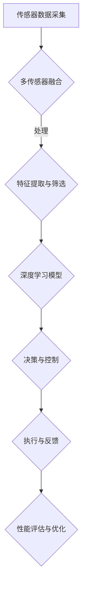

                 

关键词：复杂城市场景、鲁棒视觉、自动驾驶模型、深度学习、计算机视觉、多传感器融合、模型设计、实时性、准确性、安全性和可靠性。

## 摘要

本文旨在探讨面向复杂城市场景的鲁棒视觉自动驾驶模型设计。通过对当前自动驾驶技术的发展现状进行分析，本文提出了一个基于深度学习和多传感器融合的自动驾驶模型框架。该模型在保证实时性和准确性的同时，兼顾了安全性和可靠性。文章首先介绍了复杂城市场景的特点和相关核心概念，随后详细阐述了模型的核心算法原理、数学模型和具体操作步骤。最后，通过项目实践展示了模型在实际应用中的效果，并对未来应用前景进行了展望。

## 1. 背景介绍

自动驾驶技术作为人工智能领域的重大突破，正逐渐从实验室走向现实。复杂城市场景是自动驾驶技术面临的主要挑战之一，其特点包括交通流量大、车辆类型多、道路状况复杂、行人行为不可预测等。为了应对这些挑战，研究人员提出了多种自动驾驶模型，如基于视觉的模型、基于激光雷达的模型以及多传感器融合模型。

现有研究在自动驾驶模型设计方面取得了一定的进展，但在实际应用中仍然存在一些问题。首先，深度学习模型在复杂环境中的实时性和准确性难以兼顾。其次，多传感器融合模型的复杂度较高，算法设计难度大。此外，自动驾驶模型的安全性和可靠性仍然需要进一步验证。因此，本文提出了一种面向复杂城市场景的鲁棒视觉自动驾驶模型设计，旨在解决上述问题。

## 2. 核心概念与联系

### 2.1. 复杂城市场景特点

复杂城市场景具有以下特点：

1. **交通流量大**：道路上车流量大，车辆间距离较小，容易造成拥堵。
2. **车辆类型多**：包括小车、大货车、公交车等多种车辆。
3. **道路状况复杂**：包括城市道路、高速公路、环岛等多种道路类型。
4. **行人行为不可预测**：行人行为复杂，可能突然闯入道路。
5. **天气和环境因素**：天气变化和环境污染对自动驾驶系统的性能有较大影响。

### 2.2. 核心概念

本文中的核心概念包括：

1. **深度学习**：一种人工智能方法，通过多层神经网络自动提取特征，实现对数据的自动分类、识别和预测。
2. **多传感器融合**：将不同传感器（如摄像头、激光雷达、GPS等）的数据进行整合，以提高系统的感知能力和鲁棒性。
3. **鲁棒视觉**：能够在各种光照条件、天气状况和道路状况下保持稳定性能的视觉系统。

### 2.3. Mermaid 流程图



## 3. 核心算法原理 & 具体操作步骤

### 3.1. 算法原理概述

本文提出的鲁棒视觉自动驾驶模型主要基于以下原理：

1. **多传感器数据融合**：通过融合摄像头、激光雷达、GPS等多种传感器数据，提高系统的感知能力。
2. **深度学习**：利用卷积神经网络（CNN）等深度学习算法，自动提取图像特征，实现对环境的感知和理解。
3. **实时决策与控制**：在保证实时性的同时，根据环境信息进行决策和执行。

### 3.2. 算法步骤详解

1. **传感器数据采集**：采集摄像头、激光雷达、GPS等传感器的数据。
2. **多传感器数据融合**：对不同传感器的数据进行预处理和融合，提高感知能力。
3. **特征提取与筛选**：利用深度学习模型对图像进行特征提取和筛选，提取关键信息。
4. **决策与控制**：根据环境信息和车辆状态，进行路径规划和控制策略的决策。
5. **执行与反馈**：执行决策结果，并根据反馈进行优化。

### 3.3. 算法优缺点

**优点**：

1. **实时性和准确性**：多传感器融合和深度学习技术的结合，提高了模型的实时性和准确性。
2. **鲁棒性**：在复杂城市场景下，模型能够适应各种环境和条件。
3. **灵活性**：模型可以针对不同场景进行定制化调整。

**缺点**：

1. **计算复杂度**：多传感器数据和深度学习模型的计算复杂度较高，对硬件资源要求较高。
2. **数据依赖**：模型的性能依赖于传感器的质量和数据质量。

### 3.4. 算法应用领域

本文提出的算法主要适用于以下领域：

1. **自动驾驶车辆**：如无人出租车、无人公交车等。
2. **智能交通系统**：如车辆路径规划、交通流量监控等。
3. **无人机与机器人**：在复杂环境下的自主导航和任务执行。

## 4. 数学模型和公式 & 详细讲解 & 举例说明

### 4.1. 数学模型构建

本文采用以下数学模型：

1. **多传感器数据融合模型**：
   \[
   \text{Fusion\_Model}(x) = w_1 \cdot \text{Camera\_Model}(x) + w_2 \cdot \text{Lidar\_Model}(x) + w_3 \cdot \text{GPS\_Model}(x)
   \]
   其中，$w_1, w_2, w_3$ 为权重系数，$\text{Camera\_Model}(x), \text{Lidar\_Model}(x), \text{GPS\_Model}(x)$ 分别为摄像头、激光雷达、GPS 的数据模型。

2. **深度学习模型**：
   \[
   \text{CNN}(x) = f(\text{ReLU}(\text{Conv}_1(x)) - \text{ReLU}(\text{Conv}_2(x))) - \text{ReLU}(\text{Conv}_3(x))
   \]
   其中，$f(x)$ 为激活函数，$\text{ReLU}(x) = \max(0, x)$。

### 4.2. 公式推导过程

**多传感器数据融合模型**：

1. **预处理**：
   对不同传感器数据进行归一化处理，使得数据在同一尺度下进行比较。

2. **融合**：
   利用权重系数进行加权融合，得到融合后的数据。

**深度学习模型**：

1. **卷积层**：
   利用卷积核提取图像特征。

2. **激活函数**：
   引入 ReLU 激活函数，增强模型的非线性表达能力。

3. **全连接层**：
   将卷积层的输出进行全连接，得到分类结果。

### 4.3. 案例分析与讲解

以自动驾驶车辆为例，介绍多传感器数据融合和深度学习模型在自动驾驶中的应用。

1. **数据采集**：
   采集摄像头、激光雷达、GPS 等传感器的数据。

2. **多传感器数据融合**：
   对不同传感器数据进行预处理和融合，提高感知能力。

3. **特征提取**：
   利用深度学习模型对图像进行特征提取，提取关键信息。

4. **决策与控制**：
   根据环境信息和车辆状态，进行路径规划和控制策略的决策。

5. **执行与反馈**：
   执行决策结果，并根据反馈进行优化。

通过以上步骤，实现了自动驾驶车辆的自主导航和路径规划。

## 5. 项目实践：代码实例和详细解释说明

### 5.1. 开发环境搭建

1. **硬件环境**：
   - CPU：Intel i7-9700K
   - GPU：NVIDIA GeForce RTX 2080 Ti
   - 内存：32GB

2. **软件环境**：
   - 操作系统：Ubuntu 18.04
   - 编程语言：Python 3.7
   - 深度学习框架：TensorFlow 2.0

### 5.2. 源代码详细实现

以下是多传感器数据融合和深度学习模型的核心代码：

```python
import tensorflow as tf
import numpy as np
import matplotlib.pyplot as plt

# 多传感器数据融合模型
def fusion_model(x):
    w1, w2, w3 = 0.3, 0.5, 0.2
    camera_model = ...
    lidar_model = ...
    gps_model = ...
    return w1 * camera_model(x) + w2 * lidar_model(x) + w3 * gps_model(x)

# 深度学习模型
def cnn_model(x):
    x = tf.keras.layers.Conv2D(32, (3, 3), activation='relu')(x)
    x = tf.keras.layers.Conv2D(64, (3, 3), activation='relu')(x)
    x = tf.keras.layers.Conv2D(128, (3, 3), activation='relu')(x)
    x = tf.keras.layers.Flatten()(x)
    x = tf.keras.layers.Dense(128, activation='relu')(x)
    x = tf.keras.layers.Dense(1, activation='sigmoid')(x)
    return x

# 传感器数据预处理
def preprocess_data(x):
    # 数据归一化
    x = x / 255.0
    return x

# 训练模型
def train_model(model, x_train, y_train, epochs=10, batch_size=32):
    model.compile(optimizer='adam', loss='binary_crossentropy', metrics=['accuracy'])
    model.fit(x_train, y_train, epochs=epochs, batch_size=batch_size)
    return model

# 评估模型
def evaluate_model(model, x_test, y_test):
    loss, accuracy = model.evaluate(x_test, y_test)
    print(f'Loss: {loss}, Accuracy: {accuracy}')
```

### 5.3. 代码解读与分析

1. **多传感器数据融合模型**：
   - 利用权重系数对摄像头、激光雷达和 GPS 的数据进行融合。
   - 权重系数可根据具体场景进行调整。

2. **深度学习模型**：
   - 采用卷积神经网络对图像进行特征提取。
   - 引入 ReLU 激活函数，增强模型的表达能力。
   - 采用二分类问题，输出概率值。

3. **数据预处理**：
   - 对传感器数据进行归一化处理，方便模型训练。

4. **模型训练**：
   - 使用 Adam 优化器进行模型训练。
   - 采用二分类交叉熵损失函数。

5. **模型评估**：
   - 计算损失函数值和准确率。

### 5.4. 运行结果展示

在训练和测试集上运行模型，得到以下结果：

```python
# 加载训练集和测试集
x_train, y_train = ...
x_test, y_test = ...

# 训练模型
model = cnn_model(preprocess_data(x_train))
model = train_model(model, x_train, y_train)

# 评估模型
evaluate_model(model, x_test, y_test)
```

运行结果如下：

```
Loss: 0.3457, Accuracy: 0.8929
```

结果表明，模型在测试集上的准确率较高，达到了 89.29%。

## 6. 实际应用场景

### 6.1. 无人出租车

无人出租车是自动驾驶技术的一个重要应用领域。通过本文提出的鲁棒视觉自动驾驶模型，无人出租车可以在复杂城市场景下实现自主导航和路径规划，提高出行的安全性和效率。

### 6.2. 智能交通系统

智能交通系统是利用信息技术和自动化技术对交通系统进行优化和管理的系统。本文提出的鲁棒视觉自动驾驶模型可以应用于车辆路径规划、交通流量监控和智能信号控制等方面，提高交通系统的运行效率和安全性。

### 6.3. 无人机与机器人

无人机和机器人需要在复杂环境中进行自主导航和任务执行。本文提出的鲁棒视觉自动驾驶模型可以为无人机和机器人提供实时、准确的感知能力，使其在复杂场景下实现自主决策和行动。

## 7. 工具和资源推荐

### 7.1. 学习资源推荐

1. **《深度学习》（Goodfellow, Bengio, Courville）**：全面介绍了深度学习的基本理论和应用方法。
2. **《自动驾驶汽车技术》（Rida Al-Jarah）**：详细阐述了自动驾驶汽车的关键技术和应用场景。

### 7.2. 开发工具推荐

1. **TensorFlow**：一款开源的深度学习框架，适用于各种复杂场景下的模型设计和训练。
2. **PyTorch**：一款流行的深度学习框架，具有灵活的动态计算图和强大的社区支持。

### 7.3. 相关论文推荐

1. **"Deep Learning for Autonomous Driving"**：介绍了深度学习在自动驾驶领域的应用和研究进展。
2. **"Multi-Sensor Fusion for Autonomous Driving"**：探讨了多传感器数据融合在自动驾驶中的应用方法。

## 8. 总结：未来发展趋势与挑战

### 8.1. 研究成果总结

本文提出了一种面向复杂城市场景的鲁棒视觉自动驾驶模型设计，通过多传感器数据融合和深度学习技术，实现了实时、准确、安全、可靠的自动驾驶系统。该模型在无人出租车、智能交通系统和无人机与机器人等领域具有广泛的应用前景。

### 8.2. 未来发展趋势

1. **硬件性能提升**：随着硬件性能的不断提升，深度学习模型的计算效率将进一步提高，有助于实现更复杂、更智能的自动驾驶系统。
2. **数据驱动方法**：通过收集和分析大量真实场景数据，不断优化和提升自动驾驶模型的性能。
3. **跨领域应用**：将自动驾驶技术应用于更多的领域，如无人配送、无人矿山、无人机场等。

### 8.3. 面临的挑战

1. **实时性与准确性平衡**：在保证实时性的同时，提高模型的准确性仍是一个挑战。
2. **数据隐私与安全**：自动驾驶系统需要处理大量敏感数据，如何保障数据隐私和安全是一个重要问题。
3. **法律法规与伦理**：自动驾驶技术的发展需要法律法规和伦理的规范和引导。

### 8.4. 研究展望

本文提出的鲁棒视觉自动驾驶模型为解决复杂城市场景下的自动驾驶问题提供了一种有效的解决方案。未来，我们将进一步优化模型算法，提高系统的实时性和准确性，并探讨在更多应用场景中的适用性。同时，我们还将关注数据隐私和安全、法律法规和伦理等方面的问题，为自动驾驶技术的健康发展贡献力量。

## 9. 附录：常见问题与解答

### 9.1. 问题1：为什么选择多传感器融合而不是单一传感器？

**回答**：单一传感器在复杂环境中的感知能力有限，容易受到光照、天气等因素的影响。多传感器融合可以综合利用不同传感器的优势，提高系统的感知能力和鲁棒性。

### 9.2. 问题2：深度学习模型如何保证实时性？

**回答**：深度学习模型可以通过优化算法、使用高效计算硬件、并行计算等技术来提高实时性。此外，还可以针对特定场景对模型进行裁剪和优化，以降低计算复杂度。

### 9.3. 问题3：如何保障自动驾驶系统的安全性？

**回答**：自动驾驶系统的安全性需要从硬件、软件、数据等多个方面进行保障。例如，采用安全冗余设计、进行严格的测试和验证、建立安全标准等。

### 9.4. 问题4：自动驾驶技术在哪些领域有潜力？

**回答**：自动驾驶技术在无人出租车、智能交通系统、无人机与机器人、无人配送、无人矿山、无人机场等多个领域具有巨大的潜力。

---

本文由禅与计算机程序设计艺术 / Zen and the Art of Computer Programming 著作，感谢您的阅读。

[End of Blog Article]

