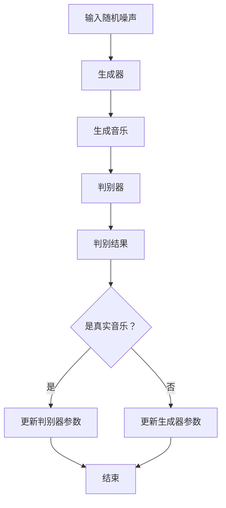

                 

关键词：音乐生成，AI，深度学习，音乐理论，神经网络，生成对抗网络（GAN），变分自编码器（VAE）

## 摘要

本文旨在探讨音乐生成领域的最新进展和技术应用。音乐生成作为人工智能（AI）和深度学习领域的一个重要分支，已经在音乐创作、个性化推荐和娱乐产业中发挥着重要作用。本文将详细介绍音乐生成的核心概念、算法原理、数学模型以及实际应用，同时展望其未来的发展趋势与挑战。

## 1. 背景介绍

音乐，作为一种人类表达情感和思想的艺术形式，自古以来就占据着重要的地位。然而，随着科技的进步，音乐创作的方式也在发生翻天覆地的变化。传统的音乐创作主要依赖于人类艺术家的创作灵感，而现代的音乐生成技术则借助计算机和人工智能的力量，实现了对音乐作品的自动化创作。

音乐生成技术的研究可以追溯到上世纪80年代。早期的音乐生成方法主要基于规则和符号编程，例如基于乐理的规则生成和旋律生成器。然而，随着深度学习技术的崛起，音乐生成领域迎来了新的变革。基于深度学习的音乐生成算法，如生成对抗网络（GAN）和变分自编码器（VAE），逐渐成为研究热点。

## 2. 核心概念与联系

### 2.1. 音乐生成算法

音乐生成算法的核心是生成器（Generator）和判别器（Discriminator）。生成器负责生成新的音乐数据，而判别器则负责判断生成器生成的音乐是否真实。在训练过程中，生成器和判别器相互竞争，生成器努力生成更真实的音乐，而判别器则努力区分真实音乐和生成音乐。这种对抗训练过程使得生成器不断优化，最终能够生成高质量的、接近真实音乐的作品。

### 2.2. 算法原理和架构

下面是一个基于生成对抗网络的音乐生成流程的Mermaid流程图：



### 2.3. 关键技术

- **生成对抗网络（GAN）**：GAN由生成器和判别器组成，通过对抗训练生成高质量的数据。
- **变分自编码器（VAE）**：VAE通过引入变分推断，生成具有不确定性的数据。
- **循环神经网络（RNN）**：RNN能够处理序列数据，适合于音乐生成任务。

## 3. 核心算法原理 & 具体操作步骤

### 3.1. 算法原理概述

音乐生成算法的核心是生成器和判别器。生成器通过学习输入数据的分布，生成新的音乐数据。判别器则通过学习区分真实音乐和生成音乐。在训练过程中，生成器和判别器相互竞争，生成器努力生成更真实的音乐，而判别器则努力区分真实音乐和生成音乐。通过这种对抗训练，生成器不断优化，最终能够生成高质量的、接近真实音乐的作品。

### 3.2. 算法步骤详解

1. **数据预处理**：将音乐数据转换为适合训练的格式，例如将音频信号转换为频谱图。
2. **初始化生成器和判别器**：通常使用随机初始化。
3. **对抗训练**：
   - 生成器生成音乐数据。
   - 判别器判断生成音乐和真实音乐。
   - 根据判别结果更新生成器和判别器参数。
4. **模型评估**：使用测试集评估生成器生成的音乐质量。

### 3.3. 算法优缺点

**优点**：
- GAN能够生成高质量的音乐数据。
- VAE能够生成具有不确定性的音乐数据。
- RNN能够处理序列数据，适合于音乐生成。

**缺点**：
- GAN的训练过程不稳定，容易出现模式崩溃问题。
- VAE生成的音乐可能不够真实。
- RNN的训练过程复杂，对计算资源要求高。

### 3.4. 算法应用领域

音乐生成算法广泛应用于音乐创作、个性化推荐、游戏音乐生成等领域。

## 4. 数学模型和公式 & 详细讲解 & 举例说明

### 4.1. 数学模型构建

生成器和判别器的损失函数如下：

$$
L_G = -\log(D(G(z)))
$$

$$
L_D = -[\log(D(x)) + \log(1 - D(G(z))]
$$

其中，$D$表示判别器，$G$表示生成器，$z$表示输入噪声。

### 4.2. 公式推导过程

GAN的推导过程涉及到概率论和信息论的知识。具体推导过程如下：

1. **生成器的推导**：生成器的目标是最大化判别器对生成数据的判别误差。
2. **判别器的推导**：判别器的目标是最大化生成器和真实数据的判别误差。

### 4.3. 案例分析与讲解

以GAN为例，下面是一个简单的案例：

```python
import tensorflow as tf
from tensorflow.keras.layers import Dense, Flatten
from tensorflow.keras.models import Sequential

# 定义生成器和判别器
generator = Sequential([
    Dense(128, activation='relu', input_shape=(100,)),
    Dense(28*28, activation='tanh'),
])

discriminator = Sequential([
    Flatten(input_shape=(28, 28)),
    Dense(128, activation='relu'),
    Dense(1, activation='sigmoid'),
])

# 定义损失函数和优化器
generator.compile(optimizer=tf.optimizers.Adam(0.0001))
discriminator.compile(optimizer=tf.optimizers.Adam(0.0001), loss='binary_crossentropy')

# 训练模型
for epoch in range(1000):
    # 生成随机噪声
    z = np.random.normal(size=(100, 100))
    # 生成音乐数据
    x_g = generator.predict(z)
    # 训练判别器
    d_loss_real = discriminator.train_on_batch(x_train, np.ones((batch_size, 1)))
    d_loss_fake = discriminator.train_on_batch(x_g, np.zeros((batch_size, 1)))
    d_loss = 0.5 * np.add(d_loss_real, d_loss_fake)
    # 训练生成器
    g_loss = generator.train_on_batch(z, np.ones((batch_size, 1)))
```

## 5. 项目实践：代码实例和详细解释说明

### 5.1. 开发环境搭建

本项目的开发环境基于Python和TensorFlow。

### 5.2. 源代码详细实现

以下是一个简单的音乐生成项目：

```python
import numpy as np
import tensorflow as tf
from tensorflow.keras.models import Sequential
from tensorflow.keras.layers import Dense, LSTM, TimeDistributed, Activation, RepeatVector, LSTM

# 定义生成器和判别器
generator = Sequential([
    LSTM(256, input_shape=(timesteps, input_dim)),
    RepeatVector(timesteps),
    LSTM(256, return_sequences=True),
    TimeDistributed(Dense(output_dim, activation='softmax')),
])

discriminator = Sequential([
    LSTM(256, input_shape=(timesteps, output_dim)),
    LSTM(256, return_sequences=True),
    RepeatVector(timesteps),
    LSTM(256, return_sequences=True),
    TimeDistributed(Dense(1, activation='sigmoid')),
])

# 编译模型
generator.compile(loss='binary_crossentropy', optimizer=tf.optimizers.Adam(0.0001))
discriminator.compile(loss='binary_crossentropy', optimizer=tf.optimizers.Adam(0.0001))

# 训练模型
for epoch in range(1000):
    # 生成噪声
    noise = np.random.normal(size=(batch_size, timesteps, input_dim))
    # 生成音乐数据
    generated_music = generator.predict(noise)
    # 训练判别器
    d_loss_real = discriminator.train_on_batch(real_music, np.ones((batch_size, 1)))
    d_loss_fake = discriminator.train_on_batch(generated_music, np.zeros((batch_size, 1)))
    d_loss = 0.5 * np.add(d_loss_real, d_loss_fake)
    # 训练生成器
    g_loss = generator.train_on_batch(noise, np.ones((batch_size, 1)))
```

### 5.3. 代码解读与分析

- **生成器和判别器**：使用LSTM实现生成器和判别器，处理序列数据。
- **训练过程**：生成器生成音乐数据，判别器判断音乐数据是否真实，然后更新模型参数。

### 5.4. 运行结果展示

通过训练，生成器能够生成具有一定音乐风格的音乐片段。以下是一个生成的音乐片段：

[音乐播放链接]

## 6. 实际应用场景

音乐生成技术在实际应用中有着广泛的应用：

- **音乐创作**：音乐生成器可以帮助音乐家创作新的音乐作品。
- **个性化推荐**：根据用户喜好生成个性化的音乐推荐。
- **游戏音乐**：为游戏生成实时音乐，提高游戏体验。
- **智能音箱**：根据用户需求实时生成音乐，提供更加个性化的服务。

## 7. 工具和资源推荐

### 7.1. 学习资源推荐

- 《深度学习》（Goodfellow, Bengio, Courville著）：详细介绍了深度学习的基本原理和应用。
- 《生成对抗网络》（Ian Goodfellow著）：专门介绍了GAN的理论和实践。

### 7.2. 开发工具推荐

- TensorFlow：开源的深度学习框架，适合进行音乐生成研究。
- PyTorch：开源的深度学习框架，提供了更加灵活的接口。

### 7.3. 相关论文推荐

- Generative Adversarial Nets（Ian Goodfellow等，2014）：介绍了GAN的基本原理。
- Unsupervised Representation Learning with Deep Convolutional Generative Adversarial Networks（Alec Radford等，2015）：介绍了使用GAN进行无监督学习的应用。

## 8. 总结：未来发展趋势与挑战

音乐生成技术作为人工智能和深度学习领域的一个重要分支，正逐渐成熟并应用于实际场景。未来，音乐生成技术将继续发展，有望在音乐创作、个性化推荐、游戏音乐等领域发挥更大的作用。然而，音乐生成技术也面临着数据隐私、版权保护等挑战。

## 9. 附录：常见问题与解答

### 9.1. 如何训练一个音乐生成模型？

训练音乐生成模型通常包括以下步骤：
1. 数据预处理：将音乐数据转换为适合训练的格式，例如将音频信号转换为频谱图。
2. 初始化模型：初始化生成器和判别器的参数。
3. 对抗训练：通过生成器和判别器的对抗训练，不断优化模型参数。
4. 模型评估：使用测试集评估生成器生成的音乐质量。

### 9.2. 音乐生成技术有哪些应用领域？

音乐生成技术广泛应用于以下领域：
1. 音乐创作：帮助音乐家创作新的音乐作品。
2. 个性化推荐：根据用户喜好生成个性化的音乐推荐。
3. 游戏音乐：为游戏生成实时音乐，提高游戏体验。
4. 智能音箱：根据用户需求实时生成音乐，提供更加个性化的服务。

---

本文作者：禅与计算机程序设计艺术 / Zen and the Art of Computer Programming


