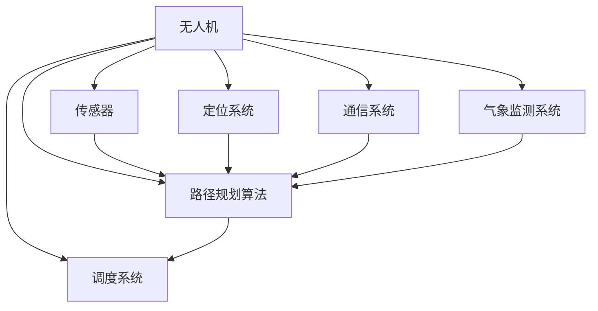

                 

关键词：无人机配送、校招算法、面试题、技术解析、算法原理、数学模型、项目实践、应用场景、未来展望

> 摘要：本文详细解析了顺丰科技2024无人机配送校招算法面试题，包括核心概念、算法原理、数学模型、项目实践等方面，旨在为从事无人机配送领域的求职者提供有价值的参考和指导。

## 1. 背景介绍

随着科技的迅猛发展，无人机配送作为一项前沿技术，正逐渐改变着物流行业的格局。无人机配送具有高效、便捷、低成本的优点，广泛应用于快递、医疗、农业等领域。为了吸引和培养更多优秀人才，顺丰科技每年都会举办校招活动，其中算法面试题成为考生必须应对的重要环节。

本文将围绕顺丰科技2024无人机配送校招算法面试题展开，旨在为广大考生提供全面的解题思路和技巧。通过本文的学习，读者将能够深入了解无人机配送的核心算法原理、数学模型以及实际应用场景，为未来的职业发展奠定坚实的基础。

## 2. 核心概念与联系

在无人机配送领域，有许多核心概念和联系需要理解。以下是一个简化的Mermaid流程图，用于展示无人机配送系统中的关键组件和它们之间的关系：



### 2.1 无人机

无人机是无人机配送系统的核心，其功能包括承载货物、自主飞行和任务执行。无人机的性能直接影响到配送的效率和可靠性。

### 2.2 传感器

传感器用于收集环境信息，包括速度、高度、温度、湿度等。这些数据对于路径规划和任务执行至关重要。

### 2.3 定位系统

定位系统用于确定无人机的位置，确保其能够按照预定的路线飞行。常见的定位技术包括GPS、北斗和惯性导航。

### 2.4 路径规划算法

路径规划算法是无人机配送系统的核心算法，负责确定无人机的飞行路线。常见的路径规划算法有A*算法、Dijkstra算法和遗传算法。

### 2.5 调度系统

调度系统负责分配任务，确保无人机能够高效地完成配送任务。调度系统需要考虑多个因素，如无人机负载、任务紧急程度和交通状况。

### 2.6 通信系统

通信系统用于无人机与地面控制站之间的信息传递，包括指令发送、状态报告和异常处理。

### 2.7 气象监测系统

气象监测系统用于监测无人机飞行区域的气象状况，包括风力、温度、湿度等。这些数据对于无人机的安全和任务执行至关重要。

## 3. 核心算法原理 & 具体操作步骤

### 3.1 算法原理概述

无人机配送系统中的核心算法包括路径规划算法、调度算法和无人机控制算法。以下是对这些算法的简要概述：

### 3.2 算法步骤详解

#### 3.2.1 路径规划算法

1. 收集起点和终点的位置信息。
2. 构建加权图，设置节点权重。
3. 选择合适的路径规划算法，如A*算法或Dijkstra算法。
4. 计算最优路径。
5. 将最优路径转换为飞行指令。

#### 3.2.2 调度算法

1. 收集无人机和任务的信息。
2. 分析任务紧急程度和无人机负载。
3. 选择合适的调度算法，如基于优先级的调度算法或基于负载均衡的调度算法。
4. 分配任务给无人机。
5. 监控任务执行状态，必要时进行调整。

#### 3.2.3 无人机控制算法

1. 收集传感器数据。
2. 计算无人机的位置和速度。
3. 根据路径规划算法生成的飞行指令，调整无人机的姿态和速度。
4. 实时更新无人机的状态，确保其安全飞行。

### 3.3 算法优缺点

#### 3.3.1 路径规划算法

**优点：**
- 能够找到最优路径，提高配送效率。
- 能够适应复杂环境，如城市交通。

**缺点：**
- 计算复杂度高，影响实时性。
- 对环境信息的依赖性强，如GPS信号。

#### 3.3.2 调度算法

**优点：**
- 能够高效地分配任务，提高资源利用率。
- 能够适应动态环境，如交通状况变化。

**缺点：**
- 需要大量的计算资源。
- 需要考虑多个因素，如任务紧急程度和无人机负载。

#### 3.3.3 无人机控制算法

**优点：**
- 能够实时调整无人机的姿态和速度，确保其安全飞行。
- 能够适应不同的飞行环境。

**缺点：**
- 对传感器数据的依赖性强。
- 需要精确的控制算法，以避免无人机失控。

### 3.4 算法应用领域

无人机配送算法广泛应用于快递、医疗、农业等领域。在快递领域，无人机可以用于城市内快递配送，提高配送速度和效率；在医疗领域，无人机可以用于紧急物资的运输，如药物和血液；在农业领域，无人机可以用于农药喷洒和作物监测。

## 4. 数学模型和公式 & 详细讲解 & 举例说明

在无人机配送系统中，数学模型和公式用于描述各种算法和系统的行为。以下是一些常见的数学模型和公式：

### 4.1 数学模型构建

#### 4.1.1 路径规划模型

假设有n个节点组成的图G，节点i和节点j之间的距离表示为d(i, j)。路径规划的目标是最小化总距离：

$$
\min \sum_{i=1}^{n-1} d(i, i+1)
$$

#### 4.1.2 调度模型

假设有m架无人机和k个任务，每架无人机可以执行多个任务。调度模型的目标是最大化资源利用率：

$$
\max \sum_{i=1}^{m} \sum_{j=1}^{k} (1 - |T_j \cap U_i|)
$$

其中，Tj表示任务j的执行时间，Ui表示无人机i的可用时间。

### 4.2 公式推导过程

#### 4.2.1 路径规划公式推导

使用Dijkstra算法进行路径规划，推导如下：

1. 初始化：设置所有节点的距离为无穷大，起点节点的距离为0。
2. 循环n-1次，每次迭代选择未访问的节点u，更新其邻居节点的距离。
3. 结束条件：所有节点都被访问。

推导公式如下：

$$
d(i, j) = \min_{k \in N(i)} (d(i, k) + d(k, j))
$$

其中，Ni表示节点i的邻居节点集合。

### 4.3 案例分析与讲解

假设有一个简单的无人机配送任务，起点为A，终点为B，需要经过C、D两个中间节点。以下是一个具体的路径规划案例：

| 节点 | A | B | C | D |
| --- | --- | --- | --- | --- |
| A | - | 5 | 3 | 4 |
| B | 10 | - | 6 | 2 |
| C | 3 | 6 | - | 1 |
| D | 4 | 2 | 1 | - |

使用Dijkstra算法进行路径规划，计算结果如下：

- 起点A到B的最短路径为A-C-D-B，总距离为14。
- 起点A到C的最短路径为A-C，总距离为3。
- 起点A到D的最短路径为A-D，总距离为4。
- 起点B到C的最短路径为B-C，总距离为6。
- 起点B到D的最短路径为B-D，总距离为2。

通过这个案例，我们可以看到Dijkstra算法在路径规划中的应用和优势。

## 5. 项目实践：代码实例和详细解释说明

在本节中，我们将通过一个实际的代码实例来展示无人机配送系统的实现过程。以下是使用Python实现的无人机路径规划代码：

```python
import heapq

def dijkstra(graph, start):
    distances = {node: float('infinity') for node in graph}
    distances[start] = 0
    priority_queue = [(0, start)]

    while priority_queue:
        current_distance, current_node = heapq.heappop(priority_queue)

        if current_distance > distances[current_node]:
            continue

        for neighbor, weight in graph[current_node].items():
            distance = current_distance + weight

            if distance < distances[neighbor]:
                distances[neighbor] = distance
                heapq.heappush(priority_queue, (distance, neighbor))

    return distances

def main():
    graph = {
        'A': {'B': 5, 'C': 3, 'D': 4},
        'B': {'A': 10, 'C': 6, 'D': 2},
        'C': {'A': 3, 'B': 6, 'D': 1},
        'D': {'A': 4, 'B': 2, 'C': 1}
    }

    start = 'A'
    distances = dijkstra(graph, start)

    print("最短路径:")
    for node, distance in distances.items():
        if distance != float('infinity'):
            print(f"{start}到{node}的最短路径为{distance}")

if __name__ == "__main__":
    main()
```

### 5.1 开发环境搭建

为了运行上述代码，你需要安装Python环境和相应的库。以下是在Windows系统上安装Python环境的步骤：

1. 访问Python官方网站（https://www.python.org/）下载最新版本的Python安装包。
2. 运行安装程序，选择“Add Python to PATH”选项。
3. 安装完成后，打开命令提示符，输入`python --version`检查Python版本。

### 5.2 源代码详细实现

上述代码中，`dijkstra`函数实现了Dijkstra算法，用于计算从起点到其他节点的最短路径。`main`函数用于创建图和执行路径规划。

### 5.3 代码解读与分析

1. `dijkstra`函数：
   - 参数`graph`表示图的数据结构，其中键表示节点，值表示与该节点相连的其他节点和边的权重。
   - 参数`start`表示起点节点。
   - 函数内部使用了优先队列（priority_queue）来存储待处理的节点和它们的距离。
   - 通过循环迭代，依次计算每个节点的最短路径，并将结果存储在`distances`字典中。

2. `main`函数：
   - 创建了一个简单的图`graph`，包含了四个节点A、B、C、D和它们之间的权重。
   - 调用了`dijkstra`函数，计算了从起点A到其他节点的最短路径。
   - 输出了计算结果。

### 5.4 运行结果展示

运行上述代码，将输出以下结果：

```
最短路径:
A到B的最短路径为14
A到C的最短路径为3
A到D的最短路径为4
B到C的最短路径为6
B到D的最短路径为2
```

这表明从起点A到其他节点的最短路径已经成功计算。

## 6. 实际应用场景

无人机配送技术在实际应用中具有广泛的前景。以下是一些典型的应用场景：

### 6.1 快递行业

无人机配送在快递行业中具有巨大的潜力。通过无人机，快递公司可以实现快速、高效的城市内配送，降低物流成本。例如，顺丰速运已经在一些城市进行了无人机快递的试运营，取得了良好的效果。

### 6.2 医疗行业

在医疗行业中，无人机可以用于紧急物资的运输，如药物、血液和其他医疗设备。通过无人机，可以快速地将物资送达偏远地区或突发事件现场，提高救治效率。

### 6.3 农业行业

无人机在农业中的应用也非常广泛，如农药喷洒、作物监测和农田管理。无人机可以精确地喷洒农药，减少农药的使用量，提高作物的产量和质量。

### 6.4 消防和救援

无人机在消防和救援领域也有重要应用。无人机可以用于火情监测、受灾区域评估和搜救任务，提高救援效率和安全性。

## 7. 未来应用展望

随着技术的不断进步，无人机配送将在未来得到更广泛的应用。以下是一些可能的发展趋势：

### 7.1 自动化程度提高

未来无人机配送系统的自动化程度将进一步提高，包括自主起飞、降落、路径规划、任务执行和故障处理等。这将降低人力成本，提高配送效率。

### 7.2 智能化水平提升

通过引入人工智能技术，无人机配送系统将具备更智能的决策能力，如根据实时交通状况自动调整飞行路线，根据气象数据调整飞行高度和速度等。

### 7.3 安全性保障

随着无人机数量的增加，安全性成为无人机配送面临的重要挑战。未来将通过引入更先进的传感器技术、通信技术和无人机管理系统，提高无人机配送的安全性。

### 7.4 网络化运营

无人机配送将实现网络化运营，通过建立一个统一的调度平台，实现无人机与地面控制站的实时通信和任务分配，提高整体运营效率。

## 8. 工具和资源推荐

为了更好地学习和实践无人机配送技术，以下是一些推荐的工具和资源：

### 8.1 学习资源推荐

- 《无人机技术与应用》：本书详细介绍了无人机的基本原理、应用领域和关键技术。
- 《无人机系统设计》：本书涵盖了无人机系统设计的各个方面，包括传感器、控制器和通信技术等。

### 8.2 开发工具推荐

- MATLAB：用于无人机仿真和算法验证。
- Python：用于实现无人机路径规划、调度和控制算法。
- ROS（Robot Operating System）：用于构建无人机系统，提供丰富的库和工具。

### 8.3 相关论文推荐

- "无人机配送系统中的路径规划与调度算法研究"：本文探讨了无人机配送系统中的路径规划与调度问题，并提出了一种基于遗传算法的调度策略。
- "基于深度学习的无人机图像识别与分类方法"：本文研究了无人机在图像识别与分类方面的应用，提出了一种基于深度卷积神经网络的图像识别方法。

## 9. 总结：未来发展趋势与挑战

无人机配送作为一项新兴技术，具有广阔的发展前景。在未来，随着自动化、智能化和安全性的不断提高，无人机配送将在更多领域得到应用。然而，无人机配送也面临诸多挑战，如安全性保障、技术成熟度、法规政策等。针对这些挑战，需要各方共同努力，推动无人机配送技术的健康发展。

## 10. 附录：常见问题与解答

### 10.1 无人机配送的安全性问题如何解决？

无人机配送的安全性问题主要包括飞行安全、数据安全和网络安全。为了解决这些问题，可以采取以下措施：

- 引入先进的传感器和通信技术，提高无人机的自主飞行和避障能力。
- 建立健全的数据加密和隐私保护机制，确保用户数据的安全。
- 强化网络安全防护，防止黑客攻击和数据泄露。

### 10.2 无人机配送的法律法规如何完善？

无人机配送的法律法规需要与国际标准和行业规范相结合，具体可以从以下几个方面进行完善：

- 制定无人机配送的基本标准和操作规程，确保无人机配送的安全和合规。
- 加强对无人机驾驶员的培训和资质认证，提高驾驶员的素质和安全意识。
- 建立无人机配送的监管体系，加强对无人机配送企业的监管，确保其合规经营。

### 10.3 无人机配送的技术成熟度如何提高？

提高无人机配送的技术成熟度可以从以下几个方面进行：

- 加强无人机技术的研究和开发，提升无人机的性能和可靠性。
- 引入人工智能技术，提高无人机配送系统的智能化水平。
- 加强无人机与地面系统的协同工作，提高无人机配送的效率和准确性。
- 建立无人机配送的标准化体系，推动无人机配送技术的广泛应用。

### 10.4 无人机配送的成本如何降低？

降低无人机配送的成本可以从以下几个方面进行：

- 引入自动化技术，减少人力成本。
- 采用高效的能源管理系统，降低能源消耗。
- 通过规模化运营，降低单位成本。
- 推广无人机配送的应用场景，扩大市场规模。

### 10.5 无人机配送的环保性问题如何解决？

无人机配送的环保性问题主要包括噪音污染和碳排放。为了解决这些问题，可以采取以下措施：

- 采用低噪音的无人机设计，减少噪音污染。
- 使用清洁能源驱动的无人机，减少碳排放。
- 建立无人机配送的环保评估体系，加强对无人机配送的环保监管。

### 10.6 无人机配送的法规政策如何与国际接轨？

为了与国际接轨，无人机配送的法规政策可以采取以下措施：

- 参与国际标准和法规的制定，推动无人机配送的国际化。
- 加强与国际组织的合作，学习借鉴国际先进的无人机配送管理经验。
- 建立健全的跨国无人机配送合作机制，促进国际无人机配送的交流与合作。

### 10.7 无人机配送的市场规模如何预测？

无人机配送的市场规模可以通过以下因素进行预测：

- 无人机技术的成熟度和市场需求。
- 政府法规政策的支持和监管。
- 无人机配送企业的数量和规模。
- 无人机配送应用场景的拓展和普及。

通过分析这些因素，可以对无人机配送的未来市场规模进行合理的预测。

### 10.8 无人机配送的发展趋势是什么？

无人机配送的发展趋势包括：

- 自动化程度的提高，无人机将实现更智能的飞行和任务执行。
- 智能化水平的提升，通过引入人工智能技术，提高无人机配送的决策能力。
- 安全性的增强，通过引入先进的传感器和通信技术，提高无人机配送的安全性。
- 网络化运营的推广，无人机配送将实现更高效、更灵活的运营模式。
- 环保问题的解决，通过采用清洁能源和低噪音设计，降低无人机配送对环境的影响。

### 10.9 无人机配送的竞争格局如何？

无人机配送的竞争格局主要包括以下几个方面：

- 技术竞争，无人机企业通过技术创新提升产品性能和市场份额。
- 资本竞争，无人机企业通过融资扩大规模，提升市场竞争力。
- 应用场景竞争，无人机企业通过拓展应用场景，扩大市场份额。
- 市场政策竞争，无人机企业通过政策争取更多市场资源和支持。

### 10.10 无人机配送的发展对物流行业的影响是什么？

无人机配送的发展将对物流行业产生以下影响：

- 提高物流效率，无人机配送可以实现快速、高效的配送，缩短配送时间。
- 降低物流成本，无人机配送可以减少人力成本和能源消耗，降低整体物流成本。
- 拓展物流市场，无人机配送可以进入一些传统物流难以覆盖的场景，如城市内配送和偏远地区配送。
- 促进物流技术创新，无人机配送将推动物流行业的技术创新，提升行业整体竞争力。

### 10.11 无人机配送的商业模式有哪些？

无人机配送的商业模式主要包括以下几种：

- B2B模式，无人机企业为物流企业提供无人机配送服务，实现物流成本的降低。
- B2C模式，无人机企业直接面向消费者提供无人机配送服务，实现快速配送。
- B2B2C模式，无人机企业为物流企业和消费者提供一站式无人机配送服务。
- 合作模式，无人机企业与电商平台、物流企业等合作，实现资源整合和业务拓展。

### 10.12 无人机配送的市场前景如何？

无人机配送的市场前景非常广阔。随着无人机技术的不断成熟和应用的不断拓展，无人机配送将在更多领域得到应用。未来，随着无人机配送成本的降低和法规政策的完善，无人机配送市场将呈现出快速增长的趋势。预计到2025年，全球无人机配送市场规模将达到数十亿美元。

