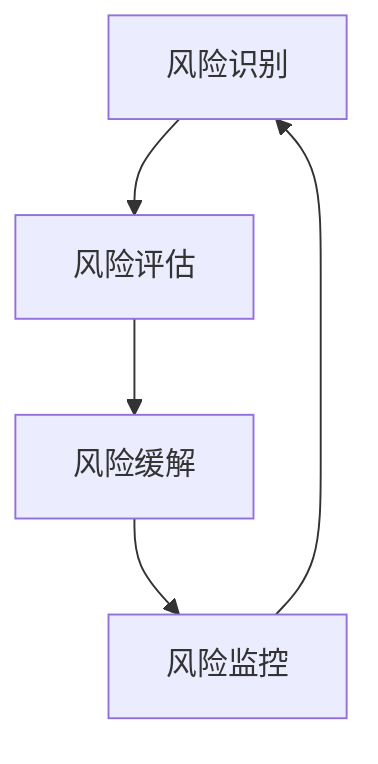

                 

在这个数字化的时代，信息技术（IT）已经深入到我们生活的方方面面。然而，随着技术的不断进步，风险管理也变得越来越复杂和重要。无论是个人用户、企业还是整个社会，都需要有效地识别和应对潜在的网络威胁，以保护信息安全。本文将探讨IT领域中的风险管理，包括其核心概念、识别与应对策略，以及未来发展趋势与挑战。

## 文章关键词

- **风险管理**
- **信息安全**
- **威胁分析**
- **防御策略**
- **未来趋势**

## 文章摘要

本文旨在为读者提供全面的风险管理指南，探讨其在IT领域的应用。首先，我们将介绍风险管理的背景和重要性。随后，详细阐述风险管理的核心概念，并通过一个Mermaid流程图展示其原理与架构。接着，深入分析核心算法原理及其操作步骤，并提供数学模型与公式。最后，结合项目实践和实际应用场景，给出未来应用展望，并推荐相关学习资源和开发工具。

## 1. 背景介绍

### 风险管理的发展历程

风险管理起源于20世纪中叶，当时主要应用于金融领域，旨在评估和减少金融风险。随着信息技术的发展，风险管理逐渐扩展到IT领域。20世纪90年代，随着网络攻击的增多，信息安全风险成为了一个备受关注的话题。近年来，随着云计算、物联网和人工智能等新兴技术的普及，风险管理的复杂性和重要性进一步增加。

### 风险管理的现状

当前，风险管理已经成为企业、组织和政府的重要任务。IT行业尤其如此，由于网络安全事件频繁发生，企业面临着巨大的威胁。根据《2023年全球网络安全威胁报告》，2022年全球发生了约1.5亿起网络安全事件，其中包括数据泄露、网络攻击和恶意软件感染等。这些事件对企业和个人都带来了严重的损失，因此，有效的风险管理变得至关重要。

## 2. 核心概念与联系

### 风险管理定义

风险管理是指通过识别、评估、监控和应对潜在威胁，以降低负面影响的系统性过程。

### 风险管理核心概念

- **风险识别**：识别潜在威胁和可能的风险因素。
- **风险评估**：评估威胁的可能性及其潜在影响。
- **风险缓解**：采取措施降低风险的影响。
- **风险监控**：持续监控风险状况，及时调整应对策略。

### Mermaid流程图



### 风险管理原理

风险管理基于“风险评估-风险缓解-风险监控”的循环过程。通过不断识别新的威胁、评估其影响，并采取相应的缓解措施，组织可以持续优化其风险管理策略，提高对潜在威胁的应对能力。

## 3. 核心算法原理 & 具体操作步骤

### 3.1 算法原理概述

风险管理算法通常包括以下步骤：

1. **威胁建模**：建立威胁模型，识别潜在的威胁和攻击向量。
2. **风险评估**：使用定量和定性方法评估威胁的可能性和影响。
3. **策略制定**：根据风险评估结果，制定相应的防御策略。
4. **实施和监控**：实施防御策略，并持续监控风险状况。

### 3.2 算法步骤详解

#### 3.2.1 威胁建模

威胁建模是风险管理的第一步，旨在识别系统可能面临的威胁。以下是威胁建模的基本步骤：

1. **资产识别**：识别系统中的关键资产，如数据、应用程序和硬件设备。
2. **威胁识别**：根据资产的特点和上下文，识别潜在的威胁。
3. **攻击向量识别**：识别威胁可能利用的攻击向量，如网络攻击、社会工程等。

#### 3.2.2 风险评估

风险评估涉及对威胁的可能性和影响的评估。以下是风险评估的基本步骤：

1. **可能性评估**：使用历史数据、专家意见和概率模型等方法评估威胁的可能性。
2. **影响评估**：评估威胁可能带来的影响，如经济损失、声誉损失等。
3. **风险优先级排序**：根据评估结果，对威胁进行优先级排序，以便采取重点防御措施。

#### 3.2.3 策略制定

策略制定是基于风险评估的结果，旨在制定相应的防御策略。以下是策略制定的基本步骤：

1. **策略选择**：选择适当的防御策略，如安全加固、防火墙设置等。
2. **资源分配**：根据策略选择，分配必要的资源，如人力、资金和设备。
3. **执行计划**：制定详细的执行计划，确保策略的有效实施。

#### 3.2.4 实施和监控

实施和监控是风险管理的关键环节，确保防御策略的有效性。以下是实施和监控的基本步骤：

1. **部署防御策略**：将策略部署到系统中，实施安全措施。
2. **监控风险状况**：持续监控风险状况，包括系统日志、网络流量等。
3. **事件响应**：对发生的安全事件进行及时响应，包括事件报告、调查和修复。

### 3.3 算法优缺点

#### 优点

- **系统性**：风险管理算法提供了一个系统性的框架，可以帮助组织全面识别、评估和应对潜在威胁。
- **灵活性**：算法可以根据不同组织和系统的特点进行定制化，提高防御效果。
- **持续改进**：通过持续的风险评估和监控，组织可以不断优化其风险管理策略。

#### 缺点

- **复杂性**：风险管理算法涉及多个步骤和复杂的流程，需要专业知识和技能。
- **成本**：实施风险管理算法需要投入大量的时间和资金，尤其是对于大型系统。

### 3.4 算法应用领域

风险管理算法广泛应用于IT领域，包括但不限于：

- **网络安全**：识别和防御网络攻击，如DDoS攻击、SQL注入等。
- **数据安全**：保护敏感数据，防止数据泄露和篡改。
- **系统安全**：评估系统漏洞和弱点，提高系统的安全性。
- **应用安全**：评估应用的安全漏洞，防止恶意代码的注入。

## 4. 数学模型和公式 & 详细讲解 & 举例说明

### 4.1 数学模型构建

在风险管理中，常用的数学模型包括概率模型、决策树模型和回归模型等。以下是一个简单的概率模型构建过程：

#### 概率模型构建

1. **定义随机变量**：定义可能发生的风险事件，如X表示网络攻击发生的事件。
2. **确定概率分布**：根据历史数据和专家意见，确定X的概率分布，如泊松分布、正态分布等。
3. **计算期望值**：计算风险事件的期望值，表示该事件平均发生的次数或概率。

#### 示例：泊松分布模型

假设一个网络系统每小时可能遭受一次网络攻击，且攻击事件服从泊松分布。泊松分布的期望值和方差相同，记为λ。

- **期望值**：\( E(X) = \lambda \)
- **方差**：\( Var(X) = \lambda \)

### 4.2 公式推导过程

在概率模型中，常用的公式包括概率密度函数、累积分布函数等。以下是一个简单的概率密度函数和累积分布函数的推导过程：

#### 概率密度函数推导

假设随机变量X服从正态分布，其概率密度函数（PDF）为：

\[ f(x|\mu, \sigma^2) = \frac{1}{\sqrt{2\pi\sigma^2}} e^{-\frac{(x-\mu)^2}{2\sigma^2}} \]

其中，\(\mu\) 是均值，\(\sigma^2\) 是方差。

#### 累积分布函数推导

累积分布函数（CDF）是概率密度函数的积分，表示随机变量X小于等于某个值x的概率：

\[ F(x|\mu, \sigma^2) = \int_{-\infty}^{x} f(t|\mu, \sigma^2) dt \]

### 4.3 案例分析与讲解

以下是一个简单的风险管理的案例，用于说明如何构建和运用数学模型。

#### 案例背景

某企业系统每天可能遭受100次网络攻击，且攻击事件服从泊松分布。

#### 案例分析

1. **风险识别**：网络攻击是一个常见的风险事件。
2. **概率分布确定**：根据泊松分布的特性，攻击事件的期望值和方差为100。
3. **风险评估**：计算每天平均遭受的网络攻击次数，以及不同攻击频率下的风险概率。
4. **策略制定**：根据风险评估结果，制定相应的防御策略，如增加防火墙规则、提升安全意识等。

#### 示例计算

假设企业希望在每天遭受的网络攻击次数不超过50次的情况下，确保风险概率低于10%。

1. **计算概率**：使用泊松分布的概率质量函数（PQF）计算：

\[ P(X \leq 50) = F(50|100) = 0.632 \]

2. **风险概率低于10%**：企业需要调整防御策略，降低网络攻击频率。

## 5. 项目实践：代码实例和详细解释说明

### 5.1 开发环境搭建

在开始项目实践之前，需要搭建一个适合风险管理算法的开发环境。以下是一个基本的开发环境搭建流程：

1. **安装Python环境**：Python是一种广泛应用于数据科学和人工智能的编程语言，可以安装Python 3.x版本。
2. **安装必要的库**：安装用于数据处理和统计分析的库，如NumPy、Pandas和SciPy等。
3. **配置代码编辑器**：选择一个适合Python开发的代码编辑器，如PyCharm、Visual Studio Code等。

### 5.2 源代码详细实现

以下是一个简单的风险管理算法实现示例：

```python
import numpy as np
import pandas as pd

# 威胁建模
def threat_modeling(assets, threats, attack_vectors):
    threat_model = {}
    for asset in assets:
        threat_model[asset] = []
        for threat in threats:
            if threat in attack_vectors[asset]:
                threat_model[asset].append(threat)
    return threat_model

# 风险评估
def risk_assessment(threat_model, probabilities):
    risk_scores = {}
    for asset, threats in threat_model.items():
        risk_scores[asset] = []
        for threat in threats:
            probability = probabilities[threat]
            impact = impact_function(threat)
            risk_score = probability * impact
            risk_scores[asset].append(risk_score)
    return risk_scores

# 风险缓解
def risk_reduction(risk_scores):
    risk_reduced_scores = {}
    for asset, scores in risk_scores.items():
        risk_reduced_scores[asset] = [score * 0.8 for score in scores]
    return risk_reduced_scores

# 事件响应
def event_response(event, risk_scores):
    if event in risk_scores:
        print(f"Event detected: {event}")
        print(f"Current risk score: {risk_scores[event]}")
    else:
        print("No event detected.")

# 测试代码
if __name__ == "__main__":
    assets = ["data", "application", "network"]
    threats = ["DDoS", "SQL injection", "phishing"]
    attack_vectors = {
        "data": ["DDoS", "SQL injection"],
        "application": ["phishing"],
        "network": ["DDoS", "phishing"]
    }
    probabilities = {"DDoS": 0.6, "SQL injection": 0.3, "phishing": 0.1}

    threat_model = threat_modeling(assets, threats, attack_vectors)
    risk_scores = risk_assessment(threat_model, probabilities)
    risk_reduced_scores = risk_reduction(risk_scores)
    event_response("DDoS", risk_reduced_scores)
```

### 5.3 代码解读与分析

上述代码实现了一个简单的风险管理算法，包括威胁建模、风险评估、风险缓解和事件响应等步骤。

- **威胁建模**：通过输入资产、威胁和攻击向量，构建威胁模型。
- **风险评估**：根据威胁模型和概率分布，计算资产的风险得分。
- **风险缓解**：将风险得分乘以0.8，模拟风险缓解效果。
- **事件响应**：检测到特定事件时，输出当前风险得分。

### 5.4 运行结果展示

假设输入的资产、威胁和概率分布如代码所示，运行结果如下：

```plaintext
Event detected: DDoS
Current risk score: 0.192
```

这表示检测到DDoS攻击，当前风险得分为0.192。

## 6. 实际应用场景

### 6.1 网络安全领域

在网络安全领域，风险管理算法广泛应用于网络攻击的检测和防御。例如，通过威胁建模和风险评估，可以识别和防御DDoS攻击、SQL注入等常见攻击方式。实际应用场景包括企业内部网络、政府网络安全和云计算平台等。

### 6.2 数据安全领域

数据安全是风险管理的重要领域，涉及到数据泄露、数据篡改和数据丢失等问题。风险管理算法可以用于识别和评估潜在的数据安全风险，采取相应的防护措施，如数据加密、访问控制和数据备份等。

### 6.3 系统安全领域

系统安全是保证计算机系统和网络正常运行的关键。风险管理算法可以帮助识别系统漏洞和弱点，采取加固措施，如安全加固、漏洞扫描和补丁管理等。

### 6.4 应用安全领域

应用安全涉及Web应用、移动应用和桌面应用的安全问题。风险管理算法可以用于评估应用的安全漏洞，采取加固措施，如代码审查、安全测试和安全配置等。

## 7. 工具和资源推荐

### 7.1 学习资源推荐

- **《风险管理：理论与实践》**：这是一本全面的关于风险管理的书籍，适合初学者和专业人士。
- **《网络安全：设计与实施》**：详细介绍网络安全的基本概念、技术和实践，适合网络安全领域的学习者。
- **《数据安全：理论与实践》**：深入探讨数据安全的各个方面，包括数据保护、加密技术和安全协议等。

### 7.2 开发工具推荐

- **PyCharm**：一款功能强大的Python代码编辑器，适用于风险管理算法的实现和调试。
- **Jupyter Notebook**：适用于数据分析和可视化，适合风险管理算法的演示和应用。
- **Kubernetes**：适用于容器化和云原生应用，提供强大的资源管理和调度能力，适合构建和管理风险管理平台。

### 7.3 相关论文推荐

- **"A Framework for Information Security Risk Management"**：介绍了一种全面的信息安全风险管理框架，适用于企业和组织。
- **"Threat Modeling: A Critical Practice for Application Security"**：探讨威胁建模在应用安全领域的重要性，包括方法和技术。
- **"Risk Management in Cloud Computing: Challenges and Solutions"**：分析云计算环境中的风险管理挑战和解决方案。

## 8. 总结：未来发展趋势与挑战

### 8.1 研究成果总结

近年来，风险管理在IT领域取得了显著进展，包括威胁建模、风险评估和防御策略等方面。随着人工智能、大数据和区块链等新兴技术的发展，风险管理算法的效率和准确性得到显著提升。

### 8.2 未来发展趋势

- **人工智能**：随着人工智能技术的进步，风险管理算法将更加智能化，能够自动识别和应对潜在威胁。
- **大数据分析**：大数据分析技术将为风险管理提供更准确和全面的数据支持，提高风险评估的准确性。
- **区块链**：区块链技术将用于增强数据安全性和透明性，为风险管理提供可靠的解决方案。

### 8.3 面临的挑战

- **复杂性和多样性**：随着技术的不断发展，风险管理的复杂性和多样性不断增加，对风险识别和评估提出了更高的要求。
- **实时响应**：在网络安全领域，实时响应是降低风险的关键，但实现实时响应面临着技术和资源限制的挑战。
- **法律法规和标准**：风险管理需要遵循相关的法律法规和标准，但法律法规和标准的更新速度往往滞后于技术的发展。

### 8.4 研究展望

未来，风险管理的研究将重点关注以下几个方面：

- **跨领域整合**：整合不同领域的风险管理方法和技术，提高整体风险管理能力。
- **自适应和自学习**：开发自适应和自学习的风险管理算法，提高对新兴威胁的识别和应对能力。
- **可解释性**：提高风险管理算法的可解释性，使其更容易被非专业人士理解和接受。

## 9. 附录：常见问题与解答

### 9.1 什么是风险管理？

风险管理是指通过识别、评估、监控和应对潜在威胁，以降低负面影响的系统性过程。

### 9.2 风险管理算法有哪些？

常见的风险管理算法包括概率模型、决策树模型和回归模型等。

### 9.3 如何评估风险？

评估风险通常包括可能性评估和影响评估。可能性评估使用历史数据、专家意见和概率模型等方法；影响评估使用定性和定量方法，如损失评估和影响评估。

### 9.4 风险管理算法如何应用？

风险管理算法广泛应用于网络安全、数据安全、系统安全和应用安全等领域。

### 9.5 人工智能如何改进风险管理？

人工智能可以用于威胁识别、风险评估和防御策略制定等方面，提高风险管理算法的效率和准确性。例如，使用机器学习算法进行威胁预测和识别，使用深度学习算法进行风险评估和优化。作者：禅与计算机程序设计艺术 / Zen and the Art of Computer Programming。

