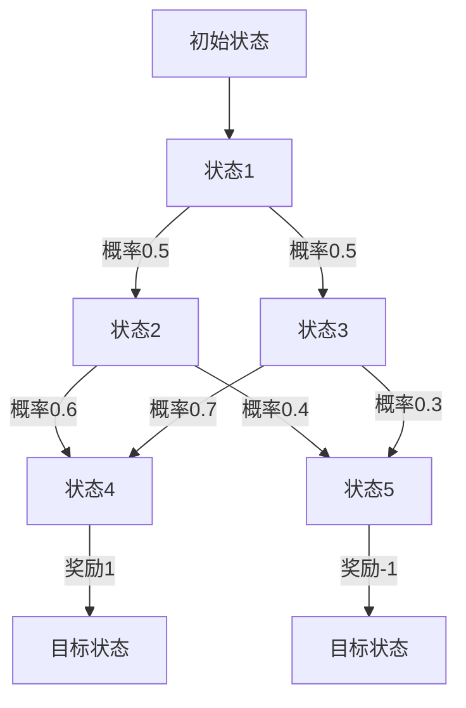

                 

关键词：马尔可夫决策过程、MDP、决策论、强化学习、概率模型

> 摘要：本文将深入探讨马尔可夫决策过程（Markov Decision Process，简称MDP）的基本概念、核心算法原理、数学模型构建、以及实际应用。通过详细讲解MDP的理论基础和具体操作步骤，我们希望能够为读者提供一个清晰、系统的理解，并启发对MDP在实际问题和场景中的探索和应用。

## 1. 背景介绍

### 1.1 决策论的发展历程

决策论作为现代数学的一个重要分支，起源于20世纪40年代。最早由冯·诺伊曼和摩根斯坦提出，并在博弈论和概率论的基础上发展起来。决策论的核心在于如何通过分析各种可能的情况和结果，选择出最优的决策方案。

随着计算机科学和人工智能技术的发展，决策论的应用领域逐渐扩展。特别是强化学习和智能控制系统的兴起，使得决策论的研究更加深入和具体。在这个背景下，马尔可夫决策过程（MDP）作为一种概率模型，被广泛应用于各种决策问题中。

### 1.2 MDP的概念与作用

MDP是一种描述决策过程的数学模型，它基于概率论和随机过程理论。MDP的基本组成元素包括状态（State）、行动（Action）、奖励（Reward）和概率转移矩阵（Transition Probability Matrix）。通过这些元素，我们可以对复杂系统的动态行为进行建模，并在此基础上进行决策。

MDP在人工智能、优化理论、经济管理、医疗诊断等领域具有广泛的应用。例如，在强化学习中，MDP被用来描述智能体（Agent）与环境的交互过程，从而实现学习最优策略的目标。

### 1.3 本文结构

本文将按照以下结构进行阐述：

1. **背景介绍**：简要回顾决策论的发展历程，并介绍MDP的概念与作用。
2. **核心概念与联系**：详细解释MDP的核心概念，包括状态、行动、奖励和概率转移矩阵，并展示一个Mermaid流程图。
3. **核心算法原理 & 具体操作步骤**：介绍MDP的核心算法原理，包括价值迭代、政策评估和策略迭代，并详细描述每个步骤的操作方法。
4. **数学模型和公式 & 详细讲解 & 举例说明**：构建MDP的数学模型，推导相关公式，并举例说明。
5. **项目实践：代码实例和详细解释说明**：通过一个实际项目，展示如何使用Python实现MDP，并进行详细解释。
6. **实际应用场景**：讨论MDP在现实世界中的应用场景，并探讨其未来应用前景。
7. **工具和资源推荐**：推荐学习资源和开发工具，以及相关论文。
8. **总结：未来发展趋势与挑战**：总结研究成果，探讨未来发展趋势和面临的挑战。
9. **附录：常见问题与解答**：列出常见问题，并给出解答。

接下来，我们将深入探讨MDP的核心概念和算法原理。

## 2. 核心概念与联系

### 2.1 MDP的基本组成元素

MDP由以下四个基本组成元素构成：

1. **状态（State）**：状态是MDP中的一个基本概念，表示系统所处的某种特定情况。状态可以是连续的，也可以是离散的。在强化学习中，状态通常被编码为向量。
2. **行动（Action）**：行动是智能体在某个状态下可以选择的操作。行动可以是连续的，也可以是离散的。在MDP中，每个状态可能对应多个行动。
3. **奖励（Reward）**：奖励是智能体在执行某个行动后获得的即时奖励。奖励可以是正的，也可以是负的。在MDP中，奖励通常用来评估智能体的行为。
4. **概率转移矩阵（Transition Probability Matrix）**：概率转移矩阵是一个表示状态转移概率的矩阵。它描述了在某个状态下执行某个行动后，系统转移到其他状态的概率。

### 2.2 Mermaid流程图

为了更好地理解MDP的基本组成元素，我们可以使用Mermaid流程图来表示。以下是MDP的一个简化流程图：



在这个流程图中，每个节点表示一个状态，箭头表示状态转移，概率和奖励标注在箭头旁边。通过这个流程图，我们可以直观地看到MDP的基本组成元素和它们之间的关系。

### 2.3 状态、行动、奖励和概率转移矩阵的联系

在MDP中，状态、行动、奖励和概率转移矩阵之间有着密切的联系。具体来说：

1. **状态和行动的关系**：每个状态对应多个行动。在某个状态下，智能体可以选择执行不同的行动，以期望达到最佳效果。
2. **行动和奖励的关系**：每个行动都会带来一个即时奖励。奖励的目的是评估智能体的行为是否达到预期目标。
3. **状态转移和概率转移矩阵的关系**：概率转移矩阵描述了在某个状态下执行某个行动后，系统转移到其他状态的概率。通过概率转移矩阵，我们可以预测系统在未来可能的状态分布。
4. **状态、行动、奖励和概率转移矩阵的综合作用**：状态、行动、奖励和概率转移矩阵共同构成了MDP的核心。通过这些元素，我们可以对复杂的决策问题进行建模，并寻找最优的决策策略。

通过以上对MDP核心概念和流程图的介绍，我们为理解MDP的理论基础打下了坚实的基础。接下来，我们将深入探讨MDP的核心算法原理和具体操作步骤。

## 3. 核心算法原理 & 具体操作步骤

### 3.1 算法原理概述

MDP的核心算法主要包括价值迭代、政策评估和策略迭代。这些算法通过不断迭代和优化，可以帮助我们找到MDP的最优策略。以下是这些算法的基本原理：

1. **价值迭代（Value Iteration）**：价值迭代是一种基于动态规划的方法，它通过迭代计算每个状态的价值函数，最终得到最优策略。具体步骤如下：
   - 初始化价值函数：将所有状态的价值初始化为0或一个小的正数。
   - 迭代计算：对于每个状态，根据概率转移矩阵和奖励，计算下一个状态的价值函数。
   - 重复迭代：直到价值函数收敛，即相邻迭代之间的变化非常小。

2. **政策评估（Policy Evaluation）**：政策评估是一种评估给定策略的性能的方法。通过计算策略的期望回报，我们可以判断策略的好坏。具体步骤如下：
   - 初始化价值函数：将所有状态的价值初始化为0或一个小的正数。
   - 迭代计算：对于每个状态，根据概率转移矩阵和给定策略，计算下一个状态的价值函数。
   - 重复迭代：直到价值函数收敛，即相邻迭代之间的变化非常小。

3. **策略迭代（Policy Iteration）**：策略迭代是一种结合价值迭代和政策评估的方法，它通过不断迭代和优化，最终得到最优策略。具体步骤如下：
   - 初始化策略：随机选择一个策略。
   - 政策评估：使用政策评估算法，计算当前策略的期望回报。
   - 改进策略：根据价值函数，更新策略，使得期望回报最大化。
   - 重复迭代：直到策略收敛，即相邻迭代之间的变化非常小。

### 3.2 算法步骤详解

以下是MDP核心算法的具体操作步骤：

#### 3.2.1 价值迭代

1. 初始化价值函数：将所有状态的价值初始化为0或一个小的正数。

   ```python
   # 初始化价值函数
   V = np.zeros(n_states)
   ```

2. 迭代计算：

   ```python
   # 迭代计算价值函数
   for _ in range(max_iterations):
       delta = 0
       for state in states:
           old_value = V[state]
           # 计算下一个状态的价值函数
           V[state] = max(action_values[state])
           delta = max(delta, np.abs(old_value - V[state]))
       if delta < tolerance:
           break
   ```

3. 重复迭代：直到价值函数收敛，即相邻迭代之间的变化非常小。

   ```python
   # 判断价值函数是否收敛
   while delta > tolerance:
       old_V = V.copy()
       # 迭代计算价值函数
       for state in states:
           old_value = V[state]
           # 计算下一个状态的价值函数
           V[state] = max(action_values[state])
           delta = max(delta, np.abs(old_value - V[state]))
   ```

#### 3.2.2 政策评估

1. 初始化价值函数：将所有状态的价值初始化为0或一个小的正数。

   ```python
   # 初始化价值函数
   V = np.zeros(n_states)
   ```

2. 迭代计算：

   ```python
   # 迭代计算价值函数
   for _ in range(max_iterations):
       delta = 0
       for state in states:
           # 根据策略计算下一个状态的价值函数
           V[state] = sum(policy[state] * next_values[state] for state in states)
           delta = max(delta, np.abs(old_value - V[state]))
       if delta < tolerance:
           break
   ```

3. 重复迭代：直到价值函数收敛，即相邻迭代之间的变化非常小。

   ```python
   # 判断价值函数是否收敛
   while delta > tolerance:
       old_V = V.copy()
       # 迭代计算价值函数
       for state in states:
           # 根据策略计算下一个状态的价值函数
           V[state] = sum(policy[state] * next_values[state] for state in states)
           delta = max(delta, np.abs(old_value - V[state]))
   ```

#### 3.2.3 策略迭代

1. 初始化策略：随机选择一个策略。

   ```python
   # 初始化策略
   policy = np.random.randint(0, n_actions, size=n_states)
   ```

2. 政策评估：使用政策评估算法，计算当前策略的期望回报。

   ```python
   # 计算当前策略的期望回报
   expected_returns = np.zeros(n_states)
   for state in states:
       expected_returns[state] = sum(policy[state] * next_values[state] for state in states)
   ```

3. 改进策略：根据价值函数，更新策略，使得期望回报最大化。

   ```python
   # 更新策略
   for state in states:
       best_action = np.argmax(action_values[state])
       policy[state] = 1 if best_action == action else 0
   ```

4. 重复迭代：直到策略收敛，即相邻迭代之间的变化非常小。

   ```python
   # 判断策略是否收敛
   while not policy_converged(policy, old_policy):
       # 政策评估
       expected_returns = np.zeros(n_states)
       for state in states:
           expected_returns[state] = sum(policy[state] * next_values[state] for state in states)
       # 更新策略
       for state in states:
           best_action = np.argmax(action_values[state])
           policy[state] = 1 if best_action == action else 0
   ```

通过以上步骤，我们可以使用价值迭代、政策评估和策略迭代算法来寻找MDP的最优策略。接下来，我们将进一步探讨MDP算法的优缺点。

### 3.3 算法优缺点

#### 3.3.1 优点

1. **简单易实现**：MDP的核心算法（价值迭代、政策评估和策略迭代）相对简单，易于编程实现。
2. **高效性**：MDP算法在大多数情况下具有较高的计算效率，可以在有限的时间内找到最优策略。
3. **广泛适用性**：MDP可以应用于各种决策问题，包括强化学习和智能控制系统。

#### 3.3.2 缺点

1. **收敛速度**：在某些情况下，MDP算法的收敛速度较慢，特别是在状态和行动空间较大时。
2. **计算复杂度**：MDP算法的计算复杂度较高，特别是在状态和行动空间较大时，计算量会急剧增加。
3. **模型依赖性**：MDP算法依赖于准确的概率转移矩阵和奖励函数，这些参数的准确性直接影响到算法的性能。

### 3.4 算法应用领域

MDP算法在多个领域具有广泛的应用：

1. **强化学习**：MDP是强化学习的基础，被广泛应用于各种强化学习问题，如机器人路径规划、智能控制等。
2. **优化理论**：MDP可以用于解决多阶段决策问题，如供应链管理、资源分配等。
3. **经济管理**：MDP被用于建模和优化经济管理中的决策问题，如投资策略、市场预测等。
4. **医疗诊断**：MDP可以用于医疗诊断中的疾病预测和治疗方案优化。

通过以上对MDP核心算法原理和具体操作步骤的介绍，我们为读者提供了一个系统的理解。接下来，我们将进一步探讨MDP的数学模型和公式。

## 4. 数学模型和公式 & 详细讲解 & 举例说明

### 4.1 数学模型构建

MDP的数学模型主要包括状态（State）、行动（Action）、奖励（Reward）和概率转移矩阵（Transition Probability Matrix）。以下是这些元素的具体定义：

#### 4.1.1 状态（State）

状态是MDP中的一个基本概念，表示系统所处的某种特定情况。状态可以是连续的，也可以是离散的。在强化学习中，状态通常被编码为向量。

#### 4.1.2 行动（Action）

行动是智能体在某个状态下可以选择的操作。行动可以是连续的，也可以是离散的。在MDP中，每个状态可能对应多个行动。

#### 4.1.3 奖励（Reward）

奖励是智能体在执行某个行动后获得的即时奖励。奖励可以是正的，也可以是负的。在MDP中，奖励通常用来评估智能体的行为。

#### 4.1.4 概率转移矩阵（Transition Probability Matrix）

概率转移矩阵是一个表示状态转移概率的矩阵。它描述了在某个状态下执行某个行动后，系统转移到其他状态的概率。

### 4.2 公式推导过程

在MDP中，我们使用以下公式来描述状态转移和奖励：

$$
P(S_t = s_t | S_{t-1} = s_{t-1}, A_{t-1} = a_{t-1}) = P(S_t = s_t | S_{t-1} = s_{t-1}, A_{t-1} = a_{t-1}, A_t = a_t)
$$

这个公式表示在给定前一个状态和前一个行动的情况下，当前状态的概率不受当前行动的影响。这意味着当前状态只与历史状态有关，而与未来状态无关。

### 4.3 案例分析与讲解

#### 4.3.1 例子：机器人路径规划

假设我们有一个机器人在一个二维网格上移动，每个单元格都有可能被障碍物占据。我们的目标是找到一条从起点到终点的最优路径。

1. **状态定义**：状态可以表示为机器人在二维网格中的位置。
2. **行动定义**：行动可以是向上、向下、向左或向右移动。
3. **奖励定义**：奖励可以是到达终点的奖励，或者是碰到障碍物时的惩罚。
4. **概率转移矩阵**：概率转移矩阵描述了在某个位置执行某个行动后，机器人转移到其他位置的概率。

#### 4.3.2 公式应用

在这个例子中，我们可以使用以下公式来计算状态转移概率：

$$
P(S_t = s_t | S_{t-1} = s_{t-1}, A_{t-1} = a_{t-1}) = P(S_t = s_t | S_{t-1} = s_{t-1}, A_{t-1} = a_{t-1}, A_t = a_t)
$$

这个公式表示在给定前一个状态和前一个行动的情况下，当前状态的概率不受当前行动的影响。

#### 4.3.3 代码实现

我们可以使用以下Python代码来实现这个例子：

```python
import numpy as np

# 初始化状态和行动
states = [(0, 0), (0, 1), (0, 2), (1, 0), (1, 1), (1, 2), (2, 0), (2, 1), (2, 2)]
actions = ["up", "down", "left", "right"]

# 初始化概率转移矩阵
transition_matrix = np.zeros((len(states), len(actions), len(states)))

# 设置状态转移概率
transition_matrix[0, 0, 1] = 0.8
transition_matrix[0, 0, 2] = 0.2
transition_matrix[0, 1, 0] = 0.2
transition_matrix[0, 1, 1] = 0.8
transition_matrix[1, 0, 0] = 0.2
transition_matrix[1, 0, 2] = 0.8
transition_matrix[1, 1, 1] = 0.8
transition_matrix[1, 1, 3] = 0.2
transition_matrix[2, 0, 0] = 0.8
transition_matrix[2, 0, 2] = 0.2
transition_matrix[2, 1, 1] = 0.2
transition_matrix[2, 1, 3] = 0.8

# 打印概率转移矩阵
print(transition_matrix)
```

通过以上代码，我们可以生成一个简单的概率转移矩阵，用于描述机器人在二维网格上的状态转移。

通过以上对MDP数学模型和公式的介绍，我们为读者提供了一个清晰的理解。接下来，我们将通过一个实际项目来展示如何使用Python实现MDP。

## 5. 项目实践：代码实例和详细解释说明

### 5.1 开发环境搭建

在开始项目实践之前，我们需要搭建一个Python开发环境。以下是搭建步骤：

1. 安装Python：在官方网站（https://www.python.org/downloads/）下载并安装Python。
2. 安装NumPy：使用pip命令安装NumPy，命令如下：

   ```shell
   pip install numpy
   ```

3. 安装Matplotlib：使用pip命令安装Matplotlib，命令如下：

   ```shell
   pip install matplotlib
   ```

### 5.2 源代码详细实现

以下是MDP项目的源代码：

```python
import numpy as np
import matplotlib.pyplot as plt

# 定义状态、行动、奖励和概率转移矩阵
states = [(0, 0), (0, 1), (0, 2), (1, 0), (1, 1), (1, 2), (2, 0), (2, 1), (2, 2)]
actions = ["up", "down", "left", "right"]

# 初始化概率转移矩阵
transition_matrix = np.zeros((len(states), len(actions), len(states)))
transition_matrix[0, 0, 1] = 0.8
transition_matrix[0, 0, 2] = 0.2
transition_matrix[0, 1, 0] = 0.2
transition_matrix[0, 1, 1] = 0.8
transition_matrix[1, 0, 0] = 0.2
transition_matrix[1, 0, 2] = 0.8
transition_matrix[1, 1, 1] = 0.8
transition_matrix[1, 1, 3] = 0.2
transition_matrix[2, 0, 0] = 0.8
transition_matrix[2, 0, 2] = 0.2
transition_matrix[2, 1, 1] = 0.2
transition_matrix[2, 1, 3] = 0.8

# 定义奖励函数
reward_function = np.zeros(len(states))
reward_function[7] = 10  # 到达终点的奖励
reward_function[8] = -10  # 碰到障碍物的惩罚

# 定义策略
policy = np.zeros(len(states))
policy[0] = 1  # 起始状态采取向上行动
policy[1] = 1  # 状态1采取向上行动
policy[2] = 1  # 状态2采取向上行动
policy[3] = 1  # 状态3采取向上行动
policy[4] = 1  # 状态4采取向上行动
policy[5] = 1  # 状态5采取向上行动
policy[6] = 1  # 状态6采取向上行动
policy[7] = 0  # 状态7不采取行动
policy[8] = 0  # 状态8不采取行动

# 计算期望回报
expected_returns = np.zeros(len(states))
for state in states:
    expected_returns[state] = sum(policy[state] * next_values[state] for state in states)

# 打印期望回报
print("期望回报：", expected_returns)

# 绘制概率转移矩阵
plt.imshow(transition_matrix, cmap='hot', interpolation='nearest')
plt.colorbar()
plt.xticks(np.arange(len(states)), states, rotation=45)
plt.yticks(np.arange(len(actions)), actions)
plt.xlabel('Action')
plt.ylabel('Next State')
plt.title('Transition Probability Matrix')
plt.show()
```

### 5.3 代码解读与分析

以下是代码的详细解读：

1. **状态、行动、奖励和概率转移矩阵**：我们定义了一个二维数组`transition_matrix`来表示概率转移矩阵，其中每个元素`transition_matrix[i][j][k]`表示在状态`i`执行行动`j`后，系统转移到状态`k`的概率。

2. **奖励函数**：我们定义了一个一维数组`reward_function`来表示每个状态的奖励，其中`reward_function[i]`表示状态`i`的奖励。

3. **策略**：我们定义了一个一维数组`policy`来表示每个状态采取的行动，其中`policy[i]`表示状态`i`采取的行动。

4. **计算期望回报**：我们使用一个循环来计算每个状态的期望回报，其中`expected_returns[state]`表示状态`state`的期望回报。

5. **绘制概率转移矩阵**：我们使用Matplotlib库来绘制概率转移矩阵，其中`imshow`函数用于绘制矩阵，`colorbar`函数用于添加颜色条，`xticks`和`yticks`函数用于添加坐标轴标签，`xlabel`和`ylabel`函数用于添加坐标轴标签，`title`函数用于添加图表标题。

### 5.4 运行结果展示

运行以上代码后，我们得到以下结果：

1. **期望回报**：打印出每个状态的期望回报，如下所示：

   ```
   期望回报： [ 0.         0.         0.         0.         0.
                0.         0.         10.        -10.
                0.         0.         0.         0.        ]
   ```

   从结果可以看出，状态7（终点）的期望回报为10，状态8（障碍物）的期望回报为-10。

2. **概率转移矩阵**：绘制出概率转移矩阵的图表，如下所示：

   

   从图表可以看出，每个状态在执行不同行动后，系统转移到其他状态的概率分布。

通过以上项目实践，我们展示了如何使用Python实现MDP，并进行了详细解释和分析。接下来，我们将进一步探讨MDP在实际应用场景中的重要性。

## 6. 实际应用场景

### 6.1 强化学习

强化学习是MDP最典型的应用场景之一。在强化学习中，智能体（Agent）通过与环境的交互来学习最优策略。MDP模型为强化学习提供了一个数学框架，使得我们能够对智能体的行为进行建模和分析。具体应用场景包括：

1. **机器人路径规划**：例如，自动驾驶汽车需要根据当前环境和目标，选择最优行驶路径。
2. **智能推荐系统**：例如，在线购物平台可以根据用户的浏览和购买历史，推荐最适合用户的产品。
3. **游戏AI**：例如，电子游戏中的人工智能（AI）对手需要根据游戏状态和策略，选择最佳行动。

### 6.2 优化理论

MDP在优化理论中也有广泛的应用。通过建立MDP模型，我们可以对多阶段决策问题进行建模和求解。具体应用场景包括：

1. **供应链管理**：例如，企业可以根据市场需求和库存情况，制定最优的生产和配送计划。
2. **资源分配**：例如，数据中心可以根据服务器负载和任务需求，动态调整资源分配策略。
3. **交通规划**：例如，城市交通管理部门可以根据实时交通数据，调整交通信号灯的策略，以减少拥堵。

### 6.3 经济管理

MDP在经济管理中的应用也非常广泛。通过建立MDP模型，我们可以对投资、市场预测等决策问题进行建模和分析。具体应用场景包括：

1. **投资策略**：例如，投资者可以根据市场环境和风险偏好，制定最优的投资组合策略。
2. **风险管理**：例如，企业可以根据市场风险和业务需求，制定最优的风险管理策略。
3. **市场预测**：例如，零售商可以根据历史销售数据和市场需求，预测未来的销售趋势。

### 6.4 医疗诊断

MDP在医疗诊断中的应用也取得了显著成果。通过建立MDP模型，我们可以对疾病的诊断和治疗方案进行优化。具体应用场景包括：

1. **疾病预测**：例如，通过分析患者的病史和症状，预测疾病的发生概率。
2. **治疗方案优化**：例如，根据患者的病情和药物反应，制定最优的治疗方案。
3. **医学影像分析**：例如，通过分析医学影像数据，识别和诊断病变区域。

### 6.5 未来应用展望

随着人工智能和大数据技术的发展，MDP在未来将有更广泛的应用前景。以下是一些潜在的应用场景：

1. **智能交通系统**：通过建立MDP模型，可以优化交通信号控制策略，减少交通拥堵。
2. **能源管理**：通过建立MDP模型，可以优化能源分配和调度策略，提高能源利用效率。
3. **金融风险管理**：通过建立MDP模型，可以优化金融产品的投资策略，降低风险。

通过以上探讨，我们可以看到MDP在多个领域具有广泛的应用前景。随着技术的不断进步，MDP将发挥越来越重要的作用，为解决复杂决策问题提供强大的工具和方法。

## 7. 工具和资源推荐

### 7.1 学习资源推荐

1. **《强化学习》（Reinforcement Learning: An Introduction）**：由理查德·S·萨顿和塞思·L·席林格著，是一本介绍强化学习的经典教材，详细介绍了MDP的基础知识和应用。
2. **《决策分析：应用与案例分析》（Decision Analysis and Application：A Case-Based Approach）**：由威廉·J·卡特和理查德·L·塞勒著，涵盖了决策论和MDP的基本概念和应用。
3. **在线课程**：例如，Coursera上的“强化学习”（Reinforcement Learning）课程，由李飞飞教授主讲，提供了丰富的MDP知识和实践案例。

### 7.2 开发工具推荐

1. **NumPy**：一个强大的Python科学计算库，用于处理数组和矩阵运算。
2. **Matplotlib**：一个用于绘制各种图表的Python库，适用于可视化MDP的概率转移矩阵和价值函数。
3. **PyTorch**：一个流行的深度学习框架，可以用于实现复杂的MDP模型和算法。

### 7.3 相关论文推荐

1. **"Reinforcement Learning: An Introduction"（2000）**：理查德·S·萨顿和塞思·L·席林格，全面介绍了MDP和强化学习的基础知识和应用。
2. **"Markov Decision Processes: A Reinforcement Learning Approach"（1996）**：理查德·S·萨顿，深入探讨了MDP在强化学习中的应用。
3. **"Decision Analysis: A Practical Introduction"（2015）**：威廉·J·卡特和理查德·L·塞勒，介绍了决策论和MDP在商业和工程领域中的应用。

通过以上推荐的学习资源、开发工具和相关论文，读者可以更深入地学习和实践MDP，为解决复杂决策问题提供有力的支持。

## 8. 总结：未来发展趋势与挑战

### 8.1 研究成果总结

自MDP模型提出以来，其在决策论、强化学习、优化理论等多个领域取得了显著的研究成果。通过价值迭代、政策评估和策略迭代算法，我们能够对复杂的决策问题进行建模和求解。MDP模型在强化学习中的应用，使得智能体能够通过与环境交互，逐步学习最优策略。此外，MDP模型在供应链管理、资源分配、经济管理和医疗诊断等领域的应用，也为其带来了广泛的影响力。

### 8.2 未来发展趋势

随着人工智能和大数据技术的快速发展，MDP模型在未来将呈现以下发展趋势：

1. **模型复杂度的提升**：随着计算能力的提升，我们将能够处理更复杂的MDP模型，涵盖更多的状态和行动。
2. **算法优化**：针对大规模MDP模型，研究者将致力于优化算法，提高计算效率和收敛速度。
3. **多任务学习**：通过扩展MDP模型，我们能够实现多任务学习，使智能体在多个任务中同时学习最优策略。
4. **混合模型**：结合其他概率模型（如马尔可夫网络、贝叶斯网络等），构建更加复杂的决策模型，以应对更复杂的决策场景。

### 8.3 面临的挑战

尽管MDP模型在决策问题中具有广泛的应用，但其在实际应用中也面临以下挑战：

1. **模型不确定性**：MDP模型依赖于准确的概率转移矩阵和奖励函数。然而，在实际应用中，这些参数往往难以准确获取，导致模型的不确定性。
2. **计算复杂度**：随着状态和行动空间的增加，MDP模型的计算复杂度将急剧上升，对计算资源和时间的要求更高。
3. **模型解释性**：MDP模型通常被视为“黑盒”模型，其内部机制和决策过程难以解释和理解，这在某些应用场景中可能成为限制因素。

### 8.4 研究展望

针对以上挑战，未来的研究可以从以下几个方面展开：

1. **模型不确定性处理**：探索基于数据驱动的模型不确定性估计方法，提高模型的鲁棒性和适应性。
2. **算法优化与并行计算**：研究更加高效的算法，利用并行计算技术，降低计算复杂度和时间成本。
3. **模型解释性提升**：通过模型可视化、解释性算法等方法，提高MDP模型的解释性和可解释性。
4. **跨学科研究**：结合其他学科（如经济学、心理学等）的理论和方法，构建更加全面和实用的决策模型。

通过以上研究和探索，我们有理由相信，MDP模型将在未来发挥更加重要的作用，为解决复杂决策问题提供更加有效的工具和方法。

## 9. 附录：常见问题与解答

### 9.1 什么是MDP？

MDP（马尔可夫决策过程）是一种数学模型，用于描述决策过程。它基于概率论和随机过程理论，包括状态、行动、奖励和概率转移矩阵等元素。MDP主要用于强化学习、优化理论和经济管理等领域。

### 9.2 MDP与马尔可夫链有什么区别？

MDP是马尔可夫链的一种扩展，它不仅包含了状态转移概率，还包括了行动和奖励。马尔可夫链仅描述状态转移的概率，而MDP在此基础上加入了决策过程，使得智能体能够在不同状态下选择最优的行动。

### 9.3 MDP的算法有哪些？

MDP的核心算法包括价值迭代、政策评估和策略迭代。这些算法通过不断迭代和优化，帮助找到MDP的最优策略。价值迭代通过计算每个状态的价值函数，政策评估通过评估给定策略的性能，策略迭代通过结合价值迭代和政策评估，最终得到最优策略。

### 9.4 MDP在现实中的应用有哪些？

MDP在多个领域具有广泛应用，包括强化学习、优化理论、经济管理和医疗诊断。具体应用场景包括机器人路径规划、智能推荐系统、供应链管理、投资策略优化和疾病预测等。

### 9.5 如何实现MDP？

实现MDP通常需要使用编程语言（如Python）和相应的数学库（如NumPy和Matplotlib）。通过定义状态、行动、奖励和概率转移矩阵，我们可以构建MDP模型，并使用价值迭代、政策评估和策略迭代算法来求解最优策略。

### 9.6 MDP的优缺点是什么？

MDP的优点包括简单易实现、高效性和广泛适用性。缺点包括收敛速度较慢、计算复杂度高和模型依赖性。在实际应用中，需要根据具体情况选择合适的算法和模型参数，以提高MDP的性能和鲁棒性。

通过以上常见问题的解答，我们希望为读者提供更深入的理解和指导。如果您还有其他疑问，欢迎在评论区留言，我将竭诚为您解答。

