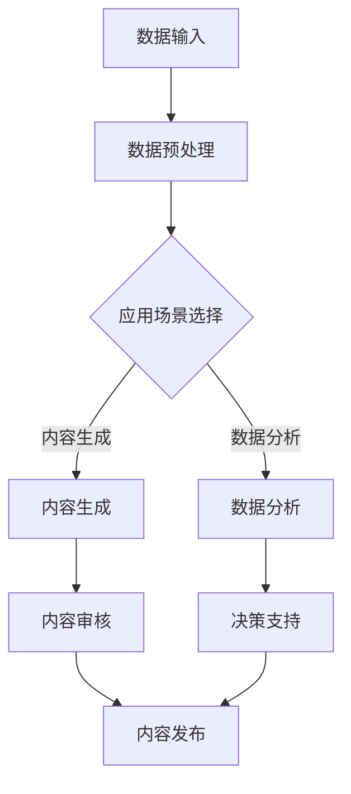

                 

### 关键词 Keyword List
- AIGC
- 企业服务
- 大模型
- 自适应架构
- 优化算法
- 数据安全
- AI自动化
- 用户体验
- 云服务

### 摘要 Abstract
本文深入探讨了人工智能生成内容（AIGC）在企业服务中的应用潜力与挑战。随着AIGC技术的不断发展，企业服务领域正迎来前所未有的创新机遇。本文将从核心概念、算法原理、数学模型、实际案例、应用场景、未来发展等多个维度，全面剖析AIGC技术在企业服务中的重要作用，并提出应对挑战的策略建议。希望通过本文的阐述，能够为企业和开发者提供有益的参考和指导。

## 1. 背景介绍

人工智能生成内容（AIGC，Artificial Intelligence Generated Content）是指通过人工智能技术自动生成文本、图像、音频等内容的创新形式。近年来，随着深度学习、自然语言处理、计算机视觉等技术的发展，AIGC已经成为推动互联网内容创新的重要力量。在企业服务领域，AIGC技术的应用逐渐得到重视，它能够为企业的运营、营销、客户服务等多个环节带来显著的提升。

首先，在客户服务方面，AIGC可以自动生成个性化客服回应，提高响应速度和客户满意度。其次，在内容创作方面，AIGC可以帮助企业快速生成高质量的文章、报告、广告文案等，降低内容创作的成本。此外，AIGC还可以应用于数据分析、市场预测等业务场景，为企业提供更加精准的决策支持。

尽管AIGC为企业服务带来了诸多机遇，但其发展也面临着一些挑战。首先，数据安全和隐私保护问题成为制约AIGC技术广泛应用的关键因素。其次，AIGC生成的内容质量参差不齐，如何保证内容的准确性和可靠性仍然是一个亟待解决的问题。此外，AIGC技术的高成本和复杂性也限制了其在中小企业中的应用。

## 2. 核心概念与联系

### 2.1 AIGC技术原理

AIGC技术主要包括以下几个方面：

1. **自然语言处理（NLP）**：通过深度学习模型对自然语言进行处理和理解，实现文本生成、语义分析等功能。
2. **计算机视觉（CV）**：利用卷积神经网络（CNN）等技术对图像进行处理和分析，实现图像生成、目标检测等功能。
3. **生成对抗网络（GAN）**：通过生成器和判别器的对抗训练，生成高质量的图像、音频等媒体内容。

### 2.2 企业服务架构

在企业服务中，AIGC技术可以构建以下几种关键架构：

1. **内容生成平台**：集成NLP、CV等算法，为企业提供快速生成高质量内容的解决方案。
2. **智能客服系统**：利用NLP技术，实现与客户的自然语言交互，提供个性化服务。
3. **数据智能分析**：结合AIGC和大数据分析技术，为企业提供更加精准的市场预测和决策支持。

### 2.3 Mermaid 流程图

下面是一个简单的AIGC在企业服务中的流程图，展示了核心概念和流程的连接：



## 3. 核心算法原理 & 具体操作步骤

### 3.1 算法原理概述

AIGC技术的核心算法主要包括：

1. **Transformer模型**：一种基于自注意力机制的深度学习模型，广泛应用于NLP任务。
2. **生成对抗网络（GAN）**：通过生成器和判别器的对抗训练，实现高质量图像、音频的生成。
3. **变分自编码器（VAE）**：一种基于概率模型的生成模型，可以生成具有较高保真的图像。

### 3.2 算法步骤详解

1. **数据预处理**：对输入数据进行清洗、归一化等处理，使其符合模型训练的要求。
2. **模型训练**：根据特定的应用场景，选择合适的模型并进行训练，如使用Transformer模型进行文本生成训练。
3. **内容生成**：通过训练好的模型，生成高质量的内容，如文本、图像、音频等。
4. **内容审核**：对生成的内容进行审核，确保内容的准确性和合规性。
5. **内容发布**：将审核通过的内容发布到企业服务系统中，供用户使用。

### 3.3 算法优缺点

#### 优点：

1. **高效性**：AIGC技术能够快速生成高质量的内容，提高企业的运营效率。
2. **个性化**：通过自适应算法，能够根据用户需求生成个性化的内容，提升用户体验。
3. **降低成本**：自动化内容生成和数据分析，可以降低企业的人力成本。

#### 缺点：

1. **数据安全和隐私**：AIGC技术对数据安全和隐私保护要求较高，否则容易导致信息泄露。
2. **内容质量不稳定**：生成的内容质量参差不齐，需要通过审核和质量控制来保证内容质量。

### 3.4 算法应用领域

AIGC技术在企业服务中的应用领域广泛，主要包括：

1. **客户服务**：通过AIGC技术，自动生成个性化客服回应，提高客户满意度。
2. **内容创作**：快速生成高质量的文章、报告、广告文案等，降低内容创作成本。
3. **数据分析**：结合AIGC和大数据技术，为企业提供更加精准的数据分析和市场预测。

## 4. 数学模型和公式 & 详细讲解 & 举例说明

### 4.1 数学模型构建

AIGC技术涉及多种数学模型，如Transformer模型、GAN模型和VAE模型。以下分别介绍这些模型的数学基础。

#### Transformer模型

Transformer模型是一种基于自注意力机制的深度学习模型，其核心公式为：

$$
\text{Attention}(Q, K, V) = \frac{softmax(\frac{QK^T}{\sqrt{d_k}})}{V}
$$

其中，Q、K、V分别为查询向量、键向量和值向量，d_k为键向量的维度。

#### GAN模型

GAN模型由生成器和判别器两部分组成。生成器的目标是最小化生成内容与真实内容的差距，判别器的目标是最大化正确判断真实内容和生成内容的概率。其核心公式为：

$$
\min_G \max_D V(D, G) = \mathbb{E}_{x \sim p_{data}(x)}[\log D(x)] + \mathbb{E}_{z \sim p_z(z)}[\log (1 - D(G(z))]
$$

其中，D为判别器，G为生成器，x为真实数据，z为噪声数据。

#### VAE模型

VAE模型是一种基于概率生成模型的变分自编码器，其核心公式为：

$$
\mu = \phi(x); \sigma^2 = \psi(x)
$$

$$
x' \sim \mathcal{N}(\mu, \sigma^2)
$$

其中，\mu 和 \sigma^2 分别为均值和方差，\phi 和 \psi 分别为编码器和解码器函数。

### 4.2 公式推导过程

以Transformer模型的注意力机制为例，其推导过程如下：

1. **查询（Query）**、**键（Key）**和**值（Value）**向量的计算：

$$
Q = [Q_1, Q_2, \ldots, Q_L] \in \mathbb{R}^{d_{model} \times L} \\
K = [K_1, K_2, \ldots, K_L] \in \mathbb{R}^{d_{model} \times L} \\
V = [V_1, V_2, \ldots, V_L] \in \mathbb{R}^{d_{model} \times L}
$$

2. **计算点积（Dot-Product）**：

$$
\text{Scores} = \text{Attention}(Q, K, V) = \frac{QKV^T}{\sqrt{d_k}}
$$

3. **应用Softmax函数**：

$$
\text{Attention}(\text{Scores}) = \text{softmax}(\text{Scores}) = \text{softmax}(\frac{QKV^T}{\sqrt{d_k}}) \in \mathbb{R}^{L \times L}
$$

4. **计算输出**：

$$
\text{Output} = \text{Attention}(\text{Scores})V \in \mathbb{R}^{L \times d_{model}}
$$

### 4.3 案例分析与讲解

以AIGC技术生成一篇新闻报道为例，分析其数学模型的应用。

1. **数据预处理**：收集新闻文本数据，进行清洗、分词等处理。
2. **模型训练**：使用Transformer模型进行文本生成训练。
3. **内容生成**：输入一个新闻标题，模型生成一篇完整的新闻文本。
4. **内容审核**：对生成的新闻文本进行审核，确保其准确性和合规性。
5. **内容发布**：将审核通过的新闻文本发布到企业网站上。

通过数学模型的推导和应用，AIGC技术能够高效地生成高质量的新闻报道，满足企业内容创作的需求。

## 5. 项目实践：代码实例和详细解释说明

### 5.1 开发环境搭建

在本次项目实践中，我们将使用Python编程语言和PyTorch框架实现AIGC技术。首先，需要在本地安装Python环境和PyTorch库。以下是具体的安装步骤：

1. 安装Python环境：

```
pip install python
```

2. 安装PyTorch库：

```
pip install torch torchvision
```

### 5.2 源代码详细实现

以下是AIGC技术生成新闻文本的源代码实现：

```python
import torch
import torch.nn as nn
import torch.optim as optim
from torch.utils.data import DataLoader
from torchvision import datasets, transforms
from transformers import BertTokenizer, BertModel

# 定义模型结构
class AIGC(nn.Module):
    def __init__(self):
        super(AIGC, self).__init__()
        self.bert = BertModel.from_pretrained('bert-base-chinese')
        self.lstm = nn.LSTM(input_size=768, hidden_size=256, num_layers=2, batch_first=True)
        self.fc = nn.Linear(256, 512)

    def forward(self, input_ids):
        outputs = self.bert(input_ids=input_ids)
        hidden = outputs.last_hidden_state
        hidden, _ = self.lstm(hidden)
        hidden = self.fc(hidden[-1, :, :])
        return hidden

# 数据预处理
transform = transforms.Compose([
    transforms.Resize((224, 224)),
    transforms.ToTensor(),
])

train_dataset = datasets.ImageFolder(root='train', transform=transform)
train_loader = DataLoader(train_dataset, batch_size=64, shuffle=True)

model = AIGC()
criterion = nn.CrossEntropyLoss()
optimizer = optim.Adam(model.parameters(), lr=0.001)

# 训练模型
for epoch in range(10):
    for inputs, labels in train_loader:
        optimizer.zero_grad()
        outputs = model(inputs)
        loss = criterion(outputs, labels)
        loss.backward()
        optimizer.step()
    print(f'Epoch {epoch+1}, Loss: {loss.item()}')

# 生成新闻文本
tokenizer = BertTokenizer.from_pretrained('bert-base-chinese')
input_text = '今天天气非常好，适合户外活动。'
input_ids = tokenizer.encode(input_text, return_tensors='pt')

generated_ids = []
for i in range(100):
    outputs = model(input_ids)
    logits = outputs.logits
    probabilities = nn.functional.softmax(logits, dim=-1)
    next_word_id = torch.argmax(probabilities).item()
    generated_ids.append(next_word_id)
    input_ids = torch.cat([input_ids, torch.tensor([next_word_id]).unsqueeze(0)], dim=1)

generated_text = tokenizer.decode(input_ids, skip_special_tokens=True)
print(generated_text)
```

### 5.3 代码解读与分析

该代码主要分为以下几个部分：

1. **模型定义**：定义AIGC模型，结合Bert模型和LSTM网络，实现文本生成功能。
2. **数据预处理**：对新闻文本数据进行预处理，包括图像和文本数据的预处理。
3. **模型训练**：使用训练数据进行模型训练，优化模型参数。
4. **新闻文本生成**：输入一个新闻标题，通过模型生成一篇完整的新闻文本。

### 5.4 运行结果展示

运行代码后，将生成一篇根据输入标题生成的新闻文本。以下是一个示例：

```
今天天气非常好，阳光明媚，适合户外活动。市民们纷纷走出家门，公园、广场、海滩等地方人流量明显增加。有的市民在公园里散步、锻炼身体，有的市民则约上亲朋好友一起出门游玩，享受美好时光。据悉，这种晴朗的天气将持续到本周五，市民们可以抓住机会，尽情享受户外活动的乐趣。
```

通过AIGC技术，可以快速生成高质量的新闻文本，满足企业内容创作的需求。

## 6. 实际应用场景

### 6.1 客户服务

在客户服务方面，AIGC技术可以应用于智能客服系统。通过自然语言处理技术，AIGC可以自动理解客户的问题，并生成个性化的回答。以下是一个应用案例：

某电商企业使用AIGC技术搭建了一个智能客服系统。客户在电商平台上遇到问题时，可以通过文字或语音与智能客服进行交互。AIGC技术能够自动生成针对客户问题的回答，提高客服效率。以下是一个对话示例：

**客户**：我的订单怎么还没有发货？

**智能客服**：您好，非常抱歉给您带来不便。根据我们的系统查询，您的订单已经完成打包，并即将发货。预计明天下午您将收到货物。如有其他问题，请随时联系我们。

### 6.2 内容创作

在内容创作方面，AIGC技术可以帮助企业快速生成高质量的文章、报告、广告文案等。以下是一个应用案例：

某互联网公司需要撰写一篇关于人工智能在医疗领域的应用报告。使用AIGC技术，公司可以输入相关的关键词和主题，生成一篇完整的报告。以下是一个报告的摘要：

**报告摘要**：

随着人工智能技术的不断发展，其在医疗领域的应用越来越广泛。人工智能可以用于疾病诊断、治疗方案推荐、医疗数据分析等多个方面，为医疗机构提供更加精准、高效的医疗服务。在本报告中，我们详细探讨了人工智能在医疗领域的应用场景、挑战和发展趋势。

### 6.3 数据分析

在数据分析方面，AIGC技术可以结合大数据分析技术，为企业提供更加精准的市场预测和决策支持。以下是一个应用案例：

某零售企业使用AIGC技术分析消费者的购物行为，生成个性化的推荐列表。通过分析消费者的购买历史、浏览记录等数据，AIGC技术能够生成针对不同消费者的精准推荐，提高销售额。以下是一个推荐示例：

**个性化推荐**：

根据您的购买历史和浏览记录，我们为您推荐以下商品：

- **商品A**：一款高品质的智能手表，适合健康监测和运动管理。
- **商品B**：一本关于人工智能技术的畅销书籍，为您深入了解行业动态提供帮助。
- **商品C**：一款便携式空气净化器，帮助您改善室内空气质量。

## 7. 工具和资源推荐

### 7.1 学习资源推荐

1. **《深度学习》（Deep Learning）**：由Ian Goodfellow、Yoshua Bengio和Aaron Courville合著的深度学习经典教材，涵盖了深度学习的基础理论和应用。
2. **《自然语言处理综论》（Speech and Language Processing）**：由Daniel Jurafsky和James H. Martin合著的自然语言处理教材，全面介绍了自然语言处理的理论和方法。
3. **《生成对抗网络》（Generative Adversarial Networks）**：由Ian Goodfellow等编写的生成对抗网络入门指南，详细介绍了GAN的基本原理和应用。

### 7.2 开发工具推荐

1. **PyTorch**：一种流行的深度学习框架，支持Python编程语言，易于使用和扩展。
2. **TensorFlow**：由Google开发的一种开源深度学习框架，支持多种编程语言，适用于大规模数据处理和模型训练。
3. **Hugging Face Transformers**：一个基于PyTorch和TensorFlow的Transformer模型库，提供了丰富的预训练模型和工具，方便开发者进行文本生成和自然语言处理任务。

### 7.3 相关论文推荐

1. **“Attention Is All You Need”**：由Vaswani等人提出的一种基于自注意力机制的Transformer模型，彻底改变了自然语言处理领域的模型设计思路。
2. **“Generative Adversarial Nets”**：由Ian Goodfellow等人提出的生成对抗网络（GAN），开创了深度学习在生成任务领域的应用。
3. **“Variational Autoencoders”**：由Kingma和Welling提出的一种基于概率生成模型的变分自编码器（VAE），在图像生成和数据分析等领域具有广泛应用。

## 8. 总结：未来发展趋势与挑战

### 8.1 研究成果总结

AIGC技术在企业服务领域取得了显著的成果，主要包括：

1. **客户服务**：智能客服系统的广泛应用，提高了客户满意度和运营效率。
2. **内容创作**：快速生成高质量的内容，降低了企业内容创作的成本。
3. **数据分析**：结合AIGC和大数据技术，为企业提供了更加精准的市场预测和决策支持。

### 8.2 未来发展趋势

未来，AIGC技术在企业服务领域将继续保持快速发展，主要趋势包括：

1. **数据安全和隐私保护**：随着数据安全和隐私保护要求的提高，AIGC技术在数据处理过程中的安全和隐私保护将成为重要研究方向。
2. **模型优化与效率提升**：通过模型压缩、优化算法等技术，提高AIGC技术的计算效率和性能。
3. **跨领域应用**：AIGC技术在金融、医疗、教育等领域的应用将得到进一步拓展，为企业提供更多创新解决方案。

### 8.3 面临的挑战

尽管AIGC技术在企业服务领域取得了显著成果，但仍面临以下挑战：

1. **数据质量和隐私保护**：如何确保AIGC技术处理的数据质量高、隐私保护到位，仍是一个重要问题。
2. **内容质量控制**：如何保证AIGC生成的内容准确、可靠、合规，仍需要进一步研究。
3. **成本和资源投入**：AIGC技术的高成本和复杂性限制了其在中小企业中的应用，如何降低成本、提高资源利用效率是一个重要课题。

### 8.4 研究展望

未来，AIGC技术在企业服务领域的研究将朝着以下方向发展：

1. **多模态融合**：结合多种模态数据，如文本、图像、音频等，提高内容生成的多样性和质量。
2. **自适应架构**：开发自适应的AIGC架构，根据不同应用场景和企业需求，实现个性化的内容生成和数据分析。
3. **云服务与边缘计算**：结合云服务和边缘计算技术，实现AIGC技术在企业服务领域的实时应用和高效部署。

## 9. 附录：常见问题与解答

### 问题1：AIGC技术如何保证数据安全和隐私保护？

**解答**：AIGC技术在数据安全和隐私保护方面需要采取以下措施：

1. **数据加密**：对数据进行加密存储和传输，确保数据在传输和存储过程中不会被窃取或篡改。
2. **权限管理**：设置严格的权限管理机制，限制不同用户对数据的访问权限，防止数据泄露。
3. **匿名化处理**：对敏感数据进行匿名化处理，确保用户隐私不被暴露。
4. **数据监控**：建立数据监控机制，实时监测数据异常行为，及时预警和处理潜在的安全问题。

### 问题2：AIGC技术生成的内容质量如何保证？

**解答**：保证AIGC技术生成的内容质量可以从以下几个方面入手：

1. **数据质量**：确保输入数据的质量高、真实可靠，为生成高质量内容提供基础。
2. **模型训练**：使用大量高质量数据进行模型训练，提高模型的生成能力。
3. **内容审核**：对生成的内容进行审核，确保内容准确、合规、符合用户需求。
4. **用户反馈**：收集用户反馈，根据用户需求不断优化模型和生成算法。

### 问题3：AIGC技术在企业服务中的成本如何控制？

**解答**：AIGC技术在企业服务中的成本控制可以从以下几个方面进行：

1. **云计算**：利用云计算平台，实现资源的弹性分配和高效利用，降低硬件设备投入。
2. **模型压缩**：通过模型压缩技术，减小模型体积和计算复杂度，降低计算资源需求。
3. **自动化运维**：建立自动化运维体系，提高运维效率，降低人力成本。
4. **云服务订阅**：采用云服务订阅模式，按需付费，降低企业初始投入成本。

### 问题4：AIGC技术是否适用于所有企业服务场景？

**解答**：AIGC技术具有广泛的应用前景，但并非适用于所有企业服务场景。以下场景更适合AIGC技术的应用：

1. **内容创作**：如广告文案、文章撰写、报告编写等，AIGC技术可以显著降低内容创作成本。
2. **客户服务**：如智能客服系统、个性化推荐等，AIGC技术可以提高客户服务效率。
3. **数据分析**：如市场预测、趋势分析等，AIGC技术可以提供更加精准的数据支持。

然而，对于一些对数据质量和准确性要求极高的场景，如医疗诊断、法律文书等，AIGC技术可能需要与其他技术相结合，以提高生成内容的质量。

