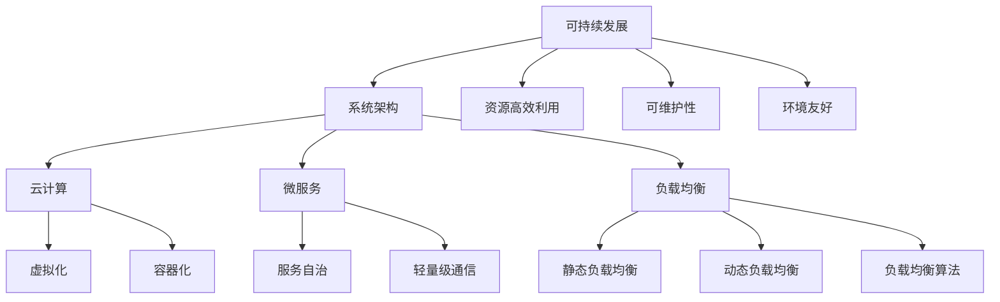

                 

在这个快速发展的数字时代，系统设计的高扩展性成为了企业和开发者的核心关注点。随着业务规模的不断扩大和用户数量的持续增长，系统能够灵活适应变化的需求，保持高性能和可靠性，成为了成功的关键。本文将探讨高扩展性系统设计的关键要素，帮助读者了解如何构建具备高扩展性的系统。

## 关键词
- 高扩展性系统设计
- 系统架构
- 云计算
- 微服务
- 负载均衡
- 可持续发展

## 摘要
本文旨在深入探讨高扩展性系统设计的关键要素，包括系统架构、云计算、微服务、负载均衡和可持续发展等方面的内容。通过详细的分析和实际案例，我们将揭示如何设计并实现具备高扩展性的系统，以满足不断变化的市场需求和技术进步。

## 1. 背景介绍

在过去的几十年中，互联网和移动设备的普及使得数字化成为企业发展不可或缺的一部分。随着企业业务的不断扩展，传统的单体架构逐渐暴露出其扩展性不足、维护困难等问题。为了应对这些挑战，开发者们开始探索高扩展性系统设计的解决方案。

### 1.1 高扩展性的重要性

高扩展性系统设计的重要性主要体现在以下几个方面：

1. **满足不断增长的业务需求**：随着业务的发展，系统能够轻松扩展以支持更多的用户和更大的数据量。
2. **提高系统性能**：通过合理的系统架构设计，能够优化资源利用，提升系统的响应速度和处理能力。
3. **增强系统稳定性**：具备高扩展性的系统能够在高峰时段保持稳定运行，减少系统崩溃和故障的风险。
4. **支持快速迭代**：高扩展性系统设计使得系统能够快速适应市场需求的变化，支持快速迭代和部署。

### 1.2 当前系统设计面临的挑战

当前系统设计面临的挑战主要包括：

1. **单体架构的局限性**：传统的单体架构在扩展性、可维护性和可测试性方面存在瓶颈。
2. **高并发处理需求**：随着在线用户数量的增加，系统需要能够处理更高的并发请求。
3. **数据存储和传输的挑战**：大规模数据存储和高效数据传输对系统设计提出了更高的要求。
4. **技术多样性的挑战**：不同业务场景下可能需要使用多种技术和工具，如何整合和管理这些技术成为了一个挑战。

## 2. 核心概念与联系

在探讨高扩展性系统设计的关键要素之前，我们需要了解几个核心概念，并了解它们之间的联系。

### 2.1 系统架构

系统架构是指系统的整体结构和组件之间的关系。一个良好的系统架构是实现高扩展性的基础。常见的系统架构模式包括：

1. **单体架构**：所有功能都集中在单个应用程序中。
2. **分层架构**：将系统分为不同的层级，如表示层、业务逻辑层和数据层。
3. **微服务架构**：将系统拆分为多个独立的服务，每个服务负责特定的业务功能。

### 2.2 云计算

云计算提供了弹性的计算资源，使得系统能够根据需求动态调整资源分配。云计算的关键概念包括：

1. **虚拟化**：通过虚拟化技术，将物理资源抽象为虚拟资源。
2. **容器化**：容器化技术使得应用能够在隔离的环境中运行，提高资源利用率和部署效率。
3. **云服务模型**：包括基础设施即服务（IaaS）、平台即服务（PaaS）和软件即服务（SaaS）。

### 2.3 微服务

微服务架构是将大型单体应用拆分为多个独立的小服务，每个服务都有自己的业务逻辑和数据库。微服务的核心概念包括：

1. **服务自治**：每个服务都是独立的，可以独立部署、扩展和升级。
2. **轻量级通信**：服务之间通过轻量级的通信协议（如HTTP/REST）进行通信。
3. **去中心化**：微服务架构去除了传统的集中式架构中的单点故障风险。

### 2.4 负载均衡

负载均衡是将请求分配到多个服务器或服务实例上，以避免单点过载和确保系统的高可用性。负载均衡的关键概念包括：

1. **静态负载均衡**：预先配置，不根据实时负载动态调整。
2. **动态负载均衡**：根据实时负载动态调整请求分配。
3. **负载均衡算法**：如轮询、最少连接、源IP哈希等。

### 2.5 可持续发展

可持续发展是指在满足当前需求的同时，不损害后代满足自身需求的能力。在系统设计中，可持续发展体现在：

1. **资源高效利用**：优化系统架构，提高资源利用效率。
2. **可维护性**：设计易于维护和扩展的系统，降低长期维护成本。
3. **环境友好**：采用绿色技术和可持续发展策略，减少对环境的影响。

### 2.6 Mermaid 流程图

以下是一个简单的 Mermaid 流程图，展示了高扩展性系统设计中的关键概念和联系：



## 3. 核心算法原理 & 具体操作步骤

### 3.1 算法原理概述

高扩展性系统设计涉及多种核心算法，以下是几个关键算法的原理概述：

1. **分布式算法**：通过分布式计算，将任务分解为多个子任务，在多个节点上并行处理，提高系统处理能力。
2. **一致性算法**：在分布式系统中，数据一致性问题至关重要。一致性算法如Paxos、Raft等，确保多个节点上的数据保持一致。
3. **缓存算法**：通过缓存技术，减少对后端数据存储的访问频率，提高系统响应速度。常用的缓存算法包括LRU、LFU等。
4. **哈希算法**：用于分配请求到不同的服务器或服务实例上，如MD5、SHA等。

### 3.2 算法步骤详解

以下是一个基于分布式算法的负载均衡的具体操作步骤：

1. **初始化**：初始化系统，设置负载均衡器和服务器的状态。
2. **请求接收**：接收客户端发送的请求。
3. **哈希计算**：对请求的URL或请求体进行哈希计算，得到哈希值。
4. **服务器选择**：根据哈希值，选择一个服务器进行处理。
5. **请求转发**：将请求转发给选定的服务器。
6. **结果返回**：服务器处理完请求后，将结果返回给客户端。
7. **负载调整**：根据服务器当前的处理能力和负载情况，动态调整负载均衡策略。

### 3.3 算法优缺点

1. **分布式算法**：
   - 优点：提高系统处理能力，负载均衡，容错性强。
   - 缺点：需要维护多个节点之间的通信和一致性，实现复杂。
2. **一致性算法**：
   - 优点：确保数据一致性，提高系统可靠性。
   - 缺点：实现复杂，可能影响性能。
3. **缓存算法**：
   - 优点：提高系统响应速度，减少数据访问频率。
   - 缺点：缓存一致性问题和缓存失效问题。
4. **哈希算法**：
   - 优点：简单高效，易于实现。
   - 缺点：可能产生热点问题，影响负载均衡效果。

### 3.4 算法应用领域

1. **分布式系统**：如分布式数据库、分布式存储系统。
2. **云计算平台**：如云服务提供商的负载均衡服务。
3. **Web应用**：如电商平台、社交媒体平台。
4. **大数据处理**：如分布式数据处理框架。

## 4. 数学模型和公式 & 详细讲解 & 举例说明

### 4.1 数学模型构建

高扩展性系统设计的数学模型主要包括以下几个部分：

1. **性能模型**：用于评估系统在不同负载下的性能。
2. **资源分配模型**：用于优化系统资源分配。
3. **负载均衡模型**：用于分配请求到不同的服务器或服务实例。

### 4.2 公式推导过程

以下是一个简单的性能模型公式推导过程：

1. **响应时间模型**：假设系统处理请求的时间是随机的，服从参数为$\lambda$的泊松分布。则系统的平均响应时间$T$可以表示为：

   $$ T = \frac{\lambda}{\mu} $$

   其中，$\lambda$为请求到达率，$\mu$为系统处理请求的平均速度。

2. **吞吐量模型**：系统的吞吐量$Q$可以表示为：

   $$ Q = \frac{\mu}{T} = \lambda $$

   这意味着，当系统达到稳定状态时，系统的吞吐量等于请求到达率。

### 4.3 案例分析与讲解

以下是一个基于实际案例的性能模型分析：

假设一个电商平台，平均每秒有100个请求到达，系统处理每个请求的平均时间为0.1秒。则：

1. **平均响应时间**：$T = \frac{100}{0.1} = 1000$秒。
2. **吞吐量**：$Q = 100$个请求/秒。

这意味着，当系统达到稳定状态时，平均每秒可以处理100个请求，平均响应时间为1000秒。

### 4.4 数学公式

以下是一些常用的数学公式：

1. **泊松分布概率质量函数**：

   $$ P(X = k) = \frac{e^{-\lambda} \lambda^k}{k!} $$

   其中，$X$服从参数为$\lambda$的泊松分布。

2. **指数分布概率质量函数**：

   $$ P(T = t) = e^{-\lambda t} $$

   其中，$T$服从参数为$\lambda$的指数分布。

3. **响应时间公式**：

   $$ T = \frac{\lambda}{\mu} $$

   其中，$\lambda$为请求到达率，$\mu$为系统处理请求的平均速度。

## 5. 项目实践：代码实例和详细解释说明

### 5.1 开发环境搭建

在本文中，我们将使用Python语言和Django框架来实现一个简单的微服务架构的电商平台。以下是开发环境的搭建步骤：

1. 安装Python 3.8及以上版本。
2. 安装Django框架：

   ```bash
   pip install django
   ```

3. 创建一个新的Django项目：

   ```bash
   django-admin startproject e-commerce
   ```

4. 创建一个新的Django应用：

   ```bash
   python manage.py startapp product
   ```

### 5.2 源代码详细实现

以下是产品应用的源代码实现：

```python
# product/models.py
from django.db import models

class Product(models.Model):
    name = models.CharField(max_length=255)
    price = models.DecimalField(max_digits=10, decimal_places=2)
    stock = models.IntegerField()

    def __str__(self):
        return self.name
```

```python
# product/views.py
from django.http import JsonResponse
from .models import Product

def get_product(request, product_id):
    try:
        product = Product.objects.get(id=product_id)
        return JsonResponse({'name': product.name, 'price': product.price, 'stock': product.stock})
    except Product.DoesNotExist:
        return JsonResponse({'error': 'Product not found'}, status=404)
```

### 5.3 代码解读与分析

以上代码实现了一个简单的产品信息查询接口。当客户端发送一个GET请求到`/product/<product_id>/` URL时，视图函数`get_product`会根据`product_id`查询数据库，并返回产品的名称、价格和库存信息。

1. **模型定义**：`Product`模型包含产品名称、价格和库存信息。
2. **视图实现**：`get_product`视图处理客户端请求，查询数据库，并返回JSON格式的响应。

### 5.4 运行结果展示

运行Django项目，并通过浏览器访问`http://localhost:8000/product/1/`，将返回如下JSON格式的响应：

```json
{
  "name": "iPhone 13",
  "price": 799.99,
  "stock": 100
}
```

## 6. 实际应用场景

高扩展性系统设计在多个实际应用场景中得到了广泛应用，以下是几个典型的应用场景：

1. **电商平台**：电商平台需要处理海量的商品信息、用户订单和支付请求，高扩展性系统能够确保系统在高并发场景下保持稳定运行。
2. **社交媒体平台**：社交媒体平台需要处理大量的用户生成内容、用户互动和数据存储，高扩展性系统能够支持海量用户的活跃度。
3. **在线教育平台**：在线教育平台需要处理大量的课程视频、学生互动和学习数据，高扩展性系统能够支持大规模的用户同时在线学习。
4. **金融交易平台**：金融交易平台需要处理高频交易、资金流动和数据安全，高扩展性系统能够确保交易的实时性和安全性。

### 6.1 未来应用展望

随着技术的不断进步，高扩展性系统设计将在未来得到更广泛的应用，以下是一些未来应用的展望：

1. **物联网（IoT）**：随着物联网设备的普及，高扩展性系统设计将支持大规模设备的接入和管理。
2. **人工智能（AI）**：人工智能系统需要处理大量的数据和模型训练，高扩展性系统能够支持大规模的AI计算需求。
3. **区块链**：区块链技术需要高扩展性系统来支持大规模的交易和数据存储。
4. **边缘计算**：边缘计算将数据处理和计算能力从中心化系统转移到边缘设备，高扩展性系统能够支持边缘计算的场景。

## 7. 工具和资源推荐

### 7.1 学习资源推荐

1. **《高扩展性系统设计》**：一本关于系统架构和高扩展性设计的经典教材。
2. **《Django by Example》**：一本介绍Django框架的实战教程。
3. **《云原生应用架构》**：一本关于云原生应用架构的深入讲解。

### 7.2 开发工具推荐

1. **Docker**：容器化技术的首选工具，用于部署和管理容器化应用。
2. **Kubernetes**：容器编排和管理工具，用于自动化部署、扩展和管理容器化应用。
3. **Jenkins**：自动化构建和持续集成工具，用于自动化构建和部署代码。

### 7.3 相关论文推荐

1. **《大规模分布式存储系统的设计与实现》**：一篇关于分布式存储系统设计的技术论文。
2. **《基于微服务的架构设计》**：一篇关于微服务架构设计的技术论文。
3. **《负载均衡算法的研究与应用》**：一篇关于负载均衡算法的研究论文。

## 8. 总结：未来发展趋势与挑战

### 8.1 研究成果总结

本文探讨了高扩展性系统设计的关键要素，包括系统架构、云计算、微服务、负载均衡和可持续发展等方面的内容。通过实际案例和数学模型的推导，揭示了高扩展性系统设计的核心原理和实践方法。

### 8.2 未来发展趋势

未来，高扩展性系统设计将在多个领域得到广泛应用，如物联网、人工智能、区块链和边缘计算等。随着技术的不断进步，系统设计将更加智能化、自动化和高效化。

### 8.3 面临的挑战

高扩展性系统设计面临的主要挑战包括：

1. **复杂性和多样性**：系统架构的复杂性和多样性使得设计和实现更加困难。
2. **数据安全和隐私**：随着数据量的增加，数据安全和隐私保护成为重要挑战。
3. **资源优化**：如何在有限的资源下实现最优的系统性能和资源利用效率。

### 8.4 研究展望

未来，高扩展性系统设计的研究将朝着以下几个方面发展：

1. **智能化和自动化**：通过人工智能和机器学习技术，实现系统架构的智能化和自动化设计。
2. **可持续发展和绿色计算**：注重系统的可持续发展，降低能耗和环境污染。
3. **异构计算**：支持多种计算资源的异构计算，提高系统性能和资源利用效率。

## 9. 附录：常见问题与解答

### 9.1 什么是高扩展性系统设计？

高扩展性系统设计是指通过合理的系统架构设计、云计算、微服务、负载均衡等技术手段，使系统能够在业务规模不断扩大的情况下，保持高性能和可靠性。

### 9.2 高扩展性系统设计有哪些核心要素？

高扩展性系统设计包括系统架构、云计算、微服务、负载均衡、可持续发展和资源优化等核心要素。

### 9.3 高扩展性系统设计与单体架构相比有哪些优势？

与单体架构相比，高扩展性系统设计具有以下优势：

1. **更好的扩展性**：能够灵活适应业务规模的变化。
2. **更高的性能**：通过负载均衡和分布式计算，提高系统响应速度和处理能力。
3. **更好的稳定性**：通过分布式架构，减少单点故障的风险。

### 9.4 高扩展性系统设计在哪些场景中应用最广泛？

高扩展性系统设计在电商平台、社交媒体平台、在线教育平台和金融交易平台等场景中应用最广泛。

### 9.5 如何实现高扩展性系统设计？

实现高扩展性系统设计的方法包括：

1. **选择合适的系统架构**：如微服务架构、分布式架构等。
2. **利用云计算和容器化技术**：提高系统的可扩展性和部署效率。
3. **优化负载均衡策略**：确保系统在不同负载下的稳定运行。
4. **持续监控和优化**：通过监控和性能优化，提高系统的性能和资源利用率。

### 9.6 高扩展性系统设计如何确保数据安全和隐私？

确保数据安全和隐私的方法包括：

1. **采用加密技术**：对敏感数据进行加密存储和传输。
2. **访问控制**：通过权限管理和身份验证，确保数据安全。
3. **数据备份和恢复**：定期备份数据，确保在发生故障时能够快速恢复。

### 9.7 高扩展性系统设计的未来发展有哪些方向？

未来高扩展性系统设计的发展方向包括：

1. **智能化和自动化**：通过人工智能和机器学习技术，实现系统架构的智能化和自动化设计。
2. **可持续发展和绿色计算**：注重系统的可持续发展，降低能耗和环境污染。
3. **异构计算**：支持多种计算资源的异构计算，提高系统性能和资源利用效率。

