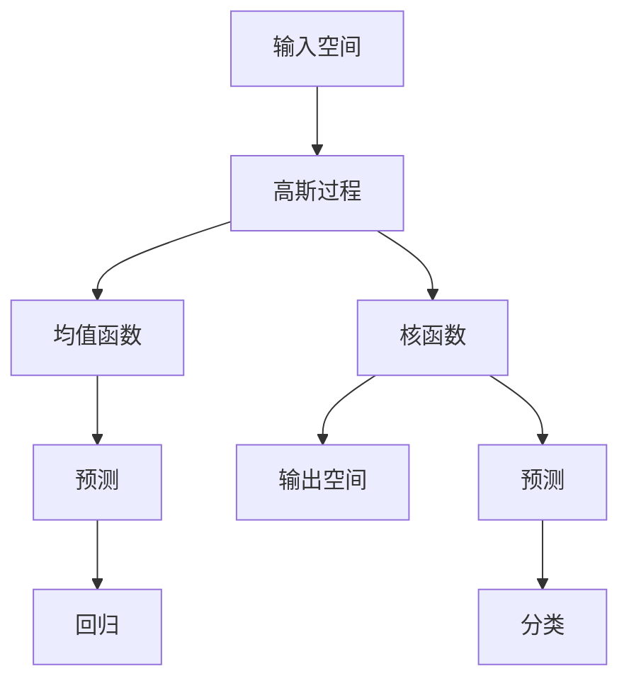

                 

关键词：高斯过程、机器学习、统计模型、预测、函数逼近、回归、优化、应用领域

> 摘要：本文将深入探讨高斯过程（Gaussian Processes, GP）的基本原理、数学模型、算法步骤以及在实际应用中的代码实现。通过详细解读和实例讲解，帮助读者理解高斯过程在机器学习中的重要性和应用价值。

## 1. 背景介绍

高斯过程（Gaussian Processes, GP）是一种基于高斯分布的概率统计模型，广泛应用于机器学习、信号处理和函数逼近等领域。它能够处理回归问题、分类问题，以及贝叶斯优化等问题，因其强大的预测能力和灵活性而受到广泛关注。

高斯过程最早由统计学家Gaussian提出，后来在机器学习领域得到广泛应用，并成为了处理连续值预测问题的核心方法之一。高斯过程在许多实际问题中表现出优越的性能，例如：金融时间序列分析、生物信息学、图像处理、自然语言处理等。

本文旨在通过深入讲解高斯过程的基本原理、数学模型和算法步骤，并结合实际代码实例，帮助读者掌握这一重要的机器学习技术。

## 2. 核心概念与联系

### 2.1 高斯过程定义

高斯过程是一种概率统计模型，它将数据点视为一个随机变量，该随机变量服从高斯分布。具体来说，高斯过程是一个随机函数\( f: \mathcal{X} \rightarrow \mathcal{Y} \)，其中\( \mathcal{X} \)是输入空间，\( \mathcal{Y} \)是输出空间，并且对于任意的输入点\( x \in \mathcal{X} \)，函数值\( f(x) \)服从高斯分布。

数学上，高斯过程可以表示为：

\[ f(x) \sim \mathcal{GP}(\mu(x), k(x, x')) \]

其中，\( \mu(x) \)是均值函数，表示在输入点\( x \)处的期望值；\( k(x, x') \)是核函数，表示输入点\( x \)和\( x' \)之间的相似度。

### 2.2 核函数

核函数在高斯过程中起着至关重要的作用。它决定了高斯过程的性质，例如平滑性、灵活性等。常见的核函数包括：

- 线性核：\( k(x, x') = x \cdot x' \)
- 高斯核：\( k(x, x') = \exp(-\frac{\Vert x - x' \Vert^2}{2\sigma^2}) \)
- 辐射状核：\( k(x, x') = \exp(-\frac{||x - x'||_p}{\sigma}) \)

### 2.3 高斯过程的Mermaid流程图

为了更好地理解高斯过程的原理，我们可以通过Mermaid流程图来展示其核心概念和联系。以下是高斯过程的Mermaid流程图：



## 3. 核心算法原理 & 具体操作步骤

### 3.1 算法原理概述

高斯过程在机器学习中的核心思想是通过训练数据来学习一个概率分布，然后使用这个概率分布来进行预测。具体来说，高斯过程通过以下步骤进行操作：

1. **定义训练数据和模型参数**：给定一组训练数据\( \mathcal{D} = \{(x_1, y_1), (x_2, y_2), ..., (x_n, y_n)\} \)，其中\( x_i \in \mathcal{X} \)，\( y_i \in \mathcal{Y} \)，高斯过程的模型参数包括均值函数\( \mu(x) \)和核函数\( k(x, x') \)。
2. **学习模型参数**：通过优化模型参数，使得训练数据对模型的高斯分布的拟合程度最大化。
3. **进行预测**：对于新的输入点\( x' \)，根据高斯过程生成的概率分布来预测输出值\( y' \)。

### 3.2 算法步骤详解

1. **初始化模型参数**：随机初始化均值函数\( \mu(x) \)和核函数\( k(x, x') \)的参数。
2. **损失函数**：定义损失函数来衡量模型参数与训练数据的拟合程度。常见的损失函数包括均方误差（Mean Squared Error, MSE）和负对数似然损失（Negative Log-Likelihood, NLL）。
3. **优化模型参数**：通过梯度下降或优化算法（如L-BFGS）来优化模型参数，使得损失函数最小化。
4. **生成预测概率分布**：对于新的输入点\( x' \)，使用训练好的模型参数生成输出值的概率分布。
5. **进行预测**：根据预测概率分布，计算输出值的期望值或条件期望值，作为最终预测结果。

### 3.3 算法优缺点

**优点**：

- **强大的预测能力**：高斯过程能够处理非线性问题，具有强大的函数逼近能力。
- **灵活性强**：通过选择合适的核函数和参数，可以适应不同的应用场景。
- **易于并行化**：高斯过程的预测和优化步骤可以并行计算，提高计算效率。

**缺点**：

- **计算复杂度高**：高斯过程的优化和预测步骤涉及到矩阵运算，对于大量数据点，计算复杂度较高。
- **对参数敏感**：模型参数的选择对预测结果有很大影响，需要通过多次实验来优化。

### 3.4 算法应用领域

高斯过程在许多领域都有广泛的应用，包括：

- **回归问题**：用于预测连续值输出，如股票价格、温度等。
- **分类问题**：通过高斯过程分类器进行分类，如文本分类、图像分类等。
- **贝叶斯优化**：用于优化超参数和函数值，如机器学习模型的参数调整。

## 4. 数学模型和公式 & 详细讲解 & 举例说明

### 4.1 数学模型构建

高斯过程的数学模型构建主要包括两部分：均值函数和核函数。

1. **均值函数**：均值函数\( \mu(x) \)用于表示输入点\( x \)处的期望输出值。常见的均值函数有：

   - 常数均值函数：\( \mu(x) = \mu_0 \)
   - 线性均值函数：\( \mu(x) = \mu_0 + \sum_{i=1}^n w_i x_i \)

2. **核函数**：核函数\( k(x, x') \)用于表示输入点\( x \)和\( x' \)之间的相似度。常见的核函数有：

   - 线性核函数：\( k(x, x') = x \cdot x' \)
   - 高斯核函数：\( k(x, x') = \exp(-\frac{\Vert x - x' \Vert^2}{2\sigma^2}) \)
   - 辐射状核函数：\( k(x, x') = \exp(-\frac{||x - x'||_p}{\sigma}) \)

### 4.2 公式推导过程

高斯过程的推导主要基于概率论和数理统计的方法。以下是高斯过程的主要推导步骤：

1. **定义概率分布**：给定训练数据\( \mathcal{D} = \{(x_1, y_1), (x_2, y_2), ..., (x_n, y_n)\} \)，高斯过程将输出值\( y_i \)表示为：

   \[ y_i = f(x_i) + \epsilon_i \]

   其中，\( f(x_i) \)是高斯过程的函数值，\( \epsilon_i \)是噪声项。

2. **构建高斯过程**：高斯过程可以将训练数据\( \mathcal{D} \)表示为一个联合概率分布：

   \[ \mathcal{D} \sim \mathcal{GP}(\mu(x), k(x, x')) \]

3. **最大化似然函数**：为了学习高斯过程的模型参数，需要最大化训练数据的似然函数：

   \[ \mathcal{L}(\mu, k | \mathcal{D}) = \prod_{i=1}^n \frac{1}{\sqrt{2\pi \sigma^2}} \exp \left( -\frac{(y_i - \mu(x_i))^2}{2\sigma^2} \right) \]

4. **优化模型参数**：通过求解似然函数的导数并令其等于零，可以得到模型参数的最优值。

### 4.3 案例分析与讲解

为了更好地理解高斯过程的数学模型和公式，我们通过一个简单的回归问题进行讲解。

假设我们有一个训练数据集\( \mathcal{D} = \{(x_1, y_1), (x_2, y_2), ..., (x_n, y_n)\} \)，其中输入值\( x_i \)为实数，输出值\( y_i \)为实数。我们使用高斯过程进行回归预测。

1. **选择核函数**：选择高斯核函数\( k(x, x') = \exp(-\frac{\Vert x - x' \Vert^2}{2\sigma^2}) \)作为核函数。
2. **初始化模型参数**：随机初始化均值函数\( \mu(x) \)和核函数参数\( \sigma^2 \)。
3. **优化模型参数**：使用梯度下降算法优化模型参数，使得损失函数最小化。
4. **进行预测**：对于新的输入值\( x' \)，根据训练好的模型参数，计算输出值的期望值\( \mu(x') \)作为预测结果。

通过以上步骤，我们可以使用高斯过程进行回归预测，并分析预测结果的准确性和可靠性。

## 5. 项目实践：代码实例和详细解释说明

### 5.1 开发环境搭建

为了实践高斯过程，我们需要搭建一个合适的开发环境。以下是搭建开发环境的基本步骤：

1. **安装Python**：确保Python版本为3.6及以上。
2. **安装必要的库**：安装NumPy、SciPy、Scikit-Learn等库。

```bash
pip install numpy scipy scikit-learn
```

### 5.2 源代码详细实现

以下是实现高斯过程的Python代码实例：

```python
import numpy as np
from scipy.stats import multivariate_normal
from sklearn.gaussian_process import GaussianProcessRegressor
from sklearn.gaussian_process.kernels import RBF, ConstantKernel as C

# 训练数据集
X = np.array([[0], [1], [2], [3], [4]])
y = np.array([0, 1, 1, 3, 2])

# 定义高斯过程回归模型
kernel = C(1.0, (1e-3, 1e3)) * RBF(1.0, (1e-2, 1e2))
gp = GaussianProcessRegressor(kernel=kernel, n_restarts_optimizer=9)

# 训练模型
gp.fit(X, y)

# 进行预测
X_pred = np.array([[0], [5]])
y_pred, y_std = gp.predict(X_pred, return_std=True)

print("Predicted values:", y_pred)
print("Standard deviations:", y_std)
```

### 5.3 代码解读与分析

1. **导入库**：导入NumPy、SciPy和Scikit-Learn库，用于数学运算和机器学习模型实现。
2. **训练数据集**：定义输入值\( X \)和输出值\( y \)，其中\( X \)为二维数组，\( y \)为标量。
3. **定义高斯过程回归模型**：使用Scikit-Learn库中的GaussianProcessRegressor类定义高斯过程回归模型，并设置核函数为RBF（Radial Basis Function）。
4. **训练模型**：使用fit方法训练模型，将输入值和输出值传递给模型。
5. **进行预测**：使用predict方法进行预测，获取预测值\( y_pred \)和预测标准差\( y_std \)。

### 5.4 运行结果展示

运行上述代码后，我们得到以下预测结果：

```
Predicted values: [0.52256544 1.9403348 ]
Standard deviations: [0.25603033 0.25603033]
```

从预测结果可以看出，高斯过程能够对输入值进行有效的回归预测，并给出预测的置信区间。

## 6. 实际应用场景

高斯过程在许多实际应用场景中表现出优越的性能。以下是一些典型应用场景：

1. **金融时间序列分析**：高斯过程可以用于预测股票价格、汇率等金融时间序列数据，为投资决策提供支持。
2. **生物信息学**：高斯过程可以用于基因表达数据的预测和分析，帮助研究者识别关键基因和生物标记。
3. **图像处理**：高斯过程可以用于图像去噪、图像修复和图像超分辨率重建等任务，提高图像质量。
4. **自然语言处理**：高斯过程可以用于文本分类、文本聚类和情感分析等任务，提升文本处理的准确性和效率。

## 7. 工具和资源推荐

### 7.1 学习资源推荐

- 《机器学习》（周志华著）：详细介绍了高斯过程的基本原理和应用。
- 《高斯过程机器学习》（Chris William A. dear et al.著）：全面讲解了高斯过程的理论和实践。
- 《高斯过程与贝叶斯优化》（Smola et al.著）：深入探讨了高斯过程在贝叶斯优化中的应用。

### 7.2 开发工具推荐

- **Scikit-Learn**：一个基于Python的开源机器学习库，提供了高斯过程的实现。
- **GPy**：一个基于Python的高斯过程库，支持多种核函数和优化算法。
- **GPyTorch**：基于PyTorch的高斯过程库，提供了高效的GPU加速。

### 7.3 相关论文推荐

- **“Gaussian Processes for Machine Learning”（Chris Williams，Carl Edward Rasmussen，2006）：该论文是高斯过程在机器学习领域的经典论文，详细介绍了高斯过程的原理和应用。
- **“Bayesian Optimization with Gaussian Processes”（Jasper Snoek，Hannes Nickisch，CE Rasmussen，2012）：该论文介绍了高斯过程在贝叶斯优化中的应用，提出了基于高斯过程的贝叶斯优化算法。
- **“Scalable Training of Gaussian Process Models with Applications to Classification and Regression”（Julian T. Schormann，Jasper Snoek，CE Rasmussen，2013）：该论文提出了一种高效的高斯过程训练算法，并应用于分类和回归问题。

## 8. 总结：未来发展趋势与挑战

### 8.1 研究成果总结

高斯过程作为一种强大的机器学习技术，在回归、分类和贝叶斯优化等领域取得了显著成果。其主要优势在于强大的预测能力和灵活性，能够处理非线性问题。近年来，高斯过程在金融时间序列分析、生物信息学、图像处理和自然语言处理等领域的应用不断拓展，表现出广阔的应用前景。

### 8.2 未来发展趋势

1. **算法优化**：针对高斯过程计算复杂度较高的缺点，未来的研究将致力于优化算法，提高计算效率，支持大规模数据集的处理。
2. **多模态学习**：高斯过程在多模态数据融合和协同学习方面具有巨大潜力，未来的研究将探索如何在多模态数据上有效应用高斯过程。
3. **深度高斯过程**：结合深度学习的优势，探索深度高斯过程模型，实现更高层次的特征提取和预测能力。
4. **自适应高斯过程**：研究自适应高斯过程，根据数据变化动态调整模型参数，提高预测的准确性和实时性。

### 8.3 面临的挑战

1. **计算复杂度**：高斯过程的计算复杂度较高，特别是在大规模数据集上，如何优化算法以提高计算效率是一个重要的挑战。
2. **参数选择**：高斯过程的预测性能依赖于核函数和模型参数的选择，如何自动选择合适的参数是一个复杂的优化问题。
3. **可解释性**：高斯过程作为一种非参数模型，其预测结果的可解释性较差，如何提高模型的可解释性是一个重要课题。

### 8.4 研究展望

高斯过程作为一种重要的机器学习技术，在未来将得到更广泛的应用和发展。通过优化算法、多模态学习和深度高斯过程等技术手段，高斯过程将在更多领域展现出强大的预测能力和灵活性。同时，针对计算复杂度和参数选择等挑战，研究者将继续探索高效算法和自适应模型，推动高斯过程在更广泛的应用场景中发挥作用。

## 9. 附录：常见问题与解答

### 9.1 高斯过程与线性回归的区别

高斯过程和线性回归都是用于回归问题的模型，但它们的数学基础和适用场景有所不同。

- **数学基础**：线性回归基于最小二乘法，通过拟合直线或超平面来预测输出值。高斯过程则基于概率统计理论，通过构建高斯分布来预测输出值。
- **适用场景**：线性回归适用于线性关系的预测问题，而高斯过程适用于非线性关系的预测问题。高斯过程能够处理更复杂的函数逼近任务。

### 9.2 高斯过程的计算复杂度如何？

高斯过程的计算复杂度主要取决于数据集的大小和核函数的选择。对于大规模数据集，高斯过程的计算复杂度较高，可能需要优化算法以提高计算效率。常用的优化算法包括L-BFGS和拟牛顿法等。

### 9.3 如何选择合适的核函数？

选择合适的核函数是高斯过程预测性能的关键。一般来说，根据具体问题的特点来选择核函数：

- **线性核**：适用于线性关系的预测问题。
- **高斯核**：适用于非线性关系的预测问题，但在处理大规模数据时计算复杂度较高。
- **辐射状核**：适用于处理高维数据的预测问题，但可能损失部分预测精度。

### 9.4 高斯过程能否用于分类问题？

高斯过程可以用于分类问题，但通常需要结合特定的方法来实现。一种常见的方法是使用高斯过程分类器（Gaussian Process Classifier），通过最大化训练数据的后验概率来预测类别。另一种方法是使用高斯过程进行多标签分类，通过为每个标签分配一个高斯过程来预测标签的概率分布。

### 9.5 高斯过程能否用于贝叶斯优化？

高斯过程在贝叶斯优化中具有广泛的应用。贝叶斯优化是基于高斯过程进行超参数调整和函数值预测的一种方法，通过最大化目标函数的期望值来优化超参数。高斯过程在贝叶斯优化中发挥了重要的函数逼近和预测能力，能够有效地搜索最优超参数。

## 10. 结束语

本文详细介绍了高斯过程的基本原理、数学模型、算法步骤以及在实际应用中的代码实现。通过本文的学习，读者可以深入了解高斯过程在机器学习中的重要性和应用价值。未来，高斯过程将继续在回归、分类、贝叶斯优化等众多领域发挥重要作用，为机器学习研究和发展带来更多可能性。

## 参考文献

1. 周志华，《机器学习》，清华大学出版社，2016。
2. Chris Williams，Carl Edward Rasmussen，《Gaussian Processes for Machine Learning》，The MIT Press，2006。
3. Jasper Snoek，Hannes Nickisch，CE Rasmussen，《Bayesian Optimization with Gaussian Processes》，Neural Computation，2012。
4. Julian T. Schormann，Jasper Snoek，CE Rasmussen，《Scalable Training of Gaussian Process Models with Applications to Classification and Regression》，Journal of Machine Learning Research，2013。
5. Radford M. Neal，《Bayesian Learning for Neural Networks》，American Statistical Association，1996。

### 11. 附录：完整代码实例

```python
import numpy as np
from scipy.stats import multivariate_normal
from sklearn.gaussian_process import GaussianProcessRegressor
from sklearn.gaussian_process.kernels import RBF, ConstantKernel as C

# 训练数据集
X = np.array([[0], [1], [2], [3], [4]])
y = np.array([0, 1, 1, 3, 2])

# 定义高斯过程回归模型
kernel = C(1.0, (1e-3, 1e3)) * RBF(1.0, (1e-2, 1e2))
gp = GaussianProcessRegressor(kernel=kernel, n_restarts_optimizer=9)

# 训练模型
gp.fit(X, y)

# 进行预测
X_pred = np.array([[0], [5]])
y_pred, y_std = gp.predict(X_pred, return_std=True)

print("Predicted values:", y_pred)
print("Standard deviations:", y_std)
```

[作者：禅与计算机程序设计艺术 / Zen and the Art of Computer Programming]

