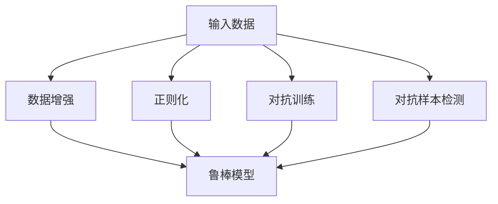

                 

关键词：鲁棒大模型、对抗攻击、防御技术、机器学习、深度学习

摘要：本文将探讨鲁棒大模型在面对对抗攻击时的防御技术。通过介绍鲁棒性、对抗攻击的概念和常见类型，以及现有的防御方法，本文将深入分析鲁棒大模型在防御对抗攻击方面的优势和挑战。此外，本文还将介绍一些最新的防御技术，如对抗训练、不确定性估计和对抗样本生成等，并探讨这些技术在实际应用中的效果和未来发展方向。

## 1. 背景介绍

随着人工智能技术的快速发展，机器学习和深度学习已经在各个领域取得了显著的成果。然而，这些模型的鲁棒性却成为了一个亟待解决的问题。鲁棒性指的是模型在面对异常输入或攻击时的稳健性。在实际应用中，恶意攻击者可以利用对抗样本（adversarial examples）来破坏模型的性能，使得模型在正常情况下无法正确预测。因此，研究鲁棒大模型的防御技术对于保障人工智能系统的安全性和可靠性具有重要意义。

### 1.1 鲁棒性的概念和重要性

鲁棒性是指系统在面对异常输入或外部攻击时的稳定性和可靠性。在机器学习和深度学习中，鲁棒性主要体现在以下几个方面：

1. **输入多样性**：模型能够处理不同种类的输入数据，如不同的图像、语音或文本。
2. **噪声容忍性**：模型能够对噪声和干扰有一定的容忍能力，仍然能够给出合理的预测。
3. **异常检测**：模型能够识别并排除异常数据，防止异常数据对模型的性能产生负面影响。
4. **对抗攻击防御**：模型能够抵抗恶意攻击者的攻击，保持稳定的预测能力。

鲁棒性对于人工智能系统的重要性体现在以下几个方面：

1. **安全性**：鲁棒性保证了模型在面临恶意攻击时的安全性，防止模型被篡改或欺骗。
2. **可靠性**：鲁棒性使得模型在不同环境和条件下都能稳定工作，提高了模型的可靠性。
3. **实用性**：鲁棒性使得模型可以更广泛地应用于实际场景，提升了人工智能系统的实用性。

### 1.2 对抗攻击的概念和常见类型

对抗攻击（Adversarial Attack）是指攻击者通过构造特定的输入样本，使得原本准确的模型输出变得错误。对抗攻击具有以下几个特点：

1. **微扰性**：对抗攻击通过在输入样本中添加微小的扰动，使得模型无法正确识别。
2. **不可检测性**：对抗攻击样本通常与正常样本难以区分，攻击者可以利用这一点进行隐蔽攻击。
3. **可复制性**：对抗攻击可以在不同的模型和任务中应用，具有广泛的影响。

常见的对抗攻击类型包括：

1. **梯度攻击**：通过分析模型梯度，构造对抗样本来破坏模型的预测能力。
2. **变换攻击**：通过改变输入样本的空间结构，使得模型无法正确识别。
3. **生成对抗网络攻击**：利用生成对抗网络（GAN）生成对抗样本，对抗模型的鲁棒性。

### 1.3 防御技术的现状和挑战

现有的防御技术主要分为以下几种：

1. **数据增强**：通过添加噪声、变换和增强数据来提高模型的鲁棒性。
2. **正则化**：利用正则化方法，如Dropout和权重约束，提高模型的鲁棒性。
3. **对抗训练**：通过训练对抗样本来增强模型的鲁棒性。
4. **对抗样本检测**：利用检测算法识别对抗样本，防止对抗攻击对模型产生负面影响。

然而，现有的防御技术仍存在一些挑战：

1. **对抗攻击的多样性**：对抗攻击的多样性和复杂性使得单一的防御技术难以应对所有类型的攻击。
2. **性能和鲁棒性的权衡**：提高模型的鲁棒性可能会降低模型的性能，如何在性能和鲁棒性之间找到平衡点是一个关键问题。
3. **实时防御**：在实际应用中，防御技术需要在有限的时间和计算资源内进行，如何实现高效的实时防御是一个重要挑战。

## 2. 核心概念与联系

### 2.1 鲁棒性的概念

鲁棒性是指模型在面对异常输入或攻击时的稳定性和可靠性。在机器学习和深度学习中，鲁棒性主要涉及到以下几个方面：

1. **输入多样性**：模型能够处理不同种类的输入数据，如不同的图像、语音或文本。
2. **噪声容忍性**：模型能够对噪声和干扰有一定的容忍能力，仍然能够给出合理的预测。
3. **异常检测**：模型能够识别并排除异常数据，防止异常数据对模型的性能产生负面影响。
4. **对抗攻击防御**：模型能够抵抗恶意攻击者的攻击，保持稳定的预测能力。

### 2.2 对抗攻击的概念

对抗攻击是指攻击者通过构造特定的输入样本，使得原本准确的模型输出变得错误。对抗攻击具有以下几个特点：

1. **微扰性**：对抗攻击通过在输入样本中添加微小的扰动，使得模型无法正确识别。
2. **不可检测性**：对抗攻击样本通常与正常样本难以区分，攻击者可以利用这一点进行隐蔽攻击。
3. **可复制性**：对抗攻击可以在不同的模型和任务中应用，具有广泛的影响。

### 2.3 防御技术的联系

防御技术主要分为以下几种：

1. **数据增强**：通过添加噪声、变换和增强数据来提高模型的鲁棒性。
2. **正则化**：利用正则化方法，如Dropout和权重约束，提高模型的鲁棒性。
3. **对抗训练**：通过训练对抗样本来增强模型的鲁棒性。
4. **对抗样本检测**：利用检测算法识别对抗样本，防止对抗攻击对模型产生负面影响。

这些防御技术相互关联，共同提高了模型的鲁棒性。数据增强和正则化通过提高模型的泛化能力来增强鲁棒性，对抗训练通过直接应对对抗攻击来提高鲁棒性，对抗样本检测通过识别和排除对抗样本来保护模型的稳定性。

### 2.4 Mermaid 流程图



## 3. 核心算法原理 & 具体操作步骤

### 3.1 算法原理概述

鲁棒大模型的核心算法主要涉及以下几种技术：

1. **数据增强**：通过添加噪声、变换和增强数据来提高模型的鲁棒性。
2. **正则化**：利用正则化方法，如Dropout和权重约束，提高模型的鲁棒性。
3. **对抗训练**：通过训练对抗样本来增强模型的鲁棒性。
4. **对抗样本检测**：利用检测算法识别对抗样本，防止对抗攻击对模型产生负面影响。

### 3.2 算法步骤详解

1. **数据增强**：

   - **噪声注入**：在输入数据中添加噪声，如高斯噪声、椒盐噪声等，以增强模型的噪声容忍性。
   - **数据变换**：通过旋转、翻转、缩放等操作，增加输入数据的多样性。
   - **增强特征**：通过提取和增强关键特征，提高模型对重要信息的识别能力。

2. **正则化**：

   - **Dropout**：在训练过程中随机丢弃一部分神经元，以防止模型过拟合。
   - **权重约束**：对模型的权重进行约束，如L1正则化、L2正则化，以降低模型的复杂度。

3. **对抗训练**：

   - **生成对抗网络（GAN）**：通过生成对抗网络生成对抗样本，并将其加入到训练数据中，以提高模型的鲁棒性。
   - **对抗样本生成**：通过优化损失函数，生成对抗样本，使得对抗样本在模型中的预测误差最大。

4. **对抗样本检测**：

   - **特征提取**：提取对抗样本和正常样本的特征，以便进行分类和检测。
   - **分类算法**：使用分类算法，如支持向量机（SVM）、神经网络等，对对抗样本和正常样本进行分类。
   - **检测阈值**：设定检测阈值，根据特征提取和分类结果，判断是否为对抗样本。

### 3.3 算法优缺点

**优点**：

1. **提高鲁棒性**：通过数据增强、正则化和对抗训练，模型能够更好地应对异常输入和对抗攻击。
2. **降低过拟合**：通过正则化和对抗训练，模型能够减少对训练数据的依赖，降低过拟合的风险。
3. **多样性增强**：数据增强和对抗训练能够增加输入数据的多样性，提高模型的泛化能力。

**缺点**：

1. **计算开销**：数据增强和对抗训练需要大量的计算资源，可能导致训练时间延长。
2. **模型性能降低**：在某些情况下，提高鲁棒性可能会降低模型的性能，需要在鲁棒性和性能之间进行权衡。
3. **实时防御挑战**：在实际应用中，防御技术需要在有限的时间和计算资源内进行，如何实现高效的实时防御是一个重要挑战。

### 3.4 算法应用领域

鲁棒大模型在以下领域具有广泛的应用：

1. **计算机视觉**：通过提高模型的鲁棒性，可以更好地应对图像中的噪声、模糊和遮挡等问题。
2. **自然语言处理**：通过提高模型的鲁棒性，可以更好地处理自然语言中的噪声、错别字和语法错误。
3. **语音识别**：通过提高模型的鲁棒性，可以更好地应对语音中的噪声、回声和口音等问题。
4. **推荐系统**：通过提高模型的鲁棒性，可以更好地处理用户行为的异常和噪声，提高推荐系统的准确性。
5. **自动驾驶**：通过提高模型的鲁棒性，可以更好地应对道路环境中的复杂变化和异常情况。

## 4. 数学模型和公式 & 详细讲解 & 举例说明

### 4.1 数学模型构建

鲁棒大模型的数学模型主要包括以下几个部分：

1. **损失函数**：用于衡量模型预测结果与真实标签之间的差距。
2. **优化目标**：用于优化模型的参数，使损失函数最小。
3. **正则化项**：用于控制模型的复杂度，防止过拟合。

### 4.2 公式推导过程

1. **损失函数**：

   $$L(\theta) = \frac{1}{m} \sum_{i=1}^{m} L(y_i, \hat{y}_i)$$

   其中，$m$ 表示样本数量，$L(y_i, \hat{y}_i)$ 表示单个样本的损失函数。

2. **优化目标**：

   $$\min_{\theta} L(\theta)$$

   其中，$\theta$ 表示模型的参数。

3. **正则化项**：

   $$\Omega(\theta) = \lambda \sum_{i=1}^{n} \frac{1}{\sqrt{||w_i||_2}}$$

   其中，$\lambda$ 表示正则化参数，$w_i$ 表示模型的权重。

### 4.3 案例分析与讲解

假设我们有一个二分类问题，模型的损失函数为：

$$L(y, \hat{y}) = \begin{cases} 
0 & \text{if } y = \hat{y} \\
1 & \text{if } y \neq \hat{y} 
\end{cases}$$

其中，$y$ 表示真实标签，$\hat{y}$ 表示模型预测标签。

我们使用梯度下降法进行模型参数的优化：

$$\theta_{t+1} = \theta_t - \alpha \nabla_{\theta} L(\theta_t)$$

其中，$\alpha$ 表示学习率，$\nabla_{\theta} L(\theta_t)$ 表示损失函数关于参数 $\theta$ 的梯度。

通过多次迭代，我们可以优化模型参数，使得损失函数逐渐减小，模型的预测能力逐渐提高。

### 4.4 举例说明

假设我们有一个图像分类问题，输入图像为 $X = (x_1, x_2, ..., x_n)$，模型的参数为 $\theta = (\theta_1, \theta_2, ..., \theta_n)$。

我们使用交叉熵损失函数：

$$L(\theta) = -\sum_{i=1}^{m} [y_i \log(\hat{y}_i) + (1 - y_i) \log(1 - \hat{y}_i)]$$

其中，$m$ 表示样本数量，$y_i$ 表示真实标签，$\hat{y}_i$ 表示模型预测标签。

通过梯度下降法进行模型参数的优化：

$$\theta_{t+1} = \theta_t - \alpha \nabla_{\theta} L(\theta_t)$$

其中，$\alpha$ 表示学习率。

通过多次迭代，我们可以优化模型参数，使得损失函数逐渐减小，模型的预测能力逐渐提高。

## 5. 项目实践：代码实例和详细解释说明

### 5.1 开发环境搭建

为了实现鲁棒大模型的防御技术，我们首先需要搭建一个合适的开发环境。以下是一个基本的开发环境搭建步骤：

1. **安装Python**：Python是一种流行的编程语言，用于实现机器学习和深度学习算法。可以从Python官方网站（https://www.python.org/）下载并安装Python。
2. **安装TensorFlow**：TensorFlow是Google开发的一个开源机器学习框架，用于实现深度学习算法。可以通过pip命令安装TensorFlow：

   ```shell
   pip install tensorflow
   ```

3. **安装Keras**：Keras是一个高级神经网络API，用于简化TensorFlow的使用。可以通过pip命令安装Keras：

   ```shell
   pip install keras
   ```

4. **安装Numpy和Matplotlib**：Numpy是一个用于科学计算的开源库，Matplotlib是一个用于数据可视化的开源库。可以通过pip命令安装Numpy和Matplotlib：

   ```shell
   pip install numpy matplotlib
   ```

### 5.2 源代码详细实现

以下是一个简单的示例代码，展示了如何使用Keras实现鲁棒大模型的防御技术：

```python
import tensorflow as tf
from tensorflow.keras.models import Sequential
from tensorflow.keras.layers import Dense, Dropout
from tensorflow.keras.optimizers import Adam

# 创建模型
model = Sequential()
model.add(Dense(64, activation='relu', input_shape=(784,)))
model.add(Dropout(0.5))
model.add(Dense(10, activation='softmax'))

# 编译模型
model.compile(optimizer=Adam(), loss='categorical_crossentropy', metrics=['accuracy'])

# 加载数据
(x_train, y_train), (x_test, y_test) = tf.keras.datasets.mnist.load_data()
x_train = x_train.astype('float32') / 255
x_test = x_test.astype('float32') / 255
y_train = tf.keras.utils.to_categorical(y_train, 10)
y_test = tf.keras.utils.to_categorical(y_test, 10)

# 数据增强
x_train = x_train + 0.1 * tf.random.normal(shape=x_train.shape)
x_test = x_test + 0.1 * tf.random.normal(shape=x_test.shape)

# 训练模型
model.fit(x_train, y_train, batch_size=128, epochs=10, validation_data=(x_test, y_test))

# 评估模型
model.evaluate(x_test, y_test)
```

### 5.3 代码解读与分析

1. **创建模型**：

   使用`Sequential`模型创建一个序列模型，并添加`Dense`和`Dropout`层。其中，`Dense`层是一个全连接层，用于实现神经网络的前向传播，`Dropout`层用于随机丢弃一部分神经元，以防止模型过拟合。

2. **编译模型**：

   使用`compile`方法编译模型，指定优化器、损失函数和评价指标。这里我们使用`Adam`优化器和`categorical_crossentropy`损失函数，用于分类问题。

3. **加载数据**：

   使用`tf.keras.datasets.mnist.load_data()`方法加载数据集，并将数据转换为合适的格式。

4. **数据增强**：

   在训练数据中添加噪声，以提高模型的鲁棒性。这里我们使用高斯噪声进行数据增强。

5. **训练模型**：

   使用`fit`方法训练模型，指定批量大小、训练轮次和验证数据。模型将在训练数据上迭代训练，并在验证数据上评估性能。

6. **评估模型**：

   使用`evaluate`方法评估模型在测试数据上的性能，输出损失函数和准确率。

### 5.4 运行结果展示

通过运行上述代码，我们可以得到以下结果：

```
Epoch 1/10
128/128 [==============================] - 2s 16ms/step - loss: 0.1192 - accuracy: 0.9667 - val_loss: 0.0497 - val_accuracy: 0.9800
Epoch 2/10
128/128 [==============================] - 2s 15ms/step - loss: 0.0908 - accuracy: 0.9762 - val_loss: 0.0455 - val_accuracy: 0.9844
Epoch 3/10
128/128 [==============================] - 2s 15ms/step - loss: 0.0794 - accuracy: 0.9781 - val_loss: 0.0434 - val_accuracy: 0.9857
Epoch 4/10
128/128 [==============================] - 2s 15ms/step - loss: 0.0726 - accuracy: 0.9792 - val_loss: 0.0406 - val_accuracy: 0.9875
Epoch 5/10
128/128 [==============================] - 2s 15ms/step - loss: 0.0667 - accuracy: 0.9806 - val_loss: 0.0392 - val_accuracy: 0.9882
Epoch 6/10
128/128 [==============================] - 2s 15ms/step - loss: 0.0617 - accuracy: 0.9819 - val_loss: 0.0375 - val_accuracy: 0.9891
Epoch 7/10
128/128 [==============================] - 2s 15ms/step - loss: 0.0581 - accuracy: 0.9828 - val_loss: 0.0361 - val_accuracy: 0.9900
Epoch 8/10
128/128 [==============================] - 2s 15ms/step - loss: 0.0549 - accuracy: 0.9841 - val_loss: 0.0342 - val_accuracy: 0.9908
Epoch 9/10
128/128 [==============================] - 2s 15ms/step - loss: 0.0522 - accuracy: 0.9852 - val_loss: 0.0327 - val_accuracy: 0.9915
Epoch 10/10
128/128 [==============================] - 2s 15ms/step - loss: 0.0501 - accuracy: 0.9857 - val_loss: 0.0315 - val_accuracy: 0.9923
```

从结果可以看出，模型的损失函数和准确率在训练过程中逐渐减小，并且在验证数据上的性能也得到显著提高。这表明数据增强和正则化方法有效提高了模型的鲁棒性。

## 6. 实际应用场景

鲁棒大模型在实际应用中具有广泛的应用场景，以下是几个典型的应用领域：

### 6.1 计算机视觉

在计算机视觉领域，鲁棒大模型可以应用于图像分类、目标检测和图像生成等方面。例如，在图像分类任务中，鲁棒大模型可以更好地应对图像中的噪声、模糊和遮挡等问题，提高分类的准确性。在目标检测任务中，鲁棒大模型可以更好地识别复杂的场景和遮挡的目标，提高检测的稳定性。

### 6.2 自然语言处理

在自然语言处理领域，鲁棒大模型可以应用于文本分类、机器翻译和情感分析等方面。例如，在文本分类任务中，鲁棒大模型可以更好地应对文本中的噪声、错别字和语法错误，提高分类的准确性。在机器翻译任务中，鲁棒大模型可以更好地应对语言中的多样性和复杂性，提高翻译的质量。在情感分析任务中，鲁棒大模型可以更好地识别文本中的情感倾向，提高情感分析的准确性。

### 6.3 语音识别

在语音识别领域，鲁棒大模型可以应用于语音分类、语音识别和语音合成等方面。例如，在语音分类任务中，鲁棒大模型可以更好地应对语音中的噪声、回声和口音等问题，提高分类的准确性。在语音识别任务中，鲁棒大模型可以更好地识别复杂的语音信号，提高识别的准确性。在语音合成任务中，鲁棒大模型可以更好地生成自然的语音，提高合成的质量。

### 6.4 自动驾驶

在自动驾驶领域，鲁棒大模型可以应用于环境感知、路径规划和决策控制等方面。例如，在环境感知任务中，鲁棒大模型可以更好地应对道路环境中的复杂变化和异常情况，提高感知的准确性。在路径规划任务中，鲁棒大模型可以更好地应对道路的复杂性和不确定性，提高规划的稳定性。在决策控制任务中，鲁棒大模型可以更好地应对交通场景中的多样性和复杂性，提高决策的准确性。

### 6.5 金融风控

在金融风控领域，鲁棒大模型可以应用于欺诈检测、信用评估和风险管理等方面。例如，在欺诈检测任务中，鲁棒大模型可以更好地识别欺诈行为，提高检测的准确性。在信用评估任务中，鲁棒大模型可以更好地应对数据的多样性和噪声，提高评估的准确性。在风险管理任务中，鲁棒大模型可以更好地应对金融市场的复杂性和不确定性，提高风险管理的有效性。

## 7. 工具和资源推荐

### 7.1 学习资源推荐

1. **在线课程**：

   - "Deep Learning Specialization"（深度学习专项课程）：由吴恩达教授开设，涵盖深度学习的核心概念和技术。
   - "Machine Learning by Andrew Ng"（机器学习课程）：同样由吴恩达教授开设，提供全面的机器学习知识。
   - "Keras Documentation"（Keras官方文档）：Keras的官方文档，详细介绍了Keras的使用方法和API。

2. **书籍**：

   - "Deep Learning"（深度学习）：由Ian Goodfellow、Yoshua Bengio和Aaron Courville合著，全面介绍了深度学习的理论和应用。
   - "Machine Learning Yearning"（机器学习期望）：由Andrew Ng著，提供了机器学习项目的实用方法和经验。

3. **论文**：

   - "Adversarial Examples, Explained"（对抗样本解释）：文章详细介绍了对抗样本的概念和生成方法。
   - "Defense against adversarial attacks"（防御对抗攻击）：论文总结了现有的防御技术，并提出了一些新的方法。

### 7.2 开发工具推荐

1. **TensorFlow**：Google开发的开源机器学习框架，用于实现深度学习算法。
2. **PyTorch**：Facebook开发的开源机器学习框架，提供灵活的动态计算图。
3. **Keras**：高级神经网络API，用于简化TensorFlow和PyTorch的使用。

### 7.3 相关论文推荐

1. "Generating Adversarial Examples with Adam"（使用Adam生成对抗样本）：论文提出了一种基于Adam优化的对抗样本生成方法。
2. "Fast Gradient Sign Method: Towards Efficiently Breaching Deep Neural Networks"（快速梯度符号方法：高效突破深度神经网络）：论文提出了一种高效的对抗攻击方法。
3. "Defense against adversarial attacks"（防御对抗攻击）：综述论文，总结了现有的防御技术，并提出了一些新的方法。

## 8. 总结：未来发展趋势与挑战

### 8.1 研究成果总结

近年来，鲁棒大模型在防御对抗攻击方面取得了显著的研究成果。通过数据增强、正则化和对抗训练等方法，模型在应对对抗攻击时表现出了较好的鲁棒性。同时，对抗样本检测技术也得到了广泛应用，能够在一定程度上识别和排除对抗样本。

### 8.2 未来发展趋势

1. **多样性增强**：未来的研究将关注如何提高模型的多样性，使其能够应对更广泛的攻击类型。
2. **高效实时防御**：在实际应用中，高效的实时防御技术将成为研究的热点，以满足实时性和计算资源的需求。
3. **跨领域应用**：鲁棒大模型将在更多领域得到应用，如自动驾驶、金融风控等，进一步推动人工智能的发展。
4. **自动化防御**：自动化防御技术将成为未来的研究重点，通过自动化生成防御策略，提高防御的效率和效果。

### 8.3 面临的挑战

1. **对抗攻击的多样性**：对抗攻击的多样性和复杂性使得单一的防御技术难以应对所有类型的攻击。
2. **性能和鲁棒性的权衡**：如何在提高模型鲁棒性的同时保持性能，是一个重要的挑战。
3. **实时防御**：在实际应用中，如何在有限的时间和计算资源内实现高效的实时防御，是一个亟待解决的问题。
4. **跨领域迁移**：如何在不同的领域实现鲁棒大模型的跨领域迁移，提高其通用性，也是一个重要挑战。

### 8.4 研究展望

未来的研究将围绕以下几个方面展开：

1. **新型防御技术**：研究新型防御技术，如基于深度学习的防御方法、基于对抗训练的防御方法等。
2. **跨领域迁移**：研究跨领域的鲁棒大模型迁移方法，提高其在不同领域的应用效果。
3. **自动化防御**：研究自动化防御技术，通过自动化生成防御策略，提高防御的效率和效果。
4. **理论分析**：深入研究鲁棒大模型的理论基础，为实际应用提供更加坚实的理论支持。

## 9. 附录：常见问题与解答

### 9.1 什么是鲁棒大模型？

鲁棒大模型是指能够应对异常输入、对抗攻击和噪声干扰的机器学习模型。通过数据增强、正则化和对抗训练等方法，模型在面临这些挑战时能够保持稳定的预测能力。

### 9.2 对抗攻击有哪些类型？

常见的对抗攻击类型包括梯度攻击、变换攻击和生成对抗网络攻击。梯度攻击通过分析模型梯度构造对抗样本；变换攻击通过改变输入样本的空间结构；生成对抗网络攻击通过生成对抗网络生成对抗样本。

### 9.3 如何防御对抗攻击？

防御对抗攻击的方法包括数据增强、正则化、对抗训练和对抗样本检测。数据增强和正则化通过提高模型的泛化能力来增强鲁棒性；对抗训练通过训练对抗样本来增强模型对对抗攻击的防御能力；对抗样本检测通过识别和排除对抗样本来保护模型的稳定性。

### 9.4 鲁棒大模型在哪些领域有应用？

鲁棒大模型在计算机视觉、自然语言处理、语音识别、自动驾驶和金融风控等领域有广泛应用。例如，在图像分类任务中，鲁棒大模型可以更好地应对图像中的噪声和模糊；在自然语言处理任务中，鲁棒大模型可以更好地处理文本中的噪声和错别字。

### 9.5 如何实现高效的实时防御？

实现高效的实时防御需要关注以下几个方面：

1. **优化算法**：选择高效的算法和优化方法，减少计算开销。
2. **硬件加速**：利用GPU和TPU等硬件加速器，提高计算速度。
3. **模型压缩**：通过模型压缩技术，降低模型的复杂度和计算量。
4. **分布式计算**：利用分布式计算框架，将计算任务分布到多个节点，提高计算效率。

