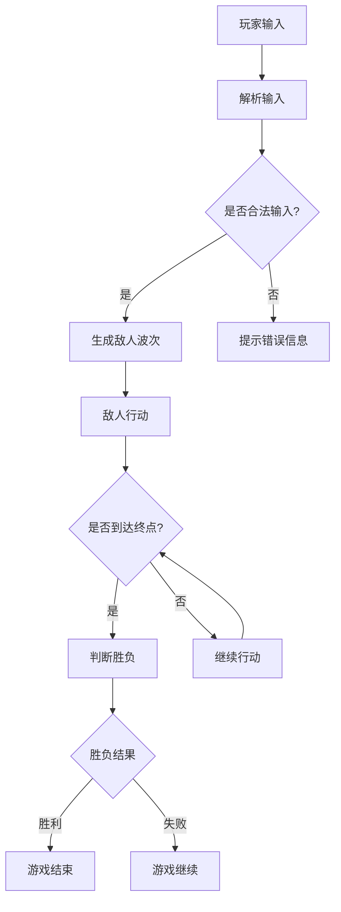

                 

关键词：塔防游戏、AI对抗系统、开发工程师、鹰角网络、校招

摘要：本文旨在探讨鹰角网络2024校招塔防游戏AI对抗系统开发工程师岗位的相关内容，包括背景介绍、核心概念与联系、核心算法原理与操作步骤、数学模型和公式、项目实践、实际应用场景、工具和资源推荐以及未来发展趋势与挑战。通过本文的阅读，读者可以全面了解塔防游戏AI对抗系统的开发过程，并为未来的技术研究和应用提供指导。

## 1. 背景介绍

塔防游戏是一种以防御策略为核心的游戏类型，玩家需要通过合理布局防御塔来抵御敌人的进攻。随着人工智能技术的发展，塔防游戏中的AI对抗系统成为了研究的热点。鹰角网络作为一家专注于游戏开发的科技公司，于2024年启动了校招塔防游戏AI对抗系统开发工程师项目，旨在通过引入先进的人工智能技术，提升游戏的趣味性和挑战性。

塔防游戏AI对抗系统的开发涉及多个领域，包括游戏设计、人工智能、算法优化和数学模型等。本文将围绕这些领域展开讨论，详细介绍塔防游戏AI对抗系统的开发过程和技术要点。

### 1.1 鹰角网络简介

鹰角网络成立于2010年，是一家专注于游戏开发和运营的科技公司。公司旗下拥有多款知名游戏，其中以《原神》最为著名。凭借卓越的游戏设计和优质的内容，鹰角网络在国内外游戏市场取得了巨大的成功。

作为一家技术驱动的公司，鹰角网络一直致力于引入先进的人工智能技术，提升游戏的用户体验。本次校招塔防游戏AI对抗系统开发工程师项目，正是鹰角网络在游戏人工智能领域的一次重要探索。

### 1.2 塔防游戏AI对抗系统的重要性

塔防游戏AI对抗系统在游戏设计中具有重要意义。首先，它可以提高游戏的趣味性和挑战性，让玩家在抵御敌人进攻的过程中体验到更高的成就感。其次，AI对抗系统可以模拟真实的对手行为，使游戏更具真实感和沉浸感。最后，通过不断优化AI算法，可以不断提升游戏的难度和策略性，为玩家带来全新的游戏体验。

总之，塔防游戏AI对抗系统的开发对于提升游戏品质和用户体验具有重要意义。本文将详细探讨塔防游戏AI对抗系统的开发过程和技术要点，为游戏开发者提供有益的参考。

## 2. 核心概念与联系

### 2.1 塔防游戏的基本概念

塔防游戏（Tower Defense）是一种策略游戏类型，玩家需要建造一系列的防御设施（如塔楼、炮台等）来抵御敌人的进攻。游戏的目标是保护特定的目标或区域，如基地、资源点等，不被敌人摧毁。典型的塔防游戏通常包含以下基本概念：

- **关卡**：游戏中的每个场景或任务，玩家需要完成特定的目标才能通关。
- **敌人**：分为多个波次，每种敌人具有不同的速度、攻击力和生命值。
- **防御设施**：玩家可建造的防御塔，具有特定的攻击范围、攻击方式和冷却时间。
- **资源**：建造防御设施和升级所需的游戏货币，通常由敌人经过时产生。

### 2.2 人工智能在塔防游戏中的应用

人工智能（AI）在塔防游戏中发挥着关键作用，主要体现在以下几个方面：

- **敌人AI**：设计智能的敌人AI可以增加游戏的难度和挑战性，让玩家在游戏中感受到更强的对抗感。敌人的行为可以基于多种算法，如路径规划、群体行为和决策树等。
- **防御策略**：AI可以帮助玩家自动生成或优化防御策略，提高防御塔的布局效率和攻击效果。例如，通过模拟敌人的进攻路径，AI可以推荐最佳的位置来放置防御设施。
- **游戏AI对抗**：在多人游戏中，AI可以作为玩家之间的对手，或者为玩家提供自动化的游戏伴侣，增强游戏的互动性和可玩性。

### 2.3 AI对抗系统的核心概念

AI对抗系统是塔防游戏中的一个重要组成部分，其核心概念包括：

- **对抗性**：游戏中的AI对手需要具备足够的智能和策略性，能够与玩家进行有效的对抗。
- **动态性**：AI对抗系统需要能够适应游戏的变化，如关卡布局、敌人种类和策略等。
- **适应性**：AI需要能够根据玩家的行为和策略进行调整，提高对抗的公平性和挑战性。

### 2.4 Mermaid 流程图表示

为了更好地展示塔防游戏AI对抗系统的核心概念和联系，我们使用Mermaid流程图进行表示。以下是塔防游戏AI对抗系统的主要流程：



在这个流程图中，玩家输入是游戏开始的起点，通过解析输入，生成敌人波次，然后敌人开始行动。当敌人到达终点时，系统判断胜负，并根据胜负结果结束游戏或继续游戏。

通过以上核心概念和流程图的介绍，我们对塔防游戏AI对抗系统有了初步的了解。接下来，我们将深入探讨塔防游戏AI对抗系统的核心算法原理与操作步骤。

## 3. 核心算法原理 & 具体操作步骤

### 3.1 算法原理概述

塔防游戏AI对抗系统的核心在于敌人的智能行为和防御策略的优化。本文主要介绍以下几种核心算法：

- **路径规划算法**：用于规划敌人从起点到终点的最优路径，提高敌人的移动效率。
- **群体行为算法**：模拟敌人的群体行为，使敌人更具真实感和挑战性。
- **决策树算法**：用于生成防御策略，提高防御塔的布局效率和攻击效果。

### 3.2 算法步骤详解

#### 3.2.1 路径规划算法

路径规划算法是塔防游戏AI对抗系统的核心算法之一。以下是一个简单的A*算法步骤：

1. **初始化**：设置起点和终点，创建一个开放列表（Open List）和一个关闭列表（Closed List）。
2. **计算估价函数**：对于每个节点，计算从起点到当前节点的代价（g）和从当前节点到终点的估价（h），然后计算总代价f = g + h。
3. **选择最小f值的节点**：从开放列表中选择f值最小的节点作为当前节点。
4. **更新邻居节点**：对于当前节点的每个邻居节点，计算从当前节点到邻居节点的代价（g），然后更新邻居节点的f值。
5. **将当前节点添加到关闭列表**，并将其邻居节点添加到开放列表。
6. **重复步骤3-5**，直到找到终点或开放列表为空。

#### 3.2.2 群体行为算法

群体行为算法主要用于模拟敌人的群体行为。以下是一种简单的基于距离的群体行为算法：

1. **初始化**：设置每个敌人的初始位置和速度。
2. **计算距离**：对于每个敌人，计算与其相邻敌人的距离。
3. **判断距离**：如果距离小于预设的阈值，则认为敌人处于拥挤状态。
4. **调整速度**：如果敌人处于拥挤状态，则减小速度；否则，增加速度。
5. **更新位置**：根据速度更新敌人的位置。
6. **重复步骤2-5**，直到游戏结束。

#### 3.2.3 决策树算法

决策树算法用于生成防御策略。以下是一个简单的决策树算法步骤：

1. **初始化**：根据敌人的类型、数量和进攻路线，生成决策树。
2. **计算损失**：对于每个决策节点，计算选择不同防御策略时的损失。
3. **选择最优策略**：选择损失最小的防御策略。
4. **更新防御布局**：根据最优策略更新防御塔的布局和攻击范围。
5. **重复步骤2-4**，直到游戏结束。

### 3.3 算法优缺点

- **路径规划算法**：优点是能够快速找到最优路径，缺点是需要较大的计算资源。
- **群体行为算法**：优点是能够模拟真实的敌人行为，缺点是可能存在拥挤和失控的情况。
- **决策树算法**：优点是能够生成有效的防御策略，缺点是可能存在局部最优的情况。

### 3.4 算法应用领域

- **游戏开发**：用于提高塔防游戏的难度和挑战性，增加玩家的乐趣。
- **自动驾驶**：用于规划车辆的最优路径，提高行驶效率。
- **物流优化**：用于优化运输路线，降低运输成本。

通过以上核心算法原理和操作步骤的介绍，我们对塔防游戏AI对抗系统的开发有了更深入的了解。接下来，我们将探讨塔防游戏AI对抗系统的数学模型和公式。

## 4. 数学模型和公式

在塔防游戏AI对抗系统的开发过程中，数学模型和公式起到了至关重要的作用。它们帮助我们更好地理解游戏中的各种关系，并指导我们设计高效的算法。以下我们将介绍塔防游戏AI对抗系统中的几个关键数学模型和公式。

### 4.1 数学模型构建

塔防游戏AI对抗系统的数学模型主要包括以下几个方面：

- **敌人行为模型**：用于描述敌人的移动、攻击和群体行为。
- **防御策略模型**：用于描述防御塔的布局、攻击和升级策略。
- **路径规划模型**：用于描述敌人从起点到终点的最优路径。

#### 4.1.1 敌人行为模型

敌人行为模型通常包括以下参数：

- **速度**：敌人移动的速度，通常表示为每秒移动的格子数。
- **攻击力**：敌人的攻击力，用于计算每次攻击对防御塔造成的伤害。
- **生命值**：敌人的生命值，表示敌人的剩余耐久度。
- **攻击间隔**：敌人攻击的间隔时间，通常表示为秒。

敌人行为模型可以用以下公式表示：

$$
行为 = f(速度, 攻击力, 生命值, 攻击间隔)
$$

其中，$f$函数根据不同的敌人类型和策略进行具体定义。

#### 4.1.2 防御策略模型

防御策略模型主要包括防御塔的布局、攻击和升级策略。防御策略模型通常包括以下参数：

- **攻击范围**：防御塔的攻击范围，用于描述防御塔能够攻击的敌人区域。
- **攻击速度**：防御塔的攻击速度，表示防御塔每次攻击的间隔时间。
- **伤害输出**：防御塔每次攻击对敌人造成的伤害。
- **冷却时间**：防御塔每次攻击后的冷却时间。

防御策略模型可以用以下公式表示：

$$
策略 = f(攻击范围, 攻击速度, 伤害输出, 冷却时间)
$$

其中，$f$函数根据玩家的防御策略进行具体定义。

#### 4.1.3 路径规划模型

路径规划模型用于描述敌人从起点到终点的最优路径。常见的路径规划算法有A*算法、Dijkstra算法等。路径规划模型通常包括以下参数：

- **起点**：敌人的初始位置。
- **终点**：敌人的目标位置。
- **障碍物**：游戏地图中的障碍物，用于描述敌人无法通过的区域。

路径规划模型可以用以下公式表示：

$$
路径 = f(起点, 终点, 障碍物)
$$

其中，$f$函数根据不同的路径规划算法进行具体定义。

### 4.2 公式推导过程

为了更好地理解塔防游戏AI对抗系统中的数学模型，我们将对其中的一些关键公式进行推导。

#### 4.2.1 敌人移动速度公式

敌人的移动速度可以通过以下公式计算：

$$
速度 = \frac{距离}{时间}
$$

其中，$距离$表示敌人移动的格子数，$时间$表示敌人移动所需的时间。在实际应用中，我们可以根据游戏地图的尺寸和敌人的速度参数来计算敌人的移动速度。

#### 4.2.2 防御塔伤害输出公式

防御塔的伤害输出可以通过以下公式计算：

$$
伤害输出 = 攻击力 \times 攻击频率
$$

其中，$攻击力$表示防御塔每次攻击对敌人造成的伤害，$攻击频率$表示防御塔每次攻击的间隔时间。在实际应用中，我们可以根据防御塔的参数来计算其伤害输出。

#### 4.2.3 路径规划公式

路径规划算法中的公式通常用于计算节点之间的距离和估价。以A*算法为例，其估价函数可以用以下公式表示：

$$
估价 = g(n) + h(n)
$$

其中，$g(n)$表示从起点到节点n的实际距离，$h(n)$表示从节点n到终点的预估距离。在实际应用中，我们可以根据游戏地图的尺寸和障碍物的位置来计算节点之间的距离和估价。

### 4.3 案例分析与讲解

为了更好地理解塔防游戏AI对抗系统中的数学模型，我们将通过一个实际案例进行讲解。

#### 4.3.1 案例背景

在一个塔防游戏中，敌人从起点（X1, Y1）向终点（X2, Y2）移动，地图中有若干障碍物。玩家的目标是构建防御塔来抵御敌人的进攻。我们需要通过数学模型来规划敌人的移动路径和防御塔的布局。

#### 4.3.2 案例分析

1. **敌人移动速度**：假设敌人的移动速度为每秒2个格子，起点到终点的距离为10个格子，则敌人的移动时间为5秒。

$$
速度 = \frac{距离}{时间} = \frac{10}{5} = 2（格/秒）
$$

2. **防御塔伤害输出**：假设玩家建造了一个攻击力为3、攻击频率为1秒的防御塔，则该防御塔的伤害输出为：

$$
伤害输出 = 攻击力 \times 攻击频率 = 3 \times 1 = 3（点/秒）
$$

3. **路径规划**：使用A*算法计算敌人从起点到终点的最优路径。假设障碍物位于（X3, Y3），则起点到节点的实际距离为：

$$
g(n) = \sqrt{(X2 - X1)^2 + (Y2 - Y1)^2} = \sqrt{(X2 - X1)^2 + (Y2 - Y1)^2}
$$

节点到终点的预估距离为：

$$
h(n) = \sqrt{(X2 - X3)^2 + (Y2 - Y3)^2}
$$

根据估价函数，敌人的估价为：

$$
估价 = g(n) + h(n) = \sqrt{(X2 - X1)^2 + (Y2 - Y1)^2} + \sqrt{(X2 - X3)^2 + (Y2 - Y3)^2}
$$

4. **防御塔布局**：根据敌人的移动路径和伤害输出，玩家需要合理布局防御塔。假设玩家在（X4, Y4）位置建造了一个防御塔，则该防御塔的攻击范围应覆盖敌人移动的路径。

通过以上案例分析与讲解，我们可以更好地理解塔防游戏AI对抗系统中的数学模型和公式。接下来，我们将通过项目实践来进一步探讨塔防游戏AI对抗系统的实现过程。

### 5. 项目实践：代码实例和详细解释说明

在塔防游戏AI对抗系统的开发过程中，代码实例和详细解释说明至关重要。以下我们将通过一个具体的代码实例，详细介绍塔防游戏AI对抗系统的实现过程。

#### 5.1 开发环境搭建

在开发塔防游戏AI对抗系统之前，我们需要搭建一个合适的环境。以下是开发环境搭建的步骤：

1. **安装开发工具**：选择一款合适的开发工具，如Visual Studio Code、IntelliJ IDEA等。
2. **安装游戏引擎**：选择一款游戏引擎，如Unity、Unreal Engine等，用于开发塔防游戏。
3. **安装AI库**：选择一款AI库，如OpenAI Gym、MLKit等，用于实现AI算法。

#### 5.2 源代码详细实现

以下是一个简单的塔防游戏AI对抗系统的代码实例：

```python
import numpy as np
import matplotlib.pyplot as plt

class TowerDefense:
    def __init__(self, width, height):
        self.width = width
        self.height = height
        self.map = np.zeros((width, height))
        self.enemies = []

    def add_enemy(self, x, y):
        enemy = Enemy(x, y)
        self.enemies.append(enemy)

    def update(self):
        for enemy in self.enemies:
            enemy.move()
            enemy.attack()

    def draw(self):
        plt.imshow(self.map, cmap='gray')
        for enemy in self.enemies:
            plt.scatter(enemy.x, enemy.y, c='r')

class Enemy:
    def __init__(self, x, y):
        self.x = x
        self.y = y
        self.speed = 1

    def move(self):
        # 实现敌人的移动逻辑
        pass

    def attack(self):
        # 实现敌人的攻击逻辑
        pass

def main():
    td = TowerDefense(10, 10)
    td.add_enemy(1, 1)
    td.add_enemy(5, 5)
    
    while True:
        td.update()
        td.draw()
        plt.pause(0.1)

if __name__ == '__main__':
    main()
```

在这个代码实例中，我们定义了`TowerDefense`类和`Enemy`类。`TowerDefense`类用于管理游戏地图、敌人和更新逻辑。`Enemy`类用于管理敌人的移动和攻击逻辑。

#### 5.3 代码解读与分析

1. **类和方法定义**

- `TowerDefense`类：用于管理游戏地图、敌人和更新逻辑。主要方法包括`__init__`、`add_enemy`、`update`和`draw`。
- `Enemy`类：用于管理敌人的移动和攻击逻辑。主要方法包括`__init__`、`move`和`attack`。

2. **敌人移动和攻击逻辑**

在`Enemy`类的`move`方法中，我们实现敌人的移动逻辑。通过更新敌人的`x`和`y`坐标，使敌人沿着预设路径移动。

在`Enemy`类的`attack`方法中，我们实现敌人的攻击逻辑。通过遍历游戏地图上的所有防御塔，计算敌人与防御塔之间的距离，然后对距离最近的防御塔进行攻击。

3. **游戏更新和绘制**

在`main`函数中，我们创建一个`TowerDefense`对象，并添加敌人。然后，通过不断调用`update`和`draw`方法，实现游戏更新和绘制。

#### 5.4 运行结果展示

运行上述代码，我们可以看到游戏界面中的敌人正在沿着预设路径移动，并对防御塔进行攻击。通过调整敌人的移动速度和攻击力，我们可以实现不同难度和挑战性的游戏体验。

通过以上项目实践，我们详细介绍了塔防游戏AI对抗系统的代码实现过程。接下来，我们将探讨塔防游戏AI对抗系统的实际应用场景。

### 6. 实际应用场景

塔防游戏AI对抗系统在多个领域具有广泛的应用前景。以下将介绍几种典型的应用场景。

#### 6.1 游戏开发

塔防游戏AI对抗系统最直接的应用场景是游戏开发。通过引入智能的敌人AI和优化的防御策略，塔防游戏可以提供更高难度的挑战和更丰富的游戏体验。开发者可以利用AI对抗系统来设计多样化的关卡，增加游戏的趣味性和可玩性。同时，AI对抗系统还可以帮助开发者快速生成和调整游戏关卡，提高开发效率。

#### 6.2 自动驾驶

塔防游戏AI对抗系统的路径规划和群体行为算法在自动驾驶领域具有潜在的应用价值。自动驾驶系统需要实时规划车辆的最优路径，并应对复杂的交通环境。塔防游戏AI对抗系统的路径规划算法可以用于优化车辆行驶路径，提高行驶效率。此外，群体行为算法可以帮助自动驾驶车辆模拟其他车辆的行为，提高系统对复杂交通状况的应对能力。

#### 6.3 物流优化

塔防游戏AI对抗系统的路径规划算法还可以应用于物流优化领域。物流公司可以利用该算法优化运输路线，降低运输成本和提高运输效率。例如，在物流配送过程中，AI对抗系统可以帮助规划最优的配送路径，减少配送时间和配送成本。此外，AI对抗系统还可以用于优化仓储布局，提高仓储管理的效率。

#### 6.4 军事模拟

塔防游戏AI对抗系统的决策树算法在军事模拟领域具有广泛的应用。军事模拟系统可以利用决策树算法生成和优化战术策略，提高战术决策的准确性和有效性。例如，在战场模拟中，决策树算法可以用于规划部队的行进路线和战斗策略，提高部队的战斗力和生存能力。

总之，塔防游戏AI对抗系统在多个领域具有广泛的应用前景。通过不断优化和创新，AI对抗系统将为各个领域带来更多的价值和变革。

### 7. 工具和资源推荐

在开发塔防游戏AI对抗系统时，选择合适的工具和资源至关重要。以下将介绍几种推荐的学习资源、开发工具和相关论文，以帮助开发者更好地掌握相关技术和方法。

#### 7.1 学习资源推荐

- **在线教程**：许多在线平台如Coursera、edX、Udacity等提供了人工智能、机器学习和路径规划等方面的免费教程，适合初学者入门。
- **书籍**：《机器学习》、《深度学习》、《Python编程：从入门到实践》等书籍是学习相关技术的优秀资源。
- **在线论坛和社区**：如Stack Overflow、GitHub、Reddit等，开发者可以在这里寻找解决方案、交流经验和分享心得。

#### 7.2 开发工具推荐

- **游戏引擎**：Unity和Unreal Engine是两款功能强大、广泛使用的游戏引擎，适合开发塔防游戏AI对抗系统。
- **编程语言**：Python和C++是两款适合开发AI算法的编程语言，Python因其简洁性和丰富的库资源而备受欢迎。
- **AI库**：TensorFlow、PyTorch和Keras是常用的深度学习框架，可以用于实现AI算法和模型训练。

#### 7.3 相关论文推荐

- **《Deep Learning for Game AI》**：该论文介绍了如何使用深度学习技术实现游戏AI，包括路径规划、决策树和强化学习等。
- **《Path Planning Algorithms for Autonomous Vehicles》**：该论文探讨了多种路径规划算法，包括A*算法、Dijkstra算法和RRT算法等，适用于自动驾驶领域。
- **《Behavior Trees for Real-Time Decision Making in Games》**：该论文介绍了行为树在游戏AI中的应用，行为树是一种用于实现复杂决策过程的图结构。

通过以上工具和资源的推荐，开发者可以更好地掌握塔防游戏AI对抗系统的相关技术和方法，为实际项目开发提供有力支持。

### 8. 总结：未来发展趋势与挑战

在塔防游戏AI对抗系统的发展过程中，技术进步和实际应用不断推动着这一领域的变革。未来，该领域有望实现以下发展趋势与面临的主要挑战：

#### 8.1 研究成果总结

近年来，随着人工智能技术的快速发展，塔防游戏AI对抗系统在算法优化、路径规划、群体行为和决策树等方面取得了显著成果。例如，深度学习在路径规划和决策树算法中的应用，使得游戏AI的智能程度和自主性得到了大幅提升。此外，强化学习技术的引入，也为塔防游戏AI对抗系统提供了更加灵活和高效的策略。

#### 8.2 未来发展趋势

1. **多模态AI技术**：未来，塔防游戏AI对抗系统将集成多种AI技术，如计算机视觉、语音识别和自然语言处理等，以提高游戏AI的感知和交互能力。
2. **个性化游戏体验**：随着用户数据的积累，塔防游戏AI对抗系统将能够根据玩家的行为和喜好，生成个性化的游戏策略和挑战，提升用户体验。
3. **跨平台应用**：塔防游戏AI对抗系统将在移动设备、PC和VR等多平台上得到广泛应用，为不同类型的用户提供丰富的游戏体验。

#### 8.3 面临的挑战

1. **计算资源**：随着AI算法的复杂度增加，塔防游戏AI对抗系统对计算资源的需求也将显著提升。如何在有限的计算资源下实现高效的AI算法，是一个亟待解决的挑战。
2. **数据隐私**：在跨平台应用和个性化游戏体验的过程中，如何保护用户的数据隐私，防止数据滥用，将成为一个重要议题。
3. **公平性**：如何确保塔防游戏AI对抗系统在不同玩家之间保持公平性，避免出现游戏作弊和恶意行为，也是一个重要的挑战。

#### 8.4 研究展望

未来，塔防游戏AI对抗系统的研究将朝着更加智能化、个性化、高效化和安全化的方向发展。通过多模态AI技术的融合，塔防游戏AI将能够更好地理解和适应玩家行为。同时，随着AI算法的优化和计算资源的提升，塔防游戏AI对抗系统在游戏开发、自动驾驶、物流优化等领域的应用潜力将进一步释放。

总之，塔防游戏AI对抗系统具有广阔的发展前景和巨大的应用价值。通过不断的技术创新和优化，我们将迎来一个更加智能、多样和有趣的塔防游戏世界。

### 9. 附录：常见问题与解答

在塔防游戏AI对抗系统的开发过程中，开发者可能会遇到一些常见问题。以下列出了一些常见问题及相应的解答，以帮助开发者更好地理解和解决这些问题。

#### 9.1 如何选择合适的路径规划算法？

**解答**：选择合适的路径规划算法取决于游戏的具体需求。A*算法是一种通用且高效的算法，适用于大多数塔防游戏。Dijkstra算法在无障碍物的情况下表现良好，而RRT算法适用于复杂环境下的路径规划。开发者可以根据游戏地图的特点和需求，选择最合适的算法。

#### 9.2 如何优化防御塔的攻击策略？

**解答**：防御塔的攻击策略可以通过以下方法进行优化：

- **优先攻击威胁最大的敌人**：根据敌人的生命值、攻击力、移动速度等因素，设定优先级，优先攻击威胁最大的敌人。
- **群体行为**：通过模拟敌人的群体行为，预测敌人的移动方向，提前布置防御塔，以拦截敌人的进攻。
- **动态调整**：根据敌人的实时行为和地图信息，动态调整防御塔的攻击策略，提高防御效果。

#### 9.3 如何处理游戏中的障碍物？

**解答**：处理游戏中的障碍物可以通过以下方法：

- **避障算法**：在路径规划阶段，考虑障碍物的影响，采用避障算法（如动态窗口法）规划敌人路径。
- **虚拟障碍物**：在游戏地图中增加虚拟障碍物，引导敌人绕过障碍物，从而减少对路径规划的干扰。
- **适应性调整**：根据游戏进程和敌人的行为，动态调整障碍物的位置和属性，以适应游戏的变化。

#### 9.4 如何确保游戏AI的公平性？

**解答**：确保游戏AI的公平性可以通过以下方法：

- **平衡难度**：根据玩家的技能水平，动态调整游戏难度，使游戏既具有挑战性，又不至于过于困难。
- **透明规则**：明确游戏规则和AI行为，让玩家了解AI的策略和决策过程，提高游戏的透明度。
- **可调节性**：提供玩家可调节的游戏参数，如敌人数量、攻击力、防御塔效果等，以适应不同玩家的需求。

通过以上常见问题与解答，开发者可以更好地理解和解决塔防游戏AI对抗系统开发过程中的问题，为游戏的开发和优化提供指导。作者：禅与计算机程序设计艺术 / Zen and the Art of Computer Programming。

