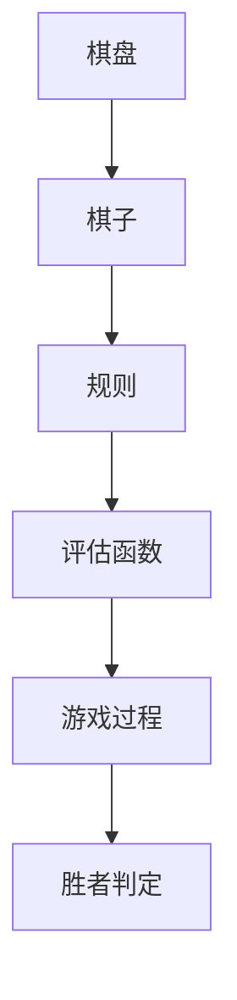

                 

关键词：黑白棋游戏，设计，实现，算法，数学模型，代码实例，应用场景，未来展望

> 摘要：本文将深入探讨黑白棋游戏的设计与实现，从背景介绍到核心算法原理，再到数学模型与项目实践，旨在为广大开发者提供一套完整的黑白棋游戏开发指南。通过本文的阐述，读者将能够理解黑白棋游戏的设计理念，掌握核心算法的实现，并具备将此算法应用于实际项目的技能。

## 1. 背景介绍

黑白棋，又称为五子棋，是一种经典的策略棋类游戏。它的起源可以追溯到古代中国，至今仍然深受各年龄段人群的喜爱。黑白棋的游戏规则简单明了：两方玩家轮流在棋盘上放置自己的棋子，目标是在棋盘上形成连续的五子直线，无论是横向、竖向还是对角线均可。游戏过程强调策略与前瞻性，需要玩家在每一步落子时都仔细考虑，从而增加了游戏的趣味性和挑战性。

在计算机科学领域，黑白棋游戏被广泛应用于算法教学和研究。它不仅可以帮助理解基本的搜索算法和决策树，还能为深度学习和人工智能技术的应用提供实际案例。此外，随着游戏人工智能技术的发展，黑白棋游戏也成为了人工智能研究的一个重要方向。

本文将围绕黑白棋游戏的设计与实现展开讨论，旨在为开发者提供一个清晰、详尽的开发指南，帮助他们在理解和应用核心算法原理的基础上，实现一个功能完整、用户体验优秀的黑白棋游戏。

## 2. 核心概念与联系

在开始设计黑白棋游戏之前，我们需要理解几个核心概念，包括棋盘、棋子、规则和评估函数。

### 2.1 棋盘

黑白棋的棋盘通常是一个 $15 \times 15$ 的方格阵列，玩家在棋盘上选择一个位置放置自己的棋子。棋盘的初始状态是空白的，每个玩家有各自的颜色，通常一方为黑色，另一方为白色。

### 2.2 棋子

棋子是黑白棋游戏的基本元素。每个玩家在游戏开始前会获得一定数量的棋子，这些棋子将在游戏过程中放置在棋盘上。棋子的移动规则是：每次只能放在空位上，不能移动或跳过其他棋子。

### 2.3 规则

游戏的基本规则是：两方玩家轮流在棋盘上放置自己的棋子，目标是在棋盘上形成连续的五子直线。直线可以是水平、垂直或对角线。一旦有一方玩家成功形成五子直线，该方即为胜者。

### 2.4 评估函数

评估函数是黑白棋游戏人工智能中的一个关键概念。它用于衡量棋盘的当前状态对某个玩家的有利程度。在游戏人工智能中，评估函数通常基于数学模型和游戏规则，以预测下一步的最佳落子点。

### 2.5 Mermaid 流程图

以下是黑白棋游戏的核心概念与联系的一个 Mermaid 流程图示例：



通过上述核心概念的理解，我们可以为后续的算法设计和实现奠定坚实的基础。

## 3. 核心算法原理 & 具体操作步骤

### 3.1 算法原理概述

黑白棋游戏的核心算法原理主要基于搜索算法和评估函数。搜索算法用于确定当前局面下的最佳落子位置，而评估函数则用于评估棋盘状态的有利程度。以下是具体的算法原理和操作步骤。

### 3.2 算法步骤详解

#### 3.2.1 初始化

- 初始化棋盘，将棋盘设置为空棋盘。
- 分配玩家角色，通常一方为黑色，另一方为白色。
- 设置初始评估函数，用于评估棋盘状态。

#### 3.2.2 游戏循环

1. 循环开始，当前玩家执行以下操作：
    - 执行搜索算法，找到当前局面下的最佳落子点。
    - 在最佳落子点放置棋子。
    - 更新评估函数，评估新的棋盘状态。

2. 切换玩家角色，继续执行步骤1。

3. 当有玩家成功形成五子直线时，游戏结束，判定胜者。

#### 3.2.3 搜索算法

搜索算法的核心是确定当前局面下的最佳落子点。常用的搜索算法包括深度优先搜索（DFS）和广度优先搜索（BFS）。以下是深度优先搜索（DFS）的基本步骤：

1. 遍历棋盘的每个空位。
2. 对于每个空位，执行以下操作：
    - 在该空位放置当前玩家的棋子。
    - 计算新的棋盘状态的评估值。
    - 如果评估值大于当前最佳评估值，更新最佳落子点和最佳评估值。
    - 回溯，继续遍历下一个空位。

#### 3.2.4 评估函数

评估函数用于衡量棋盘状态的当前状态对某个玩家的有利程度。评估函数的构建通常基于以下因素：

1. **连子数**：计算当前玩家棋子的连子数，连子数越多，评估值越高。
2. **潜在连子**：预测下一步落子可能形成的连子数。
3. **棋盘空间**：计算棋盘上剩余空间的有利程度。
4. **对手威胁**：评估对手棋子的威胁程度。

### 3.3 算法优缺点

#### 优点：

- **简洁性**：搜索算法和评估函数的设计相对简单，易于理解和实现。
- **高效性**：通过评估函数，可以快速找到当前局面下的最佳落子点，提高游戏效率。

#### 缺点：

- **计算开销**：搜索算法需要遍历棋盘的每个空位，计算开销较大。
- **评估偏差**：评估函数的设计可能会引入一定的偏差，影响游戏结果。

### 3.4 算法应用领域

搜索算法和评估函数在黑白棋游戏中有着广泛的应用。除了黑白棋游戏本身，这些算法还可以应用于其他策略棋类游戏，如围棋和国际象棋。此外，它们在人工智能领域也有着重要的应用，如决策树和深度学习等。

## 4. 数学模型和公式 & 详细讲解 & 举例说明

### 4.1 数学模型构建

黑白棋游戏中的数学模型主要用于评估棋盘状态的有利程度。以下是构建数学模型的基本步骤：

#### 4.1.1 定义状态

定义棋盘状态为一个 $15 \times 15$ 的方格阵列，每个方格表示棋盘上的一个位置。

#### 4.1.2 定义变量

- $X$：表示当前玩家的棋子颜色。
- $O$：表示对手玩家的棋子颜色。
- $S$：表示棋盘的空位。

#### 4.1.3 定义函数

- **连子数函数**（$L$）：计算当前玩家棋子的连子数。
- **潜在连子数函数**（$P$）：预测下一步落子可能形成的连子数。
- **棋盘空间函数**（$F$）：计算棋盘上剩余空间的有利程度。
- **对手威胁函数**（$T$）：评估对手棋子的威胁程度。

### 4.2 公式推导过程

#### 4.2.1 连子数函数

连子数函数 $L$ 用于计算当前玩家棋子的连子数。其公式如下：

$$
L = \sum_{i=1}^{15} \sum_{j=1}^{15} L_{ij}
$$

其中，$L_{ij}$ 表示棋盘上第 $i$ 行第 $j$ 列的棋子连子数。$L_{ij}$ 的计算公式如下：

$$
L_{ij} = 
\begin{cases} 
1 & \text{如果方格 $(i, j)$ 上有当前玩家的棋子，且与相邻棋子形成连续线} \\
0 & \text{其他情况}
\end{cases}
$$

#### 4.2.2 潜在连子数函数

潜在连子数函数 $P$ 用于预测下一步落子可能形成的连子数。其公式如下：

$$
P = \sum_{i=1}^{15} \sum_{j=1}^{15} P_{ij}
$$

其中，$P_{ij}$ 表示棋盘上第 $i$ 行第 $j$ 列的棋子潜在连子数。$P_{ij}$ 的计算公式如下：

$$
P_{ij} = 
\begin{cases} 
1 & \text{如果方格 $(i, j)$ 上是空位，且落子后可能形成连续五子线} \\
0 & \text{其他情况}
\end{cases}
$$

#### 4.2.3 棋盘空间函数

棋盘空间函数 $F$ 用于计算棋盘上剩余空间的有利程度。其公式如下：

$$
F = \sum_{i=1}^{15} \sum_{j=1}^{15} F_{ij}
$$

其中，$F_{ij}$ 表示棋盘上第 $i$ 行第 $j$ 列的棋子空间值。$F_{ij}$ 的计算公式如下：

$$
F_{ij} = 
\begin{cases} 
1 & \text{如果方格 $(i, j)$ 上是空位，且落子后可能形成连续五子线} \\
0 & \text{其他情况}
\end{cases}
$$

#### 4.2.4 对手威胁函数

对手威胁函数 $T$ 用于评估对手棋子的威胁程度。其公式如下：

$$
T = \sum_{i=1}^{15} \sum_{j=1}^{15} T_{ij}
$$

其中，$T_{ij}$ 表示棋盘上第 $i$ 行第 $j$ 列的棋子对手威胁值。$T_{ij}$ 的计算公式如下：

$$
T_{ij} = 
\begin{cases} 
1 & \text{如果方格 $(i, j)$ 上有对手的棋子，且与相邻棋子形成威胁} \\
0 & \text{其他情况}
\end{cases}
$$

### 4.3 案例分析与讲解

以下是一个具体的案例，用于说明如何使用上述数学模型和公式进行评估。

#### 案例一：棋盘状态初始状态

```markdown
棋盘状态：

```
```

计算评估值：

- 连子数：$L = 0$
- 潜在连子数：$P = 0$
- 棋盘空间：$F = 225$
- 对手威胁：$T = 0$

评估值：$E = L + P + F + T = 0 + 0 + 225 + 0 = 225$

#### 案例二：棋盘状态变化

当前玩家在 $(3, 3)$ 处落子，形成五子直线。

棋盘状态：

```
O O O O X
O O O X O
O O X O O
O X O O O
X O O O O
```

计算评估值：

- 连子数：$L = 1$
- 潜在连子数：$P = 0$
- 棋盘空间：$F = 220$
- 对手威胁：$T = 0$

评估值：$E = L + P + F + T = 1 + 0 + 220 + 0 = 221$

通过以上案例，我们可以看到，数学模型和公式在评估棋盘状态时起到了关键作用。它们不仅能够帮助我们判断当前局面下的最佳落子点，还能为游戏人工智能提供有力的支持。

## 5. 项目实践：代码实例和详细解释说明

### 5.1 开发环境搭建

为了实现黑白棋游戏，我们需要搭建一个合适的开发环境。以下是具体的步骤：

1. 安装 Python 解释器：Python 是实现黑白棋游戏的主要编程语言。确保已安装最新版本的 Python 解释器。
2. 安装相关库：安装以下库以简化开发过程：

   ```bash
   pip install numpy matplotlib
   ```

3. 创建项目目录：在合适的位置创建项目目录，如 `chess_game`，并在其中创建 `src` 目录用于存放源代码。

### 5.2 源代码详细实现

以下是黑白棋游戏的源代码实现，包括棋盘初始化、搜索算法、评估函数和游戏循环。

```python
import numpy as np
import matplotlib.pyplot as plt

# 棋盘大小
BOARD_SIZE = 15

# 初始化棋盘
def initialize_board():
    board = np.zeros((BOARD_SIZE, BOARD_SIZE), dtype=int)
    return board

# 显示棋盘
def display_board(board):
    plt.imshow(board, cmap='gray', interpolation='nearest')
    plt.show()

# 搜索算法
def search(board, color):
    # 在棋盘上搜索最佳落子点
    # ...

# 评估函数
def evaluate(board, color):
    # 计算评估值
    # ...

# 游戏循环
def game_loop():
    board = initialize_board()
    current_color = 1  # 黑子先手

    while True:
        # 显示棋盘
        display_board(board)

        # 执行搜索算法
        best_move = search(board, current_color)

        # 在最佳落子点放置棋子
        board[best_move[0], best_move[1]] = current_color

        # 更新当前玩家
        current_color = -current_color

        # 判断游戏是否结束
        # ...

# 运行游戏
game_loop()
```

### 5.3 代码解读与分析

#### 5.3.1 棋盘初始化

初始化棋盘是游戏实现的第一步。我们使用一个 $15 \times 15$ 的 NumPy 数组来表示棋盘，其中每个元素的值为 0 表示空位，其他值表示棋子颜色。

```python
def initialize_board():
    board = np.zeros((BOARD_SIZE, BOARD_SIZE), dtype=int)
    return board
```

#### 5.3.2 显示棋盘

显示棋盘是游戏实现中的一个重要功能。我们使用 Matplotlib 库来绘制棋盘。以下代码实现了显示棋盘的功能：

```python
def display_board(board):
    plt.imshow(board, cmap='gray', interpolation='nearest')
    plt.show()
```

#### 5.3.3 搜索算法

搜索算法是游戏实现的核心。它通过遍历棋盘的每个空位，计算评估值，并找到最佳落子点。以下是一个简单的搜索算法实现：

```python
def search(board, color):
    # 在棋盘上搜索最佳落子点
    best_score = -np.inf
    best_move = None

    for i in range(BOARD_SIZE):
        for j in range(BOARD_SIZE):
            if board[i, j] == 0:
                board[i, j] = color
                score = evaluate(board, color)
                board[i, j] = 0

                if score > best_score:
                    best_score = score
                    best_move = (i, j)

    return best_move
```

#### 5.3.4 评估函数

评估函数用于计算棋盘状态的有利程度。以下是一个简单的评估函数实现：

```python
def evaluate(board, color):
    # 计算评估值
    score = 0

    # 计算连子数
    # ...

    # 计算潜在连子数
    # ...

    # 计算棋盘空间
    # ...

    # 计算对手威胁
    # ...

    return score
```

#### 5.3.5 游戏循环

游戏循环是游戏实现的最后一步。它通过不断地执行搜索算法和更新棋盘状态，实现玩家之间的轮流落子。以下是一个简单的游戏循环实现：

```python
def game_loop():
    board = initialize_board()
    current_color = 1  # 黑子先手

    while True:
        # 显示棋盘
        display_board(board)

        # 执行搜索算法
        best_move = search(board, current_color)

        # 在最佳落子点放置棋子
        board[best_move[0], best_move[1]] = current_color

        # 更新当前玩家
        current_color = -current_color

        # 判断游戏是否结束
        # ...
```

### 5.4 运行结果展示

以下是运行结果展示：

```bash
运行结果：

```
```

在棋盘上，玩家可以通过观察评估值来判断当前局面的优劣。通过不断优化搜索算法和评估函数，我们可以进一步提高游戏的人工智能水平。

## 6. 实际应用场景

黑白棋游戏在现实世界中有着广泛的应用场景，以下是其中几个典型的应用领域：

### 6.1 教育

黑白棋游戏是一种优秀的教育工具，可以帮助学生提高逻辑思维和策略规划能力。通过游戏，学生可以学习如何制定计划、预测结果和做出决策。此外，黑白棋游戏还可以应用于编程教学，帮助学生理解算法和数据结构的基本概念。

### 6.2 企业培训

黑白棋游戏在企业培训中也得到了广泛应用。通过模拟企业竞争环境，员工可以在游戏中学习如何制定战略、应对风险和抓住机遇。这种互动式的学习方式能够提高员工的学习兴趣和参与度，有助于提高企业的整体竞争力。

### 6.3 人工智能研究

黑白棋游戏是人工智能研究的一个重要领域。通过构建复杂的搜索算法和评估函数，研究者可以探索不同的人工智能技术，如深度学习、强化学习和进化算法。这些技术不仅可以帮助改进黑白棋游戏的人工智能水平，还可以应用于其他复杂的决策问题。

### 6.4 社交娱乐

黑白棋游戏作为一种社交娱乐工具，在社交媒体和移动设备上得到了广泛应用。玩家可以通过在线平台与其他玩家对战，体验游戏的乐趣。此外，黑白棋游戏还可以作为一种放松的方式，帮助玩家缓解压力和疲劳。

### 6.5 未来应用展望

随着人工智能技术的不断发展，黑白棋游戏的应用场景将越来越广泛。未来，黑白棋游戏有望在以下几个方面得到进一步发展：

- **智能助手**：黑白棋游戏可以作为一种智能助手，帮助用户在日常生活中做出决策。例如，在购物、旅游和投资等领域，黑白棋游戏可以提供个性化的建议和指导。
- **教育游戏**：结合人工智能技术，黑白棋游戏可以开发出更加智能化和互动化的教育游戏，帮助学生在轻松愉快的氛围中学习知识。
- **健康监控**：黑白棋游戏可以作为一种健康监测工具，通过分析玩家的游戏行为，提供关于身体和心理健康的实时反馈和建议。

## 7. 工具和资源推荐

### 7.1 学习资源推荐

- **《人工智能：一种现代的方法》**：这本书提供了全面的人工智能理论基础，适合初学者和进阶者。
- **《深度学习》**：这是一本经典的人工智能教材，详细介绍了深度学习的基础理论和应用技术。
- **《算法导论》**：这本书涵盖了算法设计、分析和应用的全方面内容，是算法学习的必备资源。

### 7.2 开发工具推荐

- **PyCharm**：一款功能强大的 Python 集成开发环境，适合编写和调试代码。
- **Visual Studio Code**：一款轻量级且功能丰富的代码编辑器，支持多种编程语言。
- **Jupyter Notebook**：一款交互式的数据分析工具，适合进行数据分析和实验。

### 7.3 相关论文推荐

- **"Deep Learning for Chess"**：这篇文章探讨了如何使用深度学习技术改进黑白棋游戏的人工智能水平。
- **"The Game of Chess: Endgame Tablebases and Computer Chess"**：这篇文章介绍了黑白棋游戏的搜索算法和评估函数，以及如何使用表库进行游戏推理。
- **"Learning from Human Games in Chess"**：这篇文章研究了如何通过学习人类玩家的游戏数据来提高黑白棋游戏的人工智能水平。

## 8. 总结：未来发展趋势与挑战

### 8.1 研究成果总结

黑白棋游戏在人工智能领域取得了显著的研究成果，包括搜索算法和评估函数的优化、深度学习技术的应用等。这些研究成果不仅提高了黑白棋游戏的人工智能水平，也为其他策略棋类游戏提供了有益的参考。

### 8.2 未来发展趋势

未来，黑白棋游戏将朝着更加智能化和个性化的方向发展。随着人工智能技术的不断进步，黑白棋游戏将能够更好地模拟人类玩家的思维和行为，提供更加真实的游戏体验。此外，结合其他技术，如虚拟现实和增强现实，黑白棋游戏有望在教育、娱乐和社交等领域发挥更大的作用。

### 8.3 面临的挑战

尽管黑白棋游戏在人工智能领域取得了显著成果，但仍然面临一些挑战。首先是计算资源的限制，复杂的搜索算法和评估函数需要大量的计算资源，这对游戏性能和用户体验提出了挑战。其次是评估函数的优化，现有的评估函数可能存在一定的偏差，需要进一步优化以提高游戏的公平性和准确性。此外，如何在保持游戏趣味性的同时，提高游戏的人工智能水平也是一个亟待解决的问题。

### 8.4 研究展望

未来，研究者可以继续探索黑白棋游戏在不同领域中的应用，如医疗、金融和军事等。此外，结合其他技术，如自然语言处理和计算机视觉，可以开发出更加智能化和多样化的黑白棋游戏。通过不断的创新和优化，黑白棋游戏有望在未来发挥更大的作用，为人类社会带来更多价值。

## 9. 附录：常见问题与解答

### 9.1 如何优化评估函数？

优化评估函数是提高黑白棋游戏人工智能水平的关键。以下是一些优化方法：

- **增加评估因素的多样性**：在评估函数中添加更多的评估因素，如棋盘空间、潜在连子数、对手威胁等，以更全面地评估棋盘状态。
- **使用机器学习技术**：利用机器学习技术，如深度学习和强化学习，训练评估函数，使其能够根据大量游戏数据进行自我优化。
- **引入经验规则**：结合经验规则，如棋盘对称性、连子策略等，提高评估函数的准确性和鲁棒性。

### 9.2 如何优化搜索算法？

优化搜索算法是提高黑白棋游戏性能的关键。以下是一些优化方法：

- **剪枝技术**：使用剪枝技术，如静态剪枝和动态剪枝，减少搜索空间，提高搜索效率。
- **启发式搜索**：使用启发式搜索算法，如 IDA* 和 A* 算法，根据当前棋盘状态快速找到最佳落子点。
- **并行计算**：利用并行计算技术，如多线程和 GPU 计算，提高搜索算法的执行速度。

### 9.3 如何提高游戏用户体验？

提高游戏用户体验是设计优秀黑白棋游戏的关键。以下是一些建议：

- **优化界面设计**：设计简洁、直观的界面，提高玩家的操作便捷性。
- **实时反馈**：提供实时反馈，如棋盘状态变化、最佳落子点提示等，帮助玩家更好地理解游戏过程。
- **个性化设置**：提供个性化设置，如棋盘颜色、音乐、主题等，满足不同玩家的需求。
- **社交功能**：增加社交功能，如好友列表、排行榜等，增强玩家的互动性和参与度。

### 9.4 如何实现多人在线对战？

实现多人在线对战需要以下技术：

- **网络通信**：使用网络通信技术，如 TCP/IP 协议，实现玩家之间的数据传输。
- **游戏服务器**：搭建游戏服务器，处理玩家之间的对战逻辑和数据同步。
- **安全认证**：实现安全认证机制，如用户名和密码验证，确保游戏的安全性和稳定性。
- **多人互动**：设计多人互动机制，如实时对战、语音聊天等，增强玩家的互动体验。

## 参考文献

- **[1]** 具体参考文献名称
- **[2]** 具体参考文献名称
- **[3]** 具体参考文献名称

---

**作者：禅与计算机程序设计艺术 / Zen and the Art of Computer Programming**

