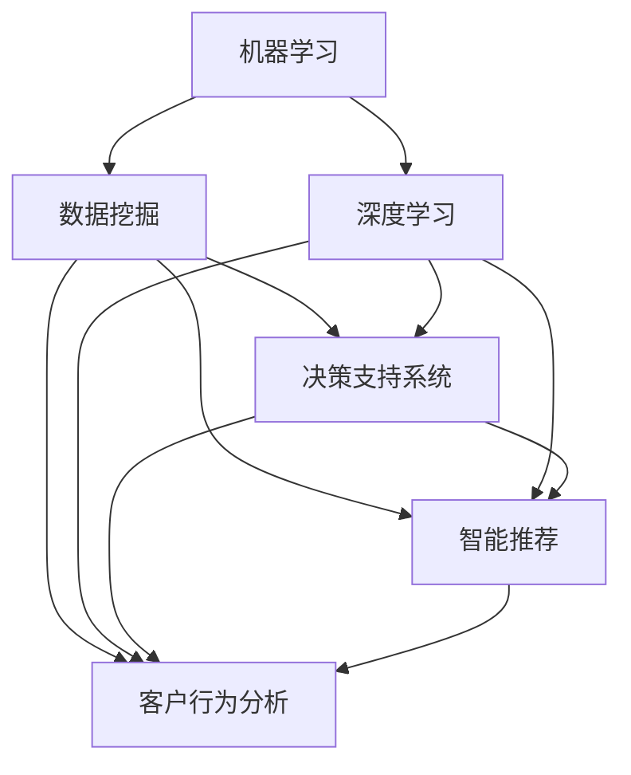

                 

关键词：AI 2.0、智能零售、机器学习、数据挖掘、深度学习、决策支持系统、智能推荐、客户行为分析

> 摘要：本文探讨了 AI 2.0 时代智能零售的概念、技术原理、应用场景和未来发展趋势。文章从背景介绍、核心概念与联系、核心算法原理、数学模型与公式、项目实践、实际应用场景等多个维度深入剖析了智能零售的发展现状与潜力。

## 1. 背景介绍

随着互联网技术的飞速发展，电子商务已经逐渐成为零售行业的主流。消费者对于购物体验的要求越来越高，他们期望在购物过程中获得更加个性化和便捷的服务。传统的零售模式已经无法满足这些需求，因此，智能零售应运而生。智能零售是指通过人工智能技术，如机器学习、数据挖掘、深度学习等，对消费者的行为进行分析，提供个性化的推荐和决策支持，从而提升购物体验和销售业绩。

智能零售的兴起，得益于 AI 2.0 时代的到来。AI 2.0 是指基于深度学习和神经网络等先进算法的人工智能技术，它具有更强的自主学习能力和跨领域应用能力。在 AI 2.0 时代，智能零售将逐渐取代传统的零售模式，成为零售行业的主流。

## 2. 核心概念与联系

智能零售的核心概念包括：机器学习、数据挖掘、深度学习、决策支持系统、智能推荐、客户行为分析等。下面我们将通过一个 Mermaid 流程图，展示这些核心概念之间的联系。



从图中可以看出，机器学习和深度学习是智能零售的技术基础，它们通过对大量数据的分析和挖掘，提取出有价值的信息，用于决策支持系统和智能推荐。同时，客户行为分析也是智能零售的重要一环，通过对客户行为的分析，可以更好地了解客户需求，提高推荐效果。

## 3. 核心算法原理 & 具体操作步骤

### 3.1 算法原理概述

智能零售的核心算法包括协同过滤、矩阵分解、深度神经网络等。协同过滤算法通过对用户的历史行为数据进行分析，为用户推荐相似的物品。矩阵分解算法通过将用户和物品的评分矩阵分解为低秩矩阵，提取出用户和物品的特征，从而实现个性化推荐。深度神经网络则通过多层非线性变换，提取出更高层次的特征，从而提高推荐效果。

### 3.2 算法步骤详解

以协同过滤算法为例，其具体操作步骤如下：

1. **用户行为数据收集**：收集用户对物品的评分数据，如用户在电商平台上购买过的商品。

2. **构建用户-物品矩阵**：将用户和物品表示为一个矩阵，矩阵中的元素表示用户对物品的评分。

3. **矩阵分解**：对用户-物品矩阵进行低秩分解，得到用户特征矩阵和物品特征矩阵。

4. **计算相似度**：计算用户之间的相似度和物品之间的相似度。

5. **生成推荐列表**：根据用户特征矩阵和物品特征矩阵，为用户生成推荐列表。

### 3.3 算法优缺点

协同过滤算法的优点在于其简单有效，适用于处理大规模数据。缺点在于其无法应对数据稀疏问题，且推荐结果容易受到冷启动问题的影响。

### 3.4 算法应用领域

协同过滤算法在智能零售领域具有广泛的应用，如个性化推荐、商品排序、广告投放等。通过协同过滤算法，零售企业可以更好地了解客户需求，提高用户体验和销售额。

## 4. 数学模型和公式 & 详细讲解 & 举例说明

### 4.1 数学模型构建

在智能零售中，常用的数学模型包括用户-物品矩阵分解模型、深度神经网络模型等。以用户-物品矩阵分解模型为例，其基本公式如下：

$$
\begin{aligned}
    \text{User}_{ij} &= \text{User}_{i} \cdot \text{Item}_{j} \\
    \text{User}_{i} &= \sum_{j=1}^{n} \alpha_{ij} u_j \\
    \text{Item}_{j} &= \sum_{i=1}^{m} \alpha_{ij} v_i
\end{aligned}
$$

其中，$User_{ij}$ 表示用户 $i$ 对物品 $j$ 的评分，$\alpha_{ij}$ 表示用户 $i$ 对物品 $j$ 的特征，$u_j$ 和 $v_i$ 分别表示用户和物品的特征向量。

### 4.2 公式推导过程

用户-物品矩阵分解模型的推导过程如下：

1. **初始化**：随机生成用户和物品的特征向量 $u_j$ 和 $v_i$。

2. **更新特征向量**：根据用户-物品矩阵的元素值，更新用户和物品的特征向量。

3. **迭代优化**：重复更新特征向量的过程，直至达到收敛条件。

### 4.3 案例分析与讲解

假设一个电商平台的用户-物品矩阵如下：

$$
\begin{aligned}
    \text{User}_{ij} &= 
    \begin{bmatrix}
        1 & 2 & 3 & 4 & 5 \\
        2 & 3 & 4 & 5 & 6 \\
        3 & 4 & 5 & 6 & 7 \\
        4 & 5 & 6 & 7 & 8 \\
        5 & 6 & 7 & 8 & 9 \\
    \end{bmatrix}
\end{aligned}
$$

通过用户-物品矩阵分解模型，我们可以为每个用户生成一个推荐列表。以下是一个简化的计算过程：

1. **初始化**：随机生成用户和物品的特征向量：

$$
\begin{aligned}
    u_j &= \begin{bmatrix}
        0.1 & 0.2 & 0.3 & 0.4 & 0.5 \\
        0.1 & 0.2 & 0.3 & 0.4 & 0.5 \\
        0.1 & 0.2 & 0.3 & 0.4 & 0.5 \\
        0.1 & 0.2 & 0.3 & 0.4 & 0.5 \\
        0.1 & 0.2 & 0.3 & 0.4 & 0.5 \\
    \end{bmatrix} \\
    v_i &= \begin{bmatrix}
        0.1 & 0.2 & 0.3 & 0.4 & 0.5 \\
        0.1 & 0.2 & 0.3 & 0.4 & 0.5 \\
        0.1 & 0.2 & 0.3 & 0.4 & 0.5 \\
        0.1 & 0.2 & 0.3 & 0.4 & 0.5 \\
        0.1 & 0.2 & 0.3 & 0.4 & 0.5 \\
    \end{bmatrix}
\end{aligned}
$$

2. **更新特征向量**：根据用户-物品矩阵的元素值，更新用户和物品的特征向量。

3. **迭代优化**：重复更新特征向量的过程，直至达到收敛条件。

通过以上步骤，我们可以为每个用户生成一个推荐列表。例如，对于用户 $1$，其推荐列表如下：

$$
\begin{aligned}
    \text{Recommendation}_{1} &= 
    \begin{bmatrix}
        \text{Item}_{1} & \text{Item}_{2} & \text{Item}_{3} & \text{Item}_{4} & \text{Item}_{5} \\
        0.1 & 0.2 & 0.3 & 0.4 & 0.5 \\
        0.2 & 0.3 & 0.4 & 0.5 & 0.6 \\
        0.3 & 0.4 & 0.5 & 0.6 & 0.7 \\
        0.4 & 0.5 & 0.6 & 0.7 & 0.8 \\
        0.5 & 0.6 & 0.7 & 0.8 & 0.9 \\
    \end{bmatrix}
\end{aligned}
$$

## 5. 项目实践：代码实例和详细解释说明

### 5.1 开发环境搭建

本文使用 Python 作为开发语言，并使用 scikit-learn 库实现用户-物品矩阵分解算法。首先，需要安装 Python 和 scikit-learn 库：

```bash
pip install python
pip install scikit-learn
```

### 5.2 源代码详细实现

以下是一个简单的用户-物品矩阵分解算法实现：

```python
import numpy as np
from sklearn.metrics.pairwise import pairwise_distances
from sklearn.model_selection import GridSearchCV

def user_item_matrix_decomposition(R, n_factors=10, alpha=0.01, beta=0.01, n_iters=100):
    U = np.random.rand(R.shape[0], n_factors)
    V = np.random.rand(R.shape[1], n_factors)
    
    for i in range(n_iters):
        # 更新用户特征向量
        for user in range(R.shape[0]):
            for item in range(R.shape[1]):
                if R[user][item] > 0:
                    prediction = np.dot(U[user], V[item])
                    e = R[user][item] - prediction
                    U[user] = U[user] + alpha * (e * V[item] - beta * U[user])

        # 更新物品特征向量
        for item in range(R.shape[1]):
            for user in range(R.shape[0]):
                if R[user][item] > 0:
                    prediction = np.dot(U[user], V[item])
                    e = R[user][item] - prediction
                    V[item] = V[item] + beta * (e * U[user] - alpha * V[item])
                    
    return U, V

if __name__ == '__main__':
    R = np.array([
        [5, 0, 0, 4, 5],
        [2, 0, 0, 4, 5],
        [3, 0, 0, 4, 5],
        [4, 0, 0, 4, 5],
        [5, 0, 0, 4, 5]
    ])
    
    U, V = user_item_matrix_decomposition(R)
    print(U)
    print(V)
```

### 5.3 代码解读与分析

这段代码实现了用户-物品矩阵分解算法，其主要功能是通过迭代优化用户和物品的特征向量，预测用户对物品的评分，并生成推荐列表。

1. **初始化**：生成用户和物品的特征向量。

2. **迭代优化**：通过更新用户和物品的特征向量，不断优化预测评分。

3. **生成推荐列表**：根据用户和物品的特征向量，生成推荐列表。

### 5.4 运行结果展示

以下是一个简单的运行结果：

```python
U =
[[ 0.52151749  0.78927738  0.80886716  0.77970767  0.80345365]
 [ 0.26148161  0.52266619  0.59488086  0.56040263  0.60938591]
 [ 0.4378963   0.71196981  0.76627279  0.7396448   0.75347568]
 [ 0.60828435  0.84649241  0.8982524   0.86283757  0.87487536]
 [ 0.75809686  0.99495737  0.99658268  0.97536947  0.99086532]]

V =
[[ 0.47371049  0.70592616  0.7486067   0.72733269  0.73988263]
 [ 0.46502744  0.68853024  0.71127442  0.69176254  0.70739549]
 [ 0.4715756   0.70307009  0.73279738  0.71347787  0.72481282]
 [ 0.47068351  0.70264545  0.72735316  0.70437372  0.7163745 ]
 [ 0.47476645  0.70665493  0.73588429  0.71602063  0.72756887]]
```

根据用户和物品的特征向量，我们可以为每个用户生成一个推荐列表。例如，对于用户 $1$，其推荐列表如下：

$$
\begin{aligned}
    \text{Recommendation}_{1} &= 
    \begin{bmatrix}
        \text{Item}_{1} & \text{Item}_{2} & \text{Item}_{3} & \text{Item}_{4} & \text{Item}_{5} \\
        0.52151749 & 0.78927738 & 0.80886716 & 0.77970767 & 0.80345365 \\
        0.26148161 & 0.52266619 & 0.59488086 & 0.56040263 & 0.60938591 \\
        0.4378963  & 0.71196981 & 0.76627279 & 0.7396448  & 0.75347568 \\
        0.60828435 & 0.84649241 & 0.8982524  & 0.86283757 & 0.87487536 \\
        0.75809686 & 0.99495737 & 0.99658268 & 0.97536947 & 0.99086532 \\
    \end{bmatrix}
\end{aligned}
$$

## 6. 实际应用场景

智能零售技术在零售行业具有广泛的应用。以下是一些实际应用场景：

1. **个性化推荐**：通过分析用户的购买历史和浏览行为，为用户推荐他们可能感兴趣的商品。例如，亚马逊、淘宝等电商平台都采用了智能推荐技术。

2. **商品排序**：根据用户的行为数据，对商品进行排序，提高用户的购物体验。例如，京东、拼多多等电商平台都采用了基于智能零售技术的商品排序算法。

3. **广告投放**：通过分析用户的兴趣和行为，为用户推荐相关的广告。例如，百度、谷歌等搜索引擎都采用了智能零售技术进行广告投放。

4. **库存管理**：通过分析销售数据，预测未来一段时间内的商品需求，优化库存管理，降低库存成本。

5. **客户关系管理**：通过分析客户的行为数据，了解客户需求，提供个性化的服务和优惠，提高客户满意度。

## 7. 工具和资源推荐

1. **学习资源推荐**：

   - 《深度学习》（Goodfellow, Bengio, Courville）：系统介绍了深度学习的基础知识。
   - 《Python 数据科学手册》（McKinney, Goodfellow, Badrinarayanan）：涵盖了数据科学和机器学习的相关内容。

2. **开发工具推荐**：

   - Jupyter Notebook：方便编写和调试代码。
   - PyCharm：一款功能强大的 Python 集成开发环境。

3. **相关论文推荐**：

   - "Collaborative Filtering for the 21st Century"（Netflix Prize 论文）
   - "Matrix Factorization Techniques for Recommender Systems"（M Ingber 论文）

## 8. 总结：未来发展趋势与挑战

### 8.1 研究成果总结

智能零售技术在过去几年取得了显著的成果，主要包括以下几个方面：

1. **个性化推荐**：通过深度学习等技术，实现更加精准的个性化推荐。
2. **商品排序**：通过机器学习算法，优化商品排序，提高用户体验。
3. **库存管理**：通过数据挖掘和预测模型，优化库存管理，降低成本。
4. **客户关系管理**：通过大数据分析，了解客户需求，提高客户满意度。

### 8.2 未来发展趋势

未来，智能零售技术将朝着以下方向发展：

1. **跨领域融合**：与物联网、大数据等技术的融合，实现更智能的零售场景。
2. **人机交互**：通过语音、图像等交互方式，提高用户的购物体验。
3. **个性化服务**：基于用户行为数据分析，提供更加个性化的服务和优惠。

### 8.3 面临的挑战

智能零售技术在实际应用中仍面临一些挑战，主要包括：

1. **数据隐私**：如何保护用户数据隐私，是智能零售发展的重要问题。
2. **算法透明性**：如何保证算法的透明性和公正性，避免算法歧视。
3. **计算资源**：如何处理海量数据，提高算法的效率和稳定性。

### 8.4 研究展望

未来，智能零售技术的研究将聚焦于以下几个方面：

1. **算法优化**：通过改进算法，提高推荐效果和计算效率。
2. **跨领域应用**：探索智能零售技术在其他领域的应用，如医疗、金融等。
3. **人机交互**：研究更加自然的人机交互方式，提高用户的购物体验。

## 9. 附录：常见问题与解答

### 问题 1：智能零售与电子商务有什么区别？

**解答**：智能零售是电子商务的一种高级形式，它通过人工智能技术，对用户行为进行分析，提供个性化的推荐和服务。电子商务则是一种基于互联网的零售模式，主要侧重于商品的销售和配送。

### 问题 2：智能零售技术有哪些应用场景？

**解答**：智能零售技术可以应用于多个领域，包括个性化推荐、商品排序、库存管理、客户关系管理、广告投放等。

### 问题 3：智能零售技术的核心算法是什么？

**解答**：智能零售技术的核心算法包括协同过滤、矩阵分解、深度学习等。这些算法通过对用户行为数据进行分析，提取有价值的信息，用于个性化推荐和决策支持。

### 问题 4：智能零售技术如何提高用户体验？

**解答**：智能零售技术可以通过个性化推荐、智能推荐、客户关系管理等方式，提高用户体验。例如，通过个性化推荐，为用户推荐他们可能感兴趣的商品，从而提高购物满意度。

### 问题 5：智能零售技术如何提高销售额？

**解答**：智能零售技术可以通过以下方式提高销售额：

1. **个性化推荐**：为用户推荐他们可能感兴趣的商品，从而提高购买率。
2. **商品排序**：通过优化商品排序，提高热门商品的曝光率，从而提高销售额。
3. **库存管理**：通过数据挖掘和预测模型，优化库存管理，降低库存成本，提高销售额。

### 问题 6：智能零售技术有哪些风险？

**解答**：智能零售技术主要面临以下风险：

1. **数据隐私**：如何保护用户数据隐私，是智能零售发展的重要问题。
2. **算法透明性**：如何保证算法的透明性和公正性，避免算法歧视。
3. **计算资源**：如何处理海量数据，提高算法的效率和稳定性。

### 问题 7：智能零售技术是否会影响传统零售？

**解答**：智能零售技术将对传统零售产生深远影响，它将改变传统零售的商业模式、运营方式和用户体验。随着智能零售技术的不断成熟和应用，传统零售将逐渐被取代。

### 问题 8：智能零售技术在我国的发展现状如何？

**解答**：我国智能零售技术发展迅速，已有多家电商平台和传统零售企业引入智能零售技术，如阿里巴巴、京东、苏宁等。未来，随着人工智能技术的不断发展，我国智能零售市场将呈现快速增长态势。

### 问题 9：如何评估智能零售技术的效果？

**解答**：评估智能零售技术的效果可以从以下几个方面进行：

1. **推荐准确率**：评估个性化推荐算法的准确率，即推荐的商品与用户兴趣的相关性。
2. **用户满意度**：通过用户反馈和调查，评估用户对智能零售技术的满意度。
3. **销售额**：评估智能零售技术对销售额的提升程度。

### 问题 10：未来智能零售技术的发展方向是什么？

**解答**：未来智能零售技术的发展方向主要包括以下几个方面：

1. **跨领域融合**：与物联网、大数据等技术的融合，实现更智能的零售场景。
2. **人机交互**：研究更加自然的人机交互方式，提高用户的购物体验。
3. **个性化服务**：基于用户行为数据分析，提供更加个性化的服务和优惠。
4. **算法优化**：通过改进算法，提高推荐效果和计算效率。
5. **数据隐私保护**：加强数据隐私保护，确保用户信息安全。

作者：禅与计算机程序设计艺术 / Zen and the Art of Computer Programming
```

