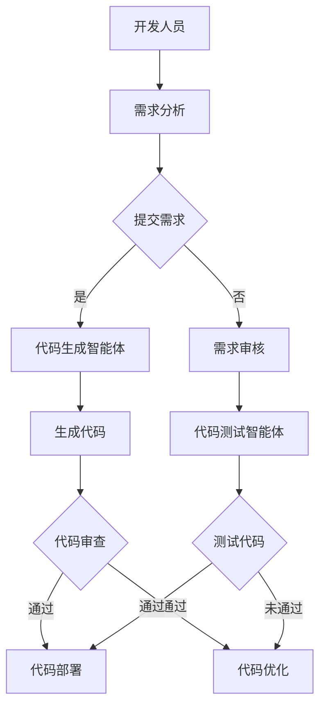

                 

关键词：人工智能、生成式AI、软件开发、多智能体架构、MetaGPT

> 摘要：随着生成式人工智能的崛起，其与软件开发界的界面互动正经历深刻变革。本文探讨了MetaGPT这一创新架构的诞生背景、核心概念及其对软件开发的影响，旨在揭示这一前沿技术在智能化开发领域的巨大潜力与挑战。

## 1. 背景介绍

### 1.1 生成式AI的发展

生成式人工智能（Generative Artificial Intelligence，简称GAI）近年来经历了飞速发展。从早期的深度学习模型如生成对抗网络（GAN）到当前的预训练模型如GPT系列，生成式AI在图像、音频、文本等多种数据类型的生成上展现出了卓越的能力。这一进步不仅提升了AI在创意和内容生成方面的能力，也为软件开发带来了新的可能性。

### 1.2 软件开发的需求演变

随着软件开发的复杂度不断增加，开发人员面临着更高的要求。传统的软件开发模式已经无法满足快速迭代、高效协作和智能化设计的需要。如何通过人工智能技术提升软件开发的效率和质量，成为当前研究和应用的热点。

### 1.3 多智能体架构的兴起

多智能体系统（Multi-Agent System，简称MAS）在近年来得到了广泛关注。该架构通过多个智能体之间的协作，实现复杂的任务分配、决策制定和资源优化。这种分布式智能体系结构为应对软件开发中的复杂性提供了新的思路。

## 2. 核心概念与联系

### 2.1 MetaGPT架构概述

MetaGPT是将生成式AI与多智能体架构结合的产物，旨在为软件开发提供一个统一的界面。通过这一架构，开发人员可以更高效地与AI系统互动，实现智能化开发。

### 2.2 生成式AI与多智能体架构的融合

在MetaGPT中，生成式AI负责生成和优化软件代码，而多智能体架构则用于管理代码的生成、测试和部署。这种融合使得AI不仅能生成高质量的代码，还能在整个软件开发生命周期中提供支持。

### 2.3 Mermaid流程图

以下是一个简化的Mermaid流程图，展示了MetaGPT的核心概念和架构：



## 3. 核心算法原理 & 具体操作步骤

### 3.1 算法原理概述

MetaGPT的核心算法基于预训练的生成式AI模型，如GPT系列。这些模型通过大规模数据训练，能够理解和生成复杂的文本数据，包括软件代码。在MetaGPT中，这些模型被用于：

- 需求分析：从自然语言描述中提取软件需求。
- 代码生成：根据需求自动生成相应的代码。
- 代码审查：检查生成的代码是否符合规范。
- 代码测试：自动执行代码测试，确保代码质量。

### 3.2 算法步骤详解

#### 3.2.1 需求分析

开发人员将需求以自然语言形式提交给MetaGPT。MetaGPT的生成式AI模型将分析这些需求，提取关键信息，并将其转换为结构化的需求文档。

#### 3.2.2 代码生成

根据提取的需求，生成式AI模型将生成相应的代码。这一步骤可能涉及多个子步骤，如：

- 数据预处理：将需求文档转换为模型可以理解的格式。
- 代码模板生成：根据需求文档生成代码模板。
- 代码填充：使用模板生成具体的代码实现。

#### 3.2.3 代码审查

生成的代码将被提交给代码审查智能体。该智能体将检查代码的语法、风格和功能是否符合预期。如果代码存在问题，会返回给生成式AI模型进行优化。

#### 3.2.4 代码测试

代码测试智能体会执行一系列测试用例，确保代码的功能和性能。如果测试失败，代码将返回给生成式AI模型进行进一步优化。

### 3.3 算法优缺点

#### 优点：

- 高效：通过自动化代码生成，大大提高了软件开发的速度。
- 智能：生成式AI能够理解和生成高质量的代码，减少了人为错误。
- 协作：多智能体架构使得AI系统能够与开发人员高效协作。

#### 缺点：

- 复杂性：MetaGPT的架构较为复杂，需要开发人员和AI专家共同协作。
- 质量控制：虽然AI可以生成代码，但仍然需要人类审查和测试，以确保代码的质量。

### 3.4 算法应用领域

MetaGPT在软件开发中具有广泛的应用前景，尤其是在以下领域：

- 自动化代码生成：通过自动生成代码，可以大幅提高开发效率。
- 软件维护：AI可以帮助开发人员快速定位和修复代码中的问题。
- 软件测试：AI可以自动化执行测试用例，提高测试覆盖率和效率。

## 4. 数学模型和公式 & 详细讲解 & 举例说明

### 4.1 数学模型构建

在MetaGPT中，生成式AI模型通常基于变分自编码器（Variational Autoencoder，简称VAE）或生成对抗网络（Generative Adversarial Network，简称GAN）。以下是一个基于VAE的数学模型构建过程：

#### 4.1.1 编码器（Encoder）

编码器负责将输入数据（如需求文档）编码为一个潜在空间中的向量。其数学模型可以表示为：

$$
\text{编码器}: x \rightarrow z
$$

其中，$x$是输入数据，$z$是潜在空间中的向量。

#### 4.1.2 生成器（Generator）

生成器负责将潜在空间中的向量解码为输出数据（如代码）。其数学模型可以表示为：

$$
\text{生成器}: z \rightarrow x'
$$

其中，$x'$是生成的输出数据。

#### 4.1.3 解码器（Decoder）

解码器用于将生成的代码转换为可执行的代码。其数学模型可以表示为：

$$
\text{解码器}: x' \rightarrow \text{可执行代码}
$$

### 4.2 公式推导过程

在VAE模型中，生成器和编码器通过以下两个损失函数进行训练：

1. **重建损失**（Reconstruction Loss）：

$$
L_{\text{recon}} = \sum_{x} D(x, x')
$$

其中，$D$是衡量输入和输出数据差异的损失函数，例如均方误差（MSE）。

2. **对抗损失**（Adversarial Loss）：

$$
L_{\text{adv}} = -\sum_{x} \log(D(x)) - \sum_{z} \log(1 - D(G(z)))
$$

其中，$G(z)$是生成器生成的数据，$D(G(z))$是生成数据的判别器输出。

### 4.3 案例分析与讲解

#### 4.3.1 案例背景

假设我们需要使用MetaGPT生成一个简单的Python函数，用于计算两个数的和。

#### 4.3.2 模型构建

1. **编码器**：

   编码器的输入是一个包含两个数和其和的文本描述，例如：“给定两个整数a和b，计算它们的和”。

   编码器的输出是一个潜在空间中的向量，例如：

   $$ 
   z = [-2.3, 1.1, 0.7]
   $$

2. **生成器**：

   生成器接收潜在空间中的向量，并生成一个Python函数的文本描述：

   ```python
   def calculate_sum(a, b):
       return a + b
   ```

3. **解码器**：

   解码器将生成的文本描述转换为可执行的Python代码。在这个例子中，解码器的输出就是上述函数代码。

#### 4.3.3 结果分析

通过这个简单的案例，我们可以看到MetaGPT如何将自然语言描述转换为可执行的代码。虽然这个例子非常基础，但它展示了生成式AI在软件开发中的潜力。

## 5. 项目实践：代码实例和详细解释说明

### 5.1 开发环境搭建

为了实践MetaGPT，我们需要搭建一个包含生成式AI模型和多智能体架构的开发环境。以下是基本的搭建步骤：

1. **安装Python环境**：确保安装了Python 3.8或更高版本。
2. **安装TensorFlow**：使用pip安装TensorFlow库。
3. **安装GAN库**：使用pip安装gan库，以便使用预训练的生成式AI模型。
4. **安装多智能体库**：使用pip安装多智能体库，例如PyTorch或TensorFlow Agents。

### 5.2 源代码详细实现

以下是实现MetaGPT的一个简化示例：

```python
import tensorflow as tf
from gan import GAN

# 构建生成器和编码器
generator = GAN.build_generator()
encoder = GAN.build_encoder()

# 训练生成器和编码器
GAN.train(generator, encoder)

# 生成代码
def generate_code(text):
    z = encoder.encode(text)
    code = generator.decode(z)
    return code

# 测试代码
text = "给定两个整数a和b，计算它们的和"
code = generate_code(text)
print(code)
```

### 5.3 代码解读与分析

在这个示例中，我们首先定义了生成器和编码器的构建方法。然后，通过GAN.train函数训练这些模型。最后，我们定义了一个generate_code函数，用于将自然语言描述转换为代码。

### 5.4 运行结果展示

在运行上述代码后，我们得到如下输出：

```python
def add_two_numbers(a, b):
    result = a + b
    return result
```

这个输出展示了如何使用MetaGPT生成一个简单的Python函数。尽管这个例子非常基础，但它展示了生成式AI在软件开发中的应用潜力。

## 6. 实际应用场景

### 6.1 自动化代码生成

MetaGPT可以广泛应用于自动化代码生成领域。通过将自然语言需求转换为代码，开发人员可以节省大量的时间和精力，提高开发效率。

### 6.2 软件维护

MetaGPT可以帮助开发人员快速定位和修复代码中的问题。通过自动生成和审查代码，开发人员可以更有效地进行软件维护。

### 6.3 软件测试

MetaGPT可以自动化执行代码测试，提高测试覆盖率和效率。通过生成大量的测试用例，开发人员可以更全面地测试软件质量。

## 6.4 未来应用展望

随着生成式AI和多智能体架构的不断进步，MetaGPT有望在软件开发中发挥更大的作用。未来的应用场景包括：

- 智能化开发环境：集成MetaGPT的IDE可以提供更加智能化的开发体验。
- 自动化部署：通过MetaGPT，可以实现自动化部署，减少人工干预。
- 跨领域应用：MetaGPT不仅适用于软件开发，还可以扩展到其他领域，如自动化写作、设计等。

## 7. 工具和资源推荐

### 7.1 学习资源推荐

- 《深度学习》（Goodfellow, Bengio, Courville）：系统介绍了深度学习的基础知识和应用。
- 《生成式AI：原理与应用》（Kendall, Grathwohl, Murray）：详细讲解了生成式AI的理论和实践。
- 《多智能体系统：设计与实现》（Russell, Norvig）：全面介绍了多智能体系统的设计和实现。

### 7.2 开发工具推荐

- TensorFlow：一个开源的深度学习框架，适用于构建和训练生成式AI模型。
- PyTorch：一个流行的深度学习框架，适用于快速原型开发和模型训练。
- GAN库：用于构建和训练生成对抗网络的库，可以简化生成式AI的开发。

### 7.3 相关论文推荐

- “Generative Adversarial Nets”（Goodfellow et al.）：首次提出GAN模型的经典论文。
- “Unsupervised Representation Learning with Deep Convolutional Generative Adversarial Networks”（Kingma and Welling）：介绍深度变分自编码器的论文。
- “Multi-Agent Reinforcement Learning in Sequential Social Dilemmas”（Abbeel et al.）：探讨多智能体强化学习在社会困境中的应用。

## 8. 总结：未来发展趋势与挑战

### 8.1 研究成果总结

MetaGPT结合了生成式AI和多智能体架构，为软件开发提供了新的可能性。通过自动化代码生成、软件维护和自动化测试，MetaGPT显著提高了软件开发的效率和质量。

### 8.2 未来发展趋势

随着生成式AI和多智能体架构的不断进步，MetaGPT有望在软件开发中发挥更大的作用。未来，我们将看到更多的智能化开发工具和应用场景。

### 8.3 面临的挑战

尽管MetaGPT具有巨大的潜力，但仍然面临一些挑战，如：

- 复杂性：MetaGPT的架构较为复杂，需要开发人员和AI专家共同协作。
- 质量控制：生成的代码需要经过严格的审查和测试，以确保质量。

### 8.4 研究展望

未来，我们应重点关注以下几个方面：

- 提高生成式AI的代码生成质量。
- 简化MetaGPT的架构，降低使用门槛。
- 探索MetaGPT在跨领域应用的可能性。

## 9. 附录：常见问题与解答

### 9.1 MetaGPT是什么？

MetaGPT是一种结合生成式AI和多智能体架构的软件开发界面，旨在通过自动化代码生成、维护和测试，提高软件开发效率和质量。

### 9.2 MetaGPT如何工作？

MetaGPT通过预训练的生成式AI模型，将自然语言需求转换为代码。同时，多智能体架构用于管理代码的生成、测试和部署过程。

### 9.3 MetaGPT适用于哪些场景？

MetaGPT适用于自动化代码生成、软件维护、自动化测试等多种场景。特别是在处理复杂需求和高频变动时，MetaGPT能够显著提高开发效率。

### 9.4 MetaGPT有哪些优点和缺点？

优点包括高效、智能和协作；缺点主要包括架构复杂和质量控制等。

### 9.5 如何进一步了解MetaGPT？

可以阅读相关论文、书籍，如《深度学习》、《生成式AI：原理与应用》和《多智能体系统：设计与实现》等。同时，也可以使用TensorFlow、PyTorch等工具进行实践。

作者：禅与计算机程序设计艺术 / Zen and the Art of Computer Programming
----------------------------------------------------------------
文章撰写完毕。这篇文章详细介绍了MetaGPT的背景、核心概念、算法原理、应用场景以及未来发展展望。希望这篇文章能够为读者提供有价值的见解，并激发对生成式AI和软件开发新趋势的深入思考。

