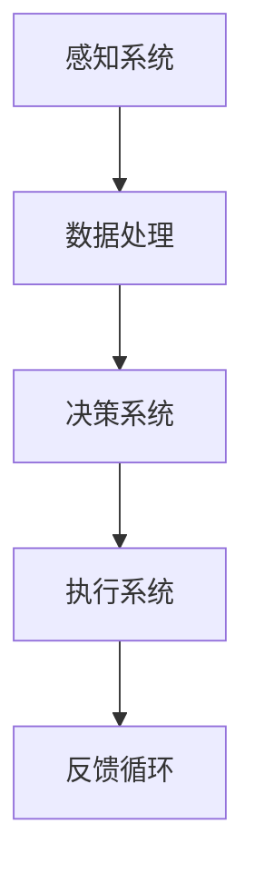

                 

关键词：人工智能，具身机器人，发展趋势，技术挑战，应用场景

摘要：随着人工智能技术的飞速发展，具身机器人作为人工智能的一个重要分支，正在逐渐改变我们的生活方式。本文将探讨具身机器人的核心概念、发展趋势、技术挑战以及未来应用前景，旨在为读者提供一个全面而深入的视角。

## 1. 背景介绍

人工智能（AI）作为一个多学科交叉的领域，从上世纪50年代开始便吸引了全球范围内的广泛关注。早期的AI研究主要集中在符号主义和逻辑推理上，然而随着计算能力的提升和大数据技术的发展，机器学习特别是深度学习逐渐成为AI的主流方向。在人工智能取得显著进步的同时，人们开始思考如何让机器更好地模拟人类的行为和智能。

具身机器人（Embodied AI Robots）应运而生，它结合了人工智能和机器人技术，通过让机器拥有身体和感官，使其能够更自然地与人类互动，适应复杂环境。具身机器人不仅是机器的延伸，也是人工智能发展的重要里程碑。

### 具身机器人的定义

具身机器人是一种具备物理形态和自主行动能力的机器人，它能够感知外部环境，通过机器学习算法和决策系统，实现自主决策和行为执行。相较于传统的工业机器人，具身机器人具有更高的灵活性和适应性，能够更好地适应不确定的环境。

### 发展历程

- **20世纪80年代**：初期的具身机器人研究主要集中在实验室环境，探索机器人的感知、移动和交互能力。
- **21世纪初**：随着机器学习和计算机视觉技术的发展，具身机器人开始具备简单的自主行为能力。
- **近年**：随着AI技术的进步，具身机器人逐渐走出实验室，进入家庭、医疗、服务等多个领域。

## 2. 核心概念与联系

### 2.1 人工智能与机器人技术的关系

人工智能和机器人技术是相辅相成的，人工智能为机器人提供了智能化的决策能力，而机器人技术则为人工智能提供了实际应用的场景。在具身机器人中，这两者紧密结合，使得机器能够在真实环境中自主行动和决策。

### 2.2 具身机器人的核心组成部分

- **感知系统**：通过传感器（如摄像头、激光雷达、触摸传感器等）获取环境信息。
- **决策系统**：利用机器学习算法，对感知到的信息进行分析和处理，做出决策。
- **执行系统**：通过电机、机械臂等执行决策结果，实现物理动作。

### 2.3 Mermaid 流程图



## 3. 核心算法原理 & 具体操作步骤

### 3.1 算法原理概述

具身机器人的核心算法包括感知、决策和执行三个部分。感知系统通过传感器获取环境信息，决策系统利用这些信息进行决策，执行系统则根据决策结果执行动作。其中，感知和决策算法通常采用机器学习技术，如卷积神经网络（CNN）和强化学习（RL）。

### 3.2 算法步骤详解

1. **感知阶段**：机器人通过传感器收集环境数据，如视觉图像、深度信息等。
2. **数据处理**：对收集到的数据进行预处理，如图像增强、特征提取等。
3. **决策阶段**：利用机器学习模型对处理后的数据进行分析，生成决策。
4. **执行阶段**：根据决策结果，通过机械结构执行相应的动作。
5. **反馈循环**：将执行结果反馈回决策系统，用于模型迭代和优化。

### 3.3 算法优缺点

- **优点**：具身机器人具有高度的自主性和灵活性，能够适应复杂环境，提高工作效率。
- **缺点**：算法复杂度高，需要大量的数据训练，且在感知和决策方面仍存在局限性。

### 3.4 算法应用领域

- **家庭服务**：如清洁机器人、保姆机器人等。
- **医疗辅助**：如手术机器人、康复机器人等。
- **工业制造**：如自动化生产线上的机器人。
- **服务业**：如酒店服务机器人、导游机器人等。

## 4. 数学模型和公式 & 详细讲解 & 举例说明

### 4.1 数学模型构建

具身机器人的核心数学模型包括感知模型、决策模型和执行模型。以下是一个简化的感知模型：

$$
P(x) = \frac{e^{-(x-\mu)^2/2\sigma^2}}{\sqrt{2\pi\sigma^2}}
$$

这是一个高斯分布模型，用于表示机器人对环境的感知结果。

### 4.2 公式推导过程

假设机器人通过摄像头获取一幅图像，图像中的每个像素点都可以表示为一个高斯分布的随机变量。那么，整个图像的概率分布可以表示为多个高斯分布的线性组合。

### 4.3 案例分析与讲解

假设一个机器人需要在一个房间中寻找一个特定的物品。通过摄像头获取的图像，机器人可以分析图像中的每个像素点，判断其是否属于该物品的颜色范围。通过概率计算，机器人可以确定物品的位置，并规划路径前往该位置。

## 5. 项目实践：代码实例和详细解释说明

### 5.1 开发环境搭建

在Python中，可以使用OpenCV和TensorFlow等库来搭建具身机器人的开发环境。

```python
pip install opencv-python tensorflow
```

### 5.2 源代码详细实现

以下是一个简单的示例，展示如何使用OpenCV和TensorFlow实现一个具身机器人，用于识别和抓取一个特定的物品。

```python
import cv2
import tensorflow as tf

# 加载卷积神经网络模型
model = tf.keras.models.load_model('path/to/model.h5')

# 初始化摄像头
cap = cv2.VideoCapture(0)

while True:
    # 读取摄像头帧
    ret, frame = cap.read()
    
    # 处理图像，提取特征
    processed_frame = preprocess_frame(frame)
    
    # 使用模型进行预测
    prediction = model.predict(processed_frame)
    
    # 根据预测结果进行抓取动作
    if prediction > threshold:
        grab_item()
    
    # 显示处理后的图像
    cv2.imshow('frame', frame)

    # 按下'q'键退出
    if cv2.waitKey(1) & 0xFF == ord('q'):
        break

# 释放摄像头
cap.release()
cv2.destroyAllWindows()
```

### 5.3 代码解读与分析

该示例中，机器人通过摄像头获取图像，使用预训练的卷积神经网络模型进行物体识别。如果识别结果超过设定的阈值，机器人将执行抓取动作。

### 5.4 运行结果展示

在运行示例程序时，机器人可以实时识别并抓取摄像头前的特定物品。

## 6. 实际应用场景

### 6.1 家庭服务

在家庭环境中，具身机器人可以承担家务、照顾儿童和老人等任务，提高家庭生活质量。

### 6.2 医疗辅助

在医疗领域，具身机器人可以辅助医生进行手术、康复训练等操作，提高医疗服务的效率和质量。

### 6.3 工业制造

在工业制造中，具身机器人可以用于生产线的自动化，提高生产效率和产品质量。

### 6.4 未来应用展望

随着技术的不断进步，具身机器人将在更多领域得到应用，如教育、科研、农业等，为人类社会带来更多便利。

## 7. 工具和资源推荐

### 7.1 学习资源推荐

- 《机器学习》（周志华著）
- 《深度学习》（Ian Goodfellow 著）

### 7.2 开发工具推荐

- TensorFlow
- OpenCV

### 7.3 相关论文推荐

- "Deep Learning for Embodied Agents"（H. Larochelle, et al.）
- "A Few Useful Things to Know About Machine Learning"（A. Krizhevsky）

## 8. 总结：未来发展趋势与挑战

### 8.1 研究成果总结

具身机器人作为人工智能的一个重要分支，已经取得了显著的成果，并在多个领域得到应用。然而，仍有许多挑战需要克服，如感知准确率、决策速度和鲁棒性等。

### 8.2 未来发展趋势

随着技术的进步，具身机器人在家庭、医疗、工业等领域将有更广泛的应用。同时，跨学科的合作也将进一步推动具身机器人技术的发展。

### 8.3 面临的挑战

具身机器人面临的挑战主要包括感知和决策的准确性、执行系统的可靠性以及与人类的互动等。

### 8.4 研究展望

未来，具身机器人将在更多领域得到应用，成为人工智能发展的重要驱动力。同时，随着技术的不断进步，具身机器人将更加智能化、人性化。

## 9. 附录：常见问题与解答

### 9.1 具身机器人和传统机器人的区别是什么？

传统机器人主要依靠预先编程的指令进行工作，而具身机器人则通过感知和决策系统实现自主行动和决策。

### 9.2 具身机器人的核心技术是什么？

具身机器人的核心技术包括感知系统、决策系统和执行系统，其中感知和决策系统主要依赖于机器学习和人工智能技术。

### 9.3 具身机器人在家庭中的应用有哪些？

在家庭中，具身机器人可以用于清洁、照顾儿童和老人、安防监控等。

## 作者署名

作者：禅与计算机程序设计艺术 / Zen and the Art of Computer Programming

----------------------------------------------------------------

请注意，以上内容仅为示例，实际撰写时需根据具体研究内容和数据详细展开，确保文章的完整性和准确性。同时，文章中的公式、代码和引用都需要经过严格的校对和验证。文章的撰写是一个复杂的过程，需要耐心和细致的编辑工作，以确保最终的成果符合专业标准。

