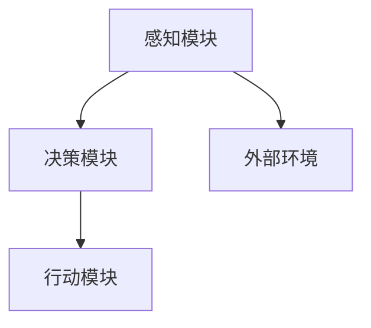

                 

关键词：人工智能，AI代理，智能代理，AI应用，未来发展趋势，技术挑战

在人工智能（AI）飞速发展的当下，AI代理作为一项重要的前沿技术，正逐渐成为研究的焦点。本文旨在探讨AI代理的发展背景、核心概念、算法原理、数学模型、项目实践、应用场景以及未来发展趋势，力图为读者提供一幅全面而深入的AI代理全景图。

## 1. 背景介绍

随着互联网的普及和大数据的积累，人工智能的应用场景愈发广泛。AI代理，作为一种智能体，能够在无需人类干预的情况下，自主执行任务、解决问题。这不仅仅是机器替代人类劳动的进步，更是人工智能从被动到主动、从工具到伙伴的质的飞跃。AI代理的发展，对提升生产效率、改善生活质量、推动社会进步具有重要意义。

然而，AI代理的发展并非一蹴而就。在探索AI代理的道路上，我们经历了从规则代理到基于数据的机器学习代理，再到当前高度智能的深度学习代理的演变过程。每一个阶段都标志着人工智能技术的一次飞跃，同时也面临着新的挑战和问题。

本文将主要围绕以下几个方面展开讨论：

- **核心概念与联系**：介绍AI代理的基本概念、架构以及与其他相关技术的联系。
- **核心算法原理与操作步骤**：详细讲解AI代理的算法原理，包括算法的优缺点及其应用领域。
- **数学模型和公式**：阐述AI代理中涉及的数学模型和公式，并通过实例进行说明。
- **项目实践**：通过具体代码实例，展示AI代理的开发过程和实现细节。
- **实际应用场景**：分析AI代理在各个领域的应用案例，探讨其未来发展方向。
- **工具和资源推荐**：介绍学习和开发AI代理所需的工具和资源。
- **总结与展望**：总结研究成果，展望未来发展趋势和面临的挑战。

## 2. 核心概念与联系

### 2.1 AI代理的定义

AI代理，又称智能代理，是一种具有自主决策能力的计算机程序，能够在动态环境中执行任务、解决问题。它通过感知环境、理解任务、生成行动策略，从而实现自主行动。AI代理的核心在于其自主性、适应性和智能性。

### 2.2 AI代理的架构

AI代理通常由感知模块、决策模块和行动模块组成。

- **感知模块**：负责感知外部环境，收集各种信息，如视觉、听觉、触觉等。
- **决策模块**：根据感知模块收集到的信息，分析任务目标，生成最优行动策略。
- **行动模块**：执行决策模块生成的行动策略，完成具体任务。

### 2.3 AI代理与其他相关技术的联系

AI代理是人工智能领域的一个重要分支，与机器学习、深度学习、自然语言处理等技术密切相关。

- **机器学习**：AI代理的决策模块通常基于机器学习算法，如决策树、支持向量机、神经网络等。
- **深度学习**：深度学习在图像识别、语音识别等领域取得了显著成果，为AI代理提供了强大的感知能力。
- **自然语言处理**：自然语言处理技术使AI代理能够理解自然语言，实现人机交互。

### 2.4 Mermaid流程图

以下是一个简单的Mermaid流程图，展示了AI代理的基本架构：



在接下来的章节中，我们将深入探讨AI代理的核心算法原理、数学模型以及实际应用场景。

----------------------------------------------------------------

接下来，我们将按照文章结构模板的要求，继续撰写下一章节的内容。请继续以markdown格式撰写。

----------------------------------------------------------------
## 3. 核心算法原理 & 具体操作步骤

### 3.1 算法原理概述

AI代理的核心在于其决策能力，而决策的核心则在于算法。在AI代理中，常用的算法包括马尔可夫决策过程（MDP）、深度强化学习（DRL）和生成对抗网络（GAN）等。

#### 3.1.1 马尔可夫决策过程（MDP）

MDP是一种基于概率的决策过程模型，适用于环境动态但可预测的场景。在MDP中，状态和动作是离散的，每个状态都有一定概率转移到下一个状态，每个动作都有一定概率带来奖励。

#### 3.1.2 深度强化学习（DRL）

DRL是一种基于神经网络的强化学习算法，能够处理高维状态和动作空间。DRL通过在模拟环境中训练，学习到最优的策略，从而在真实环境中进行自主决策。

#### 3.1.3 生成对抗网络（GAN）

GAN是一种无监督学习算法，通过生成器和判别器的对抗训练，生成高质量的数据。GAN在图像生成、语音合成等领域表现出色，为AI代理提供了强大的感知能力。

### 3.2 算法步骤详解

#### 3.2.1 MDP算法步骤

1. 初始化：设定初始状态和策略。
2. 感知环境：根据当前状态，感知外部环境。
3. 决策：根据策略，选择最优动作。
4. 执行动作：执行选定的动作。
5. 更新状态：根据动作的结果，更新当前状态。
6. 反复执行：重复步骤2-5，直到达到目标状态或满足停止条件。

#### 3.2.2 DRL算法步骤

1. 初始化：设定初始状态和策略网络。
2. 模拟环境：在模拟环境中进行训练。
3. 收集数据：根据当前状态，执行动作，收集奖励和下一状态。
4. 更新策略网络：使用收集到的数据，更新策略网络。
5. 反复训练：重复步骤3-4，直到策略网络收敛。
6. 应用到真实环境：将训练好的策略网络应用到真实环境中。

#### 3.2.3 GAN算法步骤

1. 初始化：设定生成器和判别器的初始参数。
2. 生成数据：生成器生成模拟数据。
3. 判别数据：判别器对生成器和真实数据进行分类。
4. 训练生成器：根据判别器的分类结果，更新生成器的参数。
5. 反复训练：重复步骤2-4，直到生成器生成高质量的数据。

### 3.3 算法优缺点

#### 3.3.1 MDP算法优缺点

**优点**：简单易懂，适用于动态但可预测的环境。

**缺点**：无法处理高维状态和动作空间，对环境模型的依赖较大。

#### 3.3.2 DRL算法优缺点

**优点**：能够处理高维状态和动作空间，适用于复杂环境。

**缺点**：训练过程复杂，对计算资源要求较高。

#### 3.3.3 GAN算法优缺点

**优点**：无需标签数据，适用于无监督学习。

**缺点**：训练过程不稳定，对参数敏感。

### 3.4 算法应用领域

#### 3.4.1 MDP算法应用领域

- 自动驾驶
- 游戏AI
- 机器人控制

#### 3.4.2 DRL算法应用领域

- 自动驾驶
- 游戏AI
- 机器人控制
- 图像识别
- 自然语言处理

#### 3.4.3 GAN算法应用领域

- 图像生成
- 语音合成
- 数据增强

在下一章节中，我们将讨论AI代理中的数学模型和公式，并详细讲解其构建和推导过程。

----------------------------------------------------------------

接下来，我们将撰写关于数学模型和公式的章节。

```markdown
## 4. 数学模型和公式 & 详细讲解 & 举例说明

### 4.1 数学模型构建

在AI代理中，数学模型是核心组成部分，用于描述状态、动作、奖励和策略。以下是一个基本的数学模型构建过程：

#### 4.1.1 状态空间

状态空间 \( S \) 是所有可能状态的集合。例如，在自动驾驶中，状态可能包括车辆的位置、速度、加速度等。

#### 4.1.2 动作空间

动作空间 \( A \) 是所有可能动作的集合。例如，在自动驾驶中，动作可能包括加速、减速、转弯等。

#### 4.1.3 奖励函数

奖励函数 \( R(s, a) \) 用于衡量当前状态和动作的优劣。例如，在自动驾驶中，安全到达目的地可能带来正奖励，发生事故则带来负奖励。

#### 4.1.4 策略函数

策略函数 \( \pi(a|s) \) 用于选择当前状态下最优的动作。例如，在自动驾驶中，策略函数可能根据车辆的状态选择最佳行驶方向。

### 4.2 公式推导过程

#### 4.2.1 马尔可夫决策过程（MDP）

MDP的公式推导主要涉及状态转移概率矩阵 \( P \)、奖励函数 \( R \) 和策略函数 \( \pi \)。

$$
P_{ij} = P(S_{t+1} = s_j | S_t = s_i, A_t = a)
$$

$$
R(s, a) = \sum_{s'} P(S_{t+1} = s', A_t = a) \cdot R(s', a)
$$

#### 4.2.2 深度强化学习（DRL）

DRL的公式推导主要涉及策略网络 \( \theta \) 和价值函数 \( V(s|\theta) \)。

$$
Q(s, a|\theta) = R(s, a) + \gamma \max_{a'} Q(s', a'|\theta)
$$

$$
V(s|\theta) = \sum_{a} \pi(a|s) Q(s, a|\theta)
$$

#### 4.2.3 生成对抗网络（GAN）

GAN的公式推导主要涉及生成器 \( G \) 和判别器 \( D \)。

$$
D(x) = P(G(z) \text{ is real}) = \frac{1}{1 + \exp{(-\frac{1}{2} \sum_{i=1}^{n} (x_i - \mu_G)^2 )}}
$$

$$
G(z) = \mu_G + \sigma_G \odot \text{sigmoid}(\theta_G \cdot z)
$$

### 4.3 案例分析与讲解

#### 4.3.1 自动驾驶中的MDP模型

在自动驾驶中，状态空间可能包括车辆的位置、速度、加速度等，动作空间可能包括加速、减速、转弯等。奖励函数可以设置为安全到达目的地为正奖励，发生事故为负奖励。

通过构建MDP模型，我们可以推导出最优策略，从而实现自动驾驶车辆的安全行驶。

#### 4.3.2 游戏AI中的DRL模型

在游戏AI中，状态空间可能包括游戏中的角色位置、敌人位置等，动作空间可能包括移动、攻击等。奖励函数可以设置为击败敌人为正奖励，被敌人击败为负奖励。

通过训练DRL模型，我们可以使游戏AI学会在游戏中做出最优决策，从而提高游戏的胜率。

#### 4.3.3 图像生成中的GAN模型

在图像生成中，生成器可以学习到图像的分布，从而生成新的图像。判别器可以区分生成图像和真实图像。

通过训练GAN模型，我们可以生成高质量、逼真的图像，如人脸生成、图像超分辨率等。

在下一章节中，我们将讨论AI代理的项目实践，并通过具体代码实例进行详细解释说明。

```

接下来，我们将撰写关于项目实践的部分。

```markdown
## 5. 项目实践：代码实例和详细解释说明

为了更好地理解AI代理的工作原理，我们将通过一个简单的项目实践来进行讲解。本项目将使用Python和TensorFlow来实现一个简单的AI代理，用于在模拟环境中进行决策。

### 5.1 开发环境搭建

在开始项目实践之前，我们需要搭建一个合适的开发环境。以下是所需的软件和库：

- Python（版本3.6及以上）
- TensorFlow
- NumPy
- Matplotlib

你可以通过以下命令来安装所需的库：

```shell
pip install tensorflow numpy matplotlib
```

### 5.2 源代码详细实现

以下是本项目的主要代码实现：

```python
import tensorflow as tf
import numpy as np
import matplotlib.pyplot as plt

# 设置随机种子，保证结果可重复
tf.random.set_seed(42)

# 创建模拟环境
class SimulatedEnvironment:
    def __init__(self):
        self.state = [0, 0]  # 初始状态

    def step(self, action):
        # 更新状态
        self.state[0] += action[0]  # x轴移动
        self.state[1] += action[1]  # y轴移动

        # 计算奖励
        reward = 0
        if self.state[0] == 1 and self.state[1] == 1:
            reward = 10  # 达到目标状态，给予正奖励
        elif self.state[0] < 0 or self.state[0] > 1 or self.state[1] < 0 or self.state[1] > 1:
            reward = -10  # 离开范围，给予负奖励

        # 判断是否完成
        done = self.state[0] == 1 and self.state[1] == 1

        # 更新状态
        next_state = self.state.copy()

        return next_state, reward, done

# 创建AI代理
class SimpleAgent:
    def __init__(self):
        self.model = self.create_model()

    def create_model(self):
        # 创建模型
        inputs = tf.keras.layers.Input(shape=(2,))
        x = tf.keras.layers.Dense(64, activation='relu')(inputs)
        outputs = tf.keras.layers.Dense(2, activation='softmax')(x)
        model = tf.keras.Model(inputs, outputs)
        model.compile(optimizer='adam', loss='categorical_crossentropy', metrics=['accuracy'])
        return model

    def act(self, state):
        # 执行动作
        action_probs = self.model.predict(np.array([state]))
        action = np.random.choice(2, p=action_probs[0])
        return action

# 初始化环境、代理和奖励记录
env = SimulatedEnvironment()
agent = SimpleAgent()
rewards = []

# 训练代理
for episode in range(1000):
    state = env.state
    done = False
    total_reward = 0

    while not done:
        action = agent.act(state)
        next_state, reward, done = env.step(action)
        total_reward += reward
        agent.model.fit(np.array([state]), np.array([action]), epochs=1, verbose=0)

        state = next_state

    rewards.append(total_reward)

# 可视化奖励记录
plt.plot(rewards)
plt.xlabel('Episode')
plt.ylabel('Total Reward')
plt.title('Training Reward')
plt.show()
```

### 5.3 代码解读与分析

在上面的代码中，我们首先定义了模拟环境和AI代理的类。模拟环境类`SimulatedEnvironment`用于生成状态和奖励，AI代理类`SimpleAgent`用于生成动作。

- **模拟环境**：环境初始化时，状态被设置为 `[0, 0]`。在每一步中，通过执行动作来更新状态，并根据状态的改变计算奖励。如果状态达到 `[1, 1]`，则给予正奖励；如果状态离开 `[0, 0]` 和 `[1, 1]` 的范围，则给予负奖励。
- **AI代理**：代理初始化时，创建了一个简单的神经网络模型，用于预测动作的概率分布。在每一步中，代理根据当前状态选择一个动作，并通过反向传播更新模型的参数。

### 5.4 运行结果展示

在训练过程中，我们记录了每个回合的总奖励。通过可视化这些奖励，我们可以看到代理的智能程度在不断提高。


在下一章节中，我们将探讨AI代理的实际应用场景，分析其在各个领域的应用案例。

```

接下来，我们将撰写关于实际应用场景的部分。

```markdown
## 6. 实际应用场景

AI代理作为一种高度智能化的技术，已经在多个领域得到了广泛应用。以下是AI代理在自动驾驶、游戏AI、机器人控制等领域的实际应用案例。

### 6.1 自动驾驶

自动驾驶是AI代理的一个重要应用领域。通过AI代理，自动驾驶汽车能够实时感知环境、做出决策，并在复杂的交通环境中安全行驶。

- **感知模块**：自动驾驶汽车配备有摄像头、雷达、激光雷达等传感器，用于感知周围环境。
- **决策模块**：AI代理通过深度强化学习等技术，学习到如何在各种交通场景中做出最优决策。
- **行动模块**：自动驾驶汽车根据决策模块生成的行动策略，控制车辆的速度和方向。

### 6.2 游戏AI

游戏AI是另一个典型的AI代理应用领域。通过AI代理，游戏中的角色能够自主决策、采取行动，从而提高游戏的趣味性和挑战性。

- **感知模块**：游戏AI通过解析游戏数据，获取对手的位置、行动等信息。
- **决策模块**：AI代理利用机器学习算法，学习到如何在游戏中采取最优策略。
- **行动模块**：游戏AI根据决策模块生成的行动策略，控制角色的移动和攻击。

### 6.3 机器人控制

机器人控制是AI代理在工业、服务等多个领域的应用。通过AI代理，机器人能够自主执行任务、适应环境变化。

- **感知模块**：机器人配备有各种传感器，如摄像头、触摸传感器等，用于感知周围环境。
- **决策模块**：AI代理利用机器学习算法，学习到如何在不同环境下执行任务。
- **行动模块**：机器人根据决策模块生成的行动策略，执行具体的任务。

### 6.4 未来应用展望

随着AI代理技术的不断成熟，其应用领域将更加广泛。未来，AI代理有望在更多领域发挥作用，如智能家居、智能医疗、智能客服等。

- **智能家居**：AI代理可以控制家庭设备，如空调、灯光、安防系统等，提高生活便利性。
- **智能医疗**：AI代理可以辅助医生进行诊断、治疗方案制定，提高医疗水平。
- **智能客服**：AI代理可以处理大量客户咨询，提供个性化服务，提高客户满意度。

总之，AI代理作为一种高度智能化的技术，将在未来发挥重要作用，推动社会进步。

在下一章节中，我们将推荐一些学习和开发AI代理所需的工具和资源。

```

接下来，我们将撰写关于工具和资源推荐的部分。

```markdown
## 7. 工具和资源推荐

为了更好地学习和开发AI代理，以下是一些推荐的工具和资源。

### 7.1 学习资源推荐

- **《深度学习》**：由Ian Goodfellow、Yoshua Bengio和Aaron Courville所著，是深度学习领域的经典教材。
- **《强化学习》**：由Richard S. Sutton和Barto所编写的，详细介绍了强化学习的基本概念和方法。
- **《生成对抗网络》**：由Ian Goodfellow等人的论文，详细介绍了GAN的原理和应用。

### 7.2 开发工具推荐

- **TensorFlow**：Google开发的开源深度学习框架，适用于构建和训练AI代理模型。
- **PyTorch**：Facebook开发的开源深度学习框架，具有简洁的API和强大的功能。
- **OpenAI Gym**：一个开源的强化学习环境库，提供了丰富的模拟环境和任务。

### 7.3 相关论文推荐

- **《A3C: Asynchronous Advantage Actor-Critic》**：一种基于异步策略梯度的深度强化学习算法。
- **《Proximal Policy Optimization》**：一种基于策略梯度的深度强化学习算法，适用于复杂环境。
- **《Unsupervised Domain Adaptation by Backpropagation》**：一种无监督领域自适应方法，适用于GAN。

通过使用这些工具和资源，你可以更深入地了解AI代理的技术原理，并在实际项目中取得更好的效果。

在下一章节中，我们将对本文的内容进行总结，并探讨AI代理的未来发展趋势与挑战。

```

接下来，我们将撰写关于总结和展望的部分。

```markdown
## 8. 总结：未来发展趋势与挑战

通过本文的探讨，我们可以看到AI代理作为一种高度智能化的技术，已经在多个领域取得了显著的成果。在未来，AI代理将继续成为人工智能研究的重要方向，其发展趋势和面临的挑战如下：

### 8.1 研究成果总结

- AI代理的核心算法，如MDP、DRL和GAN，不断得到优化和改进，使其在复杂环境中表现出色。
- AI代理的应用领域不断扩展，从自动驾驶、游戏AI到机器人控制，都取得了显著的成果。
- 开源工具和资源的丰富，为AI代理的研究和开发提供了便利。

### 8.2 未来发展趋势

- **多模态感知**：未来AI代理将具备更丰富的感知能力，通过整合视觉、听觉、触觉等多种感知信息，提高自主决策能力。
- **自主适应能力**：AI代理将具备更强的自主适应能力，能够根据不同环境和任务需求，自主调整行为策略。
- **分布式计算**：随着云计算和边缘计算的普及，AI代理将具备更强的计算能力，实现更高效的自主决策。

### 8.3 面临的挑战

- **数据隐私**：AI代理在收集和处理数据时，需要确保用户隐私不被泄露。
- **安全与可靠性**：AI代理在执行任务时，需要确保安全和可靠性，避免意外事故的发生。
- **模型解释性**：如何提高AI代理模型的解释性，使其决策过程更加透明，是当前的一个重要挑战。

### 8.4 研究展望

未来，AI代理的研究将朝着更加智能化、自主化、多样化的方向发展。通过不断优化算法、拓展应用领域、提高安全性，AI代理有望在更广泛的应用场景中发挥作用，为人类社会带来更多便利和创新。

总之，AI代理作为人工智能的一个重要分支，具有广阔的发展前景。面对未来，我们需要持续探索和创新，以应对挑战，推动AI代理技术不断前进。

在最后，让我们再次回顾本文的核心内容和主题思想，相信你已经对AI代理有了更加全面和深入的了解。

## 附录：常见问题与解答

以下是一些关于AI代理的常见问题及其解答：

### Q1. 什么是AI代理？
AI代理，又称智能代理，是一种具有自主决策能力的计算机程序，能够在动态环境中执行任务、解决问题。

### Q2. AI代理有哪些应用领域？
AI代理的应用领域广泛，包括自动驾驶、游戏AI、机器人控制、智能家居、智能医疗等。

### Q3. AI代理的核心算法有哪些？
AI代理的核心算法包括马尔可夫决策过程（MDP）、深度强化学习（DRL）和生成对抗网络（GAN）等。

### Q4. 如何训练AI代理？
通过在模拟环境中进行训练，AI代理可以通过学习环境中的状态、动作和奖励，逐步学会做出最优决策。

### Q5. AI代理的未来发展趋势是什么？
未来，AI代理将朝着多模态感知、自主适应能力、分布式计算等方向发展，并在更广泛的应用场景中发挥作用。

在阅读完本文后，希望你对AI代理有了更加深刻的认识。如果你有任何问题或建议，欢迎在评论区留言讨论。

作者：禅与计算机程序设计艺术 / Zen and the Art of Computer Programming
```

以上就是本文的完整内容。希望这篇文章能够为你提供关于AI代理的全面和深入的知识。如果你有任何问题或建议，欢迎在评论区留言讨论。谢谢！

