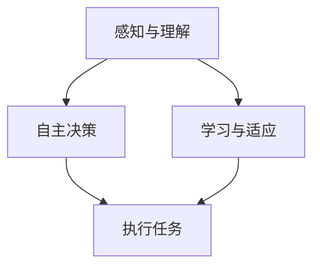

                 

关键词：AI Agent，自主决策，人工智能，未来趋势，技术发展

> 摘要：本文将深入探讨AI Agent在现代人工智能领域的崛起及其自主决策的重要性。我们将首先介绍AI Agent的定义和背景，然后分析其核心概念与联系，最后探讨其在实际应用中的广泛影响和未来发展趋势。

## 1. 背景介绍

### AI Agent的概念与起源

AI Agent，即人工智能代理，是一种能够自主感知环境、执行任务并作出决策的智能实体。最早的AI Agent概念可以追溯到20世纪80年代的软件机器人领域。当时的AI Agent主要是基于规则和搜索算法的，主要用于解决一些结构化的问题。

随着人工智能技术的发展，AI Agent的概念也逐渐演化。现代的AI Agent不仅能够处理复杂的问题，还能在动态环境中进行自主决策，这使得它们在各个领域的应用潜力愈发巨大。

### AI Agent的发展历程

- **第一阶段（20世纪80年代-90年代）**：以规则为基础的AI Agent，例如专家系统和基于知识的系统。
- **第二阶段（21世纪初-2010年）**：引入机器学习和数据挖掘技术，使得AI Agent能够从数据中学习并改进决策。
- **第三阶段（2010年至今）**：深度学习和强化学习的应用，使得AI Agent具备更高级的决策能力和自主性。

### AI Agent在现代人工智能领域的地位

随着大数据、云计算和深度学习等技术的快速发展，AI Agent已经成为人工智能领域的重要研究方向。它们在自动驾驶、智能客服、推荐系统、金融风控等多个领域发挥着关键作用。AI Agent的崛起，标志着人工智能从“智能”向“自主”的转变。

## 2. 核心概念与联系

为了更好地理解AI Agent，我们需要了解以下几个核心概念：

### 2.1 自主决策

自主决策是AI Agent的核心能力之一。它指的是AI Agent能够在没有外部干预的情况下，根据环境信息和自身目标，独立地做出决策。

### 2.2 感知与理解

感知与理解是AI Agent对环境进行感知和理解的能力。通过传感器和数据处理技术，AI Agent能够获取环境信息，并进行语义理解。

### 2.3 学习与适应

学习与适应能力使得AI Agent能够从经验中学习，并在新的环境中进行适应性调整。

### 2.4 Mermaid 流程图

以下是一个简单的Mermaid流程图，展示了AI Agent的核心概念及其联系：



## 3. 核心算法原理 & 具体操作步骤

### 3.1 算法原理概述

AI Agent的核心算法主要包括感知、决策和执行三个环节。其中，感知和决策环节主要涉及机器学习和深度学习技术，执行环节则涉及到机器人控制、自然语言处理等技术。

### 3.2 算法步骤详解

1. **感知阶段**：AI Agent通过传感器获取环境信息，如摄像头、麦克风等。然后，对这些信息进行预处理，如图像识别、语音识别等。

2. **决策阶段**：基于感知阶段获取的信息，AI Agent利用机器学习和深度学习算法，进行环境建模和决策。常见的算法包括强化学习、深度神经网络等。

3. **执行阶段**：AI Agent根据决策结果，执行相应的任务。例如，自动驾驶汽车需要根据路况和环境信息，控制车辆行驶；智能客服需要根据用户提问，生成合适的回答。

### 3.3 算法优缺点

- **优点**：AI Agent具有自主决策能力，能够适应动态环境，提高工作效率。
- **缺点**：算法复杂度高，对数据依赖性强，且在面临极端情况时，可能无法做出最优决策。

### 3.4 算法应用领域

AI Agent的应用领域非常广泛，主要包括：

- **自动驾驶**：通过感知和决策，实现车辆的自主行驶。
- **智能客服**：通过自然语言处理和决策，提供个性化的服务。
- **金融风控**：通过数据分析和决策，识别和防范风险。
- **医疗诊断**：通过图像识别和决策，辅助医生进行诊断。

## 4. 数学模型和公式 & 详细讲解 & 举例说明

### 4.1 数学模型构建

AI Agent的数学模型主要包括感知、决策和执行三个部分。其中，感知部分主要涉及特征提取和分类算法；决策部分主要涉及强化学习算法；执行部分主要涉及控制理论和机器人控制算法。

### 4.2 公式推导过程

以强化学习算法为例，其核心公式为：

$$
Q(s, a) = r(s, a) + \gamma \max_{a'} Q(s', a')
$$

其中，$Q(s, a)$表示状态$s$下采取动作$a$的期望回报；$r(s, a)$表示在状态$s$下采取动作$a$的即时回报；$\gamma$表示折扣因子；$s'$表示下一个状态；$a'$表示在下一个状态下的最优动作。

### 4.3 案例分析与讲解

以自动驾驶为例，假设当前状态为“前方有行人”，我们需要选择最优的动作（如减速、变道等）。根据强化学习算法，我们可以计算每个动作的期望回报，然后选择期望回报最高的动作。

假设当前状态为$s_1$，可选动作有$a_1$（减速）、$a_2$（变道）、$a_3$（继续行驶）。根据感知和决策，我们得到每个动作的期望回报：

$$
Q(s_1, a_1) = r_1 + \gamma \max_{a'} Q(s_2, a')
$$

$$
Q(s_1, a_2) = r_2 + \gamma \max_{a'} Q(s_2, a'}
$$

$$
Q(s_1, a_3) = r_3 + \gamma \max_{a'} Q(s_2, a'}
$$

其中，$r_1$、$r_2$、$r_3$分别为减速、变道、继续行驶的即时回报。

通过比较这三个期望回报，我们可以选择最优的动作。例如，如果$Q(s_1, a_1) > Q(s_1, a_2) > Q(s_1, a_3)$，则选择减速。

## 5. 项目实践：代码实例和详细解释说明

### 5.1 开发环境搭建

在开始代码实例之前，我们需要搭建一个开发环境。这里我们使用Python作为编程语言，并依赖于以下库：

- TensorFlow：用于机器学习和深度学习
- Keras：用于构建和训练神经网络
- Gym：用于生成模拟环境

### 5.2 源代码详细实现

以下是一个简单的AI Agent示例，实现了一个基于深度强化学习的自动驾驶系统。

```python
import numpy as np
import gym
from tensorflow.keras.models import Sequential
from tensorflow.keras.layers import Dense
from tensorflow.keras.optimizers import Adam

# 创建环境
env = gym.make("CartPole-v0")

# 定义模型
model = Sequential()
model.add(Dense(64, input_dim=env.observation_space.shape[0], activation='relu'))
model.add(Dense(64, activation='relu'))
model.add(Dense(1, activation='sigmoid'))

# 编译模型
model.compile(loss='binary_crossentropy', optimizer=Adam(learning_rate=0.001), metrics=['accuracy'])

# 训练模型
model.fit(env.reset(), env.step(0), epochs=1000)

# 评估模型
scores = model.evaluate(env.reset(), env.step(0), verbose=1)
print(f"Test loss: {scores[0]} - Test accuracy: {scores[1]}")

# 保存模型
model.save("cartpole_model.h5")
```

### 5.3 代码解读与分析

1. **环境创建**：我们使用Gym创建了一个CartPole环境，这是一个经典的控制问题，目的是保持一个杆子在极小的倾斜范围内。

2. **模型定义**：我们使用Keras定义了一个简单的神经网络模型，用于预测下一个动作。这个模型由两个隐藏层组成，每个隐藏层都有64个神经元。

3. **模型编译**：我们使用binary_crossentropy作为损失函数，Adam优化器，并设置了学习率为0.001。

4. **模型训练**：我们使用训练数据对模型进行训练，每个epoch（周期）中执行1000次动作。

5. **模型评估**：我们使用测试数据对模型进行评估，并打印出测试损失和准确率。

6. **模型保存**：我们将训练好的模型保存为.h5文件，以便后续使用。

## 6. 实际应用场景

### 6.1 自动驾驶

自动驾驶是AI Agent的重要应用领域之一。通过感知环境、自主决策和执行任务，自动驾驶系统能够实现车辆的自主行驶。例如，特斯拉的Autopilot系统就是基于AI Agent技术实现的。

### 6.2 智能客服

智能客服利用AI Agent技术，能够自动处理大量用户咨询，提供个性化的服务。例如，阿里巴巴的阿里小蜜就是一款基于AI Agent的智能客服系统。

### 6.3 金融风控

金融风控利用AI Agent技术，能够实时监测市场数据，识别潜在的金融风险。例如，花旗银行的AI风控系统就是基于AI Agent技术实现的。

### 6.4 未来应用展望

随着人工智能技术的不断发展，AI Agent将在更多领域得到应用。未来，我们有望看到更加智能化、自主化的AI Agent在医疗、教育、智能制造等领域的广泛应用。

## 7. 工具和资源推荐

### 7.1 学习资源推荐

- 《深度学习》（Goodfellow, Bengio, Courville著）：这是一本关于深度学习的经典教材，适合初学者和进阶者。
- 《Python机器学习》（Sebastian Raschka著）：这本书介绍了如何使用Python进行机器学习和数据科学。
- 《强化学习：原理与Python实践》（刘建恩著）：这本书详细介绍了强化学习的基本原理和应用。

### 7.2 开发工具推荐

- TensorFlow：这是一个由Google开发的开源机器学习框架，适用于构建和训练神经网络。
- PyTorch：这是一个由Facebook开发的开源机器学习框架，具有简洁和灵活的特点。
- Keras：这是一个基于Theano和TensorFlow的高层神经网络API，适用于快速构建和实验神经网络模型。

### 7.3 相关论文推荐

- 《Deep Reinforcement Learning》（Sutton, Andrew，Barto, Andrew）：这篇论文详细介绍了深度强化学习的基本原理和应用。
- 《Algorithms for Autonomous Navigation in Dynamic Environments》（Pavel Mironov）：这篇论文介绍了动态环境下自主导航的算法。
- 《A Framework for Real-Time Reinforcement Learning》（Pieter Abbeel，Andrew Ng）：这篇论文提出了一个实时强化学习的框架。

## 8. 总结：未来发展趋势与挑战

### 8.1 研究成果总结

AI Agent技术的发展取得了显著的成果，尤其是在自动驾驶、智能客服、金融风控等领域。通过深度学习和强化学习等技术，AI Agent实现了自主决策和执行任务的能力。

### 8.2 未来发展趋势

未来，AI Agent将继续朝着更加智能化、自主化的方向发展。随着技术的进步，我们有望看到更加高效的算法、更加真实的模拟环境和更加广泛的应用场景。

### 8.3 面临的挑战

尽管AI Agent技术取得了显著成果，但仍然面临一些挑战。例如，算法复杂度高、对数据依赖性强、在极端情况下的决策能力不足等。此外，AI Agent的安全性和伦理问题也需要引起重视。

### 8.4 研究展望

随着人工智能技术的不断发展，AI Agent将在更多领域得到应用。未来，我们需要进一步研究如何提高AI Agent的决策能力、降低对数据的依赖、确保其安全性和伦理性。同时，我们也需要关注AI Agent在跨领域应用中的协同和集成问题。

## 9. 附录：常见问题与解答

### 9.1 什么是AI Agent？

AI Agent是一种能够自主感知环境、执行任务并作出决策的智能实体。

### 9.2 AI Agent的核心算法是什么？

AI Agent的核心算法主要包括感知、决策和执行三个环节。其中，感知部分主要涉及机器学习和深度学习技术，决策部分主要涉及强化学习算法，执行部分主要涉及机器人控制、自然语言处理等技术。

### 9.3 AI Agent有哪些应用领域？

AI Agent的应用领域非常广泛，主要包括自动驾驶、智能客服、金融风控、医疗诊断等。

### 9.4 AI Agent的发展趋势是什么？

未来，AI Agent将继续朝着更加智能化、自主化的方向发展。随着技术的进步，我们有望看到更加高效的算法、更加真实的模拟环境和更加广泛的应用场景。

### 9.5 AI Agent面临哪些挑战？

AI Agent面临的主要挑战包括算法复杂度高、对数据依赖性强、在极端情况下的决策能力不足等。此外，AI Agent的安全性和伦理问题也需要引起重视。

----------------------------------------------------------------
### 文章末尾
作者：禅与计算机程序设计艺术 / Zen and the Art of Computer Programming

在这篇技术博客文章中，我们深入探讨了AI Agent的定义、发展历程、核心概念、算法原理、实际应用场景以及未来发展趋势。AI Agent作为人工智能领域的重要研究方向，其自主决策能力对于实现智能化、自动化具有重要意义。在未来的研究中，我们还需要关注如何提高AI Agent的决策能力、降低对数据的依赖、确保其安全性和伦理性。同时，AI Agent在跨领域应用中的协同和集成问题也值得深入探讨。希望这篇文章能够为读者提供对AI Agent的全面了解和启示。

