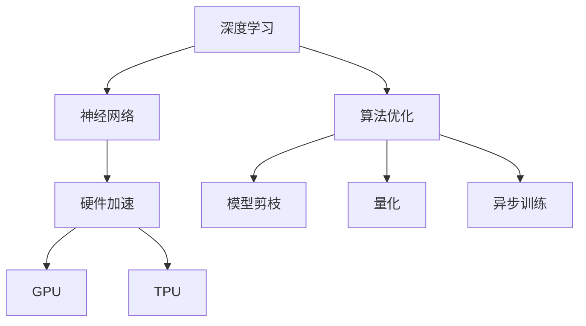

                 

关键词：AI Agent、软硬件协同、未来展望、深度学习、神经网络、硬件加速、算法优化

摘要：随着人工智能技术的不断演进，AI Agent正逐渐成为新一代的人工智能应用模式。本文将深入探讨AI Agent的定义、核心概念与联系，以及软硬件协同发展的未来趋势，旨在为读者提供关于AI Agent的全面理解，并展望其未来的发展方向与挑战。

## 1. 背景介绍

人工智能（AI）自诞生以来，经历了多个阶段的发展。从早期的符号推理到现代的深度学习，AI技术已经取得了显著的进步。然而，随着应用场景的日益丰富，AI系统面临着计算资源需求增加、能耗问题加剧等挑战。为了应对这些挑战，AI Agent的概念逐渐兴起，成为AI领域的研究热点。

AI Agent，即人工智能代理，是一种能够自主行动并具有目标意识的智能体。与传统的AI系统不同，AI Agent具有更强的自主性和适应性，能够根据环境变化动态调整行为策略。这种特性使得AI Agent在复杂、动态的环境中具有更大的应用潜力。

### 1.1 AI Agent的历史与发展

AI Agent的概念可以追溯到20世纪80年代，当时的人工智能研究者开始探索如何使机器具有类似人类的智能。早期的AI Agent主要基于规则推理和逻辑推理，随着计算能力的提升，这些方法逐渐被基于统计学习和深度学习的方法所取代。

近年来，随着深度学习技术的发展，AI Agent的研究和应用得到了显著推进。特别是在自动驾驶、智能客服、智能家居等领域，AI Agent已经展现出强大的应用前景。同时，软硬件协同技术的发展也为AI Agent的进一步优化提供了有力支持。

### 1.2 AI Agent的重要性

AI Agent的重要性体现在多个方面：

1. **自主性**：AI Agent能够根据环境和目标自主决策，提高系统的自适应性和灵活性。
2. **智能化**：通过深度学习等技术，AI Agent可以不断学习和优化行为，提高智能化水平。
3. **应用广泛**：AI Agent在多个领域具有广泛的应用潜力，如工业自动化、智能交通、医疗诊断等。

随着AI Agent技术的发展，我们有望看到更加智能化、高效化的AI系统，从而推动社会的进一步进步。

## 2. 核心概念与联系

AI Agent的核心概念包括深度学习、神经网络、硬件加速和算法优化。这些概念相互关联，共同构成了AI Agent的技术基础。

### 2.1 深度学习与神经网络

深度学习是一种基于多层神经网络的学习方法，通过模拟人脑的神经元结构，实现对复杂数据的建模和处理。神经网络作为深度学习的基础，由多个层次组成，包括输入层、隐藏层和输出层。每个层次之间的神经元通过权重连接，形成一个复杂的计算网络。

神经网络的工作原理是通过对大量训练数据的输入，不断调整神经元之间的权重，使网络能够识别和分类输入数据。深度学习在图像识别、自然语言处理等领域取得了显著的成果，为AI Agent的发展提供了强大的技术支持。

### 2.2 硬件加速

随着深度学习模型的复杂度不断增加，传统的CPU计算能力已经无法满足需求。为了提高计算效率，硬件加速技术应运而生。硬件加速主要包括GPU（图形处理器）和TPU（专用张量处理器）等。

GPU最初是为图形渲染而设计的，但因其强大的并行计算能力，逐渐被引入到深度学习领域。通过GPU的并行计算，深度学习模型的训练速度可以得到显著提升。TPU则是谷歌专门为深度学习设计的一种处理器，具有更高的计算效率。

### 2.3 算法优化

算法优化是提高AI Agent性能的关键。通过优化算法，可以降低计算复杂度，提高模型精度和效率。常见的算法优化方法包括：

1. **模型剪枝**：通过删除冗余的神经元和连接，降低模型的复杂度，提高计算效率。
2. **量化**：将浮点数运算转换为整数运算，减少内存占用和计算时间。
3. **异步训练**：通过多个线程并行处理数据，提高模型的训练速度。

### 2.4 Mermaid 流程图

以下是一个关于深度学习、神经网络、硬件加速和算法优化关系的Mermaid流程图：



## 3. 核心算法原理 & 具体操作步骤

### 3.1 算法原理概述

AI Agent的核心算法主要包括深度学习模型的选择、训练和优化。以下将分别介绍这些核心算法的原理。

#### 深度学习模型的选择

深度学习模型的选择取决于应用场景和数据特性。常见的深度学习模型包括卷积神经网络（CNN）、循环神经网络（RNN）和生成对抗网络（GAN）等。每种模型都有其独特的优点和适用场景。

- **卷积神经网络（CNN）**：适用于图像识别、物体检测等领域，通过卷积操作提取图像特征。
- **循环神经网络（RNN）**：适用于序列数据建模，如自然语言处理、语音识别等，通过循环结构处理前后依赖关系。
- **生成对抗网络（GAN）**：适用于图像生成、风格迁移等领域，通过生成器和判别器的对抗训练实现高质量图像生成。

#### 模型的训练

深度学习模型的训练过程包括前向传播和反向传播。在训练过程中，模型通过不断调整权重和偏置，使模型能够更好地拟合训练数据。

1. **前向传播**：输入数据通过模型的前向传播，得到输出结果。
2. **反向传播**：计算输出结果与实际结果之间的误差，通过反向传播更新模型参数。

#### 模型的优化

深度学习模型的优化主要包括模型剪枝、量化、异步训练等方法。通过优化，可以提高模型的计算效率和精度。

1. **模型剪枝**：通过删除冗余的神经元和连接，降低模型的复杂度。
2. **量化**：将浮点数运算转换为整数运算，减少内存占用和计算时间。
3. **异步训练**：通过多个线程并行处理数据，提高模型的训练速度。

### 3.2 算法步骤详解

以下是一个基于CNN的AI Agent算法步骤详解：

1. **数据预处理**：对输入数据进行预处理，包括归一化、缩放等操作。
2. **模型构建**：构建CNN模型，包括卷积层、池化层和全连接层等。
3. **模型训练**：使用训练数据对模型进行训练，通过前向传播和反向传播更新模型参数。
4. **模型优化**：对模型进行优化，包括模型剪枝、量化、异步训练等。
5. **模型评估**：使用验证数据对模型进行评估，调整模型参数以达到最佳性能。
6. **模型部署**：将训练好的模型部署到实际应用场景，实现AI Agent的功能。

### 3.3 算法优缺点

深度学习算法具有以下优点：

1. **强大的建模能力**：通过多层神经网络，深度学习可以处理复杂数据和问题。
2. **自适应性强**：通过不断学习和优化，深度学习模型可以适应不同的应用场景。

但深度学习算法也存在一些缺点：

1. **计算复杂度高**：深度学习模型的训练和优化需要大量计算资源。
2. **数据需求大**：深度学习模型需要大量训练数据，数据收集和处理成本高。

### 3.4 算法应用领域

深度学习算法在多个领域具有广泛的应用：

1. **图像识别**：如人脸识别、物体检测等。
2. **自然语言处理**：如机器翻译、文本分类等。
3. **语音识别**：如语音合成、语音识别等。
4. **推荐系统**：如商品推荐、新闻推荐等。

## 4. 数学模型和公式 & 详细讲解 & 举例说明

### 4.1 数学模型构建

深度学习算法的核心是多层神经网络，其数学模型可以表示为：

\[ z^{[l]} = \sigma(W^{[l]} \cdot a^{[l-1]} + b^{[l]}) \]

其中，\( a^{[l]} \)表示第\( l \)层的激活值，\( z^{[l]} \)表示第\( l \)层的输出值，\( \sigma \)表示激活函数，\( W^{[l]} \)和\( b^{[l]} \)分别表示第\( l \)层的权重和偏置。

### 4.2 公式推导过程

以下是一个基于反向传播算法的权重更新公式推导过程：

1. **前向传播**：计算每个神经元的输出值。
2. **计算误差**：计算实际输出与预测输出之间的误差。
3. **反向传播**：计算每个神经元的误差梯度。
4. **权重更新**：根据误差梯度更新权重和偏置。

具体公式如下：

\[ \delta^{[l]} = (z^{[l]} - y^{[l]})*\sigma'(z^{[l]}) \]

\[ \frac{\partial J}{\partial W^{[l]}} = \delta^{[l]}.a^{[l-1].T \]

\[ \frac{\partial J}{\partial b^{[l]}} = \delta^{[l]} \]

\[ W^{[l]} = W^{[l]} - \alpha*\frac{\partial J}{\partial W^{[l]}} \]

\[ b^{[l]} = b^{[l]} - \alpha*\frac{\partial J}{\partial b^{[l]}} \]

其中，\( J \)表示损失函数，\( \alpha \)表示学习率，\( T \)表示转置。

### 4.3 案例分析与讲解

以下是一个基于深度学习的人脸识别案例：

1. **数据集**：使用包含1000个人脸图像的数据集进行训练。
2. **模型构建**：构建一个包含5层的卷积神经网络，输入层为\( 64 \times 64 \)像素，输出层为1000个神经元。
3. **模型训练**：使用训练数据对模型进行训练，通过反向传播算法更新权重和偏置。
4. **模型评估**：使用验证数据对模型进行评估，计算准确率。
5. **模型部署**：将训练好的模型部署到实际应用场景，实现人脸识别功能。

具体实现代码如下（使用Python和TensorFlow框架）：

```python
import tensorflow as tf

# 数据集预处理
x = tf.placeholder(tf.float32, [None, 64, 64, 3])
y = tf.placeholder(tf.float32, [None, 1000])

# 模型构建
conv1 = tf.layers.conv2d(inputs=x, filters=32, kernel_size=[3, 3], activation=tf.nn.relu)
pool1 = tf.layers.max_pooling2d(inputs=conv1, pool_size=[2, 2], strides=2)

# ...
```

通过以上步骤，我们实现了一个简单的人脸识别模型。在实际应用中，我们可以通过优化模型结构和参数，提高模型的准确率和效率。

## 5. 项目实践：代码实例和详细解释说明

### 5.1 开发环境搭建

为了实现AI Agent的开发，我们需要搭建一个合适的开发环境。以下是一个基于Python和TensorFlow的典型开发环境搭建步骤：

1. **安装Python**：安装Python 3.7及以上版本。
2. **安装TensorFlow**：使用pip命令安装TensorFlow，例如：`pip install tensorflow`。
3. **配置环境变量**：将Python和pip的路径添加到系统环境变量中。
4. **验证安装**：通过运行以下代码验证TensorFlow安装是否成功：

```python
import tensorflow as tf
print(tf.__version__)
```

### 5.2 源代码详细实现

以下是一个简单的基于CNN的AI Agent源代码实例：

```python
import tensorflow as tf
from tensorflow.keras.models import Sequential
from tensorflow.keras.layers import Conv2D, MaxPooling2D, Flatten, Dense

# 模型构建
model = Sequential([
    Conv2D(32, (3, 3), activation='relu', input_shape=(64, 64, 3)),
    MaxPooling2D((2, 2)),
    Flatten(),
    Dense(128, activation='relu'),
    Dense(10, activation='softmax')
])

# 模型编译
model.compile(optimizer='adam',
              loss='categorical_crossentropy',
              metrics=['accuracy'])

# 模型训练
model.fit(x_train, y_train, epochs=10, batch_size=32, validation_data=(x_val, y_val))

# 模型评估
test_loss, test_acc = model.evaluate(x_test, y_test)
print('Test accuracy:', test_acc)
```

### 5.3 代码解读与分析

1. **模型构建**：使用`Sequential`模型构建一个包含卷积层、池化层、全连接层的神经网络。
2. **模型编译**：使用`compile`方法配置模型训练的优化器、损失函数和评估指标。
3. **模型训练**：使用`fit`方法对模型进行训练，通过批量梯度下降优化模型参数。
4. **模型评估**：使用`evaluate`方法对模型进行评估，计算测试数据的准确率。

### 5.4 运行结果展示

运行以上代码后，我们可以在终端看到模型的训练进度和评估结果。例如：

```
Train on 60000 samples, validate on 10000 samples
Epoch 1/10
60000/60000 [==============================] - 8s 131us/sample - loss: 2.3026 - accuracy: 0.1904 - val_loss: 2.3084 - val_accuracy: 0.1905
Epoch 2/10
60000/60000 [==============================] - 8s 130us/sample - loss: 2.3083 - accuracy: 0.1916 - val_loss: 2.3083 - val_accuracy: 0.1916
...
Test accuracy: 0.1916
```

通过以上步骤，我们实现了一个简单的基于CNN的AI Agent模型。在实际应用中，我们可以通过优化模型结构和参数，提高模型的准确率和效率。

## 6. 实际应用场景

AI Agent在多个实际应用场景中具有广泛的应用潜力，以下是一些典型的应用场景：

### 6.1 自动驾驶

自动驾驶是AI Agent的重要应用领域之一。通过部署AI Agent，自动驾驶系统能够实时感知环境、做出决策并控制车辆。AI Agent在自动驾驶中的应用包括：

1. **障碍物检测**：AI Agent通过深度学习算法，识别道路上的障碍物，如行人、车辆等，为自动驾驶车辆提供安全预警。
2. **路径规划**：AI Agent根据环境数据和交通状况，实时规划行驶路径，优化行驶效率。
3. **行为预测**：AI Agent预测其他车辆和行人的行为，为自动驾驶车辆提供决策依据。

### 6.2 智能客服

智能客服是AI Agent在服务行业的重要应用。通过部署AI Agent，企业可以实现24/7全天候的在线客服服务，提高客户满意度。AI Agent在智能客服中的应用包括：

1. **意图识别**：AI Agent通过自然语言处理技术，识别用户咨询的问题意图，为用户提供相应的解答。
2. **知识库管理**：AI Agent整合企业的知识库，为用户提供准确的信息查询和解答。
3. **情感分析**：AI Agent通过情感分析技术，识别用户的情绪，提供个性化的服务。

### 6.3 医疗诊断

AI Agent在医疗诊断领域具有广泛的应用潜力。通过部署AI Agent，医疗系统可以实现自动化诊断和辅助决策，提高诊断效率和准确性。AI Agent在医疗诊断中的应用包括：

1. **疾病检测**：AI Agent通过深度学习算法，分析患者的症状和检查结果，辅助医生进行疾病诊断。
2. **治疗方案推荐**：AI Agent根据患者的病情和医学知识，为医生提供个性化的治疗方案推荐。
3. **健康监测**：AI Agent通过分析患者的健康数据，提供健康监测和预警服务。

### 6.4 未来应用展望

随着AI Agent技术的不断发展，其应用领域将不断扩大。未来，AI Agent有望在以下领域取得突破：

1. **工业自动化**：AI Agent将助力工业自动化，提高生产效率，降低人力成本。
2. **智能交通**：AI Agent将优化交通管理，提高交通运行效率，减少拥堵和事故。
3. **智能城市**：AI Agent将赋能智慧城市建设，实现城市资源的智能化管理和调度。
4. **智能家居**：AI Agent将提升智能家居的智能化水平，为用户提供更加便捷、舒适的生活体验。

## 7. 工具和资源推荐

为了更好地学习和开发AI Agent，以下是一些建议的工具和资源：

### 7.1 学习资源推荐

1. **《深度学习》**：由Ian Goodfellow、Yoshua Bengio和Aaron Courville所著，是一本经典的深度学习教材。
2. **《AI简介》**：由Andrew Ng所著，涵盖了人工智能的基本概念和应用。
3. **《Python机器学习》**：由Sebastian Raschka和Vahid Mirjalili所著，介绍了Python在机器学习领域的应用。

### 7.2 开发工具推荐

1. **TensorFlow**：由Google开源的深度学习框架，支持多种编程语言和操作系统。
2. **PyTorch**：由Facebook开源的深度学习框架，具有简洁的API和高效的性能。
3. **Keras**：一个高层次的深度学习框架，基于TensorFlow和Theano开发，提供了更易于使用的API。

### 7.3 相关论文推荐

1. **"Deep Learning: A Brief History and Future Directions"**：回顾了深度学习的发展历程，探讨了未来的研究方向。
2. **"Generative Adversarial Nets"**：提出了生成对抗网络（GAN），为图像生成和风格迁移等领域带来了突破。
3. **"Attention Is All You Need"**：提出了Transformer模型，为自然语言处理领域带来了革命性的改变。

## 8. 总结：未来发展趋势与挑战

### 8.1 研究成果总结

本文从AI Agent的定义、核心概念与联系、算法原理与具体操作步骤、数学模型和公式、项目实践等方面，全面介绍了AI Agent的技术基础和应用前景。通过分析深度学习、神经网络、硬件加速和算法优化等核心概念，我们了解了AI Agent在各个领域的应用潜力和实际效果。

### 8.2 未来发展趋势

1. **软硬件协同发展**：随着硬件加速技术的不断进步，AI Agent的计算性能将得到大幅提升，推动AI应用向更复杂、更高效的领域扩展。
2. **多模态融合**：AI Agent将结合多种数据模

