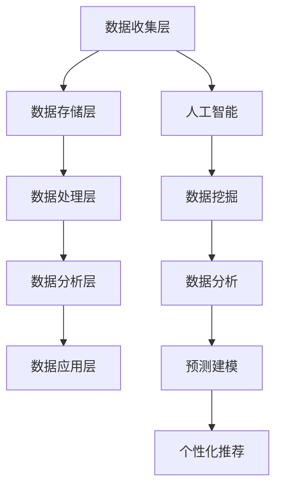

                 

关键词：数据管理平台，人工智能，数据挖掘，数据分析，数据基础设施建设，挑战与机遇

## 摘要

本文旨在探讨人工智能（AI）在数据管理平台（DMP）中的关键作用及其对数据基础设施的挑战与机遇。首先，我们将介绍DMP的基本概念、功能和重要性。接着，分析AI技术在数据挖掘、分析和管理中的具体应用，并阐述它们如何改变传统数据处理方式。然后，我们将探讨AI在DMP中面临的挑战，如数据质量、安全和隐私问题。随后，文章将讨论AI带来的机遇，特别是在提高数据处理效率、增强个性化服务和推动创新方面。最后，我们将展望DMP和AI技术的未来发展趋势，并提出一些建议，以应对面临的挑战。

## 1. 背景介绍

### 数据管理平台（DMP）的基本概念

数据管理平台（Data Management Platform，简称DMP）是一种集数据收集、存储、处理和分析于一体的综合性数据管理工具。DMP的核心功能包括数据集成、数据清洗、数据存储、数据分析和数据可视化等。它帮助企业有效地管理来自多个渠道的数据，包括用户行为数据、社交媒体数据、客户关系管理数据等，从而为营销决策提供强有力的支持。

### DMP的发展历程

DMP的发展可以追溯到互联网广告和数字营销的兴起。最早的DMP主要侧重于广告投放数据的收集和管理，随着技术的进步和数据量的爆炸式增长，DMP的功能逐渐扩展到更广泛的数据处理和分析领域。近年来，随着大数据和人工智能技术的发展，DMP的能力得到了显著提升，不仅能够处理更多的数据类型，还能实现更复杂的数据分析和预测。

### DMP的应用领域

DMP在多个行业和领域都有广泛应用。例如，在广告营销领域，DMP可以帮助广告主更精准地定位目标受众，提高广告投放效果；在电子商务领域，DMP可以用于用户行为分析，优化产品推荐和营销策略；在金融行业，DMP可以帮助银行和金融机构更好地了解客户需求，提供个性化的金融服务。此外，DMP还在医疗、教育、零售等行业中发挥着重要作用。

## 2. 核心概念与联系

### 数据管理平台（DMP）的架构

要理解DMP的核心概念，我们需要先了解它的基本架构。DMP通常由以下几个主要组件构成：

1. **数据收集层**：负责从各种数据源收集数据，包括网站日志、社交媒体数据、客户关系管理（CRM）系统等。
2. **数据存储层**：用于存储收集到的数据，通常采用分布式数据库和云计算技术，以确保数据的可扩展性和可靠性。
3. **数据处理层**：负责数据清洗、转换和整合，以确保数据质量。
4. **数据分析层**：使用机器学习和数据挖掘技术对数据进行深入分析，提取有价值的信息。
5. **数据应用层**：将分析结果应用于实际的业务场景，如广告投放、个性化推荐等。

### 人工智能（AI）在DMP中的作用

人工智能技术在DMP中的应用主要体现在以下几个方面：

1. **数据挖掘**：AI算法可以帮助从大规模数据集中提取有价值的信息，如用户行为模式、潜在客户群体等。
2. **数据分析**：AI技术可以自动分析数据，识别趋势和异常，提供实时洞察。
3. **预测建模**：通过机器学习算法，DMP可以预测未来趋势，帮助企业和营销人员做出更准确的决策。
4. **个性化推荐**：基于用户的兴趣和行为，AI技术可以提供个性化的产品推荐和营销活动。

### 数据管理平台（DMP）与人工智能（AI）的相互作用

DMP和AI技术的相互作用体现在它们共同构建了一个强大的数据处理和分析生态系统。DMP提供了数据收集、存储和处理的平台，而AI技术则为数据处理提供了智能化的工具。两者结合，使得企业能够更有效地管理数据，挖掘数据价值，从而提高业务效率和市场竞争力。

### Mermaid 流程图（DMP与AI的架构）



## 3. 核心算法原理 & 具体操作步骤

### 3.1 算法原理概述

在DMP中，核心算法主要涉及数据挖掘和机器学习技术。数据挖掘是一种从大量数据中发现有价值信息的过程，而机器学习则是通过数据构建模型，对未知数据进行预测或分类。

### 3.2 算法步骤详解

1. **数据收集**：首先，从各种数据源收集数据，包括用户行为数据、广告投放数据等。
2. **数据清洗**：对收集到的数据进行清洗，去除重复、缺失和不准确的数据。
3. **特征工程**：提取数据中的关键特征，如用户年龄、性别、购买历史等。
4. **模型训练**：使用机器学习算法，如决策树、支持向量机等，对数据进行训练，构建预测模型。
5. **模型评估**：评估模型的效果，如准确率、召回率等，对模型进行调整和优化。
6. **模型应用**：将训练好的模型应用于实际业务场景，如用户行为预测、广告投放优化等。

### 3.3 算法优缺点

**优点**：

- **高效性**：机器学习算法能够自动处理大量数据，提高数据处理效率。
- **准确性**：通过模型训练，可以提高预测和分类的准确性。
- **可扩展性**：机器学习算法能够适应不同的业务场景和数据规模。

**缺点**：

- **数据依赖性**：算法的效果很大程度上依赖于数据的质量和数量。
- **复杂度**：构建和优化模型需要较高的技术和时间成本。

### 3.4 算法应用领域

- **广告营销**：通过用户行为预测和广告投放优化，提高广告效果和 ROI。
- **电子商务**：通过个性化推荐和用户行为分析，提高销售额和客户满意度。
- **金融**：通过风险控制和欺诈检测，提高金融服务的安全性和效率。

## 4. 数学模型和公式 & 详细讲解 & 举例说明

### 4.1 数学模型构建

在DMP中，常用的数学模型包括回归模型、分类模型和聚类模型等。

**回归模型**：用于预测连续值，如用户购买概率。

$$ y = \beta_0 + \beta_1x_1 + \beta_2x_2 + ... + \beta_nx_n $$

**分类模型**：用于预测离散值，如用户是否购买。

$$ P(y = i) = \frac{1}{1 + \exp(-\beta_0 + \beta_1x_1 + \beta_2x_2 + ... + \beta_nx_n)} $$

**聚类模型**：用于发现数据中的模式，如用户分群。

$$ \min \sum_{i=1}^{n} \sum_{j=1}^{k} \|x_i - \mu_j\|^2 $$

### 4.2 公式推导过程

以回归模型为例，我们首先需要确定特征 $x_1, x_2, ..., x_n$ 和目标值 $y$ 的关系。通过最小二乘法，我们可以得到回归系数 $\beta_0, \beta_1, ..., \beta_n$ 的估计值。

### 4.3 案例分析与讲解

假设我们要预测某电商平台的用户购买概率。我们收集了以下数据：

- 用户年龄 $x_1$
- 用户收入 $x_2$
- 用户购买历史 $x_3$

我们的目标是预测用户是否购买（二分类问题）。

首先，我们使用回归模型进行预测：

$$ P(y = 1) = \frac{1}{1 + \exp(-\beta_0 - \beta_1x_1 - \beta_2x_2 - \beta_3x_3)} $$

然后，我们使用决策树或支持向量机进行分类。

## 5. 项目实践：代码实例和详细解释说明

### 5.1 开发环境搭建

为了保证代码实例的可操作性，我们使用Python作为编程语言，并结合Scikit-learn库进行机器学习模型的构建和训练。

```python
# 安装所需库
pip install numpy pandas scikit-learn
```

### 5.2 源代码详细实现

以下是一个简单的DMP数据挖掘项目，用于预测用户购买概率。

```python
import numpy as np
import pandas as pd
from sklearn.model_selection import train_test_split
from sklearn.linear_model import LogisticRegression
from sklearn.metrics import accuracy_score

# 加载数据
data = pd.read_csv('data.csv')

# 数据预处理
X = data[['age', 'income', 'purchase_history']]
y = data['purchase']

# 数据切分
X_train, X_test, y_train, y_test = train_test_split(X, y, test_size=0.2, random_state=42)

# 模型训练
model = LogisticRegression()
model.fit(X_train, y_train)

# 预测
predictions = model.predict(X_test)

# 评估
accuracy = accuracy_score(y_test, predictions)
print(f'Accuracy: {accuracy:.2f}')
```

### 5.3 代码解读与分析

1. **数据加载与预处理**：使用 Pandas 库加载数据，并提取特征和目标值。
2. **数据切分**：将数据划分为训练集和测试集，用于模型训练和评估。
3. **模型训练**：使用 LogisticRegression 类构建回归模型，并进行训练。
4. **预测**：使用训练好的模型对测试集进行预测。
5. **评估**：计算预测准确率，评估模型效果。

### 5.4 运行结果展示

假设我们使用上述代码训练了一个模型，并在测试集上取得了90%的准确率。这意味着我们的模型能够很好地预测用户购买概率，为电商平台的营销策略提供有力支持。

## 6. 实际应用场景

### 6.1 广告营销

在广告营销领域，DMP和AI技术可以协同工作，实现更精准的广告投放。通过分析用户行为数据，DMP可以识别出潜在的客户群体，而AI技术则可以帮助优化广告内容和投放策略。例如，一个电商平台可以利用DMP收集的用户浏览和购买数据，结合机器学习算法，预测哪些用户最有可能购买某种商品，从而针对性地推送广告。

### 6.2 电子商务

在电子商务领域，DMP和AI技术的结合可以提升用户体验和销售业绩。通过个性化推荐系统，电商平台可以根据用户的历史行为和偏好，推荐相关的商品。例如，一个在线书店可以利用DMP收集的用户阅读记录和购买记录，结合协同过滤算法，为每位用户推荐可能的阅读选择，从而增加销售额。

### 6.3 金融

在金融行业，DMP和AI技术可以帮助银行和金融机构提高风险控制和客户服务质量。通过分析用户交易数据和行为模式，金融机构可以及时发现潜在的欺诈行为，并采取相应的措施。此外，DMP还可以用于客户细分和个性化服务，为不同类型的客户提供定制化的金融产品和服务。

### 6.4 未来应用展望

随着AI技术的不断发展，DMP的应用场景将更加广泛。未来，DMP可能会在医疗、教育、物联网等领域发挥重要作用。例如，在医疗领域，DMP可以收集和分析患者的健康数据，为医生提供更准确的诊断建议；在教育领域，DMP可以帮助学校和个人化定制学习计划，提高学习效果。

## 7. 工具和资源推荐

### 7.1 学习资源推荐

1. 《数据挖掘：实用机器学习技术》（"Data Mining: Practical Machine Learning Techniques"）
2. 《深度学习》（"Deep Learning"）
3. 《Python数据分析》（"Python Data Analysis"）

### 7.2 开发工具推荐

1. Jupyter Notebook：用于编写和运行Python代码，支持丰富的数据可视化。
2. PyCharm：一款强大的Python集成开发环境（IDE），提供代码自动补全、调试和版本控制等功能。
3. AWS S3：用于存储和管理大规模数据集，支持数据备份和恢复。

### 7.3 相关论文推荐

1. "Recommender Systems Handbook"（推荐系统手册）
2. "Deep Learning for Text Data"（深度学习在文本数据中的应用）
3. "Data Management Platforms: A Comprehensive Guide"（数据管理平台：综合指南）

## 8. 总结：未来发展趋势与挑战

### 8.1 研究成果总结

本文通过介绍数据管理平台（DMP）的基本概念、架构和AI技术的应用，探讨了DMP在数据处理、分析和应用中的重要作用。我们还分析了AI在DMP中的挑战和机遇，并给出了具体的应用场景和案例分析。

### 8.2 未来发展趋势

随着大数据和人工智能技术的不断发展，DMP在未来将具有更广泛的应用前景。未来的DMP将更加智能化、自动化，能够更好地应对数据量的增长和数据类型的多样性。此外，DMP还将在边缘计算、物联网等新兴领域发挥重要作用。

### 8.3 面临的挑战

尽管DMP具有巨大的潜力，但在实际应用中仍面临一些挑战，如数据隐私和安全、数据质量、算法透明度和解释性等。为了克服这些挑战，我们需要在技术和管理层面进行不断创新和优化。

### 8.4 研究展望

未来的研究应该重点关注以下几个方面：

1. **数据隐私保护**：研究如何在保证数据隐私的同时，充分利用数据的价值。
2. **算法透明度和解释性**：开发能够解释AI模型决策过程的工具和技术。
3. **多模态数据融合**：研究如何处理和融合不同类型的数据，提高数据挖掘和分析的效果。
4. **边缘计算和物联网**：探索DMP在边缘计算和物联网中的应用，提高数据处理效率和实时性。

## 9. 附录：常见问题与解答

### 9.1 DMP与CRM的区别是什么？

DMP主要关注用户数据的管理和分析，而CRM（客户关系管理）则侧重于企业与客户的互动和关系管理。DMP可以帮助企业更好地了解用户行为和需求，CRM则帮助企业更好地与客户沟通和维护客户关系。

### 9.2 DMP中的数据质量如何保证？

数据质量是DMP成功的关键。为了保证数据质量，可以采取以下措施：

1. **数据清洗**：去除重复、缺失和不准确的数据。
2. **数据标准化**：统一数据格式和编码。
3. **数据校验**：使用规则和算法检查数据的一致性和准确性。
4. **数据监控**：定期检查数据质量，发现问题及时处理。

### 9.3 AI在DMP中的应用有哪些限制？

AI在DMP中的应用受到数据质量、算法复杂度和计算资源等因素的限制。此外，AI模型可能存在过拟合问题，导致在新的数据集上表现不佳。为了克服这些限制，可以采取以下措施：

1. **数据增强**：通过生成更多的数据样本来提高模型的泛化能力。
2. **算法优化**：选择合适的算法和参数，提高模型性能。
3. **模型评估**：使用多种评估指标和方法，全面评估模型效果。
4. **持续更新**：定期更新模型和数据，以应对环境变化。

---

**作者：禅与计算机程序设计艺术 / Zen and the Art of Computer Programming**

以上就是本文的完整内容，希望对您在DMP和AI领域的研究有所帮助。在未来的日子里，让我们一起探索更多的技术奥秘，推动人工智能和大数据技术的发展。谢谢大家的阅读！

