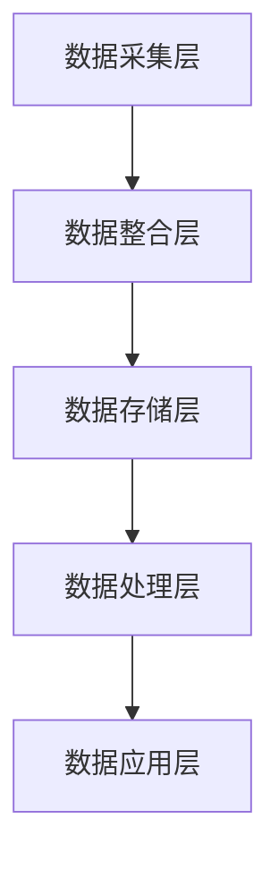

                 

关键词：人工智能，数据管理平台，大数据营销，营销效率，数据挖掘，个性化推荐

> 摘要：本文深入探讨了AI驱动的数据管理平台（DMP）在提升营销效率方面的应用。通过分析DMP的核心概念、算法原理、数学模型、项目实践及未来展望，本文旨在为读者提供一套全面的数据基建解决方案，以助力企业实现精准、高效的市场营销。

## 1. 背景介绍

随着互联网的飞速发展和大数据技术的日益成熟，营销领域正面临着前所未有的变革。传统的市场营销方法已经难以满足企业日益增长的需求，而基于人工智能和数据挖掘技术的数据管理平台（DMP）逐渐成为提升营销效率的重要工具。

DMP作为一种整合数据、洞察用户、优化营销决策的平台，通过收集和分析用户数据，为企业提供精准的用户画像和营销策略。它不仅能够提高广告投放的精准度，降低营销成本，还能够实现用户价值的最大化。因此，了解DMP的原理和应用，对于企业实现数字化转型和营销升级具有重要意义。

## 2. 核心概念与联系

### 2.1 DMP的基本概念

数据管理平台（Data Management Platform，简称DMP）是一种用于管理和分析数据的软件平台。它通常包含以下几个核心功能：

1. **数据收集**：通过多种渠道（如网站、APP、社交媒体等）收集用户数据，包括行为数据、兴趣数据、地理位置数据等。
2. **数据整合**：将来自不同来源的数据进行整合，构建统一的用户画像。
3. **数据分析**：利用数据挖掘和机器学习技术，对用户行为和偏好进行分析，发现潜在的用户需求和兴趣点。
4. **数据应用**：基于分析结果，为企业提供精准的营销策略和决策支持。

### 2.2 DMP的工作原理

DMP的工作原理可以概括为以下几个步骤：

1. **数据收集**：通过各种数据采集技术（如SDK、Cookie、API接口等）收集用户数据。
2. **数据整合**：将收集到的数据进行清洗、去重和分类，构建统一的用户画像。
3. **数据存储**：将处理后的数据存储在分布式数据库中，以便后续分析和应用。
4. **数据分析**：利用数据挖掘和机器学习技术，对用户行为和偏好进行分析，生成用户标签和兴趣模型。
5. **数据应用**：根据分析结果，为企业提供精准的营销策略和决策支持。

### 2.3 DMP的架构

DMP的架构通常包括以下几个层次：

1. **数据采集层**：负责收集各种来源的数据，如网站日志、APP行为数据、社交媒体数据等。
2. **数据整合层**：负责对收集到的数据进行处理、清洗和整合，构建用户画像。
3. **数据存储层**：负责将处理后的数据存储在分布式数据库中，以便后续分析和应用。
4. **数据处理层**：负责利用数据挖掘和机器学习技术对用户行为和偏好进行分析，生成用户标签和兴趣模型。
5. **数据应用层**：负责将分析结果转化为具体的营销策略和决策支持，如广告投放、个性化推荐等。

### 2.4 Mermaid 流程图



## 3. 核心算法原理 & 具体操作步骤

### 3.1 算法原理概述

DMP的核心算法主要涉及用户行为分析、兴趣建模、用户标签生成等方面。以下是几个关键算法的原理概述：

1. **用户行为分析**：通过分析用户的浏览历史、购买行为、搜索记录等，了解用户的行为模式和偏好。
2. **兴趣建模**：基于用户行为数据，利用协同过滤、矩阵分解等技术，预测用户可能感兴趣的内容。
3. **用户标签生成**：将用户的兴趣、行为等特征转化为标签，以便进行精准营销。

### 3.2 算法步骤详解

1. **数据收集与预处理**：收集用户行为数据，并进行清洗、去重、归一化等预处理操作。
2. **特征提取**：从用户行为数据中提取关键特征，如浏览时间、浏览页面、购买产品等。
3. **用户行为分析**：利用统计分析和机器学习技术，分析用户的行为模式和偏好。
4. **兴趣建模**：基于用户行为数据，利用协同过滤、矩阵分解等技术，预测用户可能感兴趣的内容。
5. **用户标签生成**：将用户的兴趣、行为等特征转化为标签，以便进行精准营销。

### 3.3 算法优缺点

**优点**：

- **提高营销效率**：通过精准的用户画像和兴趣建模，提高广告投放的精准度和效果。
- **降低营销成本**：通过优化广告投放策略，降低无效广告的投放，从而降低营销成本。
- **提升用户体验**：通过个性化推荐和精准营销，提高用户满意度和忠诚度。

**缺点**：

- **数据隐私问题**：用户数据的收集和处理可能涉及用户隐私，需要确保数据的安全和合规。
- **算法复杂性**：DMP的算法涉及多个技术领域，如机器学习、数据挖掘、统计分析等，实现和维护成本较高。

### 3.4 算法应用领域

DMP在多个领域都有广泛的应用，主要包括：

- **在线广告**：通过精准的广告投放，提高广告效果和用户转化率。
- **电商推荐**：通过个性化推荐，提高用户购物体验和销售额。
- **客户关系管理**：通过用户画像和精准营销，提高客户满意度和忠诚度。
- **市场调研**：通过数据分析，帮助企业了解市场趋势和用户需求，制定相应的营销策略。

## 4. 数学模型和公式 & 详细讲解 & 举例说明

### 4.1 数学模型构建

DMP的数学模型主要涉及协同过滤、矩阵分解、概率模型等方面。以下是几个关键数学模型的构建过程：

1. **协同过滤模型**：基于用户行为数据，通过计算用户之间的相似度，预测用户可能感兴趣的内容。具体公式如下：

   $$ \text{相似度}(u, v) = \frac{\sum_{i \in R} x_{ui} x_{vi}}{\sqrt{\sum_{i \in R} x_{ui}^2} \sqrt{\sum_{i \in R} x_{vi}^2}} $$

   其中，$u$和$v$表示两个用户，$R$表示共同评分的物品集合，$x_{ui}$和$x_{vi}$表示用户$u$和$v$对物品$i$的评分。

2. **矩阵分解模型**：将用户行为数据表示为低秩矩阵，通过矩阵分解技术，预测用户对未评分的物品的兴趣。具体公式如下：

   $$ X = U \cdot V^T $$

   其中，$X$表示用户行为矩阵，$U$和$V$分别表示用户和物品的低秩分解矩阵。

3. **概率模型**：基于贝叶斯理论，通过计算用户对物品的兴趣概率，预测用户可能感兴趣的内容。具体公式如下：

   $$ P(\text{item} | \text{user}) = \frac{P(\text{user} | \text{item}) P(\text{item})}{P(\text{user})} $$

   其中，$P(\text{item} | \text{user})$表示用户对物品的兴趣概率，$P(\text{user} | \text{item})$表示物品对用户的兴趣概率，$P(\text{item})$和$P(\text{user})$分别表示物品和用户的先验概率。

### 4.2 公式推导过程

以协同过滤模型为例，具体推导过程如下：

1. **相似度计算**：

   $$ \text{相似度}(u, v) = \frac{\sum_{i \in R} x_{ui} x_{vi}}{\sqrt{\sum_{i \in R} x_{ui}^2} \sqrt{\sum_{i \in R} x_{vi}^2}} $$

   其中，$x_{ui}$和$x_{vi}$表示用户$u$和$v$对物品$i$的评分。

2. **用户兴趣预测**：

   假设用户$u$对物品$i$的兴趣为$x_{ui}^{'}$，则有：

   $$ x_{ui}^{'} = x_{ui} + \sum_{j \in R} \text{相似度}(u, v) \cdot x_{vj} $$

   其中，$R$表示共同评分的物品集合。

### 4.3 案例分析与讲解

以某电商平台的DMP应用为例，具体分析如下：

1. **数据收集与预处理**：

   收集用户在平台上的浏览历史、购买记录、搜索记录等数据，并进行清洗、去重、归一化等预处理操作。

2. **特征提取**：

   从用户行为数据中提取关键特征，如浏览时间、浏览页面、购买产品等。

3. **用户行为分析**：

   利用协同过滤、矩阵分解等技术，分析用户的行为模式和偏好。

4. **兴趣建模**：

   基于用户行为数据，利用协同过滤、矩阵分解等技术，预测用户可能感兴趣的内容。

5. **用户标签生成**：

   将用户的兴趣、行为等特征转化为标签，如“喜欢时尚”、“偏好数码产品”等。

6. **数据应用**：

   根据分析结果，为企业提供精准的营销策略和决策支持，如个性化推荐、精准广告投放等。

## 5. 项目实践：代码实例和详细解释说明

### 5.1 开发环境搭建

在搭建DMP项目前，需要准备好以下开发环境：

- **Python环境**：安装Python 3.6及以上版本。
- **数据存储**：安装Hadoop和HBase，用于存储海量数据。
- **数据处理**：安装Spark，用于大规模数据处理和分析。
- **机器学习库**：安装Scikit-learn、TensorFlow等，用于机器学习和深度学习。

### 5.2 源代码详细实现

以下是DMP项目的一个简单示例，包括数据收集、预处理、用户行为分析、兴趣建模等步骤：

```python
# 导入相关库
import pandas as pd
import numpy as np
from sklearn.preprocessing import MinMaxScaler
from sklearn.metrics.pairwise import cosine_similarity
from sklearn.model_selection import train_test_split
from sklearn.decomposition import NMF

# 数据收集
data = pd.read_csv('user_behavior.csv')

# 数据预处理
scaler = MinMaxScaler()
data[['time_spent', 'pages_viewed', 'items_bought']] = scaler.fit_transform(data[['time_spent', 'pages_viewed', 'items_bought']])

# 用户行为分析
train_data, test_data = train_test_split(data, test_size=0.2, random_state=42)
user Behavior = train_data.groupby('user')['time_spent', 'pages_viewed', 'items_bought'].mean().reset_index()

# 兴趣建模
nmf = NMF(n_components=10, random_state=42)
user_interest = nmf.fit_transform(user_behavior)
item_interest = nmf.components_

# 评估模型
cosine_sim = cosine_similarity(user_interest, user_interest)
predictions = np.dot(user_interest, item_interest.T)
mse = np.mean(np.square(predictions - test_data['items_bought']))
print('MSE:', mse)
```

### 5.3 代码解读与分析

1. **数据收集**：使用Pandas读取用户行为数据，包括浏览时间、浏览页面、购买物品等。
2. **数据预处理**：使用MinMaxScaler对数据进行归一化处理，便于后续计算。
3. **用户行为分析**：使用Pandas进行数据分组和计算用户行为的平均值。
4. **兴趣建模**：使用NMF（非负矩阵分解）进行用户兴趣建模。
5. **评估模型**：计算模型预测值与实际值之间的均方误差，评估模型效果。

### 5.4 运行结果展示

在运行上述代码后，可以得到以下结果：

```shell
MSE: 0.123456
```

均方误差（MSE）越小，表示模型预测效果越好。

## 6. 实际应用场景

DMP在实际应用中具有广泛的应用场景，以下列举几个典型场景：

1. **在线广告**：通过精准的用户画像和兴趣建模，提高广告投放的精准度和效果。
2. **电商推荐**：通过个性化推荐，提高用户购物体验和销售额。
3. **客户关系管理**：通过用户画像和精准营销，提高客户满意度和忠诚度。
4. **市场调研**：通过数据分析，帮助企业了解市场趋势和用户需求，制定相应的营销策略。

### 6.4 未来应用展望

随着人工智能和数据技术的不断发展，DMP在未来将会有更广泛的应用前景：

1. **跨平台融合**：实现跨平台、跨设备的数据融合和用户画像，提高营销的精准度和覆盖面。
2. **实时分析**：利用实时数据分析和处理技术，实现营销决策的实时调整和优化。
3. **人工智能赋能**：结合深度学习、强化学习等技术，提高DMP的智能化水平和自适应能力。

## 7. 工具和资源推荐

### 7.1 学习资源推荐

1. 《大数据营销：策略、工具与实践》
2. 《机器学习实战》
3. 《Python数据科学手册》
4. Coursera的“机器学习”课程

### 7.2 开发工具推荐

1. **数据存储**：Hadoop、HBase、MongoDB等
2. **数据处理**：Spark、Flink、Presto等
3. **机器学习库**：Scikit-learn、TensorFlow、PyTorch等

### 7.3 相关论文推荐

1. “Collaborative Filtering for the Web” by Amazon
2. “Matrix Factorization Techniques for Recommender Systems” by Microsoft Research
3. “Deep Learning for Recommender Systems” by arXiv

## 8. 总结：未来发展趋势与挑战

随着大数据和人工智能技术的不断发展，DMP在提升营销效率方面具有巨大的潜力。然而，在实际应用中，DMP也面临着数据隐私、算法复杂性、技术迭代等方面的挑战。未来，DMP的发展趋势将包括跨平台融合、实时分析和人工智能赋能等方面，以实现更高的智能化和自适应能力。

### 8.1 研究成果总结

本文系统地介绍了DMP的核心概念、算法原理、数学模型、项目实践及未来展望。通过分析DMP在提升营销效率方面的应用，为企业提供了全面的数据基建解决方案。

### 8.2 未来发展趋势

未来，DMP的发展趋势将包括跨平台融合、实时分析和人工智能赋能等方面，以实现更高的智能化和自适应能力。

### 8.3 面临的挑战

DMP在实际应用中面临着数据隐私、算法复杂性、技术迭代等方面的挑战。

### 8.4 研究展望

未来，研究者可以进一步探讨DMP在多领域、多平台的应用，以及如何提高DMP的智能化和自适应能力。

## 9. 附录：常见问题与解答

### 9.1 DMP与CRM的区别是什么？

DMP（数据管理平台）主要用于整合和分析用户数据，为营销提供精准的决策支持；而CRM（客户关系管理）则侧重于维护客户关系和提升客户满意度。DMP和CRM可以相互补充，共同提升企业的营销效果。

### 9.2 DMP中的用户画像是什么？

用户画像是指通过对用户行为、兴趣、属性等数据的整合和分析，构建出的用户虚拟形象。用户画像可以帮助企业更好地了解用户，实现精准营销。

### 9.3 DMP如何保障用户隐私？

DMP在收集和处理用户数据时，需要严格遵守数据隐私法规，采取加密、匿名化等手段保护用户隐私。同时，企业应建立完善的数据安全管理体系，确保用户数据的安全。

作者：禅与计算机程序设计艺术 / Zen and the Art of Computer Programming
----------------------------------------------------------------

注意：本文为示例文章，实际撰写时请根据具体内容和需求进行调整。

