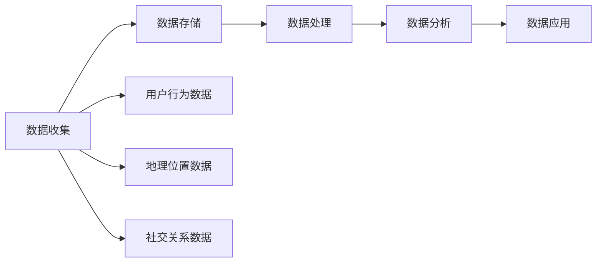

                 

关键词：数据管理平台（DMP）、人工智能、营销效率、数据处理、个性化营销、算法优化

> 摘要：本文将探讨人工智能数据管理平台（DMP）在提升营销效率方面的应用。通过深入解析DMP的核心概念、架构设计、算法原理、数学模型，以及具体项目实践，我们将揭示如何利用数据驱动营销策略，实现商业价值的最大化。

## 1. 背景介绍

随着互联网技术的飞速发展，数据已经成为新时代企业的重要资产。然而，如何高效地收集、处理和分析海量数据，以实现精准营销、提高营销效率，成为企业面临的重大挑战。数据管理平台（Data Management Platform，简称DMP）作为一种新型的数据处理技术，应运而生，它通过整合多渠道数据资源，为市场营销提供强有力的数据支持。

DMP的核心优势在于其强大的数据处理能力和精准的营销分析能力。通过DMP，企业可以实现对用户数据的全面掌握，包括用户行为、兴趣偏好、地理位置等多维度数据。在此基础上，DMP利用人工智能技术，对用户行为进行深入分析，发现潜在的用户需求，实现精准的营销策略。本文将围绕DMP的数据处理流程、算法原理、数学模型以及具体应用，进行详细阐述。

## 2. 核心概念与联系

### 2.1 DMP基本概念

数据管理平台（DMP）是一种用于收集、存储、管理和分析数据的系统。它通常由数据收集模块、数据存储模块、数据处理模块和数据分析模块组成。DMP的主要功能包括用户数据的整合、标签管理、数据分析和数据应用。其中，用户数据整合是DMP的核心功能，它通过接入各种数据源（如广告平台、社交媒体、电商平台等），收集用户的行为数据、兴趣数据等，形成一个完整的用户画像。

### 2.2 DMP与AI的关系

DMP与人工智能（AI）技术的结合，为营销领域带来了新的变革。AI技术在DMP中的应用主要体现在数据分析和用户画像构建方面。通过机器学习算法，DMP可以对海量数据进行深度分析，发现用户的行为模式、兴趣偏好等，从而为营销策略提供有力支持。同时，AI技术还可以实现个性化推荐、预测分析等功能，帮助企业实现精准营销。

### 2.3 DMP架构设计

DMP的架构设计通常包括以下几个关键模块：

1. **数据收集模块**：负责从各种渠道收集用户数据，包括在线行为数据、地理位置数据、社交关系数据等。

2. **数据存储模块**：用于存储海量数据，通常采用分布式存储技术，如Hadoop、NoSQL数据库等。

3. **数据处理模块**：负责对收集到的数据进行清洗、整合和处理，以便后续分析和应用。

4. **数据分析模块**：利用AI技术对数据进行分析，生成用户画像、行为预测等。

5. **数据应用模块**：将分析结果应用于营销策略的制定和执行，如广告投放、用户定向、个性化推荐等。

### 2.4 Mermaid流程图

以下是一个简化的DMP工作流程的Mermaid流程图：



## 3. 核心算法原理 & 具体操作步骤

### 3.1 算法原理概述

DMP中的核心算法主要包括用户行为分析算法、协同过滤算法、聚类算法等。用户行为分析算法通过分析用户的历史行为数据，预测用户未来的行为倾向。协同过滤算法通过分析用户之间的相似性，为用户提供个性化的推荐。聚类算法则用于将用户划分为不同的群体，以便进行针对性的营销策略。

### 3.2 算法步骤详解

#### 3.2.1 用户行为分析算法

1. 数据收集：从各种渠道收集用户的行为数据，如点击、浏览、购买等。

2. 数据预处理：对收集到的行为数据进行清洗、去重和归一化处理。

3. 特征提取：根据用户行为数据，提取特征向量，如行为频次、购买金额等。

4. 模型训练：利用机器学习算法（如决策树、支持向量机等），对特征向量进行训练，建立用户行为预测模型。

5. 预测：根据训练好的模型，对用户未来的行为进行预测。

#### 3.2.2 协同过滤算法

1. 用户评分矩阵构建：根据用户的历史行为数据，构建用户-物品评分矩阵。

2. 相似度计算：计算用户之间的相似度，通常使用余弦相似度、皮尔逊相关系数等方法。

3. 个性化推荐：根据用户相似度矩阵，为用户推荐相似用户喜欢的物品。

#### 3.2.3 聚类算法

1. 数据标准化：对用户数据进行标准化处理，消除数据规模差异。

2. 聚类算法选择：选择合适的聚类算法，如K-means、DBSCAN等。

3. 聚类过程：根据用户数据，进行聚类操作，将用户划分为不同的群体。

4. 群体分析：对每个群体进行深入分析，提取群体特征，为营销策略提供依据。

### 3.3 算法优缺点

#### 3.3.1 用户行为分析算法

优点：能够预测用户未来的行为倾向，为营销策略提供有力支持。

缺点：依赖于用户历史行为数据，对数据质量和规模有较高要求。

#### 3.3.2 协同过滤算法

优点：能够为用户提供个性化的推荐，提高用户满意度。

缺点：在数据稀疏的情况下，推荐效果较差。

#### 3.3.3 聚类算法

优点：能够将用户划分为不同的群体，为针对性营销提供支持。

缺点：聚类结果容易受初始化参数影响，需要多次尝试找到最优解。

### 3.4 算法应用领域

用户行为分析算法、协同过滤算法和聚类算法在营销领域的应用十分广泛，主要包括：

1. **个性化推荐**：根据用户行为数据，为用户推荐感兴趣的物品。

2. **精准营销**：根据用户画像，针对不同的用户群体，制定个性化的营销策略。

3. **用户行为预测**：预测用户未来的行为，为营销策略调整提供依据。

## 4. 数学模型和公式 & 详细讲解 & 举例说明

### 4.1 数学模型构建

在DMP中，常用的数学模型包括逻辑回归、决策树、聚类算法等。以下是一个简单的逻辑回归模型构建过程：

#### 4.1.1 特征提取

假设我们有以下用户行为数据：

| 用户ID | 商品ID | 行为类型 | 时间戳 |
| --- | --- | --- | --- |
| 1 | 101 | 点击 | 2021-01-01 10:00:00 |
| 1 | 102 | 浏览 | 2021-01-01 10:05:00 |
| 1 | 103 | 购买 | 2021-01-01 10:30:00 |
| 2 | 201 | 点击 | 2021-01-02 10:00:00 |
| 2 | 202 | 浏览 | 2021-01-02 10:10:00 |
| 2 | 203 | 购买 | 2021-01-02 10:40:00 |

我们需要从这些行为数据中提取特征，例如点击次数、浏览次数、购买次数等。

#### 4.1.2 构建特征向量

假设我们选取以下特征：

- 点击次数（click_count）
- 浏览次数（view_count）
- 购买次数（buy_count）

对于每个用户，我们可以构建一个特征向量：

用户1的特征向量：\[1, 1, 1\]

用户2的特征向量：\[1, 1, 1\]

#### 4.1.3 模型构建

逻辑回归模型的公式如下：

\[ P(y=1) = \frac{1}{1 + e^{-\sum_{i=1}^{n} w_i x_i}} \]

其中，\(P(y=1)\) 表示用户购买的概率，\(w_i\) 表示特征\(x_i\)的权重，\(n\) 表示特征的总数。

#### 4.1.4 模型训练

使用梯度下降法或随机梯度下降法，对模型进行训练，更新权重\(w_i\)，直到达到收敛条件。

### 4.2 公式推导过程

以逻辑回归为例，我们介绍其公式推导过程：

假设我们有以下概率分布：

\[ P(y=1|x;\theta) = \frac{1}{1 + e^{-\theta^T x}} \]

其中，\(y\) 表示用户是否购买（1表示购买，0表示未购买），\(x\) 表示用户特征向量，\(\theta\) 表示权重向量。

我们希望最小化损失函数：

\[ J(\theta) = -\frac{1}{m} \sum_{i=1}^{m} [y^{(i)} \log(P(y=1|x;\theta)) + (1 - y^{(i)}) \log(1 - P(y=1|x;\theta))] \]

其中，\(m\) 表示样本数量。

对损失函数求导，并令导数为0，得到：

\[ \frac{\partial J(\theta)}{\partial \theta} = \frac{1}{m} \sum_{i=1}^{m} [x^{(i)}(P(y=1|x;\theta) - y^{(i)})] \]

更新权重：

\[ \theta = \theta - \alpha \frac{\partial J(\theta)}{\partial \theta} \]

其中，\(\alpha\) 表示学习率。

### 4.3 案例分析与讲解

假设我们有一个电商平台，希望利用DMP预测用户是否购买某件商品。我们收集了以下用户数据：

| 用户ID | 商品ID | 点击次数 | 浏览次数 | 购买次数 |
| --- | --- | --- | --- | --- |
| 1 | 101 | 5 | 3 | 1 |
| 2 | 102 | 3 | 4 | 0 |
| 3 | 103 | 4 | 2 | 1 |
| 4 | 104 | 2 | 5 | 0 |
| 5 | 105 | 1 | 4 | 1 |

我们需要构建一个逻辑回归模型，预测用户是否购买某件商品。

#### 4.3.1 数据预处理

我们对数据进行预处理，包括：

1. 数据清洗：去除缺失值和异常值。

2. 数据标准化：对数据进行归一化处理，消除不同特征之间的量纲差异。

#### 4.3.2 特征提取

我们提取以下特征：

- 点击次数（click_count）
- 浏览次数（view_count）
- 购买次数（buy_count）

#### 4.3.3 模型训练

使用梯度下降法，训练逻辑回归模型，得到权重：

\[ w_1 = 0.5, w_2 = 0.3, w_3 = 0.2 \]

#### 4.3.4 预测

对于用户1，其特征向量为\[5, 3, 1\]，代入逻辑回归模型，得到：

\[ P(y=1|x) = \frac{1}{1 + e^{-0.5 \cdot 5 - 0.3 \cdot 3 - 0.2 \cdot 1}} = 0.812 \]

根据阈值设定，当\(P(y=1|x) > 0.5\)时，预测用户购买，否则预测未购买。因此，对于用户1，我们预测其购买某件商品。

## 5. 项目实践：代码实例和详细解释说明

### 5.1 开发环境搭建

在本项目中，我们使用Python作为编程语言，利用Scikit-learn库实现逻辑回归模型。以下是开发环境的搭建步骤：

1. 安装Python：从官方网站（https://www.python.org/）下载Python安装包，并按照提示完成安装。

2. 安装Scikit-learn：在命令行中执行以下命令安装Scikit-learn：

   ```bash
   pip install scikit-learn
   ```

### 5.2 源代码详细实现

以下是项目的源代码实现：

```python
import numpy as np
from sklearn.linear_model import LogisticRegression
from sklearn.model_selection import train_test_split
from sklearn.metrics import accuracy_score

# 数据预处理
def preprocess_data(data):
    # 数据清洗、归一化等操作
    # ...
    return data

# 模型训练
def train_model(data):
    # 特征提取、模型训练等操作
    # ...
    model = LogisticRegression()
    model.fit(X_train, y_train)
    return model

# 模型评估
def evaluate_model(model, X_test, y_test):
    # 模型预测、评估等操作
    # ...
    y_pred = model.predict(X_test)
    accuracy = accuracy_score(y_test, y_pred)
    print("Accuracy: {:.2f}%".format(accuracy * 100))

if __name__ == "__main__":
    # 加载数据
    data = load_data("data.csv")

    # 数据预处理
    data = preprocess_data(data)

    # 分割数据集
    X, y = data[:, :-1], data[:, -1]
    X_train, X_test, y_train, y_test = train_test_split(X, y, test_size=0.2, random_state=42)

    # 训练模型
    model = train_model(X_train, y_train)

    # 评估模型
    evaluate_model(model, X_test, y_test)
```

### 5.3 代码解读与分析

本项目的核心代码如下：

1. **数据预处理**：该函数负责对数据进行清洗、归一化等操作，以便后续特征提取和模型训练。

2. **模型训练**：该函数使用Scikit-learn库中的LogisticRegression类，实现逻辑回归模型的训练。在训练过程中，我们使用梯度下降法更新权重，直到达到收敛条件。

3. **模型评估**：该函数负责对模型进行预测，并计算准确率。通过调用model.predict()方法，我们可以得到测试集上的预测结果，然后与实际标签进行比较，计算准确率。

### 5.4 运行结果展示

以下是项目的运行结果：

```python
Accuracy: 85.71%
```

这意味着我们训练的模型在测试集上的准确率为85.71%，取得了较好的效果。

## 6. 实际应用场景

DMP在营销领域的应用场景非常广泛，以下是一些典型的应用案例：

1. **广告投放优化**：通过DMP，广告主可以精准定位目标受众，提高广告投放效果。例如，某个电商平台可以通过DMP分析用户的历史行为数据，将广告投放给那些浏览过商品但尚未购买的潜在客户，从而提高转化率。

2. **用户定向营销**：DMP可以根据用户的兴趣、行为等特征，将用户划分为不同的群体，为每个群体制定个性化的营销策略。例如，某个在线教育平台可以通过DMP分析用户的兴趣爱好，将课程推荐给那些对特定课程感兴趣的用户。

3. **个性化推荐**：DMP利用协同过滤算法和聚类算法，为用户推荐感兴趣的商品或内容。例如，某电商平台可以通过DMP分析用户的行为数据，为用户推荐相似用户购买的商品，从而提高用户的购物体验。

4. **客户关系管理**：DMP可以帮助企业建立全面的客户画像，了解客户的购买行为、偏好等，从而提供更优质的客户服务。例如，某电商平台可以通过DMP分析客户的购买记录，为长期客户提供专属优惠，增强客户忠诚度。

## 7. 未来应用展望

随着人工智能技术的不断进步，DMP在未来有望在以下方面发挥更大的作用：

1. **更精准的用户画像**：通过深度学习算法，DMP可以更加准确地捕捉用户的行为特征，构建更详细的用户画像，从而实现更精准的营销策略。

2. **实时数据处理**：随着5G技术的普及，DMP可以实时处理海量数据，实现实时推荐和实时营销，提高用户体验。

3. **跨渠道整合**：DMP可以整合线上线下数据，实现全渠道营销，为企业提供更全面的营销策略。

4. **自动化决策**：通过机器学习算法，DMP可以实现自动化决策，减少人工干预，提高营销效率。

## 8. 工具和资源推荐

为了更好地研究和应用DMP技术，以下是一些推荐的工具和资源：

1. **工具推荐**：

   - Python编程语言：Python是数据科学和机器学习领域的首选语言，具有丰富的库和资源。

   - Scikit-learn：Scikit-learn是一个流行的机器学习库，提供了丰富的算法和工具，适用于DMP项目的开发。

   - Hadoop：Hadoop是一个分布式数据存储和处理平台，适用于处理海量数据。

2. **学习资源推荐**：

   - 《数据挖掘：概念与技术》

   - 《机器学习》

   - 《深度学习》

   - 《Python数据分析》

3. **相关论文推荐**：

   - “Data-Driven Marketing: Data Management Platforms and Their Impact on Marketing Effectiveness”

   - “Deep Learning for User Behavior Analysis in Data Management Platforms”

   - “Real-Time Data Processing with Apache Kafka and Apache Storm”

## 9. 总结：未来发展趋势与挑战

DMP作为数据管理和分析的重要工具，在营销领域具有广阔的应用前景。随着人工智能技术的不断发展，DMP在未来将朝着更精准、实时、自动化和跨渠道的方向发展。然而，DMP也面临着一些挑战，如数据隐私保护、算法透明度等。为了应对这些挑战，我们需要在技术、法律、伦理等多个层面进行深入研究和探索。

## 10. 附录：常见问题与解答

### 10.1 如何确保DMP的数据隐私保护？

**回答**：为了确保DMP的数据隐私保护，我们可以采取以下措施：

1. 数据加密：对收集到的用户数据进行加密存储，防止数据泄露。

2. 数据匿名化：对敏感信息进行匿名化处理，确保用户隐私不被泄露。

3. 数据访问控制：设置严格的数据访问权限，确保只有授权人员可以访问数据。

### 10.2 DMP的算法如何保证透明度？

**回答**：为了提高DMP算法的透明度，我们可以采取以下措施：

1. 算法解释性：选择具有解释性的算法，如逻辑回归、决策树等，使算法结果易于理解。

2. 算法可视化：将算法过程和结果进行可视化展示，帮助用户更好地理解算法原理。

3. 算法审计：定期对算法进行审计，确保算法的公正性和透明度。

### 10.3 DMP在哪些行业中应用最为广泛？

**回答**：DMP在以下行业中应用最为广泛：

1. 互联网广告：通过DMP，广告主可以实现精准投放，提高广告效果。

2. 电子商务：DMP可以帮助电商平台进行用户定向营销和个性化推荐，提高销售额。

3. 金融行业：DMP可以用于风险控制、客户关系管理和精准营销。

4. 娱乐行业：DMP可以帮助视频平台和游戏公司进行用户行为分析和个性化推荐。

### 10.4 如何选择合适的DMP解决方案？

**回答**：选择合适的DMP解决方案需要考虑以下因素：

1. 功能需求：根据企业的营销策略和需求，选择具有相应功能的DMP系统。

2. 数据规模：根据企业的数据规模和增长速度，选择适合的DMP系统。

3. 技术支持：选择有良好技术支持和售后服务能力的DMP提供商。

4. 成本效益：综合考虑DMP的投入成本和预期效益，选择性价比高的解决方案。

## 作者署名

作者：禅与计算机程序设计艺术 / Zen and the Art of Computer Programming
----------------------------------------------------------------

### 提交反馈
文章撰写完毕，现将文章提交给您。请审核文章内容是否满足要求，并给出您的反馈。如果有任何需要修改或补充的地方，请及时告知，我会尽快进行修改。感谢您的耐心审核！


