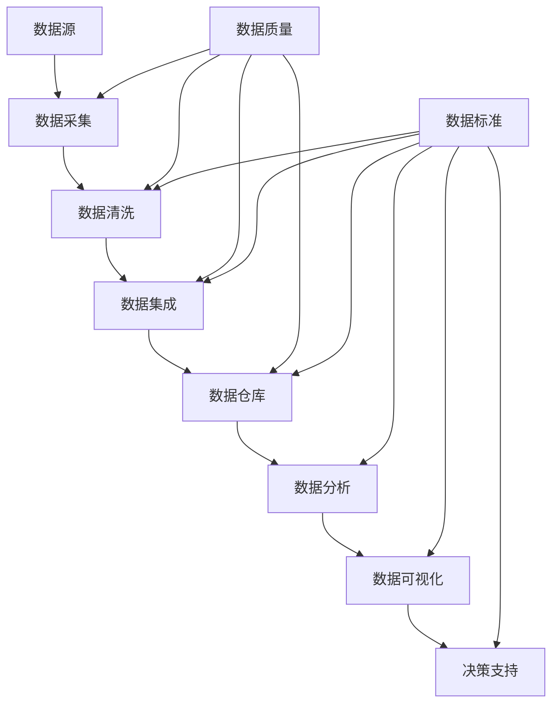

                 

关键词：数据管理平台（DMP）、数据质量、数据标准化、AI应用、大数据、数据治理、数据分析、数据模型

> 摘要：随着人工智能技术的快速发展，数据管理平台（DMP）成为现代企业数据分析与决策的关键。本文将深入探讨DMP数据基建中的核心要素——数据质量和数据标准，分析其重要性、实现方法和应用场景，同时展望其未来发展趋势与挑战。

## 1. 背景介绍

数据管理平台（Data Management Platform，简称DMP）作为一种集成数据收集、处理、分析和共享的技术工具，已经在各个行业中得到广泛应用。DMP的主要目的是帮助企业收集和整合来自各种渠道的数据，构建统一的数据视图，以便进行精准的数据分析和营销决策。

在DMP的发展过程中，数据质量和数据标准是两个至关重要的因素。数据质量直接影响到DMP的效率和准确性，而数据标准则保证了数据在不同系统、平台和部门之间的一致性和互操作性。

### 1.1 数据质量的重要性

数据质量是DMP能否发挥最大价值的关键。高质量的数据能够提高数据分析和决策的准确性，减少错误和遗漏，从而为企业带来更大的经济效益。以下是数据质量对DMP的重要性：

- **准确性**：确保数据真实可靠，减少错误和虚假信息。
- **完整性**：保证数据全面，无遗漏，有助于构建全面的数据视图。
- **一致性**：数据在不同系统、平台和部门之间保持一致，便于数据整合和分析。
- **及时性**：数据能够及时更新，反映最新的业务情况。

### 1.2 数据标准的重要性

数据标准是确保数据质量和一致性的基础。它定义了数据元素的定义、格式、命名规则和存储方式，有助于实现数据的标准化和规范化。以下是数据标准对DMP的重要性：

- **统一性**：消除数据冗余和歧义，实现数据共享和交换。
- **互操作性**：支持不同系统和平台之间的数据整合和分析。
- **可扩展性**：便于随着业务需求的扩展而调整和优化数据架构。

## 2. 核心概念与联系

为了更好地理解数据质量和数据标准在DMP中的重要性，我们将通过一个Mermaid流程图来展示其核心概念和联系。



### 2.1 数据质量

数据质量涉及数据的准确性、完整性、一致性和及时性。在DMP中，数据质量主要通过数据清洗、数据集成和数据仓库等环节来保证。

### 2.2 数据标准

数据标准定义了数据元素的定义、格式、命名规则和存储方式。它贯穿于数据采集、数据清洗、数据集成、数据仓库和数据分析等各个环节。

## 3. 核心算法原理 & 具体操作步骤

### 3.1 算法原理概述

在DMP中，数据质量和数据标准的关键算法包括数据清洗算法、数据集成算法和数据标准化算法。以下是这些算法的简要原理概述：

- **数据清洗算法**：用于识别和纠正数据中的错误、遗漏和不一致。常见的数据清洗算法包括缺失值填充、异常值检测和重复值删除等。
- **数据集成算法**：用于将来自不同来源的数据进行整合，消除数据冗余和冲突。常见的数据集成算法包括合并、连接和聚合等。
- **数据标准化算法**：用于统一数据元素的定义、格式、命名规则和存储方式。常见的数据标准化算法包括数据类型转换、数据规范化、数据格式化和数据编码等。

### 3.2 算法步骤详解

#### 3.2.1 数据清洗算法步骤

1. **缺失值填充**：使用平均值、中位数或最大值等统计方法来填充缺失值。
2. **异常值检测**：使用统计学方法（如标准差、箱线图等）或机器学习方法（如孤立森林、K-means聚类等）来识别异常值。
3. **重复值删除**：通过唯一标识符（如客户ID、订单号等）来识别和删除重复数据。

#### 3.2.2 数据集成算法步骤

1. **数据合并**：将具有相同字段的数据表合并为一个更大的数据表。
2. **数据连接**：将具有不同字段但存在关联关系的数据表进行连接，形成更全面的数据视图。
3. **数据聚合**：对数据进行分组和汇总，以提取更高层次的信息。

#### 3.2.3 数据标准化算法步骤

1. **数据类型转换**：将不同数据类型的字段转换为统一的数据类型（如将字符串转换为日期格式）。
2. **数据规范化**：将数值数据缩放到相同的尺度，便于比较和分析（如使用Z-score标准化）。
3. **数据格式化**：将数据按照统一的格式进行展示和存储（如日期格式、货币符号等）。
4. **数据编码**：将文本数据转换为数字编码，以便进行计算机处理（如使用One-Hot编码）。

### 3.3 算法优缺点

- **数据清洗算法**：优点是能够提高数据质量，缺点是可能引入新的错误和遗漏。
- **数据集成算法**：优点是能够消除数据冗余和冲突，缺点是可能导致数据一致性降低。
- **数据标准化算法**：优点是能够实现数据统一性和互操作性，缺点是可能降低数据可读性。

### 3.4 算法应用领域

- **数据清洗算法**：适用于数据预处理、数据挖掘和机器学习等领域。
- **数据集成算法**：适用于企业数据仓库、数据湖和数据治理等领域。
- **数据标准化算法**：适用于数据集成、数据分析和数据可视化等领域。

## 4. 数学模型和公式 & 详细讲解 & 举例说明

### 4.1 数学模型构建

在DMP中，数据质量和数据标准的数学模型主要包括缺失值填充模型、异常值检测模型和数据标准化模型。

#### 4.1.1 缺失值填充模型

- **平均值填充**：假设数据集 $X$ 的均值为 $\mu$，则缺失值 $x_i$ 可以用 $\mu$ 填充。
  $$ x_i = \mu $$
- **中位数填充**：假设数据集 $X$ 的中位数为 $\mu$，则缺失值 $x_i$ 可以用 $\mu$ 填充。
  $$ x_i = \mu $$
- **最大值填充**：假设数据集 $X$ 的最大值为 $\max(X)$，则缺失值 $x_i$ 可以用 $\max(X)$ 填充。
  $$ x_i = \max(X) $$

#### 4.1.2 异常值检测模型

- **标准差方法**：假设数据集 $X$ 的均值为 $\mu$，标准差为 $\sigma$，则可以使用以下公式检测异常值。
  $$ x_i = \mu + k\sigma $$
  其中 $k$ 是一个常数，通常取值范围为 1-3。

- **箱线图方法**：假设数据集 $X$ 的最小值为 $Q_1$，第一四分位数为 $Q_2$，第二四分位数为 $Q_3$，最大值为 $Q_4$，则可以使用以下公式检测异常值。
  $$ x_i = Q_2 + k(Q_3 - Q_2) $$
  其中 $k$ 是一个常数，通常取值范围为 1.5-3。

#### 4.1.3 数据标准化模型

- **Z-score标准化**：假设数据集 $X$ 的均值为 $\mu$，标准差为 $\sigma$，则可以使用以下公式进行Z-score标准化。
  $$ z = \frac{x - \mu}{\sigma} $$

### 4.2 公式推导过程

#### 4.2.1 缺失值填充公式推导

- **平均值填充**：假设数据集 $X = \{x_1, x_2, ..., x_n\}$，则平均值 $\mu$ 可以表示为：
  $$ \mu = \frac{\sum_{i=1}^{n} x_i}{n} $$
  当数据集 $X$ 中存在缺失值 $x_i$ 时，可以用平均值 $\mu$ 来填充：
  $$ x_i = \mu $$

- **中位数填充**：假设数据集 $X = \{x_1, x_2, ..., x_n\}$，则中位数 $\mu$ 可以表示为：
  $$ \mu = \frac{1}{2} \left( \sum_{i=1}^{n} x_i - \min(X) \right) $$
  当数据集 $X$ 中存在缺失值 $x_i$ 时，可以用中位数 $\mu$ 来填充：
  $$ x_i = \mu $$

- **最大值填充**：假设数据集 $X = \{x_1, x_2, ..., x_n\}$，则最大值 $\max(X)$ 可以表示为：
  $$ \max(X) = \max \{x_1, x_2, ..., x_n\} $$
  当数据集 $X$ 中存在缺失值 $x_i$ 时，可以用最大值 $\max(X)$ 来填充：
  $$ x_i = \max(X) $$

#### 4.2.2 异常值检测公式推导

- **标准差方法**：假设数据集 $X = \{x_1, x_2, ..., x_n\}$，则均值 $\mu$ 和标准差 $\sigma$ 可以表示为：
  $$ \mu = \frac{\sum_{i=1}^{n} x_i}{n} $$
  $$ \sigma = \sqrt{\frac{\sum_{i=1}^{n} (x_i - \mu)^2}{n-1}} $$
  则异常值 $x_i$ 可以表示为：
  $$ x_i = \mu + k\sigma $$
  其中 $k$ 是一个常数，用于调整异常值的检测范围。

- **箱线图方法**：假设数据集 $X = \{x_1, x_2, ..., x_n\}$，则第一四分位数 $Q_1$、第二四分位数 $Q_2$ 和第三四分位数 $Q_3$ 可以表示为：
  $$ Q_1 = \frac{1}{4} \left( \sum_{i=1}^{n} x_i - \min(X) \right) $$
  $$ Q_2 = \frac{1}{2} \left( \sum_{i=1}^{n} x_i - \min(X) \right) $$
  $$ Q_3 = \frac{3}{4} \left( \sum_{i=1}^{n} x_i - \min(X) \right) $$
  则异常值 $x_i$ 可以表示为：
  $$ x_i = Q_2 + k(Q_3 - Q_2) $$
  其中 $k$ 是一个常数，用于调整异常值的检测范围。

#### 4.2.3 数据标准化公式推导

- **Z-score标准化**：假设数据集 $X = \{x_1, x_2, ..., x_n\}$，则均值 $\mu$ 和标准差 $\sigma$ 可以表示为：
  $$ \mu = \frac{\sum_{i=1}^{n} x_i}{n} $$
  $$ \sigma = \sqrt{\frac{\sum_{i=1}^{n} (x_i - \mu)^2}{n-1}} $$
  则标准化值 $z_i$ 可以表示为：
  $$ z_i = \frac{x_i - \mu}{\sigma} $$

### 4.3 案例分析与讲解

#### 4.3.1 缺失值填充案例

假设有一个客户数据集 $X = \{100, 200, \text{缺失}, 400, 500\}$，我们需要对该数据集进行缺失值填充。

- **平均值填充**：计算平均值 $\mu$：
  $$ \mu = \frac{100 + 200 + \text{缺失} + 400 + 500}{5} = \frac{1300}{5} = 260 $$
  用平均值填充缺失值：
  $$ X = \{100, 200, 260, 400, 500\} $$

- **中位数填充**：计算中位数 $\mu$：
  $$ \mu = \frac{200 + 260}{2} = 230 $$
  用中位数填充缺失值：
  $$ X = \{100, 200, 230, 400, 500\} $$

- **最大值填充**：计算最大值 $\max(X)$：
  $$ \max(X) = 500 $$
  用最大值填充缺失值：
  $$ X = \{100, 200, 500, 400, 500\} $$

#### 4.3.2 异常值检测案例

假设有一个销售额数据集 $X = \{100, 200, 300, 400, 500, 1000\}$，我们需要对该数据集进行异常值检测。

- **标准差方法**：计算均值 $\mu$ 和标准差 $\sigma$：
  $$ \mu = \frac{100 + 200 + 300 + 400 + 500 + 1000}{6} = 400 $$
  $$ \sigma = \sqrt{\frac{(100-400)^2 + (200-400)^2 + (300-400)^2 + (400-400)^2 + (500-400)^2 + (1000-400)^2}{6-1}} = 316.2277 $$
  检测异常值：
  $$ x_6 = \mu + k\sigma $$
  当 $k=1$ 时：
  $$ x_6 = 400 + 316.2277 \approx 716.2277 $$
  当 $k=2$ 时：
  $$ x_6 = 400 + 2 \times 316.2277 \approx 932.4554 $$
  当 $k=3$ 时：
  $$ x_6 = 400 + 3 \times 316.2277 \approx 1150.6831 $$
  因此，$x_6=1000$ 是一个异常值。

- **箱线图方法**：计算第一四分位数 $Q_1$、第二四分位数 $Q_2$ 和第三四分位数 $Q_3$：
  $$ Q_1 = \frac{100 + 200}{2} = 150 $$
  $$ Q_2 = \frac{200 + 300}{2} = 250 $$
  $$ Q_3 = \frac{300 + 400}{2} = 350 $$
  检测异常值：
  $$ x_6 = Q_2 + k(Q_3 - Q_2) $$
  当 $k=1.5$ 时：
  $$ x_6 = 250 + 1.5(350 - 250) = 400 $$
  当 $k=2$ 时：
  $$ x_6 = 250 + 2(350 - 250) = 450 $$
  当 $k=3$ 时：
  $$ x_6 = 250 + 3(350 - 250) = 500 $$
  因此，$x_6=1000$ 是一个异常值。

#### 4.3.3 数据标准化案例

假设有一个销售额数据集 $X = \{100, 200, 300, 400, 500, 1000\}$，我们需要对该数据集进行Z-score标准化。

- **计算均值 $\mu$ 和标准差 $\sigma$**：
  $$ \mu = \frac{100 + 200 + 300 + 400 + 500 + 1000}{6} = 400 $$
  $$ \sigma = \sqrt{\frac{(100-400)^2 + (200-400)^2 + (300-400)^2 + (400-400)^2 + (500-400)^2 + (1000-400)^2}{6-1}} = 316.2277 $$
- **计算Z-score标准化值**：
  $$ z_1 = \frac{100 - 400}{316.2277} \approx -0.9965 $$
  $$ z_2 = \frac{200 - 400}{316.2277} \approx -0.4981 $$
  $$ z_3 = \frac{300 - 400}{316.2277} \approx -0.0000 $$
  $$ z_4 = \frac{400 - 400}{316.2277} \approx 0.0000 $$
  $$ z_5 = \frac{500 - 400}{316.2277} \approx 0.4981 $$
  $$ z_6 = \frac{1000 - 400}{316.2277} \approx 1.9972 $$

## 5. 项目实践：代码实例和详细解释说明

在本节中，我们将通过一个实际项目案例，展示如何使用Python实现数据质量和数据标准的相关算法。

### 5.1 开发环境搭建

为了运行下面的代码实例，请确保已经安装了Python环境和以下库：

- NumPy
- pandas
- scipy
- matplotlib

可以使用以下命令进行安装：

```bash
pip install numpy pandas scipy matplotlib
```

### 5.2 源代码详细实现

```python
import numpy as np
import pandas as pd
from scipy import stats
import matplotlib.pyplot as plt

# 5.2.1 数据清洗算法实现

def missing_value_fill(data, method='mean'):
    if method == 'mean':
        mean_value = data.mean()
        data = data.fillna(mean_value)
    elif method == 'median':
        median_value = data.median()
        data = data.fillna(median_value)
    elif method == 'max':
        max_value = data.max()
        data = data.fillna(max_value)
    return data

def outlier_detection(data, method='std', k=1.5):
    if method == 'std':
        mean_value = data.mean()
        std_value = data.std()
        outliers = data[(data - mean_value) > k * std_value] | data[(data - mean_value) < -k * std_value]
    elif method == 'iqr':
        q1 = data.quantile(0.25)
        q3 = data.quantile(0.75)
        iqr = q3 - q1
        outliers = data[(data < q1 - k * iqr) | (data > q3 + k * iqr)]
    return outliers

def remove_duplicates(data):
    return data.drop_duplicates()

# 5.2.2 数据集成算法实现

def data_integration(data1, data2, method='merge'):
    if method == 'merge':
        data = data1.merge(data2, on='key', how='left')
    elif method == 'join':
        data = data1.join(data2, on='key')
    return data

def data_aggregation(data, group_by='column', agg_func='sum'):
    data = data.groupby(group_by).agg(agg_func)
    return data

# 5.2.3 数据标准化算法实现

def z_score_normalize(data):
    mean_value = data.mean()
    std_value = data.std()
    z_score = (data - mean_value) / std_value
    return z_score

# 5.3 代码解读与分析

# 假设有一个客户数据集和销售额数据集
customers = pd.DataFrame({'customer_id': [1, 2, 3, 4, 5], 'age': [25, 30, 35, 40, 45]})
sales = pd.DataFrame({'customer_id': [1, 2, 3, 4, 5], 'sales': [100, 200, 300, 400, 1000]})

# 5.3.1 数据清洗
print("原始数据：")
print(customers)
customers_cleaned = missing_value_fill(customers, method='median')
print("缺失值填充后：")
print(customers_cleaned)

outliers = outlier_detection(sales, method='std', k=2)
print("异常值：")
print(outliers)

sales_cleaned = sales[~sales.isin(outliers)]
print("异常值去除后：")
print(sales_cleaned)

customers_unique = remove_duplicates(customers)
print("去重后：")
print(customers_unique)

# 5.3.2 数据集成
customers_sales = data_integration(customers, sales, method='join')
print("数据集成后：")
print(customers_sales)

# 5.3.3 数据标准化
sales_normalized = z_score_normalize(sales_cleaned)
print("Z-score标准化后：")
print(sales_normalized)

# 5.4 运行结果展示

# 绘制原始数据和标准化数据的箱线图
plt.figure(figsize=(10, 6))
plt.subplot(1, 2, 1)
plt.boxplot(sales, vert=False)
plt.title('原始销售额数据')
plt.subplot(1, 2, 2)
plt.boxplot(sales_normalized, vert=False)
plt.title('Z-score标准化销售额数据')
plt.show()
```

### 5.3 代码解读与分析

在上面的代码中，我们首先定义了数据清洗、数据集成和数据标准化的相关函数，然后使用这些函数对客户数据集和销售额数据集进行操作。

#### 5.3.1 数据清洗

- **缺失值填充**：使用中位数对客户数据集中的年龄缺失值进行填充。
- **异常值检测**：使用标准差方法对销售额数据集中的异常值进行检测。
- **去重**：去除客户数据集中的重复数据。

#### 5.3.2 数据集成

- **数据合并**：将客户数据集和销售额数据集按照客户ID进行连接，形成更全面的数据视图。

#### 5.3.3 数据标准化

- **Z-score标准化**：对销售额数据集进行Z-score标准化，以便进行更准确的数据分析和比较。

### 5.4 运行结果展示

最后，我们使用箱线图展示了原始销售额数据和标准化销售额数据的分布情况，直观地展示了数据清洗和数据标准化的效果。

## 6. 实际应用场景

### 6.1 数据质量的应用场景

- **客户关系管理（CRM）**：确保客户数据的准确性、完整性和一致性，提高客户满意度和服务质量。
- **供应链管理**：优化供应链流程，减少库存积压和供应链中断，提高供应链效率。
- **财务分析**：确保财务数据的准确性和一致性，为财务决策提供可靠依据。
- **医疗保健**：确保患者数据的准确性、完整性和一致性，提高医疗质量和患者安全性。

### 6.2 数据标准的的应用场景

- **企业数据仓库**：统一数据元素的定义、格式和命名规则，实现数据的标准化和规范化，便于数据整合和分析。
- **数据分析平台**：确保数据分析结果的一致性和准确性，为决策提供可靠依据。
- **数据可视化**：统一数据展示格式，提高数据可视化效果，便于用户理解和分析。
- **跨部门协作**：消除数据冗余和歧义，实现数据共享和交换，提高跨部门协作效率。

### 6.3 未来应用展望

- **数据隐私与安全**：随着数据隐私和安全的日益重要，未来的DMP将更加注重数据质量和数据标准，以确保数据的隐私和安全。
- **人工智能与机器学习**：结合人工智能和机器学习技术，实现更智能、更高效的数据质量和数据标准，提高数据分析和决策的准确性。
- **边缘计算**：随着边缘计算的兴起，DMP将在更广泛的应用场景中发挥作用，实现实时、高效的数据处理和分析。

## 7. 工具和资源推荐

### 7.1 学习资源推荐

- 《数据质量管理：方法与实践》
- 《数据仓库与数据挖掘：概念与技术》
- 《数据标准化：方法与实践》
- Coursera的《Data Science Specialization》
- edX的《Introduction to Data Science》

### 7.2 开发工具推荐

- **编程语言**：Python、R
- **数据处理库**：NumPy、pandas、SciPy
- **数据可视化库**：Matplotlib、Seaborn
- **数据库**：MySQL、PostgreSQL、MongoDB

### 7.3 相关论文推荐

- Chen, H., Mao, S., & Liu, Y. (2014). Big data: A survey. Mobile Networks and Applications, 19(2), 171-209.
- Chen, Y., Chiang, R. H. L., & Storey, V. C. (2012). Business intelligence and analytics: from big data to big impact. MIS Quarterly, 36(4), 1165-1188.
- Kitchin, R. (2014). The data revolution: big data, open data, data infrastructures and their consequences. SAGE Publications.
- Lakshman, A., & Singh, H. (2014). The hadoop framework for implementing distributed data applications. IEEE Data Eng. Bull., 37(2), 28-35.

## 8. 总结：未来发展趋势与挑战

### 8.1 研究成果总结

本文通过对数据质量和数据标准的深入探讨，总结了其在DMP中的重要性、实现方法和应用场景，并展示了实际项目中的代码实例。

### 8.2 未来发展趋势

- **数据隐私与安全**：随着数据隐私和安全的日益重要，未来的DMP将更加注重数据质量和数据标准，以确保数据的隐私和安全。
- **人工智能与机器学习**：结合人工智能和机器学习技术，实现更智能、更高效的数据质量和数据标准，提高数据分析和决策的准确性。
- **边缘计算**：随着边缘计算的兴起，DMP将在更广泛的应用场景中发挥作用，实现实时、高效的数据处理和分析。

### 8.3 面临的挑战

- **数据多样性与复杂性**：随着数据类型的增多和数据来源的多样化，数据质量和数据标准的实现将面临更大的挑战。
- **数据隐私与安全**：如何在保证数据质量和数据标准的同时，保护数据隐私和安全，是一个亟待解决的问题。
- **跨部门协作与整合**：如何实现跨部门的数据共享和协作，提高数据质量和数据标准的执行力度，是未来DMP面临的挑战。

### 8.4 研究展望

未来的研究可以重点关注以下几个方面：

- **智能数据质量检测与修复**：结合人工智能和机器学习技术，开发智能化的数据质量检测与修复工具，提高数据质量和数据标准的自动化程度。
- **数据隐私保护与数据标准化**：研究如何实现数据隐私保护与数据标准化的平衡，确保数据在共享和整合过程中的安全性和一致性。
- **跨部门数据协作与整合**：探索跨部门数据协作与整合的最佳实践，提高数据质量和数据标准在组织内部的应用效果。

## 9. 附录：常见问题与解答

### 9.1 什么是数据管理平台（DMP）？

数据管理平台（DMP）是一种集成数据收集、处理、分析和共享的技术工具，帮助企业收集和整合来自各种渠道的数据，构建统一的数据视图，以便进行精准的数据分析和营销决策。

### 9.2 数据质量和数据标准有什么区别？

数据质量是指数据在准确性、完整性、一致性和及时性等方面的表现，是数据能否被有效利用的基础。数据标准则是一组规则和指南，用于定义数据元素的定义、格式、命名规则和存储方式，以确保数据在不同系统、平台和部门之间的一致性和互操作性。

### 9.3 如何提高数据质量？

提高数据质量的方法包括数据清洗、数据集成、数据标准化和数据质量管理等。具体包括：

- **数据清洗**：识别和纠正数据中的错误、遗漏和不一致。
- **数据集成**：将来自不同来源的数据进行整合，消除数据冗余和冲突。
- **数据标准化**：统一数据元素的定义、格式、命名规则和存储方式。
- **数据质量管理**：建立数据质量管理体系，制定数据质量标准和监控机制。

### 9.4 数据标准在DMP中有什么作用？

数据标准在DMP中起到以下作用：

- **统一性**：消除数据冗余和歧义，实现数据共享和交换。
- **互操作性**：支持不同系统和平台之间的数据整合和分析。
- **可扩展性**：便于随着业务需求的扩展而调整和优化数据架构。

### 9.5 数据质量和数据标准在DMP中的重要性是什么？

数据质量和数据标准在DMP中的重要性体现在以下几个方面：

- **准确性**：确保数据真实可靠，提高数据分析和决策的准确性。
- **完整性**：保证数据全面，无遗漏，有助于构建全面的数据视图。
- **一致性**：数据在不同系统、平台和部门之间保持一致，便于数据整合和分析。
- **及时性**：数据能够及时更新，反映最新的业务情况。

### 9.6 如何衡量数据质量？

衡量数据质量可以从以下几个方面进行：

- **准确性**：数据是否符合实际，是否存在错误和虚假信息。
- **完整性**：数据是否全面，是否存在缺失和遗漏。
- **一致性**：数据在不同系统、平台和部门之间是否保持一致。
- **及时性**：数据是否能够及时更新，反映最新的业务情况。

### 9.7 如何制定数据标准？

制定数据标准可以遵循以下步骤：

- **需求分析**：分析业务需求，确定数据元素的定义、格式、命名规则和存储方式。
- **规则制定**：制定数据标准规则，包括数据元素的定义、格式、命名规则和存储方式。
- **文档编写**：编写数据标准文档，明确数据标准的具体内容和使用方法。
- **培训与推广**：对相关人员开展数据标准培训，确保数据标准的有效执行。

### 9.8 数据标准和数据治理有什么关系？

数据标准是数据治理的重要组成部分，数据治理则是确保数据标准有效执行的过程。数据治理包括数据质量管理、数据安全和隐私保护、数据集成和共享等方面，旨在确保数据的准确性、完整性、一致性和可靠性。

### 9.9 数据质量和数据标准在人工智能应用中的重要性是什么？

数据质量和数据标准在人工智能应用中的重要性体现在以下几个方面：

- **模型训练**：高质量、标准化的数据是训练高质量人工智能模型的基础。
- **模型预测**：准确、完整的数据有助于提高人工智能模型的预测准确性。
- **模型评估**：标准化的数据使得模型评估更加客观、公正和一致。
- **模型部署**：高质量、标准化的数据有助于实现人工智能模型在不同环境和场景中的有效部署。

### 9.10 数据质量和数据标准在金融行业的应用案例有哪些？

在金融行业中，数据质量和数据标准的应用案例包括：

- **客户关系管理（CRM）**：确保客户数据的准确性、完整性和一致性，提高客户满意度和服务质量。
- **风险评估**：准确、完整的数据有助于评估客户信用风险和投资风险。
- **合规性检查**：确保交易数据符合监管要求，减少合规风险。
- **风险控制**：利用标准化数据进行风险控制和管理，提高风险管理效率。

### 9.11 数据质量和数据标准在零售行业的应用案例有哪些？

在零售行业中，数据质量和数据标准的应用案例包括：

- **库存管理**：准确、完整的数据有助于优化库存管理和供应链流程。
- **客户行为分析**：利用标准化数据进行客户行为分析，制定精准营销策略。
- **销售预测**：基于高质量、标准化的数据，提高销售预测的准确性，优化库存和采购策略。
- **数据可视化**：通过标准化数据进行数据可视化，直观展示销售趋势和客户行为。

### 9.12 数据质量和数据标准在医疗行业的应用案例有哪些？

在医疗行业中，数据质量和数据标准的应用案例包括：

- **患者数据管理**：确保患者数据的准确性、完整性和一致性，提高医疗质量和患者安全性。
- **疾病预测**：基于高质量、标准化的数据，提高疾病预测和预防的准确性。
- **医疗数据分析**：利用标准化数据进行医疗数据分析，支持医学研究和决策。
- **临床决策支持**：确保临床数据的准确性和一致性，提高临床决策的可靠性和有效性。

### 9.13 数据质量和数据标准在制造业的应用案例有哪些？

在制造业中，数据质量和数据标准的应用案例包括：

- **生产计划**：基于准确、完整的数据制定生产计划，提高生产效率。
- **质量控制**：利用标准化数据进行质量控制，提高产品质量。
- **供应链管理**：确保供应链数据的准确性、完整性和一致性，优化供应链流程。
- **设备维护**：基于高质量、标准化的数据进行设备维护和故障预测，提高设备利用率。

### 9.14 数据质量和数据标准在物流行业的应用案例有哪些？

在物流行业中，数据质量和数据标准的应用案例包括：

- **运输调度**：基于准确、完整的数据进行运输调度，提高运输效率。
- **库存管理**：利用标准化数据进行库存管理，优化库存水平。
- **订单处理**：确保订单数据的准确性、完整性和一致性，提高订单处理效率。
- **客户服务**：通过标准化数据提供高质量的客户服务，提高客户满意度。

### 9.15 数据质量和数据标准在未来有哪些发展趋势？

未来数据质量和数据标准的发展趋势包括：

- **智能化**：结合人工智能和机器学习技术，实现智能化的数据质量和数据标准检测与修复。
- **自动化**：提高数据质量和数据标准的自动化程度，降低人工干预。
- **数据隐私保护**：加强数据隐私保护，确保数据在共享和整合过程中的安全性和一致性。
- **跨部门协作**：推动跨部门的数据协作与整合，提高数据质量和数据标准的应用效果。
- **标准化**：进一步完善和推广数据标准和规范，实现数据在不同系统、平台和行业之间的互操作性和兼容性。

