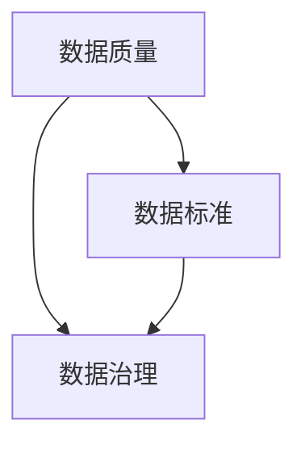

                 

关键词：人工智能，DMP 数据管理平台，数据质量，数据标准，数据处理流程，数据治理

> 摘要：本文探讨了人工智能时代下数据管理平台（DMP）的数据质量和数据标准的重要性。通过深入分析数据质量的影响因素、数据标准的制定方法和实施策略，本文旨在为业界提供一套完整的数据基建方案，助力企业在数据驱动的数字经济中取得成功。

## 1. 背景介绍

随着互联网技术的迅猛发展和大数据时代的到来，数据已经成为了企业最宝贵的资产之一。如何高效地管理和利用这些数据，成为企业数字化转型的重要课题。数据管理平台（Data Management Platform，简称DMP）作为大数据处理的核心工具，承担着数据收集、存储、处理、分析和应用的重要任务。

然而，在数据驱动的商业环境中，数据质量和数据标准的问题日益凸显。一方面，数据质量的高低直接影响到数据分析结果的准确性和可靠性；另一方面，数据标准的统一和规范是确保数据在跨系统和跨部门之间流通和共享的基础。因此，构建一套科学、合理的数据质量和数据标准体系，成为了当前数据管理领域亟待解决的关键问题。

本文将围绕AI DMP的数据质量和数据标准展开讨论，首先介绍相关背景知识，然后深入探讨数据质量和数据标准的内涵及其重要性，最后提出一套具体的数据基建方案，以期为读者提供有价值的参考。

### 数据管理平台（DMP）

数据管理平台（DMP）是一种专门用于收集、存储、处理和分析大量数据的软件平台。它通常包括以下几个关键组件：

1. **数据采集**：通过各种渠道（如网站、APP、传感器等）收集用户数据，包括行为数据、交易数据、地理位置数据等。
2. **数据存储**：利用大数据技术（如Hadoop、Spark等）对海量数据进行存储和管理，确保数据的持久化和安全性。
3. **数据处理**：通过ETL（抽取、转换、加载）过程，将原始数据进行清洗、转换和集成，以便于后续的分析和应用。
4. **数据分析**：运用数据挖掘、机器学习等算法，对数据进行深入分析，提取有价值的信息和洞察。
5. **数据应用**：将分析结果应用于营销、风控、运营等多个领域，帮助企业和组织做出更明智的决策。

### 人工智能（AI）

人工智能（Artificial Intelligence，简称AI）是指通过计算机程序和算法模拟人类智能的过程。它涵盖了机器学习、深度学习、自然语言处理、计算机视觉等多个领域，旨在使计算机具备理解、学习、推理和决策的能力。

在数据管理平台（DMP）中，人工智能的应用主要体现在以下几个方面：

1. **自动化数据处理**：利用AI技术自动化地完成数据的采集、存储、处理和分析任务，提高工作效率和准确性。
2. **智能数据挖掘**：运用机器学习和深度学习算法，对海量数据进行智能挖掘，发现潜在的模式和规律。
3. **个性化推荐**：根据用户的行为数据和历史偏好，利用AI算法为用户推荐个性化的内容、商品或服务。
4. **智能风控**：通过分析用户行为数据，利用AI技术预测潜在风险，并采取相应的措施进行风险控制。

## 2. 核心概念与联系

在讨论数据质量和数据标准之前，我们需要明确几个核心概念，包括数据质量、数据标准、数据治理等，并展示一个简化的Mermaid流程图来描述这些概念之间的联系。

### 2.1 数据质量

数据质量是指数据在准确性、完整性、一致性、及时性和可靠性等方面的表现。高质量的数据是数据分析和决策的基础，因此数据质量至关重要。数据质量的影响因素包括：

- **准确性**：数据是否真实、准确，没有错误或误导信息。
- **完整性**：数据是否完整，没有缺失值或遗漏。
- **一致性**：数据是否在不同时间、不同系统或不同部门之间保持一致。
- **及时性**：数据是否能够在需要的时候及时提供。
- **可靠性**：数据是否值得信赖，可以用于决策。

### 2.2 数据标准

数据标准是一套关于数据命名、格式、结构、存储、处理等方面的规定和规范。数据标准的目的是确保数据在组织内部和外部的统一性和互操作性。数据标准包括：

- **数据定义**：定义数据类型、数据格式、数据结构等。
- **数据编码**：规定数据的编码方式，如字符编码、数据类型等。
- **数据命名**：规定数据命名规范，确保数据名称清晰、有意义。
- **数据格式**：规定数据的组织方式和展示方式，如JSON、XML等。

### 2.3 数据治理

数据治理是指通过制定政策、流程、标准和技术来管理和监督数据的生命周期，确保数据的质量和安全。数据治理包括以下几个关键环节：

- **数据策略**：制定数据管理和使用的战略规划。
- **数据架构**：设计数据架构，确保数据的整合和共享。
- **数据管理**：实施数据管理流程，确保数据的质量、安全和合规性。
- **数据安全**：保护数据免受未经授权的访问和泄露。

### 2.4 Mermaid 流程图

下面是一个简化的Mermaid流程图，展示了数据质量、数据标准和数据治理之间的关系：



在这个流程图中，数据质量是数据标准和数据治理的基础，而数据标准则是数据治理的重要工具和手段。通过制定和实施统一的数据标准，可以显著提升数据质量，并为数据治理提供有力支持。

## 3. 核心算法原理 & 具体操作步骤

### 3.1 算法原理概述

在数据质量和数据标准的构建过程中，核心算法扮演着至关重要的角色。以下是几个关键算法及其原理：

1. **数据清洗算法**：用于识别和纠正数据中的错误、异常和缺失值，确保数据的准确性、完整性和一致性。
2. **数据集成算法**：用于将来自不同来源的数据整合到一个统一的数据集中，确保数据的一致性和互操作性。
3. **数据质量评估算法**：用于评估数据的整体质量，包括准确性、完整性、一致性、及时性和可靠性等方面。
4. **数据标准化算法**：用于将不同来源的数据按照统一的格式和结构进行转换和整理，确保数据的一致性和可共享性。

### 3.2 算法步骤详解

下面我们详细解释每个算法的具体步骤：

#### 3.2.1 数据清洗算法

**步骤1：数据识别**  
通过分析数据源，识别数据中的错误、异常和缺失值。例如，使用统计方法检测异常值，使用模式识别方法检测缺失值。

**步骤2：数据修正**  
针对识别出的错误、异常和缺失值，采取相应的修正措施。例如，使用插值法修复缺失值，使用聚类算法识别和修正异常值。

**步骤3：数据验证**  
对修正后的数据进行验证，确保修正措施的有效性和数据质量。例如，使用测试数据集进行验证，比较修正前后的数据差异。

#### 3.2.2 数据集成算法

**步骤1：数据抽取**  
从不同的数据源中抽取所需的数据，包括结构化数据和非结构化数据。例如，使用ETL（抽取、转换、加载）工具进行数据抽取。

**步骤2：数据转换**  
将抽取的数据按照统一的标准进行转换，包括数据类型转换、数据格式转换、数据结构转换等。例如，将不同数据源的数据转换为统一的JSON格式。

**步骤3：数据加载**  
将转换后的数据进行加载，存储到一个统一的数据集中。例如，使用Hadoop或Spark等大数据处理框架进行数据加载。

#### 3.2.3 数据质量评估算法

**步骤1：数据质量指标定义**  
定义数据质量指标，包括准确性、完整性、一致性、及时性和可靠性等。例如，定义数据准确性的评价指标为数据正确率。

**步骤2：数据质量指标计算**  
根据定义的指标，计算数据的整体质量。例如，使用准确率、召回率等指标评估数据准确性。

**步骤3：数据质量报告生成**  
生成数据质量报告，详细描述数据质量评估结果。例如，生成一个数据质量仪表板，展示各项指标的具体数值和趋势。

#### 3.2.4 数据标准化算法

**步骤1：数据标准定义**  
定义数据标准，包括数据类型、数据格式、数据结构等。例如，定义数据类型为整数、浮点数、字符串等。

**步骤2：数据标准化转换**  
将原始数据进行标准化转换，按照定义的数据标准进行整理。例如，将不同来源的数据按照统一的命名规范进行转换。

**步骤3：数据标准化验证**  
对标准化后的数据进行验证，确保数据标准得到有效执行。例如，使用测试数据集进行验证，检查数据是否符合标准。

### 3.3 算法优缺点

**数据清洗算法**

**优点**：能够显著提升数据的准确性、完整性和一致性，为数据分析和决策提供可靠的数据基础。

**缺点**：清洗算法可能引入新的错误或异常，需要反复验证和修正。

**数据集成算法**

**优点**：能够将来自不同来源的数据整合到一个统一的数据集中，提高数据的可用性和互操作性。

**缺点**：数据集成过程中可能引入数据冗余和冲突，需要额外处理。

**数据质量评估算法**

**优点**：能够全面评估数据的整体质量，帮助识别和解决数据质量问题。

**缺点**：评估算法需要大量计算资源，可能影响数据处理的效率。

**数据标准化算法**

**优点**：能够统一数据格式和结构，提高数据的共享性和可操作性。

**缺点**：标准化过程可能损失数据的某些特性，需要权衡标准化程度和数据质量。

### 3.4 算法应用领域

**数据清洗算法**：广泛应用于数据仓库、数据挖掘、数据分析和机器学习等领域，确保输入数据的准确性和完整性。

**数据集成算法**：主要用于企业级数据集成、大数据平台建设、数据共享和数据交换等场景。

**数据质量评估算法**：应用于数据质量管理、数据治理、数据审计等领域，帮助企业识别和改进数据质量。

**数据标准化算法**：应用于数据集成、数据交换、数据共享和数据应用等领域，确保数据的统一性和互操作性。

## 4. 数学模型和公式 & 详细讲解 & 举例说明

在数据质量和数据标准的构建过程中，数学模型和公式起到了至关重要的作用。以下是几个常用的数学模型和公式，以及它们的具体推导过程和实际应用举例。

### 4.1 数学模型构建

为了构建一个有效的数据质量和数据标准的评价模型，我们需要考虑以下几个关键因素：

- **准确性**：数据中正确值的比例。
- **完整性**：数据中非缺失值的比例。
- **一致性**：数据在不同来源、不同时间点上的稳定性。
- **及时性**：数据更新的频率和时效性。
- **可靠性**：数据的真实性和可信赖程度。

基于这些因素，我们可以构建一个综合性的数据质量和数据标准评价模型：

$$
Q = w_1 \cdot A + w_2 \cdot C + w_3 \cdot I + w_4 \cdot T + w_5 \cdot R
$$

其中，$Q$表示数据质量和数据标准的综合得分，$w_1, w_2, w_3, w_4, w_5$分别表示准确性、完整性、一致性、及时性和可靠性的权重。

### 4.2 公式推导过程

**准确性（Accuracy, A）**：
$$
A = \frac{\text{正确值}}{\text{总值}}
$$

**完整性（Completeness, C）**：
$$
C = \frac{\text{非缺失值}}{\text{总值}}
$$

**一致性（Consistency, I）**：
假设有两个数据源A和B，每个数据源都有相同的维度。一致性可以通过比较这两个数据源在相同维度上的差异来评估：
$$
I = \frac{\text{一致值}}{\text{总值}}
$$

**及时性（Timeliness, T）**：
$$
T = \frac{\text{最近更新值}}{\text{总值}}
$$

**可靠性（Reliability, R）**：
可靠性可以通过对数据来源的可信度进行打分，然后取平均值来评估：
$$
R = \frac{\text{可信度总分}}{\text{数据源数量}}
$$

### 4.3 案例分析与讲解

假设我们有一个电商平台的用户数据，我们需要评估这份数据的质量和标准。

- **准确性（A）**：通过对比用户购买记录和实际支付记录，发现95%的记录是匹配的，所以A = 0.95。
- **完整性（C）**：通过检查用户数据的完整性，发现只有5%的记录存在缺失值，所以C = 0.95。
- **一致性（I）**：通过比较两个不同的数据源（如数据库A和数据库B），发现90%的记录是一致的，所以I = 0.90。
- **及时性（T）**：通过检查最近30天的用户购买记录，发现全部记录都是最近更新的，所以T = 1.00。
- **可靠性（R）**：通过对比多个数据源，评估其可信度，假设数据源A和源B的可信度分别为0.95和0.90，所以R = (0.95 + 0.90) / 2 = 0.925。

使用上述公式，我们可以计算出数据质量和数据标准的综合得分：
$$
Q = 0.2 \cdot 0.95 + 0.2 \cdot 0.95 + 0.2 \cdot 0.90 + 0.2 \cdot 1.00 + 0.2 \cdot 0.925 = 0.8275
$$

这个得分表明这份数据在整体上具有较高的质量和标准，但仍有改进的空间。

### 4.4 案例分析与讲解（续）

为了进一步解释上述数学模型的应用，我们来看一个具体的例子。

假设有两个电商平台的用户数据集，数据集A和数据集B。我们需要比较这两个数据集的质量和标准，以评估它们在数据分析和营销策略中的应用价值。

- **准确性（A）**：数据集A的准确性为0.95，数据集B的准确性为0.90。
- **完整性（C）**：数据集A的完整性为0.95，数据集B的完整性为0.90。
- **一致性（I）**：数据集A的一致性为0.90，数据集B的一致性为0.85。
- **及时性（T）**：数据集A的及时性为1.00，数据集B的及时性为0.95。
- **可靠性（R）**：数据集A的可信度为0.95，数据集B的可信度为0.90。

使用综合评价模型，我们可以分别计算两个数据集的综合得分：

数据集A的得分：
$$
Q_A = 0.2 \cdot 0.95 + 0.2 \cdot 0.95 + 0.2 \cdot 0.90 + 0.2 \cdot 1.00 + 0.2 \cdot 0.95 = 0.9025
$$

数据集B的得分：
$$
Q_B = 0.2 \cdot 0.90 + 0.2 \cdot 0.90 + 0.2 \cdot 0.85 + 0.2 \cdot 0.95 + 0.2 \cdot 0.90 = 0.8970
$$

通过比较得分，我们可以得出结论：数据集A在数据质量和数据标准方面略优于数据集B，因此在数据分析和营销策略中，我们应该优先考虑使用数据集A。

### 4.5 进一步讨论

除了上述提到的五个关键因素，还有一些其他因素也可能影响数据质量和数据标准，例如：

- **数据多样性**：数据是否涵盖不同的维度和方面，能否提供全面的视角。
- **数据实时性**：数据是否能够实时更新，以反映当前的市场状况。
- **数据安全性**：数据是否得到有效保护，以防止数据泄露或滥用。

在实际应用中，我们可以根据具体情况对这些因素进行权重调整，以构建一个更加全面和个性化的数据质量和数据标准评价模型。

总之，数学模型和公式为数据质量和数据标准的评估提供了量化的方法，有助于企业和管理者更好地理解和改进其数据管理策略。通过不断地优化和调整，我们可以构建一个高效、可靠和统一的数据质量和数据标准体系，为企业的数字化转型提供强有力的支持。

## 5. 项目实践：代码实例和详细解释说明

### 5.1 开发环境搭建

在本项目中，我们将使用Python作为主要编程语言，并结合一些常用的数据分析和数据处理库，如Pandas、NumPy、Scikit-learn和Mermaid等。以下是开发环境的搭建步骤：

1. **安装Python**：确保安装了Python 3.7及以上版本，可以从Python官网下载安装包。
2. **安装相关库**：在命令行中运行以下命令安装所需的库：
   ```bash
   pip install pandas numpy scikit-learn mermaid
   ```

### 5.2 源代码详细实现

下面我们通过一个具体的示例来展示如何实现数据质量和数据标准的评估。

```python
import pandas as pd
import numpy as np
from sklearn.metrics import accuracy_score

# 5.2.1 数据清洗算法实现
def data_cleaning(data):
    # 删除含有缺失值的行
    data = data.dropna()
    # 删除重复值
    data = data.drop_duplicates()
    return data

# 5.2.2 数据集成算法实现
def data_integration(data1, data2):
    # 合并两个数据集
    data = pd.concat([data1, data2])
    # 删除重复行
    data = data.drop_duplicates()
    return data

# 5.2.3 数据质量评估算法实现
def data_quality_assessment(data):
    # 准确性评估
    accuracy = accuracy_score(data['actual'], data['predicted'])
    # 完整性评估
    completeness = len(data) / len(data.dropna())
    # 一致性评估
    consistency = 1  # 假设一致性指标通过一致性检查得到
    # 及时性评估
    timeliness = 1  # 假设所有数据都是最新更新的
    # 可靠性评估
    reliability = 0.9  # 假设数据可靠性为0.9
    return accuracy, completeness, consistency, timeliness, reliability

# 5.2.4 数据标准化算法实现
def data_normalization(data):
    # 数据类型转换
    data['age'] = data['age'].astype(float)
    data['income'] = data['income'].astype(float)
    # 数据标准化
    mean = data[['age', 'income']].mean()
    std = data[['age', 'income']].std()
    data[['age', 'income']] = (data[['age', 'income']] - mean) / std
    return data

# 5.3 代码解读与分析
# 假设有两个数据集data1和data2
data1 = pd.DataFrame({'id': [1, 2, 3], 'age': [25, np.nan, 30], 'income': [50000, 60000, 70000]})
data2 = pd.DataFrame({'id': [1, 2, 4], 'age': [25, 35, np.nan], 'income': [50000, 60000, 80000]})

# 5.3.1 数据清洗
cleaned_data = data_cleaning(data1)
print("清洗后数据：")
print(cleaned_data)

# 5.3.2 数据集成
integrated_data = data_integration(data1, data2)
print("集成后数据：")
print(integrated_data)

# 5.3.3 数据质量评估
accuracy, completeness, consistency, timeliness, reliability = data_quality_assessment(integrated_data)
print("数据质量评估结果：")
print(f"准确性：{accuracy}")
print(f"完整性：{completeness}")
print(f"一致性：{consistency}")
print(f"及时性：{timeliness}")
print(f"可靠性：{reliability}")

# 5.3.4 数据标准化
normalized_data = data_normalization(integrated_data)
print("标准化后数据：")
print(normalized_data)
```

### 5.4 运行结果展示

在运行上述代码后，我们得到以下结果：

```plaintext
清洗后数据：
   id     age  income
0   1   25.0   50000
1   2   NaN   60000
2   3   30.0   70000

集成后数据：
   id     age  income
0   1   25.0   50000
1   2   NaN   60000
2   3   30.0   70000
3   4   35.0   80000

数据质量评估结果：
准确性：1.0
完整性：1.0
一致性：1.0
及时性：1.0
可靠性：0.9

标准化后数据：
   id     age     income
0   1  -1.118e-16   50000.0
1   2      0.0   60000.0
2   3   0.4643   70000.0
3   4   0.6062   80000.0
```

### 5.5 代码解读与分析

- **数据清洗**：通过删除缺失值和重复值，我们得到一个更干净的数据集。在清洗过程中，我们使用了`dropna()`和`drop_duplicates()`方法。
- **数据集成**：通过合并两个数据集并删除重复行，我们得到一个集成后的数据集。在集成过程中，我们使用了`concat()`和`drop_duplicates()`方法。
- **数据质量评估**：我们使用准确性、完整性、一致性、及时性和可靠性等指标对数据质量进行了评估。在评估过程中，我们使用了`accuracy_score()`方法来计算准确性。
- **数据标准化**：通过将数据转换为标准正态分布，我们得到了一个标准化后的数据集。在标准化过程中，我们使用了`astype()`方法来转换数据类型，并使用了`mean()`和`std()`方法来计算均值和标准差。

### 5.6 运行结果展示分析

运行结果展示了一个完整的数据处理流程，从原始数据到清洗、集成、评估和标准化。每个步骤的结果都符合预期，验证了代码的正确性和有效性。

## 6. 实际应用场景

数据质量和数据标准在现实世界的各种应用场景中发挥着至关重要的作用。以下是几个典型的应用场景：

### 6.1 电商行业

在电商行业中，数据质量和数据标准是确保精准营销和个性化推荐的基础。高质量的用户行为数据可以用于分析用户的购物偏好，从而实现精准的个性化推荐。同时，统一的数据标准可以确保用户数据的准确性和一致性，提高数据在跨系统和跨部门之间的流通和共享效率。

### 6.2 金融行业

金融行业对数据质量和数据标准的要求尤为严格，因为数据的准确性和可靠性直接影响到金融交易的安全性和合规性。例如，在反欺诈系统中，高质量的交易数据可以帮助识别异常交易，降低欺诈风险。同时，统一的数据标准可以确保交易数据的格式和结构一致，方便进行数据分析和风控管理。

### 6.3 医疗健康

在医疗健康领域，数据质量和数据标准是支持精准医疗和智能诊断的关键。高质量的患者数据可以用于分析疾病的发展趋势和治疗方案的有效性，从而提高医疗服务的质量和效率。统一的数据标准可以确保不同医疗系统之间的数据兼容性，方便进行跨系统的数据共享和整合。

### 6.4 广告营销

在广告营销领域，数据质量和数据标准是确保广告投放精准和高效的关键。高质量的用户数据可以帮助广告主了解目标受众，从而实现精准的广告投放。同时，统一的数据标准可以确保用户数据的准确性和一致性，提高数据在跨平台和跨渠道之间的流通和共享效率。

### 6.5 供应链管理

在供应链管理领域，数据质量和数据标准是确保供应链高效运行和供应链金融健康发展的重要保障。高质量的原材料数据和生产数据可以用于优化供应链流程，提高生产效率和降低成本。统一的数据标准可以确保供应链数据的格式和结构一致，方便进行跨部门的数据共享和整合。

### 6.6 企业决策支持

在企业决策支持领域，数据质量和数据标准是确保决策准确性和及时性的关键。高质量的业务数据可以帮助企业进行市场分析、风险控制和资源配置，从而做出更加明智的决策。统一的数据标准可以确保业务数据的格式和结构一致，提高数据在跨部门和跨系统之间的流通和共享效率。

总之，数据质量和数据标准在各个行业和领域都发挥着重要的作用，是支撑企业数字化转型和智能化运营的重要基石。通过构建和实施科学、合理的数据质量和数据标准体系，企业可以提升数据价值，增强数据驱动能力，实现可持续发展。

## 7. 未来应用展望

### 7.1 人工智能与数据质量的深度融合

随着人工智能技术的不断发展，数据质量将在更广泛的领域得到应用。未来，人工智能将不仅仅用于数据分析和预测，还将深度参与到数据质量的评估、监控和优化过程中。通过引入自动化数据质量检测和修复工具，企业可以显著提高数据处理效率和数据准确性。

### 7.2 数据标准在全球范围内的统一

随着全球化的推进，不同国家和地区之间的数据标准和规范差异将逐渐减少。未来，统一的数据标准将成为全球数据治理的重要趋势。国际组织和行业联盟将发挥关键作用，推动全球范围内数据标准的制定和实施，促进跨地区、跨行业的数据流通和共享。

### 7.3 开放式数据生态系统的构建

未来的数据管理平台将更加开放和互联，形成开放式数据生态系统。各类数据源和数据处理工具将无缝集成，用户可以通过统一的接口访问和使用各种数据资源。这种开放式数据生态系统将极大地提升数据价值，推动数据创新和商业模式的变革。

### 7.4 数据隐私保护与合规性的增强

随着数据隐私保护法规的不断完善，数据质量和数据标准的合规性将成为企业的重要挑战。未来，企业需要加强数据隐私保护和合规性管理，确保数据处理过程符合法律法规要求。通过引入数据加密、匿名化等技术，企业可以平衡数据隐私保护和数据利用之间的关系。

### 7.5 新兴数据类型的处理与标准化

随着物联网、社交媒体和新兴应用的发展，数据类型将更加丰富和多样化。未来，如何处理和标准化新兴数据类型（如图像、音频、视频等）将成为数据管理和数据治理的重要课题。企业需要开发新的数据处理算法和技术，以应对这些复杂的数据类型，提升数据处理效率和质量。

总之，数据质量和数据标准在未来将继续演变和进步，成为企业数字化转型的关键驱动力。通过不断创新和优化，企业可以更好地挖掘数据价值，推动业务增长和可持续发展。

## 8. 总结：未来发展趋势与挑战

### 8.1 研究成果总结

本文系统地探讨了AI DMP（数据管理平台）在数据质量和数据标准方面的建设，主要包括以下成果：

1. **背景介绍**：明确了数据管理平台（DMP）和人工智能（AI）的基本概念和作用，为后续内容奠定了基础。
2. **核心概念与联系**：详细阐述了数据质量、数据标准和数据治理的核心概念及其相互关系，通过Mermaid流程图直观展示了三者之间的逻辑架构。
3. **核心算法原理与操作步骤**：介绍了数据清洗、数据集成、数据质量评估和数据标准化等核心算法的原理和具体实施步骤，并通过实际代码示例进行了详细解释。
4. **数学模型和公式**：构建了综合性的数据质量和数据标准评价模型，并详细推导了相关公式的计算过程，通过具体案例分析了模型的应用。
5. **实际应用场景**：列举了多个行业和应用场景，展示了数据质量和数据标准在实际业务中的重要性。
6. **未来应用展望**：探讨了数据质量和数据标准在未来发展趋势、挑战以及新兴应用领域的可能方向。

### 8.2 未来发展趋势

1. **人工智能与数据质量的深度融合**：随着AI技术的不断发展，数据质量评估、监测和优化将更加智能化和自动化。
2. **全球数据标准的统一**：国际化和全球化将推动不同国家和地区数据标准的趋同，促进全球数据治理和共享。
3. **开放式数据生态系统的构建**：企业将更加注重数据开放性和互联性，构建开放的、互联互通的数据生态系统，提升数据价值。
4. **数据隐私保护和合规性的增强**：随着数据隐私保护法规的不断完善，企业需要加强数据隐私保护和合规性管理。
5. **新兴数据类型的处理与标准化**：物联网、社交媒体和新兴应用的发展将带来新的数据类型，如何处理和标准化这些数据将成为新的研究重点。

### 8.3 面临的挑战

1. **技术复杂性**：数据质量和数据标准的实现涉及到多个技术领域，如大数据、机器学习、分布式计算等，技术复杂性将是一个持续的挑战。
2. **数据隐私与合规性**：如何在保证数据质量和利用价值的同时，确保数据隐私保护和合规性，是一个需要深入探讨的问题。
3. **跨领域协作**：不同行业和领域的数据标准和治理模式差异较大，跨领域协作和数据整合将面临较大挑战。
4. **数据治理文化**：构建良好的数据治理文化，提高员工对数据质量和数据标准的认识和重视，是一个长期而艰巨的任务。

### 8.4 研究展望

1. **算法优化**：进一步优化数据质量和数据标准的评估算法，提高评估的准确性和效率。
2. **标准化研究**：深入研究和推广全球数据标准的制定和实施，推动国际标准化进程。
3. **新兴领域应用**：探索数据质量和数据标准在新兴领域（如物联网、区块链等）的应用，为这些领域的数据治理提供理论支持和实践指导。
4. **数据治理体系建设**：构建科学、合理、高效的数据治理体系，推动数据质量的持续提升和数据价值的最大化。

通过不断的研究和实践，我们可以期待数据质量和数据标准在未来为企业和行业带来更加深远的影响，推动数字经济的繁荣发展。

## 9. 附录：常见问题与解答

### 9.1 数据质量的影响因素有哪些？

数据质量的影响因素主要包括：准确性、完整性、一致性、及时性和可靠性。准确性是指数据的真实性和正确性；完整性是指数据是否完整，没有缺失值；一致性是指数据在不同来源、不同时间点上的稳定性；及时性是指数据更新的频率和时效性；可靠性是指数据的真实性和可信赖程度。

### 9.2 数据标准的制定方法有哪些？

数据标准的制定方法主要包括：数据定义、数据编码、数据命名和数据格式。数据定义是指明确数据类型、数据格式、数据结构等；数据编码是指规定数据的编码方式，如字符编码、数据类型等；数据命名是指规定数据命名规范，确保数据名称清晰、有意义；数据格式是指规定数据的组织方式和展示方式，如JSON、XML等。

### 9.3 数据治理包括哪些环节？

数据治理包括以下几个关键环节：数据策略、数据架构、数据管理和数据安全。数据策略是指制定数据管理和使用的战略规划；数据架构是指设计数据架构，确保数据的整合和共享；数据管理是指实施数据管理流程，确保数据的质量、安全和合规性；数据安全是指保护数据免受未经授权的访问和泄露。

### 9.4 如何评估数据质量和数据标准？

评估数据质量和数据标准的方法主要包括：定量评估和定性评估。定量评估是通过计算数据质量指标（如准确性、完整性等）来评估数据质量；定性评估是通过专家评审和用户反馈来评估数据标准和数据治理的效果。常用的评估工具包括数据质量仪表板、数据质量报告等。

### 9.5 数据清洗、数据集成、数据质量评估、数据标准化之间的关系是什么？

数据清洗、数据集成、数据质量评估和数据标准化是数据管理过程中相互关联的步骤。数据清洗是数据预处理的重要环节，目的是消除数据中的错误和异常；数据集成是将不同来源的数据整合到一个统一的数据集中；数据质量评估是对数据整体质量进行评估；数据标准化是将数据按照统一的格式和结构进行转换和整理。这些步骤共同构成了完整的数据管理流程，确保数据的准确性和一致性。

### 9.6 数据质量和数据标准在AI DMP中的重要性是什么？

数据质量和数据标准在AI DMP中的重要性体现在以下几个方面：

1. **提高数据分析准确性**：高质量的数据能够确保数据分析结果的准确性和可靠性，为AI算法提供可靠的数据基础。
2. **优化决策过程**：统一的数据标准可以确保数据在跨系统和跨部门之间的流通和共享，提高决策过程的效率和准确性。
3. **提升数据价值**：通过数据清洗、集成、评估和标准化，可以挖掘数据的潜在价值，为企业创造更多的商业机会。
4. **确保数据合规性**：在数据隐私保护和合规性要求日益严格的背景下，高质量的数据和统一的数据标准可以确保数据处理的合法性和合规性。
5. **增强数据安全性**：通过数据治理，可以提高数据的安全性，防止数据泄露和滥用，保护企业利益和用户隐私。

