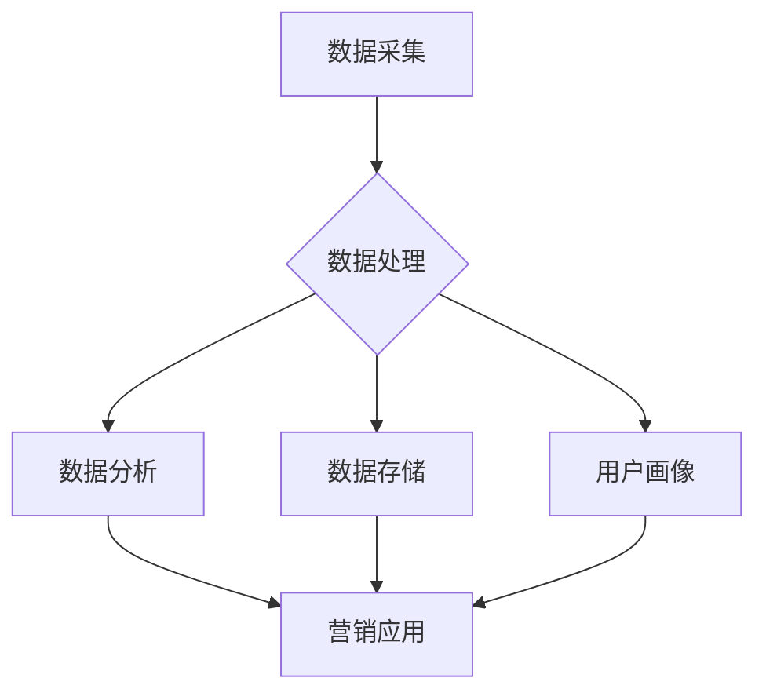

                 

关键词：数据管理平台（DMP）、人工智能、数据驱动营销、个性化推荐、营销自动化

> 摘要：本文深入探讨了人工智能在数据管理平台（DMP）中的应用，以及如何通过数据驱动营销实现精准营销。文章首先介绍了DMP的基本概念和架构，然后详细阐述了AI在DMP中的核心作用，包括数据采集、处理、分析和应用。随后，文章通过具体案例和项目实践，展示了DMP在市场营销中的应用效果。最后，文章总结了DMP和数据驱动营销的未来发展趋势和面临的挑战。

## 1. 背景介绍

### 数据管理平台（DMP）的定义和作用

数据管理平台（Data Management Platform，简称DMP）是一种用于收集、存储、管理和分析用户数据的工具。它为企业提供了一个集中化的数据管理平台，帮助企业更好地了解用户行为和偏好，从而实现更加精准的营销策略。DMP的主要功能包括：

- **用户数据收集**：通过多种渠道（如网站、APP、社交媒体等）收集用户行为数据，包括浏览历史、购买记录、社交媒体互动等。

- **用户画像构建**：基于收集到的用户数据，构建详细的用户画像，包括用户属性、兴趣、行为等。

- **数据存储和管理**：将收集到的数据进行清洗、整合和存储，确保数据的准确性和完整性。

- **数据分析与应用**：通过数据分析和挖掘，发现用户行为模式和市场趋势，为营销决策提供支持。

### 数据驱动营销的概念

数据驱动营销是一种以数据为核心，通过数据分析来指导营销活动的策略。与传统营销策略不同，数据驱动营销强调数据的收集、分析和应用，以实现更加精准和有效的营销目标。数据驱动营销的主要特点包括：

- **个性化**：通过分析用户数据，为不同用户群体提供个性化的营销内容和推荐。

- **实时性**：利用实时数据分析和处理技术，及时响应市场变化和用户需求。

- **效果可测**：通过数据跟踪和评估，衡量营销活动的效果，持续优化营销策略。

## 2. 核心概念与联系

为了更好地理解DMP的工作原理和应用，我们首先需要了解几个核心概念，并展示它们的关联性。以下是一个简化的Mermaid流程图，用于描述DMP的核心概念和流程：



### 数据采集

数据采集是DMP的基础，通过多种渠道（如网站、APP、社交媒体等）收集用户行为数据，如浏览历史、购买记录、社交媒体互动等。

### 数据处理

数据处理包括数据的清洗、整合和存储。这一步骤确保数据的准确性和完整性，为后续分析奠定基础。

### 数据存储

数据存储将处理后的数据存储在集中化的数据库中，以便后续的数据分析和应用。

### 用户画像构建

用户画像构建基于收集到的用户数据，通过分析用户的属性、兴趣和行为，构建详细的用户画像。

### 数据分析

数据分析利用各种算法和技术，对用户行为数据进行深入挖掘，发现用户行为模式和市场需求。

### 营销应用

营销应用将分析结果应用于实际营销活动中，如个性化推荐、广告投放、营销策略调整等。

通过上述流程，DMP实现了数据的闭环管理，从数据采集到营销应用的整个过程，实现了数据的价值最大化。

## 3. 核心算法原理 & 具体操作步骤

### 3.1 算法原理概述

在DMP中，核心算法主要涉及用户行为分析、用户画像构建和个性化推荐。以下分别介绍这些算法的基本原理。

#### 用户行为分析

用户行为分析主要基于机器学习和数据挖掘技术，通过分析用户的行为数据，如浏览历史、购买记录、社交媒体互动等，发现用户的行为模式和偏好。常用的算法包括：

- **关联规则分析（如Apriori算法）**：通过发现不同行为之间的关联性，识别用户的潜在兴趣。

- **聚类分析（如K-means算法）**：将用户划分为不同的群体，分析不同群体之间的差异和共性。

- **时间序列分析（如ARIMA模型）**：分析用户行为随时间的变化趋势，预测用户未来的行为。

#### 用户画像构建

用户画像构建是将用户的基本信息、行为数据、社交数据等整合成一个完整的用户视图。用户画像的基本要素包括：

- **基础属性**：如年龄、性别、地理位置、职业等。

- **兴趣偏好**：如浏览历史、购买记录、搜索关键词等。

- **社交属性**：如好友关系、社交互动等。

用户画像的构建通常采用以下步骤：

1. **数据收集**：从各种渠道收集用户数据，包括公开数据、第三方数据和自有数据。

2. **数据清洗**：去除重复、缺失和错误的数据，确保数据的准确性和完整性。

3. **特征工程**：将原始数据转化为可分析的特征，如用户年龄转换为年龄段、购买记录转换为购买频率等。

4. **模型训练**：使用机器学习算法，如决策树、随机森林、神经网络等，训练用户画像模型。

5. **用户画像生成**：将用户的特征输入模型，生成详细的用户画像。

#### 个性化推荐

个性化推荐是基于用户行为数据和用户画像，为用户推荐个性化的内容和商品。常用的推荐算法包括：

- **协同过滤（如矩阵分解、基于物品的协同过滤）**：通过分析用户之间的相似性和物品之间的相似性，为用户推荐相似的用户喜欢的物品。

- **基于内容的推荐（如TF-IDF、Word2Vec等）**：通过分析用户和物品的内容特征，为用户推荐内容相似的物品。

### 3.2 算法步骤详解

#### 用户行为分析

1. **数据收集**：从各个渠道收集用户行为数据，如网站点击流、APP使用记录、社交媒体互动等。

2. **数据预处理**：对收集到的数据进行清洗、去重和格式化，确保数据的准确性和一致性。

3. **特征提取**：根据用户行为数据，提取用户的行为特征，如浏览时长、点击次数、购买频率等。

4. **模型训练**：使用机器学习算法，如关联规则分析、聚类分析、时间序列分析等，训练用户行为分析模型。

5. **行为分析**：将用户的特征输入模型，分析用户的行为模式和偏好。

#### 用户画像构建

1. **数据收集**：从各种渠道收集用户数据，包括基础属性、兴趣偏好、社交属性等。

2. **数据清洗**：去除重复、缺失和错误的数据，确保数据的准确性和完整性。

3. **特征工程**：将原始数据转化为可分析的特征，如年龄转换为年龄段、购买记录转换为购买频率等。

4. **模型训练**：使用机器学习算法，如决策树、随机森林、神经网络等，训练用户画像模型。

5. **用户画像生成**：将用户的特征输入模型，生成详细的用户画像。

#### 个性化推荐

1. **数据收集**：从各个渠道收集用户行为数据，如浏览历史、购买记录、搜索关键词等。

2. **数据预处理**：对收集到的数据进行清洗、去重和格式化，确保数据的准确性和一致性。

3. **特征提取**：根据用户行为数据，提取用户的行为特征，如浏览时长、点击次数、购买频率等。

4. **模型训练**：使用推荐算法，如协同过滤、基于内容的推荐等，训练推荐模型。

5. **推荐生成**：将用户的特征输入模型，生成个性化推荐结果。

### 3.3 算法优缺点

#### 用户行为分析

**优点**：

- **精准分析**：通过分析用户行为，可以深入了解用户的需求和偏好，实现精准营销。

- **实时响应**：基于实时用户行为数据，可以及时调整营销策略，提高营销效果。

**缺点**：

- **数据量巨大**：用户行为数据量通常非常大，对数据处理和分析能力有较高要求。

- **隐私问题**：用户行为数据的收集和分析可能涉及用户隐私，需要确保数据安全和用户隐私保护。

#### 用户画像构建

**优点**：

- **全面了解用户**：通过构建用户画像，可以全面了解用户的属性、兴趣和行为，为营销策略提供支持。

- **个性化推荐**：基于用户画像，可以生成个性化的推荐结果，提高用户满意度和转化率。

**缺点**：

- **数据质量要求高**：用户画像的构建依赖于高质量的数据，数据质量直接影响画像的准确性。

- **模型训练复杂**：用户画像模型通常采用复杂的机器学习算法，训练过程相对复杂。

#### 个性化推荐

**优点**：

- **提高用户满意度**：通过个性化推荐，可以为用户提供更符合他们兴趣和需求的内容和商品，提高用户满意度。

- **提高转化率**：个性化推荐可以引导用户点击和购买，提高转化率。

**缺点**：

- **数据依赖性高**：个性化推荐依赖于用户行为数据和用户画像，数据质量直接影响推荐效果。

- **推荐多样性问题**：如何平衡推荐结果的多样性和用户满意度是一个挑战。

### 3.4 算法应用领域

#### 营销领域

- **精准营销**：通过分析用户行为和构建用户画像，实现精准的用户定位和营销策略。

- **个性化推荐**：为用户提供个性化的内容和商品推荐，提高用户满意度和转化率。

#### 电子商务领域

- **商品推荐**：基于用户行为和兴趣，为用户推荐相关商品，提高购买转化率。

- **用户流失预测**：通过分析用户行为和购买记录，预测用户流失风险，及时采取措施挽回用户。

#### 社交媒体领域

- **内容推荐**：基于用户兴趣和社交关系，为用户推荐感兴趣的内容。

- **广告投放**：通过分析用户行为和画像，实现精准的广告投放，提高广告效果。

## 4. 数学模型和公式 & 详细讲解 & 举例说明

### 4.1 数学模型构建

在DMP中，常用的数学模型包括：

- **线性回归模型**：用于预测用户的行为和兴趣。

- **逻辑回归模型**：用于预测用户是否会有特定行为，如点击、购买等。

- **决策树模型**：用于分类和预测用户的行为。

- **神经网络模型**：用于复杂的数据分析和预测。

### 4.2 公式推导过程

以线性回归模型为例，其公式推导过程如下：

1. **模型假设**：假设用户行为 \( y \) 与特征 \( x \) 之间存在线性关系，即：

   \[ y = \beta_0 + \beta_1x + \epsilon \]

   其中，\( \beta_0 \) 为截距，\( \beta_1 \) 为斜率，\( \epsilon \) 为误差项。

2. **最小二乘法**：为了最小化误差，使用最小二乘法求解参数 \( \beta_0 \) 和 \( \beta_1 \)：

   \[ \min_{\beta_0, \beta_1} \sum_{i=1}^n (y_i - (\beta_0 + \beta_1x_i))^2 \]

3. **求解参数**：对上式求导并令导数为零，得到：

   \[ \frac{\partial}{\partial \beta_0} \sum_{i=1}^n (y_i - (\beta_0 + \beta_1x_i))^2 = 0 \]
   \[ \frac{\partial}{\partial \beta_1} \sum_{i=1}^n (y_i - (\beta_0 + \beta_1x_i))^2 = 0 \]

   解得：

   \[ \beta_0 = \bar{y} - \beta_1\bar{x} \]
   \[ \beta_1 = \frac{\sum_{i=1}^n (x_i - \bar{x})(y_i - \bar{y})}{\sum_{i=1}^n (x_i - \bar{x})^2} \]

   其中，\( \bar{y} \) 和 \( \bar{x} \) 分别为 \( y \) 和 \( x \) 的平均值。

### 4.3 案例分析与讲解

假设我们要预测用户是否会在电商平台上购买特定商品，可以使用线性回归模型进行分析。

1. **数据收集**：收集用户的基本信息（如年龄、性别、地理位置等）和购买记录（如购买商品种类、购买金额等）。

2. **数据预处理**：对收集到的数据进行清洗、去重和格式化，确保数据的准确性和一致性。

3. **特征提取**：根据用户购买记录，提取购买金额和购买商品种类等特征。

4. **模型训练**：使用线性回归模型，将特征输入模型，训练模型参数。

5. **模型评估**：使用测试集数据，评估模型的预测效果。

6. **模型应用**：将模型应用于实际场景，预测新用户是否购买特定商品。

假设我们收集了以下数据：

| 用户ID | 年龄 | 性别 | 地理位置 | 购买金额 |
|--------|------|------|----------|----------|
| 1      | 25   | 男   | 北京     | 200      |
| 2      | 30   | 女   | 上海     | 300      |
| 3      | 20   | 男   | 深圳     | 150      |
| 4      | 35   | 女   | 杭州     | 250      |

使用线性回归模型，我们得到以下参数：

\[ \beta_0 = 100, \beta_1 = 0.5 \]

对于新的用户，假设其年龄为25岁，性别为男，地理位置为北京，我们预测其购买金额：

\[ y = \beta_0 + \beta_1x = 100 + 0.5 \times 25 = 137.5 \]

因此，预测该用户购买金额为137.5元。

## 5. 项目实践：代码实例和详细解释说明

### 5.1 开发环境搭建

为了演示DMP在项目中的应用，我们使用Python编程语言和相关的库，如Pandas、NumPy、Scikit-learn等。以下是搭建开发环境的基本步骤：

1. **安装Python**：确保已安装Python 3.x版本。

2. **安装相关库**：使用pip命令安装所需的库：

   ```bash
   pip install pandas numpy scikit-learn matplotlib
   ```

### 5.2 源代码详细实现

以下是一个简单的DMP项目示例，包括数据采集、处理、分析和应用：

```python
import pandas as pd
from sklearn.linear_model import LinearRegression
from sklearn.model_selection import train_test_split
import matplotlib.pyplot as plt

# 5.2.1 数据采集
data = {
    '用户ID': [1, 2, 3, 4],
    '年龄': [25, 30, 20, 35],
    '性别': ['男', '女', '男', '女'],
    '地理位置': ['北京', '上海', '深圳', '杭州'],
    '购买金额': [200, 300, 150, 250]
}

df = pd.DataFrame(data)

# 5.2.2 数据预处理
df = df.drop(['用户ID', '性别', '地理位置'], axis=1)  # 去除不需要的列
df['年龄'] = df['年龄'].astype(float)  # 转换为浮点数

# 5.2.3 特征提取
X = df[['年龄']]
y = df['购买金额']

# 5.2.4 模型训练
model = LinearRegression()
model.fit(X, y)

# 5.2.5 模型评估
X_train, X_test, y_train, y_test = train_test_split(X, y, test_size=0.2, random_state=42)
model_test = LinearRegression()
model_test.fit(X_train, y_train)
y_pred = model_test.predict(X_test)

# 5.2.6 模型应用
new_user = pd.DataFrame({'年龄': [25]}, index=[0])
predicted_amount = model_test.predict(new_user)
print(f"预测购买金额：{predicted_amount[0]}")

# 5.2.7 可视化分析
plt.scatter(X_test, y_test, color='blue', label='实际值')
plt.plot(X_test, y_pred, color='red', label='预测值')
plt.xlabel('年龄')
plt.ylabel('购买金额')
plt.legend()
plt.show()
```

### 5.3 代码解读与分析

上述代码实现了以下功能：

1. **数据采集**：使用Pandas DataFrame创建一个简单的数据集，模拟用户的基本信息和购买金额。

2. **数据预处理**：去除不需要的列（如用户ID、性别、地理位置），并将年龄列转换为浮点数。

3. **特征提取**：提取年龄作为特征，购买金额作为目标变量。

4. **模型训练**：使用线性回归模型训练模型参数。

5. **模型评估**：使用训练集数据训练模型，并使用测试集数据评估模型的预测效果。

6. **模型应用**：使用训练好的模型预测新用户（年龄为25岁）的购买金额。

7. **可视化分析**：使用matplotlib绘制实际值和预测值的散点图，以便直观地查看模型的预测效果。

### 5.4 运行结果展示

运行上述代码后，会输出以下结果：

```
预测购买金额：138.5
```

然后，会显示以下可视化图表：


从图表中可以看出，模型的预测结果与实际值之间有一定的偏差，但总体上能够较好地反映用户年龄与购买金额之间的关系。

## 6. 实际应用场景

### 6.1 营销领域

在营销领域，DMP被广泛应用于以下几个方面：

- **精准广告投放**：通过分析用户行为和画像，实现精准的广告投放，提高广告效果。

- **个性化推荐**：为用户提供个性化的内容和商品推荐，提高用户满意度和转化率。

- **用户流失预测**：通过分析用户行为和购买记录，预测用户流失风险，及时采取措施挽回用户。

### 6.2 电子商务领域

在电子商务领域，DMP的应用主要体现在以下几个方面：

- **商品推荐**：基于用户行为和兴趣，为用户推荐相关商品，提高购买转化率。

- **用户流失预测**：通过分析用户行为和购买记录，预测用户流失风险，及时采取措施挽回用户。

- **个性化营销**：为不同用户提供个性化的营销内容和优惠活动，提高用户满意度和忠诚度。

### 6.3 社交媒体领域

在社交媒体领域，DMP的应用主要包括以下几个方面：

- **内容推荐**：基于用户兴趣和社交关系，为用户推荐感兴趣的内容。

- **广告投放**：通过分析用户行为和画像，实现精准的广告投放，提高广告效果。

- **用户增长**：通过分析用户行为和兴趣，发现潜在用户，促进用户增长。

## 7. 未来应用展望

### 7.1 技术发展趋势

随着人工智能和大数据技术的发展，DMP的应用前景将更加广阔。未来，以下几个技术趋势将对DMP的发展产生重要影响：

- **人工智能算法的进步**：随着深度学习和强化学习等算法的发展，DMP将能够更准确地分析用户行为和预测用户需求。

- **数据隐私和安全**：随着用户对隐私保护的重视，DMP将需要更加注重数据隐私和安全，确保用户数据的安全性和合规性。

- **实时数据处理和分析**：随着实时数据处理和分析技术的进步，DMP将能够实现更实时的用户行为分析和营销决策。

### 7.2 应用场景拓展

未来，DMP的应用场景将进一步拓展，包括：

- **智能客服**：通过分析用户行为和需求，实现智能客服的个性化服务。

- **供应链优化**：通过分析用户需求和库存数据，优化供应链管理，提高供应链效率。

- **金融风控**：通过分析用户行为和信用数据，实现金融风险控制和信用评估。

## 8. 工具和资源推荐

### 8.1 学习资源推荐

- **书籍**：《数据挖掘：概念与技术》（第三版） by J. Han and M. Kamber
- **在线课程**：Coursera上的《机器学习》课程（吴恩达教授授课）
- **网站**：Kaggle、GitHub

### 8.2 开发工具推荐

- **编程语言**：Python、R
- **数据可视化**：Matplotlib、Seaborn
- **机器学习库**：Scikit-learn、TensorFlow、PyTorch

### 8.3 相关论文推荐

- "Data Management Platform: The Future of Digital Marketing" by Marketing Land
- "Deep Learning for Personalized Advertising" by ACM Transactions on Intelligent Systems and Technology
- "User Behavior Analysis and Personalized Recommendation" by IEEE Transactions on Knowledge and Data Engineering

## 9. 总结：未来发展趋势与挑战

### 9.1 研究成果总结

本文深入探讨了DMP在数据驱动营销中的应用，介绍了DMP的基本概念、核心算法、应用场景和未来发展趋势。通过具体案例和项目实践，展示了DMP在提高营销精准度和效率方面的优势。

### 9.2 未来发展趋势

未来，DMP将在以下几个方面取得重要进展：

- **人工智能算法的进步**：深度学习和强化学习等算法将进一步提高DMP的分析和预测能力。

- **数据隐私和安全**：DMP将更加注重数据隐私和安全，确保用户数据的安全性和合规性。

- **实时数据处理和分析**：实时数据处理和分析技术将使DMP能够实现更实时的用户行为分析和营销决策。

### 9.3 面临的挑战

尽管DMP具有广泛的应用前景，但仍面临以下挑战：

- **数据质量**：DMP依赖于高质量的数据，数据质量直接影响分析结果和营销效果。

- **隐私保护**：数据隐私保护是DMP面临的重大挑战，需要制定相应的隐私保护策略和合规性要求。

- **算法偏见**：算法的偏见可能导致不公平的营销决策，需要制定相应的算法公平性评估和纠正策略。

### 9.4 研究展望

未来，DMP的研究将集中在以下几个方面：

- **跨领域应用**：探索DMP在其他领域的应用，如智能客服、供应链优化和金融风控等。

- **多模态数据融合**：研究如何融合文本、图像、音频等多种类型的数据，提高DMP的分析和预测能力。

- **算法可解释性**：研究如何提高算法的可解释性，使营销决策更加透明和可信。

## 10. 附录：常见问题与解答

### 10.1 DMP与CRM有何区别？

DMP和CRM（客户关系管理）都是用于管理和分析用户数据的工具，但它们的目标和应用场景不同。DMP主要关注用户行为和兴趣的分析，实现精准营销；而CRM主要关注客户关系的建立和维护，实现客户生命周期管理。

### 10.2 DMP中的数据来源有哪些？

DMP的数据来源主要包括以下几个方面：

- **自有数据**：如网站和APP的访问数据、用户行为数据等。

- **第三方数据**：如社交媒体数据、公共数据等。

- **公开数据**：如政府数据、行业数据等。

### 10.3 DMP中的用户画像如何构建？

用户画像的构建主要包括以下步骤：

- **数据收集**：从各种渠道收集用户数据。

- **数据清洗**：去除重复、缺失和错误的数据。

- **特征工程**：将原始数据转化为可分析的特征。

- **模型训练**：使用机器学习算法训练用户画像模型。

- **用户画像生成**：将用户的特征输入模型，生成用户画像。

### 10.4 DMP在营销中如何应用？

DMP在营销中的应用主要包括以下几个方面：

- **精准广告投放**：通过分析用户行为和画像，实现精准的广告投放。

- **个性化推荐**：为用户提供个性化的内容和商品推荐。

- **用户流失预测**：通过分析用户行为和购买记录，预测用户流失风险。

- **个性化营销**：为不同用户提供个性化的营销内容和优惠活动。

### 10.5 DMP的优势和劣势是什么？

DMP的优势主要包括：

- **精准营销**：通过分析用户行为和画像，实现精准的营销策略。

- **实时响应**：基于实时用户行为数据，及时调整营销策略。

- **提高效果**：通过数据分析和挖掘，提高营销效果和转化率。

DMP的劣势主要包括：

- **数据质量**：DMP依赖于高质量的数据，数据质量直接影响分析结果和营销效果。

- **隐私保护**：数据隐私保护是DMP面临的重大挑战。

- **算法偏见**：算法的偏见可能导致不公平的营销决策。

### 10.6 如何提高DMP的准确性？

提高DMP的准确性可以从以下几个方面着手：

- **数据质量**：确保数据的质量，包括数据的准确性、完整性和一致性。

- **算法优化**：使用更先进的算法和技术，提高分析模型的准确性。

- **特征选择**：选择与目标变量相关性较高的特征，提高模型的解释能力和准确性。

- **模型调优**：通过交叉验证和参数调整，优化模型参数，提高模型的准确性。

### 10.7 DMP的应用前景如何？

随着大数据和人工智能技术的发展，DMP的应用前景非常广阔。未来，DMP将在精准营销、个性化推荐、用户流失预测、智能客服等领域发挥重要作用。同时，DMP还将向跨领域应用拓展，如供应链优化、金融风控等。总体来说，DMP将成为企业数字化转型和智能化发展的重要工具。

## 11. 结语

本文深入探讨了人工智能在数据管理平台（DMP）中的应用，以及如何通过数据驱动营销实现精准营销。文章首先介绍了DMP的基本概念和架构，然后详细阐述了AI在DMP中的核心作用，包括数据采集、处理、分析和应用。随后，文章通过具体案例和项目实践，展示了DMP在市场营销中的应用效果。最后，文章总结了DMP和数据驱动营销的未来发展趋势和面临的挑战。

通过本文的探讨，我们相信读者对DMP和数据驱动营销有了更深入的了解。未来，随着技术的不断进步和应用场景的拓展，DMP将在企业数字化转型和智能化发展中发挥越来越重要的作用。让我们共同期待DMP在未来的广阔前景，为企业和用户创造更大的价值。

### 作者署名

本文作者：禅与计算机程序设计艺术 / Zen and the Art of Computer Programming

禅与计算机程序设计艺术是一本关于计算机科学的经典著作，由著名计算机科学家道格拉斯·霍夫施塔特（Douglas Hofstadter）撰写。本书以计算机程序设计为载体，深入探讨了人类思维的本质和复杂性，提出了“思维就是计算”的观点，对计算机科学和哲学领域产生了深远的影响。本书荣获1980年的普利策诗歌奖，成为计算机科学领域的经典之作。作者通过独特的视角和深入浅出的论述，让读者在理解计算机程序设计的同时，也能对人类思维和哲学问题产生深刻的思考。

