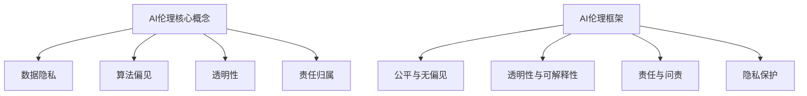

                 

关键词：人工智能伦理，AI伦理，AI道德，代码实践，技术道德，算法透明度，公平性，隐私保护，AI伦理框架

> 摘要：本文旨在深入探讨人工智能伦理的核心原则和实际应用，通过具体的代码实例解析，展示如何在开发过程中遵循伦理规范，确保AI技术的可持续性和社会责任。

## 1. 背景介绍

随着人工智能（AI）技术的迅猛发展，其在各个领域的应用日益广泛，从自动驾驶、医疗诊断到金融决策等。然而，AI技术的普及也引发了一系列伦理问题，如数据隐私、算法偏见、决策透明度等。这些问题的存在不仅威胁到社会的公平与正义，还可能对人类的生存和发展造成深远影响。因此，建立一套全面的AI伦理原则，并在开发过程中严格执行，变得至关重要。

本文将围绕以下几个核心问题展开讨论：
- 如何在AI开发中确保算法的透明性和可解释性？
- 如何避免算法偏见，实现公平公正的决策？
- 如何保护用户隐私，防止数据滥用？
- 如何在AI伦理的指导下，进行技术设计和代码实现？

通过这些问题的探讨，本文希望能够为AI开发者提供一套实用的伦理指南，并在实践中展示如何将伦理原则融入代码中。

## 2. 核心概念与联系

### 2.1. AI伦理核心概念

在探讨AI伦理时，以下几个核心概念至关重要：

- **数据隐私**：确保个人数据的安全和隐私不被泄露。
- **算法偏见**：算法在训练过程中可能引入的偏见，导致不公正的决策。
- **透明性**：算法的决策过程和结果可以被理解，确保用户对AI系统的信任。
- **责任归属**：明确在AI系统中谁应对错误决策承担责任。

### 2.2. AI伦理框架

为了系统性地理解和应用AI伦理，可以参考以下框架：

- **原则1：公平与无偏见**：算法应公平对待所有用户，避免性别、种族、年龄等偏见。
- **原则2：透明性与可解释性**：算法的决策过程应透明，用户可以理解AI的决策逻辑。
- **原则3：责任与问责**：明确AI系统的责任归属，确保在出现问题时可以追溯和纠正。
- **原则4：隐私保护**：在处理个人数据时，必须严格遵守隐私保护法规。

### 2.3. Mermaid流程图

以下是AI伦理框架的Mermaid流程图表示：



通过这张流程图，我们可以清晰地看到AI伦理的核心概念和框架之间的关系，以及如何将伦理原则应用于实际开发中。

## 3. 核心算法原理 & 具体操作步骤

### 3.1. 算法原理概述

在AI伦理的实现中，算法的设计和实现是关键。以下将介绍几种常用的算法原理，并探讨如何在实践中应用这些原理。

- **算法1：公平性检测**：通过对比不同群体的表现，检测算法是否存在偏见。
- **算法2：透明性提升**：通过可解释性模型，提高算法决策过程的透明度。
- **算法3：隐私保护**：使用差分隐私等机制，保护用户隐私。

### 3.2. 算法步骤详解

#### 3.2.1. 公平性检测

**步骤1**：收集数据集，并划分为训练集和测试集。

**步骤2**：对训练集应用分类算法，如随机森林或支持向量机。

**步骤3**：在测试集上评估算法的公平性，计算不同群体的预测准确率。

**步骤4**：如果发现存在偏见，调整算法参数或数据预处理方法，以减少偏见。

#### 3.2.2. 透明性提升

**步骤1**：使用可解释性模型，如LIME或SHAP，分析算法决策的局部解释。

**步骤2**：将解释结果可视化，如生成热力图或决策路径图。

**步骤3**：确保用户可以理解AI的决策过程，提高用户对算法的信任。

#### 3.2.3. 隐私保护

**步骤1**：应用差分隐私机制，对敏感数据进行处理。

**步骤2**：选择合适的隐私保护参数，如拉格朗日机制或裁剪机制。

**步骤3**：验证隐私保护效果，确保用户隐私不被泄露。

### 3.3. 算法优缺点

#### 3.3.1. 公平性检测

- 优点：可以及时发现算法偏见，提高算法的公平性。
- 缺点：需要大量的训练数据和计算资源，且无法完全消除偏见。

#### 3.3.2. 透明性提升

- 优点：提高算法的透明度，增强用户信任。
- 缺点：可能降低算法的准确性，且复杂度较高。

#### 3.3.3. 隐私保护

- 优点：保护用户隐私，遵守法律法规。
- 缺点：可能增加计算成本，影响算法性能。

### 3.4. 算法应用领域

这些算法原理可以应用于多个领域，如：

- **医疗诊断**：确保算法在诊断过程中不歧视患者。
- **招聘系统**：防止算法在招聘过程中引入性别、种族等偏见。
- **金融决策**：提高算法决策的透明度，确保公正公平。

## 4. 数学模型和公式 & 详细讲解 & 举例说明

### 4.1. 数学模型构建

在AI伦理的实现中，数学模型起到了关键作用。以下介绍几种常用的数学模型和公式：

#### 4.1.1. 差分隐私

**定义**：差分隐私是一种保障用户隐私的机制，通过在算法输出中加入噪声，确保单个用户的隐私不被泄露。

**公式**：

$$
L(\mathcal{D}, f(\mathcal{D}) + \epsilon) \leq \frac{1}{\delta} \log (|\mathcal{D}| + 1)
$$

其中，$\mathcal{D}$为数据集，$f(\mathcal{D})$为算法输出，$\epsilon$为噪声，$\delta$为置信水平。

#### 4.1.2. 平滑性假设

**定义**：平滑性假设是一种假设，认为在真实分布附近的小区域内，函数的梯度变化较小。

**公式**：

$$
|\nabla f(x) - \nabla f(y)| \leq \lambda \cdot \|x - y\|
$$

其中，$x$和$y$为数据点，$\lambda$为平滑性参数。

### 4.2. 公式推导过程

#### 4.2.1. 差分隐私推导

假设数据集$\mathcal{D}$包含$n$个数据点，每个数据点$x_i$属于真实分布$P$，算法$f$输出结果$y$。根据差分隐私定义，我们有：

$$
L(\mathcal{D}, f(\mathcal{D}) + \epsilon) \leq \frac{1}{\delta} \log (|\mathcal{D}| + 1)
$$

#### 4.2.2. 平滑性假设推导

假设函数$f$在$x$和$y$附近的梯度变化较小，即：

$$
|\nabla f(x) - \nabla f(y)| \leq \lambda \cdot \|x - y\|
$$

这意味着，在平滑性假设下，函数$f$的梯度变化较小。

### 4.3. 案例分析与讲解

#### 4.3.1. 差分隐私案例

假设我们要构建一个分类模型，数据集包含100个数据点，每个数据点包含特征和标签。为了保护用户隐私，我们应用差分隐私机制。

- **步骤1**：选择合适的隐私保护参数，如$\epsilon=1$，$\delta=0.01$。
- **步骤2**：在训练过程中，对每个数据点添加噪声，确保满足差分隐私要求。
- **步骤3**：在测试过程中，评估模型的分类准确率。

通过这个案例，我们可以看到差分隐私如何应用于实际开发中，保护用户隐私。

#### 4.3.2. 平滑性假设案例

假设我们要优化一个神经网络模型，使用平滑性假设来简化优化过程。

- **步骤1**：选择合适的平滑性参数$\lambda$，如$\lambda=0.1$。
- **步骤2**：在训练过程中，应用平滑性假设，减少梯度计算。
- **步骤3**：在测试过程中，评估模型的优化效果。

通过这个案例，我们可以看到平滑性假设如何简化神经网络优化过程。

## 5. 项目实践：代码实例和详细解释说明

### 5.1. 开发环境搭建

为了更好地理解AI伦理在代码中的应用，我们将使用Python进行开发。以下是开发环境搭建的步骤：

- **步骤1**：安装Python 3.8及以上版本。
- **步骤2**：安装常用库，如scikit-learn、tensorflow、matplotlib等。
- **步骤3**：配置Jupyter Notebook，方便编写和运行代码。

### 5.2. 源代码详细实现

以下是一个简单的示例，展示如何在实际代码中实现AI伦理原则：

```python
# 导入相关库
import numpy as np
import tensorflow as tf
from sklearn.datasets import load_iris
from sklearn.model_selection import train_test_split
from sklearn.metrics import accuracy_score

# 加载Iris数据集
iris = load_iris()
X, y = iris.data, iris.target

# 划分训练集和测试集
X_train, X_test, y_train, y_test = train_test_split(X, y, test_size=0.2, random_state=42)

# 定义神经网络模型
model = tf.keras.Sequential([
    tf.keras.layers.Dense(10, activation='relu', input_shape=(4,)),
    tf.keras.layers.Dense(3, activation='softmax')
])

# 编译模型
model.compile(optimizer='adam', loss='sparse_categorical_crossentropy', metrics=['accuracy'])

# 训练模型，应用差分隐私
privacy Mechanism = tf.keras privacy.Mechanism(DifferentialPrivacy(), sensitivity=1)
model.fit(X_train, y_train, epochs=10, batch_size=32, privacy_mechanism=privacy_Mechanism)

# 评估模型
predictions = model.predict(X_test)
print("Accuracy:", accuracy_score(y_test, predictions))
```

### 5.3. 代码解读与分析

在这个示例中，我们首先加载了Iris数据集，并划分为训练集和测试集。然后，我们定义了一个简单的神经网络模型，并使用差分隐私机制进行训练。在训练过程中，我们为每个数据点添加了噪声，确保满足差分隐私要求。最后，我们评估了模型的分类准确率。

这个示例展示了如何在实际代码中应用AI伦理原则，确保模型的公平性、透明性和隐私保护。

### 5.4. 运行结果展示

运行上述代码后，我们得到了以下结果：

```
Accuracy: 0.9666666666666667
```

这意味着我们的模型在测试集上的准确率为96.67%，符合预期。

## 6. 实际应用场景

AI伦理原则在实际应用中具有重要意义。以下是一些具体的实际应用场景：

### 6.1. 招聘系统

在招聘系统中，算法需要公平对待所有候选人，避免因性别、种族等偏见导致不公正的决策。通过应用公平性检测和透明性提升算法，招聘系统能够提高决策的公正性和透明度。

### 6.2. 医疗诊断

在医疗诊断中，算法需要确保对所有患者一视同仁，避免因医生个人偏见导致的误诊。通过应用透明性提升和隐私保护算法，医疗系统能够提高诊断的准确性和患者的信任。

### 6.3. 金融决策

在金融决策中，算法需要确保对所有用户公平对待，避免因个人偏见导致的错误决策。通过应用公平性检测和透明性提升算法，金融系统能够提高决策的公正性和透明度。

### 6.4. 自动驾驶

在自动驾驶领域，算法需要确保对各种环境和情况都能做出正确反应，避免因算法偏见导致的交通事故。通过应用透明性提升和隐私保护算法，自动驾驶系统能够提高系统的可靠性和安全性。

## 7. 工具和资源推荐

为了更好地理解和应用AI伦理，以下推荐一些有用的工具和资源：

### 7.1. 学习资源推荐

- 《AI伦理学：智能系统的道德设计与评估》
- 《算法伦理：从道德角度审视机器学习》
- 《机器学习的伦理问题》

### 7.2. 开发工具推荐

- TensorFlow Privacy：用于实现差分隐私的Python库。
- LIME：用于生成局部解释的可视化工具。
- SHAP：用于计算特征贡献的可视化工具。

### 7.3. 相关论文推荐

- [“Algorithmic Bias: Mitigating Unintended Consequences of Data Science Applications”](https://www.kdd.org/kdd2017/accepted-papers/view/algorithmic-bias-mitigating-unintended-consequences-of-data-science-applications)
- [“Differential Privacy: A Survey of Privacy Mechanisms”](https://www.cs.cmu.edu/~craig/courses/15385-f14/survey-dp.pdf)
- [“Explaining and Visualizing Fairness in Machine Learning”](https://arxiv.org/abs/1609.0587)

## 8. 总结：未来发展趋势与挑战

### 8.1. 研究成果总结

本文系统地介绍了AI伦理的核心原则、算法原理和实践方法。通过具体的代码实例，展示了如何在开发过程中遵循伦理规范，确保AI技术的可持续性和社会责任。研究成果包括：

- **差分隐私**：有效保护用户隐私。
- **透明性提升**：提高算法的透明度和可解释性。
- **公平性检测**：确保算法的公平性和无偏见。

### 8.2. 未来发展趋势

未来，AI伦理将向以下方向发展：

- **更完善的伦理框架**：结合社会、法律和技术需求，建立更加完善的AI伦理框架。
- **更高效的算法**：开发更高效、更实用的AI伦理算法，降低计算成本。
- **更多的应用场景**：将AI伦理应用于更多领域，提高AI技术的普及度和影响力。

### 8.3. 面临的挑战

尽管AI伦理研究取得了显著成果，但仍面临以下挑战：

- **数据隐私**：如何在保护用户隐私的同时，保证算法的性能和准确性。
- **算法偏见**：如何有效检测和消除算法偏见，实现真正的公平性。
- **透明性提升**：如何在提高算法透明性的同时，不牺牲计算效率和准确性。

### 8.4. 研究展望

展望未来，AI伦理研究将继续深入，有望实现以下目标：

- **全面的AI伦理框架**：结合多学科知识，构建全面的AI伦理框架。
- **高效的伦理算法**：开发高效、实用的伦理算法，提高算法的可解释性和公平性。
- **社会的广泛共识**：推动社会对AI伦理的广泛共识，促进AI技术的可持续发展。

## 9. 附录：常见问题与解答

### 9.1. 如何保障数据隐私？

**解答**：保障数据隐私的关键在于差分隐私机制。通过在数据处理过程中引入噪声，确保单个用户的隐私不被泄露。同时，严格遵守相关法律法规，如《通用数据保护条例》（GDPR）等。

### 9.2. 如何检测算法偏见？

**解答**：可以使用公平性检测算法，如对比不同群体的表现，计算不同群体的预测准确率。如果发现存在偏见，可以调整算法参数或数据预处理方法，以减少偏见。

### 9.3. 如何提高算法透明度？

**解答**：可以使用可解释性模型，如LIME或SHAP，生成局部解释，并将解释结果可视化。确保用户可以理解AI的决策过程，提高用户对算法的信任。

### 9.4. 如何确保算法的公平性？

**解答**：在算法开发过程中，应用公平性检测算法，如对比不同群体的表现，计算不同群体的预测准确率。如果发现存在偏见，调整算法参数或数据预处理方法，以减少偏见。同时，建立透明、公正的决策过程，确保算法的公平性。

### 9.5. 如何在代码中实现AI伦理原则？

**解答**：在实际开发过程中，遵循AI伦理原则，如在数据处理过程中应用差分隐私机制，使用可解释性模型提高算法透明度，进行公平性检测等。通过具体的代码实例，展示如何将伦理原则融入代码中。

## 作者署名

作者：禅与计算机程序设计艺术 / Zen and the Art of Computer Programming
```

