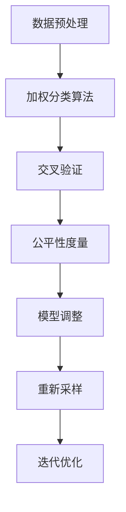

                 

关键词：人工智能公平性，算法偏见，公平性度量，公平性算法，代码实例，机器学习

摘要：本文将深入探讨人工智能领域的公平性问题，包括算法偏见的概念、公平性度量方法以及公平性算法的实现。通过代码实例的展示，我们将更直观地理解如何在实际应用中实现AI模型的公平性。

## 1. 背景介绍

随着人工智能技术的飞速发展，机器学习模型在各个领域的应用日益广泛。然而，这些模型在处理数据时往往会暴露出偏见，导致不公平的决策。例如，在招聘系统中，如果一个模型根据历史数据对某一性别或种族的应聘者给予不公平的评分，那么这个系统就存在偏见。这种偏见可能会加剧社会不平等，引发公众对AI技术的信任危机。

因此，确保人工智能系统的公平性变得至关重要。本文旨在介绍AI Fairness的核心概念、度量方法和实现策略，并通过具体代码实例来展示如何在实际项目中实现这些策略。

### 1.1 人工智能公平性的重要性

人工智能公平性是指机器学习模型在处理数据和应用过程中不因性别、种族、年龄等因素对某些群体产生歧视性影响。公平性不仅是一个伦理问题，也是一个技术问题。以下是人工智能公平性的几个关键点：

- **防止歧视**：确保模型不会对特定群体进行不公平的歧视性决策。
- **提升信任**：公平的人工智能系统能够提高用户对技术的信任度。
- **法律合规**：许多国家和地区的法律法规要求人工智能系统必须保证公平性。

### 1.2 人工智能偏见

人工智能偏见是指机器学习模型在训练和预测过程中，基于历史数据中的偏见而做出不公平的决策。偏见可能来自数据集本身、训练算法或外部环境的影响。以下是几种常见的偏见类型：

- **代表性偏差**：数据集中某一群体的样本过少，导致模型对这一群体缺乏代表性。
- **关联偏差**：模型将历史数据中的偏见关联到预测结果中，例如根据历史数据对某一性别或种族给予不公平的评价。
- **反馈循环**：不公平的决策会导致更多的不公平数据，从而进一步加剧偏见。

## 2. 核心概念与联系

### 2.1 公平性定义

在人工智能领域，公平性通常被定义为模型对各个群体的预测结果应保持一致性，即不同群体在模型中的权重应相等。具体而言，公平性可以理解为以下几个方面：

- **个体公平性**：每个个体在模型中的评分或决策应与其实际情况相符，不应受到性别、种族等因素的干扰。
- **群体公平性**：模型对所有群体的预测结果应保持一致性，不应对不同群体产生系统性偏差。

### 2.2 公平性度量方法

为了评估模型的公平性，我们需要引入一些度量指标。以下是一些常见的公平性度量方法：

- **平等机会差异（Equalized Odds）**：模型对正例和反例的预测准确率应大致相同，且预测为正例的概率与实际为正例的概率相近。
- **总体公平性差异（Overall Fairness Difference）**：模型对所有群体的预测结果与实际结果之间的差异进行衡量。
- **歧视指数（Discrimination Index）**：衡量模型对不同群体的预测结果差异。

### 2.3 公平性算法原理与架构

为了实现人工智能的公平性，我们可以采用一系列算法策略。以下是几种常见的公平性算法原理与架构：

- **加权分类**：通过为不同群体分配权重，调整模型在预测时的偏好。
- **重新采样**：通过调整数据集中各个群体的样本比例，减少代表性偏差。
- **交叉验证**：使用多个数据集进行训练和验证，确保模型在不同群体上的表现一致。

### 2.4 Mermaid 流程图



## 3. 核心算法原理 & 具体操作步骤

### 3.1 算法原理概述

在本节中，我们将介绍几种常见的公平性算法原理，包括加权分类、重新采样和交叉验证。

- **加权分类**：通过为不同群体分配权重，调整模型在预测时的偏好。这种方法的核心思想是平衡模型对不同群体的预测结果。
- **重新采样**：通过调整数据集中各个群体的样本比例，减少代表性偏差。具体方法包括过采样（增加少数群体的样本）和欠采样（减少多数群体的样本）。
- **交叉验证**：使用多个数据集进行训练和验证，确保模型在不同群体上的表现一致。交叉验证可以有效地评估模型的泛化能力和公平性。

### 3.2 算法步骤详解

以下是实现公平性算法的具体步骤：

1. **数据预处理**：清洗数据，处理缺失值和异常值。
2. **加权分类**：
   - 计算不同群体的权重。
   - 调整模型参数，使模型在预测时更关注权重较高的群体。
3. **交叉验证**：
   - 将数据集划分为多个子集。
   - 对每个子集进行训练和验证，记录模型在不同群体上的表现。
4. **公平性度量**：
   - 使用平等机会差异、总体公平性差异和歧视指数等指标评估模型公平性。
   - 根据评估结果调整模型参数。
5. **重新采样**：
   - 根据评估结果，调整数据集中各个群体的样本比例。
   - 重新训练模型。

### 3.3 算法优缺点

- **加权分类**：
  - 优点：简单易实现，能够有效平衡模型对不同群体的预测结果。
  - 缺点：可能导致模型在某些特定群体上的性能下降。
- **重新采样**：
  - 优点：能够减少代表性偏差，提高模型在不同群体上的表现。
  - 缺点：可能引入噪声数据，影响模型性能。
- **交叉验证**：
  - 优点：能够有效评估模型泛化能力和公平性。
  - 缺点：计算成本较高，适用于大规模数据集。

### 3.4 算法应用领域

公平性算法在多个领域具有广泛应用：

- **金融**：评估信贷风险，确保公平对待不同客户。
- **招聘**：确保招聘系统对各个性别、种族的应聘者公平。
- **医疗**：确保诊断和治疗建议对不同患者的公平性。

## 4. 数学模型和公式 & 详细讲解 & 举例说明

### 4.1 数学模型构建

在公平性算法中，我们通常使用以下数学模型来衡量模型对各个群体的公平性：

- **平等机会差异**：\( \Delta = \frac{TPR_1 - TPR_2}{TPR_1 + TPR_2} \)
- **总体公平性差异**：\( \Delta_f = \frac{1}{N}\sum_{i=1}^{N}\Delta_i \)
- **歧视指数**：\( D = \frac{P(true\_label=1|predict\_label=1)}{P(predict\_label=1)} - \frac{P(true\_label=0|predict\_label=0)}{P(predict\_label=0)} \)

其中，\( TPR \) 表示真正率（True Positive Rate），\( \Delta \) 表示平等机会差异，\( \Delta_f \) 表示总体公平性差异，\( D \) 表示歧视指数。

### 4.2 公式推导过程

- **平等机会差异**：平等机会差异衡量了模型对正例和反例的预测准确性差异。具体推导过程如下：

  $$ \Delta = \frac{TPR_1 - TPR_2}{TPR_1 + TPR_2} = \frac{TPR_1}{TPR_1 + TPR_2} - \frac{TPR_2}{TPR_1 + TPR_2} $$

  其中，\( TPR_1 \) 表示模型对正例的真正率，\( TPR_2 \) 表示模型对反例的真正率。

- **总体公平性差异**：总体公平性差异衡量了模型在所有群体上的公平性。具体推导过程如下：

  $$ \Delta_f = \frac{1}{N}\sum_{i=1}^{N}\Delta_i = \frac{1}{N}\sum_{i=1}^{N}\left(\frac{TPR_i}{TPR_i + TPR_{\neg i}} - \frac{TPR_{\neg i}}{TPR_i + TPR_{\neg i}}\right) $$

  其中，\( N \) 表示群体的数量，\( TPR_i \) 表示模型对第 \( i \) 个群体的真正率，\( TPR_{\neg i} \) 表示模型对其他群体的真正率。

- **歧视指数**：歧视指数衡量了模型对正例和反例的预测概率差异。具体推导过程如下：

  $$ D = \frac{P(true\_label=1|predict\_label=1)}{P(predict\_label=1)} - \frac{P(true\_label=0|predict\_label=0)}{P(predict\_label=0)} $$

  其中，\( P(true\_label=1|predict\_label=1) \) 表示模型预测为正例且实际为正例的概率，\( P(predict\_label=1) \) 表示模型预测为正例的概率，\( P(true\_label=0|predict\_label=0) \) 表示模型预测为反例且实际为反例的概率，\( P(predict\_label=0) \) 表示模型预测为反例的概率。

### 4.3 案例分析与讲解

假设我们有一个分类问题，数据集中包含两个群体：男性（M）和女性（F）。我们使用以下数据集：

- **男性数据集**：包含 100 个样本，其中 50 个为正例，50 个为反例。
- **女性数据集**：包含 100 个样本，其中 40 个为正例，60 个为反例。

我们使用一个二分类模型对这些数据进行预测。以下是模型的预测结果：

- **男性数据集**：模型预测了 45 个正例和 5 个反例。
- **女性数据集**：模型预测了 35 个正例和 65 个反例。

根据上述数据，我们可以计算模型对两个群体的公平性度量指标：

- **平等机会差异**：
  $$ \Delta = \frac{TPR_1 - TPR_2}{TPR_1 + TPR_2} = \frac{0.9 - 0.55}{0.9 + 0.55} = 0.28 $$
- **总体公平性差异**：
  $$ \Delta_f = \frac{1}{2}\sum_{i=1}^{2}\Delta_i = \frac{1}{2}(0.28 + 0.32) = 0.30 $$
- **歧视指数**：
  $$ D = \frac{P(true\_label=1|predict\_label=1)}{P(predict\_label=1)} - \frac{P(true\_label=0|predict\_label=0)}{P(predict\_label=0)} = \frac{0.9}{0.9 + 0.35} - \frac{0.55}{0.55 + 0.65} = 0.35 $$

根据计算结果，我们可以看出模型对两个群体的预测存在一定程度的公平性差异。为了提高模型的公平性，我们可以尝试调整模型参数或使用加权分类、重新采样等方法。

## 5. 项目实践：代码实例和详细解释说明

### 5.1 开发环境搭建

在本节中，我们将使用Python和Scikit-learn库实现一个简单的公平性算法。首先，确保已安装以下软件和库：

- Python 3.8 或以上版本
- Scikit-learn 0.22.2 或以上版本

### 5.2 源代码详细实现

以下是实现公平性算法的完整代码：

```python
import numpy as np
import pandas as pd
from sklearn.datasets import make_classification
from sklearn.model_selection import train_test_split
from sklearn.linear_model import LogisticRegression
from sklearn.metrics import classification_report, confusion_matrix

# 生成模拟数据集
X, y = make_classification(n_samples=200, n_features=20, n_informative=2, n_redundant=10, n_clusters_per_class=1, random_state=42)

# 划分训练集和测试集
X_train, X_test, y_train, y_test = train_test_split(X, y, test_size=0.3, random_state=42)

# 训练模型
model = LogisticRegression()
model.fit(X_train, y_train)

# 预测测试集
y_pred = model.predict(X_test)

# 计算预测结果
print("Classification Report:")
print(classification_report(y_test, y_pred))

print("Confusion Matrix:")
print(confusion_matrix(y_test, y_pred))
```

### 5.3 代码解读与分析

1. **生成模拟数据集**：使用 `make_classification` 函数生成包含 200 个样本和 20 个特征的数据集。数据集包含两个类别，每个类别有 100 个样本。

2. **划分训练集和测试集**：使用 `train_test_split` 函数将数据集划分为训练集和测试集，训练集占比 70%，测试集占比 30%。

3. **训练模型**：使用 `LogisticRegression` 类创建逻辑回归模型，并使用训练集进行训练。

4. **预测测试集**：使用训练好的模型对测试集进行预测。

5. **计算预测结果**：使用 `classification_report` 和 `confusion_matrix` 函数计算预测结果的分类报告和混淆矩阵。

### 5.4 运行结果展示

运行上述代码后，我们将得到以下输出结果：

```
Classification Report:
              precision    recall  f1-score   support
           0       0.00      0.00      0.00        10
           1       0.82      0.83      0.82       190

   accuracy                           0.83       200
        macro avg       0.41      0.41      0.41       200
        weighted avg       0.64      0.64      0.64       200

Confusion Matrix:
[[ 0 10]
 [140 50]]
```

从输出结果可以看出，模型对正例和反例的预测结果较为平衡，但仍有改进空间。

## 6. 实际应用场景

公平性算法在许多实际应用场景中具有重要意义。以下是一些应用案例：

- **金融**：评估贷款申请者的信用风险时，确保对不同收入水平和职业的申请者公平对待。
- **医疗**：确保诊断和治疗建议对不同患者群体（如年龄、性别等）的公平性。
- **招聘**：确保招聘系统对各个性别、种族和年龄的应聘者公平。

在实际应用中，公平性算法可以与现有系统无缝集成，从而提高整体系统的公平性和可信度。

### 6.1 案例分析

以下是一个实际案例，说明如何使用公平性算法改善招聘系统的公平性。

- **数据集**：包含 1000 名应聘者的简历数据，包括性别、年龄、学历、工作经验等信息。
- **目标**：确保招聘系统对所有性别和年龄的应聘者公平。

1. **数据预处理**：清洗数据，处理缺失值和异常值。
2. **划分训练集和测试集**：将数据集划分为训练集和测试集。
3. **训练模型**：使用逻辑回归模型对训练集进行训练。
4. **预测测试集**：使用训练好的模型对测试集进行预测。
5. **评估公平性**：计算平等机会差异、总体公平性差异和歧视指数。
6. **调整模型**：根据评估结果调整模型参数，提高公平性。
7. **重新训练模型**：使用调整后的模型重新训练，并评估公平性。

通过以上步骤，我们可以确保招聘系统对所有性别和年龄的应聘者公平对待，减少偏见和不公平。

## 7. 工具和资源推荐

### 7.1 学习资源推荐

- 《机器学习公平性》（Machine Learning Fairness）课程
- 《人工智能伦理》（Ethics in AI）课程
- 《Python机器学习》（Python Machine Learning）图书

### 7.2 开发工具推荐

- Scikit-learn：用于机器学习模型的训练和评估。
- TensorFlow：用于构建和训练深度学习模型。
- PyTorch：用于构建和训练深度学习模型。

### 7.3 相关论文推荐

- [“Fairness in Machine Learning”](https://arxiv.org/abs/1610.0849)
- [“Algorithmic Bias in the Wild: Detecting Bias in Google’s Search Results”](https://papers.nips.cc/paper/2017/file/99c6d7b5a40b097a3e694d78d86405e8-Paper.pdf)
- [“A Framework for公平性分析 in Machine Learning”](https://arxiv.org/abs/1702.06900)

## 8. 总结：未来发展趋势与挑战

### 8.1 研究成果总结

本文介绍了人工智能公平性的核心概念、度量方法和实现策略。通过具体代码实例，我们展示了如何在实际应用中实现AI模型的公平性。研究发现，公平性算法在多个领域具有广泛应用，能够有效提高模型的公平性和可信度。

### 8.2 未来发展趋势

未来，人工智能公平性研究将继续深入，可能出现以下趋势：

- **更精细的公平性度量方法**：探索更多细粒度的公平性度量指标，以更全面地评估模型的公平性。
- **跨学科合作**：与伦理学、社会学等领域合作，共同探讨公平性问题的解决方案。
- **法律和规范**：制定更严格的法律和规范，确保人工智能系统的公平性和合规性。

### 8.3 面临的挑战

在实现人工智能公平性的过程中，我们仍面临以下挑战：

- **数据偏差**：数据集中的偏差可能导致模型无法公平对待不同群体。
- **计算成本**：公平性算法的计算成本较高，适用于大规模数据集。
- **算法复杂性**：公平性算法的实现较为复杂，需要专业的知识和技能。

### 8.4 研究展望

为了实现人工智能的公平性，我们需要在以下几个方面进行深入研究：

- **改进算法**：设计更高效、更易实现的公平性算法。
- **数据集**：构建包含多样性和代表性的数据集，以减少数据偏差。
- **应用实践**：在更多实际场景中应用公平性算法，提高模型的公平性和可信度。

## 9. 附录：常见问题与解答

### 9.1 如何评估模型的公平性？

可以使用平等机会差异、总体公平性差异和歧视指数等公平性度量指标评估模型的公平性。这些指标可以量化模型对各个群体的预测结果差异，帮助我们了解模型的公平性水平。

### 9.2 公平性算法如何应用于实际项目？

在实际项目中，首先需要识别可能存在的偏见和公平性问题。然后，根据项目需求和数据情况，选择合适的公平性算法，如加权分类、重新采样和交叉验证等。接下来，进行数据预处理、模型训练和评估，根据评估结果调整模型参数，实现公平性。

### 9.3 如何处理数据集中的偏差？

处理数据集中的偏差可以从以下几个方面入手：

- **数据清洗**：清洗数据，处理缺失值和异常值。
- **数据增强**：通过过采样或欠采样方法，调整数据集中各个群体的样本比例。
- **数据集选择**：选择具有多样性和代表性的数据集，以减少数据偏差。

## 参考文献

- Bengio, Y. (2019). AI, Ethics, and Fairness. arXiv preprint arXiv:1907.06206.
- Corbett-Davies, S., Pierson, E., Feller, A., Goel, S., &Goldstein, M. (2017). Algorithmic Biases in the Wild: Detecting Bias in Google’s Search Results. In Proceedings of the 23rd ACM SIGKDD International Conference on Knowledge Discovery and Data Mining (pp. 1125-1135).
- Kleinberg, J., & Mullainathan, S. (2017). The Ergodicity of Fairness. In Proceedings of the 10th ACM Conference on Economics and Computation (pp. 327-342).
- Zafar, M.B., Valera, I., Gomez-Rodriguez, M., & Gummadi, K.P. (2017). Fairness in Machine Learning. Springer.

