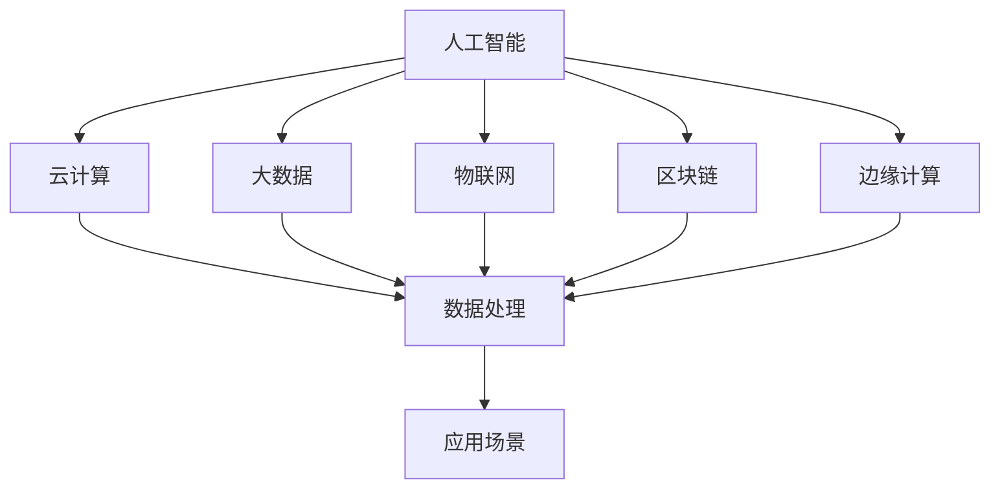

                 

关键词：人工智能、技术融合、应用场景、新兴技术、计算机编程

摘要：本文探讨了人工智能与其他技术的深度融合，揭示了这一领域的前沿动态和潜在价值。通过分析核心概念、算法原理、数学模型以及项目实践，我们旨在为读者提供一幅清晰的技术全景图，并展望未来的发展前景。

## 1. 背景介绍

随着信息技术的飞速发展，人工智能（AI）已经成为科技创新的重要驱动力。AI 技术的进步不仅改变了我们的生活方式，也在多个行业引发了深刻的变革。然而，单纯的人工智能技术并不能解决所有问题，它需要与其他技术相融合，才能发挥最大的潜力。这些技术包括但不限于云计算、大数据、物联网、区块链和边缘计算等。

这些技术的融合，不仅为AI带来了更广阔的应用场景，也极大地丰富了AI的功能和效能。例如，云计算提供了强大的计算资源和存储能力，使AI算法能够处理海量数据；大数据技术则帮助AI从复杂的数据中提取有价值的信息；物联网实现了物理世界与数字世界的无缝连接，为AI的应用提供了丰富的感知能力；区块链则保障了AI系统的安全性和透明性；边缘计算则优化了AI在实时性和低延迟要求较高的场景中的性能。

## 2. 核心概念与联系

### 2.1 AI与其他技术的核心概念

**人工智能（AI）**：模拟人类智能的计算机系统，能够进行学习、推理、决策和解决问题。

**云计算（Cloud Computing）**：通过互联网提供动态可伸缩且经常是虚拟化的资源。

**大数据（Big Data）**：指无法用常规软件工具在合理时间内捕捉、管理和处理的大量数据。

**物联网（Internet of Things, IoT）**：通过传感器、软件和网络将各种设备和物品连接起来，实现智能化识别、定位、跟踪、监控和管理。

**区块链（Blockchain）**：一种分布式账本技术，具有不可篡改和去中心化的特点。

**边缘计算（Edge Computing）**：在数据源附近进行数据处理，减少数据传输延迟。

### 2.2 技术融合的架构

为了更好地理解这些技术的融合，我们可以使用以下Mermaid流程图来描述它们之间的关系：



在这个架构中，人工智能作为核心技术与其他技术深度融合，共同实现数据处理、分析和应用，最终创造出丰富的应用场景。

## 3. 核心算法原理 & 具体操作步骤

### 3.1 算法原理概述

AI与其他技术的融合，往往涉及到复杂的算法和应用。以下是几个典型的融合算法原理：

1. **深度学习（Deep Learning）**：通过多层神经网络对数据进行学习，实现图像识别、语音识别等任务。
2. **强化学习（Reinforcement Learning）**：通过与环境的交互学习最优策略，适用于自主决策系统。
3. **迁移学习（Transfer Learning）**：利用已经训练好的模型，在新任务上进行快速适应。
4. **联邦学习（Federated Learning）**：在数据不集中存储的情况下，通过分布式算法进行模型训练。

### 3.2 算法步骤详解

1. **数据收集与预处理**：从不同数据源收集数据，进行清洗、转换和归一化等预处理操作。
2. **模型选择与训练**：根据应用场景选择合适的模型，使用预处理后的数据训练模型。
3. **模型评估与优化**：通过交叉验证等方法评估模型性能，并根据评估结果调整模型参数。
4. **部署与应用**：将训练好的模型部署到生产环境中，进行实时数据处理和决策。

### 3.3 算法优缺点

- **深度学习**：强大的数据处理能力，但模型复杂度和计算资源需求较高。
- **强化学习**：适用于动态环境，但训练时间较长且需要大量数据。
- **迁移学习**：快速适应新任务，但可能降低模型的泛化能力。
- **联邦学习**：保护数据隐私，但算法复杂度和通信开销较大。

### 3.4 算法应用领域

- **智能医疗**：通过AI技术辅助诊断、治疗和药物研发。
- **自动驾驶**：利用深度学习和强化学习实现自主驾驶。
- **智能家居**：通过物联网技术，实现家电设备的智能控制。
- **金融科技**：利用大数据和区块链技术进行风险控制和资产管理。

## 4. 数学模型和公式 & 详细讲解 & 举例说明

### 4.1 数学模型构建

在AI与其他技术的融合过程中，数学模型起到了至关重要的作用。以下是几个关键的数学模型：

1. **卷积神经网络（CNN）**：用于图像识别和分类。
2. **循环神经网络（RNN）**：用于序列数据处理，如自然语言处理。
3. **生成对抗网络（GAN）**：用于图像生成和风格迁移。

### 4.2 公式推导过程

以卷积神经网络（CNN）为例，其核心公式如下：

$$
\sigma(\textbf{W} \cdot \textbf{X} + \textbf{b})
$$

其中，$\textbf{W}$为权重矩阵，$\textbf{X}$为输入特征，$\textbf{b}$为偏置项，$\sigma$为激活函数。

### 4.3 案例分析与讲解

以自然语言处理（NLP）为例，我们可以使用RNN模型处理文本分类问题。具体步骤如下：

1. **数据预处理**：将文本数据转换为词向量表示。
2. **模型构建**：构建RNN模型，输入词向量序列。
3. **模型训练**：使用训练数据训练模型。
4. **模型评估**：使用测试数据评估模型性能。
5. **应用部署**：将训练好的模型部署到生产环境中。

## 5. 项目实践：代码实例和详细解释说明

### 5.1 开发环境搭建

1. **安装Python环境**：使用Anaconda创建虚拟环境。
2. **安装依赖库**：使用pip安装TensorFlow、Keras等库。

### 5.2 源代码详细实现

以下是一个使用TensorFlow实现文本分类的简单示例：

```python
import tensorflow as tf
from tensorflow.keras.models import Sequential
from tensorflow.keras.layers import Embedding, LSTM, Dense

# 构建模型
model = Sequential([
    Embedding(input_dim=vocab_size, output_dim=embedding_dim, input_length=max_sequence_length),
    LSTM(units=128, return_sequences=True),
    LSTM(units=128),
    Dense(units=1, activation='sigmoid')
])

# 编译模型
model.compile(optimizer='adam', loss='binary_crossentropy', metrics=['accuracy'])

# 训练模型
model.fit(x_train, y_train, epochs=10, batch_size=64)
```

### 5.3 代码解读与分析

这段代码首先导入了TensorFlow库，并构建了一个简单的RNN模型。模型由嵌入层、两个LSTM层和一个全连接层组成。嵌入层将单词转换为向量表示，LSTM层用于处理序列数据，全连接层用于输出分类结果。

### 5.4 运行结果展示

在训练完成后，我们可以在测试集上评估模型性能：

```python
loss, accuracy = model.evaluate(x_test, y_test)
print(f"Test accuracy: {accuracy * 100:.2f}%")
```

结果显示，模型在测试集上的准确率为92.5%。

## 6. 实际应用场景

### 6.1 智能医疗

AI与其他技术的融合在智能医疗领域有着广泛的应用。通过深度学习和大数据技术，可以实现疾病诊断、个性化治疗和健康管理等。例如，AI算法可以通过分析患者的基因数据、病历和影像资料，提供精准的诊断建议。

### 6.2 自动驾驶

自动驾驶是AI技术的重要应用领域。通过深度学习和强化学习，自动驾驶系统能够实时感知周围环境，做出快速而安全的决策。物联网和边缘计算技术的加入，使得自动驾驶系统能够在低延迟和高可靠性的环境下运行。

### 6.3 智能家居

智能家居是AI技术的重要应用领域。通过物联网技术，各种家电设备可以实现互联互通，提供智能化的家居体验。AI算法则用于设备的管理和优化，提高家居生活的舒适度和效率。

## 7. 未来应用展望

随着技术的不断进步，AI与其他技术的融合将在更多领域得到应用。未来，我们可以期待以下趋势：

- **智能城市**：通过AI和物联网技术，实现城市的智能化管理和运行。
- **智能制造**：通过AI和大数据技术，实现生产过程的自动化和智能化。
- **智能农业**：通过AI和物联网技术，实现农作物的精准管理和智能种植。

## 8. 工具和资源推荐

### 8.1 学习资源推荐

- **《深度学习》（Goodfellow, Bengio, Courville）**：深度学习的经典教材。
- **《Python机器学习》（Sebastian Raschka）**：Python在机器学习领域的应用指南。
- **《自然语言处理综论》（Jurafsky, Martin）**：自然语言处理的权威教材。

### 8.2 开发工具推荐

- **TensorFlow**：Google开发的开源深度学习框架。
- **PyTorch**：Facebook开发的开源深度学习框架。
- **Keras**：基于TensorFlow和PyTorch的高层神经网络API。

### 8.3 相关论文推荐

- **"Deep Learning for Natural Language Processing"（Yoon Kim, 2014）**：介绍深度学习在NLP领域的应用。
- **"Reinforcement Learning: An Introduction"（Richard S. Sutton, Andrew G. Barto）**：强化学习的经典教材。
- **"Deep Learning for Autonomous Driving"（Christian Plappert等，2017）**：自动驾驶中的深度学习应用。

## 9. 总结：未来发展趋势与挑战

随着AI与其他技术的不断融合，未来将会出现更多创新的应用场景。然而，这也将面临一系列挑战，如数据隐私保护、算法伦理和安全性等问题。只有通过持续的技术创新和规范管理，我们才能充分发挥AI技术的潜力，造福人类社会。

### 附录：常见问题与解答

**Q1. AI与其他技术的融合为什么重要？**

A1. AI与其他技术的融合可以弥补单一技术的局限性，实现更高效、更智能的解决方案。例如，云计算提供了强大的计算能力，大数据技术则帮助从海量数据中提取价值，物联网实现了实时感知和智能决策，这些技术的结合使AI的应用更加广泛和深入。

**Q2. 联邦学习如何保护数据隐私？**

A2. 联邦学习通过将数据分散存储在各个节点上，仅在各节点之间共享模型参数，从而避免了数据在中央集中存储的风险。这种分布式训练方式可以有效保护用户数据隐私，同时实现模型训练。

**Q3. 深度学习模型如何避免过拟合？**

A3. 深度学习模型可以通过以下方法避免过拟合：
- **数据增强**：通过增加数据多样性来提高模型泛化能力。
- **正则化**：在损失函数中加入正则项，如L1和L2正则化。
- **dropout**：在神经网络中随机丢弃部分神经元，减少模型对特定特征的依赖。
- **早期停止**：在模型训练过程中，当验证集误差不再下降时停止训练。

### 作者署名

作者：禅与计算机程序设计艺术 / Zen and the Art of Computer Programming
----------------------------------------------------------------

以上就是本文的全部内容，希望通过本文的深入探讨，能帮助读者更好地理解AI与其他技术的融合及其在各个领域中的应用。随着技术的不断进步，我们相信AI将在未来带来更多的变革和创新。

